## 目录 {#toc0 }

- [**离散时间线性时不变系统**](#sec21-dtlti)
  - [用脉冲表示离散时间信号](#sec211)
  - [离散时间线性时不变系统的单位脉冲响应及卷积和表示](#sec212)
- [连续时间线性时不变系统](#sec22-ctlti)
  - [用冲激表示连续时间信号](#sec221)
  - [连续时间线性时不变系统的单位冲激响应及卷积和表示](#sec222)
- [线性时不变系统的性质](#sec23-propertylti)
  - [线性时不变系统的交换律、分配律与结合律](#sec231)
  - [线性时不变系统的记忆性、可逆性、因果性和稳定性](#sec235)
  - [线性时不变系统的单位阶跃响应](#sec238)
- [用微分方程和差分方程描述的因果线性时不变系统](#sec24ltiodede)
  - [线性常系数微分方程](#sec241)
  - [线性常系数差分方程](#sec242)
  - [一阶系统的方框图表示](#sec243)
- [奇异函数](#sec25-siglarityfunction)


# 离散时间线性时不变系统 {#sec21-dtlti}

---

## 用脉冲表示离散时间信号  {#sec211}

离散时间单位脉冲函数

$$
\delta[n]= \begin{cases}1, & n=0 \\ 0, & n \neq 0\end{cases}
$$

$\mathbb{C}^{\mathbb{Z}}=\{x[n] \in \mathbb{C}: n \in \mathbb{Z}\}$, 由复数构成的双向无限序列所组成的空间

$$
x=\sum_{k=-\infty}^{\infty} x[k] \tau_{k} \delta, \quad \text { or } \quad x[n]=\sum_{k=-\infty}^{\infty} x[k] \delta[n-k], \forall n \in \mathbb{Z}
$$

以上称为离散时间单位冲激的抽样（筛选）性质

$$\begin{aligned} x[-1] \delta[n+1] & = \begin{cases}x[-1], & n=-1 \\ 0, & n \neq-1\end{cases} \\ x[0] \delta[n] & = \begin{cases}x[0], & n=0 \\ 0, & n \neq 0\end{cases} \\ x[1] \delta[n-1] & = \begin{cases}x[1], & n=1 \\ 0, & n \neq 1\end{cases} \end{aligned}$$


---

## 用脉冲表示离散时间信号 
例子：$x[n]=\sum_{k=-\infty}^{\infty} x[k] \delta[n-k], \forall n \in \mathbb{Z}$

$$\begin{aligned} x[n]=\cdots & +x[-3] \delta[n+3]+x[-2] \delta[n+2]+x[-1] \delta[n+1]+x[0] \delta[n] \\ & +x[1] \delta[n-1]+x[2] \delta[n-2]+x[3] \delta[n-3]+\cdots\end{aligned}$$

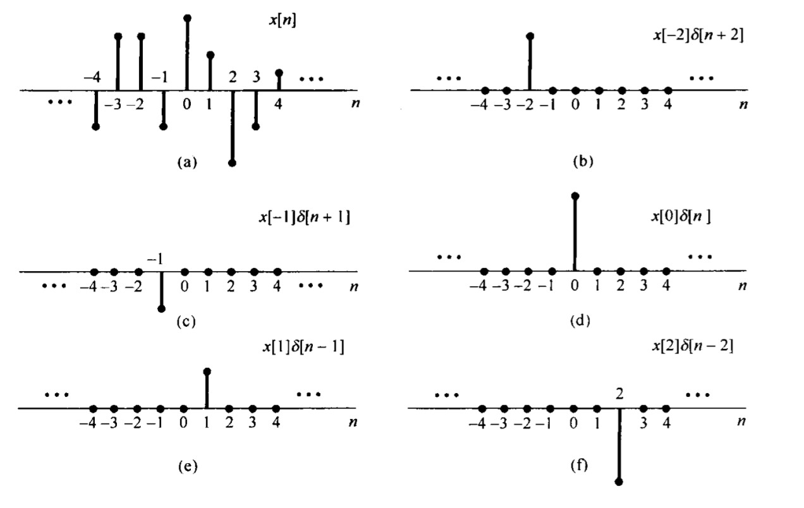


## 离散时间线性系统的单位脉冲响应与卷积和表示 {#sec212}

令$h_{k}=T\left(\tau_{k} \delta\right)$ 代表线性时不变系统对移位脉冲（$\tau_{k} \delta$）的响应 ：

$$
y=T(x)=T\left(\sum_{k=-\infty}^{\infty} x[k] \tau_{k} \delta\right)=\sum_{k=-\infty}^{\infty} x[k] T\left(\tau_{k} \delta\right)=\sum_{k=-\infty}^{\infty} x[k] h_{k}
$$

一般情况下, 不同的 $k$对应的$h_{k}$ 之间彼此无关。

$$
\begin{gathered}
h=T(\delta) \\
\text { 时不变性 } \Longrightarrow h_{k}=T\left(\tau_{k} \delta\right)=\tau_{k}(T(\delta))=\tau_{k} h = h[n-k] 
\end{gathered}
$$
其中，$h[n]=h_0[n]$定义为为**单位脉冲的序列响应**。

这个结果称为**卷积和**或者**叠加和**。

LTI 系统的响应——卷积和

$$
y=\sum_{k=-\infty}^{\infty} x[k] \tau_{k} h, \quad \text { or } \quad y[n]=\sum_{k=-\infty}^{\infty} x[k] h[n-k], \forall n \in \mathbb{Z}
$$

离散LTI 系统完全由单位脉冲响应刻画！

反之， 若给定$h(n)$, 系统 $T(x) \triangleq \sum_{k=-\infty}^{\infty} x[k] \tau_{k} h$ 也是线性时不变的。

## 离散时间线性系统的单位脉冲响应与卷积和表示
例：
<!-- 
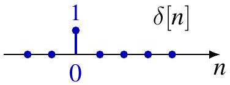
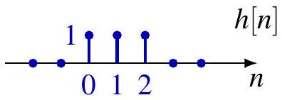
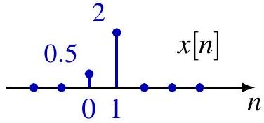
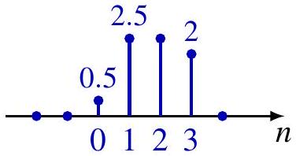
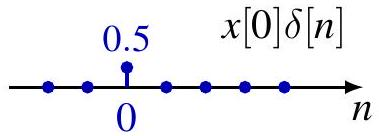
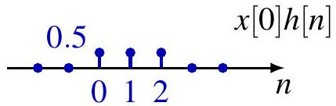
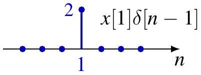
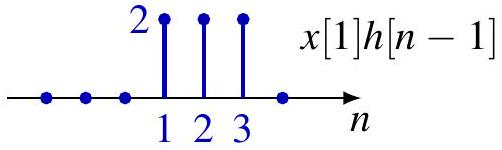
 -->

:::: {.columns style="text-align: center;"}

::: {.column width="50%"}

<br>

<br>


:::

::: {.column width="50%"}
 

<br>
<br>

{style="position: relative; left: 30px;"}


:::
::::
上述过程可以看作是在$k$时刻$x[k]$作用下，$h[n]$系统的所有时刻响应，然后把所有的$x[k]$作用下的响应叠加起来就是系统的最终输出。（线性系统的叠加性）。

## 离散时间线性系统的单位脉冲响应与卷积和表示
还是这个例子，换个视角，用反转-移位的方法做：

:::: {.columns style="text-align: center;"}

::: {.column width="55%"}

序列 $h[n-k]$ 看成固定 $n$ 时 $k$ 的函数，$h[n-k]$ 是单位脉冲响应 $h[k]$ 的时间反转与移位(思考一下物理意义)。

$$
y[0]=\sum_{k=-\infty}^{\infty} x[k] h[0-k]=0.5
$$

序列 $x[k]$ 与序列 $h[1-k]$ 的乘积有两个非零样本，相加之后得

$$
y[1]=\sum_{k=-\infty}^{\infty} x[k] h[1-k]=0.5+2.0=2.5
$$

$$
y[2]=\sum_{k=-\infty}^{\infty} x[k] h[2-k]=0.5+2.0=2.5
$$

$$
y[3]=\sum_{k=-\infty}^{\infty} x[k] h[3-k]=2.0
$$
:::

::: {.column width="45%"}

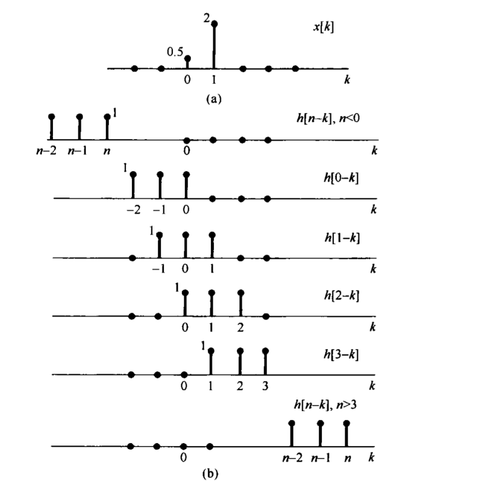
:::
::::

系统在$n$时刻的总输出$y[n]$由历史上各个时刻的有效因果输入激励$x[k]$的响应累加获得！

---


## 简单 LTI 系统的冲激响应

恒等系统

$$
h[n]=\delta[n]
$$

比例（标量）放大

$$
h[n]=K \delta[n]
$$

时移

$$
h[n]=\delta_{a}[n] \triangleq \delta[n-a]
$$

累加器

$$
h[n]=\sum_{k=-\infty}^{n} \delta[k]=u[n]
$$

一阶差分

$$
h[n]=\delta[n]-\delta[n-1]
$$


<!-- ## 序列的卷积

$$
\left(x_{1} * x_{2}\right)[n]=\sum_{k=-\infty}^{\infty} x_{1}[k] x_{2}[n-k], \quad \forall n \in \mathbb{Z}
$$

对任意信号并不总是有定义 $x_{1}$ and $x_{2}$
例： For $x_{1}[n]=u[n]=x_{2}[-n]$, sum divergent for all $n$.

绝对收敛的充分条件

1. Either $x_{1}$ or $x_{2}$ has finite support $\operatorname{supp} x=\{n: x[n] \neq 0\}$, i.e. $x_{1}[n]$ or $x_{2}[n]$ nonzero only for finitely many $n$.
2. $x_{1}, x_{2}$ both 右边信号（右支撑） (or 左边信号（左支撑）), i.e. $x_{i}[n]=0$ for $n \leq n_{i}$ (or $\left.n \geq n_{i}\right), \forall i \Longrightarrow x_{1} * x_{2}$ also 右边信号（右支撑） (or 左边信号（左支撑）)

## 序列的卷积

绝对收敛的充分条件 (cont'd)
3. One of $x_{1}$ and $x_{2}$ has finite $\ell_{1}$ norm and the other finite $\ell_{p}$ norm for $1 \leq p \leq \infty$, where $\ell_{p}$ norm

$$
\|x\|_{p} \triangleq \begin{cases}\left(\sum_{n=-\infty}^{\infty}|x[n]|^{p}\right)^{1 / p}, & \text { if } 1 \leq p<\infty \\ \sup _{n \in \mathbb{Z}}|x[n]|, & \text { if } p=\infty .\end{cases}
$$

If $\left\|x_{1}\right\|_{1}<\infty$, then $\left\|x_{1} * x_{2}\right\|_{p} \leq\left\|x_{1}\right\|_{1} \cdot\left\|x_{2}\right\|_{p}$.
4. $\left\|x_{1}\right\|_{p}<\infty$ and $\left\|x_{2}\right\|_{q}<\infty$ for $1 \leq p, q \leq \infty$ and $p^{-1}+q^{-1}=1$. In this case, $\left\|x_{1} * x_{2}\right\|_{\infty} \leq\left\|x_{1}\right\|_{p} \cdot\left\|x_{2}\right\|_{q}$. -->

## 卷积的计算方法

1. **绘制信号**

   将 $x_{1}$ 和 $x_{2}$ 表示为自变量 $k$ 的函数，即绘制$x_{1}[k], \quad x_{2}[k]$

2. **信号反转（序列翻转）**

   将 $x_{2}$ 关于原点反转，得到 $R x_{2}$，即$R x_{2} = x_{2}[-k]$

3. **序列平移**

   对于给定的 $n$，将 $R x_{2}$ 向右平移 $n$，得到$\tau_{n}(R x_{2}) = x_{2}[n-k]$

4. **逐点相乘**

   将 $x_{1}$ 与 $\tau_{n}(R x_{2})$ 按分量逐点相乘，得到序列$g_{n} = x_{1} \cdot \tau_{n}(R x_{2})$，即

   $$
   g_{n}[k] = x_{1}[k]\,x_{2}[n-k]
   $$

5. **求和得到卷积结果**

   对 $g_{n}$ 关于 $k$ 求和，得到离散卷积

   $$
   (x_{1} * x_{2})[n]
   =
   \sum_{k=-\infty}^{\infty} g_{n}[k]
   $$

6. **对每个 $n$ 重复上述步骤**： 对不同的 $n$ 重复步骤 1–5，即可得到完整的卷积序列 $(x_{1} * x_{2})[n]$。

## 卷积示例1

例： 已知 $x[n]=\alpha^{n} u[n]$ 和 $h[n]=u[n]$ ，其中$\alpha \in(0,1)$.

:::: {.columns style="text-align: left;"}

::: {.column width="55%"}

对于 $n<0$,


$$
(x * h)[n]=0
$$

对于 $n \geq 0$,

$$
(x * h)[n]=\sum_{k=0}^{n} \alpha^{k}=\frac{1-\alpha^{n+1}}{1-\alpha}
$$


因此

$$
(x * h)[n]=\left(\frac{1-\alpha^{n+1}}{1-\alpha}\right) u[n]
$$


:::

::: {.column width="45%"}
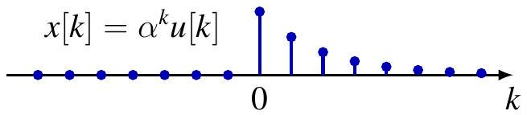

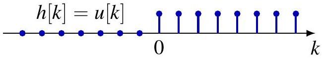

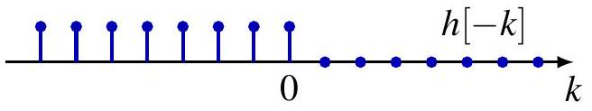

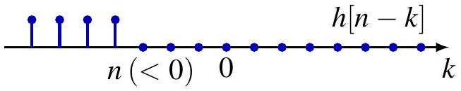

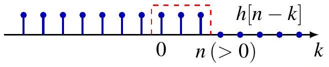

:::

::::

## 卷积示例2 （直接计算）

例： 已知 $x[n]=\alpha^{n} u[n]$ 和 $h[n]=u[n]$， 其中 $\alpha \in(0,1)$.

:::: {.columns style="text-align: left;"}

::: {.column width="55%"}
$$
\begin{aligned}
(x * h)[n] & =\sum_{k=-\infty}^{\infty} x[k] h[n-k] \\
& =\sum_{k=-\infty}^{\infty} \alpha^{k} u[k] u[n-k] \\
& =\sum_{0 \leq k \leq n} \alpha^{k} \\
& =u[n] \sum_{k=0}^{n} \alpha^{k} \\
& =\left(\frac{1-\alpha^{n+1}}{1-\alpha}\right) u[n]
\end{aligned}
$$

对$\alpha>1$也成立 
:::

::: {.column width="45%"}
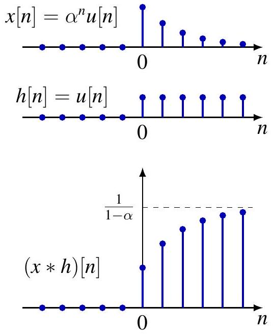
:::

::::

## 卷积示例3 {#ExamDT03}

例： 已知


:::: {.columns style="text-align: left;"}

::: {.column width="55%"}
$$
\begin{aligned}
& x[n]= \begin{cases}1, & 0 \leq n \leq 4 \\
0, & \text { 其他 }\end{cases} \\
& h[n]= \begin{cases}\alpha^{n}, & \alpha > 1, 0 \leq n \leq 6 \\
0, & \text { 其他 }\end{cases}
\end{aligned}
$$

5种情况：


- $n < 0$: $y[n] = 0$（无重叠）
- $0 \le n \le 4$: $y[n] = \sum_{k=0}^{n} \alpha^{n-k} = \frac{1-\alpha^{n+1}}{1-\alpha}$
- $4 < n \le 6$: $y[n] = \sum_{k=0}^{4} \alpha^{n-k} = \alpha^{n-4} \frac{1-\alpha^5}{1-\alpha}$
- $6 < n \le 10$: $y[n] = \sum_{k=n-6}^{4} \alpha^{n-k} = \frac{\alpha^{n-4}-\alpha^7}{1-\alpha}$
- $n > 10$: $y[n] = 0$（完全移出）

:::

::: {.column width="45%"}
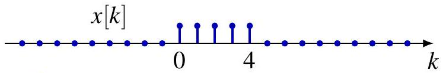{width=60%}

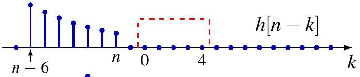{width=60%}

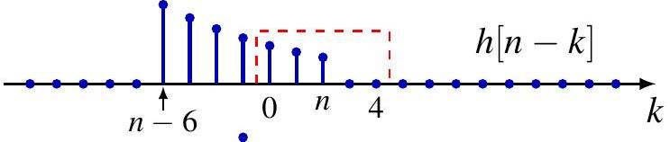{width=60%}

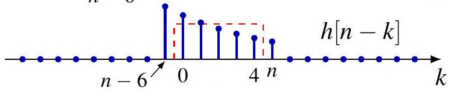{width=60%}

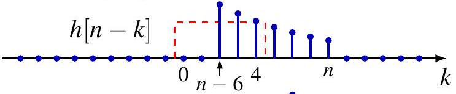{width=60%}

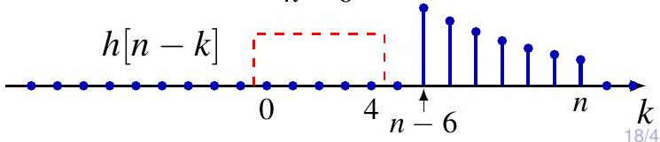{width=60%}

:::
::::

<div style="position:absolute; right:-2%; bottom:-30px; font-size:0.6em;">
[返回目录](#toc0)
</div>


## 目录 {#toc1 }

- [离散时间线性时不变系统](#sec21-dtlti)
  - [用脉冲表示离散时间信号](#sec211)
  - [离散时间线性时不变系统的单位脉冲响应及卷积和表示](#sec212)
- [**连续时间线性时不变系统**](#sec22-ctlti)
  - [用冲激表示连续时间信号](#sec221)
  - [连续时间线性时不变系统的单位冲激响应及卷积和表示](#sec222)
- [线性时不变系统的性质](#sec23-propertylti)
  - [线性时不变系统的交换律、分配律与结合律](#sec231)
  - [线性时不变系统的记忆性、可逆性、因果性和稳定性](#sec235)
  - [线性时不变系统的单位阶跃响应](#sec238)
- [用微分方程和差分方程描述的因果线性时不变系统](#sec24ltiodede)
  - [线性常系数微分方程](#sec241)
  - [线性常系数差分方程](#sec242)
  - [一阶系统的方框图表示](#sec243)
- [奇异函数](#sec25-siglarityfunction)


#  连续时间线性时不变系统 {#sec22-ctlti}

## 连续时间信号的冲激表示 {#sec221}

连续时间单位冲激的抽样（筛选）性质

:::: {.columns style="text-align: center;"}

::: {.column width="50%"}

考虑用一串脉冲或阶梯信号 $\hat{x}(t)$ 来近似 $x(t)$。如同离散时间情况一样，对于近似式 $\hat{x}(t)$ 来说，可以用一串延时脉冲的线性组合来表示，若定义

$$
\delta_{\Delta}(t)= \begin{cases}\frac{1}{\Delta}, & 0 \leqslant t<\Delta \\ 0, & \text { 其他 }\end{cases}
$$


由于 $\Delta \delta_{\Delta}(t)$ 为 1 ，则 $\hat{x}(t)$ 可表示成

$$
\hat{x}(t)=\sum_{k=-\infty}^{\infty} x(k \Delta) \delta_{\Delta}(t-k \Delta) \Delta
$$

当 $\Delta \rightarrow 0$时：

$$x(t)=\int_{-\infty}^{+\infty} x(\tau) \delta(t-\tau) \mathrm{d} \tau$$
:::

::: {.column width="50%"}
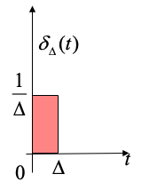{width=22%}

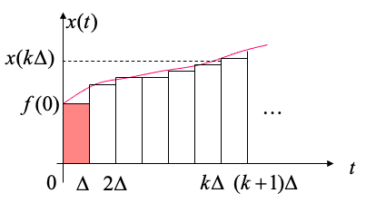

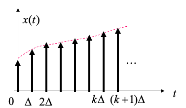{style="position: relative; left: 25px;"}
:::

::::

$x(t)$实际上是移位冲激的**加权“和”(积分)**。

---


## 连续时间线性时不变系统的单位冲激响应及卷积和表示 {#sec222}


:::: {.columns style="text-align: center;"}

::: {.column width="45%"}
线性系统信号$x(t)$的响应 $\hat{y}(t)$ 就是系统对  $\delta_{\Delta}(t)$ 加权和移位脉冲响应的叠加。

令 $\hat{h}_{k \Delta}(t)$ 为一个线性时不变系统对输人 $\delta_{\Delta}(t-k \Delta)$ 的响应，根据**叠加性质**，对连续时间线性系统:

$$\hat{y}(t)=\sum_{k=-\infty}^{+\infty} x(k \Delta) \hat{h}_{k \Delta}(t) \Delta$$

其中

$\hat{h}_{k \Delta}=T\left(\tau_{k \Delta} p_{\Delta}\right)$ 是移位冲激响应 。


- $\hat{x}_{\Delta} \rightarrow x$ 和 $\hat{y}_{\Delta} \rightarrow y=T(x)$
- 对于 $k \Delta \rightarrow \tau$, 有   $\hat{h}_{k \Delta} \rightarrow h_{\tau}=T\left(\delta_{\tau}\right)$

那么：$y(t)=\lim _{\Delta \rightarrow 0} \sum_{k=-\infty}^{+\infty} x(k \Delta) \hat{h}_{k \Delta}(t) \Delta$

当 $\Delta \rightarrow 0$时：

$$y(t)=\int_{-\infty}^{+\infty} x(\tau) h_\tau(t) \mathrm{d} \tau$$

:::

::: {.column width="55%"}
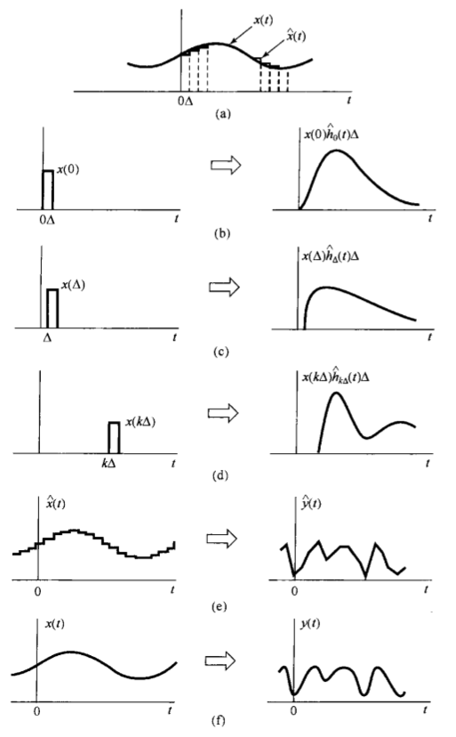{width=59%}
:::

::::


## 连续时间线性时不变（LTI）系统

单位冲激响应

$$
\begin{gathered}
h(t)=h=h_{0}=T(\delta) \\
\text { 时不变性 } \Longrightarrow h_{\tau}=T\left(\delta_{\tau}\right)=\tau_{\tau}(T(\delta))=\tau_{\tau} h
\end{gathered}
$$

LTI 系统的响应——**卷积积分**

$$
y(t)=\int_{-\infty}^{+\infty} x(\tau) h(t-\tau) d \tau 
$$

LTI 系统完全由**单位冲激响应刻画**！

反之 给定$h(t)$, 系统 

$$T(x)(t) \triangleq \int_{-\infty}^{+\infty} x(\tau) h(t-\tau) d \tau$$
 也是线性时不变的(LTI)。

## 简单 LTI 系统的冲激响应

恒等系统
$$  h(t)=\delta(t)$$

比例（标量）放大

$$
h(t)=K \delta(t)
$$

时移

$$
h(t)=\delta_{a}(t) \triangleq \delta(t-a)
$$

积分器

$$
h(t)=\int_{-\infty}^{t} \delta(\tau) d \tau=u(t)
$$

卷积

$$
\left(x_{1} * x_{2}\right)(t)=\int_{-\infty}^{+\infty} x_{1}(\tau) x_{2}(t-\tau) d \tau 
$$


<!-- ## 简单 LTI 系统的冲激响应

对任意信号并不总是有定义 $x_{1}$ and $x_{2}$
例： For $x_{1}(t)=u(t)=x_{2}(-t)$, integral divergent for all $t$.

绝对收敛的充分条件

1. Either $x_{1}$ or $x_{2}$ has compact support $\operatorname{supp} x=\overline{\{t: x(t) \neq 0\}}$, i.e. $x_{1}$ or $x_{2}$ vanishes outside finite interval.
2. $x_{1}, x_{2}$ both 右边信号（右支撑） (or 左边信号（左支撑）), i.e. $x_{i}(t)=0$ for $t \leq t_{i}$ (or $t \geq t_{i}$ ), $\forall i \Longrightarrow x_{1} * x_{2}$ also 右边信号（右支撑） (or 左边信号（左支撑）) -->

<!-- ## 卷积

## 绝对收敛的充分条件 (cont'd)

3. One of $x_{1}$ and $x_{2}$ has finite $L_{1}$ norm and the other finite $L_{p}$ norm for $1 \leq p \leq \infty$, where $L_{p}$ norm ${ }^{1}$

$$
\|x\|_{p} \triangleq \begin{cases}\left(\int_{\mathbb{R}}|x(t)|^{p} d t\right)^{1 / p}, & \text { if } 1 \leq p<\infty \\ \sup _{t \in \mathbb{R}}|x(t)|, & \text { if } p=\infty\end{cases}
$$

If $\left\|x_{1}\right\|_{1}<\infty$, then $\left\|x_{1} * x_{2}\right\|_{p} \leq\left\|x_{1}\right\|_{1} \cdot\left\|x_{2}\right\|_{p}$.
4. $\left\|x_{1}\right\|_{p}<\infty$ and $\left\|x_{2}\right\|_{q}<\infty$ for $1 \leq p, q \leq \infty$ and $p^{-1}+q^{-1}=1$. In this case, $\left\|x_{1} * x_{2}\right\|_{\infty} \leq\left\|x_{1}\right\|_{p} \cdot\left\|x_{2}\right\|_{q}$.

[^0] -->

## 卷积的计算方法

1. **绘制信号**

   将 $x_{1}$ 和 $x_{2}$ 表示为自变量 $\tau$ 的函数，即绘制$x_{1}(\tau), \quad x_{2}(\tau)$

2. **信号反转（时间反转）**

   将 $x_{2}(\tau)$ 关于原点反转，得到$x_{2}(-\tau)$

3. **信号平移**

   对于给定的 $t$，将 $x_{2}(-\tau)$ 向右平移 $t$，得到$x_{2}(t-\tau)$

4. **逐点相乘**

   将 $x_{1}(\tau)$ 与 $x_{2}(t-\tau)$ 逐点相乘，得到函数

   $$
   g_t(\tau) = x_{1}(\tau)x_{2}(t-\tau)
   $$

5. **积分得到卷积结果**

   对 $g_t(\tau)$ 关于 $\tau$ 积分，得到卷积结果

   $$
   (x_{1} * x_{2})(t)
   =
   \int_{-\infty}^{\infty}
   x_{1}(\tau)x_{2}(t-\tau)\, d\tau
   $$

6. 对于每个$t$，重复 $1-5$ 

## 卷积示例1

例：令 $x(t)=e^{-a t} u(t)$ 以及 $h(t)=u(t)$，设 $a>0$.

:::: {.columns style="text-align: left;"}

::: {.column width="45%"}

<br>
对于 $t<0$,
 
$$
(x * h)(t)=0
$$

<br>

对于 $t \geq 0$,
 

$$
(x * h)(t)=\int_{0}^{t} e^{-a \tau} d \tau=\frac{1-e^{-a t}}{a}
$$

<br>
因此


$$
(x * h)(t)=\left(\frac{1-e^{-a t}}{a}\right) u(t)
$$


:::

::: {.column width="55%"}
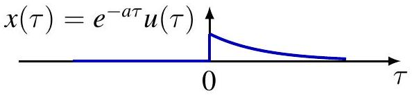
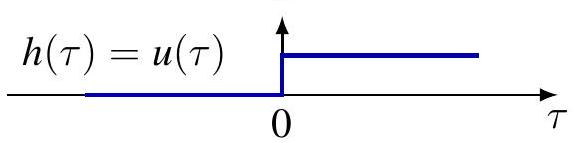
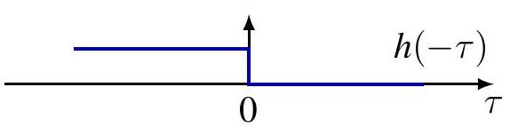
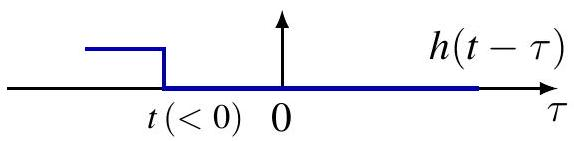
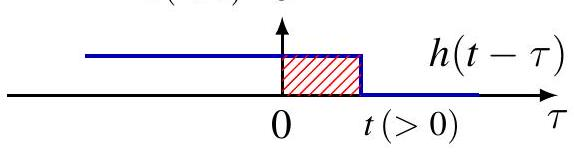
:::
::::

## 卷积示例1

例： 令 $x(t)=e^{-a t} u(t)$ 以及 $h(t)=u(t)$， $a>0$.(用公式推导的方法)

:::: {.columns style="text-align: left;"}

::: {.column width="45%"}
$$
\begin{aligned}
(x * h)(t) & =\int_{\mathbb{R}} x(\tau) h(t-\tau) d \tau \\
& =\int_{\mathbb{R}} e^{-a \tau} u(\tau) u(t-\tau) d \tau \\
& =\int_{0 \leq \tau \leq t} e^{-a \tau} d \tau \\
& =u(t) \int_{0}^{t} e^{-a \tau} d \tau \\
& =\left(\frac{1-e^{-a t}}{a}\right) u(t)
\end{aligned}
$$

对$a<0$也成立 
:::

::: {.column width="55%"}

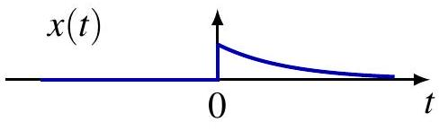

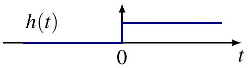

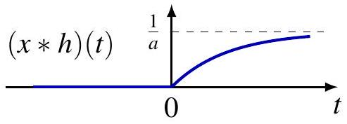
:::
::::

## 卷积示例2

计算 $x * x$，其中 $x(t)=u(t+T)-u(t-T)$ (宽为 $2T$ 的矩形脉冲)。

:::: {.columns style="text-align: center;"}

::: {.column width="45%"}

$$
(x * x)(t)= \begin{cases}0, & t<-2 T \\ t+2 T, & -2 T \leq t<0 \\ 2 T-t, & 0 \leq t<2 T \\ 0, & t \geq 2 T\end{cases}
$$
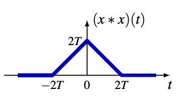{width=60%}

*结果是一个宽为 $4T$ 的三角形脉冲*
:::

::: {.column width="55%"}
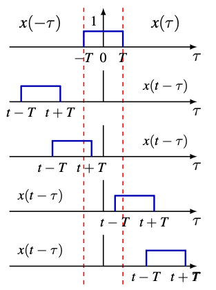{width=60%}
:::
::::

## 卷积示例3

例：

:::: {.columns style="text-align: center;"}

::: {.column width="45%"}

令
$$
\begin{aligned}
& x(t)= \begin{cases}1, & 0<t<T \\
0, & \text { 其他 }\end{cases} \\
& h(t)= \begin{cases}t, & 0 \leq t \leq 2 T \\
0, & \text { 其他 }\end{cases}
\end{aligned}
$$

分为5种情况：

1. $t<0$
2. $0 \leq t \leq T$
3. $T<t \leq 2 T$
4. $2 T<t \leq 3 T$
5. $t>3 T$

:::

::: {.column width="55%"}
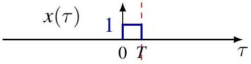{width=36%}

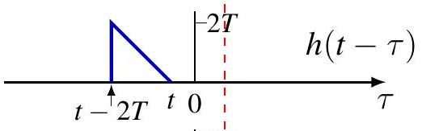{width=36%}

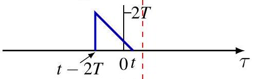{width=36%}

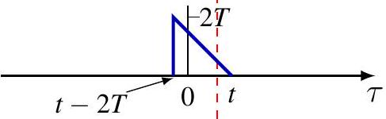{width=36%}

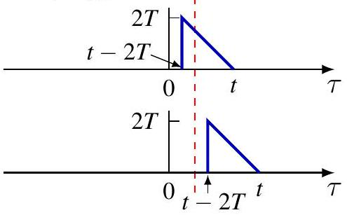{width=36%}
:::
::::

## 卷积示例3

结果：

:::: {.columns style="text-align: center;"}

::: {.column width="45%"}

$$y(t)=\begin{cases}\frac{t^2}{2} &0 \leq t \leq T \\ t T-\frac{T^2}{2} &   T<t \leq 2 T \\ -\frac{t^2}{2}+t T+\frac{3 T^2}{2} & 2 T<t \leq 3 T \\ 0 & t > 3T\end{cases}$$

:::

::: {.column width="55%"}

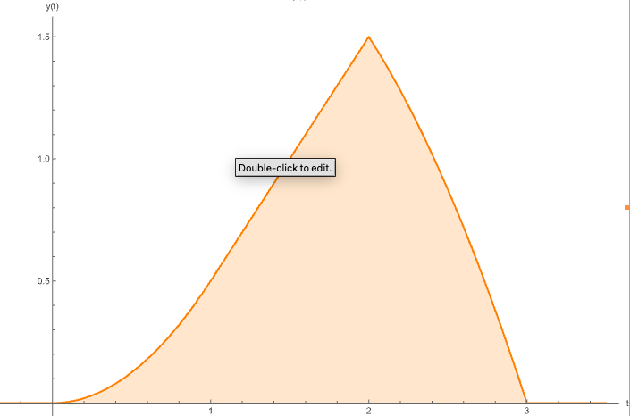
:::
::::
<div style="position:absolute; right:-150px; bottom:-40px; font-size:0.6em;">
[返回目录](#toc1)
</div>

<!-- ## 恒等系统 Element

回顾狄拉克$\delta$函数的抽样(采样)性质：

$$
x(t)=\int_{\mathbb{R}} x(\tau) \delta(t-\tau) d \tau, \quad \forall t \in \mathbb{R}
$$

$\delta$ 函数是卷积运算的单位元（identity element）

$$
\begin{aligned}
& x=x * \delta=\delta * x \\
& x=x * \delta x \longrightarrow \delta \\
& x=\delta * x \delta \longrightarrow x
\end{aligned}
$$ -->


## 目录 {#toc2 }

- [离散时间线性时不变系统](#sec21-dtlti)
  - [用脉冲表示离散时间信号](#sec211)
  - [离散时间线性时不变系统的单位脉冲响应及卷积和表示](#sec212)
- [连续时间线性时不变系统](#sec22-ctlti)
  - [用冲激表示连续时间信号](#sec221)
  - [连续时间线性时不变系统的单位冲激响应及卷积和表示](#sec222)
- [**线性时不变系统的性质**](#sec23-propertylti)
  - [线性时不变系统的交换律、分配律与结合律](#sec231)
  - [线性时不变系统的记忆性、可逆性、因果性和稳定性](#sec235)
  - [线性时不变系统的单位阶跃响应](#sec238)
- [用微分方程和差分方程描述的因果线性时不变系统](#sec24ltiodede)
  - [线性常系数微分方程](#sec241)
  - [线性常系数差分方程](#sec242)
  - [一阶系统的方框图表示](#sec243)
- [奇异函数](#sec25-siglarityfunction)


# 线性时不变系统的性质{#sec23-propertylti}

## 线性时不变系统的交换律、分配律与结合律{#sec231}

### 恒等系统 Element

回顾抽样性质： $\delta$

$$
x[n]=\sum_{k=-\infty}^{\infty} x[k] \delta[n-k], \quad \forall n \in \mathbb{Z}
$$

$\delta$ 函数是卷积运算的单位元（identity element）。

$$
x=x * \delta=\delta * x
$$

$$
x=x * \delta
$$

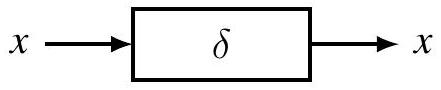

$$
x=\delta * x
$$

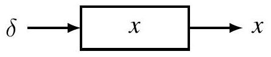

## 线性时不变系统的交换律、分配律与结合律

### 离散时间LTI系统的交换律、分配率与结合律

交换律

$$
x_{1} * x_{2}=x_{2} * x_{1}
$$

证明：变量替换: $m=n-k$,

$$
\begin{aligned}
\left(x_{1} * x_{2}\right)[n] & =\sum_{k=-\infty}^{\infty} x_{1}[k] x_{2}[n-k]=\sum_{m=-\infty}^{\infty} x_{1}[n-m] x_{2}[m]=\left(x_{2} * x_{1}\right)[n] \\
y & =x * h \quad x \rightarrow y \\
y & =h * x \quad h \rightarrow y
\end{aligned}
$$

## 交换律

例 ([离散时间系统示例3](#ExamDT03)),已知：

:::: {.columns style="text-align: center;"}

::: {.column width="55%"}

$$
\begin{aligned}
& x[n]= \begin{cases}1, & 0 \leq n \leq 4 \\
0, & \text { 其他 }\end{cases} \\
& h[n]= \begin{cases}\alpha^{n}, & \alpha > 1, 0 \leq n \leq 6 \\
0, & \text { 其他 }\end{cases}
\end{aligned}
$$

5种情况：

1. $n<0$
2. $0 \leq n \leq 4$
3. $4<n \leq 6$
4. $6<n \leq 10$
5. $n>10$

:::
::: {.column width="45%"}

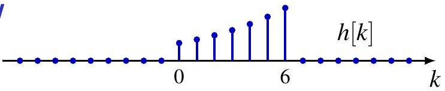{width=60%}

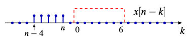{width=60%}

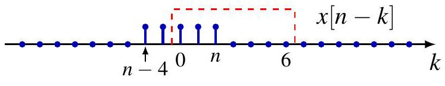{width=60%}

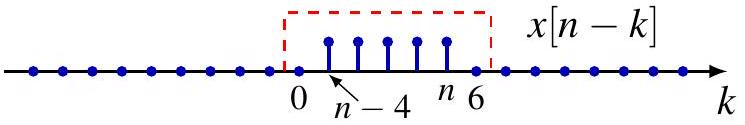{width=60%}

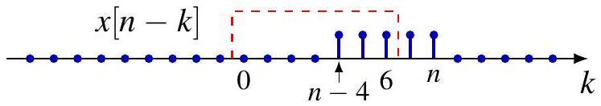{width=60%}

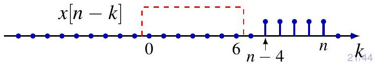{width=60%}
:::
::::

## 分配律

$$
x_{1} *\left(x_{2}+x_{3}\right)=x_{1} * x_{2}+x_{1} * x_{3}
$$

证明： 假设 $x_{1} * x_{2}$ 和 $x_{1} * x_{3}$ 都是良好定义的,

$$
\sum_{k=-\infty}^{\infty} x_{1}[k]\left(x_{2}[n-k]+x_{3}[n-k]\right)=\sum_{k=-\infty}^{\infty} x_{1}[k] x_{2}[n-k]+\sum_{k=-\infty}^{\infty} x_{1}[k] x_{3}[n-k]
$$

:::: {.columns style="text-align: center;"}

::: {.column width="45%"}
<br>
<br>
$$
h=h_{1}+h_{2}
$$
:::

::: {.column width="55%"}

:::
::::

## 双线性

标量乘法

$$
x_{1} *\left(K x_{2}\right)=K\left(x_{1} * x_{2}\right)
$$

映射$\left(x_{1}, x_{2}\right) \mapsto x_{1} * x_{2}$ 即对 $x_{1}$ 和 $x_{2}$都是线性的。

$$
\left(\sum_{i} a_{i} x_{1 i}\right) *\left(\sum_{j} b_{j} x_{2 j}\right)=\sum_{i} \sum_{j} a_{i} b_{j}\left(x_{1 i} * x_{2 j}\right)
$$

**对第一个变量的线性**：对于任意标量 $a, b$，

$$
(a x_{1} + b x_{2}) * x_{3}
=
a(x_{1} * x_{3}) + b(x_{2} * x_{3})
$$


**对第二个变量的线性**：对于任意标量 $a, b$，

$$
x_{1} * (a x_{2} + b x_{3})
=
a(x_{1} * x_{2}) + b(x_{1} * x_{3})
$$


## 结合律

$$
\left(x_{1} * x_{2}\right) * x_{3}=x_{1} *\left(x_{2} * x_{3}\right)
$$

证明：在适当条件下，有

$$
\begin{aligned}
\left(\left(x_{1} * x_{2}\right) * x_{3}\right)[n] & =\sum_{m=-\infty}^{\infty}\left(x_{1} * x_{2}\right)[n-m] x_{3}[m] \\
& =\sum_{m=-\infty}^{\infty}\left(\sum_{k=-\infty}^{\infty} x_{1}[k] x_{2}[n-m-k]\right) x_{3}[m] \\
& =\sum_{k=-\infty}^{\infty} x_{1}[k] \sum_{m=-\infty}^{\infty} x_{2}[n-k-m] x_{3}[m] \\
& \left.=\sum_{k=-\infty}^{\infty} x_{1}[k]\left(x_{2} * x_{3}\right)[n-k]\right)=\left(x_{1} *\left(x_{2} * x_{3}\right)\right)[n]
\end{aligned}
$$

由于卷积运算满足结合律，可以将 $x_{1} * x_{2} * x_{3}$写成不带括号的形式而不会产生歧义。

## 结合律

$$
x_{1} *\left(x_{2} * x_{3}\right)=\left(x_{1} * x_{2}\right) * x_{3}
$$


对于 LTI 系统，处理顺序通常不影响结果

## 结合律失效的情况

例： $x_{1}[n]=1, x_{2}[n]=u[n], x_{3}[n]=\delta[n]-\delta[n-1]$.

1. $x_{2} * x_{3}=x_{3} * x_{2}=\delta$, 因而 $x_{1} *\left(x_{2} * x_{3}\right)=x_{1} *\left(x_{3} * x_{2}\right)=1$
2. $x_{1} * x_{2}$ 以及 $\left(x_{1} * x_{2}\right) * x_{3}$ 没有定义!
3. $x_{1} * x_{3}=0$, 因此 $\left(x_{1} * x_{3}\right) * x_{2}=0$

以下条件可作为卷积结合律成立的**充分条件**：

1. **$x_1, x_2, x_3$ 中至少有两个信号具有有限支撑（finite support）**

2. **$x_1, x_2, x_3$ 全部都是右边序列（或全部都是左边序列）**

   则三重卷积
   $$
   x_1 * x_2 * x_3
   $$
   也仍然是右边序列（或左边序列）。

3. **其中一个信号（例如 $x_3$）具有有限 $\ell_p$ 范数（$1 \le p \le \infty$），其余两个信号具有有限 $\ell_1$ 范数**

   则有估计
   $$
   \|x_1 * x_2 * x_3\|_p
   \le
   \|x_1\|_1\,\|x_2\|_1\,\|x_3\|_p
   $$

## 时移性质

$$
\left(\tau_{a} x_{1}\right) *\left(\tau_{b} x_{2}\right)=\tau_{a+b}\left(x_{1} * x_{2}\right)
$$

证明：

注意到： $\tau_{a} x=x * \delta_{a}$ and $\delta_{a+b}=\delta_{a} * \delta_{b}$. 

因此

$$
\begin{aligned}
\left(\tau_{a} x_{1}\right) *\left(\tau_{b} x_{2}\right) & =\left(x_{1} * \delta_{a}\right) *\left(x_{2} * \delta_{b}\right)=\left(x_{1} * x_{2}\right) *\left(\delta_{a} * \delta_{b}\right) \\
& =\left(x_{1} * x_{2}\right) * \delta_{a+b}=\tau_{a+b}\left(x_{1} * x_{2}\right)
\end{aligned}
$$

:::: {.columns style="text-align: center;"}

::: {.column width="45%"}
编程实现

$$
\begin{array}{rlrl}
x[-2] & =-1 & h[-1] & =-0.5 \\
x[-1] & =0 & h[0] & =1 \\
x[0] & =0.5 & h[1] & =0.5 \\
x[1] & =1 & & \\
x[2] & =-0.5 & &
\end{array}
$$

:::

::: {.column width="45%"}
```
import numpy as np
import matplotlib.pyplot as plt # 建议补充，用于可视化验证

# 1. 原始信号及其起始坐标 (n_start)
# x[-2:2] 意味着 n 从 -2 开始，长度为 5
x = np.array([-1, 0, 0.5, 1, -0.5])
nx = np.arange(-2, 3) 

# h[-1:1] 意味着 n 从 -1 开始，长度为 3
h = np.array([0.5, 1, 0.5])
nh = np.arange(-1, 2)

# 2. 卷积运算
# mode='full' 是默认值，输出长度为 len(x) + len(h) - 1
y = np.convolve(x, h)

# 3. 计算卷积后的索引坐标 (关键补充)
# 卷积后信号的起始索引 = x的起始索引 + h的起始索引
# 卷积后信号的结束索引 = x的结束索引 + h的结束索引
ny_start = nx[0] + nh[0]
ny_end = nx[-1] + nh[-1]
ny = np.arange(ny_start, ny_end + 1)

print(f"输出信号 y 的数值: {y}")
print(f"对应的时间轴 n: {ny}")
```
:::
::::

## 时移性质

:::: {.columns style="text-align: center;"}
:::{.column width="33%"}


:::

:::{.column width="34%"}


{width=60%}
:::

:::{.column width="33%"}


{width=60%}
:::

::::


## 利用性质进行计算

例： 已知

$$
x[n]=\left\{\begin{array}{ll}
1, & 0 \leq n \leq 4 \\
0, & \text { 其他 }
\end{array} \quad h[n]= \begin{cases}\alpha^{n}, & 0 \leq n \leq 6 \\
0, & \text { 其他 }\end{cases}\right.
$$

- 设 $h_{1}[n]=\alpha^{n} u[n]$.

$$
\left(u * h_{1}\right)[n]=\left(\frac{1-\alpha^{n+1}}{1-\alpha}\right) u[n]
$$

- $x=u-\tau_{5} u, h=h_{1}-\alpha^{7} \tau_{7} h_{1}$.
- $x * h=\left(I-\tau_{5}-\alpha^{7} \tau_{7}+\alpha^{7} \tau_{12}\right)\left(u * h_{1}\right)$
- $x=\left(\delta-\delta_{5}\right) * u, h=\left(\delta-\alpha^{7} \delta_{7}\right) * h_{1}$.
- $x * h=\left(\delta-\delta_{5}-\alpha^{7} \delta_{7}+\alpha^{7} \delta_{12}\right) *\left(u * h_{1}\right)$


## 线性时不变系统的交换律、分配律与结合律

### 连续时间LTI系统的交换律、分配率与结合律

交换律

$$
x_{1} * x_{2}=x_{2} * x_{1}
$$

双线性

$$
\left(\sum_{i} a_{i} x_{1 i}\right) *\left(\sum_{j} b_{j} x_{2 j}\right)=\sum_{i} \sum_{j} a_{i} b_{j}\left(x_{1 i} * x_{2 j}\right)
$$

结合律

$$
x_{1} * x_{2} * x_{3}=\left(x_{1} * x_{2}\right) * x_{3}=x_{1} *\left(x_{2} * x_{3}\right)
$$

时移

$$
\left(\tau_{a} x_{1}\right) *\left(\tau_{b} x_{2}\right)=\tau_{a+b}\left(x_{1} * x_{2}\right)
$$

## 结合律

$$
x_{1} *\left(x_{2} * x_{3}\right)=\left(x_{1} * x_{2}\right) * x_{3}
$$


对于 LTI 系统，处理顺序通常不影响结果

## 结合律失效的情况


例： $x_{1}(t)=1, x_{2}(t)=u(t), x_{3}(t)=\delta^{\prime}(t)$ (later)

:::: {.columns style="text-align: center;"}
:::{.column width="50%"}

1. $\left(x_{2} * x_{3}\right)(t)=\delta(t)$, so $x_{1} *\left(x_{2} * x_{3}\right)=1$
2. $x_{1} * x_{2}$ and $\left(x_{1} * x_{2}\right) * x_{3}$ undefined!

:::
:::{.column width="50%"}
3. $x_{1} * x_{3}=0$, so $\left(x_{1} * x_{3}\right) * x_{2}=0$
:::
::::


结合律成立的充分条件 (Sufficient conditions for associative law)

1. **至少有两个信号（$x_1, x_2, x_3$）具有紧支撑 (Compact supports)。**
   - *解释*：在连续空间中，“紧支撑”意味着信号只在有限的时间区间内非零。如果至少有两个信号是有限长的，卷积积分的上下限将被限制在有限范围内，从而避免积分发散。

2. **$x_1, x_2, x_3$ 全部为右边信号（或全部为左边信号）。**
   - *推导*：$\implies x_1 * x_2 * x_3$ 也是右边信号（或左边信号）。
   - *解释*：如果所有信号都是因果的（即 $t < 0$ 时为 $0$），卷积积分的范围变为 $[0, t]$。这种因果性保证了运算在代数结构上构成一个卷积环，结合律始终成立。

3. **其中一个信号（例如 $x_3$）具有有限的 $L_p$ 范数 ($1 \le p \le \infty$)，而其他信号具有有限的 $L_1$ 范数。**
   - *公式*：$\|x_1 * x_2 * x_3\|_p \le \|x_1\|_1 \cdot \|x_2\|_1 \cdot \|x_3\|_p$
   - *解释*：这是基于 **Young's 不等式** 的稳定性条件。$L_1$ 范数有限意味着信号是绝对可积的（BIBO 稳定）。只要系统中绝大多数组件是稳定的，那么整体输出的能量或幅值就是受控的，结合律在数学上依然保值。


## 线性时不变系统的记忆性、可逆性、因果性和稳定性 {#sec235}

记忆性 (Memory)

对于 LTI 系统：
$$
y(t)=(x * h)(t)=\int_{\mathbb{R}} x(\tau) h(t-\tau) d \tau
$$

$$
\text { 无记忆 (memoryless) } \Longleftrightarrow h=K \delta
$$

除了标量乘法外，所有 LTI 系统都具有记忆。

## 可逆性 (Invertibility)

系统及其逆系统的冲激响应满足：

$$
h * h_{1}=\delta
$$


这是必要的，但不充分（需要结合律）。
* 例如：一阶差分 $h=\delta-\tau_{1} \delta$，累加器 $h_{1}=u$。

## 因果性 (Causality)

对于 LTI 系统：

$$
\begin{aligned}
y[n] & =\sum_{k=-\infty}^{n} x[k] h[n-k] \\
\text { 因果 } & \Longleftrightarrow h[n]=0 \text { 对所有 } n<0
\end{aligned}
$$

$$
\begin{aligned}
y(t) & =\int_{-\infty}^{t} x(\tau) h(t-\tau) d \tau \\
\text { 因果 } & \Longleftrightarrow h(t)=0 \text { 对所有 } t<0
\end{aligned}
$$

## 稳定性 (Stability)

回顾 BIBO 稳定性：$\|x\|_{\infty}<\infty \Longrightarrow\|T(x)\|_{\infty}<\infty$。

对于 LTI 系统：
$$
\text { BIBO 稳定 } \Longleftrightarrow\|h\|_{1}<\infty
$$

**证明**：
* **充分性**：假设 $\|h\|_{1}<\infty$。因 $\|x * h\|_{\infty} \leq\|x\|_{\infty}\|h\|_{1}$，故有界输入产生有界输出。

* **必要性**：构建反例 $x=R(\bar{h} /|h|)$。

## 单位阶跃响应 (Unit Step Response)

LTI 系统的单位阶跃响应 $s \triangleq T(u)=u * h$。

**DT LTI**:
$$
s[n]=\sum_{-\infty}^{n} h[k], \quad h[n]=s[n]-s[n-1]
$$

**CT LTI**:
$$
s(t)=\int_{-\infty}^{t} h(\tau) d \tau, \quad h(t)=s^{\prime}(t)
$$

<div style="position:absolute; right:-150px; bottom:-40px; font-size:0.6em;">
[返回目录](#toc2)
</div>

## 目录 {#toc3 }

- [离散时间线性时不变系统](#sec21-dtlti)
  - [用脉冲表示离散时间信号](#sec211)
  - [离散时间线性时不变系统的单位脉冲响应及卷积和表示](#sec212)
- [连续时间线性时不变系统](#sec22-ctlti)
  - [用冲激表示连续时间信号](#sec221)
  - [连续时间线性时不变系统的单位冲激响应及卷积和表示](#sec222)
- [线性时不变系统的性质](#sec23-propertylti)
  - [线性时不变系统的交换律、分配律与结合律](#sec231)
  - [线性时不变系统的记忆性、可逆性、因果性和稳定性](#sec235)
  - [线性时不变系统的单位阶跃响应](#sec238)
- [**用微分方程和差分方程描述的因果线性时不变系统**](#sec24ltiodede)
  - [线性常系数微分方程](#sec241)
  - [线性常系数差分方程](#sec242)
  - [一阶系统的方框图表示](#sec243)
- [奇异函数](#sec25-siglarityfunction)

# 由微分方程描述的因果 LTI 系统 {#sec24ltiodede}

## 线性常系数微分方程 (LCCDE) {#sec241}

:::: {.columns style="text-align: center;"}
:::{.column width="50%"}
根据电阻、电容和电感元件的特性：

$\begin{aligned} i_R(t) & =\frac{1}{R} v(t) \\ i_L(t) & =\frac{1}{L} \int_{-\infty}^t v(\tau) d \tau \\ i_C(t) & =C \frac{d}{d t} v(t)\end{aligned}$

根据Kirchhoff定律

$i_R(t)+i_L(t)+i_C(t)=i_S(t)$

可以得到以二阶常微分方程（ODE）表达的RLC 电路特性：
$$
C \frac{d^{2}}{d t^{2}} v(t)+\frac{1}{R} \frac{d}{d t} v(t)+\frac{1}{L} v(t)=\frac{d}{d t} i_{S}(t)
$$
:::

:::{.column width="50%"}

:::
::::

## 线性常系数微分方程 

一般形式：
$$
L_{y} y=L_{x} x
$$
其中 
$$L_{y}=\sum_{k=0}^{N} a_{k} \frac{d^{k}}{d t^{k}}, L_{x}=\sum_{k=0}^{M} b_{k} \frac{d^{k}}{d t^{k}}$$

* **$N$**: 常微分方程的**阶数 (order)**
* 输入-输出关系由 ODE **隐式 (implicitly)** 指定
* 解 ODE 以获得**显性 (explicit)** 输入-输出关系 $y = T(x)$
* 在解 ODE 时，可以将 $f = L_x x$ 视为“输入”
* 单凭 ODE **并不能**唯一确定 $T$
* 需要**辅助条件 (auxiliary conditions)**，通常是**初始条件 (initial conditions)**

## 线性常系数微分方程 
### 初值问题 (Initial Value Problem, IVP)

$$L_y y = f$$

伴随以下**初始条件 (initial conditions)**：

$$y^{(k)}(t_0) = y_k, \quad k = 0, 1, \dots, N - 1$$


核心要点

* **$N$ 阶常微分方程 (ODE)** 需要 **$N$ 个初始条件**
* 通过平移变换，可以将 $y$ 和 $f$ 分别替换为 $\tilde{y} = \tau_{-t_0} y$ 和 $\tilde{f} = \tau_{-t_0} f$：

$$L_y \tilde{y} = \tilde{f}$$

此时的**初始条件**变为在零点处定义：

$$\tilde{y}^{(k)}(0) = y_k, \quad k = 0, 1, \dots, N - 1$$


## 一阶 ODE 的 IVP 示例
示例

设算子 $L_y = \frac{d}{dt} + 2$，即微分方程为：
$$y'(t) + 2y(t) = x(t) \quad \dots (1)$$

已知输入 $x(t) = Ke^{3t}u(t)$，初始条件为 $y(0) = y_0$。

解题步骤

* **通解 (General solution)** 是**特解** $y_p(t)$ 与**齐次解** $y_h(t)$ 之和：
    $$y(t) = y_p(t) + y_h(t)$$
* $y_p$ 满足原方程 (1)；而 $y_h$（**固有响应或自然响应**，natural response）满足齐次方程：
    $$y_h'(t) + 2y_h(t) = 0$$
* 设 $y_h(t) = Ae^{\lambda t}$，其中特征方程为 $\lambda + 2 = 0$。
    * 特征方程的左侧 (LHS) 是将算子 $L_y$ 中的 $\frac{d}{dt}$ 替换为 $\lambda$ 得到的。
    * 因此，$\lambda = -2$，齐次解为：
        $$y_h(t) = Ae^{-2t}$$

解的分解 (Decomposition)

**分解 (1) - 基于 ODE**：
* 特解：$L_{y} y_{p}=f$
* 齐次解：$L_{y} y_{h}=0$

**分解 (2) - 基于响应类型**：
$$
y = y_{zi} + y_{zs}
$$
* **零输入响应 (Zero-input)** $y_{zi}$：输入为0 ($f=0$)，由初始条件 $y_k$ 产生。
* **零状态响应 (Zero-state)** $y_{zs}$：初始状态为0 ($y_k=0$)，由输入 $f$ 产生。

## 一阶 ODE 的 IVP 示例

示例（续）.给定线性算子 $L_y = \frac{d}{dt} + 2$，即：

$$y'(t) + 2y(t) = x(t) \tag{1}$$

其中输入信号为 $x(t) = Ke^{3t}u(t)$，初始条件为 $y(0) = y_0$。


1. 求特解:

* **特解 $y_p$**：寻找**受迫响应 (forced response)**，即与输入信号形式相同的信号。
* 对于 $t > 0$，$x(t) = Ke^{3t}$，因此设特解形式为 $y_p(t) = Ye^{3t}$。

将 $y_p(t)$ 代入算子 $L_y$：

$$L_y y_p(t) = 5Ye^{3t} = x(t) = Ke^{3t} \implies y_p(t) = \frac{K}{5}e^{3t}$$


2. 通解

系统的**通解**由特解和齐次解组成：

$$y(t) = \frac{K}{5}e^{3t} + Ae^{-2t}, \quad t > 0$$

> **注意**：其中 $A$ 是待定常数，需根据初始条件 $y(0) = y_0$ 进一步确定。

## 一阶 ODE 的 IVP 示例
示例（续）.给定线性算子 $L_y = \frac{d}{dt} + 2$，即：

$$y'(t) + 2y(t) = x(t) \tag{1}$$

其中输入信号为 $x(t) = Ke^{3t}u(t)$，初始条件为 $y(0) = y_0$。

求解步骤

* **利用初值条件确定常数 $A$**

    $$y(0) = \frac{K}{5} + A = y_0 \implies A = y_0 - \frac{K}{5}$$

* **初值问题 (IVP) 的完整解**

    $$y(t) = \underbrace{\frac{K}{5} e^{3t}}_{\text{受迫响应 (forced response)}} + \underbrace{\left( y_0 - \frac{K}{5} \right) e^{-2t}}_{\text{固有响应 (natural response)}}, \quad t > 0$$

* 对于 $t \le 0$， $y(t) = y_0 e^{-2t}$，但通常我们更关注 $t > 0$ 的情况。

## 一阶 ODE 的 IVP 示例


初值问题 (IVP) 的完整解

$$y(t) = \frac{K}{5}e^{3t} + \left( y_0 - \frac{K}{5} \right)e^{-2t}, \quad t > 0$$

* **系统 $y = T(x)$ 是线性的吗？** 在一般情况下 **不是**。
    * 如果 $y_0 \neq 0$，则**齐次性 (Homogeneity)** 失效，$y$ 与 $K$ 不成正比。

重写解的形式

$$y(t) = \underbrace{\frac{K}{5}(e^{3t} - e^{-2t})}_{\text{零状态响应 (Zero-state response)}} + \underbrace{y_0 e^{-2t}}_{\text{零输入响应 (Zero-input response)}} , \quad t > 0$$

> **注：** 

> 1. **零状态响应**：指初始状态为零（$y_0 = 0$）时，仅由外部输入 $x(t)$ 引起的响应。

> 2. **零输入响应**：指外部输入为零（$x(t) = 0 （K=0）$）时，仅由初始状态 $y_0$ 引起的响应。

## 解的分解 (1)

考虑一般的线性常微分方程 (ODE)

$$L_y y = f$$

如果从系统的受迫响应和固有响应的角度分解：

### 特解

$$L_y y_p = f$$

### 齐次解

$$L_y y_h = 0$$

* **仅根据 ODE 本身定义！**
* **与初始条件无关**

## 解的分解 (2)

考虑带有一般线性常微分方程（ODE）的初值问题（IVP）：

$$
\begin{cases} 
L_y y = f \\
y^{(k)}(0) = y_k, \quad k = 0, 1, \dots, N - 1 
\end{cases} \tag{2}
$$

如果能量来源的角度分解：

### 零输入响应 (Zero-input response)

$$
\begin{cases} 
L_y y_{zi} = 0 \\
y_{zi}^{(k)}(0) = y_k, \quad k = 0, 1, \dots, N - 1 
\end{cases}
$$

### 零状态响应 (Zero-state response)

$$
\begin{cases} 
L_y y_{zs} = f \\
y_{zs}^{(k)}(0) = 0, \quad k = 0, 1, \dots, N - 1 
\end{cases}
$$


方程 (2) 的**完全解**为：
$$y = y_{zi} + y_{zs}$$

## 解的分解 (3)

:::: {.columns style="text-align: center;"}
:::{.column width="50%"}

### 1. 经典解法

这种方法从**微分方程解的数学结构**进行分解：

$$y(t) = \underbrace{\sum_{i=1}^{N} c_i e^{\lambda_i t}}_{y_{n}(t)} + \underbrace{y_p(t)}_{y_{f}(t)}$$

* **固有响应 (Natural Response, $y_n$):**
    * 对应于齐次方程的通解。
    * **特性**：系数 $c_i$ 由初始状态及输入信号共同决定。
* **受迫响应 (Forced Response, $y_f$):**
    * 对应于非齐次方程的特解。
    * **特性**：函数形式完全由输入信号 $f(t)$ 的形式决定。

:::

:::{.column width="50%"}

### 2. 零输入零状态解法 (Zero-Input & Zero-State)

这种方法从**系统激励的来源**进行分解：

$$y(t) = \underbrace{\sum_{i=1}^{N} c_{x_i} e^{\lambda_i t}}_{y_{zi}(t)} + \underbrace{\left( \sum_{i=1}^{N} c_{f_i} e^{\lambda_i t} + y_p(t) \right)}_{y_{zs}(t)}$$

* **零输入响应 (Zero-Input Response, $y_{zi}$):**
    * 由系数 $c_{x_i}$ 决定， $c_{x_i}$是初始条件的线性组合；
    * **特性**：由系统初始状态 $x(0)$ 唯一决定，与输入信号 $f(t)$ 无关。
* **零状态响应 (Zero-State Response, $y_{zs}$):**
    * 由系数 $c_{f_i}$ 及特解 $y_p(t)$ 共同组成，$c_{f_i}$ 与输入的系数成正比。
    * **特性**：由零初始状态及输入信号 $f(t)$ 共同决定。

:::
::::


## 线性性质

根据系统的响应：
$$y(t) = \underbrace{\sum_{i=1}^{N} c_{x_i} e^{\lambda_i t}}_{y_{zi}(t)} + \underbrace{\left( \sum_{i=1}^{N} c_{f_i} e^{\lambda_i t} + y_p(t) \right)}_{y_{zs}(t)}$$

### 零状态响应对输入呈线性

$$
\begin{cases} L_y y_{zs,i} = f_i \\ y_{zs,i}^{(k)}(0) = 0 \end{cases} \implies \begin{cases} L_y (\sum_i c_i y_{zs,i}) = \sum_i c_i f_i \\ (\sum_i c_i y_{zs,i})^{(k)}(0) = 0 \end{cases}
$$


### 零输入响应对初始状态呈线性

$$
\begin{cases} L_y y_{zs,i} = 0 \\ y_{zs,i}^{(k)}(0) = y_{k,i} \end{cases} \implies \begin{cases} L_y (\sum_i c_i y_{zs,i}) = 0 \\ (\sum_i c_i y_{zs,i})^{(k)}(0) = \sum_i c_i y_{k,i} \end{cases}
$$


* **全响应呈线性的充要条件是零输入响应为零**
* **线性性质要求初始状态为零**

## 时不变性

**零初始状态**，即对于 $k = 0, \dots, N - 1$，$y^{(k)}(0) = 0$：
这能保证系统的**线性**，但**不能**保证**时不变性**。


### 示例

考虑以下微分方程：

$$y'(t) + 2y(t) = x(t)$$

伴随初始条件：$y(0) = 0$。


* **如果输入为** $x(t) = u(t)$：
    
    $$y(t) = \frac{1}{2}(1 - e^{-2t})u(t)$$

* **如果输入为** $x(t) = u(t + 1)$：
    
    $$y(t) = \frac{1}{2}(1 - e^{-2t})u(t + 1) + \frac{1}{2}(e^{-2} - 1)e^{-2t}u(-t - 1)$$


## 初始松弛 (Initial Rest)

通常处理右边输入 (right-sided inputs)，即 $t<t_{0}$ 时 $x(t)=0$

- 激励在某一点开启

初始松弛条件 (Initial rest condition)

- 如果输入在 $t<t_{0}$ 时 $x(t)=0$，则输出在 $t<t_{0}$ 时 $y(t)=0$
- 输出保持为零直到被输入改变（参考牛顿定律）
- 这对于线性系统等价于**因果性**
- 调整初始时间 $t_{0}$ 以适应输入 $x$：如果 $x$ 在 $t_{0}$ 变为非零，使用 $y^{(k)}\left(t_{0}\right)=0$ 对于 $k=0,1, \ldots, N-1$，即求解

$$
\left\{\begin{array}{l}
L_{y} y=f \\
y^{(k)}\left(t_{0}\right)=0, \quad k=0,1, \ldots, N-1
\end{array}\right.
$$

带有初始松弛条件的线性常系数 ODE 指定了针对右边输入的因果 LTI 系统。

## 初始松弛

例子：牛顿第二定律

$$
m x^{\prime \prime}(t)=f(t)
$$

初始松弛

- 停留在原点 $x=0$
- 零速度 $v=0$（静止！）
- 除非受到外力改变，否则保持该状态（牛顿第一定律）

如果力在 $t=0$ 开始

- $x(0)=0, v(0)=x^{\prime}(0)=0$

如果力在 $t=1$ 开始


- $x(1)=0, v(1)=x^{\prime}(1)=0$


## 初始松弛

例子：RLC 电路

$$
C \frac{d^{2}}{d t^{2}} v(t)+\frac{1}{R} \frac{d}{d t} v(t)+\frac{1}{L} v(t)=\frac{d}{d t} i_{S}(t)
$$

:::: {.columns style="text-align: center;"}
:::{.column width="50%"}

初始静止

- $L, C$ 中无储能
- 零电压和零电流

如果源在 $t=0$ 开启

- $v(0)=0$
- $i_{C}(0)=C \nu^{\prime}(0)=0$


如果源在 $t=1$ 开启

- $v(1)=0$
- $i_{C}(1)=C \nu^{\prime}(1)=0$

:::

:::{.column width="50%"}

:::
::::


## 初始松弛

一阶 ODE 的一般初值问题 (IVP)

$$
\left\{\begin{array}{l}
y^{\prime}(t)+a y(t)=f(t) \\
y\left(t_{0}\right)=y_{0}
\end{array}\right.
$$

解

$$
y(t)=\underbrace{y_{0} e^{-a\left(t-t_{0}\right)}}_{\text {零输入响应 (zero-input response) }}+\underbrace{\int_{t_{0}}^{t} f(\tau) e^{-a(t-\tau)} d \tau}_{\text {零状态响应 (zero-state response) }}
$$

初始松弛：零输入响应总是 0；取 $t_{0} \rightarrow-\infty$

$$
y(t)=\int_{-\infty}^{t} f(\tau) e^{-a(t-\tau)} d \tau \xrightarrow{f=f \cdot \tau_{t_{0}} u} y(t)=u\left(t-t_{0}\right) \int_{t_{0}}^{t} f(\tau) e^{-a(t-\tau)} d \tau
$$

## 初始松弛

例子：

$$
y^{\prime}(t)+2 y(t)=x(t)
$$

带有初始松弛条件和输入 $x(t)=u(t+1)$
响应

$$
y(t)=\int_{-\infty}^{t} x(\tau) e^{-2(t-\tau)} d \tau=\int_{-\infty}^{t} u(\tau+1) e^{-2(t-\tau)} d \tau
$$

对于 $t<-1$

$$
y(t)=\int_{-\infty}^{t} 0 \cdot e^{-2(t-\tau)} d \tau=0
$$

对于 $t>-1$

$$
y(t)=\int_{-1}^{t} e^{-2(t-\tau)} d \tau=\frac{1}{2}\left(1-e^{-2(t+1)}\right)
$$

## 非初始松弛 (Non-initial Rest)

例子：

$$
y^{\prime}(t)+2 y(t)=x(t)
$$

带有初始条件 $y(0)=0$ 和输入 $x(t)=u(t+1)$
响应

$$
y(t)=\int_{0}^{t} x(\tau) e^{-2(t-\tau)} d \tau=\int_{0}^{t} u(\tau+1) e^{-2(t-\tau)} d \tau
$$

对于 $t>-1$

$$
y(t)=\int_{0}^{t} e^{-2(t-\tau)} d \tau=\frac{1}{2}\left(1-e^{-2 t}\right)
$$

对于 $t<-1$

$$
y(t)=\int_{0}^{-1} e^{-2(t-\tau)} d \tau=\frac{1}{2}\left(e^{-2}-1\right) e^{-2 t}
$$

## 初始条件的比较

例子：

$$
y^{\prime}(t)+2 y(t)=u(t+1)
$$


## 从 $0_{-}$ 到 $0_{+}$ 的跳变

结合例子，本节对带有奇异输入的初始条件的系统做专门说明。

例子：求由 $y^{\prime}(t)+2 y(t)=x(t)$ 描述的因果 LTI 系统的冲激响应，初始松弛条件。

方法 1：求解

$$
\left\{\begin{array}{l}
h^{\prime}(t)+2 h(t)=\delta(t) \\
h(0)=0
\end{array}\right.
$$

- 对于 $t \neq 0$，简化为

$$
\left\{\begin{array}{l}
h^{\prime}(t)+2 h(t)=0 \\
h(0)=0
\end{array}\right.
$$

- 通解 $h(t)=A e^{-2 t}$ 对于 $t \neq 0$
- $h(0)=0 \Longrightarrow h(t)=0$ 对于 $t \neq 0$，这肯定是有问题的!


## 从 $0_{-}$ 到 $0_{+}$ 的跳变

例子：求由 $y^{\prime}(t)+2 y(t)=x(t)$ 描述的因果 LTI 系统的冲激响应，初始松弛条件。

方法 2：响应

$$
y(t)=\int_{-\infty}^{t} x(\tau) e^{-2(t-\tau)} d \tau \Longrightarrow h(t)=e^{-2 t} u(t)
$$

观察：$h$ 在 $t=0$ 处不连续

- $h\left(0_{-}\right)=0, h\left(0_{+}\right)=1$，由于 $\delta$ 在 $t=0$ 处的奇异性
- 对于 $t>0$，

$$
h(t)=\int_{-\infty}^{t} \delta(\tau) e^{-2(t-\tau)} d \tau=\int_{0_{-}}^{t} \delta(\tau) e^{-2(t-\tau)} d \tau
$$

## 从 $0_{-}$ 到 $0_{+}$ 的跳变

IVP

$$
\left\{\begin{array} { l } 
{ y ^ { \prime } ( t ) + a y ( t ) = f ( t ) } \\
{ y ( 0 _ { - } ) = y _ { 0 } }
\end{array} \quad \text { 对比 } \quad \left\{\begin{array}{l}
y^{\prime}(t)+a y(t)=f(t) \\
y\left(0_{+}\right)=y_{0}
\end{array}\right.\right.
$$

解

:::: {.columns style="text-align: center;"}
:::{.column width="45%"}

$$
y(t)=y\left(0_{-}\right) e^{-a t}+\int_{0_{-}}^{t} f(\tau) e^{-a(t-\tau)} d \tau
$$

:::

:::{.column width="10%"}

对比
:::

:::{.column width="45%"}

$$
y(t)=y\left(0_{+}\right) e^{-a t}+\int_{0_{+}}^{t} f(\tau) e^{-a(t-\tau)} d \tau
$$
:::
::::

初始松弛：使用 $y\left(0_{-}\right)=0$

$$
y\left(0_{+}\right)=y\left(0_{-}\right)+\int_{0_{-}}^{0_{+}} f(\tau) e^{a \tau} d \tau
$$

- 如果 $f(\tau)$ 在 $\tau=0$ 处无奇异性，$y\left(0_{+}\right)=y\left(0_{-}\right)=0$
- 如果 $f(\tau)$ 在 $\tau=0$ 处有奇异性，$y\left(0_{+}\right)$ 可能会不同


## 从 $0_{-}$ 到 $0_{+}$ 的跳变

例子：重温 $y^{\prime}(t)+2 y(t)=x(t)$ 的冲激响应。

$$
\left\{\begin{array}{l}
h^{\prime}(t)+2 h(t)=\delta(t) \\
h\left(0_{-}\right)=0
\end{array}\right.
$$

- 对于 $t \neq 0$，简化为

$$
\left\{\begin{array} { l } 
{ h ^ { \prime } ( t ) + 2 h ( t ) = 0 , \quad t > 0 } \\
{ h ( 0 _ { - } ) = 0 }
\end{array} \quad \left\{\begin{array}{l}
h^{\prime}(t)+2 h(t)=0, \quad t<0 \\
h\left(0_{-}\right)=0
\end{array}\right.\right.
$$

- 通解 $h(t)=A_{+} e^{-2 t} u(t)+A_{-} e^{-2 t} u(-t)$
- $A_{+}=h\left(0_{+}\right)$，但在第一次尝试中使用了 $A_{+}=A_{-}=h\left(0_{-}\right)=0$ 


## 一阶 ODE 初值问题的求解方法 (Recipe)

IVP

$$
\left\{\begin{array}{l}
y^{\prime}(t)+a y(t)=f(t) \\
y\left(t_{0}\right)=y_{0}
\end{array}\right.
$$

所有情况的解

$$
y(t)=y\left(t_{0}\right) e^{-a\left(t-t_{0}\right)}+\int_{t_{0}}^{t} f(\tau) e^{-a(t-\tau)} d \tau
$$

- 如果 $t_{0}$ 指的是 $t_{0+}$ 或 $t_{0-}$，在所有地方保持一致！
- 仅当 $f$ 在 $t_{0}$ 处有奇异性时才重要

初始松弛

$$
y(t)=\int_{-\infty}^{t} f(\tau) e^{-a(t-\tau)} d \tau
$$

## 高阶常微分方程 (Higher-order ODE)

$$
L y=\sum_{k=0}^{N} a_{k} \frac{d^{k}}{d t^{k}} y=f, \quad\left(a_{N} \neq 0\right)
$$

通解

$$
y=\underbrace{y_{h}}_{\text {齐次解 (homogeneous solution) }}+\underbrace{y_{p}}_{\text {特解 (particular solution) }}
$$

特征方程 (Characteristic equation)

$$
\sum_{k=0}^{N} a_{k} \lambda^{k}=0
$$

- LHS 通过替换 $L$ 中的 $\frac{d}{d t} \rightarrow \lambda$ 获得；注意 $\frac{d^{k}}{d t^{k}}=\left(\frac{d}{d t}\right)^{k}$
- 根据代数基本定理，有 $N$ 个（复）根（重数为 $k$ 的根计为 $k$ 个根）


## 高阶常微分方程齐次解 (Homogeneous solution)

- $r$ 个不同的特征根 $\lambda_{i}$，重数为 $m_{i}$，$i=1,2, \ldots, r$ （注意 $\sum_{i=1}^{r} m_{i}=N$）
- 齐次解的形式为

$$
y_{h}(t)=\sum_{i=1}^{r} \sum_{k=1}^{m_{i}} A_{i k} t^{k-1} e^{\lambda_{i} t}
$$

即，所有齐次解的空间具有基

$$
e^{\lambda_{1} t}, t e^{\lambda_{1} t}, \ldots, t^{m_{1}-1} e^{\lambda_{1} t} ; \ldots ; e^{\lambda_{r} t}, t e^{\lambda_{r} t}, \ldots, t^{m_{r}-1} e^{\lambda_{r} t}
$$

- 当 $\forall k, a_{k} \in \mathbb{R}$ 时，复根 $\sigma \pm j \omega$ 成对出现
- 在微积分中，使用 $e^{\sigma t} \cos (\omega t)$ 和 $e^{\sigma t} \sin (\omega t)$
- 这里，使用 $e^{(\sigma+j \omega) t}$ 和 $e^{(\sigma-j \omega) t}$
- 通过欧拉公式等价


## 高阶常微分方程特解 (Particular solution)

- 寻找形式与输入 $f$ 相同的强迫响应

| $f$ | $y_{p}$ |
| :--- | :--- |
| $t^{p}, 0$ 不是特征根 | $\sum_{k=0}^{p} B_{k} t^{k}$ |
| $t^{p}, 0$ 是重数为 $m$ 的特征根 | $\sum_{k=0}^{p} B_{k} t^{m+k}$ |
| $e^{a t}, a$ 不是特征根 | $B e^{a t}$ |
| $e^{\lambda_{i} t}, \lambda_{i}$ 是重数为 $m_{i}$ 的特征根 | $B t^{m_{i}} e^{\lambda_{i} t}$ |

注意 $\cos (\omega t)=\frac{1}{2}\left(e^{j \omega t}+e^{-j \omega t}\right)$ 和 $\sin (\omega t)=\frac{1}{2 j}\left(e^{j \omega t}-e^{-j \omega t}\right)$ 是特例

## 二阶 ODE 的初值问题 (IVP)

例子：初始松弛的二阶系统

$$
y^{\prime \prime}+3 y^{\prime}+2 y=x
$$

令 $x(t)=e^{-t} u(t)$。

- 特征方程

$$
\lambda^{2}+3 \lambda+2=0 \Longrightarrow \lambda_{1}=-1, \lambda_{2}=-2
$$

- 齐次解 $y_{h}(t)=A_{1} e^{-t}+A_{2} e^{-2 t}$
- 对于 $t>0$，特解 $y_{p}(t)=B t e^{-t}$

$$
y_{p}^{\prime \prime}(t)+3 y_{p}^{\prime}(t)+2 y_{p}(t)=B e^{-t}=x(t)=e^{-t} \Longrightarrow B=1
$$

- 通解 $y(t)=t e^{-t}+A_{1} e^{-t}+A_{2} e^{-2 t}$
- 初始松弛 $y(0)=y^{\prime}(0)=0 \Longrightarrow y(t)=t e^{-t}+e^{-2 t}-e^{-t}$


## 一阶常微分方程组

考虑 $N$ 阶 ODE，其中 $a_{N}=1$ (不失一般性)

$$
\begin{equation*}
y^{(N)}+a_{N-1} y^{(N-1)}+\cdots+a_{1} y^{\prime}+a_{0} y=f \tag{1}
\end{equation*}
$$

令 $Y_{k}=y^{(k)}, k=0,1, \ldots, N-1$

- $Y_{k}^{\prime}=Y_{k+1}$ 对于 $k=0,1, \ldots, N-2$
- $Y_{N-1}^{\prime}=y^{(N)}=f-\sum_{k=0}^{N-1} a_{k} y^{(k)}=f-\sum_{k=0}^{N-1} a_{k} Y_{k}$
(1) 等价于

$$
Y^{\prime}=A Y+b f
$$

其中

$$
Y=\left(\begin{array}{c}
Y_{0} \\
Y_{1} \\
\vdots \\
Y_{N-2} \\
Y_{N-1}
\end{array}\right), A=\left(\begin{array}{cccccc}
0 & 1 & 0 & 0 & \ldots & 0 \\
0 & 0 & 1 & 0 & \ldots & 0 \\
\vdots & \vdots & \vdots & \vdots & \ddots & \vdots \\
0 & 0 & 0 & 0 & \ldots & 1 \\
-a_{0} & -a_{1} & -a_{2} & -a_{3} & \ldots & -a_{N-1}
\end{array}\right), b=\left(\begin{array}{c}
0 \\
0 \\
\vdots \\
0 \\
1
\end{array}\right)
$$

## 一阶常微分方程组

初值问题 (IVP)

$$
\left\{\begin{array}{l}
y^{(N)}+a_{N-1} y^{(N-1)}+\cdots+a_{1} y^{\prime}+a_{0} y=f  \tag{2}\\
y^{(k)}\left(t_{0}\right)=y_{k}, \quad k=0,1, \ldots, N-1
\end{array}\right.
$$

等价于

$$
\left\{\begin{array}{l}
Y^{\prime}=A Y+b f  \tag{3}\\
Y\left(t_{0}\right)=Y_{0}
\end{array}\right.
$$

其中 $Y_{0}=\left(y_{0}, y_{1}, \ldots, y_{N-1}\right)^{T}$。
(3) 的解

$$
Y(t)=\underbrace{e^{A\left(t-t_{0}\right)} Y_{0}}_{\text {零输入响应 }}+\underbrace{\int_{t_{0}}^{t} f(\tau) e^{A(t-\tau)} b d \tau}_{\text {零状态响应 }}
$$

矩阵指数 $e^{A t} \triangleq \sum_{n=0}^{\infty} \frac{(A t)^{n}}{n!}=I+A t+\frac{1}{2}(A t)^{2}+\ldots$

## 一阶常微分方程组

(2) 的解

$$
y(t)=c Y(t)=\underbrace{c e^{A\left(t-t_{0}\right)} Y_{0}}_{\text {零输入响应 }}+\underbrace{\int_{t_{0}}^{t} f(\tau) c e^{A(t-\tau)} b d \tau}_{\text {零状态响应 }}
$$

其中 $c=(1,0,0, \ldots, 0)$
初始松弛

$$
y(t)=\int_{-\infty}^{t} f(\tau) c e^{A(t-\tau)} b d \tau
$$

- 回顾 $f=\sum_{k=0}^{M} b_{k} x^{(k)}$ 关于 $x$ 是线性的
- $y=T(x)$ 因果 LTI 系统；如果 $f=x, h(t)=c e^{A t} b u(t)$


## 重温二阶 ODE 的 IVP

例子：令 $x(t)=e^{-t} u(t)$。考虑 IVP

$$
\left\{\begin{array}{l}
y^{\prime \prime}+3 y^{\prime}+2 y=x \\
y\left(0_{-}\right)=y_{0}, y^{\prime}\left(0_{-}\right)=y_{1}
\end{array}\right.
$$

- 令 $Y=\left(y, y^{\prime}\right)^{T}$。

$$
Y^{\prime}=A Y+b x
$$

其中

$$
A=\left(\begin{array}{cc}
0 & 1 \\
-2 & -3
\end{array}\right), \quad b=\binom{0}{1}
$$

- 对于 $t>0$，

$$
y(t)=(1,0) e^{A t}\binom{y_{0}}{y_{1}}+\int_{0_{-}}^{t} x(\tau)(1,0) e^{A(t-\tau)}\binom{0}{1} d \tau
$$

- 需要计算 $e^{A t}$


## 重温二阶 ODE 的 IVP

例子（续）：令 $x(t)=e^{-t} u(t)$。考虑 IVP

$$
\left\{\begin{array}{l}
y^{\prime \prime}+3 y^{\prime}+2 y=x \\
y\left(0_{-}\right)=y_{0}, y^{\prime}\left(0_{-}\right)=y_{1}
\end{array}\right.
$$

- 对角化 ${ }^{1} A$

$$
A=P \Lambda P^{-1}=\left(\begin{array}{cc}
1 & 1 \\
-1 & -2
\end{array}\right)\left(\begin{array}{cc}
-1 & 0 \\
0 & -2
\end{array}\right)\left(\begin{array}{cc}
2 & 1 \\
-1 & -1
\end{array}\right)
$$

- 计算 At 的指数

$$
e^{A t}=\sum_{n=0}^{\infty} P \frac{(\Lambda t)^{n}}{n!} P^{-1}=\left(\begin{array}{cc}
1 & 1 \\
-1 & -2
\end{array}\right)\left(\begin{array}{cc}
e^{-t} & 0 \\
0 & e^{-2 t}
\end{array}\right)\left(\begin{array}{cc}
2 & 1 \\
-1 & -1
\end{array}\right)
$$

¹ 并不总是可能的；一般情况下可能需要若尔当标准型 (Jordan canonical form)。

## 重温二阶 ODE 的 IVP

例子（续）：令 $x(t)=e^{-t} u(t)$。考虑 IVP

$$
\left\{\begin{array}{l}
y^{\prime \prime}+3 y^{\prime}+2 y=x \\
y\left(0_{-}\right)=y_{0}, y^{\prime}\left(0_{-}\right)=y_{1}
\end{array}\right.
$$

- 完全响应

$$
y(t)=\left(2 y_{0}+y_{1}\right) e^{-t}-\left(y_{0}+y_{1}\right) e^{-2 t}+\int_{0_{-}}^{t} x(\tau) g(t-\tau) d \tau
$$

其中

$$
g(t)=(1,0) e^{A t}\binom{0}{1}=e^{-t}-e^{-2 t}
$$

- 零状态响应

$$
y_{z s}(t)=\int_{0}^{t} e^{-\tau}\left[e^{-(t-\tau)}-e^{-2(t-\tau)}\right] d \tau=t e^{-t}+e^{-2 t}-e^{-t}
$$

## 重温二阶 ODE 的 IVP

例子：考虑初始松弛的二阶系统

$$
y^{\prime \prime}+3 y^{\prime}+2 y=x
$$

- 响应

$$
y(t)=\int_{-\infty}^{t} x(\tau) h(t-\tau) d \tau=(x * h)(t)
$$

其中

$$
h(t)=\left(e^{-t}-e^{-2 t}\right) u(t)
$$

- 如果 $x(t)=e^{-t} u(t)$，

$$
\begin{aligned}
y(t) & =\int_{-\infty}^{t} e^{-\tau} u(\tau)\left[e^{-(t-\tau)}-e^{-2(t-\tau)}\right] d \tau \\
& =\left(t e^{-t}+e^{-2 t}-e^{-t}\right) u(t)
\end{aligned}
$$

## 杜哈梅原理 (Duhamel's Principle)

:::: {.columns style="text-align: left;"}
:::{.column width="75%"}

一阶 ODE 向量 IVP 的解

$$
Y(t)=\underbrace{e^{A\left(t-t_{0}\right)} Y\left(t_{0}\right)}_{\text {零输入响应 }}+\underbrace{\int_{t_{0}}^{t} f(\tau) G(t-\tau) d \tau}_{\text {零状态响应 }}
$$

- $G(t)=e^{A t} b$ 是 $G^{\prime}=A G$ 在初始条件 $G(0)=b=(0, \ldots, 0,1)^{T}$ 下的齐次解

高阶 ODE 标量 IVP 的解

$$
y(t)=\underbrace{c e^{A\left(t-t_{0}\right)} Y\left(t_{0}\right)}_{\text {零输入响应 }}+\underbrace{\int_{t_{0}}^{t} f(\tau) g(t-\tau) d \tau}_{\text {零状态响应 }}
$$

- $g(t)=c e^{A t} b=c G(t)$ 是 $L g=0$ **在初始条件 $G(0)=b$ 下的齐次解**；回顾 $G=\left(g, g^{\prime}, g^{\prime \prime}, \ldots, g^{(N-1)}\right)^{T}$。

:::
:::{.column width="25%"}

:::
::::

## 高阶 ODE 的冲激响应

初始松弛的一维系统的冲激响应

$$
\left\{\begin{array}{l}
a_{N} h^{(N)}+a_{N-1} h^{(N-1)}+\cdots+a_{1} h^{\prime}+a_{0} h=\delta \\
h^{(k)}\left(0_{-}\right)=0, \quad k=0,1, \ldots, N-1
\end{array}\right.
$$

根据杜哈梅原理

$$
h(t)=c e^{A t} h\left(0_{-}\right)+\int_{0_{-}}^{t} \delta(\tau) g(t-\tau) d \tau=g(t) u(t)
$$

其中 $g$ 满足

$$
\left\{\begin{array}{l}
a_{N} g^{(N)}+a_{N-1} g^{(N-1)}+\cdots+a_{1} g^{\prime}+a_{0} g=0 \\
g^{(k)}(0)=0, k=0,1, \ldots, N-2 ; \quad g^{(N-1)}(0)=1 / a_{N}
\end{array}\right.
$$

## 高阶 ODE IVP 的第二种求解方法

IVP

$$
\left\{\begin{array}{l}
\sum_{k=0}^{N} a_{k} y^{(k)}(t)=f(t) \\
y^{(k)}\left(t_{0}\right)=y_{k}, \quad k=0,1, \ldots, N-1
\end{array}\right.
$$

1. 寻找齐次解 $y_{h}$
2. 寻找零输入响应 $y_{z i}$，即满足初始条件 $y_{z i}^{(k)}\left(t_{0}\right)=y_{k}, k=0,1, \ldots, N-1$ 的齐次解
3. 寻找满足初始条件 $g^{(k)}(0)=0,0 \leq k \leq N-2$ 和 $g^{(N-1)}(0)=1 / a_{N}$ 的齐次解 $g$
4. 寻找零状态响应 $y_{z s}(t)=\int_{t_{0}}^{t} f(\tau) g(t-\tau) d \tau$
5. 完全解 $y=y_{z i}+y_{z s}$

## 高阶 ODE IVP 的第二种求解方法

例子：令 $x(t)=e^{-t} u(t)$。考虑 IVP

$$
\left\{\begin{array}{l}
y^{\prime \prime}+3 y^{\prime}+2 y=x \\
y\left(0_{-}\right)=y_{0}, y^{\prime}\left(0_{-}\right)=y_{1}
\end{array}\right.
$$

- 齐次解 $y_{h}(t)=A_{1} e^{-t}+A_{2} e^{-2 t}$
- 零输入响应

$$
\left\{\begin{array} { l } 
{ y ( 0 _ { - } ) = A _ { 1 } + A _ { 2 } = y _ { 0 } } \\
{ y ^ { \prime } ( 0 _ { - } ) = - A _ { 1 } - 2 A _ { 2 } = y _ { 1 } }
\end{array} \Longrightarrow \left\{\begin{array}{l}
A_{1}=2 y_{0}+y_{1} \\
A_{2}=-\left(y_{0}+y_{1}\right)
\end{array}\right.\right.
$$

所以

$$
y_{z i}(t)=\left(2 y_{0}+y_{1}\right) e^{-t}-\left(y_{0}+y_{1}\right) e^{-2 t}
$$

## 高阶 ODE IVP 的第二种求解方法

例子（续）：令 $x(t)=e^{-t} u(t)$。考虑 IVP

$$
\left\{\begin{array}{l}
y^{\prime \prime}+3 y^{\prime}+2 y=x \\
y\left(0_{-}\right)=y_{0}, y^{\prime}\left(0_{-}\right)=y_{1}
\end{array}\right.
$$

- 齐次解 $y_{h}(t)=A_{1} e^{-t}+A_{2} e^{-2 t}$
- 齐次解 $g$

$$
\left\{\begin{array} { l } 
{ g ( 0 ) = A _ { 1 } + A _ { 2 } = 0 } \\
{ g ^ { \prime } ( 0 ) = - A _ { 1 } - 2 A _ { 2 } = 1 }
\end{array} \Longrightarrow \left\{\begin{array}{l}
A_{1}=1 \\
A_{2}=-1
\end{array}\right.\right.
$$

所以

$$
g(t)=e^{-t}-e^{-2 t}
$$

- 零状态响应

$$
y_{z s}(t)=\int_{0}^{t} e^{-\tau}\left[e^{-(t-\tau)}-e^{-2(t-\tau)}\right] d \tau=t e^{-t}+e^{-2 t}-e^{-t}
$$

## 高阶 ODE IVP 的第二种求解方法

例子：求以下 LTI 系统的冲激响应

$$
y^{\prime \prime}+3 y^{\prime}+2 y=x
$$

- 根据前面的例子，

$$
h(t)=\left(e^{-t}-e^{-2 t}\right) u(t)
$$

- 或者，可以求阶跃响应

$$
\begin{gathered}
s^{\prime \prime}+3 s^{\prime}+2 s=u \\
s(t)=\left(\frac{1}{2}+\frac{1}{2} e^{-2 t}-e^{-t}\right) u(t)
\end{gathered}
$$

然后使用

$$
h(t)=s^{\prime}(t)
$$

## 高阶 ODE IVP 的第二种求解方法

例子：考虑 LTI 系统

$$
y^{\prime \prime}+3 y^{\prime}+2 y=x^{\prime}+x
$$

想要寻找冲激响应，即求解

$$
h^{\prime \prime}+3 h^{\prime}+2 h=\delta^{\prime}+\delta
$$

根据前面的例子，以下 LTI 系统的冲激响应

$$
y^{\prime \prime}+3 y^{\prime}+2 y=x
$$

是

$$
h_{1}(t)=\left(e^{-t}-e^{-2 t}\right) u(t)
$$

然后

$$
h=h_{1} *\left(\delta^{\prime}+\delta\right)=h_{1}+h_{1}^{\prime} \Longrightarrow h(t)=e^{-2 t} u(t)
$$


## 线性常系数差分方程 {#sec242}

例子：银行账户余额

$$
y[n]=(1+r) y[n-1]+x[n] \quad r \text { 为利率 }
$$

例子：微分方程的离散化

$$
y^{\prime}(t)=x(t) \Longrightarrow \frac{y(n T)-y((n-1) T)}{T} \approx x(n T)
$$

令 $x[n]=x(n T), y[n]=y(n T)$。离散化方程为：

$$
y[n]=y[n-1]+T x[n] \quad \text { (欧拉法) }
$$

例子：指数平滑 (Exponential smoothing)
$y[n]=(1-\alpha) y[n-1]+\alpha x[n], \quad \alpha \in(0,1)$ 为平滑因子

## 线性常系数差分方程

由线性常系数差分方程描述的系统：

$$
\sum_{k=0}^{N} a_{k} y[n-k]=\sum_{k=-M_{1}}^{M} b_{k} x[n-k]
$$

其中 $a_{0} \neq 0, a_{N} \neq 0$

- 也称为递归方程 (recursive equation) 或递归
- $N$：差分方程的阶数
- 针对因果系统，重点讨论 $M_{1}=0$ 的情况
- 输入-输出关系是隐式指定的
- 求解差分方程以获得显式的输入-输出关系
- 仅凭差分方程不能唯一确定 $T$
- 需要辅助条件，通常是初始条件

## 线性常系数差分方程

初值问题 (IVP)

$$
L y=f, \quad \text { 其中 } L=\sum_{k=0}^{N} a_{k} \tau_{k}
$$

初始条件：

$$
y[k]=y_{k}, \quad k=n_{0}-1, n_{0}-2, \ldots, n_{0}-N
$$

- $N$ 阶差分方程需要 $N$ 个初始条件
- 可以使用任意 $N$ 个连续值作为“初始”值
- 通常取 $n_{0}=0$
- 通常对于 $n<n_{0}$，$f[n]=0$

## 初始松弛 (Initial Rest)

- 如果输入 $x[n]=0$ 对于 $n<n_{0}$，则输出 $y[n]=0$ 对于 $n<n_{0}$
- 输出保持为零直到被输入改变
- 这对于线性系统等价于**因果性**
- 调整初始时间 $n_{0}$ 以适应输入 $x$：如果 $x$ 在 $n_{0}$ 处变为非零，使用 $y\left[n_{0}-k\right]=0$ 对于 $k=1,2, \ldots, N$，即求解：

$$
\left\{\begin{array}{l}
L y=f \\
y[k]=0, \quad k=n_{0}-1, n_{0}-2, \ldots, n_{0}-N
\end{array}\right.
$$

- 带有初始松弛条件的线性常系数差分方程指定了针对右边输入的因果 LTI 系统

## 迭代法 (Iterative Method)

通过 $y[n-1], \ldots, y[n-N]$ 和 $x$ 迭代计算 $y[n]$

$$
y[n]=\frac{1}{a_{0}}\left(\sum_{k=0}^{M} b_{k} x[n-k]-\sum_{k=1}^{N} a_{k} y[n-k]\right)
$$

特例 $N=0$

$$
y[n]=\sum_{k=0}^{M}\left(\frac{b_{k}}{a_{0}}\right) x[n-k]
$$

- 当前和过去输入值的显式函数
- 非递归方程，不需要辅助条件
- 具有有限冲激响应 (FIR) 的因果 LTI 系统

$$
h[n]=\sum_{k=0}^{M}\left(\frac{b_{k}}{a_{0}}\right) \delta[n-k]
$$

## 迭代法

例子：考虑指数平滑

$$
y[n]-a y[n-1]=x[n]
$$

其中 $y[-1]=y_{-1}$。

- 对于 $n \geq 0$，向前递推

$$
\begin{aligned}
y[0] & =a y[-1]+x[0]=a y_{-1}+x[0] \\
y[1] & =a y[0]+x[1]=a^{2} y_{-1}+a x[0]+x[1] \\
y[2] & =a y[1]+x[2]=a^{3} y_{-1}+a^{2} x[0]+a x[1]+x[2] \\
& \vdots \\
y[n] & =a y[n-1]+x[n]=a^{n+1} y_{-1}+\sum_{k=0}^{n} a^{n-k} x[k]
\end{aligned}
$$

## 迭代法

例子（续）：考虑指数平滑

$$
y[n]-a y[n-1]=x[n]
$$

其中 $y[-1]=y_{-1}$。

- 对于 $n \geq 0$，向前递推

$$
\begin{aligned}
y[n] & =a y[n-1]+x[n] \\
a y[n-1] & =a^{2} y[n-2]+a x[n-1] \\
& \vdots \\
a^{n-1} y[1] & =a^{n} y[0]+a^{n-1} x[1] \\
a^{n} y[0] & =a^{n+1} y[-1]+a^{n} x[0]
\end{aligned}
$$

将所有方程相加，$y[n]=a^{n+1} y_{-1}+\sum_{k=0}^{n} a^{n-k} x[k]$

## 迭代法

例子（续）：考虑指数平滑

$$
y[n]-a y[n-1]=x[n]
$$

其中 $y[-1]=y_{-1}$。

- $n<-1$，向后递推

$$
\begin{aligned}
y[-2] & =a^{-1} y[-1]-a^{-1} x[-1]=a^{-1} y_{-1}-a^{-1} x[-1] \\
y[-3] & =a^{-1} y[-2]-a^{-1} x[-2]=a^{-2} y_{-1}-\sum_{k=-2}^{-1} a^{-3-k} x[k] \\
& \vdots \\
y[n] & =a^{-1} y[n+1]-a^{-1} x[n+1]=a^{n+1} y_{-1}-\sum_{k=n+1}^{-1} a^{n-k} x[k]
\end{aligned}
$$

## 迭代法

例子（续）：考虑差分方程

$$
y[n]-a y[n-1]=x[n]
$$

其中 $y[-1]=y_{-1}$。

- 响应

$$
y[n]=\underbrace{a^{n+1} y_{-1}}_{\text {零输入响应 }}+\underbrace{\left(\sum_{k=0}^{n}-\sum_{k=n+1}^{-1}\right) a^{n-k} x[k]}_{\text {零状态响应 }}
$$

这里约定：如果 $m_{2}<m_{1}$，则 $\sum_{k=m_{1}}^{m_{2}} \cdot=0$

- 初始松弛：冲激响应为 $h[n]=a^{n} u[n]$ 的因果 LTI 系统

## 解的分解 (1)

线性非齐次差分方程

$$
L y=f, \quad \text { 其中 } L=\sum_{k=0}^{N} a_{k} \tau_{k}
$$

特解 (Particular solution)

$$
L y_{p}=f
$$

齐次解 (Homogeneous solution) / 自然响应 (Natural response)

$$
L y_{h}=0
$$

通解

$$
y=y_{p}+y_{h}
$$

## 齐次解

特征方程 (Characteristic equation)

$$
\sum_{k=0}^{N} a_{k} \alpha^{N-k}=0
$$

- 通过代入 $y_{h}[n]=\alpha^{n}$ 从 $L y_{h}=0$ 获得
- $r$ 个不同的特征根 $\alpha_{i}$，重数为 $m_{i}$，$i=1,2, \ldots, r$；注意 $\sum_{i=1}^{r} m_{i}=N$
- 齐次解的形式为

$$
y_{h}[n]=\sum_{i=1}^{r} \sum_{k=1}^{m_{i}} A_{i k} n^{k-1} \alpha_{i}^{n}
$$

即，所有齐次解的空间具有基

$$
\alpha_{1}^{n}, n \alpha_{1}^{n}, \ldots, n^{m_{1}-1} \alpha_{1}^{n} ; \ldots ; \alpha_{r}^{n}, n \alpha_{r}^{n}, \ldots, n^{m_{r}-1} \alpha_{r}^{n} .
$$

## 特解

- 寻找形式与输入 $f$ 相同的强迫响应

| $f$ | $y_{p}$ |
| :--- | :--- |
| $n^{p}, 1$ 不是特征根 | $\sum_{k=0}^{p} B_{k} n^{k}$ |
| $n^{p}, 1$ 是重数为 $m$ 的特征根 | $\sum_{k=0}^{p} B_{k} n^{m+k}$ |
| $\alpha^{n}, \alpha$ 不是特征根 | $B \alpha^{n}$ |
| $\alpha_{i}^{n}, \alpha_{i}$ 是重数为 $m_{i}$ 的特征根 | $B n^{m_{i}} \alpha_{i}^{n}$ |

注意 $\cos (\omega n)=\frac{1}{2}\left(e^{j \omega n}+e^{-j \omega n}\right)$ 和 $\sin (\omega n)=\frac{1}{2 j}\left(e^{j \omega n}-e^{-j \omega n}\right)$ 是特例

## 例子

斐波那契数列 (Fibonacci sequence)

$$
\left\{\begin{array}{l}
y[n]-y[n-1]-y[n-2]=0 \\
y[1]=y[2]=1
\end{array}\right.
$$

- 特征方程

$$
\alpha^{2}-\alpha-1=0 \Longrightarrow \alpha_{1,2}=\frac{1 \pm \sqrt{5}}{2}
$$

- 齐次解

$$
y[n]=A_{1} \alpha_{1}^{n}+A_{2} \alpha_{2}^{n}
$$

- 根据初始条件确定 $A_{1}, A_{2}$

$$
\left\{\begin{array} { l } 
{ y [ 1 ] = A _ { 1 } \alpha _ { 1 } + A _ { 2 } \alpha _ { 2 } = 1 } \\
{ y [ 2 ] = A _ { 1 } \alpha _ { 1 } ^ { 2 } + A _ { 2 } \alpha _ { 2 } ^ { 2 } = 1 }
\end{array} \Longrightarrow \left\{\begin{array}{l}
A_{1}=\frac{1}{\sqrt{5}} \\
A_{2}=-\frac{1}{\sqrt{5}}
\end{array}\right.\right.
$$

## 例子

求解差分方程

$$
y[n]+2 y[n-1]=x[n]-x[n-1]
$$

输入 $x[n]=n^{2}$，初始条件 $y[-1]=-1$

- 特征方程 $\alpha+2=0 \Longrightarrow \alpha=-2$
- 齐次解 $y_{h}[n]=A(-2)^{n}$
- 特解
- 找到 $f[n]=x[n]-x[n-1]=n^{2}-(n-1)^{2}=2 n-1$
- 寻找形式为 $y_{p}[n]=B_{1} n+B_{0}$ 的解

$$
y_{p}[n]+2 y_{p}[n-1]=3 B_{1} n+3 B_{0}-2 B_{1}=f[n]=2 n-1
$$

- 比较系数

$$
\left\{\begin{array} { l } 
{ 3 B _ { 1 } = 2 } \\
{ 3 B _ { 0 } - 2 B _ { 1 } = - 1 }
\end{array} \Longrightarrow \left\{\begin{array}{l}
B_{1}=\frac{2}{3} \\
B_{0}=\frac{1}{9}
\end{array}\right.\right.
$$

## 例子（续）

求解差分方程

$$
y[n]+2 y[n-1]=x[n]-x[n-1]
$$

输入 $x[n]=n^{2}$，初始条件 $y[-1]=-1$

- 通解

$$
y[n]=\frac{2}{3} n+\frac{1}{9}+A(-2)^{n}
$$

- 根据初始条件确定 $A$

$$
y[-1]=\frac{2}{3}(-1)+\frac{1}{9}+A(-2)^{-1}=-1 \Longrightarrow A=\frac{8}{9}
$$

- 完全解

$$
y[n]=\underbrace{\frac{2}{3} n+\frac{1}{9}}_{\text {强迫响应 }}+\underbrace{\frac{8}{9}(-2)^{n}}_{\text {固有响应 }}
$$

## 解的分解 (2)

IVP

$$
\left\{\begin{array}{l}
L y=f \\
y[k]=y_{k}, \quad k=n_{0}-1, n_{0}-2, \ldots, n_{0}-N
\end{array}\right.
$$

零输入响应：关于初始状态是线性的

$$
\left\{\begin{array}{l}
L y_{z i}=0 \\
y_{z i}[k]=y_{k}, \quad k=n_{0}-1, n_{0}-2, \ldots, n_{0}-N
\end{array}\right.
$$

零状态响应：关于输入是线性的

$$
\left\{\begin{array}{l}
L y_{z s}=f \\
y_{z s}[k]=0, \quad k=n_{0}-1, n_{0}-2, \ldots, n_{0}-N
\end{array}\right.
$$

完全解 $y=y_{z i}+y_{z s}$

## 零状态响应

$$
\left\{\begin{array}{l}
L y_{z s}=f \\
y_{z s}[k]=0, \quad k=n_{0}-1, n_{0}-2, \ldots, n_{0}-N
\end{array}\right.
$$

关注 $f[n]=0$ 当 $n<n_{0}$ 的情况 $\Longrightarrow$ 初始松弛
因果 LTI 系统，输出为

$$
y_{z s}[n]=(f * h)[n]=u\left[n-n_{0}\right] \sum_{k=n_{0}}^{n} f[k] h[n-k]
$$

其中 $h$ 是 $L y=x$ 的冲激响应，即

$$
\left\{\begin{array}{l}
L h=\delta, \quad n \geq 0 \\
h[k]=0, \quad k=-1,-2, \ldots,-N
\end{array}\right.
$$

或等价地

$$
\left\{\begin{array}{l}
L h=0, \quad n \geq 1 \\
h[k]=0, \quad k=-1,-2, \ldots, 1-N ; h[0]=1 / a_{0}
\end{array}\right.
$$

## 例子

求解差分方程

$$
y[n]+2 y[n-1]=x[n]-x[n-1]
$$

输入 $x[n]=n^{2} u[n]$，初始条件 $y[-1]=-1$

- 齐次解 $y_{h}[n]=A(-2)^{n}$
- 零输入响应，即满足 $y_{z i}[-1]=-1$ 的齐次解

$$
A(-2)^{-1}=-1 \Longrightarrow A=2 \Longrightarrow y_{z i}=2(-2)^{n}
$$

- $y[n]+2 y[n-1]=x[n]$ 的冲激响应，即以下 IVP 的解

$$
\left\{\begin{array}{l}
h[n]+2 h[n-1]=\delta[n] \\
h[-1]=0
\end{array}\right.
$$

## 例子（续）

求解差分方程

$$
y[n]+2 y[n-1]=x[n]-x[n-1]
$$

输入 $x[n]=n^{2} u[n]$，初始条件 $y[-1]=-1$

- 齐次解 $y_{h}[n]=A(-2)^{n}$
- 冲激响应

$$
\left\{\begin{array}{l}
h[n]+2 h[n-1]=\delta[n], \quad n \geq 0 \\
h[-1]=0
\end{array}\right.
$$

- 通过迭代法 $h[0]=\delta[0]-2 h[-1]=1$
- 现在求解

$$
\left\{\begin{array}{l}
h[n]+2 h[n-1]=0, \quad n \geq 1 \\
h[0]=1
\end{array}\right.
$$

- $h[0]=A=1 \Longrightarrow h[n]=(-2)^{n} u[n]$


## 例子（续）

求解差分方程

$$
y[n]+2 y[n-1]=x[n]-x[n-1]
$$

输入 $x[n]=n^{2} u[n]$，初始条件 $y[-1]=-1$

- 冲激响应 $h[n]=(-2)^{n} u[n]$
- RHS $f[n]=x[n]-x[n-1]=(2 n-1) u[n-1]$
- 对于 $n \geq 1$ 的零状态响应

$$
\begin{aligned}
y_{z s}[n] & =(f * h)[n]=\sum_{k=1}^{n} h[n-k](x[k]-x[k-1]) \\
& =\sum_{k=1}^{n}(-2)^{n-k}(2 k-1)=\frac{2}{3} n+\frac{1}{9}-\frac{1}{9}(-2)^{n}
\end{aligned}
$$

- 总响应

$$
y[n]=y_{z i}[n]+y_{z s}[n]=2(-2)^{n}+\left[\frac{2}{3} n+\frac{1}{9}-\frac{1}{9}(-2)^{n}\right] u[n-1]
$$

## 一阶差分方程组

考虑 $N$ 阶差分方程，其中 $a_{0}=1$

$$
y+a_{1} \tau_{1} y+\cdots+a_{N-1} \tau_{N-1} y+a_{N} \tau_{N} y=f
$$

令 $Y_{k}=\tau_{k} y, k=0,1, \ldots, N-1$

- $Y_{k}=\tau_{1} Y_{k-1}$ 对于 $k=1,2, \ldots, N-1$
- $Y_{0}=y=f-\sum_{k=1}^{N} a_{k} \tau_{k} y=f-\sum_{k=1}^{N} a_{k} \tau_{1} Y_{k-1}$

等价的向量方程

$$
Y=A \tau_{1} Y+b f
$$

其中

$$
Y=\left(\begin{array}{c}
Y_{0} \\
Y_{1} \\
\vdots \\
Y_{N-2} \\
Y_{N-1}
\end{array}\right), A=\left(\begin{array}{cccccc}
-a_{1} & -a_{2} & -a_{3} & \ldots & -a_{N-1} & -a_{N} \\
1 & 0 & 0 & \ldots & 0 & 0 \\
0 & 1 & 0 & \ldots & 0 & 0 \\
\vdots & & & & & \\
0 & 0 & 0 & \ldots & 1 & 0
\end{array}\right), b=\left(\begin{array}{c}
1 \\
0 \\
0 \\
\vdots \\
0
\end{array}\right)
$$

## 一阶差分方程组

初值问题 (IVP)

$$
\left\{\begin{array}{l}
y+a_{1} \tau_{1} y+\cdots+a_{N-1} \tau_{N-1} y+a_{N} \tau_{N} y=f  \tag{1}\\
y[k]=y_{k}, \quad k=n_{0}-1, n_{0}-2, \ldots, n_{0}-N
\end{array}\right.
$$

等价于

$$
\left\{\begin{array}{l}
Y=A \tau_{1} Y+b f  \tag{2}\\
Y\left[n_{0}-1\right]=Y_{n_{0}-1}
\end{array}\right.
$$

其中 $Y_{n_{0}-1}=\left(y_{n_{0}-1}, y_{n_{0}-2}, \ldots, y_{n_{0}-N}\right)^{T}$。
(2) 的解

$$
Y[n]=\underbrace{A^{n-n_{0}+1} Y_{n_{0}-1}}_{\text {零输入响应 }}+\underbrace{\left(\sum_{k=n_{0}}^{n}-\sum_{k=n+1}^{n_{0}-1}\right) A^{n-k} b f[k]}_{\text {零状态响应 }}
$$

## 一阶差分方程组

(1) 的解

$$
y[n]=c Y(t)=\underbrace{c A^{n-n_{0}+1} Y_{n_{0}-1}}_{\text {零输入响应 }}+\underbrace{\left(\sum_{k=n_{0}}^{n}-\sum_{k=n+1}^{n_{0}-1}\right) f[k] c A^{n-k} b}_{\text {零状态响应 }}
$$

其中 $c=(1,0,0, \ldots, 0)$
初始静止

$$
y(t)=\sum_{k=-\infty}^{n} f[k] c A^{n-k} b
$$

- 回顾 $f=\sum_{k=0}^{M} b_{k} \tau_{k} x$ 关于 $x$ 是线性的
- $y=T(x)$ 因果 LTI 系统；如果 $f=x, h[n]=c A^{n} b u[n]$


## 一阶系统的方框图表示 {#sec243}

### 离散时间系统

$y[n]+a y[n-1]=b x[n]$ 的框图
重写输入-输出关系为

$$
y[n]=-a y[n-1]+b x[n]
$$


基本元件

- 加法器 (adder)
- 标量乘法 (scalar multiplication)
- 单位延迟 $D=\tau_{1}$

## 一阶系统的方框图表示

### 连续时间系统

$y^{\prime}(t)+a y(t)=b x(t)$ 的框图
假设 $y(-\infty)=0$，重写输入-输出关系为

$$
y(t)=\int_{-\infty}^{t}[b x(\tau)-a y(\tau)] d \tau
$$


基本元件

- 加法器
- 标量乘法
- 积分器 (integrator)（为了鲁棒性，优先于微分器）


<div style="position:absolute; right:-5px; bottom:-40px; font-size:0.6em;">
[返回目录](#toc3)
</div>

## 目录 {#toc4 }

- [离散时间线性时不变系统](#sec21-dtlti)
  - [用脉冲表示离散时间信号](#sec211)
  - [离散时间线性时不变系统的单位脉冲响应及卷积和表示](#sec212)
- [连续时间线性时不变系统](#sec22-ctlti)
  - [用冲激表示连续时间信号](#sec221)
  - [连续时间线性时不变系统的单位冲激响应及卷积和表示](#sec222)
- [线性时不变系统的性质](#sec23-propertylti)
  - [线性时不变系统的交换律、分配律与结合律](#sec231)
  - [线性时不变系统的记忆性、可逆性、因果性和稳定性](#sec235)
  - [线性时不变系统的单位阶跃响应](#sec238)
- [用微分方程和差分方程描述的因果线性时不变系统](#sec24ltiodede)
  - [线性常系数微分方程](#sec241)
  - [线性常系数差分方程](#sec242)
  - [一阶系统的方框图表示](#sec243)
- [**奇异函数**](#sec25-siglarityfunction)


# 奇异函数 {#sec25-siglarityfunction}


## 重温单位冲激 (Unit Impulse Revisited)


:::: {.columns style="text-align: center;"}
:::{.column width="70%"}

回顾单位冲激

$$
\delta(t)=\lim _{\Delta \rightarrow 0} r_{\Delta}(t)
$$
其中

$$
r_{\Delta}(t)=\frac{u\left(t+\frac{\Delta}{2}\right)-u\left(t-\frac{\Delta}{2}\right)}{\Delta}
$$

幅度非常大但持续时间非常短（例如冲激力）或空间跨度极小（例如质点/点电荷）的量的理想化

回顾单位冲激响应

理想化：脉冲如此之短，以至于系统响应仅取决于面积，而不取决于形状和持续时间
$$
h=T(\delta)=\lim _{\Delta \rightarrow 0} T\left(r_{\Delta}\right)
$$


:::
:::{.column width="30%"}


:::
::::

## 重温单位冲激


## 重温单位冲激

对于初始松弛的线性常系数 ODE 描述的系统

$$
y(t)=\int_{\mathbb{R}} x(\tau) h(t-\tau) d \tau
$$

对 $r_{\Delta}$ 的响应

$$
\left[T\left(r_{\Delta}\right)\right](t)=\int_{\mathbb{R}} r_{\Delta}(\tau) h(t-\tau) d \tau=\frac{1}{\Delta} \int_{-\Delta / 2}^{\Delta / 2} h(t-\tau) d \tau
$$

确实

$$
\lim _{\Delta \rightarrow 0} T\left(r_{\Delta}\right)=h
$$

在 $h$ 的连续点处成立。等同于

$$
[T(\delta)](t)=\int_{\mathbb{R}} \delta(\tau) h(t-\tau) d \tau=h(t)
$$

## 重温单位冲激

回顾 $\delta$ 的第二种定义

$$
\int_{\mathbb{R}} \delta(t) \phi(t) d t=\phi(0)
$$

令 $\mathcal{C}$ 为在 0 处连续的函数集合。上式定义了映射

$$
\begin{aligned}
\delta: \mathcal{C} & \rightarrow \mathbb{R} \\
\phi & \mapsto \phi(0)
\end{aligned}
$$

也记作 $\delta[\phi]=\phi(0)$。$\delta$ 是 $\mathcal{C}$ 上的线性泛函

$$
\delta\left[a_{1} \phi_{1}+a_{2} \phi_{2}\right]=a_{1} \phi_{1}(0)+a_{2} \phi_{2}(0)=a_{1} \delta\left[\phi_{1}\right]+a_{2} \delta\left[\phi_{2}\right]
$$

称为广义函数 (generalized function) 或分布 (distribution)

## 单位冲击偶（单位偶极子，Unit Doublet)

微分器的冲激响应是什么？

$$
h(t)=\delta^{\prime}(t)
$$

期望微分器对输入 $x$ 的输出 $y$ 满足

$$
y=x * h=x^{\prime}
$$


或

$$
\int_{\mathbb{R}} x(\tau) \delta^{\prime}(t-\tau) d \tau=x^{\prime}(t)
$$


在 $x$ 可微的点处。
$u_{1}=\delta^{\prime}$ 的第一种定义

$$
x * \delta^{\prime}=x^{\prime}
$$


## 单位冲击偶（单位偶极子，Unit Doublet)


:::: {.columns style="text-align: center;"}
:::{.column width="50%"}

第二种定义: 

由于 $\delta \triangleq \lim _{\Delta \rightarrow 0} r_{\Delta}$，定义

$$
\delta^{\prime} \triangleq \lim _{\Delta \rightarrow 0} r_{\Delta}^{\prime}
$$

意味着

$$
\begin{gathered}
\int_{\mathbb{R}} \delta^{\prime}(t) \phi(t) d t =\lim _{\Delta \rightarrow 0} \int_{\mathbb{R}} r_{\Delta}^{\prime}(t) \phi(t) d t \\
\int_{\mathbb{R}} r_{\Delta}^{\prime}(t) \phi(t) d t=\int_{\mathbb{R}} \frac{1}{\Delta}\left[\delta\left(t+\frac{\Delta}{2}\right)-\delta\left(t-\frac{\Delta}{2}\right)\right] \phi(t) d t \\
=\frac{1}{\Delta}\left[\phi\left(-\frac{\Delta}{2}\right)-\phi\left(\frac{\Delta}{2}\right)\right] \\
\int_{\mathbb{R}} \delta^{\prime}(t) \phi(t) d t =-\phi^{\prime}(0)
\end{gathered}
$$

:::
:::{.column width="50%"}

:::
::::

## 单位冲击偶（单位偶极子，Unit Doublet)

第三种定义。对于在 0 处连续可微的 $\phi$

$$
\delta^{\prime}[\phi]=-\delta\left[\phi^{\prime}\right]
$$

直觉：分部积分应该适用

$$
\int_{\mathbb{R}} f^{\prime}(t) \phi(t) d t=\left.[f(t) \phi(t)]\right|_{-\infty} ^{\infty}-\int_{\mathbb{R}} f(t) \phi^{\prime}(t) d t
$$

如果 $\phi$ 具有紧支集，即在有限区间外为零

$$
\int_{\mathbb{R}} f^{\prime}(t) \phi(t) d t=-\int_{\mathbb{R}} f(t) \phi^{\prime}(t) d t
$$

取 $f=\delta$

$$
\int_{\mathbb{R}} \delta^{\prime}(t) \phi(t) d t=-\int_{\mathbb{R}} \delta(t) \phi^{\prime}(t) d t
$$

## 单位冲击偶（单位偶极子，Unit Doublet)

例子：证明 $f(t) \delta^{\prime}(t)=f(0) \delta^{\prime}(t)-f^{\prime}(0) \delta(t)$


证明：

$$
\begin{aligned}
\int_{\mathbb{R}} f(t) \delta^{\prime}(t) \phi(t) d t & =\int_{\mathbb{R}} \delta^{\prime}(t)[f(t) \phi(t)] d t \\
& =-\int_{\mathbb{R}} \delta(t)[f(t) \phi(t)]^{\prime} d t \\
& =-f^{\prime}(0) \phi(0)-f(0) \phi^{\prime}(0) \\
& =-\int_{\mathbb{R}} f^{\prime}(0) \delta(t) \phi(t)+f(0) \int_{\mathbb{R}} \delta^{\prime}(t) \phi(t) d t \\
& =\int_{\mathbb{R}}\left[f(0) \delta^{\prime}(t)-f^{\prime}(0) \delta(t)\right] \phi(t) d t
\end{aligned}
$$

特别地，$t \delta^{\prime}(t)=-\delta(t)$

## 广义导数 (Distributional Derivative)

函数（泛函）$g$ 的广义导数定义为

$$
\int_{\mathbb{R}} g^{\prime}(t) \phi(t) d t=-\int_{\mathbb{R}} g(t) \phi^{\prime}(t) d t
$$

例子：证明 $u^{\prime}(t)=\delta(t)$


证明：对于具有紧支集的连续可微 $\phi$

$$
\begin{aligned}
\int_{\mathbb{R}} u^{\prime}(t) \phi(t) d t & =-\int_{\mathbb{R}} u(t) \phi^{\prime}(t) d t=-\int_{0}^{\infty} \phi^{\prime}(t) d t \\
& =\phi(0)=\int_{\mathbb{R}} \delta(t) \phi(t) d t
\end{aligned}
$$

## $\delta$ 的高阶导数

第一种定义

$$
u_{k}=\delta^{(k)}=\underbrace{u_{1} * u_{1} * \cdots * u_{1}}_{k \text { 次 }}, \quad k \geq 1
$$

因此

$$
u_{k} * f=f^{(k)}
$$

第二种定义

$$
\int_{\mathbb{R}} \delta^{(k)}(t) \phi(t) d t=(-1)^{k} \int_{\mathbb{R}} \delta(t) \phi^{(k)}(t) d t
$$

使用分部积分 $k$ 次

## $\delta$ 的高阶反导数

令 $u_{0}=\delta$ 为单位冲激，$u_{-1}=u$ 为单位阶跃

$$
u_{-k}=\underbrace{u_{-1} * u_{-1} * \cdots * u_{-1}}_{k \text { 次 }}, \quad k \geq 1
$$

因此

$$
u_{-k}(t)=\frac{t^{k-1}}{(k-1)!} u(t)
$$

$u_{-2}$ 称为单位斜坡函数 (unit ramp function)
性质

$$
u_{m} * u_{n}=u_{m+n}, \quad m, n \in \mathbb{Z}
$$

<div style="position:absolute; right:-150px; bottom:-40px; font-size:0.6em;">
[返回目录](#toc4)
</div>

## 作业

1. 2.4 

2. 2.11 

3. 2.17 

4. 2.23

5. 计算机作业：用Python Jupyter 完成程序设计，具体见乐学平台。

---

<section style="
  min-height: 100vh;
  display: flex;
  flex-direction: column;
  justify-content: center;
  align-items: center;
  text-align: center;
">
  <div style="transform: translateY(10vh);">
<h1>第二章  <br >线性时不变系统  <br> 完</h1>
  </div>
</section>