## 目录 {#toc0 }

- [**线性时不变系统对复指数信号的响应**](#sec31)
- [连续时间周期信号的傅里叶级数表示](#sec32)
  - [成谐波关系的复指数信号线性组合](#sec321)
  - [连续时间周期信号的傅里叶级数表示的确定](#sec322)
- [连续时间傅里叶级数的收敛](#sec33)
- [连续时间傅里叶级数的性质](#sec34)
- [离散时间周期信号的傅里叶级数表示](#35)
  - [成谐波关系的复指数信号线性组合](#sec351)
  - [离散时间周期信号的傅里叶级数表示的确定](#sec352)
- [离散时间傅里叶级数的性质](#sec36)
- [傅里叶级数与线性时不变系统](#sec37)
- [滤波](#sec38)


# 线性时不变系统对复指数信号的响应 {#sec31}

## 回顾

|  | $\mathbb{R}^{n}$ | DT 信号 $\mathbb{C}^{\mathbb{Z}}$ | CT 信号 |
| :--- | :--- | :--- | :--- |
| **基 (basis)** | $\left\{\mathbf{e}_{1}, \ldots, \mathbf{e}_{n}\right\}$ | $\left\{\delta_{k}: k \in \mathbb{Z}\right\}$ | $\left\{\delta_{\tau}: \tau \in \mathbb{R}\right\}^{1}$ |
| **一般信号 $x$** | $x=\sum_{k=1}^{n} x_{k} \mathbf{e}_{k}$ | $x=\sum_{k \in \mathbb{Z}} x[k] \delta_{k}$ | $x=\int_{\mathbb{R}} x(\tau) \delta_{\tau} d \tau$ |
| **线性变换下的像** |  |  |  |
| **基的像** | $\left\{\mathbf{f}_{1}, \ldots, \mathbf{f}_{n}\right\}$ | $\left\{h_{k}: k \in \mathbb{Z}\right\}$ | $\left\{h_{\tau}: \tau \in \mathbb{R}\right\}$ |
| **一般信号 $x$ 的像** | $A x=\sum_{k=1}^{n} x_{k} \mathbf{f}_{k}$ | $T(x)=\sum_{k \in \mathbb{Z}} x[k] h_{k}$ | $T(x)=\int_{\mathbb{R}} x(\tau) h_{\tau} d \tau$ |
| **LTI 系统** | - | $T(x)=x * h$ | $T(x)=x * h$ |

[^1]: 并非“基”的标准用法；需结合下一行的积分表示来理解。


## 特征值与特征向量

在线性代数中，$v \in \mathbb{R}^{n}$ 是矩阵 $A$ 的特征向量 (eigenvector)，其对应的特征值 (eigenvalue) 为 $\lambda$，如果：

$$
A v=\lambda v
$$

假设 $A$ 有 $n$ 个不同的特征值 $\lambda_{1}, \ldots, \lambda_{n}$，分别对应特征向量 $v_{1}, \ldots, v_{n}$。

- $v_{1}, \ldots, v_{n}$ 构成 $\mathbb{R}^{n}$ 的一组基，即 $\forall x \in \mathbb{R}^{n}$ 都有以下表示：

$$
x=\sum_{k=1}^{n} a_{k} v_{k}
$$

- $x$ 在 $A$ 作用下的像：

$$
A x=\sum_{k=1}^{n} a_{k} A v_{k}=\sum_{k=1}^{n} a_{k} \lambda_{k} v_{k}
$$

## 基变换 (Change of Basis)

|  | 标准基 | $A$ 的特征基 |
| :---: | :---: | :---: |
| **基向量** | $\left\{\mathbf{e}_{1}, \ldots, \mathbf{e}_{n}\right\}$ | $\left\{v_{1}, \ldots, v_{n}\right\}$ |
| **分解** | $x=\sum_{k=1}^{n} x_{k} \mathbf{e}_{k}$ | $x=\sum_{k=1}^{n} a_{k} v_{k}$ |
| **$A$ 作用下的像** | $A x=\sum_{k=1}^{n} x_{k} \mathbf{f}_{k}$ | $A x=\sum_{k=1}^{n} a_{k} \lambda_{k} v_{k}$ |

$x$ 和 $A x$ 的展开：

- 在标准基下：系数 $\left\{x_{k}\right\}$ 相同，基向量不同 $\left\{\mathbf{e}_{k}\right\} \mapsto\left\{\mathbf{f}_{k}\right\}$（卷积/叠加积分）
- 在特征基下：基向量 $\left\{v_{k}\right\}$ 相同，系数不同 $\left\{a_{k}\right\} \mapsto\left\{\lambda_{k} a_{k}\right\}$（乘法）

## 基变换 (信号与系统)

| DT |  | 标准基 | 特征基 |
| :--- | :--- | :--- | :--- |
|  | 基向量 | $\left\{\delta_{k}: k \in \mathbb{Z}\right\}$ | $z^n$ |
|  | 分解 | $x=\sum_{k \in \mathbb{Z}} x[k] \delta_{k}$ | 傅里叶/Z 变换 |
|  | $T$ 作用下的像 | $T(x)=\sum_{k \in \mathbb{Z}} x[k] h_{k}$ | $H(z) z^n$ |
| CT |  | "标准基" | 特征基 |
|  | 基向量 | $\left\{\delta_{\tau}: \tau \in \mathbb{R}\right\}$ | $e^{st}$ |
|  | 分解 | $x=\int_{\mathbb{R}} x(\tau) \delta_{\tau} d \tau$ | 傅里叶/拉普拉斯变换 |
|  | $T$ 作用下的像 | $T(x)=\int_{\mathbb{R}} x(\tau) h_{\tau} d \tau$ | $H(s) e^{st}$ |

## LTI 系统的特征值与特征函数

**CT 指数信号 $e^{s t}$**

$$
T\left(e^{s t}\right)=\int_{\mathbb{R}} h(\tau) e^{s(t-\tau)} d \tau=e^{s t} \int_{\mathbb{R}} h(\tau) e^{-s \tau} d \tau,
$$

$e^{s t}$ 是 $T$ 的特征函数，对应的特征值为：

$$
H(s)=\int_{\mathbb{R}} h(\tau) e^{-s \tau} d \tau \quad \text { (系统函数) }
$$

**DT 指数信号 $z^{n}$**

$$
T\left(z^{n}\right)=\sum_{k \in \mathbb{Z}} h[k] z^{n-k}=z^{n} \sum_{k \in \mathbb{Z}} h[k] z^{-k},
$$

$z^{n}$ 是 $T$ 的特征函数，对应的特征值为：

$$
H(z)=\sum_{k \in \mathbb{Z}} h[k] z^{-k} \quad \text { (系统函数) }
$$

## 对特征函数线性组合的响应

**CT (连续时间)**

$$
T\left(\sum_{k} a_{k} e^{s_{k} t}\right)=\sum_{k} a_{k} H\left(s_{k}\right) e^{s_{k} t}
$$

**DT (离散时间)**

$$
T\left(\sum_{k} a_{k} z_{k}^{n}\right)=\sum_{k} a_{k} H\left(z_{k}\right) z_{k}^{n}
$$

输入 vs. 输出

- 相同的指数函数的线性组合
- 系数发生变化：$\left\{a_{k}\right\} \mapsto\left\{H\left(s_{k}\right) a_{k}\right\} /\left\{H\left(z_{k}\right) a_{k}\right\}$

## 问题

- 哪些函数可以是指数函数的线性组合？
- 如何找到系数 $a_{k}$？

傅里叶分析重点关注 CT 中的 $e^{j \omega t}$ 和 DT 中的 $e^{j \omega n}$。

# 2. 连续时间 (CT) 傅里叶级数

## CT 傅里叶级数

回顾：CT 信号是周期的，周期为 $T$，如果：

$$
x=\tau_{T} x \quad \text { 或 } \quad x(t)=x(t+T), \forall t \in \mathbb{R}
$$

- 基波周期 $T$：最小的正周期
- 基波频率 $\omega_{0}=\frac{2 \pi}{T}$

$\sin \left(\omega_{0} t\right), \cos \left(\omega_{0} t\right), e^{j \omega_{0} t}$ 都是基频为 $\omega_{0}$ 的周期信号。
傅里叶级数用**谐波相关 (harmonically related)** 的正弦波或复指数信号表示周期信号：

$$
\begin{aligned}
& x(t)=a_{0}+\sum_{k=1}^{\infty}\left[a_{k} \cos \left(k \omega_{0} t\right)+b_{k} \sin \left(k \omega_{0} t\right)\right] \\
& x(t)=\sum_{k=-\infty}^{\infty} c_{k} e^{j k \omega_{0} t}
\end{aligned}
$$

## 约瑟夫·傅里叶 (Joseph Fourier)

1807, Mémoire sur la propagation de la chaleur dans les corps solides (关于热在固体中传播的论文)

1822, Théorie analytique de la chaleur (热的解析理论)


## 谐波 (Harmonics)

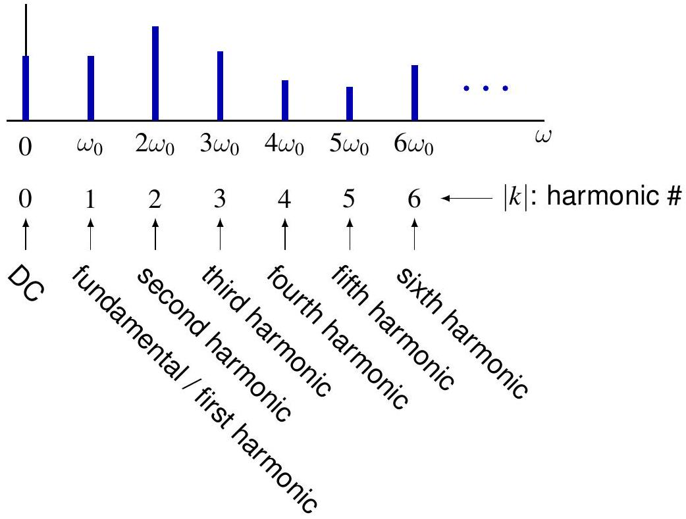


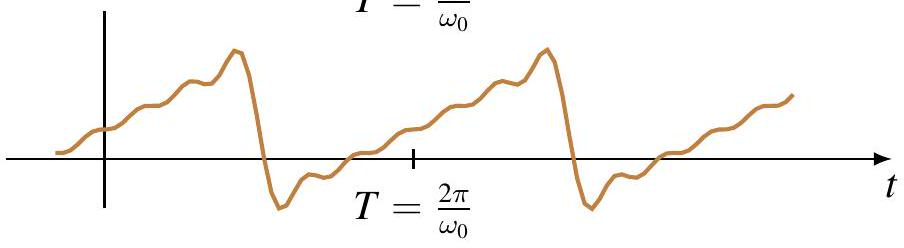

## 谐波的正交归一性 (Orthonormality)

回顾对于 $k \neq 0$，

$$
\int_{a}^{b} e^{j k \omega_{0} t} d t=\frac{e^{j k \omega_{0} b}-e^{j k \omega_{0} a}}{j k \omega_{0}}
$$

由于 $e^{j k \omega_{0} t}$ 具有周期 $T$，在任意一个周期内：

$$
\frac{1}{T} \int_{T} e^{j k \omega_{0} t} d t=\frac{1}{T} \int_{t_{0}}^{t_{0}+T} e^{j k \omega_{0} t} d t=\delta[k]
$$

定义两个周期为 $T$ 的信号的**内积 (inner product)** 为：

$$
\langle f, g\rangle=\frac{1}{T} \int_{T} f(t) \overline{g(t)} d t
$$

$\left\{e^{j k \omega_{0} t}: k \in \mathbb{Z}\right\}$ 是一个正交归一的函数系：

$$
\left\langle e^{j k \omega_{0} t}, e^{j m \omega_{0} t}\right\rangle=\frac{1}{T} \int_{T} e^{j(k-m) \omega_{0} t} d t=\delta_{k m}=\delta[k-m]
$$

## 谐波的正交性 (Orthogonality)

对于正弦和余弦函数：

$$
\begin{aligned}
& \left\langle\sin \left(k \omega_{0} t\right), \sin \left(m \omega_{0} t\right)\right\rangle=\frac{1}{2} \delta[k-m]-\frac{1}{2} \delta[k+m] \\
& \left\langle\cos \left(k \omega_{0} t\right), \cos \left(m \omega_{0} t\right)\right\rangle=\frac{1}{2} \delta[k-m]+\frac{1}{2} \delta[k+m] \\
& \left\langle\sin \left(k \omega_{0} t\right), \cos \left(m \omega_{0} t\right)\right\rangle=0
\end{aligned}
$$

**证明**：
使用欧拉公式和 $\left\{e^{i k \omega_{0} t}: k \in \mathbb{Z}\right\}$ 的正交归一性。

## 谐波的正交性 (图示)

$$
\begin{gathered}
\sin \left(\omega_{0} t\right) \\
\sin \left(2 \omega_{0} t\right)
\end{gathered}
$$


$$
\begin{aligned}
& \sin \left(\omega_{0} t\right) \\
& \cos \left(\omega_{0} t\right)
\end{aligned}
$$


## 傅里叶系数 (Fourier Coefficients)

假设 $x$ 周期为 $T$ 且有傅里叶级数表示：

$$
x(t)=\sum_{k=-\infty}^{\infty} c_{k} e^{j k \omega_{0} t}, \quad \omega_{0}=\frac{2 \pi}{T}
$$

利用 $\left\{e^{j k \omega_{0} t}\right\}$ 的正交归一性求解傅里叶系数：

$$
\begin{aligned}
\left\langle x, e^{j m \omega_{0} t}\right\rangle & =\left\langle\sum_{k=-\infty}^{\infty} c_{k} e^{j k \omega_{0} t}, e^{j m \omega_{0} t}\right\rangle \\
& =\sum_{k=-\infty}^{\infty} c_{k}\left\langle e^{j k \omega_{0} t}, e^{j m \omega_{0} t}\right\rangle \\
& =\sum_{k=-\infty}^{\infty} c_{k} \delta[m-k]=c_{m}
\end{aligned}
$$

## 复数傅里叶级数

**综合方程 (Synthesis equation)**

$$
x(t)=\sum_{k=-\infty}^{\infty} \hat{x}[k] e^{j k \omega_{0} t}=\sum_{k=-\infty}^{\infty} \hat{x}[k] e^{j k \frac{2 \pi}{T} t}
$$

$N$ 次部分和：
$$
S_{N}(x)(t)=\sum_{k=-N}^{N} \hat{x}[k] e^{i k \omega_{0} t}
$$

**分析方程 (Analysis equation)**

$$
\hat{x}[k]=\left\langle x, e^{j k \omega_{0} t}\right\rangle=\frac{1}{T} \int_{T} x(t) e^{-j k \omega_{0} t} d t=\frac{1}{T} \int_{T} x(t) e^{-j k \frac{2 \pi}{T} t} d t
$$

## 三角傅里叶级数

对于正弦和余弦：
* 正弦与正弦正交
* 余弦与余弦正交
* 正弦与余弦正交

**综合方程**

$$
x(t)=a_{0}+\sum_{k=1}^{\infty}\left[a_{k} \cos \left(k \omega_{0} t\right)+b_{k} \sin \left(k \omega_{0} t\right)\right]
$$

**分析方程**

$$
a_{k}=\frac{2-\delta[k]}{T} \int_{T} x(t) \cos \left(k \omega_{0} t\right) d t, \quad b_{k}=\frac{2}{T} \int_{T} x(t) \sin \left(k \omega_{0} t\right) d t
$$

## 两种形式的等价性

**复数形式**
$$
x(t)=\sum_{k=-\infty}^{\infty} \hat{x}[k] e^{j k \omega_{0} t}
$$

**三角形式**
$$
x(t)=a_{0}+\sum_{k=1}^{\infty}\left[a_{k} \cos \left(k \omega_{0} t\right)+b_{k} \sin \left(k \omega_{0} t\right)\right]
$$

**系数转换 (通过欧拉公式)**

$$
\left\{\begin{array}{ll}
a_{0}=\hat{x}[0] \\
a_{k}=\hat{x}[k]+\hat{x}[-k], \\
b_{k}=j(\hat{x}[k]-\hat{x}[-k]),
\end{array} \quad k \geq 1 \quad k \geq 1 \quad \begin{cases}\hat{x}[0]=a_{0} \\
\hat{x}[k]=\frac{1}{2}\left(a_{k}-j b_{k}\right), & k \geq 1 \\
\hat{x}[k]=\frac{1}{2}\left(a_{k}+j b_{-k}\right), & k \leq-1\end{cases}\right.
$$

复数形式中的负频率是为了数学上的方便引入的，没有直接的物理意义。

## 例子

例子：$x(t)=e^{j \omega_{0} t}, \hat{x}[k]=\delta[k-1]$
频谱 $\hat{x}[k]$


例子：$x(t)=\cos \left(\omega_{0} t+\phi\right)=\frac{e^{i \phi}}{2} e^{j \omega_{0} t}+\frac{e^{-j \phi}}{2} e^{-j \omega_{0} t}$，

$$
\hat{x}[1]=\frac{1}{2} e^{j \phi}, \quad, \hat{x}[-1]=\frac{1}{2} e^{-j \phi}, \quad \hat{x}[k]=0, k \neq \pm 1
$$

幅度谱 $|\hat{x}[k]|$


相位谱 $\arg \hat{x}[k]$


## 例子：三角波 (Triangle Wave)

在一个周期内，

$$
x(t)=1-\frac{2|t|}{T}, \quad|t| \leq \frac{T}{2}
$$


傅里叶系数：

$$
k=0, \quad \hat{x}[0]=\frac{1}{T} \int_{-T / 2}^{T / 2}\left(1-\frac{2|t|}{T}\right) d t=\frac{1}{2}
$$

$k \neq 0, k$ 为奇数,$\quad \hat{x}[k]=\frac{1}{T} \int_{-T / 2}^{T / 2}\left(1-\frac{2|t|}{T}\right) e^{-j k \omega_{0} t} d t=\frac{2}{\pi^{2} k^{2}}$
$k \neq 0, k$ 为偶数, $\quad \hat{x}[k]=0$

## 例子：三角波频谱

$$
\hat{x}[k]= \begin{cases}\frac{1}{2}, & k=0 \\ \frac{2}{\pi^{2} k^{2}}, & k \neq 0 \text { 奇数 } \\ 0, & k \neq 0 \text { 偶数 }\end{cases}
$$

固定 $T$ 的频谱，频率间隔 $\Delta \omega=\frac{2 \pi}{T} \omega_{k}=k \frac{2 \pi}{T}$


## 例子：三角波合成 ($N=0$)

$$
S_{0}(x)(t)=\sum_{k=-0}^{0} \hat{x}[k] e^{j k \omega_{0} t}
$$


## 例子：三角波合成 ($N=1$)

$$
S_{1}(x)(t)=\sum_{k=-1}^{1} \hat{x}[k] e^{j k \omega_{0} t}
$$


## 例子：三角波合成 ($N=3$)

$$
S_{3}(x)(t)=\sum_{k=-3}^{3} \hat{x}[k] e^{j k \omega_{0} t}
$$


## 例子：三角波合成 ($N=5$)

$$
S_{5}(x)(t)=\sum_{k=-5}^{5} \hat{x}[k] e^{j k \omega_{0} t}
$$


## 例子：三角波合成 ($N=7$)

$$
S_{7}(x)(t)=\sum_{k=-7}^{7} \hat{x}[k] e^{j k \omega_{0} t}
$$


## 例子：三角波合成 ($N=9$)

$$
S_{9}(x)(t)=\sum_{k=-9}^{9} \hat{x}[k] e^{j k \omega_{0} t}
$$


## 例子：三角波合成 ($N=19$)

$$
S_{19}(x)(t)=\sum_{k=-19}^{19} \hat{x}[k] e^{j k \omega_{0} t}
$$


## 例子：周期方波 (Periodic Square Wave)

在一个周期内，

$$
x(t)= \begin{cases}1, & |t|<T_{1} \\ 0, & T_{1}<|t|<T / 2\end{cases}
$$


傅里叶系数：

$$
\begin{array}{ll}
k=0, & \hat{x}[0]=\frac{1}{T} \int_{-T_{1}}^{T_{1}} 1 d t=\frac{2 T_{1}}{T} \\
k \neq 0, & \hat{x}[k]=\frac{1}{T} \int_{-T_{1}}^{T_{1}} e^{-j k \omega_{0} t} d t=\frac{2 \sin \left(k \omega_{0} T_{1}\right)}{k \omega_{0} T}=\frac{\sin \left(k \omega_{0} T_{1}\right)}{k \pi}
\end{array}
$$

## 例子：周期方波频谱

$$
\hat{x}[k]=\frac{\sin \left(k \frac{2 \pi T_{1}}{T}\right)}{k \pi}=\frac{2 \sin \left(\omega_{k} T_{1}\right)}{\omega_{k} T}
$$

固定 $T$，不同 $T_{1}$ 的频谱：


## 例子：周期方波频谱 (不同 $T$)

$$
\hat{x}[k]=\frac{\sin \left(k \frac{2 \pi T_{1}}{T}\right)}{k \pi}=\frac{2 \sin \left(\omega_{k} T_{1}\right)}{\omega_{k} T}
$$

固定 $T_{1}$，不同 $T$ 的频谱：


## 例子：方波合成 ($N=0$)

$$
S_{0}(x)(t)=\sum_{k=-0}^{0} \hat{x}[k] e^{j k \omega_{0} t}
$$


## 例子：方波合成 ($N=1$)

$$
S_{1}(x)(t)=\sum_{k=-1}^{1} \hat{x}[k] e^{j k \omega_{0} t}
$$


## 例子：方波合成 ($N=3$)

$$
S_{3}(x)(t)=\sum_{k=-3}^{3} \hat{x}[k] e^{j k \omega_{0} t}
$$


## 例子：方波合成 ($N=5$)

$$
S_{5}(x)(t)=\sum_{k=-5}^{5} \hat{x}[k] e^{j k \omega_{0} t}
$$


## 例子：方波合成 ($N=7$)

$$
S_{7}(x)(t)=\sum_{k=-7}^{7} \hat{x}[k] e^{j k \omega_{0} t}
$$


## 例子：方波合成 ($N=9$)

$$
S_{9}(x)(t)=\sum_{k=-9}^{9} \hat{x}[k] e^{j k \omega_{0} t}
$$


## 例子：方波合成 ($N=13$)

$$
S_{13}(x)(t)=\sum_{k=-13}^{13} \hat{x}[k] e^{j k \omega_{0} t}
$$


## 例子：方波合成 ($N=19$)

$$
S_{19}(x)(t)=\sum_{k=-19}^{19} \hat{x}[k] e^{j k \omega_{0} t}
$$


## 例子：方波合成 ($N=29$)

$$
S_{29}(x)(t)=\sum_{k=-29}^{29} \hat{x}[k] e^{j k \omega_{0} t}
$$


## 例子：方波合成 ($N=39$)

$$
S_{39}(x)(t)=\sum_{k=-39}^{39} \hat{x}[k] e^{j k \omega_{0} t}
$$


## 吉布斯现象 (Gibbs Phenomenon)

傅里叶级数的部分和在跳变间断点处“振铃”

- 随着项数增加，过冲越来越靠近间断点
- 过冲幅度趋近于跳变幅度的 $\approx 9 \%$


# 3. 连续时间傅里叶级数的性质

## CT 傅里叶级数的性质

傅里叶级数建立了周期函数与双无限序列之间的对应关系：

$$
x \stackrel{\mathcal{F S}}{\longleftrightarrow} \hat{x} \quad \text { 或 } \quad x(t) \stackrel{\mathcal{F S}}{\longleftrightarrow} \hat{x}[k]
$$

**线性 (Linearity)**
如果 $x, y$ 具有相同的周期 $T$，那么它们的线性组合 $a x+b y$ 也是，并且：

$$
\widehat{a x+b y}=a \hat{x}+b \hat{y}
$$

证明：

$$
\begin{aligned}
(\widehat{a x+b y})[k] & =\left\langle a x+b y, e^{j k \omega_{0} t}\right\rangle \\
& =a\left\langle x, e^{j k \omega_{0} t}\right\rangle+b\left\langle y, e^{j k \omega_{0} t}\right\rangle \\
& =a \hat{x}[k]+b \hat{y}[k]
\end{aligned}
$$

## CT 傅里叶级数的性质

**时移 (Time shifting)**
如果 $x$ 周期为 $T$ 且 $\omega_{0}=\frac{2 \pi}{T}$，

$$
\widehat{\tau_{t_{0}} x}=E_{-\omega_{0} t_{0}} \hat{x} \quad \text { 或 } \quad x\left(t-t_{0}\right) \stackrel{\mathcal{F S}}{\longleftrightarrow} e^{-j k \omega_{0} t_{0}} \hat{x}[k]
$$

其中 $\left(E_{a} \hat{x}\right)[k]=e^{j a k} \hat{x}[k]$
**时移 ⟺ 频率上的线性相位变化**

证明：

$$
\begin{aligned}
\left(\widehat{\tau_{t_{0}}} x\right)[k] & =\left\langle\tau_{t_{0}} x, e^{j k \omega_{0} t}\right\rangle=\left\langle x, \tau_{-t_{0}} e^{j k \omega_{0} t}\right\rangle \\
& =\left\langle x, e^{j k \omega_{0}\left(t+t_{0}\right)}\right\rangle=\left\langle x, e^{j k \omega_{0} t_{0}} e^{j k \omega_{0} t}\right\rangle \\
& =e^{-j k \omega_{0} t_{0}}\left\langle x, e^{j k \omega_{0} t}\right\rangle=e^{-j k \omega_{0} t_{0}} \hat{x}[k]=\left(E_{-\omega_{0} t_{0}} \hat{x}\right)[k]
\end{aligned}
$$

例子：$\cos (t)=\frac{1}{2} e^{j t}+\frac{1}{2} e^{-j t}, \sin (t)=\cos \left(t-\frac{\pi}{2}\right)=\frac{-j}{2} e^{j t}+\frac{j}{2} e^{-j t}$

<div style="position:absolute; right:-150px; bottom:-40px; font-size:0.6em;">
[返回目录](#toc4)
</div>

## 傅里叶级数 (回顾)

周期为 $T$ 且 $\omega_{0}=\frac{2 \pi}{T}$ 的信号 $x$ 的傅里叶级数：

$$
x(t)=\sum_{k=-\infty}^{\infty} \hat{x}[k] e^{j k \omega_{0} t}
$$

周期函数与双无限序列之间的对应关系；时域 vs. 频域：

$$
x \stackrel{\mathcal{F S}}{\longleftrightarrow} \hat{x} \quad \text { 或 } \quad x(t) \stackrel{\mathcal{F S}}{\longleftrightarrow} \hat{x}[k]
$$

- $\hat{x}$ 由 $x$ 在“基” $\left\{e^{j k \omega_{0} t}\right\}$ 下的展开系数组成
- 仅凭 $\hat{x}$ 不能唯一确定 $x$，
- 还需要知道基函数，或者等价地，知道周期 $T$ 或基频 $\omega_{0}$
- 相同的系数配合不同的基（周期）会给出不同的函数（稍后详述）

# 1. CT 傅里叶级数的性质

## 线性 (Linearity)

如果 $x, y$ 具有相同的周期 $T$，那么它们的线性组合 $a x+b y$ 也是，并且：

$$
\widehat{a x+b y}=a \hat{x}+b \hat{y}
$$

证明：

$$
\begin{aligned}
(\widehat{a x+b y})[k] & =\left\langle a x+b y, e^{j k \omega_{0} t}\right\rangle \\
& =a\left\langle x, e^{j k \omega_{0} t}\right\rangle+b\left\langle y, e^{j k \omega_{0} t}\right\rangle \\
& =a \hat{x}[k]+b \hat{y}[k]
\end{aligned}
$$

另一种证明思路：

$$
\left.\begin{array}{l}
x(t)=\sum_{k} \hat{x}[k] e^{j k \omega_{0} t} \\
y(t)=\sum_{k} \hat{y}[k] e^{j k \omega_{0} t}
\end{array}\right\} \Longrightarrow a x(t)+b y(t)=\sum_{k}(a \hat{x}[k]+b \hat{y}[k]) e^{j k \omega_{0} t}
$$

## 时移 (Time Shifting)

如果 $x$ 周期为 $T$ 且 $\omega_{0}=\frac{2 \pi}{T}$，

$$
\widehat{\tau_{t_{0}} x}=E_{-\omega_{0} t_{0}} \hat{x} \quad \text { 或 } \quad x\left(t-t_{0}\right) \stackrel{\mathcal{F S}}{\longleftrightarrow} e^{-j k \omega_{0} t_{0}} \hat{x}[k]
$$

其中 $\left(E_{a} \hat{x}\right)[k]=e^{j a k} \hat{x}[k]$

**时移 ⟺ 频率上的线性相位变化**

证明：

$$
\begin{aligned}
\left(\widehat{\tau_{t_{0}}} x\right)[k] & =\left\langle\tau_{t_{0}} x, e^{j k \omega_{0} t}\right\rangle=\left\langle x, \tau_{-t_{0}} e^{j k \omega_{0} t}\right\rangle \\
& =\left\langle x, e^{j k \omega_{0}\left(t+t_{0}\right)}\right\rangle=\left\langle x, e^{j k \omega_{0} t_{0}} e^{j k \omega_{0} t}\right\rangle \\
& =e^{-j k \omega_{0} t_{0}}\left\langle x, e^{j k \omega_{0} t}\right\rangle=e^{-j k \omega_{0} t_{0}} \hat{x}[k]=\left(E_{-\omega_{0} t_{0}} \hat{x}\right)[k]
\end{aligned}
$$

例子：$\cos (t)=\frac{1}{2} e^{j t}+\frac{1}{2} e^{-j t}, \sin (t)=\cos \left(t-\frac{\pi}{2}\right)=\frac{-j}{2} e^{j t}+\frac{j}{2} e^{-j t}$

## 频移 (Frequency Shifting)

如果 $x$ 周期为 $T$ 且 $\omega_{0}=\frac{2 \pi}{T}$，

$$
\widehat{E_{m \omega_{0}} x}=\tau_{m} \hat{x} \quad \text { 或 } \quad e^{j m \omega_{0} t} x(t) \stackrel{\mathcal{F S}}{\longleftrightarrow} \hat{x}[k-m]
$$

其中 $\left(E_{a} x\right)(t)=e^{j a t} x(t)$

**谐波指数调制 ⟹ 频移**

证明：

$$
\begin{aligned}
\left(\widehat{E_{m \omega_{0}}} x\right)[k] & =\left\langle E_{m \omega_{0}} x, e^{j k \omega_{0} t}\right\rangle=\left\langle x, E_{-m \omega_{0}} e^{j k \omega_{0} t}\right\rangle \\
& =\left\langle x, e^{j(k-m) \omega_{0} t}\right\rangle=\hat{x}[k-m]
\end{aligned}
$$

注意：用非谐波指数信号进行调制可能会改变基频，甚至导致非周期信号。

## 频移示例

例子：$x(t)=1+\cos \left(\omega_{0} t\right)=1+\frac{1}{2} e^{j \omega_{0} t}+\frac{1}{2} e^{-j \omega_{0} t}$

$$
y(t)=e^{j 3 \omega_{0} t} x(t)=e^{j 3 \omega_{0} t}+\frac{1}{2} e^{j 4 \omega_{0} t}+\frac{1}{2} e^{j 2 \omega_{0} t}
$$


## 频移示例

例子：$x(t)=1+\cos \left(\omega_{0} t\right)=1+\frac{1}{2} e^{j \omega_{0} t}+\frac{1}{2} e^{-j \omega_{0} t}$

$$
\begin{aligned}
z(t)=\cos \left(3 \omega_{0} t\right) x(t)=\operatorname{Re} y(t) & =\frac{1}{2} e^{j 3 \omega_{0} t}+\frac{1}{4} e^{j 4 \omega_{0} t}+\frac{1}{4} e^{j 2 \omega_{0} t} \\
& +\frac{1}{2} e^{-j 3 \omega_{0} t}+\frac{1}{4} e^{-j 4 \omega_{0} t}+\frac{1}{4} e^{-j 2 \omega_{0} t}
\end{aligned}
$$


## 时间反转 (Time Reversal)

如果 $x$ 周期为 $T$，

$$
\widehat{R x}=R \hat{x} \quad \text { 或 } \quad x(-t) \stackrel{\mathcal{F S}}{\longleftrightarrow} \hat{x}[-k]
$$

时间反转与傅里叶级数可交换


证明：

$$
(\widehat{R x})[k]=\left\langle R x, e^{j k \omega_{0} t}\right\rangle=\left\langle x, R e^{j k \omega_{0} t}\right\rangle=\left\langle x, e^{-j k \omega_{0} t}\right\rangle=\hat{x}[-k]
$$

推论：傅里叶级数保持奇/偶对称性，即
$x$ 偶 $\Longleftrightarrow \hat{x}$ 偶，$\quad x$ 奇 $\Longleftrightarrow \hat{x}$ 奇

## 时间缩放 (Time Scaling)

如果 $x$ 周期为 $T$，那么 $S_{a} x$ 周期为 $T / a$

$$
\widehat{S_{a} x}=\hat{x} \quad \text { 或 } \quad x(a t) \stackrel{\mathcal{F S}}{\longleftrightarrow} \hat{x}[k]
$$

时间缩放保持傅里叶系数不变，但改变基频

$$
\begin{aligned}
x(t) & =\sum_{k=-\infty}^{\infty} \hat{x}[k] e^{j k \omega_{0} t} \\
x(a t) & =\sum_{k=-\infty}^{\infty} \hat{x}[k] e^{j k\left(a \omega_{0}\right) t}
\end{aligned}
$$


## 时间缩放

$$
x(t)=\sum_{k=-\infty}^{\infty} \hat{x}[k] e^{j k \omega_{0} t}
$$

对比 $\quad x(a t)=\sum_{k=-\infty}^{\infty} \hat{x}[k] e^{j k\left(a \omega_{0}\right) t}$


时域压缩 ⟺ 频域（基频）扩展
时域扩展 ⟹ 频域（基频）压缩

## 微分 (Differentiation)

如果 $x$ 周期为 $T$，那么其导数 $x^{\prime}$ 也是，且

$$
\widehat{x^{\prime}}=M_{\omega_{0}} \hat{x} \quad \text { 或 } \quad x^{\prime}(t) \stackrel{\mathcal{F S}}{\longleftrightarrow} j k \omega_{0} \hat{x}[k]
$$

其中 $\left(M_{a} \hat{x}\right)[k]=j a k \hat{x}[k]$
**时域微分 ⟹ 频域乘以 $j k \omega_{0}$**

证明：

$$
\begin{aligned}
\widehat{x^{\prime}}[k] & =\frac{1}{T} \int_{T} x^{\prime}(t) e^{-j k \omega_{0} t} d t \\
& =\left.\frac{1}{T}\left[x(t) e^{-j k \omega_{0} t}\right]\right|_{0} ^{T}+j k \omega_{0}\left(\frac{1}{T} \int_{T} x(t) e^{-j k \omega_{0} t} d t\right)=j k \omega_{0} \hat{x}[k]
\end{aligned}
$$

或者，逐项求导：

$$
x(t)=\sum_{k} \hat{x}[k] e^{j k \omega_{0} t} \Longrightarrow x^{\prime}(t)=\sum_{k} j k \omega_{0} \hat{x}[k] e^{-j k \omega_{0} t}
$$

## 积分 (Integration)

如果 $x$ 周期为 $T$ 且有傅里叶级数

$$
x(t)=\sum_{k=-\infty}^{\infty} \hat{x}[k] e^{j k \omega_{0} t}
$$

逐项积分：

$$
\begin{aligned}
y(t) \triangleq \int_{0}^{t} x(s) d s & =\hat{x}[0] t+\sum_{k \neq 0} \hat{x}[k] \frac{e^{j k \omega_{0} t}-1}{j k \omega_{0}} \\
& =\hat{x}[0] t-\sum_{k \neq 0} \frac{\hat{x}[k]}{j k \omega_{0}}+\sum_{k \neq 0} \frac{1}{j k \omega_{0}} \hat{x}[k] e^{j k \omega_{0} t}
\end{aligned}
$$

- $y$ 是周期的，当且仅当 $\hat{x}[0]=0$，即 $x$ 没有直流分量
- 如果 $\hat{x}[0]=0, y$ 周期为 $T$，

$$
\hat{y}[k]=\frac{1}{j k \omega_{0}} \hat{x}[k] \quad \text { 对于 } k \neq 0
$$

## 例子：三角波


## 乘法 (Multiplication)

如果 $x$ 和 $y$ 具有相同的周期 $T$，那么它们的乘积 $x y$ 也是，且

$$
\begin{gathered}
\widehat{x y}=\hat{x} * \hat{y} \quad \text { 或 } \quad x(t) y(t) \stackrel{\mathcal{F S}}{\longleftrightarrow} \sum_{m=-\infty}^{\infty} \hat{x}[m] \hat{y}[k-m] \\
\text { 时域乘法 } \Longleftrightarrow \text { 频域卷积 }
\end{gathered}
$$

证明：

$$
\begin{aligned}
x(t) y(t) & =\left(\sum_{m=-\infty}^{\infty} \hat{x}[m] e^{j m \omega_{0} t}\right)\left(\sum_{\ell=-\infty}^{\infty} \hat{y}[\ell] e^{j \ell \omega_{0} t}\right) \\
& =\sum_{m=-\infty}^{\infty} \sum_{\ell=-\infty}^{\infty} \hat{x}[m] \hat{y}[\ell] e^{j(m+\ell) \omega_{0} t} \\
& =\sum_{k=-\infty}^{\infty}\left(\sum_{m=-\infty}^{\infty} \hat{x}[m] \hat{y}[k-m]\right) e^{j k \omega_{0} t} \quad(k=m+\ell)
\end{aligned}
$$

## 周期卷积 (Periodic Convolution)

具有相同周期 $T$ 的 $x$ 和 $y$ 的周期卷积 $x * y$ 定义为：

$$
(x * y)(t)=\int_{T} x(\tau) y(t-\tau) d \tau
$$

性质：

- 交换律

$$
x * y=y * x
$$

- 结合律

$$
(x * y) * z=x *(y * z)
$$

- 双线性

$$
\left(\sum_{i} a_{i} x_{i}\right) *\left(\sum_{j} b_{j} y_{j}\right)=\sum_{i, j} a_{i} b_{j}\left(x_{i} * y_{j}\right)
$$

## 周期卷积性质

傅里叶系数满足

$$
\widehat{x * y}=T \hat{x} \hat{y} \quad \text { 或 } \quad(x * y)(t) \stackrel{\mathcal{F S}}{\longleftrightarrow} T \hat{x}[k] \hat{y}[k]
$$

**时域卷积 ⟹ 频域乘法**

证明：

$$
\begin{aligned}
(\widehat{x * y})[k] & =\frac{1}{T} \int_{T}(x * y)(t) e^{-j k \omega_{0} t} d t \\
& =\frac{1}{T} \int_{T}\left(\int_{T} x(\tau) y(t-\tau) d \tau\right) e^{-j k \omega_{0} t} d t \\
& =\int_{T} x(\tau)\left(\frac{1}{T} \int_{T} y(t-\tau) e^{-j k \omega_{0} t} d t\right) d \tau \\
& =\int_{T} x(\tau)\left(e^{-j k \omega_{0} \tau} \hat{y}[k]\right) d \tau=T \hat{x}[k] \hat{y}[k]
\end{aligned}
$$

## 共轭与对称 (Conjugation and Symmetry)

如果 $x$ 周期为 $T$，那么其复共轭 $\bar{x}=x^{*}$ 也是，且

$$
\widehat{x^{*}}=R \hat{x}^{*} \quad \text { 或 } \quad x^{*}(t) \stackrel{\mathcal{F S}}{\longleftrightarrow}(\hat{x}[-k])^{*}
$$

证明：

$$
\widehat{x^{*}}[k]=\left\langle x^{*}, e^{j k \omega_{0} t}\right\rangle=\overline{\left\langle x, e^{-j k \omega_{0} t}\right\rangle}=\overline{\hat{x}[-k]}
$$

推论：如果 $x$ 是实信号，则 $\hat{x}$ 是共轭对称的，即

$$
\hat{x}[-k]=\overline{\hat{x}[k]}
$$

推论：如果 $x$ 是实偶信号，则 $\hat{x}$ 也是实偶信号

$$
\hat{x}[k]=\hat{x}[-k]=\overline{\hat{x}[k]}
$$

推论：如果 $x$ 是实奇信号，则 $\hat{x}$ 是纯虚奇信号

$$
-\hat{x}[k]=\hat{x}[-k]=\overline{\hat{x}[k]}
$$

# 2. 傅里叶级数的收敛性

## 向量空间 (Vector Space)

域 $\mathbb{F}$ ($\mathbb{R}$ 或 $\mathbb{C}$) 上的向量空间 $V$ 具有两种运算：

- 加法：$x, y \in V \Longrightarrow x+y \in V$
- 标量乘法：$\lambda \in \mathbb{F}, x \in V \Longrightarrow \lambda x \in V$

满足以下公理：

1. 加法交换律：$x+y=y+x, \forall x, y \in V$
2. 加法结合律：$(x+y)+z=x+(y+z), \forall x, y, z \in V$
3. 加法单位元：$\exists 0 \in V$ s.t. $x+0=x, \forall x \in V$
4. 加法逆元：$\forall x \in V, \exists y \in V$ s.t. $x+y=0$
5. 标量乘法单位元：$1 x=x, \forall x \in V$
6. 标量与域乘法的相容性：$\lambda_{1}\left(\lambda_{2} x\right)=\left(\lambda_{1} \lambda_{2}\right) x, \forall \lambda_{1}, \lambda_{2} \in \mathbb{F}, x \in V$
7. 分配律：$\lambda(x+y)=\lambda x+\lambda y, \forall \lambda \in \mathbb{F}, x, y \in V$
8. 分配律：$\left(\lambda_{1}+\lambda_{2}\right) x=\lambda_{1} x+\lambda_{2} x, \forall \lambda_{1}, \lambda_{2} \in \mathbb{F}, x \in V$

## 向量空间示例

示例：$\mathbb{R}^{n}, \mathbb{C}^{n}$

$$
\begin{gathered}
\left(x_{1}, \ldots, x_{n}\right)^{T}+\left(y_{1}, \ldots, y_{n}\right)^{T}=\left(x_{1}+y_{1}, \ldots, x_{n}+y_{n}\right)^{T} \\
\lambda\left(x_{1}, \ldots, x_{n}\right)^{T}=\left(\lambda x_{1}, \ldots, \lambda x_{n}\right)^{T}
\end{gathered}
$$

示例：CT 实/复值信号 $\mathbb{R}^{\mathbb{R}}, \mathbb{C}^{\mathbb{R}}$

$$
\begin{gathered}
(x+y)(t)=x(t)+y(t) \\
(\lambda x)(t)=\lambda x(t)
\end{gathered}
$$

示例：DT 实/复值信号 $\mathbb{R}^{\mathbb{Z}}, \mathbb{C}^{\mathbb{Z}}$

$$
\begin{gathered}
(x+y)[n]=x[n]+y[n] \\
(\lambda x)[n]=\lambda x[n]
\end{gathered}
$$

## 赋范向量空间 (Normed Vector Space)

域 $\mathbb{F}$ 上向量空间 $V$ 的范数 $\|\cdot\|: V \rightarrow \mathbb{R}_{+}$ 满足：

- 正定性 (Positive definiteness)

$$
\|x\|=0 \Longleftrightarrow x=0
$$

- 绝对齐次性 (Absolute homogeneity)

$$
\|\lambda x\|=|\lambda| \cdot\|x\|, \quad \forall \lambda \in \mathbb{F}, x \in V
$$

- 三角不等式 (Triangle inequality)

$$
\|x+y\| \leq\|x\|+\|y\|
$$

带有范数的向量空间称为赋范向量空间。

## 赋范向量空间示例

示例：$\mathbb{R}^{n}, \mathbb{C}^{n}$

$$
\|x\|_{p}= \begin{cases}\left(\sum_{k=1}^{n}\left|x_{k}\right|^{p}\right)^{1 / p}, & 1 \leq p<\infty \\ \max _{1 \leq k \leq n}\left|x_{k}\right|, & p=\infty\end{cases}
$$

示例：CT 实/复值信号 $\mathbb{R}^{\mathbb{R}}, \mathbb{C}^{\mathbb{R}}$

$$
\|x\|_{p}= \begin{cases}\left(\int|x(t)|^{p} d t\right)^{1 / p}, & 1 \leq p<\infty \\ \sup _{t}|x(t)|, & p=\infty\end{cases}
$$

示例：DT 实/复值信号 $\mathbb{R}^{\mathbb{Z}}, \mathbb{C}^{\mathbb{Z}}$

$$
\|x\|_{p}= \begin{cases}\left(\sum_{k=-\infty}^{\infty}|x[k]|^{p}\right)^{1 / p}, & 1 \leq p<\infty \\ \sup _{k \in \mathbb{Z}}|x[k]|, & p=\infty\end{cases}
$$

## 内积空间 (Inner Product Space)

域 $\mathbb{F}$ ($\mathbb{R}$ 或 $\mathbb{C}$) 上向量空间 $V$ 的内积 $\langle\cdot, \cdot\rangle: V \times V \rightarrow \mathbb{F}$ 满足：

- 共轭对称性 (Conjugate symmetry)

$$
\langle x, y\rangle=\overline{\langle y, x\rangle}
$$

- 第一变元线性 (Linearity in first argument)

$$
\langle a x+b y, z\rangle=a\langle x, z\rangle+b\langle x, z\rangle
$$

- 正定性 (Positive definiteness)

$$
\begin{gathered}
\langle x, x\rangle \geq 0 \\
\langle x, x\rangle=0 \Longleftrightarrow x=0
\end{gathered}
$$

带有内积的向量空间称为内积空间。

## 内积空间示例

示例：$\mathbb{R}^{n}, \mathbb{C}^{n}$

$$
\langle x, y\rangle=\sum_{k=1}^{n} x_{k} \bar{y}_{k}
$$

示例：CT 实/复值信号 $\mathbb{R}^{\mathbb{R}}, \mathbb{C}^{\mathbb{R}}$

$$
\langle x, y\rangle=\int_{\mathbb{R}} x(t) \overline{y(t)} d t
$$

示例：DT 实/复值信号 $\mathbb{R}^{\mathbb{Z}}, \mathbb{C}^{\mathbb{Z}}$

$$
\langle x, y\rangle=\sum_{k=-\infty}^{\infty} x[k] \overline{y[k]}
$$

在所有情况下：

$$
\|x\|_{2}=\sqrt{\langle x, x\rangle}
$$

对于内积空间，通常用 $\|\cdot\|$ 代替 $\|\cdot\|_{2}$。

## 柯西-施瓦茨不等式 (Cauchy-Schwarz Inequality)

$$
|\langle x, y\rangle| \leq\|x\| \cdot\|y\|
$$

证明：如果 $\|y\|=0$，则 $y=0$ 且 $\langle x, y\rangle=\|x\| \cdot\|y\|$。现在假设 $\|y\| \neq 0$。对于任意 $\lambda \in \mathbb{C}$，

$$
0 \leq\langle x-\lambda y, x-\lambda y\rangle=\|x\|^{2}-\lambda \overline{\langle x, y\rangle}-\bar{\lambda}\langle x, y\rangle+|\lambda|^{2}\|y\|^{2}
$$

令 $\lambda=\langle x, y\rangle /\|y\|^{2}$，

$$
0 \leq\|x\|^{2}-\frac{|\langle x, y\rangle|^{2}}{\|y\|^{2}}-\frac{|\langle x, y\rangle|^{2}}{\|y\|^{2}}+\frac{|\langle x, y\rangle|^{2}}{\|y\|^{2}} \Longrightarrow|\langle x, y\rangle| \leq\|x\| \cdot\|y\|
$$

积分形式：

$$
\left|\int_{\mathbb{R}} x(t) \overline{y(t)} d t\right| \leq \sqrt{\int_{\mathbb{R}}|x(t)|^{2} d t} \cdot \sqrt{\int_{\mathbb{R}}|y(t)|^{2} d t}
$$

## 内积空间中的正交归一系

如果 $\langle x, y\rangle=0$，则两个向量 $x, y \in V$ 是**正交**的。
如果 $\|x\|=1$ 或 $\langle x, x\rangle=1$，则向量 $x \in V$ 是**单位向量**。
如果对于 $m \neq k$，$\left\langle x_{k}, x_{m}\right\rangle=0$，则 $\left\{x_{k}\right\}$ 是**正交系**。
如果 $\left\langle e_{k}, e_{m}\right\rangle=\delta_{k m}=\delta[k-m]$，则 $\left\{e_{k}\right\}$ 是**正交归一系 (orthonormal system)**。

示例：令 $V$ 为周期为 $T$ 的函数集合。内积为：

$$
\langle x, y\rangle=\frac{1}{T} \int_{T} x(t) \overline{y(t)} d t
$$

令 $e_{k}(t)=e^{j k \frac{2 \pi}{T} t}$。回顾 $\left\{e_{k}: k \in \mathbb{Z}\right\}$ 是正交归一系：

$$
\left\langle e_{k}, e_{m}\right\rangle=\delta[k-m]
$$

## 正交归一展开 (Orthonormal Expansion)

给定正交归一系 $\left\{e_{k}\right\}$，假设

$$
x=\sum_{k} c_{k} e_{k}
$$

通过与 $e_{m}$ 做内积来求系数：

$$
\left\langle x, e_{m}\right\rangle=\left\langle\sum_{k} c_{k} e_{k}, e_{m}\right\rangle=\sum_{k} c_{k}\left\langle e_{k}, e_{m}\right\rangle=\sum_{k} c_{k} \delta[k-m]=c_{m}
$$

广义傅里叶级数：

$$
x=\sum_{k}\left\langle x, e_{k}\right\rangle e_{k}
$$

这就是我们要做的傅里叶级数展开。

## 最佳均方逼近 (Best Mean-square Approximation)

用 $\operatorname{span}\left\{e_{1}, \ldots, e_{n}\right\}$ 中的元素逼近 $x$ 的均方误差，即用形式为 $y=\sum_{k=1}^{n} a_{k} e_{k}$ 的元素：

$$
\begin{aligned}
\|x-y\|^{2} & =\left\langle x-\sum_{k=1}^{n} a_{k} e_{k}, x-\sum_{k=1}^{n} a_{k} e_{k}\right\rangle \\
& =\|x\|^{2}-\sum_{k=1}^{n} a_{k}\left\langle e_{k}, x\right\rangle-\sum_{k=1}^{n} \bar{a}_{k}\left\langle x, e_{k}\right\rangle+\sum_{k=1}^{n}\left|a_{k}\right|^{2} \\
& =\|x\|^{2}-2 \sum_{k=1}^{n} \operatorname{Re}\left(\bar{a}_{k}\left\langle x, e_{k}\right\rangle\right)+\sum_{k=1}^{n}\left|a_{k}\right|^{2} \\
& \geq\|x\|^{2}-2 \sum_{k=1}^{n}\left|a_{k}\right| \cdot\left|\left\langle x, e_{k},\right\rangle\right|+\sum_{k=1}^{n}\left|a_{k}\right|^{2} \quad(\text { 使用 }|\operatorname{Re} z| \leq|z|) \\
& =\|x\|^{2}-\sum_{k=1}^{n}\left|\left\langle x, e_{k}\right\rangle\right|^{2}+\sum_{k=1}^{n}\left(\left|a_{k}\right|-\left|\left\langle x, e_{k},\right\rangle\right|\right)^{2}
\end{aligned}
$$

## 最佳均方逼近 (续)

逼近的均方误差：

$$
\begin{aligned}
\|x-y\|^{2} & \stackrel{(1)}{\geq}\|x\|^{2}-\sum_{k=1}^{n}\left|\left\langle x, e_{k}\right\rangle\right|^{2}+\sum_{k=1}^{n}\left(\left|a_{k}\right|-\left|\left\langle x, e_{k},\right\rangle\right|\right)^{2} \\
& \stackrel{(2)}{\geq}\|x\|^{2}-\sum_{k=1}^{n}\left|\left\langle x, e_{k}\right\rangle\right|^{2}
\end{aligned}
$$

当且仅当 $a_{k}=\left\langle x, e_{k}\right\rangle$ 时达到最小均方误差。

- (1) 处取等号要求 $\arg a_{k}=\arg \left\langle x, e_{k}\right\rangle$
- (2) 处取等号要求 $\left|a_{k}\right|=\left|\left\langle x, e_{k}\right\rangle\right|$

傅里叶部分和 $S_{N}(x)=\sum_{k=-N}^{N} \hat{x}[k] e^{j k \omega_{0} t}$ 是最佳均方逼近：

$$
\left\|x-S_{N}(x)\right\|^{2}=\min _{a_{k},-N \leq k \leq N}\left\|x-\sum_{k=-N}^{N} a_{k} e^{j k \omega_{0} t}\right\|^{2}
$$

## 贝塞尔不等式 (Bessel's Inequality)

最小均方误差：

$$
\left\|x-\sum_{k=1}^{n}\left\langle x, e_{k}\right\rangle e_{k}\right\|^{2}=\|x\|^{2}-\sum_{k=1}^{n}\left|\left\langle x, e_{k}\right\rangle\right|^{2}
$$

贝塞尔不等式：

$$
\sum_{k}\left|\left\langle x, e_{k}\right\rangle\right|^{2} \leq\|x\|^{2}
$$

对于具有有限 2-范数的信号的傅里叶系数：

$$
\sum_{k=-\infty}^{\infty}|\hat{x}[k]|^{2} \leq\|x\|^{2}
$$

推论：$\lim _{k \rightarrow \infty} \hat{x}[k]=0$

## 帕塞瓦尔恒等式 (Parseval's Identity)

对于具有有限 **2-范数** 的信号的傅里叶系数：

$$
\sum_{k=-\infty}^{\infty}|\hat{x}[k]|^{2}=\|x\|^{2}=\frac{1}{T} \int_{T}|x(t)|^{2} d t
$$

解释：能量守恒

- $|\hat{x}[k]|^{2}$ 是第 $k$ 次谐波分量的平均功率
- $\|x\|^{2}$ 是 $x$ 的平均功率
- 总功率是所有分量功率之和

定理：傅里叶级数在均方意义下收敛

$$
\lim _{N \rightarrow \infty}\left\|x-S_{N}(x)\right\|=0
$$

注意：均方收敛并不意味着逐点收敛。

## 最佳均方逼近

Given orthonormal system $\left\{e_{1}, \ldots, e_{n}\right\}$, best mean-square approximation of $x$ by element in $\operatorname{span}\left\{e_{1}, \ldots, e_{n}\right\}$, i.e. by element of form $y=\sum_{k=1}^{n} a_{k} e_{k}$ is

$$
y=\sum_{k=1}^{n}\left\langle x, e_{k}\right\rangle e_{k},
$$

with minimum mean-square error

$$
\|x-y\|^{2}=\|x\|^{2}-\sum_{k=1}^{n}\left|\left\langle x, e_{k}\right\rangle\right|^{2} .
$$

## Geometry of 最佳均方逼近

Orthogonal projection onto subspace span $\left\{e_{1}, \ldots, e_{n}\right\}$
Pythagorean theorem


## 赋范向量空间中的收敛

In normed vector space $(V,\|\cdot\|)$, sequence $\left\{x_{n}\right\}$ converges to $x \in V$ if

$$
\lim _{n \rightarrow \infty}\left\|x_{n}-x\right\|=0
$$

We say $x$ is the limit of $\left\{x_{n}\right\}$ and write

$$
x=\lim _{n \rightarrow \infty} x_{n}, \quad \text { or } \quad x_{n} \rightarrow x, \text { as } n \rightarrow \infty .
$$

Sequence $\left\{x_{n}\right\} \subset V$ is Cauchy sequence iff

$$
\left\|x_{n}-x_{m}\right\| \rightarrow 0, \quad \text { as } n, m \rightarrow \infty .
$$

Theorem. Every convergent sequence is Cauchy.
Proof. If $x_{n} \rightarrow x$, triangle inequality yields

$$
\left\|x_{n}-x_{m}\right\| \leq\left\|x_{n}-x\right\|+\left\|x_{m}-x\right\| \rightarrow 0, \quad \text { as } n, m \rightarrow \infty .
$$

## 巴拿赫空间

Normed vector space ( $V,\|\cdot\|$ ) is complete if every Cauchy sequence converges.

Complete normed vector space is called Banach space.

## 巴拿赫空间的例子

- $\left(\mathbb{R}^{n},\|\cdot\|_{p}\right),\left(\mathbb{C}^{n},\|\cdot\|_{p}\right)$
- DT signal space $\ell_{p}=\left\{x \in \mathbb{C}^{\mathbb{Z}}:\|x\|_{p}<\infty\right\}$ with $\ell_{p}$ norm
- CT signal space $L_{p}=\left\{x \in \mathbb{C}^{\mathbb{R}}:\|x\|_{p}<\infty\right\}$ with $L_{p}$ norm
- Space $L_{2}(T)$ of CT signals with period $T$ and finite average power, $\|x\|^{2}=\frac{1}{T} \int_{T}|x(t)|^{2} d t<\infty$
- Space $C(T)$ of continuous $T$-periodic CT signals with $L_{\infty}$ norm

$$
\|x\|_{\infty}=\sup _{t \in[0, T]}|x(t)|=\sup _{t \in \mathbb{R}}|x(t)| .
$$

$x_{n} \rightarrow x$ in $L_{\infty}$ norm means uniform convergence

## 巴拿赫空间

非完备空间的例子

- $(\mathbb{Q},|\cdot|)$. Its completion is $(\mathbb{R},|\cdot|)$
- Space $C(T)$ of continuous $T$-periodic CT signals with $L_{2}$ norm. Its completion is $L_{2}(T)$
- periodic odd function with period $T=1$

$$
x_{n}= \begin{cases}n t, & 0 \leq t \leq \frac{1}{n} \\ 1, & \frac{1}{n} \leq \frac{1}{2}-\frac{1}{n} \\ 1-n t, & \frac{1}{2}-\frac{1}{n} \leq t \leq \frac{1}{2}\end{cases}
$$

- $x_{n} \in C(1)$
- $x_{n}$ converges to periodic square wave in $L_{2}$ norm
- but periodic square function not in $C(1)$

Same vector space with different norms becomes different normed vector spaces, e.g $\left(C(T),\|\cdot\|_{\infty}\right)$ vs. $\left(C(T),\|\cdot\|_{2}\right)$

Incompleteness of $C(T)$ with $L_{2}$ Norm
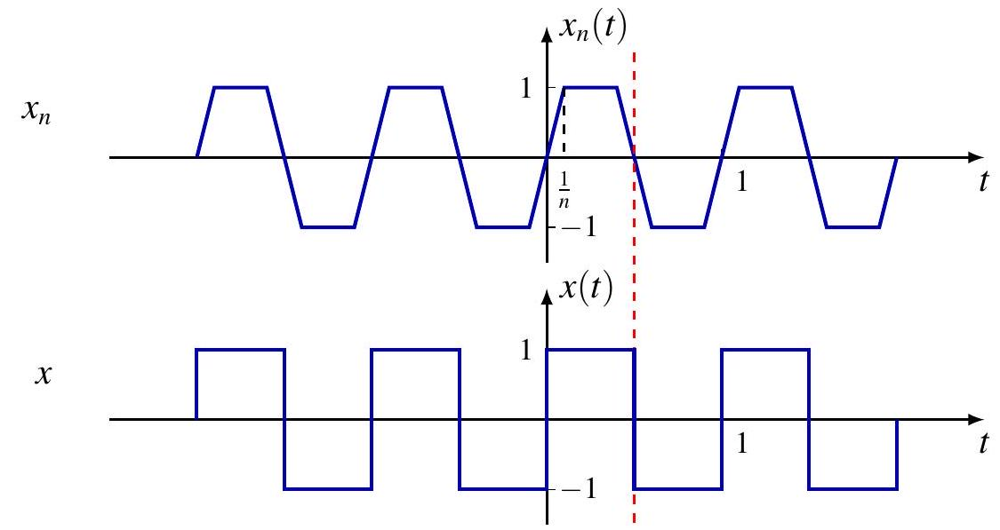
$\left\|x_{n}-x\right\|_{2}^{2}=\left(\int_{-\frac{1}{n}}^{\frac{1}{n}}+\int_{\frac{1}{2}-\frac{1}{n}}^{\frac{1}{2}+\frac{1}{n}}\right)\left|x_{n}(t)-x(t)\right|^{2} d t \leq \frac{4}{n} \rightarrow 0$
$x \in L_{2}(1)$ but $x \notin C(1)$. Also $\left\|x_{n}-x\right\|_{\infty}=1, \forall n$

## $L_{2}$ Convergence vs. 逐点收敛

For $n \geq 0$ and $0 \leq k<2^{n}$,

$$
n=0, k=0
$$

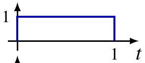

$$
x_{2^{n}+k}= \begin{cases}1, & \frac{k}{2^{n}} \leq t<\frac{k+1}{2^{n}} \\ 0, & \text { otherwise }\end{cases}
$$

$$
n=1, k=0
$$

$$
n=1, k=1
$$

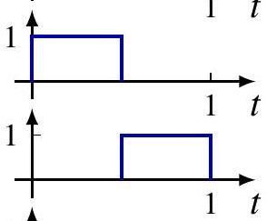

- $x_{2^{n}+k} \rightarrow 0$ in $L_{2}$ norm

$$
n=2, k=0
$$

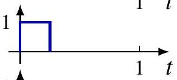

$$
\left\|x_{2^{n}+k}-0\right\|_{2}=\frac{1}{2^{n / 2}} \rightarrow 0
$$

$$
n=2, k=1
$$

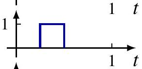

- not convergent at any $t_{0} \in[0,1)$
- $\forall n, \exists k_{1}$ s.t $x_{2^{n}+k_{1}}\left(t_{0}\right)=1$

$$
n=2, k=2
$$

- $\forall n, \exists k_{0}$ s.t $x_{2^{n}+k_{0}}\left(t_{0}\right)=0$

$$
n=2, k=3
$$

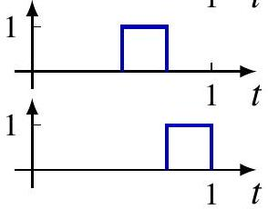

## 希尔伯特空间

Inner product space $(V,\langle\cdot, \cdot\rangle)$ is also normed vector space with induced norm $\|x\|=\sqrt{\langle x, x\rangle}$.
$(V,\langle\cdot, \cdot\rangle)$ is complete if ( $V,\|\cdot\|$ ) with induced norm is complete.
Complete inner produce space is called Hilbert space.

## 希尔伯特空间的例子

- $\mathbb{R}^{n}$ with $\langle x, y\rangle=\sum_{k=1}^{n} x_{k} y_{k} ; \mathbb{C}^{n}$ with $\langle x, y\rangle=\sum_{k=1}^{n} x_{k} \bar{y}_{k}$
- Space $\ell_{2}$ with $\langle x, y\rangle=\sum_{k=-\infty}^{\infty} x_{k} \bar{y}_{k}$
- Space $L_{2}$ with $\langle x, y\rangle=\int_{\mathbb{R}} x(t) \overline{y(t)} d t$
- Space $L_{2}(T)$ with $\langle x, y\rangle=\frac{1}{T} \int_{T} x(t) \overline{y(t)} d t$

Example of incomplete space

- Space $C(T)$ with $\langle x, y\rangle=\frac{1}{T} \int_{T} x(t) \overline{y(t)} d t L_{2}(T)$ is completion of $C(T)$.


## 完备正交规范序列

Orthonormal sequence $\left\{e_{k}: k \in \mathbb{N}\right\}$ in Hilbert space $H$ is complete if every $x \in H$ has expansion

$$
x=\sum_{k=1}^{\infty}\left\langle x, e_{k}\right\rangle e_{k}
$$

i.e.

$$
\lim _{n \rightarrow \infty}\left\|x-\sum_{k=1}^{n}\left\langle x, e_{k}\right\rangle e_{k}\right\|=0
$$

Complete orthonormal sequence also called orthonormal basis of $H$.

Example. $\left\{\delta_{k}: k \in \mathbb{Z}\right\}$ is orthonormal basis of $\ell_{2}$

## 帕塞瓦尔恒等式

If $\left\{e_{k}: k \in \mathbb{N}\right\}$ orthonormal basis of $H$,

$$
\|x\|^{2}=\sum_{k=1}^{\infty}\left|\left\langle x, e_{k}\right\rangle\right|^{2}
$$

Proof. By Pythagorean theorem

$$
\|x\|^{2}=\sum_{k=1}^{n}\left|\left\langle x, e_{k}\right\rangle\right|^{2}+\left\|x-\sum_{k=1}^{n}\left\langle x, e_{k}\right\rangle e_{k}\right\|^{2}
$$

Let $n \rightarrow \infty$ and last term goes to zero by definition of orthonormal basis.

## 帕塞瓦尔恒等式

$H$ is isomorphic to $\ell_{2}, x \leftrightarrow\left\{\left\langle x, e_{k}\right\rangle: k \in \mathbb{N}\right\}$ and

$$
\langle x, y\rangle=\sum_{k=1}^{\infty}\left\langle x, e_{k}\right\rangle \overline{\left\langle y, e_{k}\right\rangle}
$$

Proof.

$$
\begin{aligned}
\langle x, y\rangle & =\left\langle\sum_{k}\left\langle x, e_{k}\right\rangle e_{k}, \sum_{m}\left\langle y, e_{m}\right\rangle e_{m}\right\rangle \\
& =\sum_{k}\left\langle x, e_{k}\right\rangle \sum_{m} \overline{\left\langle y, e_{m}\right\rangle}\left\langle e_{k}, e_{m}\right\rangle \\
& =\sum_{k}\left\langle x, e_{k}\right\rangle \sum_{m} \overline{\left\langle y, e_{m}\right\rangle} \delta[k-m] \\
& =\sum_{k}\left\langle x, e_{k}\right\rangle \overline{\left\langle y, e_{k}\right\rangle}
\end{aligned}
$$

NB. When $x=y$, we recover $\|x\|^{2}=\sum_{k=1}^{\infty}\left|\left\langle x, e_{k}\right\rangle\right|^{2}$

## 傅里叶级数的均方收敛

Theorem. $\left\{e^{j k \frac{2 \pi}{T} t}: k \in \mathbb{Z}\right\}$ is orthonormal basis of $L_{2}(T)$.
For any $x \in L_{2}(T)$, Fourier series converges in mean-square, i.e. in $L_{2}$ norm

$$
\lim _{N \rightarrow \infty}\left\|x-S_{N}(x)\right\|=0
$$

NB. Convergence in mean-square does not imply pointwise convergence
Parseval's identity

$$
\sum_{k=-\infty}^{\infty}|\hat{x}[k]|^{2}=\|x\|^{2}=\frac{1}{T} \int_{T}|x(t)|^{2} d t
$$

Interpretation: Energy conservation

- $|\hat{x}[k]|^{2}$ is average power of $k$-th harmonic component
- $\|x\|^{2}$ is average power of $x$


## Fourier Series of $L_{2}$ Signals

Correspondence between periodic functions and doubly infinite sequences; time domain vs. frequency domain

$$
x \stackrel{\mathcal{F S}}{\longleftrightarrow} \hat{x} \quad \text { or } \quad x(t) \stackrel{\mathcal{F S}}{\longleftrightarrow} \hat{x}[k]
$$

Fourier series is isomorphism between Hilbert space of $L_{2}$ signals and Hilbert space of $\ell_{2}$ Fourier coefficients

$$
\begin{aligned}
\mathcal{F S}: L_{2}(T) & \rightarrow \ell_{2} \\
x & \mapsto \hat{x}
\end{aligned}
$$

Will see discrete-time Fourier transform goes from $\hat{x}$ to $x$
Parseval's theorem

$$
\langle x, y\rangle_{L_{2}(T)}=\langle\hat{x}, \hat{y}\rangle_{\ell_{2}}
$$

## 目录

1. 傅里叶级数的均方收敛
2. 傅里叶级数的逐点收敛
3. 周期冲激列的傅里叶级数
4. 滤波

## 部分和的积分表示

WLOG, focus on $T=2 \pi$ and $\omega_{0}=1$

$$
\begin{aligned}
S_{N}(x)(t) & =\sum_{k=-N}^{N} \hat{x}[k] e^{j k t} \\
& =\sum_{k=-N}^{N}\left(\frac{1}{2 \pi} \int_{2 \pi} x(\tau) e^{-j k \tau} d \tau\right) e^{j k t} \\
& =\frac{1}{2 \pi} \int_{2 \pi} x(\tau) \sum_{k=-N}^{N} e^{j k(t-\tau)} d \tau \\
& =\frac{1}{2 \pi} \int_{2 \pi} x(\tau) D_{N}(t-\tau) d \tau=\left(x * \frac{D_{N}}{2 \pi}\right)(t)
\end{aligned}
$$

where $D_{N}$ is Dirichlet kernel

$$
D_{N}(t)=\sum_{k=-N}^{N} e^{j k t}=\frac{\sin \left(\left(N+\frac{1}{2}\right) t\right)}{\sin (t / 2)}
$$

## 狄利克雷核

Plot of $\frac{D_{N}}{2 \pi}$ for various $N$


$N=4$


$N=8$


$N=16$

If $\frac{D_{N}}{2 \pi} \rightarrow \delta$ (more precisely, periodic impulse train on slide 22), then would have $S_{N}(x)=x * \frac{D_{N}}{2 \pi} \rightarrow x * \delta=x$ at least for continuous $x$

Unfortunately, exists continuous $x$ whose Fourier partial sum $S_{N}(x)$, as $N \rightarrow \infty$, fails to converge at all at some $t$, let alone converges to $x(t)$ at such $t$

## 逐点收敛

Theorem. If $x$ is differentiable, then $\lim _{N \rightarrow \infty} S_{N}(x)(t)=x(t), \forall t$.
Proof. Fix $t$. Define

$$
F(\tau)= \begin{cases}\frac{x(t-\tau)-x(t)}{\sin (\tau / 2)}, & \tau \neq 0 \\ -2 x^{\prime}(t), & \tau=0\end{cases}
$$

which is continuous on $[-\pi, \pi]$. Note $\frac{1}{2 \pi} \int_{-\pi}^{\pi} D_{N}(\tau) d \tau=1$.

$$
\begin{aligned}
S_{N}(x)(t)-x(t) & =\frac{1}{2 \pi} \int_{-\pi}^{\pi} x(t-\tau) D_{N}(\tau) d \tau-\frac{1}{2 \pi} \int_{-\pi}^{\pi} x(t) D_{N}(\tau) d \tau \\
& =\frac{1}{2 \pi} \int_{-\pi}^{\pi}[x(t-\tau)-x(t)] D_{N}(\tau) d \tau \\
& =\frac{1}{2 \pi} \int_{-\pi}^{\pi} F(\tau) \sin \left(\left(N+\frac{1}{2}\right) \tau\right) d \tau
\end{aligned}
$$

## 逐点收敛

Theorem. If $x$ is differentiable, then $\lim _{N \rightarrow \infty} S_{N}(x)(t)=x(t)$.
Proof (cont'd). Define $y(\tau)=e^{-j \frac{\tau}{2}} F(\tau)$.

$$
\begin{aligned}
S_{N}(x)(t)-x(t) & =\frac{1}{2 \pi} \int_{-\pi}^{\pi} F(\tau) \sin \left(\left(N+\frac{1}{2}\right) \tau\right) d \tau \\
& =-\operatorname{lm} \frac{1}{2 \pi} \int_{-\pi}^{\pi} y(\tau) e^{-j N \tau} d \tau \\
& =-\operatorname{lm} \hat{y}[N]
\end{aligned}
$$

Being continuous on $[-\pi, \pi], y(\tau) \in L_{2}(2 \pi)$. Bessel's inequality implies $\hat{y}[N] \rightarrow 0$, so

$$
S_{N}(x)(t)-x(t)=-\operatorname{lm} \hat{y}[N] \rightarrow 0, \quad \text { as } N \rightarrow \infty
$$

## 狄利克雷判别法

Theorem. If $x$ satisfies following Dirichlet conditions

1. $x$ is bounded, i.e. $\|x\|_{\infty}<\infty$,
2. $x$ is piecewise monotone, i.e. $\exists$ finite partition of a period s.t. $x$ is monotone on each segment,
then

$$
\lim _{N \rightarrow \infty} S_{N}(x)(t)=\frac{x\left(t_{+}\right)+x\left(t_{-}\right)}{2}
$$

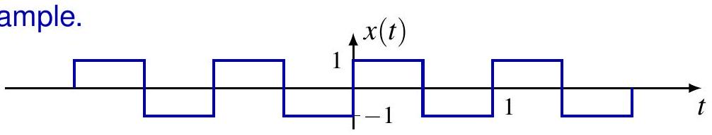

$$
\lim _{N \rightarrow \infty} S_{N}(x)(t)= \begin{cases}1, & t \in\left(n, n+\frac{1}{2}\right), \\ -1, & t \in\left(n-\frac{1}{2}, n\right),, \quad n \in \mathbb{Z} \\ 0, & t=\frac{n}{2},\end{cases}
$$

## 目录

1. 傅里叶级数的均方收敛
2. 傅里叶级数的逐点收敛
3. 周期冲激列的傅里叶级数
4. 滤波

## 周期冲激列

$$
x(t)=\sum_{k=-\infty}^{\infty} \delta(t-k T)
$$


For "good" enough function $\phi$, e.g. infinitely differentiable function with compact support,

$$
\begin{gathered}
(\phi * x)(t)=\sum_{k=-\infty}^{\infty} \phi(t-k T) \\
\int_{\mathbb{R}} \phi(t) x(t) d t=\sum_{k=-\infty}^{\infty} \int_{\mathbb{R}} \phi(t) \delta(t-k T) d t=\sum_{k=-\infty}^{\infty} \phi(k T)
\end{gathered}
$$

## 周期冲激列

$$
x(t)=\sum_{k=-\infty}^{\infty} \delta(t-k T)
$$


Fourier coefficients

$$
\hat{x}[k]=\frac{1}{T} \int_{-T / 2}^{T / 2} \delta(t) e^{-j k \frac{2 \pi}{T} t} d t=\frac{1}{T}
$$

Fourier series

$$
x(t)=\sum_{k=-\infty}^{\infty} \frac{1}{T} e^{j k \frac{2 \pi}{T} t}=\lim _{N \rightarrow \infty} \frac{1}{T} D_{N}\left(\frac{2 \pi}{T} t\right)
$$

where $D_{N}$ is Dirichlet kernel

## 周期冲激列

$$
x(t)=\sum_{k=-\infty}^{\infty} \delta(t-k T)=\sum_{k=-\infty}^{\infty} \frac{1}{T} e^{j k \frac{2 \pi}{T} t}
$$


## 周期冲激列

$$
\begin{aligned}
\int_{\mathbb{R}} \phi(t) x(t) d t & =\lim _{N \rightarrow \infty} \frac{1}{T} \int_{\mathbb{R}} \phi(t) D_{N}\left(-\frac{2 \pi}{T} t\right) d t \quad\left(D_{N} \text { is even }\right) \\
& =\lim _{N \rightarrow \infty} \frac{1}{2 \pi} \int_{\mathbb{R}} \phi\left(-\frac{T}{2 \pi} t\right) D_{N}(t) d t \\
& =\lim _{N \rightarrow \infty} \sum_{k=-\infty}^{\infty} \frac{1}{2 \pi} \int_{(2 k-1) \pi}^{(2 k+1) \pi} \phi\left(-\frac{T}{2 \pi} t\right) D_{N}(t) d t \\
& =\sum_{k=-\infty}^{\infty} \lim _{N \rightarrow \infty} \frac{1}{2 \pi} \int_{-\pi}^{\pi} \phi\left(\frac{T}{2 \pi}(2 \pi k-t)\right) D_{N}(t-2 k \pi) d t \\
& \left.=\sum_{k=-\infty}^{\infty} \lim _{N \rightarrow \infty} \frac{1}{2 \pi} \int_{-\pi}^{\pi} \phi\left(\frac{T}{2 \pi}(2 \pi k-t)\right)_{\left(D_{N}\right.} \text { is } 2 \pi \text {-periodic }\right) \\
& =\sum_{k=-\infty}^{\infty} \lim _{N \rightarrow \infty} S_{N}(\phi)(k T)=\sum_{k=-\infty}^{\infty} \phi(k T)
\end{aligned}
$$

## 与周期方波的关系


$$
\begin{aligned}
r^{\prime}(t) & =x\left(t+T_{1}\right)-x\left(t-T_{1}\right) \\
\widehat{r^{\prime}}[k] & =\left(e^{j k \omega_{0} T_{1}}-e^{-j k \omega_{0} T_{1}}\right) \hat{x}[k]=\frac{2 j \sin \left(k \omega_{0} T_{1}\right)}{T} \\
\hat{r}[k] & =\frac{1}{j k \omega_{0}} \widehat{r^{\prime}}[k]=\frac{\sin \left(k \omega_{0} T_{1}\right)}{k \pi}, \quad k \neq 0
\end{aligned}
$$

## 目录

1. 傅里叶级数的均方收敛
2. 傅里叶级数的逐点收敛
3. 周期冲激列的傅里叶级数
4. 滤波


# 2. DT 傅里叶级数

## DT 周期信号

回顾：DT 信号是周期的，周期为 $N$，如果

$$
x=\tau_{N} x \quad \text { 或 } \quad x[n]=x[n+N], \forall n \in \mathbb{Z}
$$

- 基波周期 $N$：最小的正周期
- 基频 $\begin{cases}\frac{2 \pi}{N}, & \text { 如果 } N>1 \\ 0, & \text { 如果 } N=1\end{cases}$

复指数信号 $\phi_{N}^{k}[n]=e^{j k \frac{2 \pi}{N} n}=e^{j k \omega_{0} n}$ 是周期的，具有：

- 周期 $N$ 和基波周期 $\frac{N}{\operatorname{gcd}(N, k)}$
- 基频 $\omega_{k}= \begin{cases}0, & \text { 如果 } N \mid k \\ \omega_{0} \cdot \operatorname{gcd}(k, N), & \text { 其他 }\end{cases}$，总是 $\omega_{0}=\frac{2 \pi}{N}$ 的整数倍

## DT 傅里叶基的有限性

傅里叶级数用谐波相关的复指数 $\phi_{N}^{k}$ 表示 $N$-周期信号

$$
x=\sum_{k} c_{k} \phi_{N}^{k}, \quad \text { 或 } \quad x[n]=\sum_{k} c_{k} \phi_{N}^{k}[n]=\sum_{k} c_{k} e^{j k \frac{2 \pi}{N} n}
$$

与 CT 情况的关键区别：$\phi_{N}^{k+r N}=\phi_{N}^{k}$，所以只有 $N$ 个不同的 $\phi_{N}^{k}$，傅里叶基是有限的，即

$$
\left\{\phi_{N}^{k}: k \in \mathbb{Z}\right\}=\left\{\phi_{N}^{k}: k \in[N]\right\}
$$

其中 $[N]=\{0,1, \ldots, N-1\}$（可以理解为 $[N]=\{\overline{0}, \overline{1}, \ldots, \overline{N-1}\}$）。

证明：对于 $r \in \mathbb{Z}$，
$$
\phi_{N}^{k+r N}[n]=e^{j(k+r N) \frac{2 \pi}{N} n}=e^{j k \frac{2 \pi}{N} n} e^{j r 2 \pi n}=e^{j k \frac{2 \pi}{N} n}=\phi_{N}^{k}[n]
$$

## DT 傅里叶基的有限性 (图示)

$\phi_{N}^{k}$ 示例， $N=4$ 和 $k=0,1, \ldots, 8$

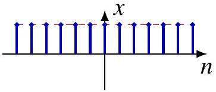
$\phi_{N}^{0}[n]=\cos (0 \cdot n)=1$

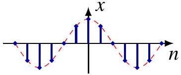
$\phi_{N}^{1}[n]=\cos (\pi n / 4)$

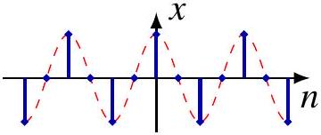
$\phi_{N}^{2}[n]=\cos (\pi n / 2)$

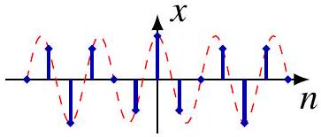
$\phi_{N}^{3}[n]=\cos (3 \pi n / 4)$

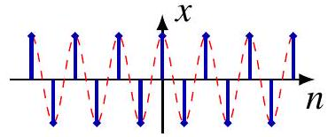
$\phi_{N}^{4}[n]=\cos (\pi n)$ (注意与 $k=0$ 相同，除了符号/相位)

... (循环重复)

## 谐波的正交归一性

DT 傅里叶级数

$$
x=\sum_{k \in[N]} \hat{x}[k] \phi_{N}^{k}, \quad \text { 或 } \quad x[n]=\sum_{k \in[N]} \hat{x}[k] e^{j k \frac{2 \pi}{N} n}
$$

求和可以在任意 $N$ 个连续整数上进行。
定义两个周期为 $N$ 的信号的内积为

$$
\langle x, y\rangle=\frac{1}{N} \sum_{n \in[N]} x[n] \overline{y[n]}
$$

这与 $\mathbb{C}^{N}$ 中的内积相同（差一个因子 $N^{-1}$）。
$\left\{\phi_{N}^{k}: k \in[N]\right\}$ 是正交归一函数系

$$
\left\langle\phi_{N}^{k}, \phi_{N}^{m}\right\rangle=\delta_{k m}=\delta[k-m]
$$

## 谐波正交归一性的证明

$$
\left\langle\phi_{N}^{k}, \phi_{N}^{m}\right\rangle=\frac{1}{N} \sum_{n \in[N]} e^{j k \frac{2 \pi}{N} n} e^{-j m \frac{2 \pi}{N} n}=\frac{1}{N} \sum_{n=0}^{N-1} e^{j(k-m) \frac{2 \pi}{N} n}
$$

如果 $k=m$，

$$
\left\langle\phi_{N}^{k}, \phi_{N}^{m}\right\rangle=\frac{1}{N} \sum_{k=0}^{N-1} 1=1
$$

如果 $k \neq m$，由于 $|k-m| \leq N-1, e^{j(k-m) \frac{2 \pi}{N}} \neq 1$。利用等比数列求和公式：

$$
\left\langle\phi_{N}^{k}, \phi_{N}^{m}\right\rangle=\frac{1}{N} \sum_{n=0}^{N-1} e^{j(k-m) \frac{2 \pi}{N} n}=\frac{1}{N} \frac{1-e^{j(k-m) \frac{2 \pi}{N} N}}{1-e^{j(k-m) \frac{2 \pi}{N}}}=0
$$

## 傅里叶系数

假设 $x$ 周期为 $N$，利用正交性求解系数：

$$
\begin{aligned}
\left\langle x, \phi_{N}^{m}\right\rangle & =\left\langle\sum_{k \in[N]} \hat{x}[k] \phi_{N}^{k}, \phi_{N}^{m}\right\rangle=\sum_{k \in[N]} \hat{x}[k]\left\langle\phi_{N}^{k}, \phi_{N}^{m}\right\rangle \\
& =\sum_{k \in[N]} \hat{x}[k] \delta[m-k]=\hat{x}[m]
\end{aligned}
$$

可以将 $\hat{x}$ 视为 $N$-周期信号，因为：

$$
\hat{x}[m+r N] \triangleq\left\langle x, \phi_{N}^{m+r N}\right\rangle=\left\langle x, \phi_{N}^{m}\right\rangle=\hat{x}[m]
$$

但在傅里叶级数中只使用 $N$ 个连续的值！

## DT 傅里叶级数公式

**综合方程 (Synthesis equation)**

$$
x[n]=\sum_{k \in[N]} \hat{x}[k] \phi_{N}^{k}[n]=\sum_{k \in[N]} \hat{x}[k] e^{j k \frac{2 \pi}{N} n}
$$

**分析方程 (Analysis equation)**

$$
\hat{x}[k]=\left\langle x, \phi_{N}^{k}\right\rangle=\frac{1}{N} \sum_{n \in[N]} x[n] e^{-j k \frac{2 \pi}{N} n}
$$

由于所有求和都是有限的，不存在收敛问题！

## 例子

$x[n]=\cos \left(\frac{6 \pi}{5} n+\frac{\pi}{5}\right)$，周期 $N=5$。
展开为复指数：
$x[n]=\frac{e^{j \frac{\pi}{5}}}{2} e^{j 3 \frac{2 \pi}{5} n}+\frac{e^{-j \frac{\pi}{5}}}{2} e^{-j 3 \frac{2 \pi}{5} n}$

系数：
$\hat{x}[3]=\frac{1}{2} e^{j \frac{\pi}{5}} ; \quad \hat{x}[2]=\hat{x}[-3]=\frac{1}{2} e^{-j \frac{\pi}{5}} ; \quad \hat{x}[0]=\hat{x}[1]=\hat{x}[4]=0$

$\hat{x}[k]$ 以 $N=5$ 为周期重复。

(相位谱)

(幅度谱)

## 例子：周期方波 (Periodic Square Wave)

周期为 $N$ 的方波，在一个周期内：

$$
x[n]= \begin{cases}1, & -N_{1} \leq n \leq N_{1} \\ 0, & N_{1}<n<N-N_{1}\end{cases}
$$


傅里叶系数：

$$
\hat{x}[k]=\frac{1}{N} \sum_{n=-N_{1}}^{N_{1}} e^{-j k \frac{2 \pi}{N} n}
$$

如果 $k$ 是 $N$ 的整数倍, $\hat{x}[k]=\frac{2 N_{1}+1}{N}$

## 例子：周期方波 (续)

如果 $k$ 不是 $N$ 的整数倍，则 $e^{-j k \frac{2 \pi}{N}} \neq 1$。使用等比数列求和：

$$
\begin{aligned}
\hat{x}[k] & =\frac{1}{N} \frac{e^{j k \frac{2 \pi}{N} N_{1}}-e^{-j k \frac{2 \pi}{N}\left(N_{1}+1\right)}}{1-e^{-j k \frac{2 \pi}{N}}} \\
& =\frac{1}{N} \frac{\sin \left(k \frac{2 \pi}{N}\left(N_{1}+\frac{1}{2}\right)\right)}{\sin \left(k \frac{\pi}{N}\right)}
\end{aligned}
$$


## DT 傅里叶级数：矩阵形式

综合方程可以写成矩阵乘法：

$$
x[n]=\sum_{k=0}^{N-1} W_{N}^{k n} \hat{x}[k], \quad \text { 其中 } W_{N}=e^{j k \frac{2 \pi}{N}}
$$

$$
x=\mathbf{F} \hat{x}, \quad \text { 其中 } \mathbf{F}=\left(\phi_{N}^{0}, \phi_{N}^{1}, \ldots, \phi_{N}^{N-1}\right)
$$

分析方程：

$$
\hat{x}=\mathbf{F}^{-1} x=\frac{1}{N} \mathbf{F}^{H} x
$$

其中 $\mathbf{F}^{H}=(\overline{\mathbf{F}})^{T}$ 是 $\mathbf{F}$ 的共轭转置 (Hermitian transpose)。

# 3. DT 傅里叶级数的性质

## DT 傅里叶级数 (DT Fourier Series)

周期为 $N$ 的信号 $x$ 的 DTFS：

$$
x[n]=\sum_{k \in[N]} \hat{x}[k] e^{j k \omega_{0} n}, \quad \omega_{0}=\frac{2 \pi}{N}
$$

对应关系：

$$
x \stackrel{\text { DTFS }}{\longleftrightarrow} \hat{x} \quad \text { 或 } \quad x[n] \stackrel{\text { DTFS }}{\longleftrightarrow} \hat{x}[k]
$$

同一信号的两种等价表示：
- 时域：$x[n]$
- 频域：$\hat{x}[k]$

## 线性、时移与频移

**线性 (Linearity)**
$$
\widehat{a x+b y}=a \hat{x}+b \hat{y}
$$

**时移 (Time shifting)**
$$
x\left[n-n_{0}\right] \stackrel{\text { DTFS }}{\longleftrightarrow} e^{-j k \omega_{0} n_{0}} \hat{x}[k]
$$

**频移 (Frequency shifting)**
$$
e^{j m \omega_{0} n} x[n] \stackrel{\text { DTFS }}{\longleftrightarrow} \hat{x}[k-m]
$$

## 其它性质

**时间反转 (Time reversal)**
$$
x[-n] \stackrel{\text { DTFS }}{\longleftrightarrow} \hat{x}[-k]
$$

**共轭 (Conjugation)**
$$
x^{*}[n] \stackrel{\text { DTFS }}{\longleftrightarrow}(\hat{x}[-k])^{*}
$$

**对称性 (Symmetry)**
- $x$ 实 $\Longleftrightarrow \hat{x}[-k]=\overline{\hat{x}[k]}$ (共轭对称)
- $x$ 实偶 $\Longleftrightarrow \hat{x}$ 实偶

## 时间缩放 (Time Scaling)

定义上采样信号 $x_{(m)}$：

$$
x_{(m)}[n]= \begin{cases}x[n / m], & \text { 如果 } n \text { 是 } m \text { 的倍数 } \\ 0, & \text { 其他 }\end{cases}
$$

如果 $x$ 周期为 $N$，则 $x_{(m)}$ 周期为 $m N$，且：

$$
\widehat{x_{(m)}}=\frac{1}{m} \hat{x} \quad \text { 或 } \quad x_{(m)}[n] \stackrel{\text { DTFS }}{\longleftrightarrow} \frac{1}{m} \hat{x}[k]
$$

## 一阶差分与累加求和

**一阶（后向）差分** (First difference)
$$
x[n]-x[n-1] \stackrel{\text { DTFS }}{\longleftrightarrow}\left(1-e^{-j k \frac{2 \pi}{N}}\right) \hat{x}[k]
$$

**累加求和** (Running sum)
$$
y[n]=\sum_{m=n_{0}}^{n} x[m]
$$
- $y$ 是周期的当且仅当 $\hat{x}[0]=0$（无直流分量）
- 如果 $\hat{x}[0]=0$，
$$
\hat{y}[k]=\frac{1}{1-e^{-j k \frac{2 \pi}{N}}} \hat{x}[k] \quad \text { 对于 } k \neq 0
$$

## 乘法 (Multiplication)

时域乘法 $\Longleftrightarrow$ 频域周期卷积

$$
x[n] y[n] \stackrel{\text { DTFS }}{\longleftrightarrow} \sum_{m \in[N]} \hat{x}[m] \hat{y}[k-m]
$$

## 周期卷积 (Periodic Convolution)

相同周期 $N$ 的 $x$ 和 $y$ 的周期卷积：

$$
(x * y)[n]=\sum_{m \in[N]} x[m] y[n-m]
$$

性质：
- 交换律、结合律、双线性

**时域卷积 $\Longrightarrow$ 频域乘法**

$$
(x * y)[n] \stackrel{\text { DTFS }}{\longleftrightarrow} N \hat{x}[k] \hat{y}[k]
$$

# 滤波

## 连续时间滤波器

## 频率响应

Recall response of CT LTI system to exponential input $e^{s t}$

$$
T\left(\sum_{k} a_{k} e^{s_{k} t}\right)=\sum_{k} a_{k} H\left(s_{k}\right) e^{s_{k} t}
$$

where $H(s)$ is system function

$$
H(s)=\int_{\mathbb{R}} h(t) e^{-s t} d t
$$

When restricted to $s=j \omega, H(j \omega)$ as function of $\omega$ is called frequency response of the system

$$
H(j \omega)=\int_{\mathbb{R}} h(t) e^{-j \omega t} d t
$$

## 滤波

Periodic input $x$ in Fourier series representation

$$
x(t)=\sum_{k=-\infty}^{\infty} \hat{x}[k] e^{j k \omega_{0} t}
$$

Output of LTI system with frequency response $H(j \omega)$

$$
y(t)=T\left(\sum_{k=-\infty}^{\infty} \hat{x}[k] e^{j k \omega_{0} t}\right)=\sum_{k=-\infty}^{\infty} H\left(j k \omega_{0}\right) \hat{x}[k] e^{j k \omega_{0} t}
$$

periodic with same periodic, Fourier coefficients related by

$$
\hat{y}[k]=H\left(j k \omega_{0}\right) \hat{x}[k]
$$

滤波 changes relative amplitudes of frequency components or eliminates some frequency components entirely

## 滤波

Example. Differentiator $T(x)=x^{\prime}$ has frequency response

$$
H(j \omega)=j \omega
$$

For periodic input


$$
x(t)=\sum_{k=-\infty}^{\infty} \hat{x}[k] e^{j k \omega_{0} t}
$$

output

$$
y(t)=\sum_{k=-\infty}^{\infty} j k \omega_{0} \hat{x}[k] e^{j k \omega_{0} t}
$$


Fourier coefficients related by $\hat{y}[k]=j k \omega_{0} \hat{x}[k]$

## 滤波

LTI systems as filters

- cannot create new frequency components
- can only scale magnitudes or shift phases of existing components

Example of nonlinear filter: Clipping $y(t)=\max \{x(t), c\}$
Focus on LTI filters in this course

Frequency-shaping filters change shape of spectrum

- e.g. equalizer


Frequency-selective filters pass some frequencies essentially undistorted and significantly attenuate or eliminate others

## 理想频率选择性滤波器

理想低通滤波器

$$
H(j \omega)= \begin{cases}1, & |\omega| \leq \omega_{c} \\ 0, & \text { otherwise }\end{cases}
$$

$\omega_{c}$ : cutoff frequency
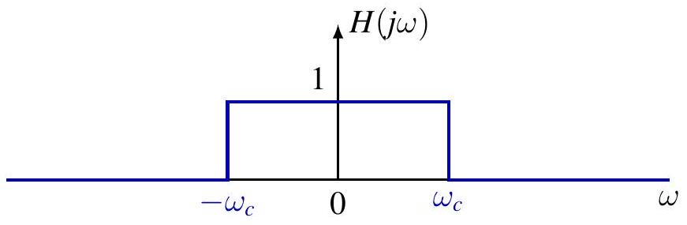


## 理想频率选择性滤波器

理想高通滤波器

$$
H(j \omega)= \begin{cases}1, & |\omega| \geq \omega_{c} \\ 0, & \text { otherwise }\end{cases}
$$

$\omega_{c}$ : cutoff frequency

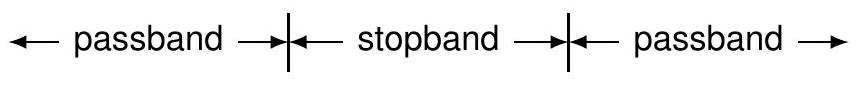

## 理想频率选择性滤波器

理想带通滤波器

$$
H(j \omega)= \begin{cases}1, & \omega_{c 1} \leq|\omega| \leq \omega_{c 2} \\ 0, & \text { otherwise }\end{cases}
$$

$\omega_{c 1}$ : lower cutoff frequency
$\omega_{c 2}$ : upper cutoff frequency


## 理想频率选择性滤波器

**理想低通滤波器 (Ideal lowpass filter)**

$$
H(j \omega)= \begin{cases}1, & |\omega| \leq \omega_{c} \\ 0, & \text { 其他 }\end{cases}
$$

$\omega_{c}$ : 截止频率

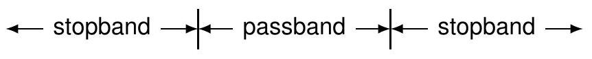

## 理想频率选择性滤波器

**理想高通滤波器 (Ideal highpass filter)**

$$
H(j \omega)= \begin{cases}1, & |\omega| \geq \omega_{c} \\ 0, & \text { 其他 }\end{cases}
$$

$\omega_{c}$ : 截止频率
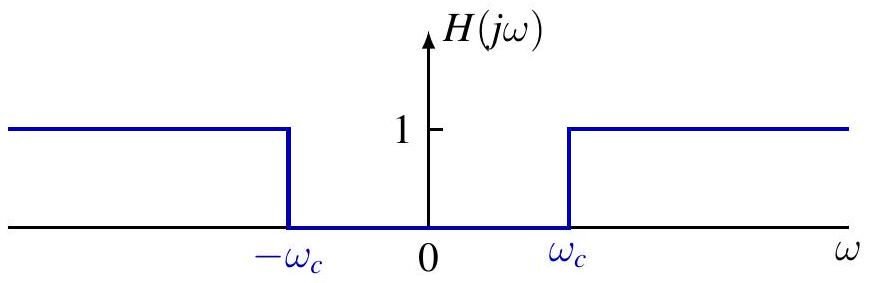


## 理想频率选择性滤波器

**理想带通滤波器 (Ideal bandpass filter)**

$$
H(j \omega)= \begin{cases}1, & \omega_{c 1} \leq|\omega| \leq \omega_{c 2} \\ 0, & \text { 其他 }\end{cases}
$$

$\omega_{c 1}$ : 下截止频率
$\omega_{c 2}$ : 上截止频率


## 简单 RC 低通滤波器

常微分方程 (ODE)

$$
R C \frac{d v_{C}(t)}{d t}+v_{C}(t)=v_{S}(t)
$$

对于输入 $v_{S}(t)=e^{j \omega t}$，输出为

$$
v_{C}(t)=H(j \omega) e^{j \omega t}
$$

频率响应 $H(j \omega)=\frac{1}{1+R C j \omega}$


## 简单 RC 低通滤波器

频率响应

$$
H(j \omega)=\frac{1}{1+R C j \omega}
$$


$$
\begin{aligned}
|H(j \omega)| & =\frac{1}{\sqrt{1+(R C \omega)^{2}}} \\
\arg H(j \omega) & =-\arctan (R C \omega)
\end{aligned}
$$

非理想低通滤波器：通过低频，衰减高频。


$R C$ 越大 $\Longrightarrow$ 通过的低频范围越小。

## 简单 RC 低通滤波器

冲激响应

$$
h(t)=\frac{1}{R C} e^{-t / R C} u(t)
$$

阶跃响应


$$
s(t)=(h * u)(t)=\left(1-e^{-t / R C}\right) u(t)
$$

时间常数 $\tau=R C$

- $\tau$ 越大，响应越迟缓 (sluggish)


## 权衡 (Tradeoff)

- $\tau$ 越大：通过的高频越少，响应越迟缓
- $\tau$ 越小：通过的高频越多，响应越快

## 简单 RC 高通滤波器

ODE
$R C \frac{d v_{R}(t)}{d t}+v_{R}(t)=R C \frac{d v_{S}(t)}{d t}$

对于输入 $v_{S}(t)=e^{j \omega t}$，输出为

$$
v_{R}(t)=H(j \omega) e^{j \omega t}
$$

频率响应 $\quad H(j \omega)=\frac{j \omega R C}{1+j \omega R C}$


## 简单 RC 高通滤波器

频率响应

$$
H(j \omega)=\frac{j \omega R C}{1+j \omega R C}
$$


$$
|H(j \omega)|=\frac{|\omega| R C}{\sqrt{1+(R C \omega)^{2}}}
$$

$$
\arg H(j \omega)=\arctan \frac{1}{R C \omega}
$$

非理想高通滤波器：通过高频，衰减低频。


$R C$ 越大 $\Longrightarrow$ 通过的低频范围越大。

## 简单 RC 高通滤波器

阶跃响应

$$
s(t)=e^{-t / R C} u(t)
$$

冲激响应

$$
h(t)=s^{\prime}(t)=\delta(t)-\frac{1}{R C} e^{-t / R C} u(t)
$$

时间常数 $\tau=R C$

- $\tau$ 越大，响应越迟缓


观察：
- $\tau$ 越大，通过的低频越多，响应越迟缓
- $\tau$ 越小，通过的低频越少，响应越快

## 离散时间滤波器

### 离散时间滤波器

### 快速傅里叶变换


## 离散傅里叶变换（DFT）

DTFS pair for $N$-periodic sequence

分析公式

$$
\hat{x}[k]=\frac{1}{N} \sum_{n \in[N]} x[n] e^{-j k \frac{2 \pi}{N} n}
$$

综合公式

$$
x[n]=\sum_{k \in[N]} \hat{x}[k] e^{j k \frac{2 \pi}{N} n}
$$

DFT pair for finite sequence of length $N$

DFT

$$
X[k]=\sum_{n=0}^{N-1} x[n] e^{-j k \frac{2 \pi}{N} n}
$$

逆 DFT

$$
x[n]=\frac{1}{N} \sum_{k=0}^{N-1} X[k] e^{j k \frac{2 \pi}{N} n}
$$

Both pairs of equations essentially the same up to constant factor $\frac{1}{N}$; efficient computation by 快速傅里叶变换 (FFT)

## DFT 的矩阵形式

With $W_{N}=e^{-j \frac{2 \pi}{N}}$ (note sign change from last lecture)

$$
\left[\begin{array}{l}
X[0] \\
X[1] \\
X[2] \\
X[3] \\
X[4] \\
X[5] \\
X[6] \\
X[7]
\end{array}\right]=\left[\begin{array}{llllllll}
W_{8}^{0} & W_{8}^{0} & W_{8}^{0} & W_{8}^{0} & W_{8}^{0} & W_{8}^{0} & W_{8}^{0} & W_{8}^{0} \\
W_{8}^{0} & W_{8}^{1} & W_{8}^{2} & W_{8}^{3} & W_{8}^{4} & W_{8}^{5} & W_{8}^{6} & W_{8}^{7} \\
W_{8}^{0} & W_{8}^{2} & W_{8}^{4} & W_{8}^{6} & W_{8}^{0} & W_{8}^{3} & W_{8}^{4} & W_{8}^{6} \\
W_{8}^{0} & W_{8}^{3} & W_{8}^{6} & W_{8}^{1} & W_{8}^{4} & W_{8}^{7} & W_{8}^{2} & W_{8}^{5} \\
W_{8}^{0} & W_{8}^{4} & W_{8}^{0} & W_{8}^{4} & W_{8}^{0} & W_{8}^{4} & W_{8}^{0} & W_{8}^{4} \\
W_{8}^{0} & W_{8}^{5} & W_{8}^{2} & W_{8}^{7} & W_{8}^{4} & W_{8}^{1} & W_{8}^{6} & W_{8}^{3} \\
W_{8}^{0} & W_{8}^{6} & W_{8}^{4} & W_{8}^{2} & W_{8}^{0} & W_{8}^{6} & W_{8}^{4} & W_{8}^{2} \\
W_{8}^{0} & W_{8}^{7} & W_{8}^{6} & W_{8}^{5} & W_{8}^{4} & W_{8}^{3} & W_{8}^{2} & W_{8}^{1}
\end{array}\right]\left[\begin{array}{l}
x[0] \\
x[1] \\
x[2] \\
x[3] \\
x[4] \\
x[5] \\
x[6] \\
x[7]
\end{array}\right]
$$

Direct matrix multiplication has complexity $O\left(N^{2}\right)$
FFT is divide-and-conquer algorithm (Cooley \& Tukey 1965)

## 快速傅里叶变换 (FFT)

分治思想
Assume $N=2^{M}$ (radix 2). Divide $x$ into two subsequences

$$
\begin{array}{ll}
x_{e}[n]=x[2 n], & n=0,1, \ldots, 2^{M-1}-1 \\
x_{o}[n]=x[2 n+1], & n=0,1, \ldots, 2^{M-1}-1
\end{array}
$$

$N$-point DFT $X$ of $x$. For $k=0,1, \ldots, 2^{M}-1$,

$$
\begin{aligned}
X[k] & =\sum_{n=0}^{2^{M}-1} x[n] e^{-j k \frac{2 \pi}{2^{M}} n} \\
& =\sum_{n=0}^{2^{M-1}-1} x_{e}[n] e^{-j k \frac{2 \pi}{2^{M}} 2 n}+\sum_{n=0}^{2^{M-1}-1} x_{o}[n] e^{-j k \frac{2 \pi}{2^{M}}(2 n+1)} \\
& =\sum_{n=0}^{2^{M-1}-1} x_{e}[n] e^{-j k \frac{2 \pi}{2^{M-1} n}}+e^{-j k \frac{2 \pi}{2^{M}}} \sum_{n=0}^{2^{M-1}-1} x_{o}[n] e^{-j k \frac{2 \pi}{2^{M-1} n}}
\end{aligned}
$$

## 快速傅里叶变换 (FFT)

分治思想
Divide $X$ into two halves. For $k=0,1, \ldots, 2^{M-1}-1$

$$
\begin{aligned}
X[k]= & \sum_{n=0}^{2^{M-1}-1} x_{e}[n] e^{-j k \frac{2 \pi}{2^{M-1} n}}+e^{-j k \frac{2 \pi}{2^{M}}} \sum_{n=0}^{2^{M-1}-1} x_{o}[n] e^{-j k \frac{2 \pi}{2^{M-1} n} n} \\
X\left[2^{M-1}+k\right]= & \sum_{n=0}^{2^{M-1}-1} x_{e}[n] e^{-j k \frac{2 \pi}{2^{M-1} n}}-e^{-j k \frac{2 \pi}{2^{M}}} \sum_{n=0}^{2^{M-1}-1} x_{o}[n] e^{-j k \frac{2 \pi}{2^{M-1} n} n} \\
& \frac{N}{2} \text {-point DFT of } x_{e} \quad
\end{aligned}
$$

Recursive algorithm

$$
\begin{aligned}
\operatorname{DFT}(x)[k] & =\operatorname{DFT}\left(x_{e}\right)[k]+e^{-j k \frac{2 \pi}{N}} \operatorname{DFT}\left(x_{o}\right)[k] \\
\operatorname{DFT}(x)\left[2^{M-1}+k\right] & =\operatorname{DFT}\left(x_{e}\right)[k]-e^{-j k \frac{2 \pi}{N}} \operatorname{DFT}\left(x_{o}\right)[k]
\end{aligned}
$$

## 快速傅里叶变换 (FFT)

Naive implementation of radix-2 FFT for $N=2^{M}$

```
import numpy as np
# compute DFT of sequences of length N=2^M
def FFT(x):
    N = x.size
    # base case, compute DFT directly
    if N == 2:
        return np.array([x[0] + x[1], x[0] - x[1]])
    # recursively compute N/2 point DFT of even and odd subsquences
    Xe = FFT(x[0::2])
    X0 = FFT(x[1::2])
    # compute phase factor exp(-jk(2*pi/N))
    K = np.arange(N/2)
    phase = np.exp(-1j * K * 2 * np.pi / N)
    Xo_phase = phase * Xo
    # compute N ponint DFT of x
    X = np.append(Xe + Xo_phase, Xe - Xo_phase)
    return X
```


## 快速傅里叶变换 (FFT)

时间复杂度
Denote by $T(N)$ time complexity of $N$-point FFT

$$
T(N)=2 T\left(\frac{N}{2}\right)+O(N)
$$

Let $\tilde{T}(M)=T\left(2^{M}\right)$ and assume $O(N)=c N$ for contant $c$,

$$
\tilde{T}(M)=2 \tilde{T}(M-1)+c 2^{M} \Longrightarrow \tilde{T}(M)=O\left(M 2^{M}\right)
$$

or

$$
T(N)=O(N \log N)
$$

Much lower than $O\left(N^{2}\right)$ for direct matrix multiplication!


## 频率响应

Recall response of DT LTI system to exponential input $z^{n}$

$$
T\left(\sum_{k} a_{k} z_{k}^{n}\right)=\sum_{k} a_{k} H\left(z_{k}\right) z_{k}^{n}
$$

where $H(s)$ is system function

$$
H(z)=\sum_{n=-\infty}^{\infty} h[n] z^{-n}
$$

When restricted to $z=e^{j \omega}, H\left(e^{j \omega}\right)$ as function of $\omega$ is called frequency response of the system

$$
H\left(e^{j \omega}\right)=\sum_{n=-\infty}^{\infty} h[n] e^{-j \omega n}
$$

## 频率响应

Periodic input $x$ in Fourier series representation

$$
x[n]=\sum_{k \in[N]} \hat{x}[k] e^{j k \omega_{0} n}, \quad \text { where } \omega_{0}=\frac{2 \pi}{N} .
$$

Output of LTI system with frequency response $H\left(e^{j \omega}\right)$

$$
y[n]=T\left(\sum_{k \in[N]} \hat{x}[k] e^{j k \omega_{0} n}\right)=\sum_{k \in[N]} H\left(e^{j k \omega_{0}}\right) \hat{x}[k] e^{j k \omega_{0} n}
$$

periodic with same periodic, Fourier coefficients related by

$$
\hat{y}[k]=H\left(e^{j k \omega_{0}}\right) \hat{x}[k]
$$

## 滤波

滤波 changes relative amplitudes of frequency components or eliminates some frequency components entirely

Frequency-shaping vs frequency-selective filters as in CT case
LTI systems as filters

- cannot create new frequency components
- can only scale magnitudes or shift phases of existing components

Examples of nonlinear filter

- max filter: $y[n]=\max _{-n_{1} \leq k \leq n_{2}} x[n+k]$
- median filter: $y[n]=$ median $\left\{x\left[n-n_{1}\right], \ldots, x\left[n+n_{2}\right]\right\}$

Recall for DT signals, suffices to consider frequencies on an interval of length $2 \pi$, e.g. $[0,2 \pi)$ or $(-\pi, \pi]$

## 离散时间信号中的高频与低频

High frequencies around $(2 k+1) \pi$, low frequencies around $2 k \pi$


$\phi_{N}^{0}[n]=\cos (0 \cdot n)=1$
$\phi_{N}^{1}[n]=\cos (\pi n / 4)$
$\phi_{N}^{2}[n]=\cos (\pi n / 2)$


$\phi_{N}^{3}[n]=\cos (3 \pi n / 4)$
$\phi_{N}^{4}[n]=\cos (\pi n)$
$\phi_{N}^{5}[n]=\cos (5 \pi n / 4)$

$\phi_{N}^{6}[n]=\cos (3 \pi n / 2)$

$\phi_{N}^{7}[n]=\cos (7 \pi n / 4)$

$\phi_{N}^{8}[n]=\cos (2 \pi n)=1$

## 离散时间频率

Discrete frequencies of $N$-periodic signals

- evenly spaced points on unit circle
- low frequencies close to 1 ; high frequencies close to -1


## 理想频率选择性滤波器

理想低通滤波器

$$
H\left(e^{j \omega}\right)= \begin{cases}1, & |\omega| \leq \omega_{c} \\ 0, & \omega_{c}<|\omega| \leq \pi\end{cases}
$$

$\omega_{c}$ : cutoff frequency


## 理想频率选择性滤波器

理想高通滤波器

$$
H\left(e^{j \omega}\right)= \begin{cases}1, & \omega_{c} \leq|\omega| \leq \pi \\ 0, & |\omega|<\left|\omega_{c}\right|\end{cases}
$$

$\omega_{c}$ : cutoff frequency


## 理想频率选择性滤波器

理想带通滤波器

$$
H\left(e^{j \omega}\right)= \begin{cases}1, & \omega_{c 1} \leq|\omega| \leq \omega_{c 2} \\ 0, & |\omega|<\omega_{c 1} \text { or } \omega_{c 2}<|\omega| \leq \pi\end{cases}
$$

$\omega_{c 1}$ : lower cutoff frequency
$\omega_{c 2}$ : upper cutoff frequency


## First-order Recursive 离散时间滤波器

$$
y[n]-a y[n-1]=x[n]
$$

For input $x[n]=e^{j \omega n}$, output $y[n]=H\left(e^{j \omega}\right) e^{j \omega n}$
Frequency response (well-defined if $|a|<1$ )

$$
H\left(e^{j \omega}\right)=\frac{1}{1-a e^{-j \omega}}, \quad|a|<1
$$

For $a=|a| e^{j \phi}$,

$$
\begin{aligned}
& \left|H\left(e^{j \omega}\right)\right|=\frac{1}{\sqrt{1+|a|^{2}-2|a| \cos (\omega-\phi)}} \\
& \arg H\left(e^{j \omega}\right)=\arctan \frac{-|a| \sin (\omega-\phi)}{1-|a| \cos (\omega-\phi)}
\end{aligned}
$$

## First-order Recursive 离散时间滤波器

For $a>0$, lowpass filter (exponential smoothing)


For $a<0$, highpass filter


## First-order Recursive 离散时间滤波器

Impulse response (IIR filter)

$$
\begin{gathered}
h[n]=a^{n} u[n] \\
H\left(e^{j \omega}\right)=\sum_{n=0}^{\infty}\left(a e^{-j \omega}\right)^{n}=\frac{1}{1-a e^{-j \omega}}
\end{gathered}
$$

Need $|a|<1$ for convergence
Step response


$$
s[n]=(h * u)[n]=\frac{1-a^{n+1}}{1-a} u[n]
$$

Tradeoff


- larger $|a|$, narrower passband, slower response
- smaller $|a|$, faster response, broader passband


## 滑动平均作为低通滤波器

$$
y[n]=\frac{1}{M_{1}+M_{2}+1} \sum_{k=-M_{1}}^{M_{2}} x[n-k]
$$

Impulse response (FIR filter)

$$
h[n]=\frac{1}{M_{1}+M_{2}+1} \sum_{k=-M_{1}}^{M_{2}} \delta[n-k]
$$

Frequency response

$$
H\left(e^{j \omega}\right)=\frac{1}{M_{1}+M_{2}+1} \sum_{k=-M_{1}}^{M_{2}} e^{-j k \omega}=\frac{e^{j \frac{M_{1}-M_{2}}{2} \omega}}{M_{1}+M_{2}+1} \frac{\sin \left(\frac{M_{1}+M_{2}+1}{2} \omega\right)}{\sin \frac{\omega}{2}}
$$

## 滑动平均作为低通滤波器

$M_{1}=0, M_{2}=1$,

$$
\begin{aligned}
y[n] & =\frac{1}{2}(x[n]+x[n-1]) \\
h[n] & =\frac{1}{2}(\delta[n]+\delta[n-1]) \\
H\left(e^{j \omega}\right) & =e^{-j \frac{\omega}{2}} \cos \frac{\omega}{2}
\end{aligned}
$$


Verify $y=x$ if $x=K e^{j 0 \cdot n}$ and $y=0$ if $x=K e^{j \pi n}=K(-1)^{n}$.

## 滑动平均作为低通滤波器

$M_{1}=M_{2}=1$,

$$
\begin{aligned}
y[n] & =\frac{1}{3}(x[n+1]+x[n]+x[n-1]) \\
h[n] & =\frac{1}{3}(\delta[n+1]+\delta[n]+\delta[n-1]) \\
H\left(e^{j \omega}\right) & =\frac{\sin \left(\frac{3}{2} \omega\right)}{3 \sin \frac{\omega}{2}}=\frac{1}{3}+\frac{2}{3} \cos \omega
\end{aligned}
$$


## 滑动平均作为低通滤波器

$$
H\left(e^{j \omega}\right)=\frac{e^{j \frac{M_{1}-M_{2}}{2} \omega}}{M_{1}+M_{2}+1} \frac{\sin \left(\frac{M_{1}+M_{2}+1}{2} \omega\right)}{\sin \frac{\omega}{2}}
$$

$$
M_{1}+M_{2}+1=11
$$


$$
M_{1}+M_{2}+1=41
$$


Larger $M_{1}+M_{2}$, narrower passband, smoother output

## 滑动平均作为低通滤波器

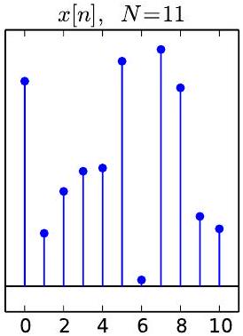
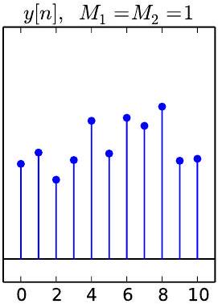
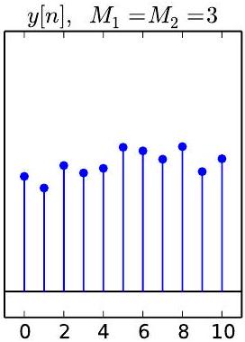
$y[n], M_{1}=M_{2}=5$
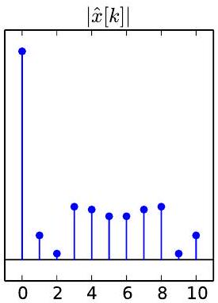
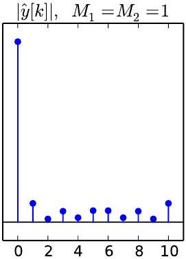
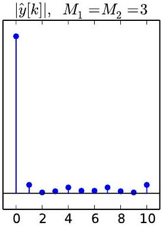
$|\hat{y}[k]|, \quad M_{1}=M_{2}=5$
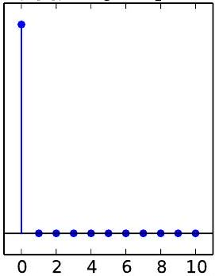

## 滑动平均作为低通滤波器

noncausal

$$
y_{1}[n]=\frac{1}{2 M+1} \sum_{k=-M}^{M} x[n-k]
$$

causal

$$
y_{2}[n]=\frac{1}{2 M+1} \sum_{k=0}^{2 M} x[n-k]
$$

Note $y_{2}=\tau_{M} y_{1}$
For real-time system

- noncausal version not realizable
- causal version realizable
- larger $M$, narrower passband, smoother output, but longer delay, more sluggish response


## 一阶差分作为高通滤波器

Scaled first difference

$$
y[n]=\frac{1}{2}(x[n]-x[n-1])
$$

Impulse response (FIR filter)

$$
h[n]=\frac{1}{2}(\delta[n]-\delta[n-1])
$$


Frequency response

$$
\begin{aligned}
H\left(e^{j \omega}\right) & =\frac{1}{2}\left(1-e^{-j \omega}\right)=j e^{-j \frac{\omega}{2}} \sin \frac{\omega}{2} \\
\left|H\left(e^{j \omega}\right)\right| & =\left|\sin \frac{\omega}{2}\right|
\end{aligned}
$$


Verify $y=0$ if $x=K e^{j 0 \cdot n}$ and $y=x$ if $x=K e^{j \pi n}=K(-1)^{n}$.

First Difference for Edge Detection


## 目录

## 1. 快速傅里叶变换

## 2. 离散时间滤波器

## 3. 连续时间傅里叶变换

## 动机示例：周期方波

In one period,

$$
x_{T}(t)= \begin{cases}1, & |t|<T_{1} \\ 0, & T_{1}<|t|<T / 2\end{cases}
$$


Frequency component at $\omega_{k}=k \omega_{0}$ satisfies

$$
T \hat{x}_{T}[k]=\frac{2 \sin \left(k \omega_{0} T_{1}\right)}{k \omega_{0}}=\left.\frac{2 \sin \left(\omega T_{1}\right)}{\omega}\right|_{\omega=k \omega_{0}}
$$

$T \hat{x}_{T}[k]$ is value of envelope $X(j \omega) \triangleq \frac{2 \sin \left(\omega T_{1}\right)}{\omega}$ sampled at $\omega_{k}=k \omega_{0}$

## 动机示例：周期方波

$X\left(j \omega_{k}\right)$ for fixed $T_{1}$ and different $T$
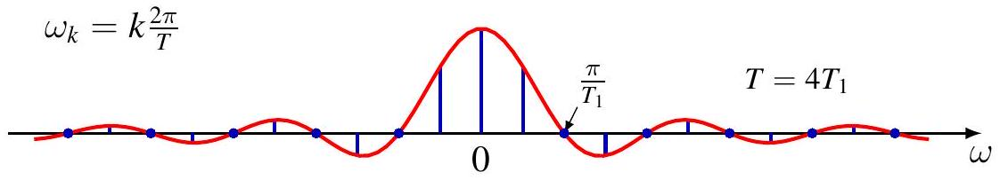
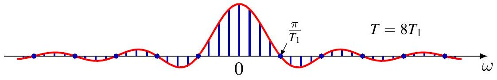


As $T \rightarrow \infty$, discrete frequencies sampled more densely

## 动机示例：周期方波

As $T \rightarrow \infty, x_{T}(t) \rightarrow x(t) \triangleq u\left(t+\frac{T_{2}}{2}\right)-u\left(t-\frac{T_{1}}{2}\right)$, rectangular pulse

$$
\begin{array}{rlr}
x_{T}(t) & =\sum_{k=-\infty}^{\infty} \hat{x}_{T}[k] e^{j \omega_{k} t}=\sum_{k=-\infty}^{\infty} \frac{1}{T} X\left(j \omega_{k}\right) e^{j \omega_{k} t} & \left(T \hat{x}[k]=X\left(j \omega_{k}\right)\right) \\
& =\sum_{k=-\infty}^{\infty} \frac{\omega_{0}}{2 \pi} X\left(j \omega_{k}\right) e^{j \omega_{k} t} & \left(\omega_{0}=\frac{2 \pi}{T}\right) \\
& =\frac{1}{2 \pi} \sum_{k=-\infty}^{\infty} X\left(j \omega_{k}\right) e^{j \omega_{k} t} \Delta \omega & \left(\Delta \omega=\omega_{0}\right) \\
& \rightarrow \frac{1}{2 \pi} \int_{-\infty}^{\infty} X(j \omega) e^{j \omega t} d \omega & \left(\Delta \omega=\omega_{0} \rightarrow 0\right)
\end{array}
$$

Thus

$$
x(t)=\frac{1}{2 \pi} \int_{-\infty}^{\infty} X(j \omega) e^{j \omega t} d \omega
$$

## 动机示例：周期方波

For envelope $X(j \omega)$,

$$
\begin{aligned}
X\left(j \omega_{k}\right) & =T \hat{x}_{T}[k] \\
& =\int_{-\frac{T}{2}}^{\frac{T}{2}} x_{T}(t) e^{-j \omega_{k} t} d t \\
& =\int_{-\frac{T}{2}}^{\frac{T}{2}} x(t) e^{-j \omega_{k} t} d t \quad\left(x_{T}(t)=x(t) \text { for }|t| \leq T / 2\right) \\
& =\int_{-\infty}^{\infty} x(t) e^{-j \omega_{k} t} d t \quad(x(t)=0 \text { for }|t|>T / 2)
\end{aligned}
$$

SO

$$
X(j \omega)=\int_{-\infty}^{\infty} x(t) e^{-j \omega t} d t
$$

## 动机示例：周期方波

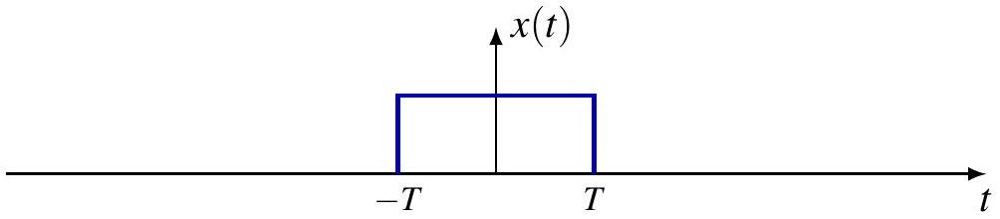
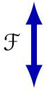


## 连续时间傅里叶变换 of Aperiodic Signals

For aperiodic signal $x$ with $\operatorname{supp} x \subset\left[-T_{1}, T_{1}\right]$, define periodic extension with period $T>2 T_{1}$,

$$
x_{T}(t)=\sum_{k=-\infty}^{\infty} x(t-k T)
$$

Then

$$
x(t)=x_{T}(t), \quad|t|<\frac{T}{2}
$$

As $T \rightarrow \infty$,

$$
x_{T}(t) \rightarrow x(t), \quad \forall t \in \mathbb{R}
$$

$x_{T}$ has Fourier series representation

$$
x_{T}(t)=\sum_{k=-\infty}^{\infty} \hat{x}_{T}[k] e^{j k \omega_{0} t}, \quad \omega_{0}=\frac{2 \pi}{T}
$$

## 连续时间傅里叶变换 of Aperiodic Signals

Define

$$
X(j \omega)=\int_{-\infty}^{\infty} x(t) e^{-j \omega t} d t
$$

$X(j \omega)$ is envelope of $T \hat{x}_{T}[k]$,

$$
\begin{aligned}
\hat{x}_{T}[k] & =\frac{1}{T} \int_{-\frac{T}{2}}^{\frac{T}{2}} x_{T}(t) e^{-j k \omega_{0} t} d t=\frac{1}{T} \int_{-\frac{T}{2}}^{\frac{T}{2}} x(t) e^{-j k \omega_{0} t} d t \\
& =\frac{1}{T} \int_{-\infty}^{\infty} x(t) e^{-j k \omega_{0} t} d t=\frac{1}{T} X\left(j k \omega_{0}\right)=\frac{\omega_{0}}{2 \pi} X\left(j k \omega_{0}\right)
\end{aligned}
$$

so

$$
\begin{aligned}
x(t) & =\lim _{T \rightarrow \infty} x_{T}(t)=\lim _{T \rightarrow \infty} \sum_{k=-\infty}^{\infty} \frac{\omega_{0}}{2 \pi} X\left(j k \omega_{0}\right) e^{j k \omega_{0} t} \\
& =\frac{1}{2 \pi} \int_{-\infty}^{\infty} X(j \omega) e^{j \omega t} d \omega
\end{aligned}
$$

## 连续时间傅里叶变换 Pair

Fourier transform (analysis equation)

$$
X(j \omega)=\mathcal{F}(x)(j \omega)=\int_{-\infty}^{\infty} x(t) e^{-j \omega t} d t
$$

$X(j \omega)$ called spectrum of $x(t)$

Inverse Fourier transform (synthesis equation)

$$
x(t)=\mathcal{F}^{-1}(X)(t)=\frac{1}{2 \pi} \int_{-\infty}^{\infty} X(j \omega) e^{j \omega t} d \omega
$$

Superposition of complex exponentials at continuum of frequencies; frequency $\omega$ has "amplitude" $X(j \omega) \frac{d \omega}{2 \pi}$

## 作业

 

---

<section style="
  min-height: 100vh;
  display: flex;
  flex-direction: column;
  justify-content: center;
  align-items: center;
  text-align: center;
">
  <div style="transform: translateY(10vh);">
<h1>第三章  <br >周期信号的傅里叶级数表示  <br> 完</h1>
  </div>
</section>