# 0. 傅里叶分析的历史回顾

##  引子

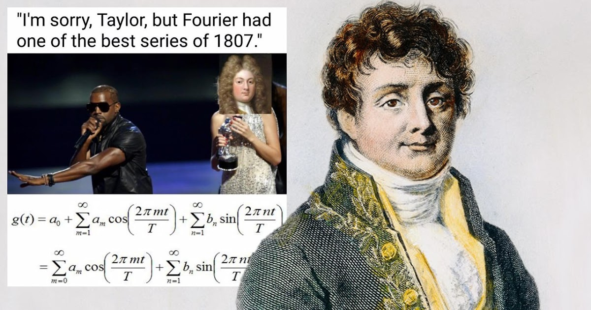

## 波动方程的诞生 (1747)

**达朗贝尔 (Jean le Rond d'Alembert)** 

开启了将物理现象“数学化”的先河。他通过研究琴弦的受力，导出了历史上第一个偏微分方程。

### 一维波动方程
$$ \frac{\partial^2 u}{\partial t^2} = v^2 \frac{\partial^2 u}{\partial x^2} $$

* **$u(x, t)$**：弦在 $t$ 时刻、位置 $x$ 处的位移。
* **$v$**：波在弦上的传播速度。

### 达朗贝尔解
他指出，波动方程的通解可以表示为两个行进波的叠加：
$$ u(x, t) = f(x - vt) + g(x + vt) $$

---

## 叠加原理的物理直觉 (1753)

**丹尼尔·伯努利 (Daniel Bernoulli)** 

是一位极具物理洞察力的科学家。他通过观察乐器的泛音现象，提出了划时代的观点：**复杂的振动是由简单频率的简谐振动叠加而成的。**

### 伯努利解（三角级数雏形）
对于两端固定的琴弦（长度为 $L$），他给出了级数形式的解：
$$ u(x, t) = \sum_{n=1}^{\infty} A_n \sin\left(\frac{n\pi x}{L}\right) \cos\left(\frac{n\pi vt}{L}\right) $$

* **物理意义**：每一个 $n$ 对应一个“模态”。$n=1$ 是基音，$n > 1$ 是泛音。
* **争议点**：当时的数学界无法接受“无穷多个连续函数相加可以组合成任意形状”这一观点。

---

## 正交性与系数推导 (1777)

**欧拉 (Leonhard Euler)** 展现了他惊人的数学推导能力。虽然他对伯努利结论的普适性持怀疑态度，但他却亲手推导出了计算这些系数的关键数学工具。

### 三角函数的正交性
欧拉发现，在特定区间内，不同频率的正弦函数乘积的积分为零：
$$ \int_0^L \sin\left(\frac{m\pi x}{L}\right) \sin\left(\frac{n\pi x}{L}\right) dx = \begin{cases} L/2, & m = n \\ 0, & m \neq n \end{cases} $$

### 系数确定公式
基于正交性，欧拉给出了如何从初始波形 $f(x)$ 中提取系数 $A_n$ 的公式（这正是后来傅里叶系数的标准形式）：
$$ A_n = \frac{2}{L} \int_0^L f(x) \sin\left(\frac{n\pi x}{L}\right) dx $$

---

## 傅里叶级数

**傅里叶（Joseph Fourier）**在格勒诺布尔的火炉旁研究**热传导**时，受到了实际物理过程的强烈启发，这直接促成了**傅里叶级数**和**热传导方程**的诞生。

场景：一根细长金属棒，两端保持固定低温（例如0°C），初始时棒子中间被局部加热，形成非均匀温度分布-光滑的近似的驼峰形状

:::: {.columns style="text-align: center;"}

::: {.column width="50%"}

 
:::

::: {.column width="50%"}
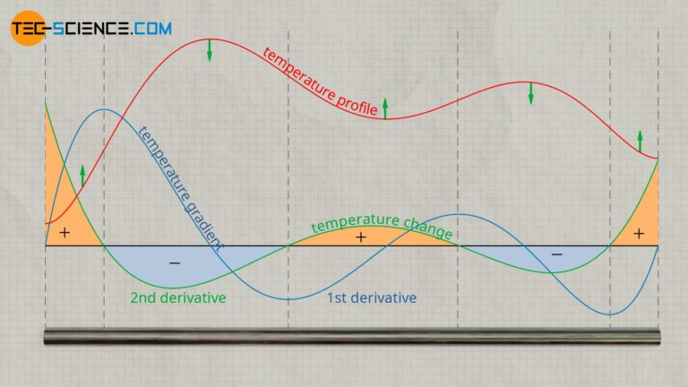{width=100%}

:::

::::

热量流动方向总是从高温到低温（由曲率决定）：

凹向下（曲率正）→ 热量净流入，温度上升；凹向上（曲率负）→ 热量净流出，温度下降。

$$\frac{\partial T}{\partial t} = \alpha \frac{\partial^2 T}{\partial x^2}$$

---

## 傅里叶级数

为了求解这个偏微分方程，傅里叶引入了分离变量法，得到用正弦函数（或余弦）展开初始温度分布的想法——这就是傅里叶级数的诞生。

:::: {.columns style="text-align: center;"}

::: {.column width="50%"}

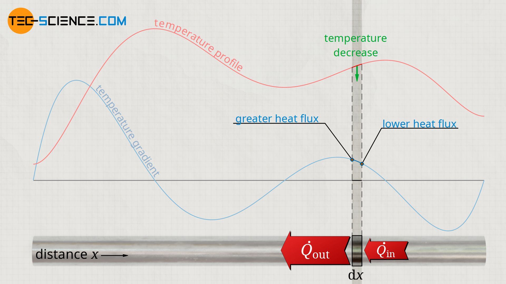{width=60%}
:::

::: {.column width="50%"}

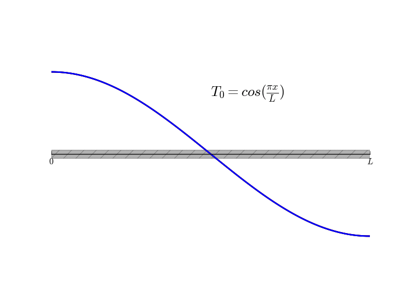{width=60%}
:::
::::
1807 年 12 月 21 日，傅里叶向法兰西学会提交了论文 《固体中的热传导》 (Sur la propagation de la chaleur dans les corps solides)。

$$ f(x) = \frac{a_0}{2} + \sum_{n=1}^{\infty} [a_n \cos(nx) + b_n \sin(nx)] $$

傅里叶的数学洞察本质是：**物理上热量会“抹平”尖锐的温度差异，而数学上可以用无穷多个光滑的正弦波无限逼近任何（合理）的初始分布**。高频（短波长）分量衰减最快 → 温度曲线逐渐变光滑。

这两种看似无关的现象在 1822 年的《热的解析理论》中被统一起来，成为分析数学与物理的桥梁。

## 拉格朗日的执念与傅里叶的胜利

审查委员会里: 拉普拉斯、拉格朗日、蒙日。

拉格朗日站起来强烈抗议：他在年轻时研究弦振动就否定过这种级数，他绝不相信无穷个三角级数能表示不连续函数。

::: {.callout-note}
结果：论文被搁置了 15 年，直到拉格朗日去世后，傅里叶才正式出版了他的著作。
:::

数学史评价：傅里叶不是在象牙塔里推导公式，他是在格勒诺布尔的火炉旁，看着热量如何抹平温度的褶皱，感悟到了宇宙的语言——频率。

::: {.hud}
“对自然界的深刻研究是数学发现最丰饶的源泉。” —— 约瑟夫·傅里叶
:::

### 完善：从直觉跨入严密分析

* 狄利克雷 (1829)：给出了著名的“狄利克雷条件”。这是数学史上第一次明确了三角级数表示法的适用边界。
* 从级数到变换：通过将周期趋于无穷大，实现了从周期信号（加权和）到非周期信号（积分）的飞跃。
* 认知结论：傅里叶分析不仅是计算工具，更是一种将“时域”映射到“频域”的哲学观。

## 离散化：高斯的秘密遗稿

虽然教材通常从1965年讲起，但史料显示：

::: {.columns}
::: {.column width="50%"}
### 1805年 高斯 (Gauss)
为计算小行星轨道，已发明类似FFT的技巧。但他认为这只是“小把戏”，未曾发表 。
:::

::: {.column width="50%"}
### 18-19世纪 天体观测
天文学数据天生是离散的，这为数值分析和傅里叶方法的结合提供了第二舞台。
:::
:::

### 1965：FFT 与数字文明的开启 

* Cooley-Tukey 算法：冷战期间为监测核试验而“再发现”FFT。
* 计算量级跳变：将 $O(N^2)$ 降至 $O(N \log N)$。
* 应用爆发：雷达、通信（4G/5G）、图像处理（JPEG）、语音识别。

::: {.hud}
如果没有FFT，现代智能手机的信号处理将需要几百倍的功耗。
:::

## 目录 {#toc0}

- [**1. 线性时不变系统对复指数信号的响应**](#sec31)
- [2. 连续时间周期信号的傅里叶级数表示](#sec32)
- [3. 连续时间傅里叶级数的收敛](#sec33)
- [4. 连续时间傅里叶级数的性质](#sec34)
- [5. 离散时间周期信号的傅里叶级数表示](#35)
- [6. 离散时间傅里叶级数的性质](#sec36)
- [7. 傅里叶级数与线性时不变系统](#sec37)
- [8. 滤波](#sec38)
  - [频率成形滤波器](#sec381)
  - [频率选择性滤波器](#sec382)
  - [用微分方程描述的连续时间滤波器](#sec383)
  - [用差分方程描述的离散时间滤波器](#sec383)

# 1. 线性时不变系统对复指数信号的响应 {#sec31}

## 回顾与联系

|  | $\mathbb{R}^{n}$ | DT 信号 $\mathbb{C}^{\mathbb{Z}}$ | CT 信号 |
| :--- | :--- | :--- | :--- |
| **基 (basis)** | $\left\{\mathbf{e}_{1}, \ldots, \mathbf{e}_{n}\right\}$ | $\left\{\delta_{k}: k \in \mathbb{Z}\right\}$ | $\left\{\delta_{\tau}: \tau \in \mathbb{R}\right\}^{1}$ |
| **一般信号 $x$** | $x=\sum_{k=1}^{n} x_{k} \mathbf{e}_{k}$ | $x=\sum_{k \in \mathbb{Z}} x[k] \delta_{k}$ | $x=\int_{\mathbb{R}} x(\tau) \delta_{\tau} d \tau$ |
| **线性变换下的像** |  |  |  |
| **基的像** | $\left\{\mathbf{f}_{1}, \ldots, \mathbf{f}_{n}\right\}$ | $\left\{h_{k}: k \in \mathbb{Z}\right\}$ | $\left\{h_{\tau}: \tau \in \mathbb{R}\right\}$ |
| **一般信号 $x$ 的像** | $A x=\sum_{k=1}^{n} x_{k} \mathbf{f}_{k}$ | $T(x)=\sum_{k \in \mathbb{Z}} x[k] h_{k}$ | $T(x)=\int_{\mathbb{R}} x(\tau) h_{\tau} d \tau$ |
| **LTI 系统** | - | $T(x)=x * h$ | $T(x)=x * h$ |

注：并非“基”的标准用法；需结合下一行的积分表示来理解。

## 特征值与特征向量

在线性代数中，$v \in \mathbb{R}^{n}$ 是矩阵 $A$ 的特征向量 (eigenvector)，其对应的特征值 (eigenvalue) 为 $\lambda$，如果：

$$
A v=\lambda v
$$

假设 $A$ 有 $n$ 个不同的特征值 $\lambda_{1}, \ldots, \lambda_{n}$，分别对应特征向量 $v_{1}, \ldots, v_{n}$。

- $v_{1}, \ldots, v_{n}$ 构成 $\mathbb{R}^{n}$ 的一组基，即 $\forall x \in \mathbb{R}^{n}$ 都有以下表示：

$$
x=\sum_{k=1}^{n} a_{k} v_{k}
$$

- $x$ 在 $A$ 作用下的像：

$$
A x=\sum_{k=1}^{n} a_{k} A v_{k}=\sum_{k=1}^{n} a_{k} \lambda_{k} v_{k}
$$

## 基变换 (Change of Basis)

|  | 标准基 | $A$ 的"特征基" |
| :---: | :---: | :---: |
| **基向量** | $\left\{\mathbf{e}_{1}, \ldots, \mathbf{e}_{n}\right\}$ | $\left\{v_{1}, \ldots, v_{n}\right\}$ |
| **分解** | $x=\sum_{k=1}^{n} x_{k} \mathbf{e}_{k}$ | $x=\sum_{k=1}^{n} a_{k} v_{k}$ |
| **$A$ 作用下的像** | $A x=\sum_{k=1}^{n} x_{k} \mathbf{f}_{k}$ | $A x=\sum_{k=1}^{n} a_{k} \lambda_{k} v_{k}$ |

$x$ 和 $A x$ 的展开：

- 在标准基下：系数 $\left\{x_{k}\right\}$ 相同，基向量不同 $\left\{\mathbf{e}_{k}\right\} \mapsto\left\{\mathbf{f}_{k}\right\}$（卷积/叠加积分）
- 在特征基下：基向量 $\left\{v_{k}\right\}$ 相同，系数不同 $\left\{a_{k}\right\} \mapsto\left\{\lambda_{k} a_{k}\right\}$（乘法）

<!-- ## 基变换 (信号与系统)

| DT |  | 标准基 | "特征"基 |
| :--- | :--- | :--- | :--- |
|  | 基向量 | $\left\{\delta_{k}: k \in \mathbb{Z}\right\}$ | $z^n$ |
|  | 分解 | $x=\sum_{k \in \mathbb{Z}} x[k] \delta_{k}$ | 傅里叶/Z 变换 |
|  | $T$ 作用下的像 | $T(x)=\sum_{k \in \mathbb{Z}} x[k] h_{k}$ | $H(z) z^n$ |
| CT |  | "标准基" | 特征基 |
|  | 基向量 | $\left\{\delta_{\tau}: \tau \in \mathbb{R}\right\}$ | $e^{st}$ |
|  | 分解 | $x=\int_{\mathbb{R}} x(\tau) \delta_{\tau} d \tau$ | 傅里叶/拉普拉斯变换 |
|  | $T$ 作用下的像 | $T(x)=\int_{\mathbb{R}} x(\tau) h_{\tau} d \tau$ | $H(s) e^{st}$ | -->

## 基变换 (信号与系统)

| DT |  | 标准基 | "特征基" |
| :--- | :--- | :--- | :--- |
|  | 基向量 | $\left\{\delta_{k}: k \in \mathbb{Z}\right\}$ | ？  |
|  | 分解 | $x=\sum_{k \in \mathbb{Z}} x[k] \delta_{k}$ | ？  |
|  | $T$ 作用下的像 | $T(x)=\sum_{k \in \mathbb{Z}} x[k] h_{k}$ | ？ |
| CT |  | "标准基" | "特征基" |
|  | 基向量 | $\left\{\delta_{\tau}: \tau \in \mathbb{R}\right\}$ | ？ |
|  | 分解 | $x=\int_{\mathbb{R}} x(\tau) \delta_{\tau} d \tau$ | ？  |
|  | $T$ 作用下的像 | $T(x)=\int_{\mathbb{R}} x(\tau) h_{\tau} d \tau$ |  ？|

## LTI 系统的特征值与特征函数

**CT 指数信号 $e^{s t}$**

$$
T\left(e^{s t}\right)=\int_{\mathbb{R}} h(\tau) e^{s(t-\tau)} d \tau=e^{s t} \int_{\mathbb{R}} h(\tau) e^{-s \tau} d \tau,
$$

 $e^{s t}$ 是 $T$ 的**特征函数**，对应的**特征值** 为：

$$
H(s)=\int_{\mathbb{R}} h(\tau) e^{-s \tau} d \tau \quad \text { (系统函数) } 
$$

**DT 指数信号 $z^{n}$**

$$
T\left(z^{n}\right)=\sum_{k \in \mathbb{Z}} h[k] z^{n-k}=z^{n} \sum_{k \in \mathbb{Z}} h[k] z^{-k},
$$

 $z^{n}$ 是 $T$ 的**特征函数**，对应的**特征值** 为：

$$
H(z)=\sum_{k \in \mathbb{Z}} h[k] z^{-k} \quad \text { (系统函数) }
$$

## 对特征函数线性组合的响应

**CT (连续时间)**

$$
T\left(\sum_{k} a_{k} e^{s_{k} t}\right)=\sum_{k} a_{k} H\left(s_{k}\right) e^{s_{k} t}
$$

**DT (离散时间)**

$$
T\left(\sum_{k} a_{k} z_{k}^{n}\right)=\sum_{k} a_{k} H\left(z_{k}\right) z_{k}^{n}
$$

输入 vs. 输出

- 相同的指数函数的线性组合
- 系数发生变化：$\left\{a_{k}\right\} \mapsto\left\{H\left(s_{k}\right) a_{k}\right\} /\left\{H\left(z_{k}\right) a_{k}\right\}$

## 基变换 (信号与系统)

|  | 标准基 | $A$ 的"特征基" |
| :---: | :---: | :---: |
| **基向量** | $\left\{\mathbf{e}_{1}, \ldots, \mathbf{e}_{n}\right\}$ | $\left\{v_{1}, \ldots, v_{n}\right\}$ |
| **分解** | $x=\sum_{k=1}^{n} x_{k} \mathbf{e}_{k}$ | $x=\sum_{k=1}^{n} a_{k} v_{k}$ |
| **$A$ 作用下的像** | $A x=\sum_{k=1}^{n} x_{k} \mathbf{f}_{k}$ | $A x=\sum_{k=1}^{n} a_{k} \lambda_{k} v_{k}$ |

对照：
 

| DT |  | 标准基 | "特征基" |
| :--- | :--- | :--- | :--- |
|  | 基向量 | $\left\{\delta_{k}: k \in \mathbb{Z}\right\}$ | $z^n$ |
|  | 分解 | $x=\sum_{k \in \mathbb{Z}} x[k] \delta_{k}$ | 傅里叶/Z 变换 |
|  | $T$ 作用下的像 | $T(x)=\sum_{k \in \mathbb{Z}} x[k] h_{k}$ | $H(z) z^n$ |
| CT |  | **"标准基"** | **"特征基"** |
|  | 基向量 | $\left\{\delta_{\tau}: \tau \in \mathbb{R}\right\}$ | $e^{st}$ |
|  | 分解 | $x=\int_{\mathbb{R}} x(\tau) \delta_{\tau} d \tau$ | 傅里叶/拉普拉斯变换 |
|  | $T$ 作用下的像 | $T(x)=\int_{\mathbb{R}} x(\tau) h_{\tau} d \tau$ | $H(s) e^{st}$ |

## 问题

- 哪些函数可以是指数函数的线性组合？
- 如何找到系数 $a_{k}$？

傅里叶分析重点关注 CT 中的 $e^{j \omega t}$ 和 DT 中的 $e^{j \omega n}$。

## 目录 {#toc1 }

- [1. 线性时不变系统对复指数信号的响应](#sec31)
- [**2. 连续时间周期信号的傅里叶级数表示**](#sec32)
- [3. 连续时间傅里叶级数的收敛](#sec33)
- [4. 连续时间傅里叶级数的性质](#sec34)
- [5. 离散时间周期信号的傅里叶级数表示](#35)
- [6. 离散时间傅里叶级数的性质](#sec36)
- [7. 傅里叶级数与线性时不变系统](#sec37)
- [8. 滤波](#sec38)
  - [频率成形滤波器](#sec381)
  - [频率选择性滤波器](#sec382)
  - [用微分方程描述的连续时间滤波器](#sec383)
  - [用差分方程描述的离散时间滤波器](#sec383)

# 2. 连续时间周期信号的傅里叶级数表示{#sec32}

## CT 傅里叶级数

回顾：CT 信号是周期的，周期为 $T$，如果：

$$
x=\tau_{T} x \quad \text { 或 } \quad x(t)=x(t+T), \forall t \in \mathbb{R}
$$

- 基波周期 $T$：最小的正周期
- 基波频率 $\omega_{0}=\frac{2 \pi}{T}$

$\sin \left(\omega_{0} t\right), \cos \left(\omega_{0} t\right), e^{j \omega_{0} t}$ 都是基频为 $\omega_{0}$ 的周期信号。
傅里叶级数用**谐波相关 (harmonically related)** 的正弦波或复指数信号表示周期信号：

$$
\begin{aligned}
& x(t)=a_{0}+\sum_{k=1}^{\infty}\left[a_{k} \cos \left(k \omega_{0} t\right)+b_{k} \sin \left(k \omega_{0} t\right)\right] \\
& x(t)=\sum_{k=-\infty}^{\infty} c_{k} e^{j k \omega_{0} t}
\end{aligned}
$$

<!-- ## 约瑟夫·傅里叶 (Joseph Fourier)

1807, Mémoire sur la propagation de la chaleur dans les corps solides (关于热在固体中传播的论文)

1822, Théorie analytique de la chaleur (热的解析理论)

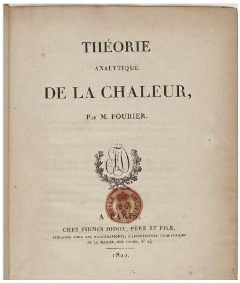
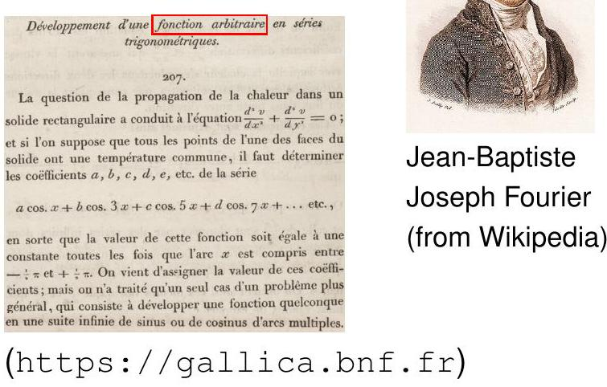 -->

## 谐波 (Harmonics)

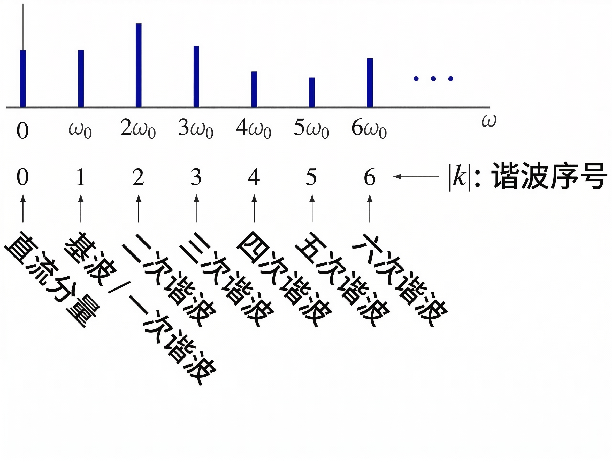{fig-align=center}

## 谐波 (Harmonics)

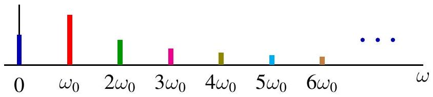{width=55%}

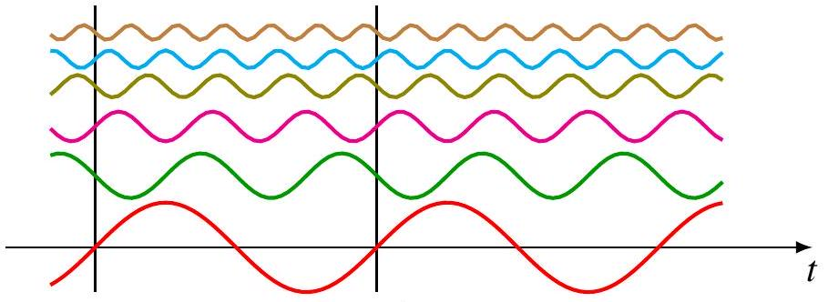{width=55%}

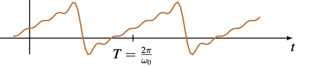{width=58%}

## 谐波的正交归一性 (Orthonormality)

回顾对于 $k \neq 0$，

$$
\int_{a}^{b} e^{j k \omega_{0} t} d t=\frac{e^{j k \omega_{0} b}-e^{j k \omega_{0} a}}{j k \omega_{0}}
$$

由于 $e^{j k \omega_{0} t}$ 具有周期 $T$，在任意一个周期内：

$$
\frac{1}{T} \int_{T} e^{j k \omega_{0} t} d t=\frac{1}{T} \int_{t_{0}}^{t_{0}+T} e^{j k \omega_{0} t} d t=\delta[k]
$$

定义两个周期为 $T$ 的信号的**内积 (inner product)** 为：

$$
\langle f, g\rangle=\frac{1}{T} \int_{T} f(t) \overline{g(t)} d t
$$

$\left\{e^{j k \omega_{0} t}: k \in \mathbb{Z}\right\}$ 是一个正交归一的函数系：

$$
\left\langle e^{j k \omega_{0} t}, e^{j m \omega_{0} t}\right\rangle=\frac{1}{T} \int_{T} e^{j(k-m) \omega_{0} t} d t=\delta_{k m}=\delta[k-m]
$$

## 谐波的正交性 (Orthogonality)

对于正弦和余弦函数：

$$
\begin{aligned}
& \left\langle\sin \left(k \omega_{0} t\right), \sin \left(m \omega_{0} t\right)\right\rangle=\frac{1}{2} \delta[k-m]-\frac{1}{2} \delta[k+m] \\
& \left\langle\cos \left(k \omega_{0} t\right), \cos \left(m \omega_{0} t\right)\right\rangle=\frac{1}{2} \delta[k-m]+\frac{1}{2} \delta[k+m] \\
& \left\langle\sin \left(k \omega_{0} t\right), \cos \left(m \omega_{0} t\right)\right\rangle=0
\end{aligned}
$$

**证明**：
使用欧拉公式和 $\left\{e^{i k \omega_{0} t}: k \in \mathbb{Z}\right\}$ 的正交归一性。

## 谐波的正交性 (图示)

$$
\begin{gathered}
\sin \left(\omega_{0} t\right) \\
\sin \left(2 \omega_{0} t\right)
\end{gathered}
$$

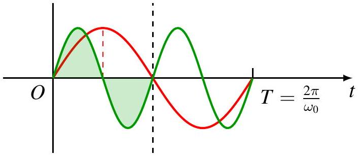{fig-align=center}

$$
\begin{aligned}
& \sin \left(\omega_{0} t\right) \\
& \cos \left(\omega_{0} t\right)
\end{aligned}
$$

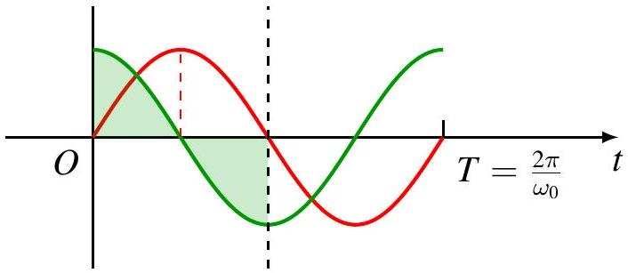{fig-align=center}

## 傅里叶系数 (Fourier Coefficients)

假设 $x$ 周期为 $T$ 且有傅里叶级数表示：

$$
x(t)=\sum_{k=-\infty}^{\infty} c_{k} e^{j k \omega_{0} t}, \quad \omega_{0}=\frac{2 \pi}{T}
$$

利用 $\left\{e^{j k \omega_{0} t}\right\}$ 的正交归一性求解傅里叶系数：

$$
\begin{aligned}
\left\langle x, e^{j m \omega_{0} t}\right\rangle & =\left\langle\sum_{k=-\infty}^{\infty} c_{k} e^{j k \omega_{0} t}, e^{j m \omega_{0} t}\right\rangle \\
& =\sum_{k=-\infty}^{\infty} c_{k}\left\langle e^{j k \omega_{0} t}, e^{j m \omega_{0} t}\right\rangle \\
& =\sum_{k=-\infty}^{\infty} c_{k} \delta[m-k]=c_{m}
\end{aligned}
$$

## 复数傅里叶级数

**综合方程 (Synthesis equation)**

$$
x(t)=\sum_{k=-\infty}^{\infty} \hat{x}[k] e^{j k \omega_{0} t}=\sum_{k=-\infty}^{\infty} \hat{x}[k] e^{j k \frac{2 \pi}{T} t}
$$

$N$ 次部分和：
$$
S_{N}(x)(t)=\sum_{k=-N}^{N} \hat{x}[k] e^{i k \omega_{0} t}
$$

**分析方程 (Analysis equation)**

$$
\hat{x}[k]=\left\langle x, e^{j k \omega_{0} t}\right\rangle=\frac{1}{T} \int_{T} x(t) e^{-j k \omega_{0} t} d t=\frac{1}{T} \int_{T} x(t) e^{-j k \frac{2 \pi}{T} t} d t
$$

## 三角傅里叶级数

对于正弦和余弦：

* 正弦与正弦正交

* 余弦与余弦正交

* 正弦与余弦正交

**综合方程**

$$
x(t)=a_{0}+\sum_{k=1}^{\infty}\left[a_{k} \cos \left(k \omega_{0} t\right)+b_{k} \sin \left(k \omega_{0} t\right)\right]
$$

**分析方程**

$$
a_{k}=\frac{2-\delta[k]}{T} \int_{T} x(t) \cos \left(k \omega_{0} t\right) d t, \quad b_{k}=\frac{2}{T} \int_{T} x(t) \sin \left(k \omega_{0} t\right) d t
$$

## 两种形式的等价性

**复数形式**
$$
x(t)=\sum_{k=-\infty}^{\infty} \hat{x}[k] e^{j k \omega_{0} t}
$$

**三角形式**
$$
x(t)=a_{0}+\sum_{k=1}^{\infty}\left[a_{k} \cos \left(k \omega_{0} t\right)+b_{k} \sin \left(k \omega_{0} t\right)\right]
$$

**系数转换 (通过欧拉公式)**

$$
\left\{\begin{array}{ll}
a_{0}=\hat{x}[0] \\
a_{k}=\hat{x}[k]+\hat{x}[-k], \\
b_{k}=j(\hat{x}[k]-\hat{x}[-k]),
\end{array} \quad k \geq 1 \quad  \begin{cases}\hat{x}[0]=a_{0} \\
\hat{x}[k]=\frac{1}{2}\left(a_{k}-j b_{k}\right), & k \geq 1 \\
\hat{x}[k]=\frac{1}{2}\left(a_{k}+j b_{-k}\right), & k \leq-1\end{cases}\right.
$$

复数形式中的负频率是为了数学上的方便引入的，没有直接的物理意义。

## 例子

例子：$x(t)=e^{j \omega_{0} t}, \hat{x}[k]=\delta[k-1]$

:::: {.columns style="text-align: center;"}

::: {.column width="50%"}
频谱 $\hat{x}[k]$
 
:::

::: {.column width="50%"}

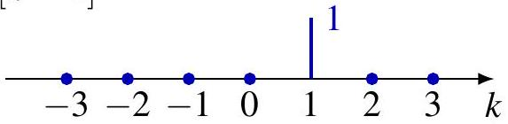
:::
::::

例子：$x(t)=\cos \left(\omega_{0} t+\phi\right)=\frac{e^{i \phi}}{2} e^{j \omega_{0} t}+\frac{e^{-j \phi}}{2} e^{-j \omega_{0} t}$，

显然：
$$
\hat{x}[1]=\frac{1}{2} e^{j \phi}, \quad, \hat{x}[-1]=\frac{1}{2} e^{-j \phi}, \quad \hat{x}[k]=0, k \neq \pm 1
$$

:::: {.columns style="text-align: center;"}

::: {.column width="50%"}

 

幅值谱 $|\hat{x}[k]|$
 
 

 

相位谱 $\arg \hat{x}[k]$
:::

::: {.column width="50%"}
 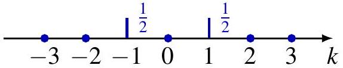

 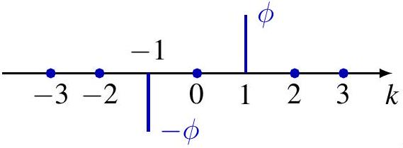

:::

::::

## 例子：三角波 (Triangle Wave)

在一个周期内，

$$
x(t)=1-\frac{2|t|}{T}, \quad|t| \leq \frac{T}{2}
$$

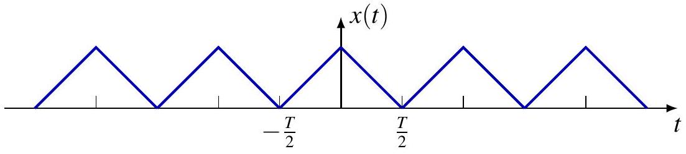

傅里叶系数：

$$
k=0, \quad \hat{x}[0]=\frac{1}{T} \int_{-T / 2}^{T / 2}\left(1-\frac{2|t|}{T}\right) d t=\frac{1}{2}
$$

$k \neq 0, k$ 为奇数,$\quad \hat{x}[k]=\frac{1}{T} \int_{-T / 2}^{T / 2}\left(1-\frac{2|t|}{T}\right) e^{-j k \omega_{0} t} d t=\frac{2}{\pi^{2} k^{2}}$
$k \neq 0, k$ 为偶数, $\quad \hat{x}[k]=0$

## 例子：三角波频谱

$$
\hat{x}[k]= \begin{cases}\frac{1}{2}, & k=0 \\ \frac{2}{\pi^{2} k^{2}}, & k \neq 0 \text { 奇数 } \\ 0, & k \neq 0 \text { 偶数 }\end{cases}
$$

固定 $T$ 的频谱，频率间隔 $\Delta \omega=\frac{2 \pi}{T}， \omega_{k}=k \frac{2 \pi}{T}$

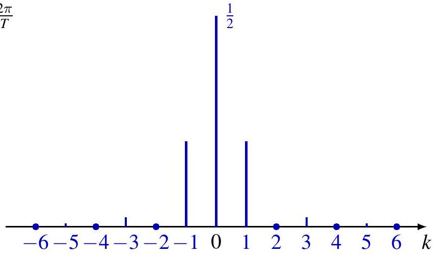{fig-align=center}

## 例子：三角波合成 ($N=0$)

$$
S_{0}(x)(t)=\sum_{k=-0}^{0} \hat{x}[k] e^{j k \omega_{0} t}
$$

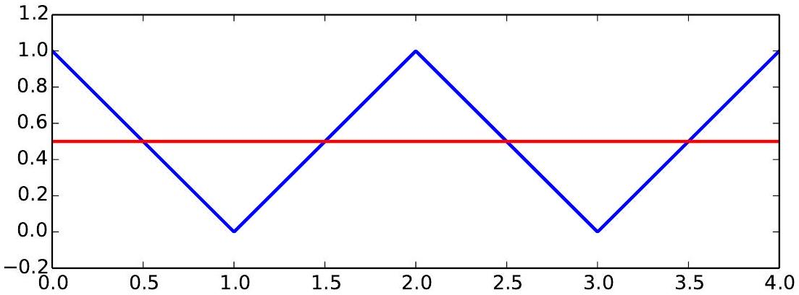

## 例子：三角波合成 ($N=1$)

$$
S_{1}(x)(t)=\sum_{k=-1}^{1} \hat{x}[k] e^{j k \omega_{0} t}
$$

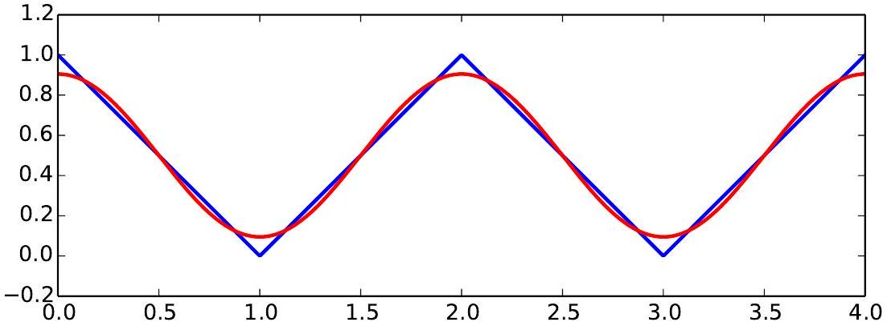

## 例子：三角波合成 ($N=3$)

$$
S_{3}(x)(t)=\sum_{k=-3}^{3} \hat{x}[k] e^{j k \omega_{0} t}
$$

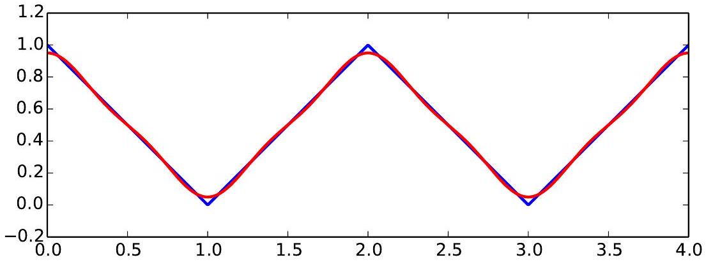

## 例子：三角波合成 ($N=5$)

$$
S_{5}(x)(t)=\sum_{k=-5}^{5} \hat{x}[k] e^{j k \omega_{0} t}
$$

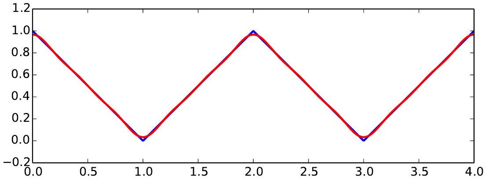

## 例子：三角波合成 ($N=7$)

$$
S_{7}(x)(t)=\sum_{k=-7}^{7} \hat{x}[k] e^{j k \omega_{0} t}
$$

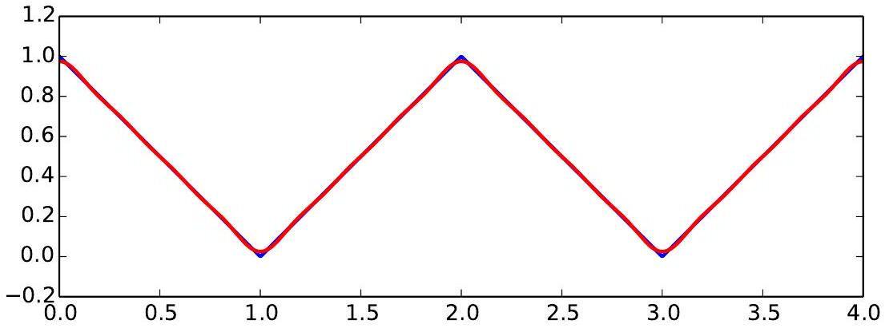

## 例子：三角波合成 ($N=9$)

$$
S_{9}(x)(t)=\sum_{k=-9}^{9} \hat{x}[k] e^{j k \omega_{0} t}
$$

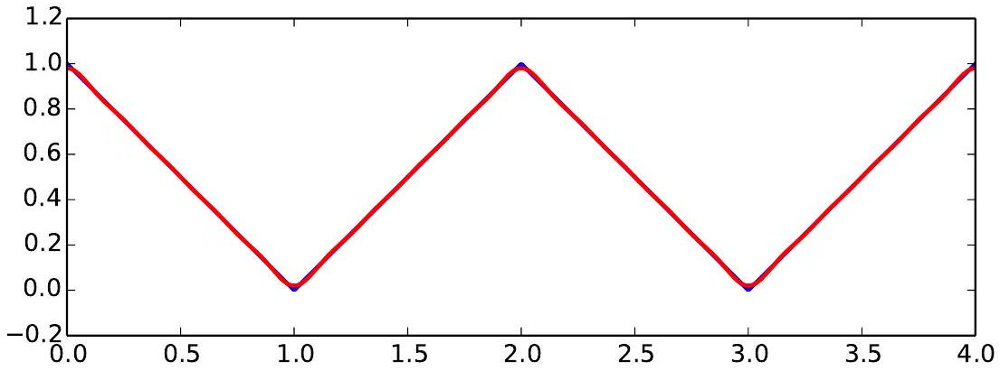

## 例子：三角波合成 ($N=19$)

$$
S_{19}(x)(t)=\sum_{k=-19}^{19} \hat{x}[k] e^{j k \omega_{0} t}
$$

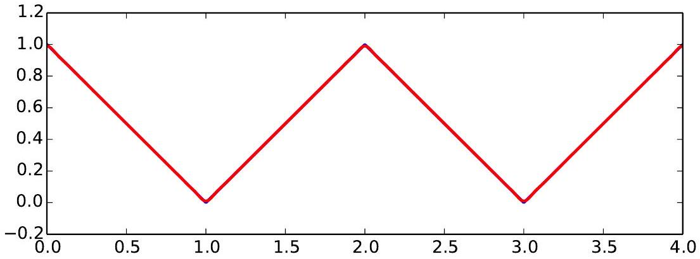

## 例子：周期方波 (Periodic Square Wave)

在一个周期内，

$$
x(t)= \begin{cases}1, & |t|<T_{1} \\ 0, & T_{1}<|t|<T / 2\end{cases}
$$

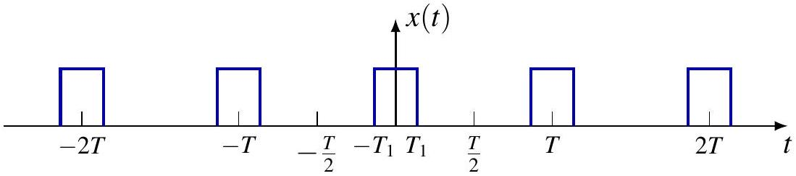

傅里叶系数：

$$
\begin{array}{ll}
k=0, & \hat{x}[0]=\frac{1}{T} \int_{-T_{1}}^{T_{1}} 1 d t=\frac{2 T_{1}}{T} \\
k \neq 0, & \hat{x}[k]=\frac{1}{T} \int_{-T_{1}}^{T_{1}} e^{-j k \omega_{0} t} d t=\frac{2 \sin \left(k \omega_{0} T_{1}\right)}{k \omega_{0} T}=\frac{\sin \left(k \omega_{0} T_{1}\right)}{k \pi}
\end{array}
$$

## 例子：周期方波频谱

$$
\hat{x}[k]=\frac{\sin \left(k \frac{2 \pi T_{1}}{T}\right)}{k \pi}=\frac{2 \sin \left(\omega_{k} T_{1}\right)}{\omega_{k} T}
$$

固定 $T$，不同 $T_{1}$ 的频谱：

:::: {.columns style="text-align: center;"}

::: {.column width="5%"}

:::

::: {.column width="90%"}
 
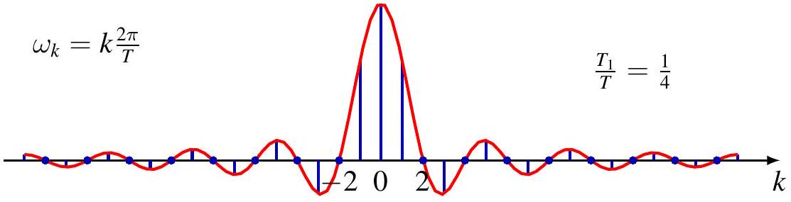

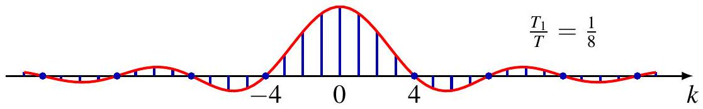

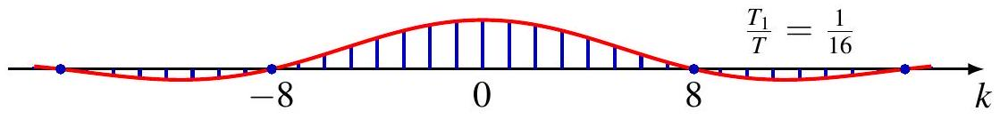
:::

::: {.column width="5%"}
 
 
:::

::::

## 例子：周期方波频谱 (不同 $T$)

$$
\hat{x}[k]=\frac{\sin \left(k \frac{2 \pi T_{1}}{T}\right)}{k \pi}=\frac{2 \sin \left(\omega_{k} T_{1}\right)}{\omega_{k} T}
$$

固定 $T_{1}$，不同 $T$ 的频谱：

:::: {.columns style="text-align: center;"}

::: {.column width="5%"}

 
:::

::: {.column width="90%"}

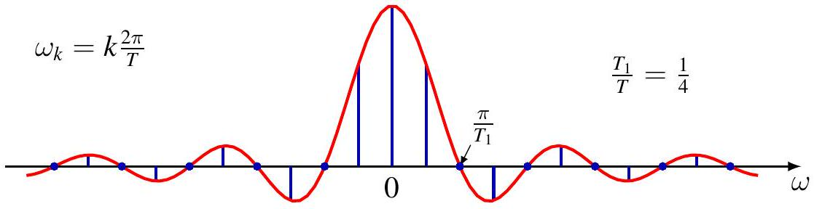

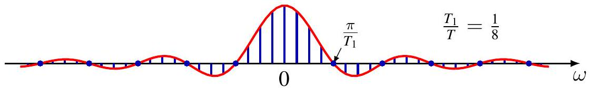

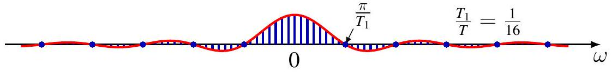
 
:::

::: {.column width="5%"}
 
 
:::

::::

## 例子：方波合成 ($N=0$)

$$
S_{0}(x)(t)=\sum_{k=-0}^{0} \hat{x}[k] e^{j k \omega_{0} t}
$$

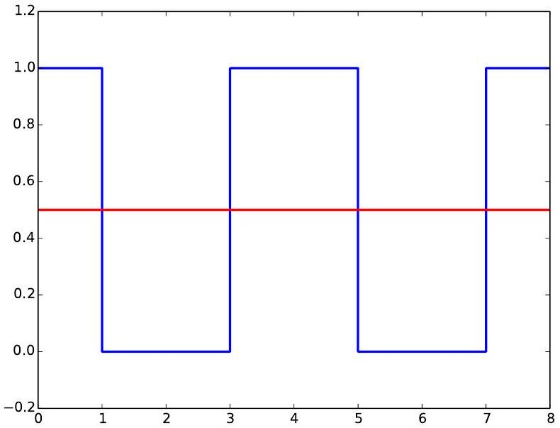{fig-align=center}

## 例子：方波合成 ($N=1$)

$$
S_{1}(x)(t)=\sum_{k=-1}^{1} \hat{x}[k] e^{j k \omega_{0} t}
$$

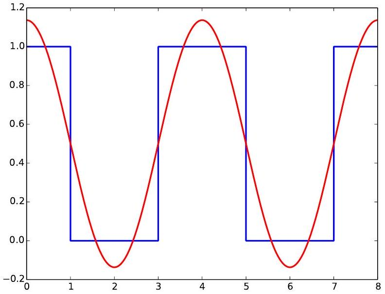{fig-align=center}

## 例子：方波合成 ($N=3$)

$$
S_{3}(x)(t)=\sum_{k=-3}^{3} \hat{x}[k] e^{j k \omega_{0} t}
$$

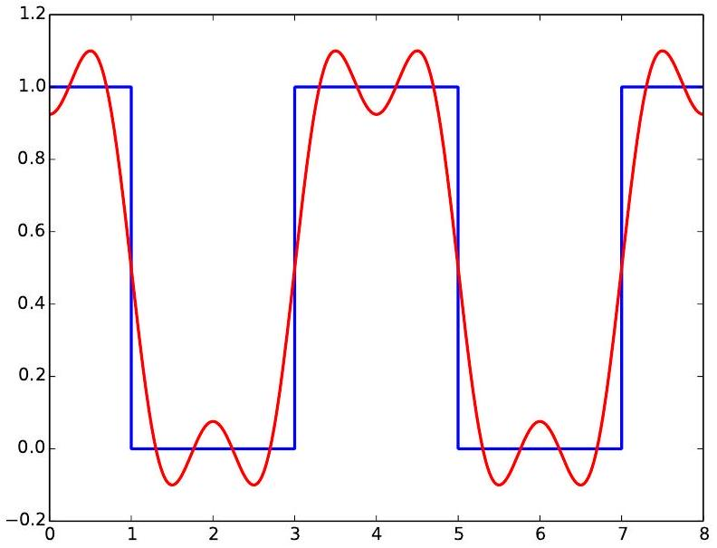{fig-align=center}

## 例子：方波合成 ($N=5$)

$$
S_{5}(x)(t)=\sum_{k=-5}^{5} \hat{x}[k] e^{j k \omega_{0} t}
$$

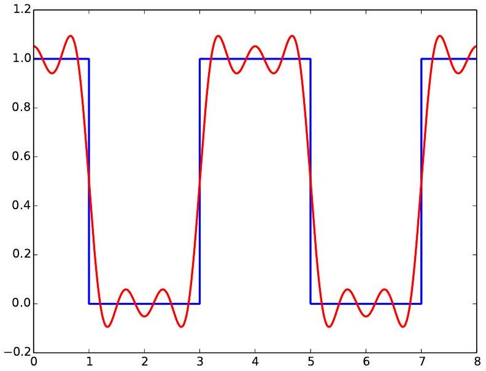{fig-align=center}

## 例子：方波合成 ($N=7$)

$$
S_{7}(x)(t)=\sum_{k=-7}^{7} \hat{x}[k] e^{j k \omega_{0} t}
$$

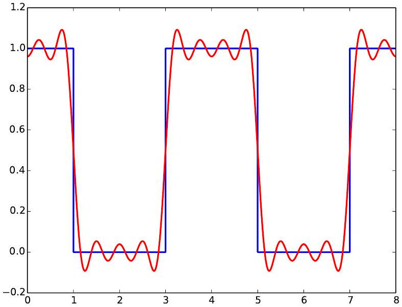{fig-align=center}

## 例子：方波合成 ($N=9$)

$$
S_{9}(x)(t)=\sum_{k=-9}^{9} \hat{x}[k] e^{j k \omega_{0} t}
$$

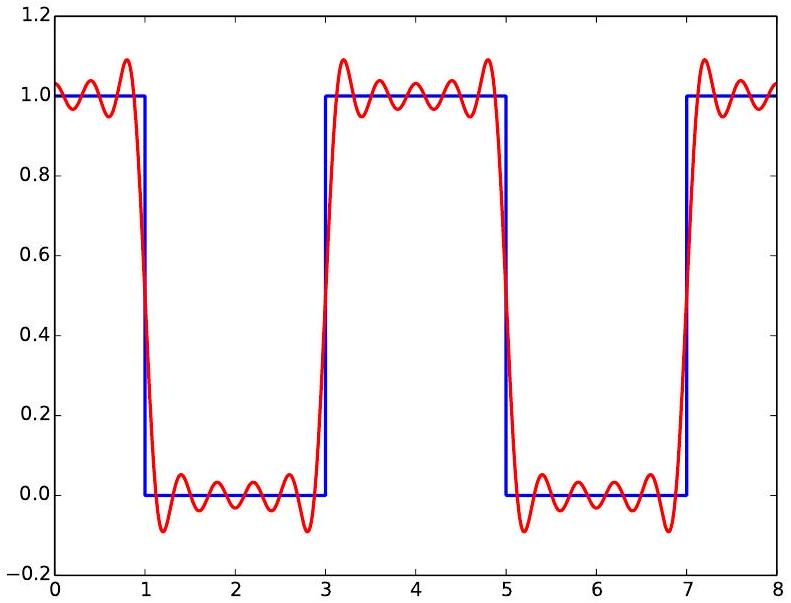{fig-align=center}

## 例子：方波合成 ($N=13$)

$$
S_{13}(x)(t)=\sum_{k=-13}^{13} \hat{x}[k] e^{j k \omega_{0} t}
$$

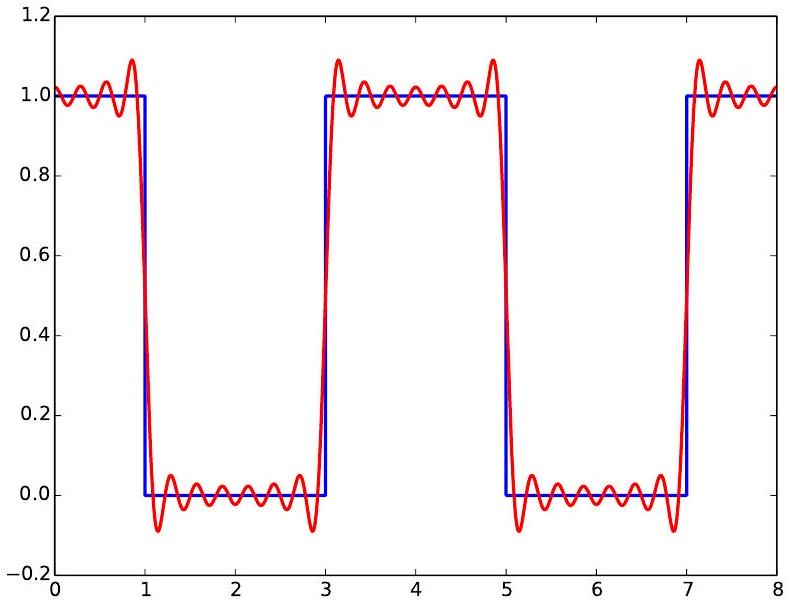{fig-align=center}

## 例子：方波合成 ($N=19$)

$$
S_{19}(x)(t)=\sum_{k=-19}^{19} \hat{x}[k] e^{j k \omega_{0} t}
$$

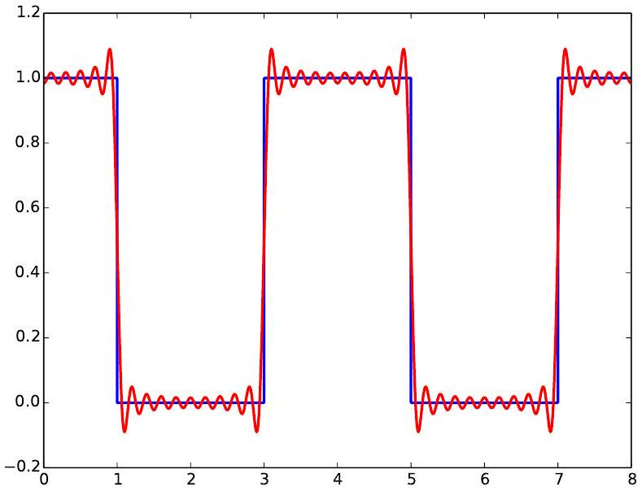{fig-align=center}

## 例子：方波合成 ($N=29$)

$$
S_{29}(x)(t)=\sum_{k=-29}^{29} \hat{x}[k] e^{j k \omega_{0} t}
$$

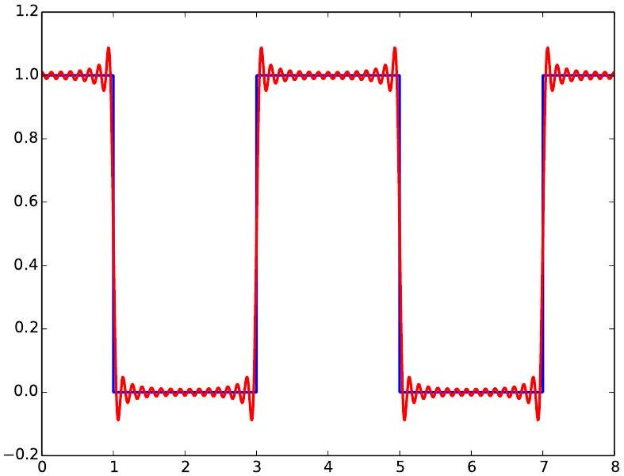{fig-align=center}

## 例子：方波合成 ($N=39$)

$$
S_{39}(x)(t)=\sum_{k=-39}^{39} \hat{x}[k] e^{j k \omega_{0} t}
$$

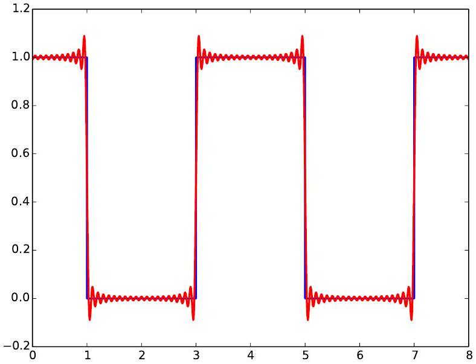{fig-align=center}

## 吉布斯现象 (Gibbs Phenomenon)

傅里叶级数的部分和在跳变间断点处“振铃”

- 随着项数增加，过冲越来越靠近间断点
- 过冲幅度趋近于跳变幅度的 $\approx 9 \%$

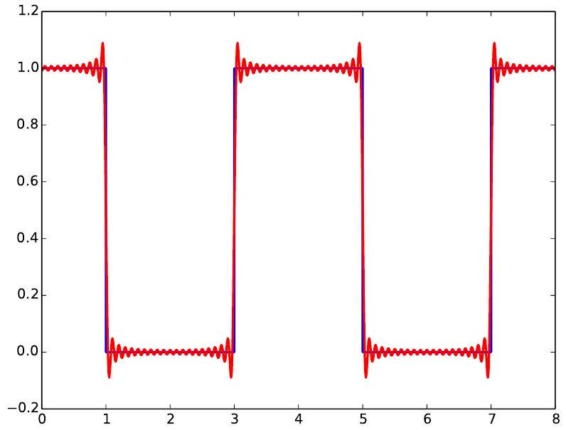

## 目录 {#toc2 }

- [1. 线性时不变系统对复指数信号的响应](#sec31)
- [2. 连续时间周期信号的傅里叶级数表示](#sec32)
- [**3. 连续时间傅里叶级数的收敛**](#sec33)
- [4. 连续时间傅里叶级数的性质](#sec34)
- [5. 离散时间周期信号的傅里叶级数表示](#35)
- [6. 离散时间傅里叶级数的性质](#sec36)
- [7. 傅里叶级数与线性时不变系统](#sec37)
- [8. 滤波](#sec38)
  - [频率成形滤波器](#sec381)
  - [频率选择性滤波器](#sec382)
  - [用微分方程描述的连续时间滤波器](#sec383)
  - [用差分方程描述的离散时间滤波器](#sec383)

# 3. 连续时间傅里叶级数的收敛{#sec33}

## 帕塞瓦尔恒等式 (帕塞瓦尔公式，Parseval's Identity)

对于具有有限 **2-范数** 的信号的傅里叶系数：

$$
\sum_{k=-\infty}^{\infty}|\hat{x}[k]|^{2}=\|x\|^{2}=\frac{1}{T} \int_{T}|x(t)|^{2} d t
$$
解释：能量守恒

- $|\hat{x}[k]|^{2}$ 是第 $k$ 次谐波分量的平均功率
- $\|x\|^{2}$ 是 $x$ 的平均功率
- 总功率是所有分量功率之和

定理：傅里叶级数在均方意义下收敛

$$
\lim _{N \rightarrow \infty}\left\|x-S_{N}(x)\right\|=0
$$

注意：均方收敛并不意味着逐点收敛。

 

如何证明？

<!-- ## 柯西-施瓦茨不等式 (Cauchy-Schwarz Inequality)

$$
|\langle x, y\rangle| \leq\|x\| \cdot\|y\|
$$

证明：如果 $\|y\|=0$，则 $y=0$ 且 $\langle x, y\rangle=\|x\| \cdot\|y\|$。现在假设 $\|y\| \neq 0$。对于任意 $\lambda \in \mathbb{C}$，

$$
0 \leq\langle x-\lambda y, x-\lambda y\rangle=\|x\|^{2}-\lambda \overline{\langle x, y\rangle}-\bar{\lambda}\langle x, y\rangle+|\lambda|^{2}\|y\|^{2}
$$

令 $\lambda=\langle x, y\rangle /\|y\|^{2}$，

$$
0 \leq\|x\|^{2}-\frac{|\langle x, y\rangle|^{2}}{\|y\|^{2}}-\frac{|\langle x, y\rangle|^{2}}{\|y\|^{2}}+\frac{|\langle x, y\rangle|^{2}}{\|y\|^{2}} \Longrightarrow|\langle x, y\rangle| \leq\|x\| \cdot\|y\|
$$

积分形式：

$$
\left|\int_{\mathbb{R}} x(t) \overline{y(t)} d t\right| \leq \sqrt{\int_{\mathbb{R}}|x(t)|^{2} d t} \cdot \sqrt{\int_{\mathbb{R}}|y(t)|^{2} d t}
$$ -->

## 内积空间中的正交归一系

如果 $\langle x, y\rangle=0$，则两个向量 $x, y \in V$ 是**正交**的。
如果 $\|x\|=1$ 或 $\langle x, x\rangle=1$，则向量 $x \in V$ 是**单位向量**。
如果对于 $m \neq k$，$\left\langle x_{k}, x_{m}\right\rangle=0$，则 $\left\{x_{k}\right\}$ 是**正交系**。
如果 $\left\langle e_{k}, e_{m}\right\rangle=\delta_{k m}=\delta[k-m]$，则 $\left\{e_{k}\right\}$ 是**正交归一系 (orthonormal system)**。
 

令 $e_{k}(t)=e^{j k \frac{2 \pi}{T} t}$。回顾 $\left\{e_{k}: k \in \mathbb{Z}\right\}$ 是正交归一系：

$$
\left\langle e_{k}, e_{m}\right\rangle=\delta[k-m]
$$

给定正交归一系 $\left\{e_{k}\right\}$，假设

$$
x=\sum_{k} c_{k} e_{k}
$$

通过与 $e_{m}$ 做内积来求系数：

$$
\left\langle x, e_{m}\right\rangle=\left\langle\sum_{k} c_{k} e_{k}, e_{m}\right\rangle=\sum_{k} c_{k}\left\langle e_{k}, e_{m}\right\rangle=\sum_{k} c_{k} \delta[k-m]=c_{m}
$$

广义傅里叶级数：

$$
x=\sum_{k}\left\langle x, e_{k}\right\rangle e_{k}
$$

这就是我们要做的傅里叶级数展开。

## 最佳均方逼近 (Best Mean-square Approximation)

用 $\operatorname{span}\left\{e_{1}, \ldots, e_{n}\right\}$ 中的元素逼近 $x$ 的均方误差，即用形式为 $y=\sum_{k=1}^{n} a_{k} e_{k}$ 的元素：

$$
\begin{aligned}
\|x-y\|^{2} & =\left\langle x-\sum_{k=1}^{n} a_{k} e_{k}, x-\sum_{k=1}^{n} a_{k} e_{k}\right\rangle \\
& =\|x\|^{2}-\sum_{k=1}^{n} a_{k}\left\langle e_{k}, x\right\rangle-\sum_{k=1}^{n} \bar{a}_{k}\left\langle x, e_{k}\right\rangle+\sum_{k=1}^{n}\left|a_{k}\right|^{2} \\
& =\|x\|^{2}-2 \sum_{k=1}^{n} \operatorname{Re}\left(\bar{a}_{k}\left\langle x, e_{k}\right\rangle\right)+\sum_{k=1}^{n}\left|a_{k}\right|^{2} \\
& \geq\|x\|^{2}-2 \sum_{k=1}^{n}\left|a_{k}\right| \cdot\left|\left\langle x, e_{k},\right\rangle\right|+\sum_{k=1}^{n}\left|a_{k}\right|^{2} \quad(\text { 使用 }|\operatorname{Re} z| \leq|z|) \\
& =\|x\|^{2}-\sum_{k=1}^{n}\left|\left\langle x, e_{k}\right\rangle\right|^{2}+\sum_{k=1}^{n}\left(\left|a_{k}\right|-\left|\left\langle x, e_{k},\right\rangle\right|\right)^{2}
\end{aligned}
$$

## 最佳均方逼近 (续)

逼近的均方误差：

$$
\begin{aligned}
\|x-y\|^{2} & \stackrel{(1)}{\geq}\|x\|^{2}-\sum_{k=1}^{n}\left|\left\langle x, e_{k}\right\rangle\right|^{2}+\sum_{k=1}^{n}\left(\left|a_{k}\right|-\left|\left\langle x, e_{k},\right\rangle\right|\right)^{2} \\
& \stackrel{(2)}{\geq}\|x\|^{2}-\sum_{k=1}^{n}\left|\left\langle x, e_{k}\right\rangle\right|^{2}
\end{aligned}
$$

当且仅当 $a_{k}=\left\langle x, e_{k}\right\rangle$ 时达到最小均方误差。

- (1) 处取等号要求 $\arg a_{k}=\arg \left\langle x, e_{k}\right\rangle$
- (2) 处取等号要求 $\left|a_{k}\right|=\left|\left\langle x, e_{k}\right\rangle\right|$

### 最佳均方逼近

给定一个正交归一系统 $\left\{e_{1}, \ldots, e_{n}\right\}$, 用由$\operatorname{span}\left\{e_{1}, \ldots, e_{n}\right\}$张成的空间中的元素来逼近$x$时，其均方意义下的最佳逼近（best mean-square approximation）是

$$
y=\sum_{k=1}^{n}\left\langle x, e_{k}\right\rangle e_{k},
$$

并且其均方误差达到最小值

$$
\|x-y\|^{2}=\|x\|^{2}-\sum_{k=1}^{n}\left|\left\langle x, e_{k}\right\rangle\right|^{2} .
$$

## 傅里叶技术和最佳均方逼近

**综合方程 (Synthesis equation)**

$$
x(t)=\sum_{k=-\infty}^{\infty} \hat{x}[k] e^{j k \omega_{0} t}=\sum_{k=-\infty}^{\infty} \hat{x}[k] e^{j k \frac{2 \pi}{T} t}
$$

$N$ 次部分和：
$$
S_{N}(x)(t)=\sum_{k=-N}^{N} \hat{x}[k] e^{i k \omega_{0} t}
$$

**分析方程 (Analysis equation)**

$$
\hat{x}[k]=\left\langle x, e^{j k \omega_{0} t}\right\rangle=\frac{1}{T} \int_{T} x(t) e^{-j k \omega_{0} t} d t=\frac{1}{T} \int_{T} x(t) e^{-j k \frac{2 \pi}{T} t} d t
$$

傅里叶部分和 $S_{N}(x)=\sum_{k=-N}^{N} \hat{x}[k] e^{j k \omega_{0} t}$ 是最佳均方逼近：

$$
\left\|x-S_{N}(x)\right\|^{2}=\min _{a_{k},-N \leq k \leq N}\left\|x-\sum_{k=-N}^{N} a_{k} e^{j k \omega_{0} t}\right\|^{2}
$$

## 贝塞尔不等式 (Bessel's Inequality)

最小均方误差：

$$
\left\|x-\sum_{k=1}^{n}\left\langle x, e_{k}\right\rangle e_{k}\right\|^{2}=\|x\|^{2}-\sum_{k=1}^{n}\left|\left\langle x, e_{k}\right\rangle\right|^{2}
$$

贝塞尔不等式：

$$
\sum_{k}\left|\left\langle x, e_{k}\right\rangle\right|^{2} \leq\|x\|^{2}
$$

对于具有有限 2-范数的信号的傅里叶系数：

$$
\sum_{k=-\infty}^{\infty}|\hat{x}[k]|^{2} \leq\|x\|^{2}
$$

推论：$\lim _{k \rightarrow \infty} \hat{x}[k]=0$

## 帕塞瓦尔恒等式（帕塞瓦尔公式）

对于具有有限 **2-范数** 的信号的傅里叶系数：

$$
\sum_{k=-\infty}^{\infty}|\hat{x}[k]|^{2}=\|x\|^{2}=\frac{1}{T} \int_{T}|x(t)|^{2} d t
$$

解释：能量守恒

- $|\hat{x}[k]|^{2}$ 是第 $k$ 次谐波分量的平均功率
- $\|x\|^{2}$ 是 $x$ 的平均功率
- 总功率是所有分量功率之和

定理：傅里叶级数在均方意义下收敛

$$
\lim _{N \rightarrow \infty}\left\|x-S_{N}(x)\right\|=0
$$

已经证明了最佳逼近，能否保证误差为零？

## 帕塞瓦尔恒等式（帕塞瓦尔公式）
### 最佳均方逼近的几何意义

子空间 $\left\{e_{1}, \ldots, e_{n}\right\}$ 上的正交投影高维勾股定理（毕达哥拉斯定理）
$$\|x\|^2 = \sum_{k=1}^{n} |\langle x, e_k \rangle|^2 + \left\| x - \sum_{k=1}^{n} \langle x, e_k \rangle e_k \right\|^2， \quad y=\sum_{k=1}^{n} \langle x, e_k \rangle e_k$$

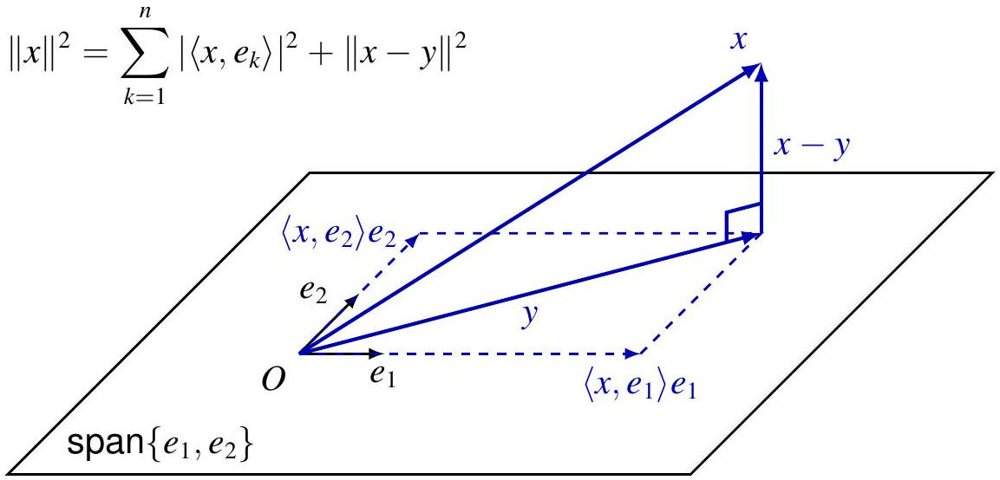{width=80%}

思考：当$n->\infty$?

## 帕塞瓦尔恒等式（帕塞瓦尔公式）

### 完备正交规范序列

在 Hilbert 空间 $H$ 中，如果每一个元素 $x \in H$ 都可以进行如下展开，则称标准正交序列 $\{e_k : k \in \mathbb{N}\}$ 是**完备的** (Complete)：

$$x = \sum_{k=1}^{\infty} \langle x, e_k \rangle e_k$$

这意味着该序列的部分和在范数意义下收敛于 $x$，即：

$$\lim_{n \to \infty} \left\| x - \sum_{k=1}^{n} \langle x, e_k \rangle e_k \right\| = 0$$

* **标准正交基 (Orthonormal Basis)**：一个完备的标准正交序列也被称为该 Hilbert 空间 $H$ 的标准正交基。
* **系数定义**：展开式中的系数 $\langle x, e_k \rangle$ 称为 $x$ 关于基 $\{e_k\}$ 的傅里叶系数或坐标。

经典示例

* **单位脉冲基**：$\{\delta_k : k \in \mathbb{Z}\}$ 是平方可和序列空间 $\ell_2$ 的标准正交基。
    * 其中 $\delta_k[m] = 1$ (当 $m=k$ 时) 且 $\delta_k[m] = 0$ (当 $m \neq k$ 时)

<!-- ## 帕塞瓦尔公式

若 $\{e_k : k \in \mathbb{N}\}$ 是 Hilbert 空间 $H$ 的一个标准正交基，则有：

$$\|x\|^2 = \sum_{k=1}^{\infty} |\langle x, e_k \rangle|^2$$

### 证明

**根据高维勾股定理（毕达哥拉斯定理）：**

$$\|x\|^2 = \sum_{k=1}^{n} |\langle x, e_k \rangle|^2 + \left\| x - \sum_{k=1}^{n} \langle x, e_k \rangle e_k \right\|^2$$

令 $n \to \infty$，根据标准正交基的定义，最后一项（残差项）趋于零。

结论：

希尔伯特空间 $H$ 同构于 $\ell_2$ 空间，其映射关系为 $x \leftrightarrow \{\langle x, e_k \rangle : k \in \mathbb{N}\}$，并且满足：

$$\langle x, y \rangle = \sum_{k=1}^{\infty} \langle x, e_k \rangle \overline{\langle y, e_k \rangle}$$

## 帕塞瓦尔恒等式

### 证明

利用 $x$ 和 $y$ 在标准正交基 $\{e_k\}$ 下的展开式：

$$\begin{aligned}
\langle x, y \rangle &= \left\langle \sum_{k} \langle x, e_k \rangle e_k, \sum_{m} \langle y, e_m \rangle e_m \right\rangle \\
&= \sum_{k} \langle x, e_k \rangle \sum_{m} \overline{\langle y, e_m \rangle} \langle e_k, e_m \rangle \\
&= \sum_{k} \langle x, e_k \rangle \sum_{m} \overline{\langle y, e_m \rangle} \delta[k - m] \\
&= \sum_{k} \langle x, e_k \rangle \overline{\langle y, e_k \rangle}
\end{aligned}$$

**注意：** 当 $x = y$ 时，我们重新得到了 Parseval 等式：
$$\|x\|^2 = \sum_{k=1}^{\infty} |\langle x, e_k \rangle|^2$$ -->

## 傅里叶级数的均方收敛

### 定理

集合 $\{e^{j k \frac{2\pi}{T} t} : k \in \mathbb{Z}\}$ 是 $L_2(T)$ 空间的标准正交基。对于任何 $x \in L_2(T)$，其傅里叶级数在**均方意义**下收敛，即在 $L_2$ 范数下满足：

$$\lim_{N \to \infty} \|x - S_N(x)\| = 0$$

### Parseval 公式 (帕塞瓦尔恒等式)

$$\sum_{k=-\infty}^{\infty} |\hat{x}[k]|^2 = \|x\|^2 = \frac{1}{T} \int_{T} |x(t)|^2 dt$$

### 物理阐释：能量守恒 (Energy Conservation)

* **$|\hat{x}[k]|^2$**：第 $k$ 次谐波分量的**平均功率**。
* **$\|x\|^2$**：信号 $x$ 的**总平均功率**。

### 核心解读

1. **均方收敛 vs 逐点收敛**：
   这是一个非常重要的警示。即使傅里叶级数捕获了信号的所有“能量”（均方收敛），但在信号的跳变点（不连续点）附近，它可能仍然无法完全匹配信号的具体数值（即著名的 **Gibbs 现象**）。
   
2. **频谱的本质**：
   Parseval 等式建立了时域和频域之间的桥梁。它告诉我们，计算信号的功率既可以在时域（对平方求积分），也可以在频域（对系数平方求和）。在工程上，这意味着能量在变换过程中既没有丢失也没有凭空产生。

3. **正交性的威力**：
   之所以能写成这种简单的平方和形式，完全归功于复指数函数 $\{e^{j k \omega_0 t}\}$ 之间的相互**正交性**。

<!-- ## $L_2$ 信号的傅里叶级数 (Fourier Series of $L_2$ Signals)

周期函数与双向无限序列之间的对应关系；时域 vs. 频域
 
$$x \stackrel{\mathcal{FS}}{\longleftrightarrow} \hat{x} \quad \text{或 (or)} \quad x(t) \stackrel{\mathcal{FS}}{\longleftrightarrow} \hat{x}[k]$$

傅里叶级数是 $L_2$ 信号的 Hilbert 空间与 $\ell_2$ 傅里叶系数的 Hilbert 空间之间的同构映射

$$\begin{aligned}
\mathcal{FS} : L_2(T) &\to \ell_2 \\
x &\mapsto \hat{x}
\end{aligned}$$

将会看到离散时间傅里叶变换从 $\hat{x}$ 映射到 $x$。Parseval 定理

$$\langle x, y \rangle_{L_2(T)} = \langle \hat{x}, \hat{y} \rangle_{\ell_2}$$ -->

<!-- ## 部分和的积分表示

不失一般性，关注  $T=2 \pi$ 和 $\omega_{0}=1$

$$
\begin{aligned}
S_{N}(x)(t) & =\sum_{k=-N}^{N} \hat{x}[k] e^{j k t} \\
& =\sum_{k=-N}^{N}\left(\frac{1}{2 \pi} \int_{2 \pi} x(\tau) e^{-j k \tau} d \tau\right) e^{j k t} \\
& =\frac{1}{2 \pi} \int_{2 \pi} x(\tau) \sum_{k=-N}^{N} e^{j k(t-\tau)} d \tau \\
& =\frac{1}{2 \pi} \int_{2 \pi} x(\tau) D_{N}(t-\tau) d \tau=\left(x * \frac{D_{N}}{2 \pi}\right)(t)
\end{aligned}
$$

其中 $D_N$ 是 Dirichlet 核 (Dirichlet kernel)

$$
D_{N}(t)=\sum_{k=-N}^{N} e^{j k t}=\frac{\sin \left(\left(N+\frac{1}{2}\right) t\right)}{\sin (t / 2)}
$$

## 狄利克雷核

不同 $N$ 取值下的 $\frac{D_N}{2\pi}$ 图像

:::: {.columns style="text-align: center;"}

::: {.column width="33%"}

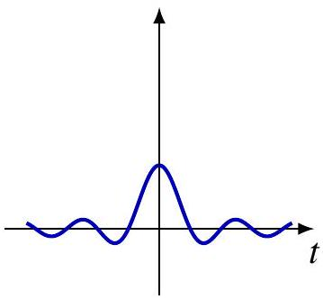

$N=4$
:::

::: {.column width="34%"}
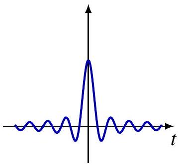

$N=8$
 
:::

::: {.column width="33%"}
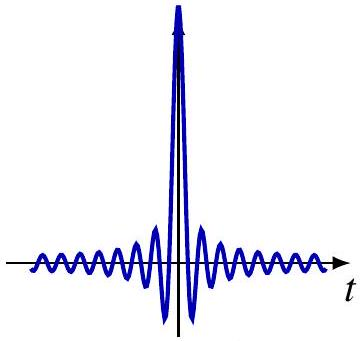

$N=16$
:::

::::

如果 $\frac{D_N}{2\pi} \to \delta$，那么至少对于连续函数 $x$，将会有 $S_N(x) = x * \frac{D_N}{2\pi} \to x * \delta = x$。
 
不幸的是，存在连续函数 $x$，其傅里叶部分和 $S_N(x)$ 当 $N \to \infty$ 时，在某些点 $t$ 处根本不收敛，更不用说在这些点收敛到 $x(t)$ 了。

## 逐点收敛

**定理。** 若 $x$ 是可微的，则对于所有 $t$，$\lim_{N \to \infty} S_N(x)(t) = x(t)$。

**证明。** 固定 $t$。定义：

$$
F(\tau) = \begin{cases} 
\frac{x(t-\tau) - x(t)}{\sin(\tau/2)}, & \tau \neq 0 \\
-2x'(t), & \tau = 0 
\end{cases}
$$

其在 $[-\pi, \pi]$ 上是连续的。注意 $\frac{1}{2\pi} \int_{-\pi}^{\pi} D_N(\tau) d\tau = 1$。

$$\begin{aligned}
S_N(x)(t) - x(t) &= \frac{1}{2\pi} \int_{-\pi}^{\pi} x(t - \tau) D_N(\tau) d\tau - \frac{1}{2\pi} \int_{-\pi}^{\pi} x(t) D_N(\tau) d\tau \\
&= \frac{1}{2\pi} \int_{-\pi}^{\pi} [x(t - \tau) - x(t)] D_N(\tau) d\tau \\
&= \frac{1}{2\pi} \int_{-\pi}^{\pi} F(\tau) \sin \left( \left(N + \frac{1}{2}\right) \tau \right) d\tau
\end{aligned}$$ -->

## 狄利克雷判别法

**定理**：如果 $x$ 满足以下 **狄利克雷条件 (Dirichlet conditions)**：

1. $x$ 是有界的，即 $\|x\|_\infty < \infty$；
2. $x$ 是分段单调的，即存在周期的有限划分，使得 $x$ 在每个区间段上都是单调的；

那么：

$$\lim_{N \to \infty} S_N(x)(t) = \frac{x(t_+) + x(t_-)}{2}$$

**示例：**

$$\lim_{N \to \infty} S_N(x)(t) = \begin{cases} 1, & t \in (n, n + \frac{1}{2}), \\ -1, & t \in (n - \frac{1}{2}, n), \\ 0, & t = \frac{n}{2}, \end{cases} \quad n \in \mathbb{Z}$$

## 目录 {#toc3}

- [1. 线性时不变系统对复指数信号的响应](#sec31)
- [2. 连续时间周期信号的傅里叶级数表示](#sec32)
- [3. 连续时间傅里叶级数的收敛](#sec33)
- [**4. 连续时间傅里叶级数的性质**](#sec34)
- [5. 离散时间周期信号的傅里叶级数表示](#35)
- [6. 离散时间傅里叶级数的性质](#sec36)
- [7. 傅里叶级数与线性时不变系统](#sec37)
- [8. 滤波](#sec38)
  - [频率成形滤波器](#sec381)
  - [频率选择性滤波器](#sec382)
  - [用微分方程描述的连续时间滤波器](#sec383)
  - [用差分方程描述的离散时间滤波器](#sec383)

# 4. 连续时间傅里叶级数的性质{#sec34}

## CT 傅里叶级数的性质

傅里叶级数建立了周期函数与双无限序列之间的对应关系：

$$
x \stackrel{\mathcal{F S}}{\longleftrightarrow} \hat{x} \quad \text { 或 } \quad x(t) \stackrel{\mathcal{F S}}{\longleftrightarrow} \hat{x}[k]
$$

**线性 (Linearity)**
如果 $x, y$ 具有相同的周期 $T$，那么它们的线性组合 $a x+b y$ 也是，并且：

$$
\widehat{a x+b y}=a \hat{x}+b \hat{y}
$$

证明：

$$
\begin{aligned}
(\widehat{a x+b y})[k] & =\left\langle a x+b y, e^{j k \omega_{0} t}\right\rangle \\
& =a\left\langle x, e^{j k \omega_{0} t}\right\rangle+b\left\langle y, e^{j k \omega_{0} t}\right\rangle \\
& =a \hat{x}[k]+b \hat{y}[k]
\end{aligned}
$$

## CT 傅里叶级数的性质

**时移 (Time shifting)**
如果 $x$ 周期为 $T$ 且 $\omega_{0}=\frac{2 \pi}{T}$，

$$
\widehat{\tau_{t_{0}} x}=E_{-\omega_{0} t_{0}} \hat{x} \quad \text { 或 } \quad x\left(t-t_{0}\right) \stackrel{\mathcal{F S}}{\longleftrightarrow} e^{-j k \omega_{0} t_{0}} \hat{x}[k]
$$

其中 $\left(E_{a} \hat{x}\right)[k]=e^{j a k} \hat{x}[k]$
**时移 ⟺ 频率上的线性相位变化**

证明：

$$
\begin{aligned}
\left(\widehat{\tau_{t_{0}}} x\right)[k] & =\left\langle\tau_{t_{0}} x, e^{j k \omega_{0} t}\right\rangle=\left\langle x, \tau_{-t_{0}} e^{j k \omega_{0} t}\right\rangle \\
& =\left\langle x, e^{j k \omega_{0}\left(t+t_{0}\right)}\right\rangle=\left\langle x, e^{j k \omega_{0} t_{0}} e^{j k \omega_{0} t}\right\rangle \\
& =e^{-j k \omega_{0} t_{0}}\left\langle x, e^{j k \omega_{0} t}\right\rangle=e^{-j k \omega_{0} t_{0}} \hat{x}[k]=\left(E_{-\omega_{0} t_{0}} \hat{x}\right)[k]
\end{aligned}
$$

例子：$\cos (t)=\frac{1}{2} e^{j t}+\frac{1}{2} e^{-j t}, \sin (t)=\cos \left(t-\frac{\pi}{2}\right)=\frac{-j}{2} e^{j t}+\frac{j}{2} e^{-j t}$

[返回目录](#toc4)

## 傅里叶级数 (回顾)

周期为 $T$ 且 $\omega_{0}=\frac{2 \pi}{T}$ 的信号 $x$ 的傅里叶级数：

$$
x(t)=\sum_{k=-\infty}^{\infty} \hat{x}[k] e^{j k \omega_{0} t}
$$

周期函数与双无限序列之间的对应关系；时域 vs. 频域：

$$
x \stackrel{\mathcal{F S}}{\longleftrightarrow} \hat{x} \quad \text { 或 } \quad x(t) \stackrel{\mathcal{F S}}{\longleftrightarrow} \hat{x}[k]
$$

- $\hat{x}$ 由 $x$ 在“基” $\left\{e^{j k \omega_{0} t}\right\}$ 下的展开系数组成
- 仅凭 $\hat{x}$ 不能唯一确定 $x$，
- 还需要知道基函数，或者等价地，知道周期 $T$ 或基频 $\omega_{0}$
- 相同的系数配合不同的基（周期）会给出不同的函数（稍后详述）

## 线性 (Linearity)

如果 $x, y$ 具有相同的周期 $T$，那么它们的线性组合 $a x+b y$ 也是，并且：

$$
\widehat{a x+b y}=a \hat{x}+b \hat{y}
$$

证明：

$$
\begin{aligned}
(\widehat{a x+b y})[k] & =\left\langle a x+b y, e^{j k \omega_{0} t}\right\rangle \\
& =a\left\langle x, e^{j k \omega_{0} t}\right\rangle+b\left\langle y, e^{j k \omega_{0} t}\right\rangle \\
& =a \hat{x}[k]+b \hat{y}[k]
\end{aligned}
$$

另一种证明思路：

$$
\left.\begin{array}{l}
x(t)=\sum_{k} \hat{x}[k] e^{j k \omega_{0} t} \\
y(t)=\sum_{k} \hat{y}[k] e^{j k \omega_{0} t}
\end{array}\right\} \Longrightarrow a x(t)+b y(t)=\sum_{k}(a \hat{x}[k]+b \hat{y}[k]) e^{j k \omega_{0} t}
$$

## 时移 (Time Shifting)

如果 $x$ 周期为 $T$ 且 $\omega_{0}=\frac{2 \pi}{T}$，

$$
\widehat{\tau_{t_{0}} x}=E_{-\omega_{0} t_{0}} \hat{x} \quad \text { 或 } \quad x\left(t-t_{0}\right) \stackrel{\mathcal{F S}}{\longleftrightarrow} e^{-j k \omega_{0} t_{0}} \hat{x}[k]
$$

其中 $\left(E_{a} \hat{x}\right)[k]=e^{j a k} \hat{x}[k]$

**时移 ⟺ 频率上的线性相位变化**

证明：

$$
\begin{aligned}
\left(\widehat{\tau_{t_{0}}} x\right)[k] & =\left\langle\tau_{t_{0}} x, e^{j k \omega_{0} t}\right\rangle=\left\langle x, \tau_{-t_{0}} e^{j k \omega_{0} t}\right\rangle \\
& =\left\langle x, e^{j k \omega_{0}\left(t+t_{0}\right)}\right\rangle=\left\langle x, e^{j k \omega_{0} t_{0}} e^{j k \omega_{0} t}\right\rangle \\
& =e^{-j k \omega_{0} t_{0}}\left\langle x, e^{j k \omega_{0} t}\right\rangle=e^{-j k \omega_{0} t_{0}} \hat{x}[k]=\left(E_{-\omega_{0} t_{0}} \hat{x}\right)[k]
\end{aligned}
$$

例子：$\cos (t)=\frac{1}{2} e^{j t}+\frac{1}{2} e^{-j t}, \sin (t)=\cos \left(t-\frac{\pi}{2}\right)=\frac{-j}{2} e^{j t}+\frac{j}{2} e^{-j t}$

## 频移 (Frequency Shifting)

如果 $x$ 周期为 $T$ 且 $\omega_{0}=\frac{2 \pi}{T}$，

$$
\widehat{E_{m \omega_{0}} x}=\tau_{m} \hat{x} \quad \text { 或 } \quad e^{j m \omega_{0} t} x(t) \stackrel{\mathcal{F S}}{\longleftrightarrow} \hat{x}[k-m]
$$

其中 $\left(E_{a} x\right)(t)=e^{j a t} x(t)$

**谐波指数调制 ⟹ 频移**

证明：

$$
\begin{aligned}
\left(\widehat{E_{m \omega_{0}}} x\right)[k] & =\left\langle E_{m \omega_{0}} x, e^{j k \omega_{0} t}\right\rangle=\left\langle x, E_{-m \omega_{0}} e^{j k \omega_{0} t}\right\rangle \\
& =\left\langle x, e^{j(k-m) \omega_{0} t}\right\rangle=\hat{x}[k-m]
\end{aligned}
$$

注意：用非谐波指数信号进行调制可能会改变基频，甚至导致非周期信号。

## 频移示例

例子：$x(t)=1+\cos \left(\omega_{0} t\right)=1+\frac{1}{2} e^{j \omega_{0} t}+\frac{1}{2} e^{-j \omega_{0} t}$

$$
y(t)=e^{j 3 \omega_{0} t} x(t)=e^{j 3 \omega_{0} t}+\frac{1}{2} e^{j 4 \omega_{0} t}+\frac{1}{2} e^{j 2 \omega_{0} t}
$$

:::: {.columns style="text-align: center;"}

::: {.column width="50%"}
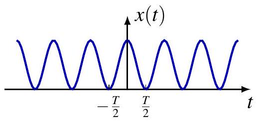

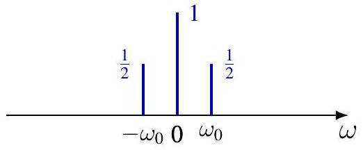
 
:::

::: {.column width="50%"}
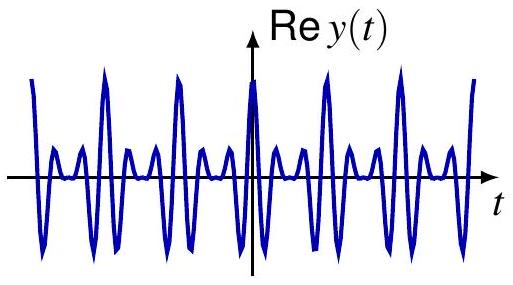

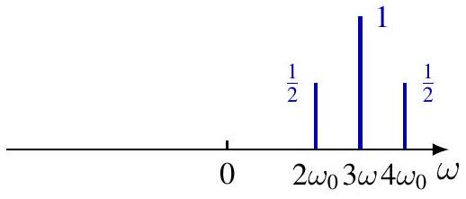

:::

::::

## 频移示例

例子：$x(t)=1+\cos \left(\omega_{0} t\right)=1+\frac{1}{2} e^{j \omega_{0} t}+\frac{1}{2} e^{-j \omega_{0} t}$

$$
\begin{aligned}
z(t)=\cos \left(3 \omega_{0} t\right) x(t)=\operatorname{Re} y(t) & =\frac{1}{2} e^{j 3 \omega_{0} t}+\frac{1}{4} e^{j 4 \omega_{0} t}+\frac{1}{4} e^{j 2 \omega_{0} t} \\
& +\frac{1}{2} e^{-j 3 \omega_{0} t}+\frac{1}{4} e^{-j 4 \omega_{0} t}+\frac{1}{4} e^{-j 2 \omega_{0} t}
\end{aligned}
$$

:::: {.columns style="text-align: center;"}

::: {.column width="50%"}
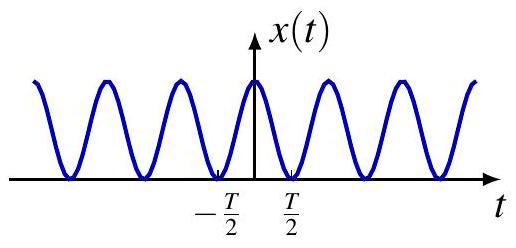

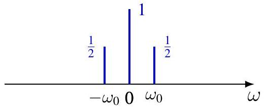 
:::

::: {.column width="50%"}
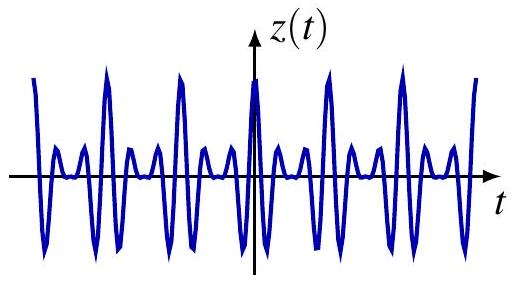

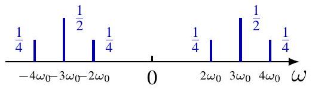

:::

::::

## 时间反转 (Time Reversal)

如果 $x$ 周期为 $T$，

$$
\widehat{R x}=R \hat{x} \quad \text { 或 } \quad x(-t) \stackrel{\mathcal{F S}}{\longleftrightarrow} \hat{x}[-k]
$$

时间反转与傅里叶级数可交换

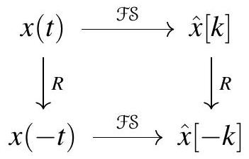{fig-align=center}

证明：

$$
(\widehat{R x})[k]=\left\langle R x, e^{j k \omega_{0} t}\right\rangle=\left\langle x, R e^{j k \omega_{0} t}\right\rangle=\left\langle x, e^{-j k \omega_{0} t}\right\rangle=\hat{x}[-k]
$$

推论：傅里叶级数保持奇/偶对称性，即
$x$ 偶 $\Longleftrightarrow \hat{x}$ 偶，$\quad x$ 奇 $\Longleftrightarrow \hat{x}$ 奇

## 时间缩放 (Time Scaling)

如果 $x$ 周期为 $T$，那么 $S_{a} x$ 周期为 $T / a$

$$
\widehat{S_{a} x}=\hat{x} \quad \text { 或 } \quad x(a t) \stackrel{\mathcal{F S}}{\longleftrightarrow} \hat{x}[k]
$$

时间缩放保持傅里叶系数不变，但改变基频

:::: {.columns style="text-align: center;"}

::: {.column width="40%"}

\begin{aligned}
x(t) & =\sum_{k=-\infty}^{\infty} \hat{x}[k] e^{j k \omega_{0} t} \\
x(a t) & =\sum_{k=-\infty}^{\infty} \hat{x}[k] e^{j k\left(a \omega_{0}\right) t}
\end{aligned}

:::

::: {.column width="30%"}
 
{fig-align=left}

:::
::: {.column width="30%"}
:::

::::

## 时间缩放

$$
x(t)=\sum_{k=-\infty}^{\infty} \hat{x}[k] e^{j k \omega_{0} t}
$$

对比 $\quad x(a t)=\sum_{k=-\infty}^{\infty} \hat{x}[k] e^{j k\left(a \omega_{0}\right) t}$

:::: {.columns style="text-align: center;"}

::: {.column width="50%"}
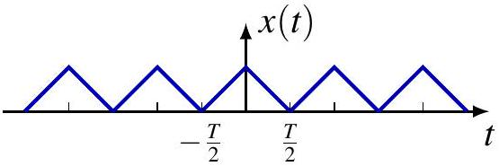

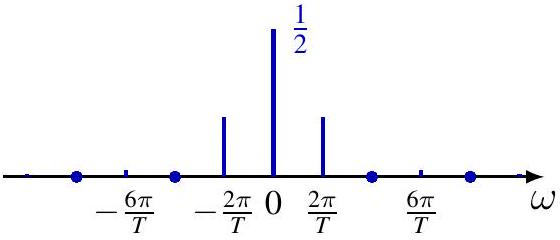
:::

::: {.column width="50%"}
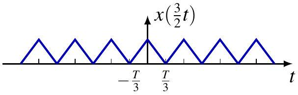

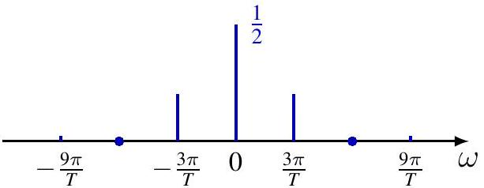 

:::

::::

时域压缩 ⟺ 频域（基频）扩展
时域扩展 ⟹ 频域（基频）压缩

## 微分 (Differentiation)

如果 $x$ 周期为 $T$，那么其导数 $x^{\prime}$ 也是，且

$$
\widehat{x^{\prime}}=M_{\omega_{0}} \hat{x} \quad \text { 或 } \quad x^{\prime}(t) \stackrel{\mathcal{F S}}{\longleftrightarrow} j k \omega_{0} \hat{x}[k]
$$

其中 $\left(M_{a} \hat{x}\right)[k]=j a k \hat{x}[k]$
**时域微分 ⟹ 频域乘以 $j k \omega_{0}$**

证明：

$$
\begin{aligned}
\widehat{x^{\prime}}[k] & =\frac{1}{T} \int_{T} x^{\prime}(t) e^{-j k \omega_{0} t} d t \\
& =\left.\frac{1}{T}\left[x(t) e^{-j k \omega_{0} t}\right]\right|_{0} ^{T}+j k \omega_{0}\left(\frac{1}{T} \int_{T} x(t) e^{-j k \omega_{0} t} d t\right)=j k \omega_{0} \hat{x}[k]
\end{aligned}
$$

或者，逐项求导：

$$
x(t)=\sum_{k} \hat{x}[k] e^{j k \omega_{0} t} \Longrightarrow x^{\prime}(t)=\sum_{k} j k \omega_{0} \hat{x}[k] e^{-j k \omega_{0} t}
$$

## 积分 (Integration)

如果 $x$ 周期为 $T$ 且有傅里叶级数

$$
x(t)=\sum_{k=-\infty}^{\infty} \hat{x}[k] e^{j k \omega_{0} t}
$$

逐项积分：

$$
\begin{aligned}
y(t) \triangleq \int_{0}^{t} x(s) d s & =\hat{x}[0] t+\sum_{k \neq 0} \hat{x}[k] \frac{e^{j k \omega_{0} t}-1}{j k \omega_{0}} \\
& =\hat{x}[0] t-\sum_{k \neq 0} \frac{\hat{x}[k]}{j k \omega_{0}}+\sum_{k \neq 0} \frac{1}{j k \omega_{0}} \hat{x}[k] e^{j k \omega_{0} t}
\end{aligned}
$$

- $y$ 是周期的，当且仅当 $\hat{x}[0]=0$，即 $x$ 没有直流分量
- 如果 $\hat{x}[0]=0, y$ 周期为 $T$，

$$
\hat{y}[k]=\frac{1}{j k \omega_{0}} \hat{x}[k] \quad \text { 对于 } k \neq 0
$$

## 例子：三角波

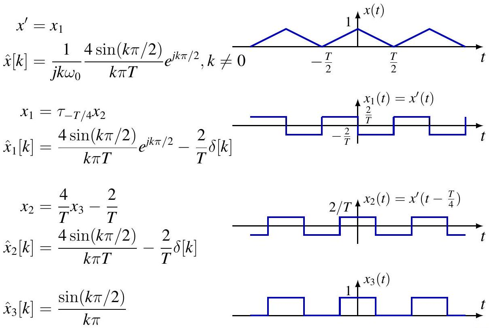

## 乘法 (Multiplication)

如果 $x$ 和 $y$ 具有相同的周期 $T$，那么它们的乘积 $x y$ 也是，且

$$
\begin{gathered}
\widehat{x y}=\hat{x} * \hat{y} \quad \text { 或 } \quad x(t) y(t) \stackrel{\mathcal{F S}}{\longleftrightarrow} \sum_{m=-\infty}^{\infty} \hat{x}[m] \hat{y}[k-m] \\
\text { 时域乘法 } \Longleftrightarrow \text { 频域卷积 }
\end{gathered}
$$

证明：

$$
\begin{aligned}
x(t) y(t) & =\left(\sum_{m=-\infty}^{\infty} \hat{x}[m] e^{j m \omega_{0} t}\right)\left(\sum_{\ell=-\infty}^{\infty} \hat{y}[\ell] e^{j \ell \omega_{0} t}\right) \\
& =\sum_{m=-\infty}^{\infty} \sum_{\ell=-\infty}^{\infty} \hat{x}[m] \hat{y}[\ell] e^{j(m+\ell) \omega_{0} t} \\
& =\sum_{k=-\infty}^{\infty}\left(\sum_{m=-\infty}^{\infty} \hat{x}[m] \hat{y}[k-m]\right) e^{j k \omega_{0} t} \quad(k=m+\ell)
\end{aligned}
$$

## 周期卷积 (Periodic Convolution)

具有相同周期 $T$ 的 $x$ 和 $y$ 的周期卷积 $x * y$ 定义为：

$$
(x * y)(t)=\int_{T} x(\tau) y(t-\tau) d \tau
$$

性质：

- 交换律

$$
x * y=y * x
$$

- 结合律

$$
(x * y) * z=x *(y * z)
$$

- 双线性

$$
\left(\sum_{i} a_{i} x_{i}\right) *\left(\sum_{j} b_{j} y_{j}\right)=\sum_{i, j} a_{i} b_{j}\left(x_{i} * y_{j}\right)
$$

## 周期卷积性质

傅里叶系数满足

$$
\widehat{x * y}=T \hat{x} \hat{y} \quad \text { 或 } \quad(x * y)(t) \stackrel{\mathcal{F S}}{\longleftrightarrow} T \hat{x}[k] \hat{y}[k]
$$

**时域卷积 ⟹ 频域乘法**

证明：

$$
\begin{aligned}
(\widehat{x * y})[k] & =\frac{1}{T} \int_{T}(x * y)(t) e^{-j k \omega_{0} t} d t \\
& =\frac{1}{T} \int_{T}\left(\int_{T} x(\tau) y(t-\tau) d \tau\right) e^{-j k \omega_{0} t} d t \\
& =\int_{T} x(\tau)\left(\frac{1}{T} \int_{T} y(t-\tau) e^{-j k \omega_{0} t} d t\right) d \tau \\
& =\int_{T} x(\tau)\left(e^{-j k \omega_{0} \tau} \hat{y}[k]\right) d \tau=T \hat{x}[k] \hat{y}[k]
\end{aligned}
$$

## 共轭与对称 (Conjugation and Symmetry)

如果 $x$ 周期为 $T$，那么其复共轭 $\bar{x}=x^{*}$ 也是，且

$$
\widehat{x^{*}}=R \hat{x}^{*} \quad \text { 或 } \quad x^{*}(t) \stackrel{\mathcal{F S}}{\longleftrightarrow}(\hat{x}[-k])^{*}
$$

证明：

$$
\widehat{x^{*}}[k]=\left\langle x^{*}, e^{j k \omega_{0} t}\right\rangle=\overline{\left\langle x, e^{-j k \omega_{0} t}\right\rangle}=\overline{\hat{x}[-k]}
$$

推论：如果 $x$ 是实信号，则 $\hat{x}$ 是共轭对称的，即

$$
\hat{x}[-k]=\overline{\hat{x}[k]}
$$

推论：如果 $x$ 是实偶信号，则 $\hat{x}$ 也是实偶信号

$$
\hat{x}[k]=\hat{x}[-k]=\overline{\hat{x}[k]}
$$

推论：如果 $x$ 是实奇信号，则 $\hat{x}$ 是纯虚奇信号

$$
-\hat{x}[k]=\hat{x}[-k]=\overline{\hat{x}[k]}
$$

## 周期冲激列

$$
x(t)=\sum_{k=-\infty}^{\infty} \delta(t-k T)
$$

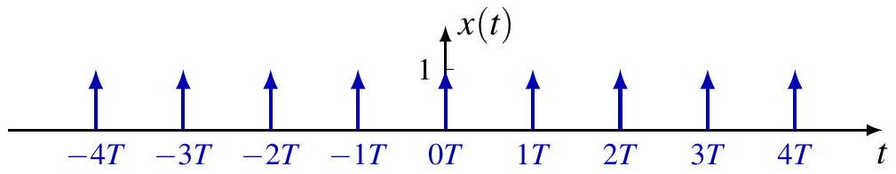

对于“足够好”的函数，例如$\phi$,具有紧支撑的无限可微函数：

$$
\begin{gathered}
(\phi * x)(t)=\sum_{k=-\infty}^{\infty} \phi(t-k T) \\
\int_{\mathbb{R}} \phi(t) x(t) d t=\sum_{k=-\infty}^{\infty} \int_{\mathbb{R}} \phi(t) \delta(t-k T) d t=\sum_{k=-\infty}^{\infty} \phi(k T)
\end{gathered}
$$

## 周期冲激列

$$
x(t)=\sum_{k=-\infty}^{\infty} \delta(t-k T)
$$

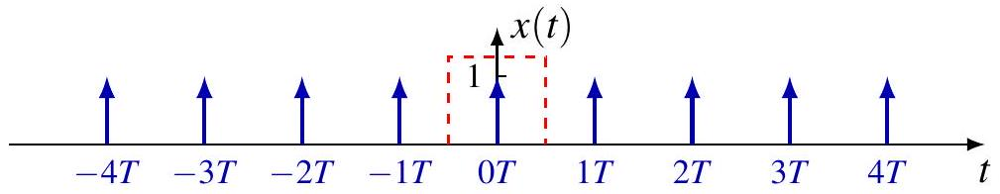{fig-align=center}

傅里叶系数：

$$
\hat{x}[k]=\frac{1}{T} \int_{-T / 2}^{T / 2} \delta(t) e^{-j k \frac{2 \pi}{T} t} d t=\frac{1}{T}
$$

傅里叶级数：

$$
x(t)=\sum_{k=-\infty}^{\infty} \frac{1}{T} e^{j k \frac{2 \pi}{T} t}=\lim _{N \rightarrow \infty} \frac{1}{T} D_{N}\left(\frac{2 \pi}{T} t\right)
$$

其中 $D_{N}$ 是狄利克雷核。

## 周期冲激列

$$
x(t)=\sum_{k=-\infty}^{\infty} \delta(t-k T)=\sum_{k=-\infty}^{\infty} \frac{1}{T} e^{j k \frac{2 \pi}{T} t}
$$

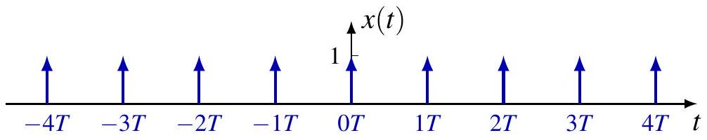{fig-align=center}

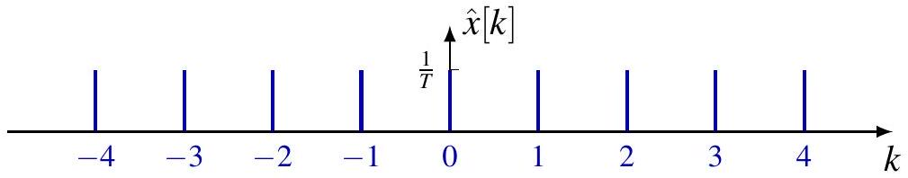{fig-align=center}

## 周期冲激列

$$
\begin{aligned}
\int_{\mathbb{R}} \phi(t) x(t) d t & =\lim _{N \rightarrow \infty} \frac{1}{T} \int_{\mathbb{R}} \phi(t) D_{N}\left(-\frac{2 \pi}{T} t\right) d t \quad\left(D_{N} \text { is even }\right) \\
& =\lim _{N \rightarrow \infty} \frac{1}{2 \pi} \int_{\mathbb{R}} \phi\left(-\frac{T}{2 \pi} t\right) D_{N}(t) d t \\
& =\lim _{N \rightarrow \infty} \sum_{k=-\infty}^{\infty} \frac{1}{2 \pi} \int_{(2 k-1) \pi}^{(2 k+1) \pi} \phi\left(-\frac{T}{2 \pi} t\right) D_{N}(t) d t \\
& =\sum_{k=-\infty}^{\infty} \lim _{N \rightarrow \infty} \frac{1}{2 \pi} \int_{-\pi}^{\pi} \phi\left(\frac{T}{2 \pi}(2 \pi k-t)\right) D_{N}(t-2 k \pi) d t \\
& \left.=\sum_{k=-\infty}^{\infty} \lim _{N \rightarrow \infty} \frac{1}{2 \pi} \int_{-\pi}^{\pi} \phi\left(\frac{T}{2 \pi}(2 \pi k-t)\right)_{\left(D_{N}\right.} \text { is } 2 \pi \text {-periodic }\right) \\
& =\sum_{k=-\infty}^{\infty} \lim _{N \rightarrow \infty} S_{N}(\phi)(k T)=\sum_{k=-\infty}^{\infty} \phi(k T)
\end{aligned}
$$

## 与周期方波的关系

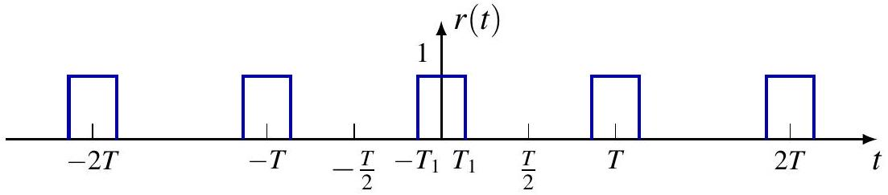{fig-align=center}

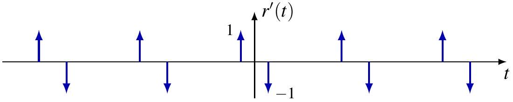{fig-align=center}

$$
\begin{aligned}
r^{\prime}(t) & =x\left(t+T_{1}\right)-x\left(t-T_{1}\right) \\
\widehat{r^{\prime}}[k] & =\left(e^{j k \omega_{0} T_{1}}-e^{-j k \omega_{0} T_{1}}\right) \hat{x}[k]=\frac{2 j \sin \left(k \omega_{0} T_{1}\right)}{T} \\
\hat{r}[k] & =\frac{1}{j k \omega_{0}} \widehat{r^{\prime}}[k]=\frac{\sin \left(k \omega_{0} T_{1}\right)}{k \pi}, \quad k \neq 0
\end{aligned}
$$

## 目录 {#toc4}

- [1. 线性时不变系统对复指数信号的响应](#sec31)
- [2. 连续时间周期信号的傅里叶级数表示](#sec32)
- [3. 连续时间傅里叶级数的收敛](#sec33)
- [4. 连续时间傅里叶级数的性质](#sec34)
- [**5. 离散时间周期信号的傅里叶级数表示**](#35)
- [6. 离散时间傅里叶级数的性质](#sec36)
- [7. 傅里叶级数与线性时不变系统](#sec37)
- [8. 滤波](#sec38)
  - [频率成形滤波器](#sec381)
  - [频率选择性滤波器](#sec382)
  - [用微分方程描述的连续时间滤波器](#sec383)
  - [用差分方程描述的离散时间滤波器](#sec383)

# 5. 离散时间周期信号的傅里叶级数表示{#sec35}

## DT 周期信号

回顾：DT 信号是周期的，周期为 $N$，如果

$$
x=\tau_{N} x \quad \text { 或 } \quad x[n]=x[n+N], \forall n \in \mathbb{Z}
$$

- 基波周期 $N$：最小的正周期
- 基频 $\begin{cases}\frac{2 \pi}{N}, & \text { 如果 } N>1 \\ 0, & \text { 如果 } N=1\end{cases}$

复指数信号 $\phi_{N}^{k}[n]=e^{j k \frac{2 \pi}{N} n}=e^{j k \omega_{0} n}$ 是周期的，具有：

- 周期 $N$ 和基波周期 $\frac{N}{\operatorname{gcd}(N, k)}$
- 基频 $\omega_{k}= \begin{cases}0, & \text { 如果 } N \mid k \\ \omega_{0} \cdot \operatorname{gcd}(k, N), & \text { 其他 }\end{cases}$，总是 $\omega_{0}=\frac{2 \pi}{N}$ 的整数倍

## DT 傅里叶基的有限性

傅里叶级数用谐波相关的复指数 $\phi_{N}^{k}$ 表示 $N$-周期信号

$$
x=\sum_{k} c_{k} \phi_{N}^{k}, \quad \text { 或 } \quad x[n]=\sum_{k} c_{k} \phi_{N}^{k}[n]=\sum_{k} c_{k} e^{j k \frac{2 \pi}{N} n}
$$

与 CT 情况的关键区别：$\phi_{N}^{k+r N}=\phi_{N}^{k}$，所以只有 $N$ 个不同的 $\phi_{N}^{k}$，傅里叶基是有限的，即

$$
\left\{\phi_{N}^{k}: k \in \mathbb{Z}\right\}=\left\{\phi_{N}^{k}: k \in[N]\right\}
$$

其中 $[N]=\{0,1, \ldots, N-1\}$（可以理解为 $[N]=\{\overline{0}, \overline{1}, \ldots, \overline{N-1}\}$）。

证明：对于 $r \in \mathbb{Z}$，
$$
\phi_{N}^{k+r N}[n]=e^{j(k+r N) \frac{2 \pi}{N} n}=e^{j k \frac{2 \pi}{N} n} e^{j r 2 \pi n}=e^{j k \frac{2 \pi}{N} n}=\phi_{N}^{k}[n]
$$

## DT 傅里叶基的有限性 (图示)

$\phi_{N}^{k}$ 示例， $N=4$ 和 $k=0,1, \ldots, 8$

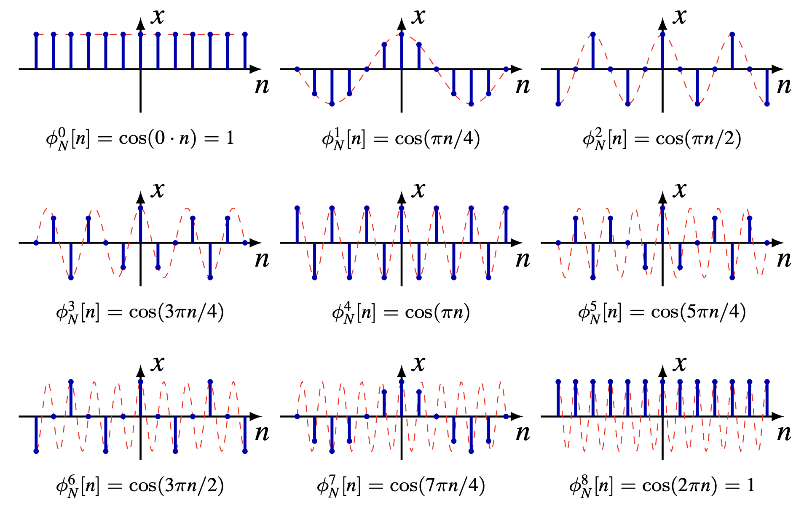{fig-align=center}

## 谐波的正交归一性

DT 傅里叶级数

$$
x=\sum_{k \in[N]} \hat{x}[k] \phi_{N}^{k}, \quad \text { 或 } \quad x[n]=\sum_{k \in[N]} \hat{x}[k] e^{j k \frac{2 \pi}{N} n}
$$

求和可以在任意 $N$ 个连续整数上进行。
定义两个周期为 $N$ 的信号的内积为

$$
\langle x, y\rangle=\frac{1}{N} \sum_{n \in[N]} x[n] \overline{y[n]}
$$

这与 $\mathbb{C}^{N}$ 中的内积相同（差一个因子 $N^{-1}$）。
$\left\{\phi_{N}^{k}: k \in[N]\right\}$ 是正交归一函数系

$$
\left\langle\phi_{N}^{k}, \phi_{N}^{m}\right\rangle=\delta_{k m}=\delta[k-m]
$$

## 谐波正交归一性的证明

$$
\left\langle\phi_{N}^{k}, \phi_{N}^{m}\right\rangle=\frac{1}{N} \sum_{n \in[N]} e^{j k \frac{2 \pi}{N} n} e^{-j m \frac{2 \pi}{N} n}=\frac{1}{N} \sum_{n=0}^{N-1} e^{j(k-m) \frac{2 \pi}{N} n}
$$

如果 $k=m$，

$$
\left\langle\phi_{N}^{k}, \phi_{N}^{m}\right\rangle=\frac{1}{N} \sum_{k=0}^{N-1} 1=1
$$

如果 $k \neq m$，由于 $|k-m| \leq N-1, e^{j(k-m) \frac{2 \pi}{N}} \neq 1$。利用等比数列求和公式：

$$
\left\langle\phi_{N}^{k}, \phi_{N}^{m}\right\rangle=\frac{1}{N} \sum_{n=0}^{N-1} e^{j(k-m) \frac{2 \pi}{N} n}=\frac{1}{N} \frac{1-e^{j(k-m) \frac{2 \pi}{N} N}}{1-e^{j(k-m) \frac{2 \pi}{N}}}=0
$$

## 傅里叶系数

假设 $x$ 周期为 $N$，利用正交性求解系数：

$$
\begin{aligned}
\left\langle x, \phi_{N}^{m}\right\rangle & =\left\langle\sum_{k \in[N]} \hat{x}[k] \phi_{N}^{k}, \phi_{N}^{m}\right\rangle=\sum_{k \in[N]} \hat{x}[k]\left\langle\phi_{N}^{k}, \phi_{N}^{m}\right\rangle \\
& =\sum_{k \in[N]} \hat{x}[k] \delta[m-k]=\hat{x}[m]
\end{aligned}
$$

可以将 $\hat{x}$ 视为 $N$-周期信号，因为：

$$
\hat{x}[m+r N] \triangleq\left\langle x, \phi_{N}^{m+r N}\right\rangle=\left\langle x, \phi_{N}^{m}\right\rangle=\hat{x}[m]
$$

但在傅里叶级数中只使用 $N$ 个连续的值！

## DT 傅里叶级数公式

**综合方程 (Synthesis equation)**

$$
x[n]=\sum_{k \in[N]} \hat{x}[k] \phi_{N}^{k}[n]=\sum_{k \in[N]} \hat{x}[k] e^{j k \frac{2 \pi}{N} n}
$$

**分析方程 (Analysis equation)**

$$
\hat{x}[k]=\left\langle x, \phi_{N}^{k}\right\rangle=\frac{1}{N} \sum_{n \in[N]} x[n] e^{-j k \frac{2 \pi}{N} n}
$$

由于所有求和都是有限的，不存在收敛问题！

## 例子

$x[n]=\cos \left(\frac{6 \pi}{5} n+\frac{\pi}{5}\right)$，周期 $N=5$。
展开为复指数：
$x[n]=\frac{e^{j \frac{\pi}{5}}}{2} e^{j 3 \frac{2 \pi}{5} n}+\frac{e^{-j \frac{\pi}{5}}}{2} e^{-j 3 \frac{2 \pi}{5} n}$

系数：
$\hat{x}[3]=\frac{1}{2} e^{j \frac{\pi}{5}} ; \quad \hat{x}[2]=\hat{x}[-3]=\frac{1}{2} e^{-j \frac{\pi}{5}} ; \quad \hat{x}[0]=\hat{x}[1]=\hat{x}[4]=0$

$\hat{x}[k]$ 以 $N=5$ 为周期重复。

:::: {.columns style="text-align: center;"}

::: {.column width="10%"}
$$x[n]$$

 
 
 
 

$$|\hat{x}[n]|$$

$$Arg\hat{x}[n]$$
 
:::

::: {.column width="90%"}
 
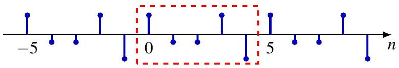{fig-align=center}

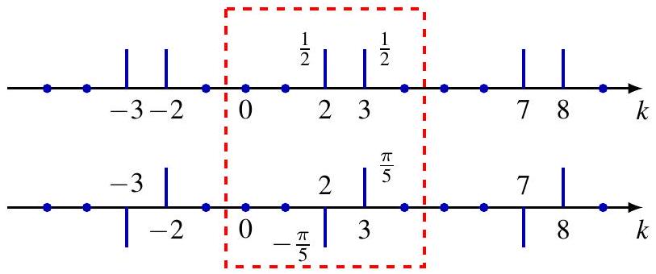{fig-align=center}

:::

::::

## 例子：周期方波 (Periodic Square Wave)

周期为 $N$ 的方波，在一个周期内：

$$
x[n]= \begin{cases}1, & -N_{1} \leq n \leq N_{1} \\ 0, & N_{1}<n<N-N_{1}\end{cases}
$$

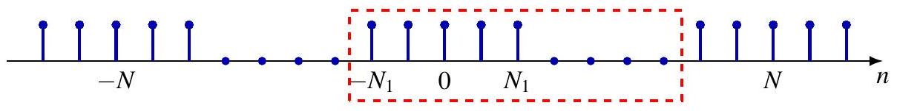

傅里叶系数：

$$
\hat{x}[k]=\frac{1}{N} \sum_{n=-N_{1}}^{N_{1}} e^{-j k \frac{2 \pi}{N} n}
$$

如果 $k$ 是 $N$ 的整数倍, $\hat{x}[k]=\frac{2 N_{1}+1}{N}$

## 例子：周期方波 (续)

如果 $k$ 不是 $N$ 的整数倍，则 $e^{-j k \frac{2 \pi}{N}} \neq 1$。使用等比数列求和：

$$
\begin{aligned}
\hat{x}[k] & =\frac{1}{N} \frac{e^{j k \frac{2 \pi}{N} N_{1}}-e^{-j k \frac{2 \pi}{N}\left(N_{1}+1\right)}}{1-e^{-j k \frac{2 \pi}{N}}} \\
& =\frac{1}{N} \frac{\sin \left(k \frac{2 \pi}{N}\left(N_{1}+\frac{1}{2}\right)\right)}{\sin \left(k \frac{\pi}{N}\right)}
\end{aligned}
$$

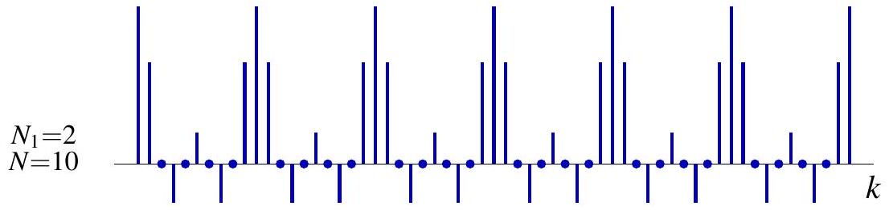

## DT 傅里叶级数：矩阵形式

综合方程可以写成矩阵乘法：

$$
x[n]=\sum_{k=0}^{N-1} W_{N}^{k n} \hat{x}[k], \quad \text { 其中 } W_{N}=e^{j k \frac{2 \pi}{N}}
$$

$$
x=\mathbf{F} \hat{x}, \quad \text { 其中 } \mathbf{F}=\left(\phi_{N}^{0}, \phi_{N}^{1}, \ldots, \phi_{N}^{N-1}\right)
$$

分析方程：

$$
\hat{x}=\mathbf{F}^{-1} x=\frac{1}{N} \mathbf{F}^{H} x
$$

其中 $\mathbf{F}^{H}=(\overline{\mathbf{F}})^{T}$ 是 $\mathbf{F}$ 的共轭转置 (Hermitian transpose)。

## 目录 {#toc5}

- [**1. 线性时不变系统对复指数信号的响应**](#sec31)
- [2. 连续时间周期信号的傅里叶级数表示](#sec32)
- [3. 连续时间傅里叶级数的收敛](#sec33)
- [4. 连续时间傅里叶级数的性质](#sec34)
- [5. 离散时间周期信号的傅里叶级数表示](#35)
- [**6. 离散时间傅里叶级数的性质**](#sec36)
- [7. 傅里叶级数与线性时不变系统](#sec37)
- [8. 滤波](#sec38)
  - [频率成形滤波器](#sec381)
  - [频率选择性滤波器](#sec382)
  - [用微分方程描述的连续时间滤波器](#sec383)
  - [用差分方程描述的离散时间滤波器](#sec383)

# 6. 离散时间傅里叶级数的性质{#sec36}

## DT 傅里叶级数 (DT Fourier Series)

周期为 $N$ 的信号 $x$ 的 DTFS：

$$
x[n]=\sum_{k \in[N]} \hat{x}[k] e^{j k \omega_{0} n}, \quad \omega_{0}=\frac{2 \pi}{N}
$$

对应关系：

$$
x \stackrel{\text { DTFS }}{\longleftrightarrow} \hat{x} \quad \text { 或 } \quad x[n] \stackrel{\text { DTFS }}{\longleftrightarrow} \hat{x}[k]
$$

同一信号的两种等价表示：
- 时域：$x[n]$
- 频域：$\hat{x}[k]$

## 线性、时移与频移

**线性 (Linearity)**
$$
\widehat{a x+b y}=a \hat{x}+b \hat{y}
$$

**时移 (Time shifting)**
$$
x\left[n-n_{0}\right] \stackrel{\text { DTFS }}{\longleftrightarrow} e^{-j k \omega_{0} n_{0}} \hat{x}[k]
$$

**频移 (Frequency shifting)**
$$
e^{j m \omega_{0} n} x[n] \stackrel{\text { DTFS }}{\longleftrightarrow} \hat{x}[k-m]
$$

## 其它性质

**时间反转 (Time reversal)**
$$
x[-n] \stackrel{\text { DTFS }}{\longleftrightarrow} \hat{x}[-k]
$$

**共轭 (Conjugation)**
$$
x^{*}[n] \stackrel{\text { DTFS }}{\longleftrightarrow}(\hat{x}[-k])^{*}
$$

**对称性 (Symmetry)**
- $x$ 实 $\Longleftrightarrow \hat{x}[-k]=\overline{\hat{x}[k]}$ (共轭对称)
- $x$ 实偶 $\Longleftrightarrow \hat{x}$ 实偶

## 时间缩放 (Time Scaling)

定义上采样信号 $x_{(m)}$：

$$
x_{(m)}[n]= \begin{cases}x[n / m], & \text { 如果 } n \text { 是 } m \text { 的倍数 } \\ 0, & \text { 其他 }\end{cases}
$$

如果 $x$ 周期为 $N$，则 $x_{(m)}$ 周期为 $m N$，且：

$$
\widehat{x_{(m)}}=\frac{1}{m} \hat{x} \quad \text { 或 } \quad x_{(m)}[n] \stackrel{\text { DTFS }}{\longleftrightarrow} \frac{1}{m} \hat{x}[k]
$$

## 一阶差分与累加求和

**一阶（后向）差分** (First difference)
$$
x[n]-x[n-1] \stackrel{\text { DTFS }}{\longleftrightarrow}\left(1-e^{-j k \frac{2 \pi}{N}}\right) \hat{x}[k]
$$

**累加求和** (Running sum)
$$
y[n]=\sum_{m=n_{0}}^{n} x[m]
$$
- $y$ 是周期的当且仅当 $\hat{x}[0]=0$（无直流分量）
- 如果 $\hat{x}[0]=0$，
$$
\hat{y}[k]=\frac{1}{1-e^{-j k \frac{2 \pi}{N}}} \hat{x}[k] \quad \text { 对于 } k \neq 0
$$

## 乘法 (Multiplication)

时域乘法 $\Longleftrightarrow$ 频域周期卷积

$$
x[n] y[n] \stackrel{\text { DTFS }}{\longleftrightarrow} \sum_{m \in[N]} \hat{x}[m] \hat{y}[k-m]
$$

## 周期卷积 (Periodic Convolution)

相同周期 $N$ 的 $x$ 和 $y$ 的周期卷积：

$$
(x * y)[n]=\sum_{m \in[N]} x[m] y[n-m]
$$

性质：
- 交换律、结合律、双线性

**时域卷积 $\Longrightarrow$ 频域乘法**

$$
(x * y)[n] \stackrel{\text { DTFS }}{\longleftrightarrow} N \hat{x}[k] \hat{y}[k]
$$

## 目录 {#toc6}

- [1. 线性时不变系统对复指数信号的响应](#sec31)
- [2. 连续时间周期信号的傅里叶级数表示](#sec32)
- [3. 连续时间傅里叶级数的收敛](#sec33)
- [4. 连续时间傅里叶级数的性质](#sec34)
- [5. 离散时间周期信号的傅里叶级数表示](#35)
- [6. 离散时间傅里叶级数的性质](#sec36)
- [**7. 傅里叶级数与线性时不变系统**](#sec37)
- [8. 滤波](#sec38)
  - [频率成形滤波器](#sec381)
  - [频率选择性滤波器](#sec382)
  - [用微分方程描述的连续时间滤波器](#sec383)
  - [用差分方程描述的离散时间滤波器](#sec383)

# 7. 傅里叶级数与线性时不变系统{#sec37}

## 目录 {#toc7}

- [1. 线性时不变系统对复指数信号的响应](#sec31)
- [2. 连续时间周期信号的傅里叶级数表示](#sec32)
- [3. 连续时间傅里叶级数的收敛](#sec33)
- [4. 连续时间傅里叶级数的性质](#sec34)
- [5. 离散时间周期信号的傅里叶级数表示](#35)
- [6. 离散时间傅里叶级数的性质](#sec36)
- [7. 傅里叶级数与线性时不变系统](#sec37)
- [**8. 滤波**](#sec38)
  - [频率成形滤波器](#sec381)
  - [频率选择性滤波器](#sec382)
  - [用微分方程描述的连续时间滤波器](#sec383)
  - [用差分方程描述的离散时间滤波器](#sec383)

# 8. 滤波{#sec38}

## 频率成形滤波器{#sec381}

## 频率响应

回顾连续时间（CT）线性时不变（LTI）系统对指数输入 $e^{st}$ 的响应：

$$T \left( \sum_{k} a_k e^{s_k t} \right) = \sum_{k} a_k H(s_k) e^{s_k t}$$

其中 $H(s)$ 是**系统函数**（System Function）：

$$H(s) = \int_{\mathbb{R}} h(t) e^{-st} dt$$

当限定 $s = j\omega$ 时，$H(j\omega)$ 作为 $\omega$ 的函数被称为系统的**频率响应**（Frequency Response）：

$$H(j\omega) = \int_{\mathbb{R}} h(t) e^{-j\omega t} dt$$

## 滤波

傅里叶级数表示下的周期输入 $x$：

$$x(t) = \sum_{k=-\infty}^{\infty} \hat{x}[k] e^{jk\omega_0 t}$$

具有频率响应 $H(j\omega)$ 的 LTI 系统的输出：

$$y(t) = T \left( \sum_{k=-\infty}^{\infty} \hat{x}[k] e^{jk\omega_0 t} \right) = \sum_{k=-\infty}^{\infty} H(j k \omega_0) \hat{x}[k] e^{j k \omega_0 t}$$

输出信号是周期性的且具有相同的周期，其傅里叶系数的关系为：

$$\hat{y}[k] = H(j k \omega_0) \hat{x}[k]$$

**滤波**会改变频率分量的相对幅度，或者完全消除某些频率分量。

## 滤波

:::: {.columns style="text-align: center;"}

::: {.column width="50%"}
**示例**：微分器 $T(x) = x'$ 的频率响应为：

$$H(j\omega) = j\omega$$

对于周期输入信号：

$$x(t) = \sum_{k=-\infty}^{\infty} \hat{x}[k] e^{jk\omega_0 t}$$

其输出信号为：

$$y(t) = \sum_{k=-\infty}^{\infty} jk\omega_0 \hat{x}[k] e^{jk\omega_0 t}$$

傅里叶系数的关系如下：

$$\hat{y}[k] = jk\omega_0 \hat{x}[k]$$
 
:::

::: {.column width="50%"}
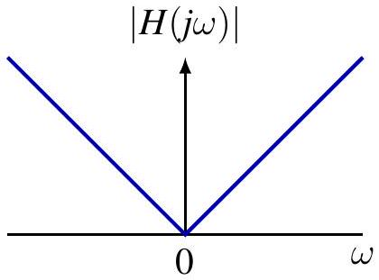

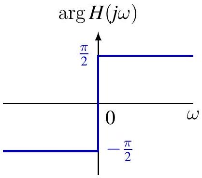

:::

::::

## 滤波

* **不能**产生新的频率分量。
* **只能**缩放现有分量的幅度或移动其相位。

**非线性滤波器示例：** 削波（Clipping） $y(t) = \max\{x(t), c\}$。  
*本课程重点关注 **LTI 滤波器**。*

### 频率整形滤波器 (Frequency-shaping filters)
这类滤波器会改变频谱的形状。

* **例如：均衡器 (Equalizer)**

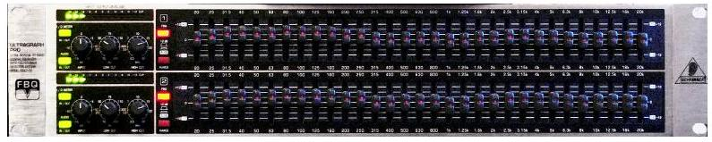{width=30%,fig-align=center}

### 频率选择性滤波器 (Frequency-selective filters)
这类滤波器使某些频率基本无失真地通过，并显著衰减或消除其他频率。

## 理想频率选择性滤波器

:::: {.columns style="text-align: center;"}

::: {.column width="33%"}
理想低通滤波器

$$
H(j \omega)= \begin{cases}1, & |\omega| \leq \omega_{c} \\ 0, & \text { 其他 }\end{cases}
$$

$\omega_{c}$ : 截止频率
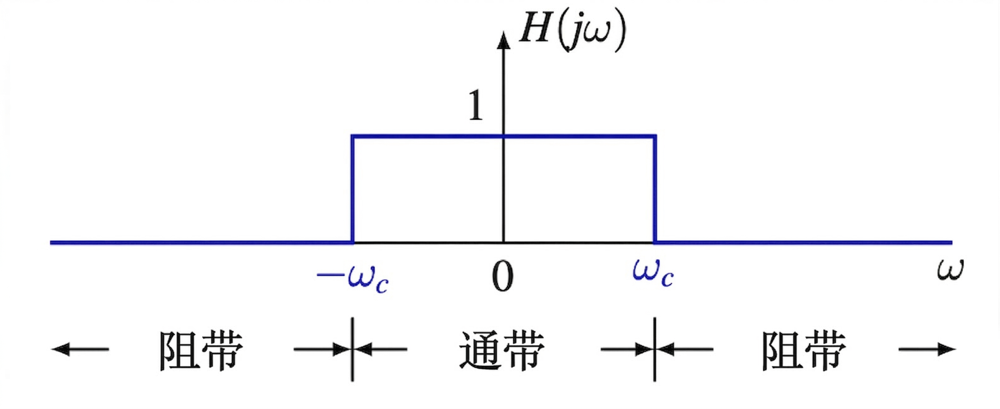
 
:::

::: {.column width="34%"}
理想高通滤波器

$$
H(j \omega)= \begin{cases}1, & |\omega| \geq \omega_{c} \\ 0, & \text { otherwise }\end{cases}
$$

$\omega_{c}$ : 截止频率
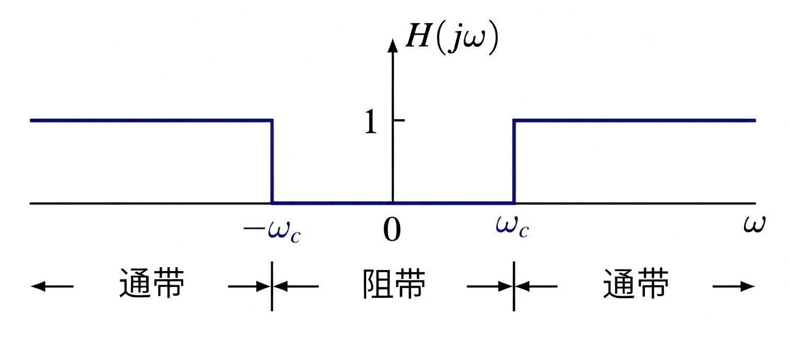
:::

::: {.column width="33%"}
理想带通滤波器

$$
H(j \omega)= \begin{cases}1, & \omega_{c 1} \leq|\omega| \leq \omega_{c 2} \\ 0, & \text { otherwise }\end{cases}
$$

$\omega_{c 1}$ : 下截止频率，
$\omega_{c 2}$ : 上截止频率
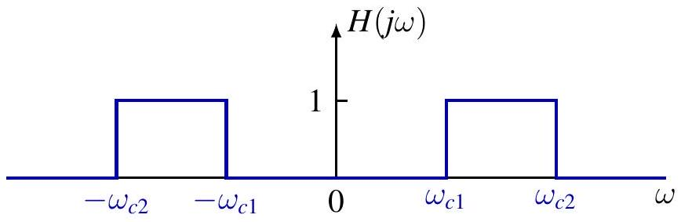
 
:::

::::

## 用微分方程描述的连续时间滤波器{#sec383}

### 简单 RC 低通滤波器

:::: {.columns style="text-align: center;"}

::: {.column width="50%"}
常微分方程 (ODE)

$$
R C \frac{d v_{C}(t)}{d t}+v_{C}(t)=v_{S}(t)
$$

对于输入 $v_{S}(t)=e^{j \omega t}$，输出为

$$
v_{C}(t)=H(j \omega) e^{j \omega t}
$$

频率响应 $H(j \omega)=\frac{1}{1+R C j \omega}$
 
:::

::: {.column width="50%"}
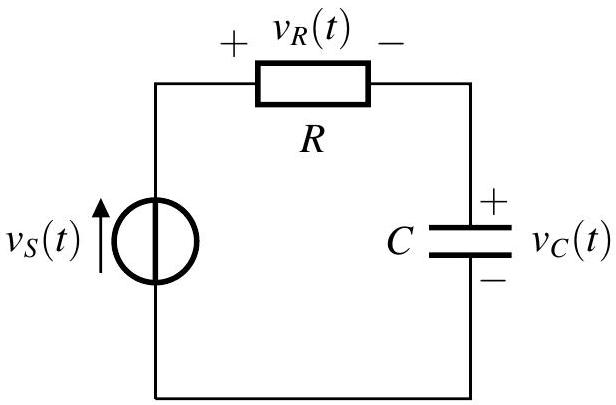

:::

::::

## 简单 RC 低通滤波器

:::: {.columns style="text-align: center;"}

::: {.column width="50%"}
频率响应

$$
H(j \omega)=\frac{1}{1+R C j \omega}
$$

$$
\begin{aligned}
|H(j \omega)| & =\frac{1}{\sqrt{1+(R C \omega)^{2}}} \\
\arg H(j \omega) & =-\arctan (R C \omega)
\end{aligned}
$$
 
 
非理想低通滤波器：通过低频，衰减高频。

$R C$ 越大 $\Longrightarrow$ 通过的低频范围越小。
:::

::: {.column width="50%"}

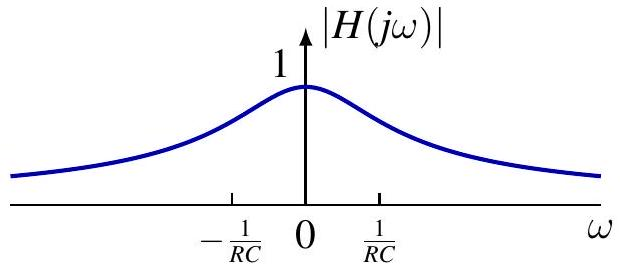

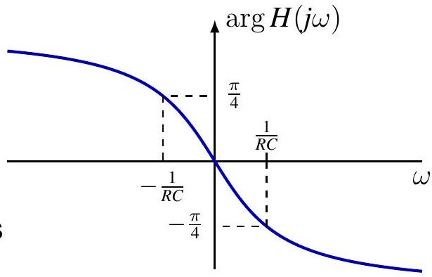

:::
::::

## 简单 RC 低通滤波器

:::: {.columns style="text-align: center;"}

::: {.column width="50%"}

冲激响应

$$
h(t)=\frac{1}{R C} e^{-t / R C} u(t)
$$

阶跃响应

$$
s(t)=(h * u)(t)=\left(1-e^{-t / R C}\right) u(t)
$$

时间常数 $\tau=R C$

- $\tau$ 越大，响应越迟缓 (sluggish)
:::

::: {.column width="50%"}

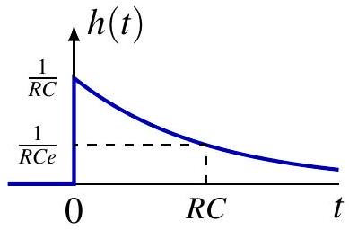

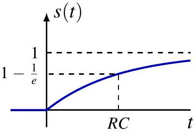
:::

::::

### 权衡 (Tradeoff)

- $\tau$ 越大：通过的高频越少，响应越迟缓
- $\tau$ 越小：通过的高频越多，响应越快

## 简单 RC 高通滤波器

:::: {.columns style="text-align: center;"}

::: {.column width="50%"}

ODE
$R C \frac{d v_{R}(t)}{d t}+v_{R}(t)=R C \frac{d v_{S}(t)}{d t}$

对于输入 $v_{S}(t)=e^{j \omega t}$，输出为

$$
v_{R}(t)=H(j \omega) e^{j \omega t}
$$

频率响应 $\quad H(j \omega)=\frac{j \omega R C}{1+j \omega R C}$

:::
::: {.column width="50%"}
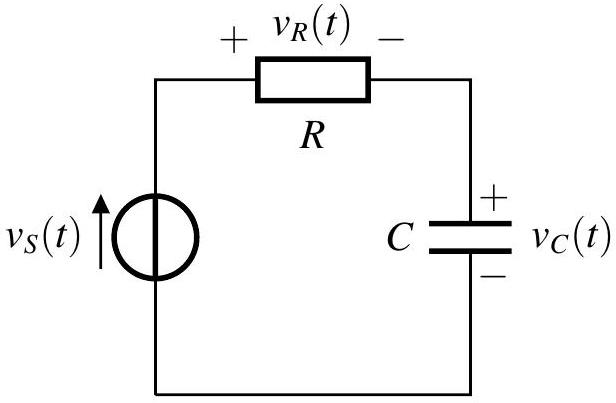
:::
::::

## 简单 RC 高通滤波器

:::: {.columns style="text-align: center;"}

::: {.column width="50%"}

频率响应

$$
H(j \omega)=\frac{j \omega R C}{1+j \omega R C}
$$

$$
|H(j \omega)|=\frac{|\omega| R C}{\sqrt{1+(R C \omega)^{2}}}
$$

$$
\arg H(j \omega)=\arctan \frac{1}{R C \omega}
$$

非理想高通滤波器：通过高频，衰减低频。

$R C$ 越大 $\Longrightarrow$ 通过的低频范围越大。
:::

::: {.column width="50%"}
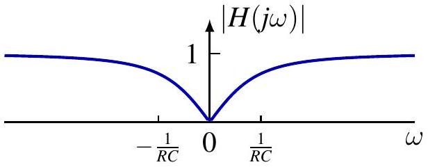

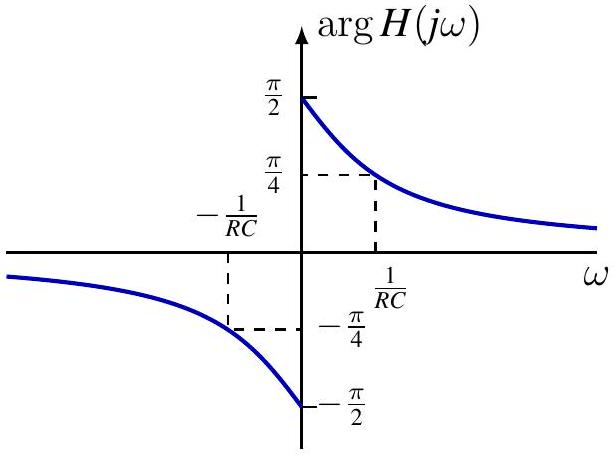
:::
::::

## 简单 RC 高通滤波器

:::: {.columns style="text-align: center;"}

::: {.column width="50%"}

阶跃响应

$$
s(t)=e^{-t / R C} u(t)
$$

 

冲激响应

$$
h(t)=s^{\prime}(t)=\delta(t)-\frac{1}{R C} e^{-t / R C} u(t)
$$

时间常数 $\tau=R C$

- $\tau$ 越大，响应越迟缓

:::

::: {.column width="50%"}

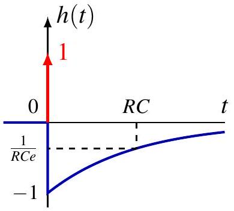

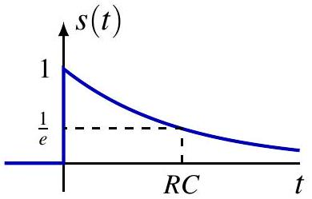
:::
::::
观察：
- $\tau$ 越大，通过的低频越多，响应越迟缓
- $\tau$ 越小，通过的低频越少，响应越快

## 用差分方程描述的连续时间滤波器{#sec384}

:::: {.columns style="text-align: center;"}

::: {.column width="50%"}

$N$-周期序列离散时间傅里叶级数（Discrete Time Fourier Series, DTFS）变换对

**分析公式**

$$
\hat{x}[k]=\frac{1}{N} \sum_{n \in[N]} x[n] e^{-j k \frac{2 \pi}{N} n}
$$

**综合公式**

$$
x[n]=\sum_{k \in[N]} \hat{x}[k] e^{j k \frac{2 \pi}{N} n}
$$

:::

::: {.column width="50%"}

有限长度$N$序列的离散傅里叶变换（Discrete Fourier Tranform, DFT）对(详细内容见第五章)

**DFT**

$$
X[k]=\sum_{n=0}^{N-1} x[n] e^{-j k \frac{2 \pi}{N} n}
$$

**逆 DFT**

$$
x[n]=\frac{1}{N} \sum_{k=0}^{N-1} X[k] e^{j k \frac{2 \pi}{N} n}
$$
:::
::::

这两组方程本质上是相同的，差别仅在于一个常数因子$\frac{1}{N}$; 都可以通过**快速傅里叶变换 (FFT)**实现高效计算

## 频率响应

回顾离散时间 (DT) 线性时不变量 (LTI) 系统对指数输入 $z^n$ 的响应：

$$T\left( \sum_{k} a_k z_k^n \right) = \sum_{k} a_k H(z_k) z_k^n$$

其中 $H(z)$ 是**系统函数**：

$$H(z) = \sum_{n=-\infty}^{\infty} h[n] z^{-n}$$

当限定 $z = e^{j\omega}$ 时，$H(e^{j\omega})$ 作为 $\omega$ 的函数被称为系统的**频率响应**：

$$H(e^{j\omega}) = \sum_{n=-\infty}^{\infty} h[n] e^{-j\omega n}$$

## 频率响应

周期输入 $x$ 的傅里叶级数表示：

$$x[n] = \sum_{k \in [N]} \hat{x}[k] e^{j k \omega_0 n}, \quad \text{其中 } \omega_0 = \frac{2\pi}{N}$$

频率响应为 $H(e^{j\omega})$ 的 LTI 系统的输出：

$$y[n] = T \left( \sum_{k \in [N]} \hat{x}[k] e^{j k \omega_0 n} \right) = \sum_{k \in [N]} H(e^{j k \omega_0}) \hat{x}[k] e^{j k \omega_0 n}$$

输出信号具有相同的周期，其傅里叶系数之间的关系为：

$$\hat{y}[k] = H(e^{j k \omega_0}) \hat{x}[k]$$

## 滤波

**滤波**会改变频率分量的相对幅度，或者完全消除某些频率分量。

### LTI 系统作为滤波器
在线性时不变量 (LTI) 系统中，正如连续时间 (CT) 情况一样，系统扮演着滤波器的角色。频率整形 (Frequency-shaping) 与频率选择性 (Frequency-selective) 滤波器的共同点在于：

* **无法创造**新的频率分量。
* **只能缩放**现有分量的幅度或偏移其相位。

### 非线性滤波器示例 (Examples of Nonlinear Filter)

非线性滤波器不遵循 LTI 系统的上述限制，可以产生新的频率分量。

* **极大值滤波器 (Max filter)**:
    $$y[n] = \max_{-n_1 \leq k \leq n_2} x[n + k]$$
* **中值滤波器 (Median filter)**:
    $$y[n] = \text{median} \{x[n - n_1], \dots, x[n + n_2]\}$$

### 离散时间 (DT) 信号的频率
回顾离散时间信号的特性：只需考虑长度为 $2\pi$ 的频率区间即可，例如 $[0, 2\pi)$ 或 $(-\pi, \pi]$。

## 离散时间信号中的高频与低频

高频分布在 $(2k + 1)\pi$ 附近，低频分布在 $2k\pi$ 附近。

:::: {.columns style="text-align: center;"}

::: {.column width="33%"}

$\phi_{N}^{0}[n]=\cos (0 \cdot n)=1$

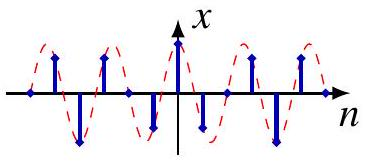

$\phi_{N}^{3}[n]=\cos (3 \pi n / 4)$

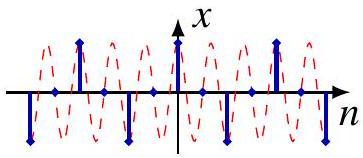

$\phi_{N}^{6}[n]=\cos (3 \pi n / 2)$
:::

::: {.column width="34%"}

$\phi_{N}^{1}[n]=\cos (\pi n / 4)$

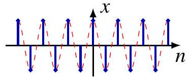

$\phi_{N}^{4}[n]=\cos (\pi n)$

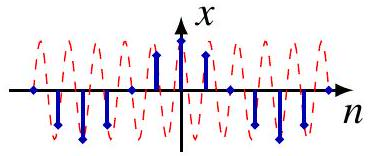

$\phi_{N}^{7}[n]=\cos (7 \pi n / 4)$
:::

::: {.column width="33%"}
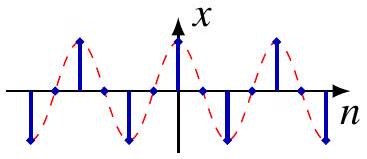

$\phi_{N}^{2}[n]=\cos (\pi n / 2)$

$\phi_{N}^{5}[n]=\cos (5 \pi n / 4)$

$\phi_{N}^{8}[n]=\cos (2 \pi n)=1$
:::

::::

## 离散时间频率

$N$ 周期信号的离散频率特性：

* **单位圆上的等间隔点**：频率分量均匀分布在复平面的单位圆上。
* **低频靠近 $1$，高频靠近 $-1$**：
    * 当 $z = e^{j\omega} \approx 1$（即 $\omega \approx 2k\pi$）时，对应低频。
    * 当 $z = e^{j\omega} \approx -1$（即 $\omega \approx (2k+1)\pi$）时，对应高频。

 

:::: {.columns style="text-align: center;"}

::: {.column width="50%"}

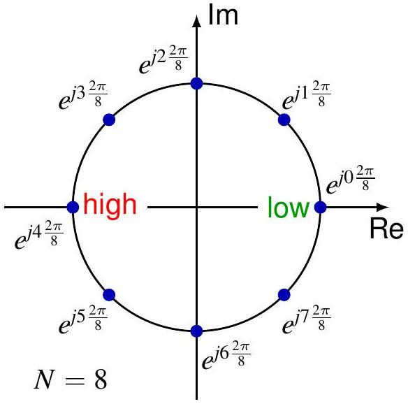{width=60%}

:::
::: {.column width="50%"}

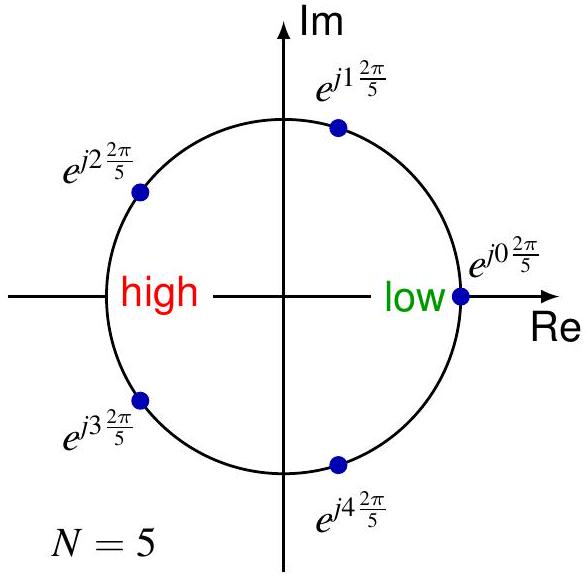{width=60%}

:::
::::

## 理想频率选择性滤波器

理想低通滤波器

$$
H\left(e^{j \omega}\right)= \begin{cases}1, & |\omega| \leq \omega_{c} \\ 0, & \omega_{c}<|\omega| \leq \pi\end{cases}
$$

$\omega_{c}$ : 截止频率

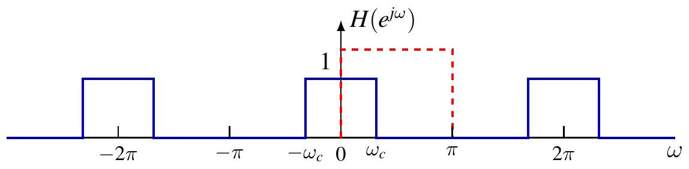

## 理想频率选择性滤波器

理想高通滤波器

$$
H\left(e^{j \omega}\right)= \begin{cases}1, & \omega_{c} \leq|\omega| \leq \pi \\ 0, & |\omega|<\left|\omega_{c}\right|\end{cases}
$$

$\omega_{c}$ : 截止频率

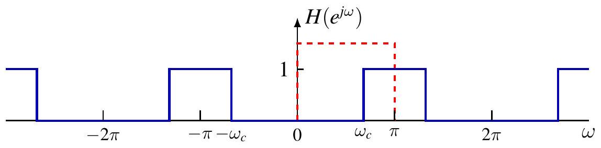

## 理想频率选择性滤波器

理想带通滤波器

$$
H\left(e^{j \omega}\right)= \begin{cases}1, & \omega_{c 1} \leq|\omega| \leq \omega_{c 2} \\ 0, & |\omega|<\omega_{c 1} \text { or } \omega_{c 2}<|\omega| \leq \pi\end{cases}
$$

$\omega_{c 1}$ : 下截止频率，
$\omega_{c 2}$ : 上截止频率

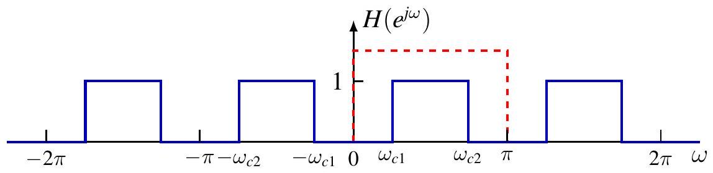

## 一阶递归离散时间滤波器

$$
y[n]-a y[n-1]=x[n]
$$

对于输入信号 $x[n]=e^{j \omega n}$，系统的输出为 $y[n]=H\left(e^{j \omega}\right) e^{j \omega n}$。

当 $|a|<1$ 时，**频率响应**（Frequency response）有明确定义：

$$
H\left(e^{j \omega}\right)=\frac{1}{1-a e^{-j \omega}}, \quad|a|<1
$$

若将系数 $a$ 表示为极坐标形式 $a=|a| e^{j \phi}$，则：

**幅度响应 (Magnitude Response):**
$$
\left|H\left(e^{j \omega}\right)\right|=\frac{1}{\sqrt{1+|a|^{2}-2|a| \cos (\omega-\phi)}}
$$

**相位响应 (Phase Response):**
$$
\arg H\left(e^{j \omega}\right)=\arctan \frac{-|a| \sin (\omega-\phi)}{1-|a| \cos (\omega-\phi)}
$$

## 一阶递归离散时间滤波器

:::: {.columns style="text-align: center;"}

::: {.column width="50%"}

对于 $a>0$, 低通滤波器 (指数平滑)
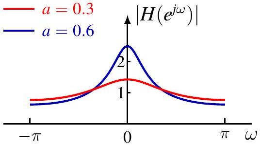

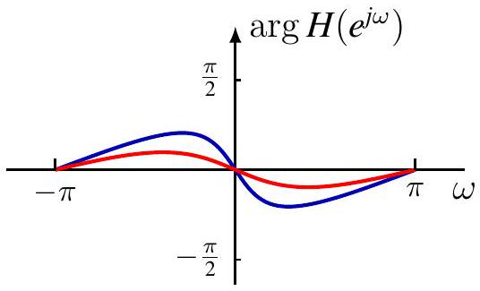
:::
::: {.column width="50%"}

对于 $a<0$, 高通滤波器

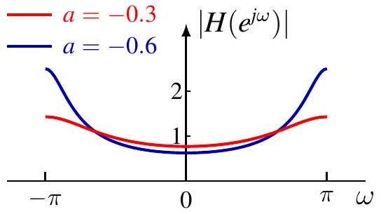

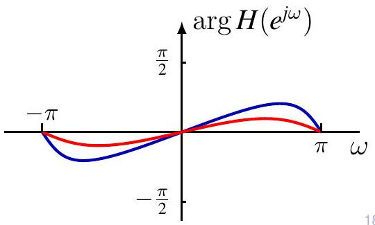

:::
::::

## 一阶递归离散时间滤波器

:::: {.columns style="text-align: center;"}

::: {.column width="50%"}

### 单位脉冲响应 (IIR 滤波器)

$$
\begin{gathered}
h[n]=a^{n} u[n] \\
H\left(e^{j \omega}\right)=\sum_{n=0}^{\infty}\left(a e^{-j \omega}\right)^{n}=\frac{1}{1-a e^{-j \omega}}
\end{gathered}
$$

为了保证级数**收敛**（Convergence），需要满足条件：$|a|<1$。

### 阶跃响应 (Step Response)

$$
s[n]=(h * u)[n]=\frac{1-a^{n+1}}{1-a} u[n]
$$

### 性能权衡 (Tradeoff)

* **$|a|$ 较大时**：通带越窄（选择性更好），但响应速度越慢（时域拖尾更长）。
* **$|a|$ 较小时**：响应速度越快，但通带越宽（滤波效果较弱）。

:::
::: {.column width="50%"}
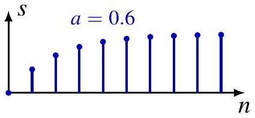

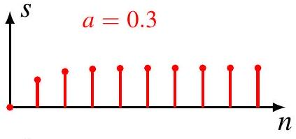

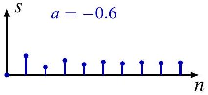

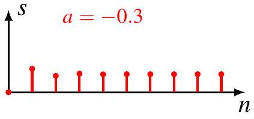
:::
::::

## 滑动平均作为低通滤波器

$$
y[n]=\frac{1}{M_{1}+M_{2}+1} \sum_{k=-M_{1}}^{M_{2}} x[n-k]
$$

脉冲响应 (FIR 滤波器)

$$
h[n]=\frac{1}{M_{1}+M_{2}+1} \sum_{k=-M_{1}}^{M_{2}} \delta[n-k]
$$

频率响应

$$
H\left(e^{j \omega}\right)=\frac{1}{M_{1}+M_{2}+1} \sum_{k=-M_{1}}^{M_{2}} e^{-j k \omega}=\frac{e^{j \frac{M_{1}-M_{2}}{2} \omega}}{M_{1}+M_{2}+1} \frac{\sin \left(\frac{M_{1}+M_{2}+1}{2} \omega\right)}{\sin \frac{\omega}{2}}
$$

## 滑动平均作为低通滤波器

$M_{1}=0, M_{2}=1$,

$$
\begin{aligned}
y[n] & =\frac{1}{2}(x[n]+x[n-1]) \\
h[n] & =\frac{1}{2}(\delta[n]+\delta[n-1]) \\
H\left(e^{j \omega}\right) & =e^{-j \frac{\omega}{2}} \cos \frac{\omega}{2}
\end{aligned}
$$

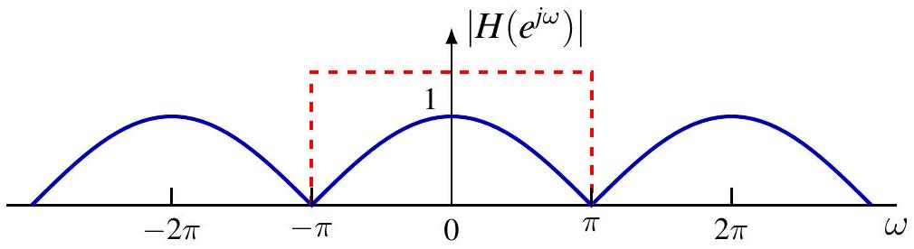

验证以下结论：

* 若输入 $x[n]=K e^{j 0 \cdot n}$，则输出 $y[n]=x[n]$。
* 若输入 $x[n]=K e^{j \pi n}=K(-1)^{n}$，则输出 $y[n]=0$。

## 滑动平均作为低通滤波器

$M_{1}=M_{2}=1$,

$$
\begin{aligned}
y[n] & =\frac{1}{3}(x[n+1]+x[n]+x[n-1]) \\
h[n] & =\frac{1}{3}(\delta[n+1]+\delta[n]+\delta[n-1]) \\
H\left(e^{j \omega}\right) & =\frac{\sin \left(\frac{3}{2} \omega\right)}{3 \sin \frac{\omega}{2}}=\frac{1}{3}+\frac{2}{3} \cos \omega
\end{aligned}
$$

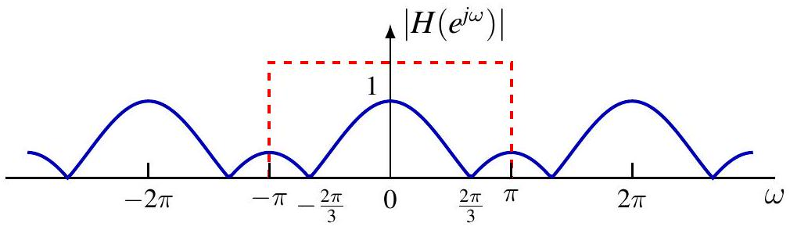

## 滑动平均作为低通滤波器

$$
H\left(e^{j \omega}\right)=\frac{e^{j \frac{M_{1}-M_{2}}{2} \omega}}{M_{1}+M_{2}+1} \frac{\sin \left(\frac{M_{1}+M_{2}+1}{2} \omega\right)}{\sin \frac{\omega}{2}}
$$

$$
M_{1}+M_{2}+1=11
$$

:::: {.columns style="text-align: center;"}

::: {.column width="30%"}

:::

::: {.column width="40%"}
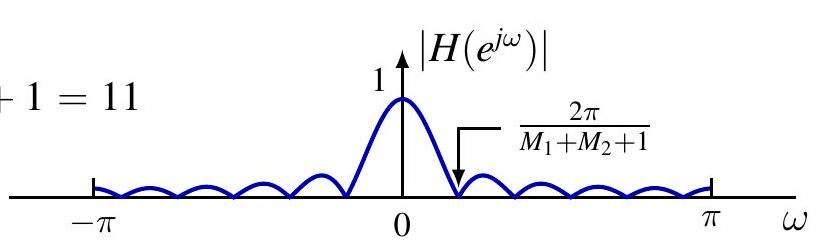
:::

::: {.column width="30%"}

:::
::::

$$
M_{1}+M_{2}+1=41
$$

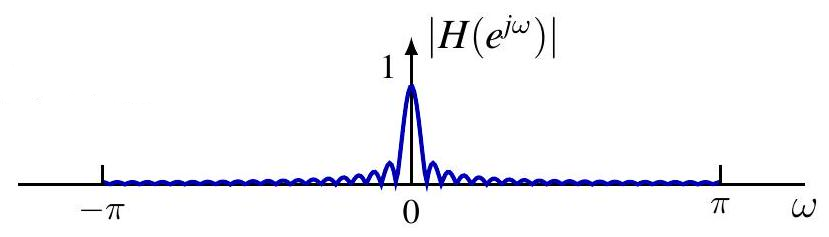{fig-align=center}

$M_1 + M_2$ 越大，通带越窄，输出越平滑。

## 滑动平均作为低通滤波器

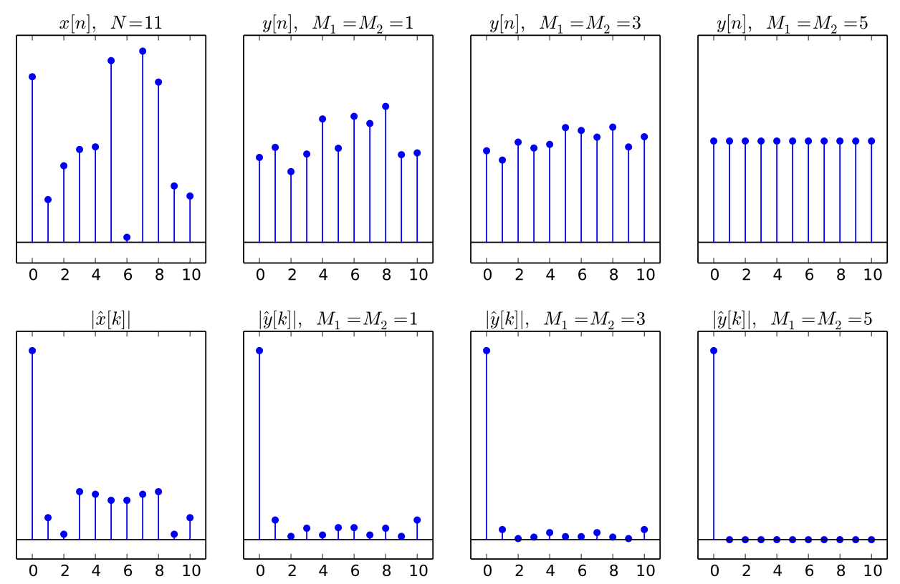{fig-align=center}

## 滑动平均作为低通滤波器

### 非因果系统 (Noncausal)

$$
y_{1}[n]=\frac{1}{2 M+1} \sum_{k=-M}^{M} x[n-k]
$$

### 因果系统 (Causal)

$$
y_{2}[n]=\frac{1}{2 M+1} \sum_{k=0}^{2 M} x[n-k]
$$

注：$y_{2}=\tau_{M} y_{1}$（即 $y_2$ 是 $y_1$ 延迟了 $M$ 个样本的结果）。

### 对于实时系统 (Real-time system)

* **非因果版本不可实现**：因为它需要利用“未来”的样本点。
* **因果版本可实现**：仅利用当前及过去的样本点。
* **性能权衡**：$M$ 越大，通带越窄，输出越平滑，但**延迟越长**，响应越**迟缓**。

## 一阶差分作为高通滤波器

缩放一阶差分（平减一阶差分）

$$
y[n]=\frac{1}{2}(x[n]-x[n-1])
$$

脉冲响应 (FIR滤波器)

$$
h[n]=\frac{1}{2}(\delta[n]-\delta[n-1])
$$

:::: {.columns style="text-align: center;"}

::: {.column width="50%"}

### 频率响应 (Frequency Response)

$$
\begin{aligned}
H\left(e^{j \omega}\right) & =\frac{1}{2}\left(1-e^{-j \omega}\right)=j e^{-j \frac{\omega}{2}} \sin \frac{\omega}{2} \\
\left|H\left(e^{j \omega}\right)\right| & =\left|\sin \frac{\omega}{2}\right|
\end{aligned}
$$

### 结论验证 (Verification)

* 若输入 $x[n]=K e^{j 0 \cdot n}$（直流分量），则输出 $y[n]=0$。
* 若输入 $x[n]=K e^{j \pi n}=K(-1)^{n}$（最高频分量），则输出 $y[n]=x[n]$。
:::

::: {.column width="50%"}

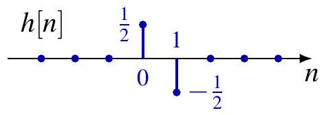

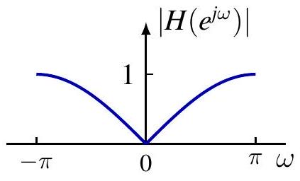
:::
::::

## 一阶差分用于边缘检测

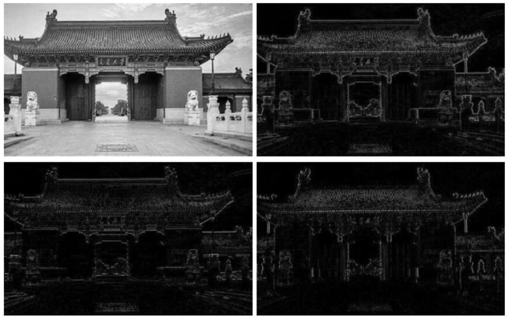{fig-align=center}

## 作业

 

---

<section style="
  min-height: 100vh;
  display: flex;
  flex-direction: column;
  justify-content: center;
  align-items: center;
  text-align: center;
">
  

<h1>第三章   周期信号的傅里叶级数表示    完</h1>
  

</section>