## 目录 {#toc0}

- [**1. 非周期信号的表示：连续时间傅里叶变换**](#sec41)
- [2. 连续时间傅里叶变换的性质](#sec42)
- [3. 卷积性质](#sec43)
- [4. 相乘性质](#sec44)
- [5. 变换性质和变换对列表](#sec45)
- [6. 由线性常系数微分方程表征的系统](#sec46)

# 1. 非周期信号的表示：连续时间傅里叶变换{#sec41}

## 动机示例：周期方波

在一个周期中,

$$
x_{T}(t)= \begin{cases}1, & |t|<T_{1} \\ 0, & T_{1}<|t|<T / 2\end{cases}
$$

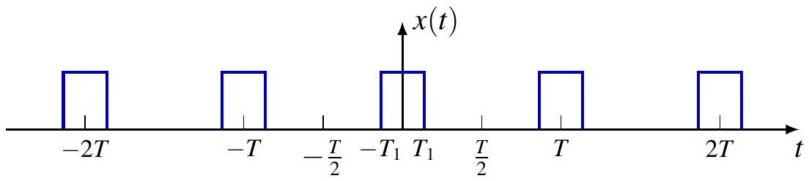

在 $\omega_k = k\omega_0$ 处的频率分量满足：

$$
T\hat{x}_T[k] = \frac{2 \sin (k\omega_0 T_1)}{k\omega_0} = \left. \frac{2 \sin (\omega T_1)}{\omega} \right|_{\omega=k\omega_0}
$$

$T\hat{x}_T[k]$ 是在 $\omega_k = k\omega_0$ 处采样的包络线 $X(j\omega) \triangleq \frac{2 \sin(\omega T_1)}{\omega}$ 的值。

## 动机示例：周期方波

当 $T_1$ 固定且周期 $T$ 不同时的 $X(j\omega_k)$： 

{fig-align=center}

{fig-align=center}

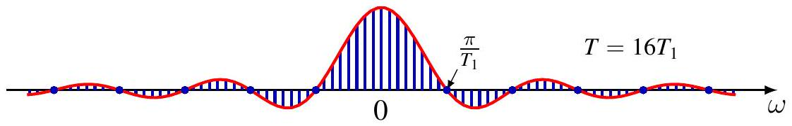{fig-align=center}

* 离散频率间隔为 $\omega_k = k\frac{2\pi}{T}$ 
* 图中展示了三种情况：
    * $T = 4T_1$ 
    * $T = 8T_1$ 
    * $T = 16T_1$ 
* 第一个零点位于 $\frac{\pi}{T_1}$ 

**结论：** 随着 $T \to \infty$，离散频率的采样变得越来越密集。 

## 动机示例：周期方波

当 $T \to \infty$ 时，$x_T(t) \to x(t) \triangleq u(t + \frac{T_1}{2}) - u(t - \frac{T_1}{2})$，即矩形脉冲 。

$$
\begin{aligned}
x_T(t) &= \sum_{k=-\infty}^{\infty} \hat{x}_T[k] e^{j\omega_k t} = \sum_{k=-\infty}^{\infty} \frac{1}{T} X(j\omega_k) e^{j\omega_k t} & (T\hat{x}[k] = X(j\omega_k))  \\
&= \sum_{k=-\infty}^{\infty} \frac{\omega_0}{2\pi} X(j\omega_k) e^{j\omega_k t} & (\omega_0 = \frac{2\pi}{T}) \\
&= \frac{1}{2\pi} \sum_{k=-\infty}^{\infty} X(j\omega_k) e^{j\omega_k t} \Delta\omega & (\Delta\omega = \omega_0)  \\
&\to \frac{1}{2\pi} \int_{-\infty}^{\infty} X(j\omega) e^{j\omega t} d\omega & (\Delta\omega = \omega_0 \to 0) 
\end{aligned}
$$

因此：

$$
x(t) = \frac{1}{2\pi} \int_{-\infty}^{\infty} X(j\omega) e^{j\omega t} d\omega  
$$

## 动机示例：周期方波

对于包络线 $X(j\omega)$ ，

$$
\begin{aligned}
X(j\omega_k) &= T\hat{x}_T[k] \\
&= \int_{-T/2}^{T/2} x_T(t)e^{-j\omega_k t} dt \\
&= \int_{-T/2}^{T/2} x(t)e^{-j\omega_k t} dt \quad (在 |t| \le T/2 时，x_T(t) = x(t))  \\
&= \int_{-\infty}^{\infty} x(t)e^{-j\omega_k t} dt \quad (在 |t| > T/2 时，x(t) = 0) 
\end{aligned}
$$

所以，

$$
X(j\omega) = \int_{-\infty}^{\infty} x(t)e^{-j\omega t} dt 
$$

## 动机示例：周期方波

{fig-align=center}

{fig-align=center}

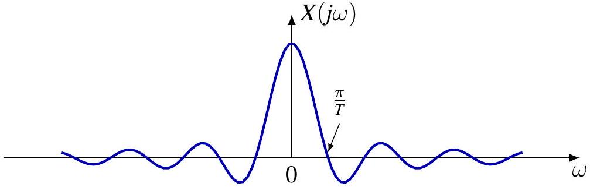{fig-align=center}

## 非周期信号的连续时间傅里叶变换 (CTFT)

对于一个支撑集为 $\text{supp } x \subset [-T_1, T_1]$ 的非周期信号 $x$，定义周期为 $T > 2T_1$ 的周期延拓信号：

$$x_T(t) = \sum_{k=-\infty}^{\infty} x(t - kT)$$

那么 

$$x(t) = x_T(t), \quad |t| < \frac{T}{2}$$ 

当 $T \to \infty$ 时，

$$x_T(t) \to x(t), \quad \forall t \in \mathbb{R}$$ 

$x_T$ 具有傅里叶级数表示：

$$x_T(t) = \sum_{k=-\infty}^{\infty} \hat{x}_T[k]e^{jk\omega_0 t}, \quad \omega_0 = \frac{2\pi}{T}$$ 

## 非周期信号的连续时间傅里叶变换

定义：

$$
X(j\omega) = \int_{-\infty}^{\infty} x(t)e^{-j\omega t} dt
$$

$X(j\omega)$ 是 $T\hat{x}_T[k]$ 的包络线，

$$
\begin{aligned}
\hat{x}_T[k] &= \frac{1}{T} \int_{-\frac{T}{2}}^{\frac{T}{2}} x_T(t)e^{-jk\omega_0 t} dt = \frac{1}{T} \int_{-\frac{T}{2}}^{\frac{T}{2}} x(t)e^{-jk\omega_0 t} dt \\
&= \frac{1}{T} \int_{-\infty}^{\infty} x(t)e^{-jk\omega_0 t} dt = \frac{1}{T} X(jk\omega_0) = \frac{\omega_0}{2\pi} X(jk\omega_0)
\end{aligned}
$$

所以：

$$
\begin{aligned}
x(t) &= \lim_{T \to \infty} x_T(t) = \lim_{T \to \infty} \sum_{k=-\infty}^{\infty} \frac{\omega_0}{2\pi} X(jk\omega_0)e^{jk\omega_0 t} \\
&= \frac{1}{2\pi} \int_{-\infty}^{\infty} X(j\omega)e^{j\omega t} d\omega
\end{aligned}
$$

## 连续时间傅里叶变换对

**傅里叶变换（分析方程）** ：
$$X(j\omega) = \mathcal{F}(x)(j\omega) = \int_{-\infty}^{\infty} x(t) e^{-j\omega t} dt$$ 
* $X(j\omega)$ 被称为 $x(t)$ 的**频谱** [cite: 500]。

**逆傅里叶变换（综合方程）** ：
$$x(t) = \mathcal{F}^{-1}(X)(t) = \frac{1}{2\pi} \int_{-\infty}^{\infty} X(j\omega) e^{j\omega t} d\omega$$ [cite: 502]
* 这是在**连续频率**上的复指数信号的叠加；

* 频率 $\omega$ 具有“幅度” $X(j\omega) \frac{d\omega}{2\pi}$ 。

## CT 傅里叶变换定义

**傅里叶变换 (分析方程)**

$$
X(j \omega)=\mathcal{F}\{x\}(j \omega)=\int_{-\infty}^{\infty} x(t) e^{-j \omega t} d t
$$

$X(j \omega)$ 称为 $x(t)$ 的**频谱 (spectrum)**。

**傅里叶逆变换 (综合方程)**

$$
x(t)=\mathcal{F}^{-1}\{X\}(t)=\frac{1}{2 \pi} \int_{-\infty}^{\infty} X(j \omega) e^{j \omega t} d \omega
$$

这表示在连续频率范围内的复指数信号的叠加；频率 $\omega$ 处的“密度”为 $\frac{1}{2 \pi} X(j \omega)$。

## 等价表示与应用

同一信号的两种等价表示：

- 时域 vs. 频域：$x(t) \stackrel{\mathcal{F}}{\longleftrightarrow} X(j \omega)$

**其他领域的应用**：

- **概率论**：具有密度函数 $p(x)$ 的随机变量 $X$ 的特征函数
  $$
  \varphi_{X}(t)=\mathbb{E}\left[e^{j t X}\right]=\int_{-\infty}^{\infty} p(x) e^{j x t} d x
  $$

- **量子力学**：
  - 位置表示：波函数 $\psi(x)$（$|\psi(x)|^{2}$ 是在位置 $x$ 发现粒子的概率密度）
  - 动量表示：$\Psi(p)$
    $$
    \Psi(p)=\frac{1}{\sqrt{2 \pi \hbar}} \int_{-\infty}^{\infty} \psi(x) e^{-j p x / \hbar} d x
    $$
  - $|\Psi(p)|^{2}$ 是发现具有动量 $p$ 的粒子的概率密度

## $L_{1}$ 信号的定义

回顾微积分，对于实值函数 $x$，广义积分定义为：

$$
\int_{\mathbb{R}} x(t) d t \triangleq \lim _{T_{1}, T_{2} \rightarrow \infty} \int_{-T_{1}}^{T_{2}} x(t) d t
$$

如果 $x \in L_{1}(\mathbb{R})$，即 $\|x\|_{1}=\int_{\mathbb{R}}|x(t)| d t<\infty$，则该积分是**定义良好 (well-defined)** 的。
对于复值函数 $x=u+j v$ 同样适用，因为 $|u|,|v| \leq|x|$。

对于信号 $x \in L_{1}(\mathbb{R})$：
- $x(t) e^{-j \omega t} \in L_{1}(\mathbb{R})$，因为 $\left|x(t) e^{-j \omega t}\right|=|x(t)|$。
- 对于每个 $\omega$，傅里叶变换 $X(j \omega)$ 都是定义良好的广义积分。

## $L_{1}$ 信号傅里叶变换的性质

**定理**：如果 $x \in L_{1}$，则 $X$ 是**有界**的，实际上 $\|X\|_{\infty} \leq\|x\|_{1}$。

**引理**：对于实变量 $t$ 的复值函数 $f$，
$$
\left|\int f(t) d t\right| \leq \int|f(t)| d t
$$
**证明**：若右边为 $\infty$ 则显然。假设有限。令积分的相位为 $\phi$，即 $\int f(t) d t=\left|\int f(t) d t\right| e^{j \phi}$。
$$
\left|\int f(t) d t\right|=e^{-j \phi} \int f(t) d t=\int e^{-j \phi} f(t) d t
$$
取实部：
$$
\left|\int f(t) d t\right|=\operatorname{Re} \int e^{-j \phi} f(t) d t=\int \operatorname{Re}\left[e^{-j \phi} f(t)\right] d t \leq \int\left|e^{-j \phi} f(t)\right| d t
$$

**定理**：如果 $x \in L_{1}$，则 $X$ 是**一致连续 (uniformly continuous)** 的。
*(证明利用三角不等式和 $L_1$ 积分的性质)*

## 例子：右边衰减指数信号

$$
x(t)=e^{-a t} u(t), \quad a>0
$$

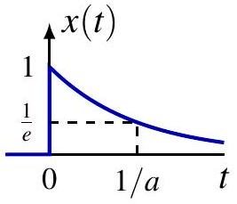

$$
\begin{aligned}
X(j \omega) & =\int_{0}^{\infty} e^{-(a+j \omega) t} d t \\
& =-\left.\frac{1}{a+j \omega} e^{-(a+j \omega) t}\right|_{0} ^{\infty}=\frac{1}{a+j \omega}
\end{aligned}
$$

*(注：该公式也适用于实部 $\operatorname{Re} a>0$ 的复数 $a$)*

对于 $a>0$：
$$
|X(j \omega)|=\frac{1}{\sqrt{a^{2}+\omega^{2}}}, \quad \arg X(j \omega)=-\arctan \frac{\omega}{a}
$$

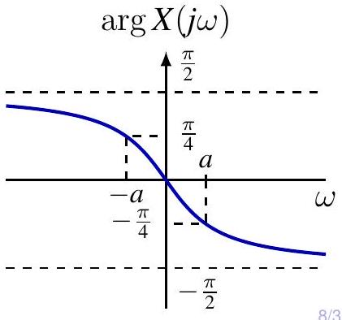

## 例子：双边衰减指数信号

$$
x(t)=e^{-a|t|}, \quad a>0
$$

$$
\begin{aligned}
X(j \omega) & =\int_{-\infty}^{\infty} e^{-a|t|} e^{-j \omega t} d t \\
& =\int_{-\infty}^{0} e^{(a-j \omega) t} d t+\int_{0}^{\infty} e^{-(a+j \omega) t} d t \\
& =\frac{1}{a-j \omega}+\frac{1}{a+j \omega}=\frac{2 a}{a^{2}+\omega^{2}}
\end{aligned}
$$

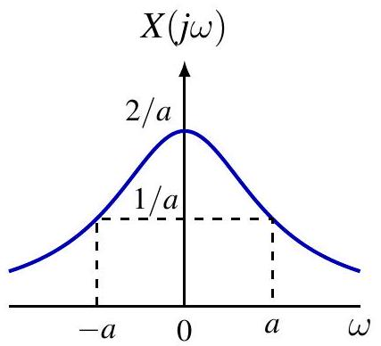

## 例子：高斯信号 (Gaussian)

对于 $a>0$，

$$
x(t)=e^{-a t^{2}} \stackrel{\mathcal{F}}{\longleftrightarrow} X(j \omega)=\sqrt{\frac{\pi}{a}} e^{-\frac{\omega^{2}}{4 a}}
$$

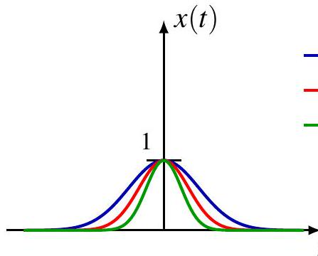
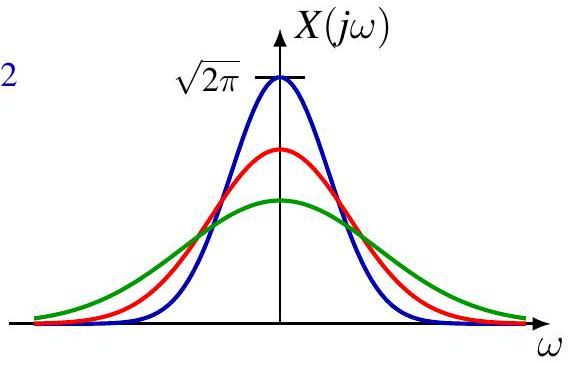

特别地，如果 $a=1/2$：
$$
x(t)=e^{-\frac{1}{2} t^{2}} \stackrel{\mathcal{F}}{\longleftrightarrow} X(j \omega)=\sqrt{2 \pi} e^{-\frac{1}{2} \omega^{2}}
$$
即高斯函数是傅里叶变换的特征函数。

## 高斯信号变换证明

利用微分方程和分部积分证明：

$$
\begin{aligned}
\frac{d}{d \omega} X(j \omega) & =\int_{-\infty}^{\infty} e^{-a t^{2}}(-j t) e^{-j \omega t} d t=\frac{j}{2 a} \int_{-\infty}^{\infty}\left(\frac{d}{d t} e^{-a t^{2}}\right) e^{-j \omega t} d t \\
&=-\frac{j}{2 a} \int_{-\infty}^{\infty} e^{-a t^{2}}\left(\frac{d}{d t} e^{-j \omega t}\right) d t \quad \text { (分部积分) } \\
&=-\frac{\omega}{2 a} X(j \omega)
\end{aligned}
$$

解微分方程 $\frac{d}{d \omega} X(j \omega)=-\frac{\omega}{2 a} X(j \omega)$ 并利用 $X(0)=\sqrt{\pi/a}$ 可得结果。

## $L_{1}$ 信号的傅里叶逆变换

给定 $X(j\omega)$，逆变换是否等于 $x(t)$？

$$
x(t) \stackrel{?}{=} \mathcal{F}^{-1}\{X\}(t)=\frac{1}{2 \pi} \int_{-\infty}^{\infty} X(j \omega) e^{j \omega t} d \omega
$$

**定理**：如果 $x \in L_{1}(\mathbb{R})$ 是连续的，且 $X=\mathcal{F}\{x\} \in L_{1}(\mathbb{R})$，那么 $x=\mathcal{F}^{-1}\{X\}$。
- 例如：双边衰减指数，高斯信号。

**注意**：对于 $x \in L_1$，其变换 $X$ 不一定属于 $L_1$。
- 例如：单边衰减指数，矩形脉冲。

**主值积分**：通常将逆变换解释为柯西主值 (Principal Value)：
$$
\lim _{W \rightarrow \infty} \frac{1}{2 \pi} \int_{-W}^{W} X(j \omega) e^{j \omega t} d \omega
$$

**狄利克雷定理**：如果 $x \in L_1$ 且满足狄利克雷条件，逆变换收敛于 $\frac{x\left(t_{+}\right)+x\left(t_{-}\right)}{2}$（吉布斯现象）。

## 例子：矩形脉冲 (Rectangular Pulse)

$$
x(t)=u(t+T)-u(t-T)
$$

$$
X(j \omega)=\int_{-T}^{T} e^{-j \omega t} d t=\frac{2 \sin (\omega T)}{\omega}
$$

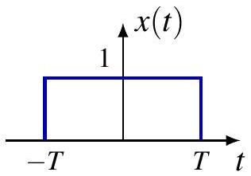

当 $T \rightarrow \infty$ 时：
- 频域：$\frac{\sin (\omega T)}{\pi \omega} \rightarrow \delta(\omega)$
- 时域：$x(t) \rightarrow 1$ (直流信号)

定义 Sinc 函数：$\operatorname{sinc}(\theta) \triangleq \frac{\sin (\pi \theta)}{\pi \theta}$

## 例子：理想低通滤波器

频率响应：
$$
H(j \omega)=u\left(\omega+\omega_{c}\right)-u\left(\omega-\omega_{c}\right)
$$

冲激响应（逆变换）：
$$
h(t)=\frac{1}{2 \pi} \int_{-\omega_{c}}^{\omega_{c}} e^{j \omega t} d \omega=\frac{\sin \left(\omega_{c} t\right)}{\pi t}
$$

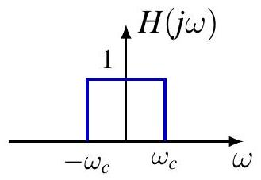

注意：$h(t) \notin L_{1}(\mathbb{R})$ 但 $H(j \omega) \in L_{1}(\mathbb{R})$。

当 $\omega_{c} \rightarrow \infty$ 时，
- 时域：$h(t) \rightarrow \delta(t)$
- 频域：$H(j \omega) \rightarrow 1$（通过所有频率）

## 对偶性 (Duality)

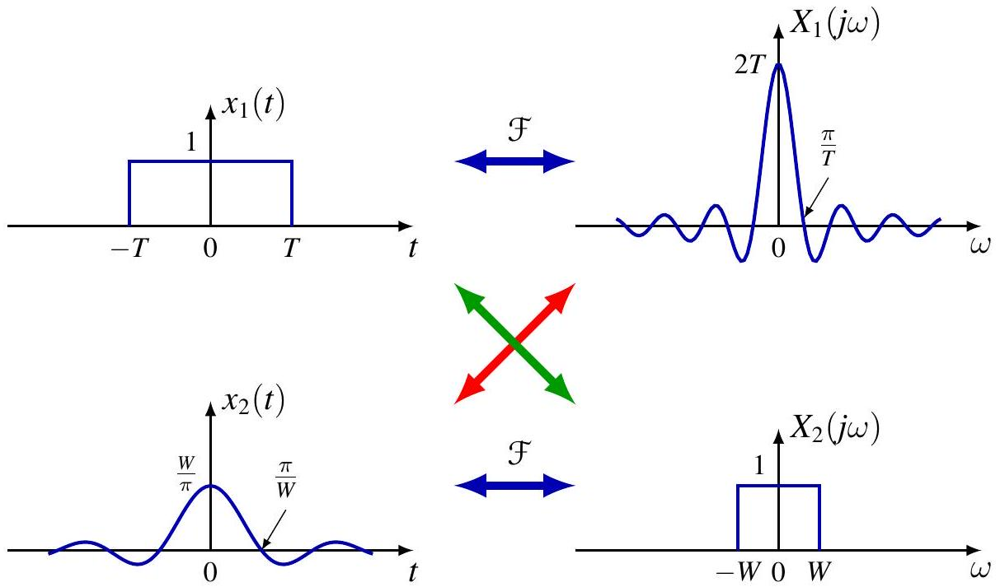

- 时间脉冲 $\leftrightarrow$ 频域 Sinc
- 时间 Sinc $\leftrightarrow$ 频域脉冲 (低通滤波器)

## 广义傅里叶变换定义

如果 $x_n \rightarrow x$，定义 $x$ 的傅里叶变换为：
$$
X(j \omega)=\mathcal{F}\{x\} \triangleq \lim _{n} \mathcal{F}\left\{x_{n}\right\}
$$

更正式地，基于**分布/广义函数**理论，对于测试函数 $\phi$：
$$
\int_{\mathbb{R}} X(j \omega) \phi(\omega) d \omega=\int_{\mathbb{R}} x(t) \Phi(j t) d t
$$

**施瓦兹空间 (Schwarz Space) $\mathcal{S}$**：
- 无穷可微且**速降 (rapidly decreasing)** 的函数空间。
- 例如：高斯函数 $g(t)=e^{-a t^{2}} \in \mathcal{S}$。
- 性质：$\phi \in \mathcal{S} \Longrightarrow \Phi \in \mathcal{S}$。

## 例子：单位冲激 $\delta$

**方法 1**：作为理想低通滤波器的极限。
$$
h_{W}(t)=\frac{\sin (W t)}{\pi t} \stackrel{\mathcal{F}}{\longleftrightarrow} H_{W}(j \omega)=u(\omega+W)-u(\omega-W)
$$
当 $W \rightarrow \infty$，$h_W \to \delta$，且 $H_W \to 1$。
$$
\therefore \mathcal{F}\{\delta\}=1
$$

**方法 2**：使用广义定义。
$$
\int_{\mathbb{R}} X(j \omega) \phi(\omega) d \omega=\int_{\mathbb{R}} \delta(t) \Phi(j t) d t=\Phi(0)=\int_{\mathbb{R}} 1 \cdot \phi(\omega) d \omega
$$
因此 $X(j\omega)=1$。
$\delta$ 具有**白色频谱 (white spectrum)**，包含等量的所有频率。

## 例子：直流信号 1

**方法 1**：作为矩形脉冲的极限。
$$
x_{T}(t) \longleftrightarrow X_{T}(j \omega)=\frac{2 \sin (\omega T)}{\omega}
$$
当 $T \rightarrow \infty$，$x_T \to 1$，且 $X_T \to 2\pi\delta(\omega)$。
$$
\therefore \mathcal{F}\{1\}=2 \pi \delta(\omega)
$$

**方法 2**：使用广义定义。
$$
\int_{\mathbb{R}} X(j \omega) \phi(\omega) d \omega=\int_{\mathbb{R}} 1 \cdot \Phi(j t) d t=2 \pi \phi(0)=\int_{\mathbb{R}} 2 \pi \delta(\omega) \phi(\omega) d \omega
$$
**直流信号的频谱是零频率处的冲激！**

## 例子：复指数信号

令 $x(t)=e^{j \omega_{0} t}$。

$$
\begin{aligned}
\int_{\mathbb{R}} X(j \omega) \phi(\omega) d \omega & =\int_{\mathbb{R}} e^{j \omega_{0} t} \Phi(j t) d t=2 \pi \phi\left(\omega_{0}\right) \\
& =\int_{\mathbb{R}} 2 \pi \delta\left(\omega-\omega_{0}\right) \phi(\omega) d \omega
\end{aligned}
$$

因此：
$$
\mathcal{F}\{e^{j \omega_{0} t}\} = 2 \pi \delta\left(\omega-\omega_{0}\right)
$$

$e^{j \omega_{0} t}$ 的频谱是 $\omega_{0}$ 处的冲激。
这可以解释为 $e^{j \omega t}$ 的正交性：
$$
X(j \omega)=\left\langle x, e^{j \omega t}\right\rangle
$$

## 周期信号的傅里叶变换

### 周期信号的频谱

基频为 $\omega_0$ 的周期信号具有傅里叶级数：
$$
x(t)=\sum_{k=-\infty}^{\infty} \hat{x}[k] e^{j k \omega_{0} t}
$$

利用线性和复指数的变换：
$$
\begin{aligned}
X(j \omega) & =\mathcal{F}\left\{\sum_{k=-\infty}^{\infty} \hat{x}[k] e^{j k \omega_{0} t}\right\} \\
& =\sum_{k=-\infty}^{\infty} \hat{x}[k] \mathcal{F}\left\{e^{j k \omega_{0} t}\right\} \\
& =\sum_{k=-\infty}^{\infty} 2 \pi \hat{x}[k] \delta\left(\omega-k \omega_{0}\right)
\end{aligned}
$$

**结论**：周期信号的频谱由**谐波相关频率处的冲激**组成！冲激的面积是 $2\pi$ 乘以傅里叶级数系数。

## 例子：正弦和余弦

**余弦**：$x(t) = \cos(\omega_0 t) = \frac{1}{2} e^{j \omega_{0} t}+\frac{1}{2} e^{-j \omega_{0} t}$
$$
X(j \omega) = \pi \delta\left(\omega-\omega_{0}\right)+\pi \delta\left(\omega+\omega_{0}\right)
$$
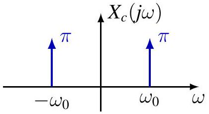

**正弦**：$x(t) = \sin(\omega_0 t) = \frac{1}{2j} e^{j \omega_{0} t}-\frac{1}{2j} e^{-j \omega_{0} t}$
$$
X(j \omega) = \frac{\pi}{j} \delta\left(\omega-\omega_{0}\right)-\frac{\pi}{j} \delta\left(\omega+\omega_{0}\right)
$$
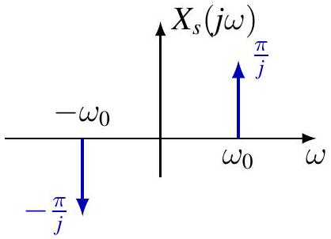

## 例子：周期冲激串

$$
x(t)=\sum_{k=-\infty}^{\infty} \delta(t-k T)
$$

傅里叶系数 $\hat{x}[k] = 1/T$。
傅里叶变换：

$$
X(j \omega)=\sum_{k=-\infty}^{\infty} \frac{2 \pi}{T} \delta\left(\omega-k \frac{2 \pi}{T}\right)
$$

时域中的冲激串 $\longleftrightarrow$ 频域中的冲激串。

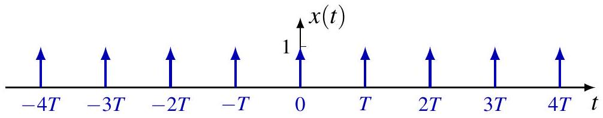
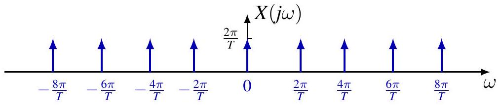

## 目录 {#toc1}

- [1. 非周期信号的表示：连续时间傅里叶变换](#sec41)
- [**2. 连续时间傅里叶变换的性质**](#sec42)
- [3. 卷积性质](#sec43)
- [4. 相乘性质](#sec44)
- [5. 变换性质和变换对列表](#sec45)
- [6. 由线性常系数微分方程表征的系统](#sec46)

# 2. 连续时间傅里叶变换的性质{#sec42}

## 回顾：$L_1(\mathbb{R})$ 函数的傅里叶变换

作为主值（Principal values）的傅里叶变换及其逆变换：

$$
\mathcal{F}\{x\}(j\omega) = \lim_{T \to \infty} \int_{-T}^{T} x(t)e^{-j\omega t} dt
$$

$$
\mathcal{F}^{-1}(X)(t) = \lim_{W \to \infty} \frac{1}{2 \pi} \int_{-W}^{W} X(j\omega)e^{j\omega t} d\omega
$$

---

### 定理（点向逆变换 Pointwise inversion）

1. 如果 $x \in L_1(\mathbb{R})$ 在所有有限区间上均满足狄里赫利（Dirichlet）条件，则：
   $$(\mathcal{F}^{-1} \circ \mathcal{F}\{x\})(t) = \frac{x(t_+) + x(t_-)}{2}, \quad \forall t$$

2. 如果 $X \in L_1(\mathbb{R})$ 在所有有限区间上均满足狄里赫利（Dirichlet）条件，则：
   $$(\mathcal{F} \circ \mathcal{F}^{-1}\{X\})(j\omega) = \frac{X(j\omega_+) + X(j\omega_-)}{2}, \quad \forall \omega$$

3. 如果 $x \in C(\mathbb{R}) \cap L_1(\mathbb{R})$ 且 $\mathcal{F}\{x\} \in L_1(\mathbb{R})$，那么：
   $$\mathcal{F}^{-1} \circ \mathcal{F}\{x\} = x$$

## 回顾: $L_1(\mathbb{R})$ 函数的傅里叶变换

傅里叶变换对

| case | $x(t)$ | $X(j \omega)$ |
| :--- | :--- | :--- |
| 1 | $e^{-a t} u(t), \quad \operatorname{Re} a>0$ | $\frac{1}{a+j \omega}$ |
| 3 | $e^{-a\|t\|}, \quad \operatorname{Re} a>0$ | $\frac{2 a}{a^{2}+\omega^{2}}$ |
| 3 | $e^{-a t^{2}}, \quad a>0$ | $\sqrt{\frac{\pi}{a}} e^{-\frac{\omega^{2}}{4 a}}$ |
| 1 | $u(t+T)-u(t-T)$ | $\frac{2 \sin (\omega T)}{\omega}$ |
| 2 | $\frac{\sin \left(\omega_{c} t\right)}{\pi t}$ | $u\left(\omega+\omega_{c}\right)-u\left(\omega-\omega_{c}\right)$ |

## 回顾: 广义函数的傅里叶变换

**施瓦茨空间 (Schwartz space)** $\mathcal{S} = \mathcal{S}(\mathbb{R})$，即快速递减函数空间：

$$\mathcal{S} = \{ \phi \in C^\infty(\mathbb{R}) : \|\phi\|_{\ell,k} < \infty, \forall \ell, k \in \mathbb{N} \}$$

其中 $\|\phi\|_{\ell,k} = \sup_{t \in \mathbb{R}} |t^\ell \phi^{(k)}(t)|$。注意 $\mathcal{F}\{\mathcal{S}\} = \mathcal{S}$。

**缓增广义函数 (Tempered distributions)** 的傅里叶变换定义如下：

$$(x, \phi) \triangleq \int_{\mathbb{R}} x(\xi)\phi(\xi)d\xi$$

* 如果在广义函数意义下 $x_n \to x$，那么其傅里叶变换定义为：$\mathcal{F}\{x\} \triangleq \lim_{n} \mathcal{F}\{x_n\}$（广义函数意义下）。

$$(x, \phi) = \lim_{n} (x_n, \phi) \Longrightarrow (\mathcal{F}\{x\}, \phi) \triangleq \lim_{n} (\mathcal{F}\{x_n\}, \phi), \quad \forall \phi \in \mathcal{S}$$

* 或者，另一种等价定义为：
  $$(\mathcal{F}\{x\}, \phi) \triangleq (x, \mathcal{F}\{\phi\}), \quad \forall \phi \in \mathcal{S}$$

## 回顾: 广义函数的傅里叶变换

傅里叶变换对

| $x(t)$ | $X(j \omega)$ |
| :--- | :--- |
| $\delta(t)$ | 1 |
| $\delta\left(t-t_{0}\right)$ | $e^{-j \omega t_{0}}$ |
| 1 | $2 \pi \delta(\omega)$ |
| $e^{j \omega_{0} t}$ | $2 \pi \delta\left(\omega-\omega_{0}\right)$ |

$$
\begin{gathered}
\int_{\mathbb{R}} \delta\left(t-t_{0}\right) e^{-j \omega t} d t=e^{-j \omega t_{0}}, \quad \int_{\mathbb{R}} e^{j\left(\omega_{1}-\omega_{2}\right) t} d t=2 \pi \delta\left(\omega_{1}-\omega_{2}\right) \\
\int_{\mathbb{R}} X(j \omega) e^{j \omega t} d \omega=\int_{\mathbb{R}} \int_{\mathbb{R}} x(\tau) e^{j \omega(t-\tau)} d \tau d \omega=\int_{\mathbb{R}} x(\tau) 2 \pi \delta(t-\tau) d \tau=2 \pi x(t)
\end{gathered}
$$

## 回顾: Fourier Transform for Periodic Functions

### 傅里叶级数 (Fourier series)

$$x(t) = \sum_{k=-\infty}^{\infty} \hat{x}[k]e^{jk\omega_0 t}$$

### 傅里叶变换 (Fourier transform)

$$X(j\omega) = \sum_{k=-\infty}^{\infty} 2\pi\hat{x}[k]\delta(\omega - k\omega_0)$$

### 等价表示 (Equivalent representation)

* $\hat{x}[k]$ 是在 $\omega_k = k\omega_0$ 处分量的**幅度**。
* $\hat{x}[k]\delta(\omega - k\omega_0)$ 是在 $\omega_k = k\omega_0$ 处分量的**密度**。

---

### 类比：概率论中的离散随机变量 $x$ (Cf. discrete random variable $x$ in probability)

$$\mathbb{E}f(X) = \sum_{n} f(x_n)p_n = \int_{\mathbb{R}} f(x)p(x)dx$$

其中概率密度函数定义为：
$$p(x) = \sum_{n} p_n\delta(x - x_n)$$

## 回顾: 傅里叶级数与傅里叶变换的关系

* 非周期信号 $x$ 具有长度小于 $T$ 的有限支撑集 
* $x$ 的周期延拓为 $x_T$ [cite: 481]：

$$x_T(t) = \sum_{k=-\infty}^{\infty} x(t - kT)$$ 

**注意：** 换句话说，$x$ 是周期信号 $x_T$ 的一个周期。

---

### 变换关系汇总

* **非周期信号 $x$ 的傅里叶变换 ($\mathcal{F}$)**：
  $$\hat{x}_T[k] = \frac{1}{T} X(jk\omega_0)$$ 

* **周期信号 $x_T$ 的傅里叶级数 ($\mathcal{FS}$)**：
  $$X_T(j\omega) = \sum_{k=-\infty}^{\infty} 2\pi \hat{x}_T[k] \delta(\omega - k\omega_0)$$

* **周期信号 $x_T$ 的傅里叶变换 ($\mathcal{F}$)**：
  $$X_T = \sum_{k=-\infty}^{\infty} \omega_0 X(jk\omega_0) \delta(\omega - k\omega_0)$$

## 连续时间傅里叶变换的性质

线性

$$
\mathcal{F}\{a x+b y\}=a \mathcal{F}\{x\}+b \mathcal{F}\{y\}
$$

时移

$$
\mathcal{F}\left\{\tau_{t_{0}} x\right\}=E_{-t_{0}} \mathcal{F}\{x\} \quad \text { or } \quad x\left(t-t_{0}\right) \stackrel{\mathcal{F}}{\longleftrightarrow} e^{-j \omega t_{0}} X(j \omega)
$$

其中 $\left(E_{a} f\right)(s)=e^{j a s} f(s)$
证明。

$$
\int_{\mathbb{R}} x\left(t-t_{0}\right) e^{-j \omega t} d t=\int_{\mathbb{R}} x(s) e^{-j \omega\left(s+t_{0}\right)} d s=e^{-j \omega t_{0}} \int_{\mathbb{R}} x(s) e^{-j \omega s} d s
$$

频移

$$
\mathcal{F}\left\{E_{\omega_{0}} x\right\}=\tau_{\omega_{0}} \hat{x} \quad \text { or } \quad e^{j \omega_{0} t} x(t) \stackrel{\mathcal{F}}{\longleftrightarrow} X\left(j\left(\omega-\omega_{0}\right)\right)
$$

## 例: 多径效应

**发送端 (Transmitter)**：$x(t)$ 

**接收端 (Receiver)**：$y(t) = a_0x(t) + a_1x(t - \tau)$

$$
\begin{aligned}
Y(j \omega) & =a_{0} X(j \omega)+a_{1} e^{-j \omega \tau} X(j \omega) \\
& =\left(a_{0}+a_{1} e^{-j \omega \tau}\right) X(j \omega)
\end{aligned}
$$

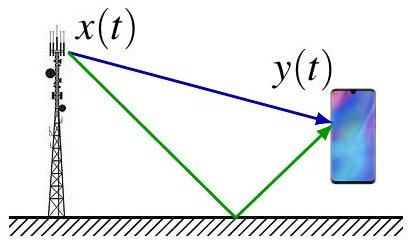

令 $x(t)=u(t+T)-u(t-T)$.

$$
X(j \omega)=\frac{2 \sin (\omega T)}{\omega}
$$

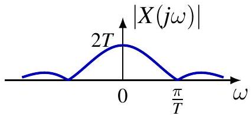

$$
Y(j \omega)=\left(a_{0}+a_{1} e^{-j \omega \tau}\right) \frac{2 \sin (\omega T)}{\omega}
$$

对于 $a_{0}=a_{1}=1$,

$$
Y(j \omega)=4 e^{-j \omega \tau / 2} \cos \left(\frac{\omega \tau}{2}\right) \frac{\sin (\omega T)}{\omega}
$$

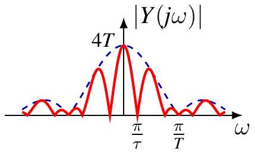

## 例: 调制

**基带信号 (Baseband signal)**：$x(t)$  

**已调信号 (Modulated signal)**：通常表示为 $y(t)$ 或 $s(t)$
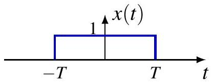

$$
\begin{aligned}
& y(t)=x(t) \cos \left(\omega_{c} t\right)=\frac{1}{2} x(t)\left(e^{j \omega_{c} t}+e^{-j \omega_{c} t}\right) \\
& Y(j \omega)=\frac{1}{2} X\left(j\left(\omega-\omega_{c}\right)\right)+\frac{1}{2} X\left(j\left(\omega+\omega_{c}\right)\right)
\end{aligned}
$$

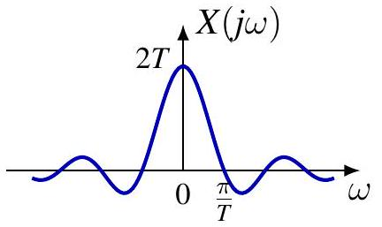

对于 $x(t)=u(t+T)-u(t-T)$,

$$
Y(j \omega)=\frac{\sin \left(\left(\omega-\omega_{c}\right) T\right)}{\omega-\omega_{c}}+\frac{\sin \left(\left(\omega+\omega_{c}\right) T\right)}{\omega+\omega_{c}}
$$

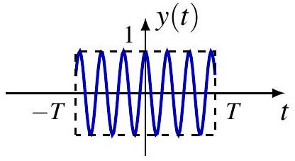
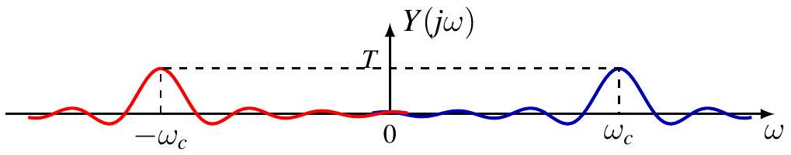

## 连续时间傅里叶变换的性质

时间反转

$$
\mathcal{F}\{R x\}=R \mathcal{F}\{x\} \quad \text { or } \quad x(-t) \stackrel{\mathcal{F}}{\longleftrightarrow} X(-j \omega)
$$

共轭

$$
\mathcal{F}\left\{x^{*}\right\}=R \overline{\mathcal{F}\{x\}} \quad \text { or } \quad x^{*}(t) \stackrel{\mathcal{F}}{\longleftrightarrow} X^{*}(-j \omega)
$$

**证明**：  
$\mathcal{F} \{x^*\}(j\omega) = \int_{\mathbb{R}} x^*(t)e^{-j\omega t} dt = \left( \int_{\mathbb{R}} x(t)e^{j\omega t} dt \right)^* = X^*(-j\omega)$ **对称性**

* $x$ 为偶函数 $\iff X$ 为偶函数； $x$ 为奇函数 $\iff X$ 为奇函数
* $x$ 为实信号 $\iff X(-j\omega) = X^*(j\omega)$（共轭对称性）
* $x$ 为实且偶 $\iff X$ 为实且偶
* $x$ 为实且奇 $\iff X$ 为纯虚且奇

## 例

对于 $a>0$,

$$
x(t)= \begin{cases}e^{-a t}, & t>0 \\ -e^{a t}, & t<0\end{cases}
$$

令 $y(t)=e^{-a t} u(t)$, 而且

$$
Y(j \omega)=\frac{1}{a+j \omega}
$$

由于 $x(t)=y(t)-y(-t)$.
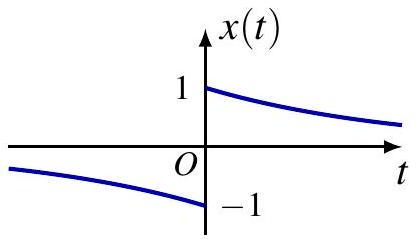

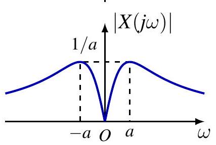

$$
\begin{aligned}
X(j \omega) & =Y(j \omega)-Y(-j \omega) \\
& =\frac{1}{a+j \omega}-\frac{1}{a-j \omega}=\frac{-2 j \omega}{a^{2}+\omega^{2}}
\end{aligned}
$$

$x$ 为实且奇 $\iff X$ 为纯虚且奇

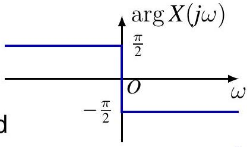

## 时间与频率尺度变换

对于 $a \neq 0$,

$$
\mathcal{F}\left\{S_{a} x\right\}=\frac{1}{|a|} S_{\frac{1}{a}} \mathcal{F}\{x\} \quad \text { or } \quad x(a t) \stackrel{\mathcal{F}}{\longleftrightarrow} \frac{1}{|a|} X\left(\frac{j \omega}{a}\right)
$$

**证明**。通过变量替换 $\tau = at$。

对于 $a > 0$：

$$
\int_{-\infty}^{\infty} x(at)e^{-j\omega t} dt = \int_{-\infty}^{\infty} x(\tau)e^{-j\frac{\omega}{a}\tau} \frac{d\tau}{a} = \frac{1}{a} X\left( \frac{j\omega}{a} \right)
$$

对于 $a < 0$：

$$
\int_{-\infty}^{\infty} x(at)e^{-j\omega t} dt = \int_{\infty}^{-\infty} x(\tau)e^{-j\frac{\omega}{a}\tau} \frac{d\tau}{a} = -\frac{1}{a} X\left( \frac{j\omega}{a} \right)
$$

## 时间与频率尺度变换

$$
\mathcal{F}\left\{S_{a} x\right\}=\frac{1}{|a|} S_{\frac{1}{a}} \mathcal{F}\{x\} \quad \text { or } \quad x(a t) \stackrel{\mathcal{F}}{\longleftrightarrow} \frac{1}{|a|} X\left(\frac{j \omega}{a}\right)
$$

傅里叶变换的尺度变换性质体现了**时域**与**频域**之间的倒数关系：

* **时域压缩 $\Longrightarrow$ 频域扩展**：
    当 $|a| > 1$ 时，信号在时间轴上变窄（压缩），其频谱在频率轴上变宽（扩展），且幅度下降 。
* **时域扩展 $\Longrightarrow$ 频域压缩**：
    当 $|a| < 1$ 时，信号在时间轴上变宽（拉伸），其频谱在频率轴上变窄（集中），幅度上升 。

**音频实例：**
* **播放速度加快（时域压缩）**：信号在时间上被压缩（$a > 1$），导致频率分量向高频移动，因此听起来**音调变高（Higher pitch）**。
* **播放速度放慢（时域扩展）**：信号在时间上被拉伸（$a < 1$），导致频率分量向低频压缩，因此听起来**音调变低（Lower pitch）**。

$$
x(t)=e^{-(a t)^{2}} \stackrel{\mathcal{F}}{\longleftrightarrow} X(j \omega)=\frac{\sqrt{\pi}}{|a|} e^{-\frac{1}{4}\left(\frac{\omega}{a}\right)^{2}}
$$

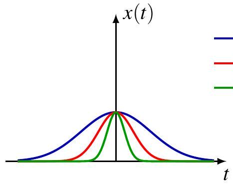
$a=1 / 2$
$a=1$
$a=2$
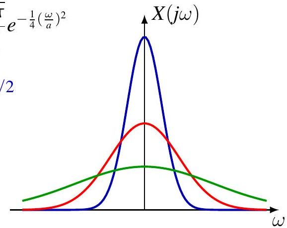

## 微分

$$
x^{\prime}(t) \stackrel{\mathcal{F}}{\longleftrightarrow} j \omega X(j \omega), \quad x^{(k)}(t) \stackrel{\mathcal{F}}{\longleftrightarrow}(j \omega)^{k} X(j \omega)
$$

### 证明：积分符号下求导 (Differentiate under integral sign)

利用逆傅里叶变换（合成方程）：
$$x(t) = \frac{1}{2\pi} \int_{\mathbb{R}} X(j\omega)e^{j\omega t} d\omega \Longrightarrow x'(t) = \frac{1}{2\pi} \int_{\mathbb{R}} j\omega X(j\omega)e^{j\omega t} d\omega$$

由此可见，时域中的求导操作对应于频域中乘以 $j\omega$。

---

### 微分器及其频率响应

$y = x'$ 是一个**微分器**的输出，该系统的频率响应为：

$$H(j\omega) = \mathcal{F} \{\delta'\} (j\omega) = \int_{\mathbb{R}} \delta'(t)e^{-j\omega t} dt = -\left. \frac{d}{dt} e^{-j\omega t} \right|_0 = j\omega$$

---

### 滤波器特性分析

根据关系式 $Y(j\omega) = H(j\omega)X(j\omega)$，微分器具有以下滤波特性：

* **放大高频分量**：由于 $|H(j\omega)| = |\omega|$，随着频率 $\omega$ 增加，增益线性增加。
* **抑制低频分量**：频率越低，增益越小。
* **完全消除直流 (DC) 分量**：在 $\omega = 0$ 处，$H(j0) = 0$，因此信号中的常数部分会被完全滤除。

---

### 总结
微分器本质上是一个**高通滤波器**。它对信号中的突变（高频）非常敏感，常用于边缘检测；但同时也会放大信号中的高频噪声。
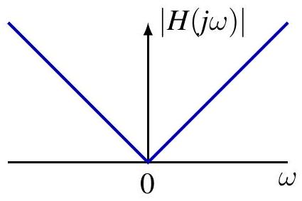

## 积分

$$
y(t)=\int_{-\infty}^{t} x(\tau) d \tau \stackrel{\mathcal{F}}{\longleftrightarrow} Y(j \omega)=\frac{1}{j \omega} X(j \omega)+\pi X(0) \delta(\omega)
$$

由于 $x(t) = y'(t)$，根据微分性质可知：
$$X(j\omega) = j\omega Y(j\omega) \Longrightarrow Y(j\omega) = \frac{1}{j\omega} X(j\omega) \quad (\text{对于 } \omega \neq 0)$$

---

### 直流 (DC) 分量的直观分析

直观地看，$y(t)$ 具有直流分量。其平均值 $\bar{y}$ 计算如下：

$$
\begin{aligned}
\bar{y} &= \lim_{T \to \infty} \frac{1}{2T} \int_{-T}^{T} y(t) dt = \lim_{T \to \infty} \frac{1}{2T} \int_{-T}^{T} \int_{\mathbb{R}} x(\tau)u(t - \tau) d\tau dt \\
&= \int_{\mathbb{R}} x(\tau) \left( \lim_{T \to \infty} \frac{1}{2T} \int_{-T}^{T} u(t - \tau) dt \right) d\tau = \frac{1}{2} X(0)
\end{aligned}
$$

因此，$Y$ 还包含一个由直流分量产生的冲激项：
$$2\pi \bar{y} \delta(\omega) = \pi X(0) \delta(\omega)$$

---

### 结论：积分性质的完整形式

综合以上两部分，若 $y(t) = \int_{-\infty}^{t} x(\tau) d\tau$，则其傅里叶变换为：
$$Y(j\omega) = \frac{1}{j\omega} X(j\omega) + \pi X(0) \delta(\omega)$$

## 积分

例. 单位阶跃函数

$$
\begin{gathered}
u(t)=\int_{-\infty}^{t} \delta(\tau) d \tau \\
U(j \omega)=\frac{1}{j \omega} \mathcal{F}\{\delta\}(j \omega)+\pi \mathcal{F}\{\delta\}(0) \delta(\omega) \\
=\frac{1}{j \omega}+\pi \delta(\omega)
\end{gathered}
$$

例. 符号函数
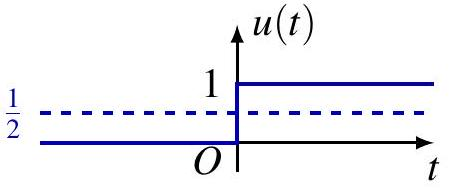
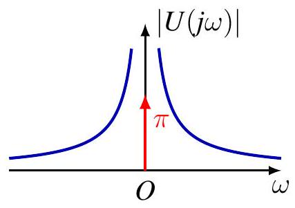

$$
\operatorname{sgn}(t)= \begin{cases}1, & t>0 \\ -1 & t<0\end{cases}
$$

由于 $\operatorname{sgn}=2 u-1$,

$$
\mathcal{F}\{\operatorname{sgn}\}(j \omega)=2 U(j \omega)-2 \pi \delta(\omega)=\frac{2}{j \omega}
$$

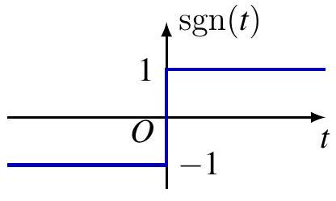

## 积分

例. 单位斜坡函数 $u_{-2}(t)=t u(t)$

$$
u_{-2}(t)=\int_{-\infty}^{t} u(\tau) d \tau
$$

积分性质（积分 property）建议 $\mathcal{F} \{u_{-2}\}(j\omega) = \frac{1}{j\omega}U(j\omega) + \pi U(0)\delta(\omega)$。
代入阶跃函数 $u(t)$ 的变换 $U(j\omega) = \frac{1}{j\omega} + \pi\delta(\omega)$，可得：

$$\mathcal{F} \{u_{-2}\}(j\omega) = -\frac{1}{\omega^2} + \frac{\pi}{j\omega}\delta(\omega) + \pi U(0)\delta(\omega)$$

### 遇到的问题：定义不明确

但是，$U(0) = \frac{1}{j0} + \pi\delta(0)$ 是什么？$\frac{\pi}{j\omega}\delta(\omega)$ 又是什么？
这些在数学上**定义不明确（Not well-defined）**！

因此，**积分性质在此处不适用！**

---

### 正确结果与经验法则

我们将看到：
$$\mathcal{F} \{u_{-2}\} = -\frac{1}{\omega^2} + j\pi\delta'(\omega)$$

**经验法则（Rule of thumb）：**
积分性质仅在公式定义明确（Well-defined）的情况下才适用。

例
$x(t)=\left(1-\frac{2|t|}{T}\right)\left[u\left(t+\frac{T}{2}\right)-u\left(t-\frac{T}{2}\right)\right]$
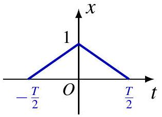
$X_{2}(j \omega)=\frac{2}{T}\left[e^{j \frac{\omega T}{2}}-2+e^{-j \frac{\omega T}{2}}\right]=-\frac{8}{T} \sin ^{2}\left(\frac{\omega T}{4}\right)$
$X_{1}(j \omega)=\frac{X_{2}(j \omega)}{j \omega}+\pi X_{2}(0) \delta(\omega)=-\frac{8 \sin ^{2}\left(\frac{\omega T}{4}\right)}{j \omega T}$
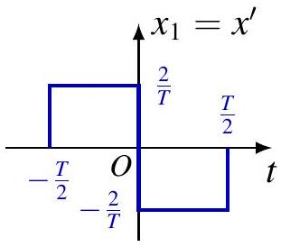
$X(j \omega)=\frac{X_{1}(j \omega)}{j \omega}+\pi X_{1}(0) \delta(\omega)=\frac{8 \sin ^{2}\left(\frac{\omega T}{4}\right)}{\omega^{2} T}$
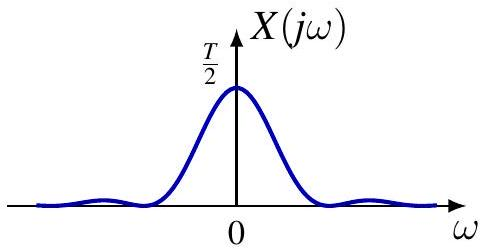
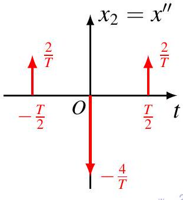

20/32

## 例: 符号函数 sgn

$$
x(t)=\operatorname{sgn}(t) \stackrel{\mathcal{F}}{\longleftrightarrow} X(j \omega)=\frac{2}{j \omega}
$$

### 广义函数（分布）的理解

* $x$ 和 $X$ 均不属于 $L_1(\mathbb{R})$ 空间，上述内容应在**广义函数（分布）**的意义下进行解释，即：
  $$(X, \phi) = (x, \mathcal{F}\{\phi\}), \quad \forall \phi \in \mathcal{S}$$
  或者通过逼近序列 $x_n \to x$ 来定义：
  $$(X, \phi) = \lim_{n} (X_n, \phi), \quad \forall \phi \in \mathcal{S}$$

---

### 柯西主值 (Cauchy Principal Value)

* 由于 $\frac{2}{j\omega}$ 在 $\omega = 0$ 处不可积，因此 $X$ 应被解释为**主值**，通常记作 $X(j\omega) = \text{pv} \left( \frac{2}{j\omega} \right)$，即：
  $$(X, \phi) = \int_{\mathbb{R}} \text{pv} \left( \frac{2}{j\omega} \right) \phi(\omega) d\omega \triangleq \lim_{\epsilon \to 0} \int_{|\omega| \ge \epsilon} \frac{2}{j\omega} \phi(\omega) d\omega$$

## 例: 符号函数 sgn

**断言（Claim）**：下方的柯西主值定义是定义明确的（well-defined）：

$$
\int_{\mathbb{R}} \text{pv} \left( \frac{1}{\omega} \right) \phi(\omega) d\omega \triangleq \lim_{\epsilon \to 0} \int_{|\omega| \ge \epsilon} \frac{1}{\omega} \phi(\omega) d\omega
$$

**证明**：

* $\int_{|\omega| \ge 1} \frac{1}{\omega} \phi(\omega) d\omega$ 是定义明确的，因为测试函数 $\phi$ 是快速递减的（rapidly decreasing）。
* 由于在对称区间上的积分 $\int_{1 \ge |\omega| \ge \epsilon} \frac{1}{\omega} d\omega = 0$（利用 $1/\omega$ 的奇对称性），我们可以写出：

$$
\int_{1 \ge |\omega| \ge \epsilon} \frac{1}{\omega} \phi(\omega) d\omega = \int_{1 \ge |\omega| \ge \epsilon} \frac{\phi(\omega) - \phi(0)}{\omega} d\omega
$$

* 根据**中值定理（Intermediate Value Theorem / Mean Value Theorem）**，存在 $\xi$ 使得：
    $$\left| \frac{\phi(\omega) - \phi(0)}{\omega} \right| = |\phi'(\xi)| \le \|\phi\|_{0,1}$$

* 因此，我们可以得到以下估计：

$$
\left| \int_{1 \ge |\omega| \ge \epsilon} \frac{1}{\omega} \phi(\omega) d\omega \right| = \int_{1 \ge |\omega| \ge \epsilon} \left| \frac{\phi(\omega) - \phi(0)}{\omega} \right| d\omega \le 2 \|\phi\|_{0,1}
$$

## 例: 符号函数 sgn

以下是针对您上传的关于符号函数 (sgn) 傅里叶变换证明页面的翻译，并以 .qmd (Quarto Markdown) 格式输出：

Code snippet
---
title: "符号函数傅里叶变换的证明"
format: html
---

**断言 (Claim)**：
$$\mathcal{F}\{\text{sgn}\}(j\omega) = \text{pv} \left( \frac{2}{j\omega} \right)$$

---

**证明**：
令 $x_a(t) = \text{sgn}(t)e^{-a|t|}$，其中 $a > 0$。
当 $a \to 0$ 时，$x_a \to x$ 在逐点意义及广义函数意义下均成立（将极限移至积分符号内是合法的）：

$$\lim_{a \to 0} \int_{\mathbb{R}} x_a(t)\phi(t) = \int_{\mathbb{R}} \lim_{a \to 0} x_a(t)\phi(t) = \int_{\mathbb{R}} x(t)\phi(t)dt$$

---

**回顾 (Recall)**：
$$X_a(j\omega) = \frac{-2j\omega}{a^2 + \omega^2}$$

对于 $\omega \neq 0$，当 $a \to 0$ 时，$X_a(j\omega) \to \frac{2}{j\omega}$ 在逐点意义下成立。但我们需要证明：

$$\int_{\mathbb{R}} X_a(j\omega)\phi(\omega)d\omega \to \int_{\mathbb{R}} \text{pv} \left( \frac{2}{j\omega} \right) \phi(\omega)d\omega$$

## 例: 符号函数 sgn

*断言 (Claim)**：

$$
\lim_{a \to 0} \int_{\mathbb{R}} \frac{\omega}{a^2 + \omega^2} \phi(\omega) d\omega = \lim_{\epsilon \to 0} \int_{|\omega| \ge \epsilon} \frac{1}{\omega} \phi(\omega) d\omega
$$

---

**证明**：  
由于 $\frac{\omega}{a^2 + \omega^2} \phi(\omega) \in L_1(\mathbb{R})$，

$$
\int_{\mathbb{R}} \frac{\omega}{a^2 + \omega^2} \phi(\omega) d\omega = \lim_{\epsilon \to 0} \int_{|\omega| \ge \epsilon} \frac{\omega}{a^2 + \omega^2} \phi(\omega) d\omega
$$

---

**需要证明**：  
$\lim_{a \to 0} \lim_{\epsilon \to 0} |J| = 0$，其中：

$$
J = \int_{|\omega| \ge \epsilon} \left( \frac{\omega}{a^2 + \omega^2} - \frac{1}{\omega} \right) \phi(\omega) d\omega = \int_{|\omega| \ge \epsilon} \frac{-a^2}{\omega (a^2 + \omega^2)} \phi(\omega) d\omega
$$

## 例: 符号函数 sgn

**证明（续）**。利用 $0 = \int_{|\omega| \ge \epsilon} \frac{-a^2}{\omega(a^2 + \omega^2)} d\omega$，我们得到：

$$J = \int_{|\omega| \ge \epsilon} \frac{-a^2}{a^2 + \omega^2} \cdot \frac{\phi(\omega) - \phi(0)}{\omega} d\omega$$

根据**中值定理**，$\left| \frac{\phi(\omega) - \phi(0)}{\omega} \right| = |\phi'(\xi)| \le \|\phi\|_{0,1}$。

那么误差项 $J$ 的绝对值满足：

$$
\begin{aligned}
|J| &\le \int_{|\omega| \ge \epsilon} \left| \frac{-a^2}{a^2 + \omega^2} \cdot \frac{\phi(\omega) - \phi(0)}{\omega} \right| d\omega \le \int_{|\omega| \ge \epsilon} \frac{a^2}{a^2 + \omega^2} \|\phi\|_{0,1} d\omega \\
&\le \int_{\mathbb{R}} \frac{a^2}{a^2 + \omega^2} \|\phi\|_{0,1} d\omega = a\pi \|\phi\|_{0,1}
\end{aligned}
$$

**因此**：

$$\lim_{a \to 0} \lim_{\epsilon \to 0} |J| = 0$$

## 例: 单位阶跃函数

$$
u(t) \stackrel{\mathcal{F}}{\longleftrightarrow} U(j \omega)=\frac{1}{j \omega}+\pi \delta(\omega)
$$

NB. More precisely, $U(j \omega)=\mathrm{pv}\left(\frac{1}{j \omega}\right)+\pi \delta(\omega)$
证明。 Note $u(t)=\frac{1}{2} \operatorname{sgn}(t)+\frac{1}{2}$. By linearity

$$
U(j \omega)=\frac{1}{2} \mathcal{F}\{\operatorname{sgn}\}(j \omega)+\frac{1}{2} \mathcal{F}\{1\}(j \omega)=\frac{1}{j \omega}+\pi \delta(\omega)
$$

Remark. Can use approximation approach but with caution.

- Let $x_{a}(t)=e^{-a t} u(t)$ for $a>0$. Note $x_{a} \rightarrow u$ pointwise and in distribution as $a \rightarrow 0$.
- For $\omega \neq 0, X_{a}(j \omega)=\frac{1}{a+j \omega} \rightarrow \frac{1}{j \omega}$ pointwise as $a \downarrow 0$.
- Tempting to conclude $U(j \omega)=\frac{1}{j \omega}$.
- But need convergence in distribution !

## 对偶性

$$
\begin{aligned}
\mathcal{F}\{f\}(\eta) & =\int_{\mathbb{R}} f(\xi) e^{-j \eta \xi} d \xi \\
\mathcal{F}^{-1}\{f\}(\eta) & =\frac{1}{2 \pi} \int_{\mathbb{R}} f(\xi) e^{j \eta \xi} d \xi
\end{aligned}
$$

Identical except for

- different signs in exponent of complex exponential
- constant factor $\frac{1}{2 \pi}$

$$
\mathcal{F}\{f\}(\eta)=\int_{\mathbb{R}} f(\xi) e^{-j \eta \xi} d \xi=\int_{\mathbb{R}} f(-\xi) e^{j \eta \xi} d \xi=\mathcal{F}^{-1}\{2 \pi R f\}(\eta)
$$

对偶性

$$
f \stackrel{\mathcal{F}}{\longleftrightarrow} g \Longleftrightarrow g \stackrel{\mathcal{F}}{\Longleftrightarrow} 2 \pi R f \Longleftrightarrow R g \stackrel{\mathcal{F}}{\Longleftrightarrow} 2 \pi f
$$

## 对偶性

$$
\begin{aligned}
\mathcal{F}\{f\}(\eta) & =\int_{\mathbb{R}} f(\xi) e^{-j \eta \xi} d \xi \\
\mathcal{F}^{-1}\{f\}(\eta) & =\frac{1}{2 \pi} \int_{\mathbb{R}} f(\xi) e^{j \eta \xi} d \xi
\end{aligned}
$$

Identical except for

- different signs in exponent of complex exponential
- constant factor $\frac{1}{2 \pi}$

$$
\overline{\mathcal{F}\{f\}}=\left(\int_{\mathbb{R}} f(\xi) e^{-j \eta \xi} d \xi\right)^{*}=\int_{\mathbb{R}} f^{*}(\xi) e^{j \eta \xi} d \xi=\mathcal{F}^{-1}\left\{2 \pi f^{*}\right\}
$$

对偶性

$$
f \stackrel{\mathcal{F}}{\longleftrightarrow} g \quad \Longleftrightarrow \quad g^{*} \stackrel{\mathcal{F}}{\longleftrightarrow} 2 \pi f^{*}
$$

## 对偶性

$$
u(t+a)-u(t-a) \stackrel{\mathcal{F}}{\longleftrightarrow} \frac{2 \sin (a \omega)}{\omega}
$$

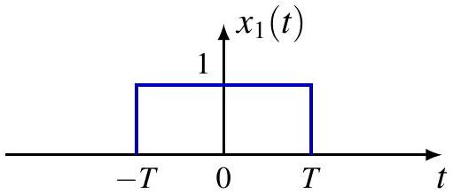

$$
\stackrel{\mathcal{F}}{\longmapsto}
$$

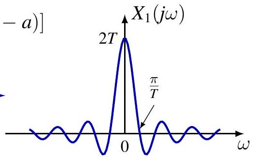
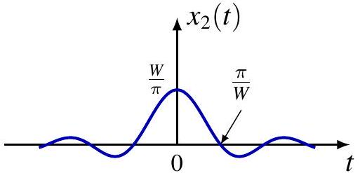

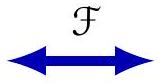
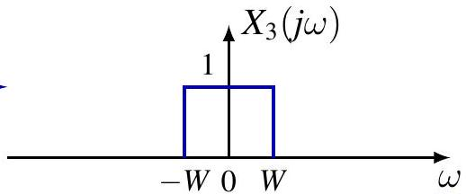

## 对偶性

例. $x(t)=\frac{1}{t}$ (more precisely, $\mathrm{pv}\left(\frac{1}{t}\right)$ )
Know

$$
\operatorname{sgn}(t) \stackrel{\mathcal{F}}{\longleftrightarrow} \frac{1}{j \omega}
$$

By duality

$$
-\frac{1}{j t} \stackrel{\mathcal{F}}{\longleftrightarrow} 2 \pi \operatorname{sgn}(\omega)
$$

- switch LHS and RHS, switch $\omega$ and $t$
- do either of following (but not both)
- take complex conjugate of both sides
- substitute $\omega \rightarrow-\omega$ or $t \rightarrow-t$ (but not both)
- multiply RHS by $2 \pi$

By linearity

$$
\frac{1}{t} \stackrel{\mathcal{F}}{\longleftrightarrow}-j 2 \pi \operatorname{sgn}(\omega)
$$

## 对偶性

例. $x(t)=\frac{1}{1+t^{2}}$
Know

$$
e^{-|t|} \stackrel{\mathcal{F}}{\longleftrightarrow} \frac{2}{1+\omega^{2}}
$$

By duality

$$
\frac{2}{1+t^{2}} \stackrel{\mathcal{F}}{\longleftrightarrow} 2 \pi e^{-|\omega|}
$$

- switch LHS and RHS, switch $\omega$ and $t$
- do either of following (but not both)
- take complex conjugate of both sides
- substitute $\omega \rightarrow-\omega$ or $t \rightarrow-t$ (but not both)
- multiply RHS by $2 \pi$

By linearity

$$
\frac{1}{1+t^{2}} \stackrel{\mathcal{F}}{\longleftrightarrow} \pi e^{-|\omega|}
$$

## 对偶性

微分 in frequency

$$
-j t x(t) \stackrel{\mathcal{F}}{\longleftrightarrow} \frac{d X(j \omega)}{d \omega}
$$

证明。 Differentiate under integral sign

$$
X(j \omega)=\int_{\mathbb{R}} x(t) e^{-j \omega t} d t \Longrightarrow \frac{d X(j \omega)}{d \omega}=\int_{\mathbb{R}}(-j t) x(t) e^{-j \omega t} d t
$$

例. Unit ramp function $u_{-2}=t u(t)$

$$
\mathcal{F}\left\{u_{-2}\right\}=j \mathcal{F}\{-j t u\}=j \frac{d U(j \omega)}{d \omega}=-\frac{1}{\omega^{2}}+j \pi \delta^{\prime}(\omega)
$$

积分 in frequency

$$
-\frac{1}{j t} x(t)+\pi x(0) \delta(t) \stackrel{\mathcal{F}}{\longleftrightarrow} \int_{-\infty}^{\omega} X(j \lambda) d \lambda
$$

## 帕塞瓦尔恒等式

定理。 If $x \in L_{2}(\mathbb{R}), X=\mathcal{F}\{x\}$, then

$$
\|x\|_{2}^{2}=\frac{1}{2 \pi}\|X\|_{2}^{2}, \quad \text { or } \quad \int_{\mathbb{R}}|x(t)|^{2} d t=\frac{1}{2 \pi} \int_{\mathbb{R}}|X(j \omega)|^{2} d \omega
$$

Note $\omega$ is angular frequency and $\frac{\omega}{2 \pi}$ is frequency

$$
\int_{\mathbb{R}}|x(t)|^{2} d t=\int_{\mathbb{R}}|X(j \omega)|^{2} \frac{d \omega}{2 \pi}
$$

物理解释: Energy conservation

- $|x(t)|^{2}$ power, or energy per unit time (second)
- $|X(j \omega)|^{2}$ energy per unit frequency (Hertz)
$|X(j \omega)|^{2}$ called 能量密度谱

## 帕塞瓦尔恒等式

定理。 If $x, y \in L_{2}(\mathbb{R}), X=\mathcal{F}\{x\}, Y=\mathcal{F}\{y\}$, then $\langle x, y\rangle=\frac{1}{2 \pi}\langle X, Y\rangle, \quad$ or $\quad \int_{\mathbb{R}} x(t) y^{*}(t) d t=\frac{1}{2 \pi} \int_{\mathbb{R}} X(j \omega) Y^{*}(j \omega) d \omega$
"证明。"

$$
\begin{aligned}
\int_{\mathbb{R}} x(t) y^{*}(t) d t & =\int_{\mathbb{R}} x(t)\left(\frac{1}{2 \pi} \int_{R} Y(j \omega) e^{j \omega t} d \omega\right)^{*} d t \\
& =\frac{1}{2 \pi} \int_{\mathbb{R}} x(t) \int_{R} Y^{*}(j \omega) e^{-j \omega t} d \omega d t \\
& =\frac{1}{2 \pi} \int_{\mathbb{R}}\left(\int_{\mathbb{R}} x(t) e^{-j \omega t} d t\right) Y^{*}(j \omega) d \omega \\
& =\frac{1}{2 \pi} \int_{\mathbb{R}} X(j \omega) Y^{*}(j \omega) d \omega
\end{aligned}
$$

## 帕塞瓦尔恒等式

例.

$$
\frac{\sin (W t)}{\pi t} \stackrel{\mathcal{F}}{\longleftrightarrow} u(\omega+W)-u(\omega-W)
$$

By Parseval's identity

$$
\begin{aligned}
\int_{\mathbb{R}} \frac{\sin ^{2}(W t)}{\pi^{2} t^{2}} d t & =\frac{1}{2 \pi} \int_{\mathbb{R}}|u(\omega+W)-u(\omega-W)|^{2} d \omega \\
& =\frac{1}{2 \pi} \int_{-W}^{W} d \omega \\
& =\frac{W}{\pi}
\end{aligned}
$$

## 目录 {#toc2}

- [1. 非周期信号的表示：连续时间傅里叶变换](#sec41)
- [2. 连续时间傅里叶变换的性质](#sec42)
- [**3. 卷积性质**](#sec44)
- [4. 相乘性质](#sec45)
- [5. 变换性质和变换对列表](#sec46)
- [6. 由线性常系数微分方程表征的系统](#sec47)

# 3. 卷积性质 {#sec43}

For LTI systems $T$ with

- 冲激响应 $h$
- 频率响应 $H(j \omega)=\int_{\mathbb{R}} h(t) e^{-j \omega t} d t=\mathcal{F}\{h\}$
$e^{j \omega t}$ is eigenfunction associated with eigenvalue $H(j \omega)$

$$
T\left(e^{j \omega t}\right)=H(j \omega) e^{\omega t}
$$

Input $x$ is linear superposition of $e^{j \omega t}$

$$
x(t)=\frac{1}{2 \pi} \int_{\mathbb{R}} X(j \omega) e^{j \omega t} d \omega
$$

Output

$$
\begin{aligned}
y(t) & =(x * h)(t)=T\left(\frac{1}{2 \pi} \int_{\mathbb{R}} X(j \omega) e^{j \omega t} d \omega\right) \\
& =\frac{1}{2 \pi} \int_{\mathbb{R}} X(j \omega) T\left(e^{j \omega t}\right) d \omega=\frac{1}{2 \pi} \int_{\mathbb{R}} X(j \omega) H(j \omega) e^{j \omega t} d \omega
\end{aligned}
$$

## 卷积性质

$$
\mathcal{F}\{x * y\}=\mathcal{F}\{x\} \mathcal{F}\{y\}, \quad \text { or } \quad(x * y)(t) \stackrel{\mathcal{F}}{\longleftrightarrow} X(j \omega) Y(j \omega)
$$

convolution in time ⟹ multiplication in frequency
"Proof".

$$
\begin{aligned}
\int_{\mathbb{R}}(x * y)(t) e^{-j \omega t} d t & =\int_{\mathbb{R}} \int_{\mathbb{R}} x(\tau) y(t-\tau) e^{-j \omega t} d \tau d t \\
& =\int_{\mathbb{R}} x(\tau)\left(\int_{\mathbb{R}} y(t-\tau) e^{-j \omega t} d t\right) d \tau \\
& =\int_{\mathbb{R}} x(\tau) Y(j \omega) e^{-j \omega \tau} d \tau \\
& =Y(j \omega) \int_{\mathbb{R}} x(\tau) e^{-j \omega \tau} d \tau \\
& =Y(j \omega) X(j \omega)
\end{aligned}
$$

例

$$
\begin{gathered}
x(t)=\left(1-\frac{2|t|}{T}\right)\left[u\left(t+\frac{T}{2}\right)-u\left(t-\frac{T}{2}\right)\right] \\
x=x_{1} * x_{1}
\end{gathered}
$$

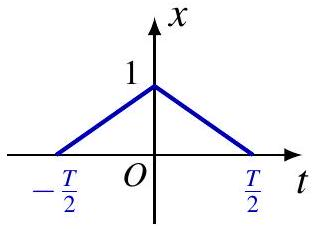

$$
\begin{gathered}
X_{1}(j \omega)=\sqrt{\frac{2}{T}} \cdot \frac{2 \sin \left(\frac{\omega T}{4}\right)}{\omega} \\
X(j \omega)=X_{1}^{2}(j \omega)=\frac{8 \sin ^{2}\left(\frac{\omega T}{4}\right)}{\omega^{2} T}
\end{gathered}
$$

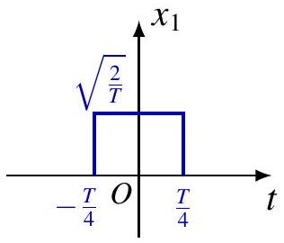
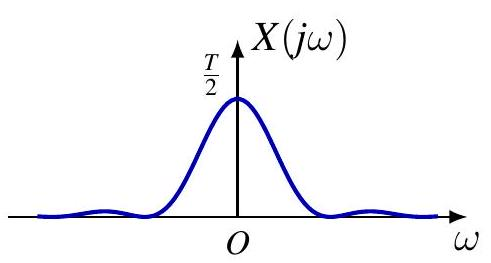
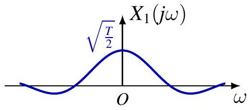

## LTI 系统的频率响应

LTI system $T$

- fully characterized by 冲激响应 $h$

$$
y=T(x)=h * x
$$

- also fully characterized by 频率响应 $H=\mathcal{F}\{h\}$, if $H$ is well-defined
- BIBO stable system, $h \in L_{1}(\mathbb{R})$
- other systems: identity $h=\delta$, differentiator $h=\delta^{\prime}, \ldots$

Typically, convolution property implies

$$
Y=\mathcal{F}\{y\}=H X=\mathcal{F}\{h\} \mathcal{F}\{x\}
$$

Instead of computing $x * h$, can do

$$
y=\mathcal{F}^{-1}(\mathcal{F}\{h\} \mathcal{F}\{x\})
$$

LTI 系统的频率响应

|  | $h(t)$ | $H(j \omega)$ |
| :--- | :--- | :--- |
| id | $\delta(t)$ | 1 |
| $\tau_{t_{0}}$ | $\delta\left(t-t_{0}\right)$ | $e^{-j \omega t_{0}}$ |
| $\frac{d}{d t}$ | $\delta^{\prime}(t)$ | $j \omega$ |
| $\int_{-\infty}^{t}$ | $u(t)$ | $\frac{1}{j \omega}+\pi \delta(\omega)$ |
| ideal lowpass | $\frac{\sin \left(\omega_{c} t\right)}{\pi t}$ | $u\left(\omega+\omega_{c}\right)-u\left(\omega-\omega_{c}\right)$ |
| 1st order lowpass | $\frac{1}{\tau} e^{-t / \tau} u(t)$ | $\frac{1}{1+j \tau \omega}$ |

## 例s

例. Differentiation property

$$
\begin{gathered}
y=x^{\prime}=x * \delta^{\prime} \\
Y(j \omega)=X(j \omega) \mathcal{F}\left\{\delta^{\prime}\right\}=j \omega X(j \omega)
\end{gathered}
$$

例. Integration property

$$
\begin{gathered}
y(t)=\int_{-\infty}^{t} x(\tau) d \tau=(x * u)(t) \\
Y(j \omega)=X(j \omega) U(j \omega)=X(j \omega)\left[\frac{1}{j \omega}+\pi \delta(\omega)\right]=\frac{1}{j \omega} X(j \omega)+\pi X(0) \delta(\omega)
\end{gathered}
$$

## 例

Unit ramp function $u_{-2}(t)=t u(t)=(u * u)(t)$
Convolution property suggests

$$
\mathcal{F}\left\{u_{-2}\right\}(j \omega)=U^{2}(j \omega)=-\frac{1}{\omega^{2}}+\frac{2 \pi}{j \omega} \delta(\omega)+\pi^{2} \delta(\omega) \delta(\omega)
$$

But $\frac{\pi}{j \omega} \delta(\omega)$ and $\delta(\omega) \delta(\omega)$ not well-defined!
Know $\mathcal{F}\left\{u_{-2}\right\}=-\frac{1}{\omega^{2}}+j \pi \delta^{\prime}(\omega)$
Convolution property not applicable here!
Rule of thumb. Applicable when formula is well-defined

## 例

Response of LTI system with 冲激响应 $h(t)=e^{-a t} u(t)$ to input $x(t)=e^{-b t} u(t), a, b>0$

方法 1. Direct convolution $y=x * h$
方法 2. Solve following ODE with initial rest condition

$$
y^{\prime}(t)+a y(t)=e^{-b t} u(t)
$$

方法 3. Fourier transform.

$$
H(j \omega)=\frac{1}{a+j \omega}, X(j \omega)=\frac{1}{b+j \omega} \Longrightarrow Y(j \omega)=\frac{1}{(a+j \omega)(b+j \omega)}
$$

If $a \neq b, Y(j \omega)=\frac{1}{b-a}\left(\frac{1}{a+j \omega}-\frac{1}{b+j \omega}\right) \Longrightarrow y(t)=\frac{1}{b-a}\left(e^{-a t}-e^{-b t}\right) u(t)$
If $a=b, Y(j \omega)=-\frac{d}{d a}\left(\frac{1}{a+j \omega}\right) \Longrightarrow y(t)=-\frac{d}{d a} e^{-a t} u(t)=t e^{-a t} u(t)$
Can also use $Y(j \omega)=j \frac{d}{d \omega}\left(\frac{1}{a+j \omega}\right)$ and differentiation property

## 例

Response of LTI system with 冲激响应 $h(t)=e^{-a t} u(t)$ to input $x(t)=\cos \left(\omega_{0} t\right), a>0$.
频率响应

$$
H(j \omega)=\frac{1}{a+j \omega}=\frac{1}{\sqrt{a^{2}+\omega^{2}}} e^{-j \arctan \frac{\omega}{a}}
$$

方法 1. Use eigenfunction property

$$
\begin{gathered}
x(t)=\frac{1}{2} e^{j \omega_{0} t}+\frac{1}{2} e^{-j \omega_{0} t} \\
y(t)=\frac{1}{2} H\left(j \omega_{0}\right) e^{j \omega_{0} t}+\frac{1}{2} H\left(-j \omega_{0}\right) e^{-j \omega_{0} t}=\operatorname{Re} \frac{e^{j \omega_{0} t}}{a+j \omega_{0}} \\
=\frac{a \cos \left(\omega_{0} t\right)+\omega_{0} \sin \left(\omega_{0} t\right)}{a^{2}+\omega_{0}^{2}}=\frac{1}{\sqrt{a^{2}+\omega_{0}^{2}}} \cos \left(\omega_{0} t-\arctan \frac{\omega_{0}}{a}\right)
\end{gathered}
$$

## 例

Response of LTI system with 冲激响应 $h(t)=e^{-a t} u(t)$ to input $x(t)=\cos \left(\omega_{0} t\right)$.

频率响应

$$
H(j \omega)=\frac{1}{a+j \omega}=\frac{1}{\sqrt{a^{2}+\omega^{2}}} e^{-j \arctan \frac{\omega}{a}}
$$

方法 2. Use Fourier transform of $X$

$$
\begin{gathered}
X(j \omega)=\pi \delta\left(\omega-\omega_{0}\right)+\pi \delta\left(\omega+\omega_{0}\right) \\
Y(j \omega)=\pi H\left(j \omega_{0}\right) \delta\left(\omega-\omega_{0}\right)+\pi H\left(-j \omega_{0}\right) \delta\left(\omega+\omega_{0}\right) \\
y(t)=\frac{1}{2} H\left(j \omega_{0}\right) e^{j \omega_{0} t}+\frac{1}{2} H\left(-j \omega_{0}\right) e^{-j \omega_{0} t}
\end{gathered}
$$

## 例

Response of ideal lowpass filter with 冲激响应 $h(t)$ to input $x(t)$.

$$
h(t)=\frac{\sin \left(\omega_{c} t\right)}{\pi t}, \quad x(t)=\frac{\sin \left(\omega_{i} t\right)}{\pi t}
$$

Fourier transforms

$$
\begin{aligned}
& X(j \omega)=u\left(\omega+\omega_{i}\right)-u\left(\omega-\omega_{i}\right) \\
& H(j \omega)=u\left(\omega+\omega_{c}\right)-u\left(\omega-\omega_{c}\right)
\end{aligned}
$$

Use $Y(j \omega)=X(j \omega) H(j \omega)$,

$$
Y(j \omega)=\left\{\begin{array}{ll}
X(j \omega), & \text { if } \omega_{i} \leq \omega_{c} \\
H(j \omega), & \text { if } \omega_{i}>\omega_{c}
\end{array} \Longrightarrow y(t)= \begin{cases}x(t), & \text { if } \omega_{i} \leq \omega_{c} \\
h(t), & \text { if } \omega_{i}>\omega_{c}\end{cases}\right.
$$

NB. Convolution of two sinc is another sinc

## 例

Convolution of Gaussians is another Gaussian

$$
x_{i}(t)=\frac{1}{\sqrt{2 \pi \sigma_{i}^{2}}} \exp \left(-\frac{\left(t-\mu_{i}\right)^{2}}{2 \sigma_{i}^{2}}\right)
$$

Fourier transform (complex conjugate of characteristic function)

$$
X_{i}(j \omega)=\exp \left(-i \mu_{i} \omega-\frac{\sigma_{i}^{2}}{2} \omega^{2}\right)
$$

For $y=x_{1} * x_{2}$,

$$
\begin{gathered}
Y(j \omega)=X_{1}(j \omega) X_{2}(j \omega)=\exp \left(-i\left(\mu_{1}+\mu_{2}\right) \omega-\frac{\sigma_{1}^{2}+\sigma_{2}^{2}}{2} \omega^{2}\right) \\
y(t)=\frac{1}{\sqrt{2 \pi\left(\sigma_{1}^{2}+\sigma_{2}^{2}\right)}} \exp \left(-\frac{\left(t-\mu_{1}-\mu_{2}\right)^{2}}{2\left(\sigma_{1}^{2}+\sigma_{2}^{2}\right)}\right)
\end{gathered}
$$

## 系统连接

LTI systems in 串联系统

$$
y=\left(x * h_{1}\right) * h_{2}=x *\left(h_{1} * h_{2}\right)=\left(x * h_{2}\right) * h_{1}
$$

$$
h=h_{1} * h_{2}
$$

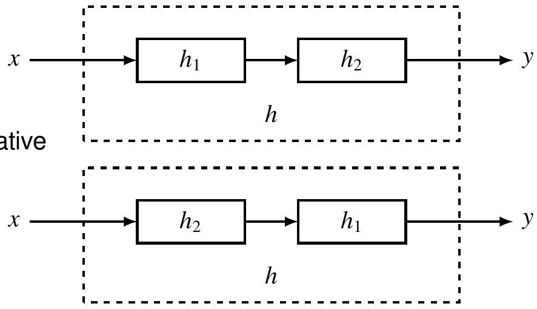

对 LTI 系统而言，处理顺序通常不影响结果

## 系统连接

LTI systems in 串联系统

$$
Y=\left(X H_{1}\right) H_{2}=X\left(H_{1} H_{2}\right)=\left(X H_{2}\right) H_{1}
$$

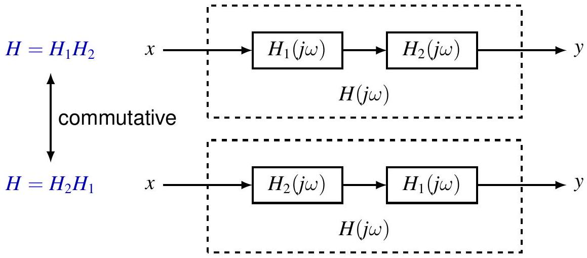

对 LTI 系统而言，处理顺序通常不影响结果

## 系统连接

LTI systems in systems in 并联系统

$$
h=h_{1}+h_{2}
$$

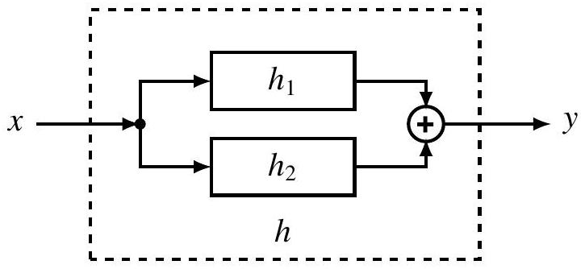

$$
H=H_{1}+H_{2}
$$

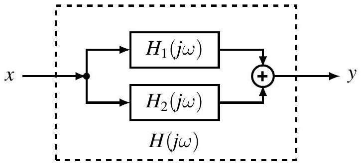

## 系统连接

LTI systems in systems in 反馈连接

$$
\begin{gathered}
y=h_{1} *\left(x-h_{2} * y\right) \\
h=?
\end{gathered}
$$

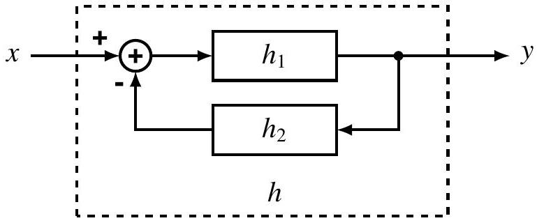

$$
\begin{aligned}
Y & =H_{1} X-H_{1} H_{2} Y \\
H & =\frac{Y}{X}=\frac{H_{1}}{1+H_{1} H_{2}}
\end{aligned}
$$

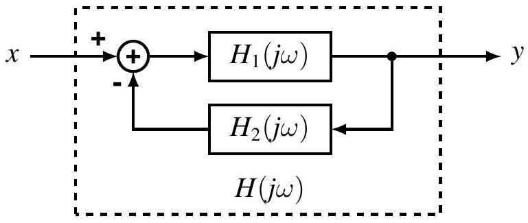

## 目录 {#toc3}

- [1. 非周期信号的表示：连续时间傅里叶变换](#sec41)
- [2. 连续时间傅里叶变换的性质](#sec42)
- [3. 卷积性质](#sec43)
- [**4. 相乘性质**](#sec44)
- [5. 变换性质和变换对列表](#sec45)
- [6. 由线性常系数微分方程表征的系统](#sec46)

# 4. 乘积性质{#sec44}

## 卷积性质的对偶

$$
\mathcal{F}\{x y\}=\frac{1}{2 \pi} \mathcal{F}\{x\} * \mathcal{F}\{y\}, \text { or } x(t) y(t) \stackrel{\mathcal{F}}{\longleftrightarrow} \frac{1}{2 \pi} \int_{\mathbb{R}} X(j \theta) Y(j(\omega-\theta)) d \theta
$$

时域相乘 ⟹ 频域卷积
证明。 Let $Z(j \omega)=\frac{1}{2 \pi} \int_{\mathbb{R}} X(j \theta) Y(j(\omega-\theta)) d \theta$

$$
\begin{aligned}
\frac{1}{2 \pi} \int_{\mathbb{R}} Z(j \omega) e^{j \omega t} d \omega & =\frac{1}{2 \pi} \int_{\mathbb{R}} \frac{1}{2 \pi}\left(\int_{\mathbb{R}} X(j \theta) Y(j(\omega-\theta)) d \theta\right) e^{j \omega t} d \omega \\
& =\frac{1}{2 \pi} \int_{\mathbb{R}} X(j \theta) \frac{1}{2 \pi}\left(\int_{\mathbb{R}} Y(j(\omega-\theta)) e^{j \omega t} d \omega\right) d \theta \\
& =\frac{1}{2 \pi} \int_{\mathbb{R}} X(j \theta) y(t) e^{j \theta t} d \theta=x(t) y(t)
\end{aligned}
$$

## 例: 调制

Baseband signal $x(t)$
Carrier

$$
\begin{aligned}
& p(t)=\cos \left(\omega_{c} t\right) \\
& P(j \omega)=\pi \delta\left(\omega-\omega_{c}\right)+\pi \delta\left(\omega+\omega_{c}\right)
\end{aligned}
$$

Modulated signal

$$
\begin{aligned}
& y(t)=x(t) p(t) \\
& Y(j \omega)=\frac{1}{2} X\left(j\left(\omega-\omega_{c}\right)\right)+\frac{1}{2} X\left(j\left(\omega+\omega_{c}\right)\right)
\end{aligned}
$$

## 例: 解调

Modulated signal $y(t)$
Carrier

$$
\begin{aligned}
& p(t)=\cos \left(\omega_{c} t\right) \\
& P(j \omega)=\pi \delta\left(\omega-\omega_{c}\right)+\pi \delta\left(\omega+\omega_{c}\right)
\end{aligned}
$$

解调

$$
\begin{aligned}
& z(t)=y(t) p(t) \\
& \quad=\frac{1}{2} x(t)+\frac{1}{2} x(t) \cos \left(2 \omega_{c} t\right) \\
& R(j \omega)=Z(j \omega) H_{\text {lowpass }}(j \omega) \\
& r(t)=x(t)
\end{aligned}
$$

## 理想 AM 通信系统

例

$$
\begin{gathered}
x(t)=\frac{\sin t \cdot \sin \frac{t}{2}}{\pi t^{2}}=\pi x_{1}(t) x_{2}(t) \\
x_{1}(t)=\frac{\sin t}{\pi t} \\
x_{2}(t)=\frac{\sin \frac{t}{2}}{\pi t} \\
X=\frac{1}{2} X_{1} * X_{2}
\end{gathered}
$$

## 目录 {#toc4}

- [1. 非周期信号的表示：连续时间傅里叶变换](#sec41)
- [2. 连续时间傅里叶变换的性质](#sec42)
- [3. 卷积性质](#sec43)
- [4. 相乘性质](#sec44)
- [**5. 变换性质和变换对列表**](#sec45)
- [6. 由线性常系数微分方程表征的系统](#sec46)

# 5. 变换性质和变换对列表{#sec45}

## 目录 {#toc5}

- [1. 非周期信号的表示：连续时间傅里叶变换](#sec41)
- [2. 连续时间傅里叶变换的性质](#sec42)
- [3. 卷积性质](#sec43)
- [4. 相乘性质](#sec44)
- [5. 变换性质和变换对列表](#sec45)
- [**6. 由线性常系数微分方程表征的系统**](#sec46)

# 6. 线性常系数微分方程描述的系统{#sec46}

## 线性常系数微分方程

频率响应 of LTI system described by

$$
\sum_{k=0}^{N} a_{k} \frac{d^{k} y}{d t^{k}}=\sum_{k=0}^{M} b_{k} \frac{d^{k} x}{d t^{k}}
$$

方法 1. Use eigenfunction property

$$
x(t)=e^{j \omega t} \Longrightarrow y(t)=H(j \omega) e^{j \omega t}
$$

Substitution into ODE yields

$$
\begin{gathered}
\sum_{k=0}^{N} a_{k} H(j \omega)(j \omega)^{k} e^{j \omega t}=\sum_{k=0}^{M} b_{k}(j \omega)^{k} e^{j \omega t} \\
H(j \omega)=\frac{\sum_{k=0}^{M} b_{k}(j \omega)^{k}}{\sum_{k=0}^{N} a_{k}(j \omega)^{k}}
\end{gathered}
$$

## 线性常系数微分方程

方法 2. Take Fourier transform of both sides

$$
\mathcal{F}\left\{\sum_{k=0}^{N} a_{k} \frac{d^{k} y}{d t^{k}}\right\}=\mathcal{F}\left\{\sum_{k=0}^{M} b_{k} \frac{d^{k} x}{d t^{k}}\right\}
$$

By linearity and differentiation property

$$
\sum_{k=0}^{N} a_{k}(j \omega)^{k} Y(j \omega)=\sum_{k=0}^{M} b_{k}(j \omega)^{k} X(j \omega)
$$

By convolution property

$$
H(j \omega)=\frac{Y(j \omega)}{X(j \omega)}=\frac{\sum_{k=0}^{M} b_{k}(j \omega)^{k}}{\sum_{k=0}^{N} a_{k}(j \omega)^{k}}
$$

频率响应 is rational function of $j \omega$

## 例

$$
y^{\prime \prime}+4 y^{\prime}+3 y=x^{\prime}+2 x
$$

频率响应

$$
H(j \omega)=\frac{j \omega+2}{(j \omega)^{2}+4(j \omega)+3}
$$

By partial fraction expansion

$$
H(j \omega)=\frac{j \omega+2}{(j \omega+1)(j \omega+3)}=\frac{1 / 2}{j \omega+1}+\frac{1 / 2}{j \omega+3}
$$

Take inverse Fourier transform to find 冲激响应

$$
h(t)=\frac{1}{2} e^{-t} u(t)+\frac{1}{2} e^{-3 t} u(t)
$$

## 例

$$
y^{\prime \prime}+4 y^{\prime}+3 y=x^{\prime}+2 x
$$

Find zero-state response to $x(t)=e^{-t} u(t)$

$$
Y(j \omega)=H(j \omega) X(j \omega)=\frac{j \omega+2}{(j \omega+1)(j \omega+3)} \cdot \frac{1}{j \omega+1}=\frac{j \omega+2}{(j \omega+1)^{2}(j \omega+3)}
$$

By partial fraction expansion

$$
Y(j \omega)=\frac{1 / 4}{j \omega+1}+\frac{1 / 2}{(j \omega+1)^{2}}-\frac{1 / 4}{j \omega+3}
$$

Take inverse Fourier transform to find zero-state response

$$
y(t)=\left(\frac{1}{4} e^{-t}+\frac{1}{2} t e^{-t}-\frac{1}{4} e^{-3 t}\right) u(t)
$$

## Inverse Fourier Transform of $\frac{1}{(j \omega+a)^{n}}$

Recall

$$
e^{-a t} u(t) \stackrel{\mathcal{F}}{\longleftrightarrow} \frac{1}{a+j \omega}
$$

Note

$$
j^{n-1} \frac{d^{n-1}}{d \omega^{n-1}}\left(\frac{1}{a+j \omega}\right)=\left(j \frac{d}{d \omega}\right)^{n-1}\left(\frac{1}{a+j \omega}\right)=\frac{(n-1)!}{(a+j \omega)^{n}}
$$

Recall frequency differentiation property

$$
t x(t) \stackrel{\mathcal{F}}{\longleftrightarrow} j \frac{d}{d \omega} X(j \omega)
$$

Applying it $n-1$ times yields

$$
\frac{t^{n-1}}{(n-1)!} e^{-a t} u(t) \stackrel{\mathcal{F}}{\longleftrightarrow} \frac{1}{(a+j \omega)^{n}}
$$

## 部分分式展开

Rational function

$$
R(s)=\frac{P(s)}{Q(s)}=\frac{\sum_{k=0}^{M} b_{k} s^{k}}{\sum_{k=0}^{N} a_{k} s^{k}}
$$

Proper rational function if $M<N$
Improper rational function can be rewritten as sum of polynomial and proper rational function by long division

$$
R(s)=P_{0}(s)+\frac{P_{1}(s)}{Q(s)}
$$

where $\operatorname{deg} P_{1}<\operatorname{deg} Q$
例.

$$
\frac{s^{3}+5 s^{2}+8 s+5}{s^{2}+4 s+3}=s+1+\frac{s+2}{s^{2}+4 s+3}
$$

## 部分分式展开

例 (long division).

$$
\frac{s^{3}+5 s^{2}+8 s+5}{s^{2}+4 s+3}=s+1+\frac{s+2}{s^{2}+4 s+3}
$$

$$
\begin{aligned}
\left.s^{2}+4 s+3\right) & s+1 \\
\cline { 2 - 2 } \begin{array}{r}
s^{3}+5 s^{2}+8 s+5 \\
-s^{3}-4 s^{2}-3 s \\
s^{2}+5 s+5 \\
-s^{2}-4 s-3 \\
s+2
\end{array} & \\
\hline &
\end{aligned}
$$

## 部分分式展开

Consider proper rational function $R(s)=P(s) / Q(s)$
Denominator $Q(s)$ has $r$ distinct roots $a_{1}, \ldots, a_{r} \in \mathbb{C}$ and factorization

$$
Q(s)=\prod_{i=1}^{r}\left(s-a_{i}\right)^{N_{i}}
$$

$R(s)$ has following partial fraction expansion

$$
R(s)=\sum_{i=1}^{r} \sum_{k_{i}=1}^{N_{i}} \frac{A_{i, k_{i}}}{\left(s-a_{i}\right)^{k_{i}}}
$$

Find coefficients by

- reducing to common denominator
- comparing coefficients of numerators

## 部分分式展开

例.

$$
R(s)=\frac{s+2}{(s+1)^{2}(s+3)}=\frac{A_{1,1}}{s+1}+\frac{A_{1,2}}{(s+1)^{2}}+\frac{A_{2,1}}{s+3}
$$

RHS is

$$
\begin{aligned}
& \frac{A_{1,1}(s+1)(s+3)+A_{1,2}(s+3)+A_{2,1}(s+1)^{2}}{(s+1)^{2}(s+3)} \\
& =\frac{\left(A_{1,1}+A_{2,1}\right) s^{2}+\left(4 A_{1,1}+A_{1,2}+2 A_{2,1}\right) s+\left(3 A_{1,1}+3 A_{1,2}+A_{2,1}\right)}{(s+1)^{2}(s+3)} \\
& \left\{\begin{array} { r l } 
{ A _ { 1 , 1 } + A _ { 2 , 1 } } & { = 0 } \\
{ 4 A _ { 1 , 1 } + A _ { 1 , 2 } + 2 A _ { 2 , 1 } } & { = 1 } \\
{ 3 A _ { 1 , 1 } + 3 A _ { 1 , 2 } + A _ { 2 , 1 } } & { = 2 }
\end{array} \Rightarrow \left\{\begin{array}{l}
A_{1,1}=1 / 4 \\
A_{1,2}=1 / 2 \\
A_{2,1}=-1 / 4
\end{array}\right.\right.
\end{aligned}
$$

## 部分分式展开

$$
R(s)=\sum_{i=1}^{r} \sum_{k_{i}=1}^{N_{i}} \frac{A_{i, k_{i}}}{\left(s-a_{i}\right)^{k_{i}}}
$$

Multiply both sides by $\left(s-a_{j}\right)^{N_{j}}$,

$$
\left(s-a_{j}\right)^{N_{j}} R(s)=\sum_{k_{j}=1}^{N_{j}} A_{j, k_{j}}\left(s-a_{j}\right)^{N_{j}-k_{j}}+\left(s-a_{j}\right)^{N_{j}} R_{j}(s)
$$

where $R_{j}(s)=\sum_{i \neq j} \sum_{k_{i}=1}^{N_{i}} \frac{A_{i, k_{i}}}{\left(s-a_{i}\right)^{k_{i}}}$. For $k<N_{j}$,

$$
\begin{aligned}
\frac{d^{k}}{d s^{k}}\left[\left(s-a_{j}\right)^{N_{j}} R(s)\right] & =\sum_{k_{j}=0}^{N_{j}-k} A_{j, k_{j}} \frac{\left(N_{j}-k_{j}\right)!}{\left(N_{j}-k_{j}-k\right)!}\left(s-a_{j}\right)^{N_{j}-k_{j}-k} \\
& +\sum_{\ell=0}^{k}\binom{k}{\ell} \frac{N_{j}!}{\left(N_{j}-\ell\right)!}\left(s-a_{j}\right)^{N_{j}-\ell} R_{j}^{(\ell)}(s)
\end{aligned}
$$

## 部分分式展开

$$
\begin{aligned}
\frac{d^{k}}{d s^{k}}\left[\left(s-a_{j}\right)^{N_{j}} R(s)\right] & =\sum_{k_{j}=0}^{N_{j}-k} A_{j, k_{j}} \frac{\left(N_{j}-k_{j}\right)!}{\left(N_{j}-k_{j}-k\right)!}\left(s-a_{j}\right)^{N_{j}-k_{j}-k} \\
& +\sum_{\ell=0}^{k}\binom{k}{\ell} \frac{N_{j}!}{\left(N_{j}-\ell\right)!}\left(s-a_{j}\right)^{N_{j}-\ell} R_{j}^{(\ell)}(s)
\end{aligned}
$$

Evaluating at $s=a_{j}$,

$$
\left.\left[\frac{d^{k}}{d s^{k}}\left[\left(s-a_{j}\right)^{N_{j}} R(s)\right]\right]\right|_{s=a_{j}}=A_{j, N_{j}-k} k!
$$

Replacing $k$ by $N_{j}-k$,

$$
A_{j, k}=\left.\frac{1}{\left(N_{j}-k\right)!}\left[\frac{d^{N_{j}-k}}{d s^{N_{j}-k}}\left[\left(s-a_{j}\right)^{N_{j}} R(s)\right]\right]\right|_{s=a_{j}}
$$

## 部分分式展开

例.

$$
R(s)=\frac{s+2}{(s+1)^{2}(s+3)}=\frac{A_{1,1}}{s+1}+\frac{A_{1,2}}{(s+1)^{2}}+\frac{A_{2,1}}{s+3}
$$

To find $A_{2,1}$

1. Multiply both sides by $s+3$,

$$
(s+3) R(s)=\frac{s+2}{(s+1)^{2}}=\frac{A_{1,1}(s+3)}{s+1}+\frac{A_{1,2}(s+3)}{(s+1)^{2}}+A_{2,1}
$$

2. Evaluate at $s=-3$,

$$
A_{2,1}=\left.\frac{s+2}{(s+1)^{2}}\right|_{s=-3}=-\frac{1}{4}
$$

## 部分分式展开

例 (cont'd).

$$
R(s)=\frac{s+2}{(s+1)^{2}(s+3)}=\frac{A_{1,1}}{s+1}+\frac{A_{1,2}}{(s+1)^{2}}+\frac{A_{2,1}}{s+3}
$$

To find $A_{1,2}$

1. Multiply both sides by $(s+1)^{2}$,

$$
(s+1)^{2} R(s)=\frac{s+2}{s+3}=A_{1,1}(s+1)+A_{1,2}+\frac{A_{2,1}(s+1)^{2}}{s+3}
$$

2 . Evaluate at $s=-1$,

$$
A_{1,2}=\left.\frac{s+2}{s+3}\right|_{s=-1}=\frac{1}{2}
$$

## 部分分式展开

例 (cont'd).

$$
R(s)=\frac{s+2}{(s+1)^{2}(s+3)}=\frac{A_{1,1}}{s+1}+\frac{A_{1,2}}{(s+1)^{2}}+\frac{A_{2,1}}{s+3}
$$

To find $A_{1,1}$

1. Multiply both sides by $(s+1)^{2}$,

$$
(s+1)^{2} R(s)=\frac{s+2}{s+3}=A_{1,1}(s+1)+A_{1,2}+\frac{A_{2,1}(s+1)^{2}}{s+3}
$$

2. Take first derivative w.r.t. $s$,

$$
\frac{d}{d s}\left(\frac{s+2}{s+3}\right)=\frac{1}{(s+3)^{2}}=A_{1,1}+\frac{d}{d s}\left(\frac{A_{2,1}(s+1)^{2}}{s+3}\right)
$$

3. Evaluate at $s=-1$,

$$
A_{1,1}=\left.\frac{1}{(s+3)^{2}}\right|_{s=-1}=\frac{1}{4}
$$

## 部分分式展开

例.

$$
R(s)=\frac{1}{(s+1)^{3}(s+3)}=\frac{A_{1,1}}{s+1}+\frac{A_{1,2}}{(s+1)^{2}}+\frac{A_{1,3}}{(s+1)^{3}}+\frac{A_{2,1}}{s+3}
$$

1. $A_{2,1}$

$$
\begin{gathered}
(s+3) R(s)=\frac{1}{(s+1)^{3}}=\frac{A_{1,1}(s+3)}{s+1}+\frac{A_{1,2}(s+3)}{(s+1)^{2}}+\frac{A_{1,3}(s+3)}{(s+1)^{3}}+A_{2,1} \\
A_{2,1}=\left.\frac{1}{(s+1)^{3}}\right|_{s=-3}=-\frac{1}{8}
\end{gathered}
$$

2. $A_{1,3}$

$$
\begin{gathered}
(s+1)^{3} R(s)=\frac{1}{s+3}=A_{1,1}(s+1)^{2}+A_{1,2}(s+1)+A_{1,3}+\frac{A_{2,1}(s+1)^{3}}{s+3} \\
A_{1,3}=\left.\frac{1}{s+3}\right|_{s=-1}=\frac{1}{2}
\end{gathered}
$$

## 部分分式展开

例 (cont'd).

$$
R(s)=\frac{1}{(s+1)^{3}(s+3)}=\frac{A_{1,1}}{s+1}+\frac{A_{1,2}}{(s+1)^{2}}+\frac{A_{1,3}}{(s+1)^{3}}+\frac{A_{2,1}}{s+3}
$$

3. $A_{1,2}$

$$
\begin{gathered}
(s+1)^{3} R(s)=\frac{1}{s+3}=A_{1,1}(s+1)^{2}+A_{1,2}(s+1)+A_{1,3}+\frac{A_{2,1}(s+1)^{3}}{s+3} \\
A_{1,2}=\left.\frac{d}{d s}\left(\frac{1}{s+3}\right)\right|_{s=-1}=-\left.\frac{1}{(s+3)^{2}}\right|_{s=-1}=-\frac{1}{4}
\end{gathered}
$$

4. $A_{1,1}$

$$
2 A_{1,1}=\left.\frac{d^{2}}{d s^{2}}\left(\frac{1}{s+3}\right)\right|_{s=-1}=\left.\frac{2}{(s+3)^{3}}\right|_{s=-1}=\frac{1}{8} \Longrightarrow A_{1,1}=\frac{1}{16}
$$

## 作业

 

---

<section style="
  min-height: 100vh;
  display: flex;
  flex-direction: column;
  justify-content: center;
  align-items: center;
  text-align: center;
">
  

<h1>第四章   连续时间傅里叶变换    完</h1>
  

</section>