## 目录 {#toc0}

- [**1. 非周期信号的表示：离散时间傅里叶变换**](#sec51)
- [2. 离散时间傅里叶变换的性质](#sec52)
- [3. 卷积性质](#sec53)
- [4. 乘积性质](#sec54)
- [5. 变换性质和变换对列表](#sec55)
- [6. 对偶性](#sec56)
- [7. 由线性常系数微分方程表征的系统](#sec57)

## 目录 {#toc1}

- [1. 非周期信号的表示：离散时间傅里叶变换](#sec51)
- [**2. 离散时间傅里叶变换的性质**](#sec52)
- [3. 卷积性质](#sec53)
- [4. 乘积性质](#sec54)
- [5. 变换性质和变换对列表](#sec55)
- [6. 对偶性](#sec56)
- [7. 由线性常系数微分方程表征的系统](#sec57)

## 目录 {#toc2}

- [1. 非周期信号的表示：离散时间傅里叶变换](#sec51)
- [2. 离散时间傅里叶变换的性质](#sec52)
- [**3. 卷积性质**](#sec53)
- [4. 乘积性质](#sec54)
- [5. 变换性质和变换对列表](#sec55)
- [6. 对偶性](#sec56)
- [7. 由线性常系数微分方程表征的系统](#sec57)

## 目录 {#toc3}

- [1. 非周期信号的表示：离散时间傅里叶变换](#sec51)
- [2. 离散时间傅里叶变换的性质](#sec52)
- [3. 卷积性质](#sec53)
- [**4. 乘积性质**](#sec54)
- [5. 变换性质和变换对列表](#sec55)
- [6. 对偶性](#sec56)
- [7. 由线性常系数微分方程表征的系统](#sec57)

## 目录 {#toc4}

- [1. 非周期信号的表示：离散时间傅里叶变换](#sec51)
- [2. 离散时间傅里叶变换的性质](#sec52)
- [3. 卷积性质](#sec53)
- [4. 乘积性质](#sec54)
- [**5. 变换性质和变换对列表**](#sec55)
- [6. 对偶性](#sec56)
- [7. 由线性常系数微分方程表征的系统](#sec57)

## 目录 {#toc5}

- [1. 非周期信号的表示：离散时间傅里叶变换](#sec51)
- [2. 离散时间傅里叶变换的性质](#sec52)
- [3. 卷积性质](#sec53)
- [4. 乘积性质](#sec54)
- [5. 变换性质和变换对列表](#sec55)
- [**6. 对偶性**](#sec56)
- [7. 由线性常系数微分方程表征的系统](#sec57)

## 目录 {#toc6}

- [1. 非周期信号的表示：离散时间傅里叶变换](#sec51)
- [2. 离散时间傅里叶变换的性质](#sec52)
- [3. 卷积性质](#sec53)
- [4. 乘积性质](#sec54)
- [5. 变换性质和变换对列表](#sec55)
- [6. 对偶性](#sec56)
- [**7. 由线性常系数微分方程表征的系统**](#sec57)

# 1. 非周期信号的表示：离散时间傅里叶变换{#sec51}

## 离散时间傅里叶变换

设 $x$ 是一个非周期离散时间信号，并且 $\operatorname{supp} x \subset\left[N_{1}, N_{2}\right]$

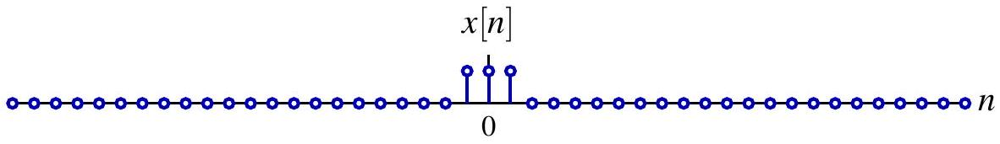{fig-align=center}

定义其周期延拓，周期满足 $N>N_{2}-N_{1}+1$：

$$
x_{N}[n]=\sum_{k=-\infty}^{\infty} x[n+k N]
$$

$$
x_{N}[n]
$$

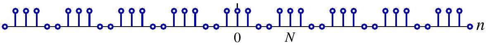{fig-align=center}

$x$ 可以看作“周期为无穷大”的周期信号，即 $x[n]=\lim _{N \rightarrow \infty} x_{N}[n]$

## 离散时间傅里叶变换

将 $x_{N}$ 展开为离散时间傅里叶级数

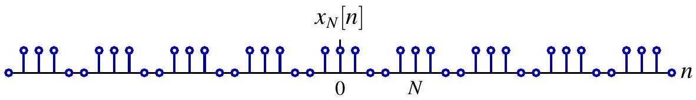{fig-align=center}

$$
\hat{x}_{N}[k]=\left\langle x_{N}, e^{j \frac{2 \pi}{N} k}\right\rangle=\frac{1}{N} \sum_{n=N_{1}}^{N_{2}} x[n] e^{-j \frac{2 \pi}{N} k}=\frac{1}{N} X\left(e^{j k \omega_{0}}\right)
$$

其中

$$
X\left(e^{j \omega}\right)=\sum_{n=N_{1}}^{N_{2}} x[n] e^{-j \omega n}=\sum_{n=-\infty}^{\infty} x[n] e^{-j \omega n}, \quad \omega_{0}=\frac{2 \pi}{N}
$$

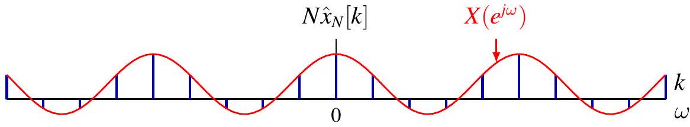{fig-align=center}

## 离散时间傅里叶变换

当 $N$ 增大时，离散频率的采样会变得更加稠密

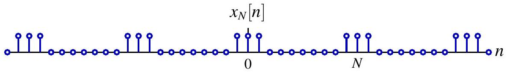{fig-align=center}

$$
\hat{x}_{N}[k]=\left\langle x_{N}, e^{j \frac{2 \pi}{N} k}\right\rangle=\frac{1}{N} \sum_{n=N_{1}}^{N_{2}} x[n] e^{-j \frac{2 \pi}{N} k}=\frac{1}{N} X\left(e^{j k \omega_{0}}\right)
$$

其中

$$
X\left(e^{j \omega}\right)=\sum_{n=N_{1}}^{N_{2}} x[n] e^{-j \omega n}=\sum_{n=-\infty}^{\infty} x[n] e^{-j \omega n}, \quad \omega_{0}=\frac{2 \pi}{N}
$$

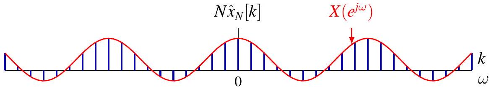{fig-align=center}

## 离散时间傅里叶变换

当 $N \rightarrow \infty$ 时，$N \hat{x}[k]$ 逐渐逼近包络 $X\left(e^{j \omega}\right)$

$$
x_{N}[n]
$$

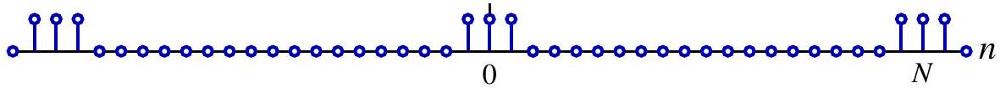{fig-align=center}

$$
\hat{x}_{N}[k]=\left\langle x_{N}, e^{j \frac{2 \pi}{N} k}\right\rangle=\frac{1}{N} \sum_{n=N_{1}}^{N_{2}} x[n] e^{-j \frac{2 \pi}{N} k}=\frac{1}{N} X\left(e^{j k \omega_{0}}\right)
$$

其中

$$
X\left(e^{j \omega}\right)=\sum_{n=N_{1}}^{N_{2}} x[n] e^{-j \omega n}=\sum_{n=-\infty}^{\infty} x[n] e^{-j \omega n}, \quad \omega_{0}=\frac{2 \pi}{N}
$$

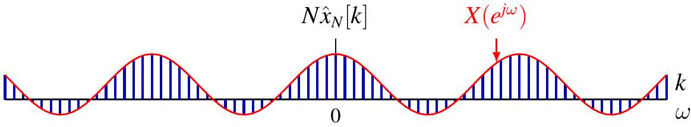{fig-align=center}

## 离散时间傅里叶变换

离散时间傅里叶级数的综合公式为：

$$
x_{N}[n]=\sum_{k \in[N]} \hat{x}[k] e^{j k \omega_{0} n}=\frac{1}{N} \sum_{k=0}^{N-1} X\left(e^{j k \omega_{0}}\right) e^{j k \omega_{0} n}
$$

令 $\omega_{k}=k \omega_{0}, \Delta \omega=\omega_{k}-\omega_{k-1}=\omega_{0}$，

$$
x_{N}[n]=\frac{1}{2 \pi} \sum_{k=0}^{N-1} X\left(e^{j \omega_{k}}\right) e^{j \omega_{k} n} \Delta \omega
$$

当 $N \rightarrow \infty$、$\Delta \omega \rightarrow 0$ 时，上述黎曼和变为积分：

$$
x[n]=\frac{1}{2 \pi} \int_{0}^{2 \pi} X\left(e^{j \omega}\right) e^{j \omega n} d \omega=\frac{1}{2 \pi} \int_{2 \pi} X\left(e^{j \omega}\right) e^{j \omega n} d \omega
$$

可在任意长度为 $2 \pi$ 的周期区间上积分

## 离散时间傅里叶变换变换对

离散时间傅里叶变换（分析公式）

$$
X\left(e^{j \omega}\right)=\mathcal{F}(x)\left(e^{j \omega}\right)=\sum_{n=-\infty}^{\infty} x[n] e^{-j \omega n}
$$

- $X\left(e^{j \omega}\right)$ 称为 $x[n]$ 的频谱，且以 $2 \pi$ 为周期

离散时间逆傅里叶变换（综合公式）

$$
x[n]=\mathcal{F}^{-1}(X)[n]=\frac{1}{2 \pi} \int_{2 \pi} X\left(e^{j \omega}\right) e^{j \omega n} d \omega
$$

- 频率为 $\omega$ 的复指数分量的权重为 $X\left(e^{j \omega}\right) \frac{d \omega}{2 \pi}$
- 只需在一个周期内积分，即只使用彼此不同的 $e^{j \omega n}$

## DTFT 与 CTFS 之间的对偶性

DTFT 变换对

- 离散时间
- 连续频率
分析公式

$$
X\left(e^{j \omega}\right)=\sum_{n=-\infty}^{\infty} x[n] e^{-j \omega n}
$$

综合公式

$$
x[n]=\frac{1}{2 \pi} \int_{2 \pi} X\left(e^{j \omega}\right) e^{j \omega n} d \omega
$$

CTFS 变换对

- 连续时间
- 离散频率
分析公式

$$
\hat{x}[k]=\frac{1}{T} \int_{T} x(t) e^{-j k \frac{2 \pi}{T} t} d t
$$

综合公式

$$
x(t)=\sum_{k=-\infty}^{\infty} \hat{x}[k] e^{j k \frac{2 \pi}{T} t}
$$

$$
\begin{aligned}
& \text { continuous variable } \xrightarrow{\text { CTFS }} \text { doubly infinite sequences } \\
& \text { periodic functions }
\end{aligned} \xrightarrow[\text { DTFT }]{\leftarrow} \text { 双向映射 }
$$

## 离散时间信号的高频与低频

高频对应于 $(2 k+1) \pi$ 附近，低频对应于 $2 k \pi$ 附近
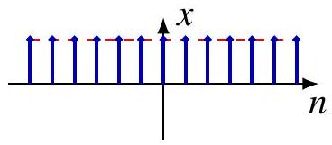
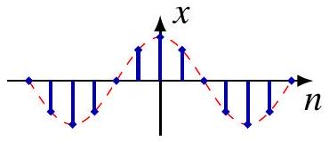

$\phi_{N}^{0}[n]=\cos (0 \cdot n)=1$
$\phi_{N}^{1}[n]=\cos (\pi n / 4)$
$\phi_{N}^{2}[n]=\cos (\pi n / 2)$

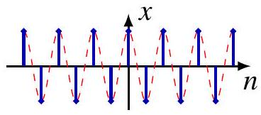
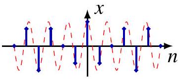
$\phi_{N}^{3}[n]=\cos (3 \pi n / 4)$
$\phi_{N}^{4}[n]=\cos (\pi n)$
$\phi_{N}^{5}[n]=\cos (5 \pi n / 4)$

$\phi_{N}^{6}[n]=\cos (3 \pi n / 2)$
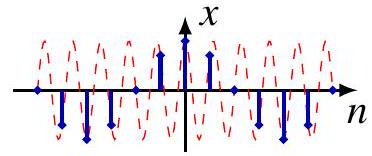
$\phi_{N}^{7}[n]=\cos (7 \pi n / 4)$
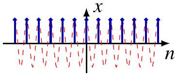
$\phi_{N}^{8}[n]=\cos (2 \pi n)=1$

## 离散时间信号的高频与低频

$N$ 周期信号的离散频率

- 在单位圆上均匀分布的点
- 低频靠近 $1$；高频靠近 $-1$

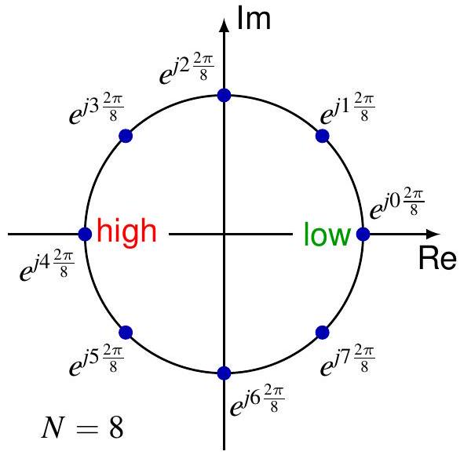

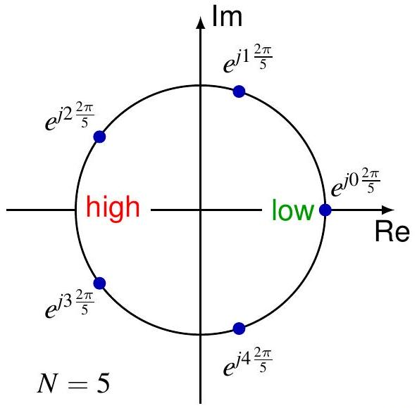

## 离散时间信号的高频与低频

:::: {.columns style="text-align: center;"}

::: {.column width="50%"}
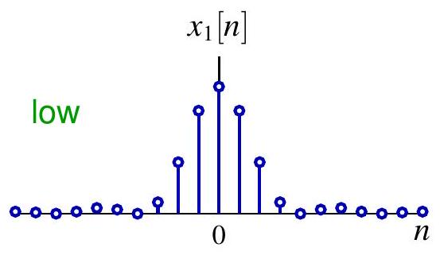

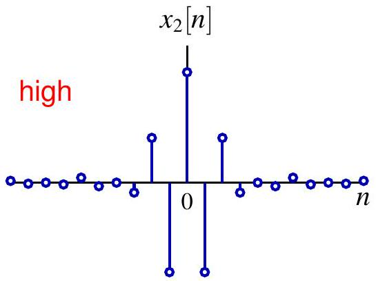
:::

::: {.column width="50%"}
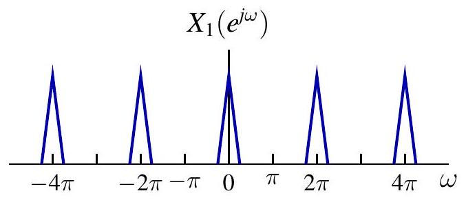

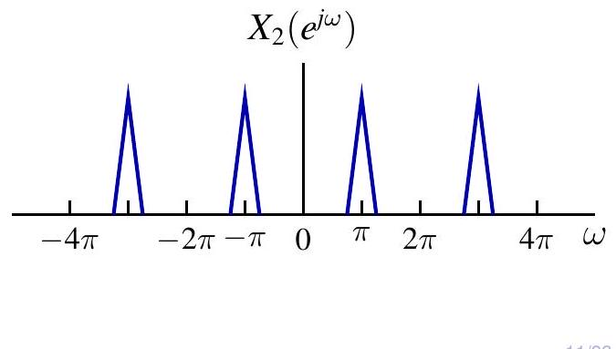

:::

::::

## 例：单边衰减指数序列

$$
x[n]=a^{n} u[n] \stackrel{\mathcal{F}}{\longleftrightarrow} X\left(e^{j \omega}\right)=\frac{1}{1-a e^{-j \omega}}, \quad|a|<1
$$

$\left|X\left(e^{j \omega}\right)\right|=\frac{1}{\sqrt{1-2 a \cos \omega+a^{2}}}, \quad \arg X\left(e^{j \omega}\right)=-\arctan \frac{a \sin \omega}{1-a \cos \omega}$

:::: {.columns style="text-align: center;"}

::: {.column width="50%"}
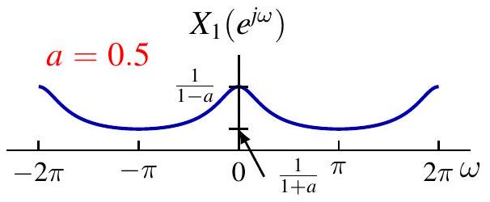

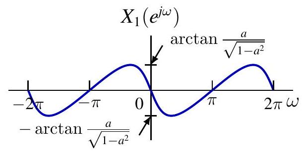

:::

::: {.column width="50%"}

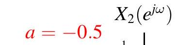

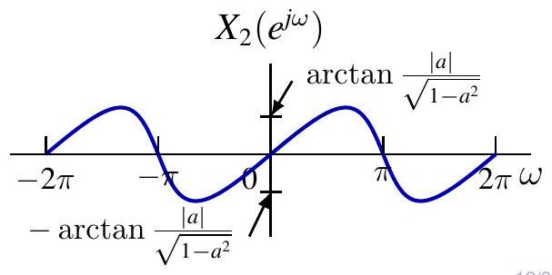
:::

::::

## 例：双边衰减指数序列

$$
x[n]=a^{|n|} \stackrel{\mathcal{F}}{\longleftrightarrow} X\left(e^{j \omega}\right)=\frac{1-a^{2}}{1-2 a \cos \omega+a^{2}}, \quad|a|<1
$$

:::: {.columns style="text-align: center;"}

::: {.column width="50%"}
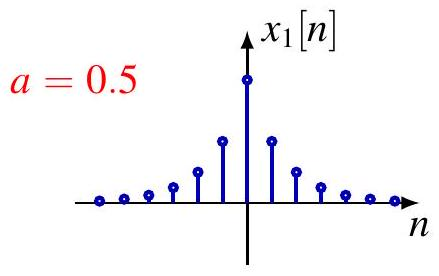

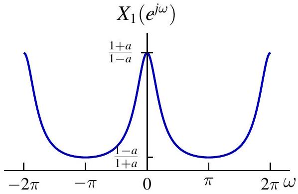

:::

::: {.column width="50%"}
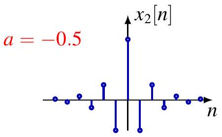

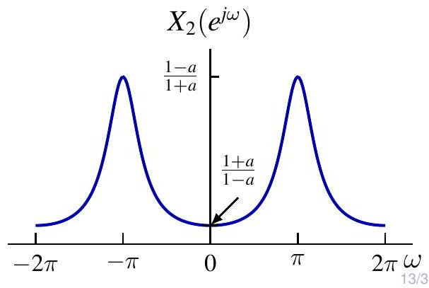

:::

::::

## 例：矩形脉冲

$$
x[n]=u\left[n+N_{1}\right]-u\left[n-N_{1}-1\right] \stackrel{\mathcal{F}}{\longleftrightarrow} X\left(e^{j \omega}\right)=\frac{\sin \left(\frac{2 N_{1}+1}{2} \omega\right)}{\sin \frac{\omega}{2}}
$$

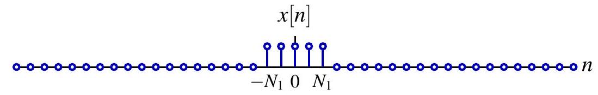{fig-align=center}

$$
X\left(e^{j \omega}\right)
$$

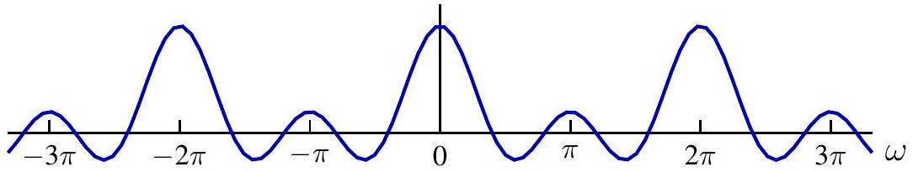{fig-align=center}

Dirichlet 核（周期情形）是 sinc 函数（非周期情形）在离散时间中的对应物
注意：$N_{1}=0 \Longrightarrow x[n]=\delta[n] \stackrel{\mathcal{F}}{\longleftrightarrow} X\left(e^{j \omega}\right)=1$

## DTFT 的收敛性

令

$$
X_{N}\left(e^{j \omega}\right)=\sum_{n=-N}^{N} x[n] e^{-j \omega n}
$$

定理：若 $x \in \ell_{1}$，则 $X_{N}$ 一致收敛到 $X$，即

$$
\lim _{N \rightarrow \infty}\left\|X-X_{N}\right\|_{\infty}=0
$$

因此，傅里叶变换 $X$ 是一致连续的。
定理：若 $x \in \ell_{2}$，则 $X_{N}$ 在 $L_{2}$ 意义下收敛到 $X$，即

$$
\lim _{N \rightarrow \infty}\left\|X-X_{N}\right\|_{2}=0
$$

- CTFS：$L_{2}(T) \rightarrow \ell_{2}$ 是 Hilbert 空间之间的同构
- DTFT：$\ell_{2} \rightarrow L_{2}(2 \pi)$ 也是同构

## 例：理想低通滤波器

$$
\begin{aligned}
& x[n]=\frac{\sin (W n)}{\pi n} \stackrel{\mathcal{F}}{\longleftrightarrow} X\left(e^{j \omega}\right)=\sum_{k=-\infty}^{\infty}[u(\omega+W+2 k \pi)-u(\omega-W+2 k \pi)] \\

\end{aligned}
$$

注意：$x \notin \ell_{1}$，且 $X$ 不连续

## 作为广义函数的收敛

复指数信号 $x[n]=e^{j \omega_{0} n}$ 不属于 $\ell_{1}$ 也不属于 $\ell_{2}$。
（平移后的）Dirichlet 核

$$
X_{N}\left(e^{j \omega n}\right)=\frac{\sin \left(\frac{2 N_{1}+1}{2}\left(\omega-\omega_{0}\right)\right)}{\sin \frac{\omega-\omega_{0}}{2}} \rightarrow 2 \pi \sum_{\ell=-\infty}^{\infty} \delta\left(\omega-\omega_{0}-2 \ell \pi\right)
$$

在分布（广义函数）意义下，有

$$
x[n]=e^{j \omega_{0} n} \stackrel{\mathcal{F}}{\longleftrightarrow} X\left(e^{j \omega}\right)=2 \pi \sum_{\ell=-\infty}^{\infty} \delta\left(\omega-\omega_{0}-2 \ell \pi\right)
$$

利用综合公式进行形式验证

$$
x[n]=\frac{1}{2 \pi} \int_{-\pi}^{\pi} X\left(e^{j \omega}\right) e^{j \omega n} d \omega=\int_{-\pi}^{\pi} \delta\left(\omega-\omega_{0}\right) e^{j \omega n} d \omega=e^{j \omega_{0} n}
$$

注意：也可通过对 $e^{j \omega_{0} t}$ 以 $T=1, \omega_{s}=2 \pi$ 采样得到
注意：$x[n]$ 不一定是周期信号！直流分量对应 $\omega_{0}=0$。

## 例：正弦信号

$$
\begin{aligned}
x[n] & =\cos \left(\omega_{0} n+\phi\right)=\frac{e^{j \phi}}{2} e^{j \omega_{0} n}+\frac{e^{-j \phi}}{2} e^{-j \omega_{0} n} \\
X\left(e^{j \omega}\right) & =\sum_{\ell=-\infty}^{\infty} \pi e^{j \phi} \delta\left(\omega-\omega_{0}-2 \ell \pi\right)+\pi e^{-j \phi} \delta\left(\omega+\omega_{0}-2 \ell \pi\right)
\end{aligned}
$$

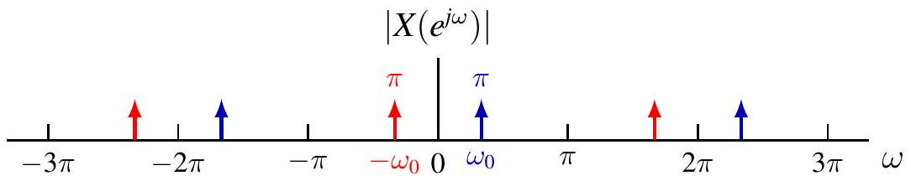{fig-align=center}

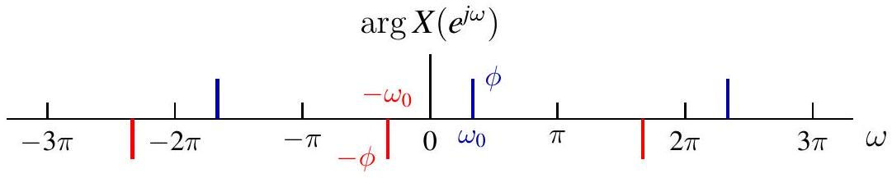{fig-align=center}

## 周期信号的 DTFT

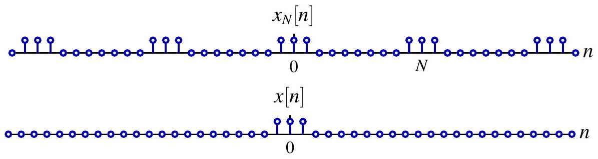{fig-align=center}

回顾：DTFS 系数 $\hat{x}_{N}[k]$ 就是频率 $k \omega_{0}$ 处的幅值

$$
\hat{x}_{N}[k]=\frac{1}{N} X\left(e^{j k \omega_{0}}\right), \quad \text { 其中 } X=\mathcal{F}\{x\}, \quad \omega_{0}=\frac{2 \pi}{N}
$$

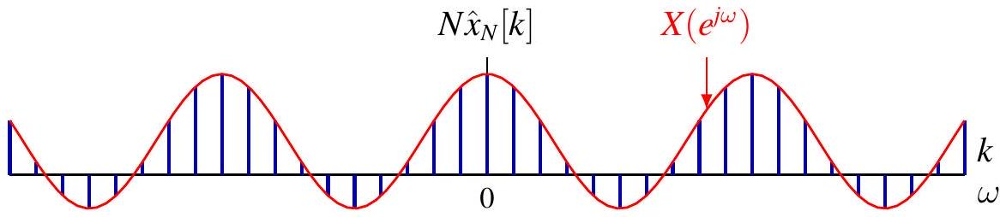{fig-align=center}

## 周期信号的 DTFT

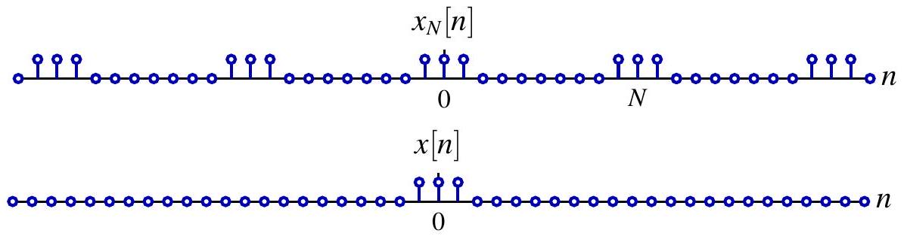{fig-align=center}

DTFT 中 $(2 \pi)^{-1} X\left(e^{j \omega}\right)$ 表示频率 $\omega$ 处的密度

$$
X\left(e^{j \omega}\right)=2 \pi \sum_{k=-\infty}^{\infty} \hat{x}_{N}[k] \delta\left(\omega-k \omega_{0}\right)=\omega_{0} \sum_{k=-\infty}^{\infty} X\left(e^{j k \omega_{0}}\right) \delta\left(\omega-k \omega_{0}\right)
$$

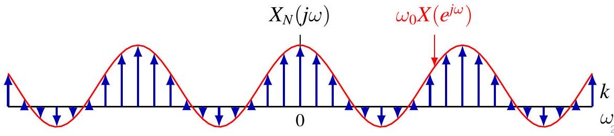{fig-align=center}

## 周期信号的 DTFT

回顾 $x_{N}$ 的 DTFS 表达式

$$
x_{N}[n]=\sum_{k=0}^{N-1} \hat{x}_{N}[k] e^{j \frac{2 k \pi}{N} n}
$$

对两边取 DTFT，并利用线性性质以及复指数信号的 DTFT，得到

$$
\begin{aligned}
X_{N}\left(e^{j \omega}\right) & =\sum_{k=0}^{N-1} \hat{x}_{N}[k] \mathcal{F}\left\{e^{j \frac{2 k \pi}{N} n}\right\}=\sum_{k=0}^{N-1} \hat{x}_{N}[k] \sum_{\ell=-\infty}^{\infty} 2 \pi \delta\left(\omega-\frac{2 k \pi}{N}-2 \ell \pi\right) \\
& =2 \pi \sum_{\ell=-\infty}^{\infty} \sum_{k=0}^{N-1} \hat{x}_{N}[k] \delta\left(\omega-\frac{2(k+\ell N) \pi}{N}\right) \\
& =2 \pi \sum_{k=-\infty}^{\infty} \hat{x}_{N}[k] \delta\left(\omega-\frac{2 k \pi}{N}\right) \quad\left(\text { Recall } \hat{x}_{N}[k]=\hat{x}_{N}[k+\ell N]\right)
\end{aligned}
$$

## 周期信号的 DTFT

Can also verify formally using 综合公式

$$
\frac{1}{2 \pi} \int_{-\frac{\pi}{N}}^{2 \pi-\frac{\pi}{N}} X\left(e^{j \omega}\right) e^{j \omega n} d \omega=\int_{-\frac{\pi}{N}}^{2 \pi-\frac{\pi}{N}} \sum_{k=-\infty}^{\infty} \hat{x}_{N}[k] \delta\left(\omega-\frac{2 k \pi}{N}\right) e^{j \omega n} d \omega
$$

只有 $k=0,1, \ldots, N-1$ 的项落在积分区间内

$$
\int_{-\frac{\pi}{N}}^{2 \pi-\frac{\pi}{N}} \sum_{k=0}^{N-1} \hat{x}_{N}[k] \delta\left(\omega-\frac{2 k \pi}{N}\right) e^{j \omega n} d \omega=\sum_{k=0}^{N-1} \hat{x}_{N}[k] e^{j \frac{2 k \pi}{N} n}=x_{N}[n]
$$

其中 last equality is DTFS 综合公式
因此得到验证

$$
x_{N}[n]=\frac{1}{2 \pi} \int_{2 \pi} X\left(e^{j \omega}\right) e^{j \omega n} d \omega
$$

## 例：离散时间周期冲激串

$$
x[n]=\sum_{k=-\infty}^{\infty} \delta[n-k N] \stackrel{\mathcal{F}}{\longleftrightarrow} X\left(e^{j \omega}\right)=\frac{2 \pi}{N} \sum_{k=-\infty}^{\infty} \delta\left(\omega-\frac{2 \pi k}{N}\right)
$$

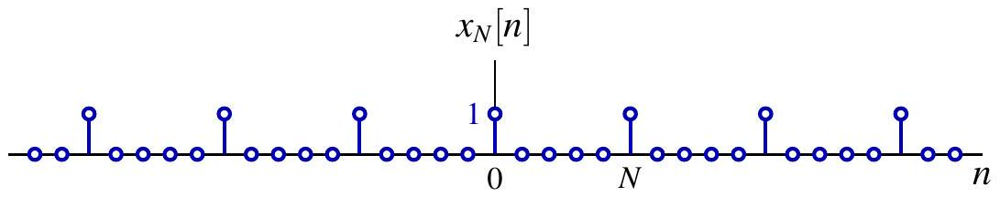{fig-align=center}

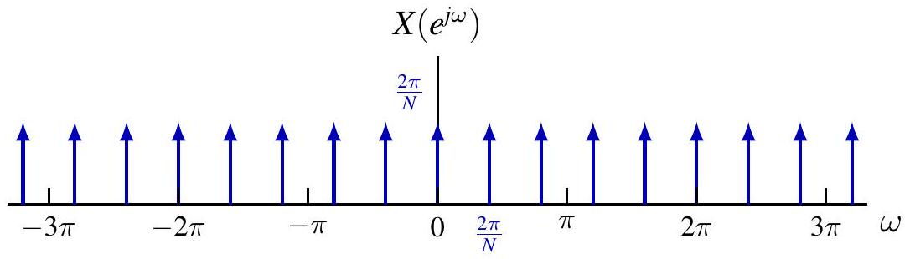{fig-align=center}

## 目录

## 1. 离散时间傅里叶变换

2. 离散时间傅里叶变换的性质

## 离散时间傅里叶变换的性质

周期性

$$
X\left(e^{j(\omega+2 \pi)}\right)=X\left(e^{j(\omega)}\right)
$$

线性

$$
\mathcal{F}\{a x+b y\}=a \mathcal{F}\{x\}+b \mathcal{F}\{y\}
$$

时移与频移
若

$$
x[n] \stackrel{\mathcal{F}}{\longleftrightarrow} X\left(e^{j \omega}\right)
$$

then

$$
x\left[n-n_{0}\right] \stackrel{\mathcal{F}}{\longleftrightarrow} e^{-j \omega n_{0}} X\left(e^{j \omega}\right)
$$

并且

$$
e^{j \omega_{0} n} x[n] \stackrel{\mathcal{F}}{\longleftrightarrow} X\left(e^{j\left(\omega-\omega_{0}\right)}\right)
$$

## 例：高通与低通滤波器

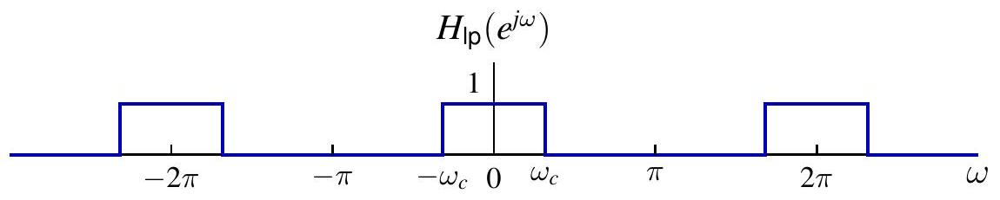{fig-align=center}

$$
H_{\mathrm{hp}}\left(e^{j \omega}\right)=H_{\mathrm{lp}}\left(e^{j(\omega-\pi)}\right)
$$

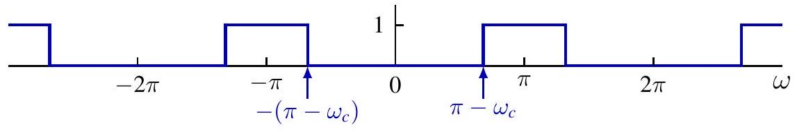{fig-align=center}

$$
H_{\mathrm{hp}}\left(e^{j \omega}\right)=H_{\mathrm{lp}}\left(e^{j(\omega-\pi)}\right) \Longleftrightarrow h_{\mathrm{hp}}[n]=e^{j \pi n} h_{\mathrm{lp}}[n]=(-1)^{n} h_{\mathrm{lp}}[n]
$$

利用低通滤波器实现高通滤波 $y=x * h_{\mathrm{hp}}$
(1) $x_{1}[n]=(-1)^{n} x[n]$；
(2) $y_{1}=x_{1} * h_{\mathrm{lp}}$；
(3) $y[n]=(-1)^{n} y_{1}[n]$

## 离散时间傅里叶变换的性质

设

$$
x[n] \stackrel{\mathcal{F}}{\longleftrightarrow} X\left(e^{j \omega}\right)
$$

时间反转

$$
x[-n] \stackrel{\mathcal{F}}{\longleftrightarrow} X\left(e^{-j \omega}\right)
$$

共轭

$$
x^{*}[n] \stackrel{\mathcal{F}}{\longleftrightarrow} X^{*}\left(e^{-j \omega}\right)
$$

对称性

- $x$ 为偶信号 $\Longleftrightarrow X$ 为偶函数，$\quad x$ 为奇信号 $\Longleftrightarrow X$ 为奇函数
- $x$ 为实信号 $\Longleftrightarrow X\left(e^{-j \omega}\right)=X^{*}\left(e^{j \omega}\right)$
- $x$ real 并且 even $\Longleftrightarrow X$ real 并且 even
- $x$ real 并且 odd $\Longleftrightarrow X$ purely imaginary 并且 odd

## Differencing 并且 Accumulation

一阶（后向）差分

$$
x[n]-x[n-1] \stackrel{\mathcal{F}}{\longleftrightarrow}\left(1-e^{-j \omega}\right) X\left(e^{j \omega}\right)
$$

累加（运行和）

$$
y[n]=\sum_{m=-\infty}^{n} x[m] \stackrel{\mathcal{F}}{\longleftrightarrow} \frac{1}{1-e^{-j \omega}} X\left(e^{j \omega}\right)+\pi X\left(e^{j 0}\right) \sum_{k=-\infty}^{\infty} \delta(\omega-2 \pi k)
$$

- 第一项来自差分性质
- 第二项是直流分量 $\mathcal{F}\{\bar{y}\}$ 的 DTFT，其中 $\bar{y}=\frac{1}{2} X\left(e^{j 0}\right)$；参见第 15 讲第 17 页

例：由于 $\delta[n] \stackrel{\mathcal{F}}{\longleftrightarrow} 1$，

$$
u[n]=\sum_{m=-\infty}^{n} \delta[m] \stackrel{\mathcal{F}}{\longleftrightarrow} \frac{1}{1-e^{-j \omega}}+\pi \sum_{k=-\infty}^{\infty} \delta(\omega-2 \pi k)
$$

## 时间扩展

定义 $x_{(m)}$ 为

$$
x_{(m)}[n]= \begin{cases}x[n / m], & \text { if } n \text { is multiple of } m \\ 0, & \text { otherwise }\end{cases}
$$

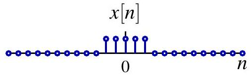{fig-align=center}

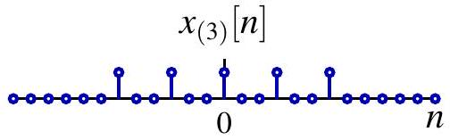{fig-align=center}

若

$$
x[n] \stackrel{\mathcal{F}}{\longleftrightarrow} X\left(e^{j \omega}\right)
$$

then

$$
x_{(m)}[n] \stackrel{\mathcal{F}}{\longleftrightarrow} X\left(e^{j m \omega}\right)
$$

证明。

$$
\mathcal{F}\left\{x_{(m)}\right\}\left(e^{j m \omega}\right)=\sum_{n=-\infty}^{\infty} x_{(m)}[n] e^{-j \omega n}=\sum_{\ell=-\infty}^{\infty} x[\ell] e^{-j \omega m \ell}=X\left(e^{j m \omega}\right)
$$

## 例

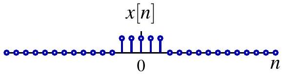{fig-align=center}

$$
X\left(e^{j \omega}\right)
$$

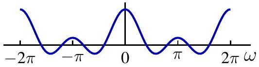{fig-align=center}

$$
\left.X_{(2)}\left(e^{j \omega}\right)=X_{( } e^{j 2 \omega}\right)
$$

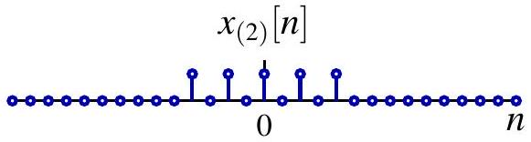{fig-align=center}

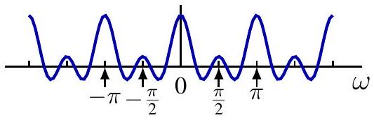{fig-align=center}

$$
x_{(3)}[n]
$$

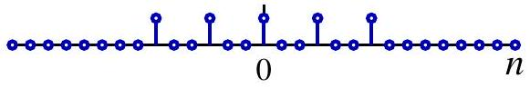

$$
\left.X_{(3)}\left(e^{j \omega}\right)=X_{( } e^{j 3 \omega}\right)
$$

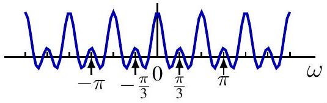{fig-align=center}

## 频率微分性质

若

$$
x[n] \stackrel{\mathcal{F}}{\longleftrightarrow} X\left(e^{j \omega}\right)
$$

then

$$
n x[n] \stackrel{\mathcal{F}}{\longleftrightarrow} j \frac{d}{d \omega} X\left(e^{j \omega}\right)
$$

证明。

$$
X\left(e^{j \omega}\right)=\sum_{n=-\infty}^{\infty} x[n] e^{-j \omega n}
$$

在求和号内对 $\omega$ 求导

$$
\frac{d}{d \omega} X\left(e^{j \omega}\right)=\sum_{n=-\infty}^{\infty} x[n](-j n) e^{-j \omega n}
$$

## 帕塞瓦尔恒等式

Theorem. 若 $x \in \ell_{2}, X=\mathcal{F}\{x\}$, then

$$
\|x\|_{\ell_{2}}^{2}=\|X\|_{L_{2}(2 \pi)}^{2}, \quad \text { or } \quad \sum_{n \in \mathbb{Z}}|x[n]|^{2}=\frac{1}{2 \pi} \int_{2 \pi}\left|X\left(e^{j \omega}\right)\right|^{2} d \omega
$$

Note $\omega$ is angular frequency 并且 $\frac{\omega}{2 \pi}$ is frequency

$$
\sum_{n \in \mathbb{Z}}|x[n]|^{2}=\int_{2 \pi}\left|X\left(e^{j \omega}\right)\right|^{2} \frac{d \omega}{2 \pi}
$$

解释：能量守恒

- $\sum_{n \in \mathbb{Z}}|x[n]|^{2}$ 是总能量
- $\left|X\left(e^{j \omega}\right)\right|^{2}$ 是单位频率上的能量
$\left|X\left(e^{j \omega}\right)\right|^{2}$ 称为能量密度谱

## 帕塞瓦尔恒等式

Theorem. 若 $x, y \in \ell_{2}, X=\mathcal{F}\{x\}, Y=\mathcal{F}\{y\}$, then

$$
\langle x, y\rangle_{\ell_{2}}=\langle X, Y\rangle_{L_{2}(2 \pi)}, \quad \text { or } \quad \sum_{n \in \mathbb{Z}} x[n] y^{*}[n]=\frac{1}{2 \pi} \int_{2 \pi} X\left(e^{j \omega}\right) Y^{*}\left(e^{j \omega}\right) d \omega
$$

证明。

$$
\begin{aligned}
\langle X, Y\rangle_{L_{2}(2 \pi)} & =\left\langle\sum_{n \in \mathbb{Z}} x[n] e^{-j \omega n}, \sum_{m \in \mathbb{Z}} y[m] e^{-j \omega m}\right\rangle_{L_{2}(2 \pi)} \\
& =\sum_{n \in \mathbb{Z}} x[n] \sum_{m \in \mathbb{Z}} y^{*}[m]\left\langle e^{-j \omega n}, e^{-j \omega m}\right\rangle_{L_{2}(2 \pi)} \\
& =\sum_{n \in \mathbb{Z}} x[n] \sum_{m \in \mathbb{Z}} y^{*}[m] \delta[n-m] \\
& =\sum_{n \in \mathbb{Z}} x[n] y^{*}[n]=\langle x, y\rangle_{\ell_{2}}
\end{aligned}
$$

## DTFT 的卷积性质

$$
(x * h)[n] \stackrel{\mathcal{F}}{\longleftrightarrow} X\left(e^{j \omega}\right) H\left(e^{j \omega}\right)
$$

注：这是 CTFS 中乘法性质的对偶形式。

$$
x(t) y(t) \stackrel{\mathcal{F S}}{\longleftrightarrow}(\hat{x} * \hat{y})[k]
$$

注：与 CTFT 的情形类似，该公式在相关表达式定义良好时成立。

$$
\begin{aligned}
\mathcal{F}\{x * h\}\left(e^{j \omega}\right) & =\sum_{n \in \mathbb{Z}}(x * h)[n] e^{-j \omega n}=\sum_{n \in \mathbb{Z}} \sum_{m \in \mathbb{Z}} x[m] h[n-m] e^{-j \omega n} \\
& =\sum_{m \in \mathbb{Z}} x[m] \sum_{n \in \mathbb{Z}} h[n-m] e^{-j \omega n} \\
& =\sum_{m \in \mathbb{Z}} x[m] e^{-j \omega m} H\left(e^{j \omega}\right) \\
& =X\left(e^{j \omega}\right) H\left(e^{j \omega}\right)
\end{aligned}
$$

## LTI 系统的频率响应

LTI 系统 $T$

- 可由冲激响应 $h$ 完全表征

$$
y=T(x)=h * x
$$

- 若 $H=\mathcal{F}\{h\}$ 定义良好，也可由频率响应 $H$ 完全表征
- 对于 BIBO 稳定系统，有 $h \in \ell_{1}$
- 其他系统：例如累加器，其 $h=u$，等等

通常，由卷积性质可得

$$
Y=\mathcal{F}\{y\}=H X=\mathcal{F}\{h\} \mathcal{F}\{x\}
$$

不直接计算 $x * h$，也可以写成

$$
y=\mathcal{F}^{-1}(\mathcal{F}\{h\} \mathcal{F}\{x\})
$$

## 例

求冲激响应为 $h[n]=a^{n} u[n]$ 的 LTI 系统在输入 $x[n]=b^{n} u[n]$ 下的响应，其中 $|a|<1,|b|<1$$
方法 1：直接卷积 $y=x * h$
方法 2：在初始静止条件下求解差分方程

$$
y[n]-a y[n-1]=b^{n} u[n]
$$

方法 3：使用傅里叶变换。

$$
H=\frac{1}{1-a e^{-j \omega}}, X=\frac{1}{1-b e^{-j \omega}} \Longrightarrow Y=\frac{1}{\left(1-a e^{-j \omega}\right)\left(1-b e^{-j \omega}\right)}
$$

若 $a \neq b$， Y\left(e^{j \omega}\right)=\frac{a /(a-b)}{1-a e^{-j \omega}}-\frac{b /(a-b)}{1-b e^{-j \omega}}, \quad y[n]=\frac{1}{a-b}\left(a^{n+1}-b^{n+1}\right) u[n]$
若 $a=b$， Y\left(e^{j \omega}\right)=\frac{d}{d a}\left(\frac{a}{1-a e^{-j \omega}}\right), y[n]=\frac{d}{d a} a^{n+1} u[n]=(n+1) a^{n} u[n]$
或者利用 $Y\left(e^{j \omega}\right)=\frac{j}{a} e^{j \omega} \frac{d}{d \omega}\left(\frac{a}{1-a e^{-j \omega}}\right)$ 以及微分性质

## 例

求冲激响应为 $h[n]=a^{n} u[n]$ 的 LTI 系统在输入 $x[n]=\cos \left(\omega_{0} n\right)$、且 $|a|<1$ 时的响应。
频率响应

$$
H\left(e^{j \omega}\right)=\frac{1}{1-a e^{-j \omega}}
$$

方法 1：利用特征函数性质

$$
\begin{gathered}
x[n]=\frac{1}{2} e^{j \omega_{0} n}+\frac{1}{2} e^{-j \omega_{0} n} \\
y[n]=\frac{1}{2} H\left(e^{j \omega_{0}}\right) e^{j \omega_{0} n}+\frac{1}{2} H\left(e^{-j \omega_{0}}\right) e^{-j \omega_{0} n}=\operatorname{Re} \frac{e^{j \omega_{0} n}}{1-a e^{-j \omega_{0}}} \\
=\frac{1}{\sqrt{1-2 a \cos \omega_{0}+a^{2}}} \cos \left(\omega_{0} n-\arctan \frac{a \sin \omega_{0}}{1-a \cos \omega_{0}}\right)
\end{gathered}
$$

## 例

方法 2：利用输入的傅里叶变换 $X$

$$
\begin{aligned}
& X\left(e^{j \omega}\right)=\sum_{k=-\infty}^{\infty}\left[\pi \delta\left(\omega-\omega_{0}+2 k \pi\right)+\pi \delta\left(\omega+\omega_{0}+2 k \pi\right)\right] \\
& Y\left(e^{j \omega}\right)=\sum_{k=-\infty}^{\infty} \pi H\left(e^{j\left(\omega_{0}-2 k \pi\right)}\right) \delta\left(\omega-\omega_{0}+2 k \pi\right) \\
& \quad+\sum_{k=-\infty}^{\infty} \pi H\left(e^{-j\left(\omega_{0}+2 k \pi\right)}\right) \delta\left(\omega+\omega_{0}+2 k \pi\right) \\
& =H\left(e^{j \omega_{0}}\right) \sum_{k=-\infty}^{\infty} \pi \delta\left(\omega-\omega_{0}+2 k \pi\right) \\
& \quad+H\left(e^{-j \omega_{0}}\right) \sum_{k=-\infty}^{\infty} \pi \delta\left(\omega+\omega_{0}+2 k \pi\right) \\
& y[n]=\frac{1}{2} H\left(e^{j \omega_{0}}\right) e^{j \omega_{0} n}+\frac{1}{2} H\left(e^{-j \omega_{0}}\right) e^{-j \omega_{0} n}
\end{aligned}
$$

## 例：理想带阻滤波器

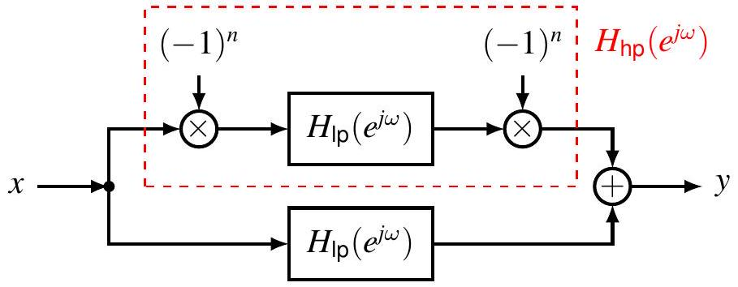{fig-align=center}

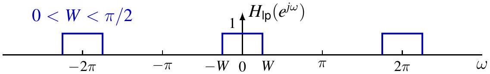{fig-align=center}

{fig-align=center}

## 目录

1. DTFT 的卷积性质
2. DTFT 的乘积性质
3. 线性常系数差分方程描述的系统
4. 离散时间信号的采样
5. 连续时间信号的离散时间处理

## DTFT 的乘积性质

$$
x[n] y[n] \stackrel{\mathcal{F}}{\longleftrightarrow} \frac{1}{2 \pi} X \circledast Y=\frac{1}{2 \pi} \int_{2 \pi} X\left(e^{j \theta}\right) Y\left(e^{j(\omega-\theta)}\right) d \theta
$$

注：这是 CTFS 中周期卷积性质的对偶形式。

$$
x \circledast y \stackrel{\mathcal{F S}}{\longleftrightarrow} T \hat{x} \hat{y}
$$

证明。

$$
\begin{aligned}
\mathcal{F}\{x y\}\left(e^{j \omega}\right) & =\sum_{n \in \mathbb{Z}} x[n] y[n] e^{-j \omega n}=\sum_{n \in \mathbb{Z}}\left(\frac{1}{2 \pi} \int_{2 \pi} X\left(e^{j \theta}\right) e^{j \theta n} d \theta\right) y[n] e^{-j \omega n} \\
& =\frac{1}{2 \pi} \int_{2 \pi} X\left(e^{j \theta}\right)\left(\sum_{n \in \mathbb{Z}} y[n] e^{-j(\omega-\theta) n}\right) d \theta \\
& =\frac{1}{2 \pi} \int_{2 \pi} X\left(e^{j \theta}\right) Y\left(e^{j(\omega-\theta)}\right) d \theta
\end{aligned}
$$

## 例

$x[n]=x_{1}[n] x_{2}[n]$，其中 $x_{1}[n]=\frac{\sin (3 \pi n / 4)}{\pi n}, x_{2}[n]=\frac{\sin (\pi n / 2)}{\pi n}$

$$
X=\frac{1}{2 \pi} X_{1} \underset{\uparrow}{\circledast} X_{2}=\frac{1}{2 \pi} \tilde{X}_{1} * X_{2}
$$

{fig-align=center}

{fig-align=center}

{fig-align=center}

## 例

$x[n]=x_{1}[n] x_{2}[n]$，其中 $x_{1}[n]=\frac{\sin (3 \pi n / 4)}{\pi n}, x_{2}[n]=\frac{\sin (\pi n / 2)}{\pi n}$

$$
X=\frac{1}{2 \pi} X_{1} \underset{\uparrow}{\circledast} X_{2}=\frac{1}{2 \pi} \tilde{X}_{1} * X_{2}=\frac{1}{2 \pi} \sum_{k=-\infty}^{\infty} \underset{\substack{\uparrow \\ \text { 周期延拓 }}}{\tau_{2 k \pi}\left(\tilde{X}_{1} * \tilde{X}_{2}\right)} \text { 非周期卷积 }
$$

{fig-align=center}

{fig-align=center}

{fig-align=center}

## 例

$x[n]=x_{1}[n] x_{2}[n]$，其中 $x_{1}[n]=\frac{\sin (3 \pi n / 4)}{\pi n}, x_{2}[n]=\frac{\sin (\pi n / 2)}{\pi n}$

$$
X=\frac{1}{2 \pi} X_{1} \circledast X_{2}=\frac{1}{2 \pi} \tilde{X}_{1} * X_{2}=\frac{1}{2 \pi} \sum_{k=-\infty}^{\infty} \underset{\substack{\uparrow \\ \text { 周期延拓 }}}{\tau_{2 k \pi}\left(\tilde{X}_{1} * \tilde{X}_{2}\right)} \text { 非周期卷积 }
$$

{fig-align=center}

{fig-align=center}

{fig-align=center}

## 例

$x[n]=x_{1}[n] x_{2}[n]$，其中 $x_{1}[n]=\frac{\sin (3 \pi n / 4)}{\pi n}, x_{2}[n]=\frac{\sin (\pi n / 2)}{\pi n}$

$$
X=\frac{1}{2 \pi} X_{1} \circledast X_{2}=\frac{1}{2 \pi} \tilde{X}_{1} * X_{2}=\frac{1}{2 \pi} \sum_{k=-\infty}^{\infty} \underset{\substack{\uparrow \\ \text { 周期延拓 }}}{\tau_{2 k \pi}\left(\tilde{X}_{1} * \tilde{X}_{2}\right)} \text { 非周期卷积 }
$$

{fig-align=center}

{fig-align=center}

{fig-align=center}

## 例：离散时间调制

$$
y[n]=x[n] c[n]，其中 $c[n]=\cos \left(\omega_{c} n\right)$
$$

{fig-align=center}

{fig-align=center}

{fig-align=center}

各谱副本之间不重叠：$\left\{\begin{array}{l}\omega_{c}>\omega_{M} \\ \omega_{c}+\omega_{M}<\pi\end{array} \quad \Longrightarrow \omega_{M}<\frac{\pi}{2}\right.$

## 例：离散时间解调

$$
z[n]=y[n] c[n]，其中 $c[n]=\cos \left(\omega_{c} n\right)$
$$

{fig-align=center}

{fig-align=center}

{fig-align=center}

通过截止频率 $W \in\left(\omega_{M}, 2 \omega_{c}-\omega_{M}\right)$ 的低通滤波器对 $Y$ 进行滤波，可恢复 $X$

## 目录

1. DTFT 的卷积性质
2. DTFT 的乘积性质
3. 线性常系数差分方程描述的系统
4. 离散时间信号的采样
5. 连续时间信号的离散时间处理

## 线性常系数差分方程

由下式描述的 LTI 系统，其频率响应为

$$
\sum_{k=0}^{N} a_{k} y[n-k]=\sum_{k=0}^{M} b_{k} x[n-k]
$$

方法 1：利用特征函数性质

$$
x[n]=e^{j \omega n} \Longrightarrow y[n]=H\left(e^{j \omega}\right) e^{j \omega n}
$$

代入差分方程得

$$
\begin{gathered}
\sum_{k=0}^{N} a_{k} H\left(e^{j \omega}\right) e^{j \omega(n-k)}=\sum_{k=0}^{M} b_{k} e^{j \omega(n-k)} \\
H\left(e^{j \omega}\right)=\frac{\sum_{k=0}^{M} b_{k} e^{-j \omega k}}{\sum_{k=0}^{N} a_{k} e^{-j \omega k}}
\end{gathered}
$$

## 线性常系数差分方程

方法 2：对方程两边取傅里叶变换

$$
\mathcal{F}\left\{\sum_{k=0}^{N} a_{k} y[n-k]\right\}=\mathcal{F}\left\{\sum_{k=0}^{M} b_{k} x[n-k]\right\}
$$

由线性性质和时移性质

$$
\sum_{k=0}^{N} a_{k} e^{-j \omega k} Y\left(e^{j \omega}\right)=\sum_{k=0}^{M} b_{k} e^{-j \omega k} X\left(e^{j \omega}\right)
$$

由卷积性质

$$
H\left(e^{j \omega}\right)=\frac{Y\left(e^{j \omega}\right)}{X\left(e^{j \omega}\right)}=\frac{\sum_{k=0}^{M} b_{k} e^{-j \omega k}}{\sum_{k=0}^{N} a_{k} e^{-j \omega k}}
$$

频率响应是关于 $e^{-j \omega}$ 的有理函数

## 例

考虑由下式描述的 LTI 系统

$$
y[n]-\frac{3}{4} y[n-1]+\frac{1}{8} y[n-2]=2 x[n]
$$

频率响应

$$
H\left(e^{j \omega}\right)=\frac{2}{1-\frac{3}{4} e^{-j \omega}+\frac{1}{8} e^{-j 2 \omega}}
$$

利用部分分式展开

$$
H\left(e^{j \omega}\right)=\frac{2}{\left(1-\frac{1}{2} e^{-j \omega}\right)\left(1-\frac{1}{4} e^{-j \omega}\right)}=\frac{4}{1-\frac{1}{2} e^{-j \omega}}-\frac{2}{1-\frac{1}{4} e^{-j \omega}}
$$

取逆傅里叶变换得到冲激响应

$$
h[n]=4\left(\frac{1}{2}\right)^{n} u[n]-2\left(\frac{1}{4}\right)^{n} u[n]
$$

## 例

Find 响应 to $x[n]=\left(\frac{1}{4}\right)^{n} u[n]$.
响应的傅里叶变换为

$$
Y\left(e^{j \omega}\right)=H\left(e^{j \omega}\right) X\left(e^{j \omega}\right)=\frac{2}{\left(1-\frac{1}{2} e^{-j \omega}\right)\left(1-\frac{1}{4} e^{-j \omega}\right)} \cdot \frac{1}{1-\frac{1}{4} e^{-j \omega}}
$$

利用部分分式展开

$$
Y\left(e^{j \omega}\right)=-\frac{4}{1-\frac{1}{4} e^{-j \omega}}-\frac{2}{\left(1-\frac{1}{4} e^{-j \omega}\right)^{2}}+\frac{8}{1-\frac{1}{2} e^{-j \omega}}
$$

取逆傅里叶变换得到响应

$$
y[n]=\left\{-4\left(\frac{1}{4}\right)^{n}-2(n+1)\left(\frac{1}{4}\right)^{n}+8\left(\frac{1}{2}\right)^{n}\right\} u[n]
$$

## 部分分式展开

$$
H\left(e^{j \omega}\right)=\frac{2}{1-\frac{3}{4} e^{-j \omega}+\frac{1}{8} e^{-j 2 \omega}}
$$

令 $e^{-j \omega}$ 用 $z$ 代替，

$$
\begin{gathered}
H\left(z^{-1}\right)=\frac{2}{1-\frac{3}{4} z+\frac{1}{8} z^{2}}=\frac{2}{\left(1-\frac{1}{2} z\right)\left(1-\frac{1}{4} z\right)}=\frac{A}{1-\frac{1}{2} z}+\frac{B}{1-\frac{1}{4} z} \\
A=\left.\left[\left(1-\frac{1}{2} z\right) H\left(z^{-1}\right)\right]\right|_{z=2}=\left.\frac{2}{1-\frac{1}{4} z}\right|_{z=2}=4 \\
B=\left.\left[\left(1-\frac{1}{4} z\right) H\left(z^{-1}\right)\right]\right|_{z=4}=\left.\frac{2}{1-\frac{1}{2} z}\right|_{z=4}=-2
\end{gathered}
$$

注：连续时间中各项写成 $\frac{A}{(s-r)^{m}}$ 的形式，而离散时间中写成 $\frac{A}{(1-r z)^{m}}$ 的形式。

## 部分分式展开

$$
Y\left(e^{j \omega}\right)=\frac{2}{\left(1-\frac{1}{2} e^{-j \omega}\right)\left(1-\frac{1}{4} e^{-j \omega}\right)} \cdot \frac{1}{1-\frac{1}{4} e^{-j \omega}}
$$

令 $e^{-j \omega}$ 用 $z$ 代替，

$$
Y\left(z^{-1}\right)=\frac{2}{\left(1-\frac{1}{2} z\right)\left(1-\frac{1}{4} z\right)^{2}}=\frac{A_{1,1}}{1-\frac{1}{2} z}+\frac{A_{2,1}}{1-\frac{1}{4} z}+\frac{A_{2,2}}{\left(1-\frac{1}{4} z\right)^{2}}
$$

求 $A_{1,1}$

1. 两边同乘 $1-\frac{1}{2} z$，

$$
\left(1-\frac{1}{2} z\right) Y\left(z^{-1}\right)=\frac{2}{\left(1-\frac{1}{4} z\right)^{2}}=A_{1,1}+\frac{A_{2,1}\left(1-\frac{1}{2} z\right)}{1-\frac{1}{4} z}+\frac{A_{2,2}\left(1-\frac{1}{2} z\right)}{\left(1-\frac{1}{4} z\right)^{2}}
$$

2. 在 $z=2$ 处取值，即在 $1-\frac{1}{2} z=0$ 的根处取值

$$
A_{1,1}=\left.\left[\left(1-\frac{1}{2} z\right) Y\left(z^{-1}\right)\right]\right|_{z=2}=\left.\frac{2}{\left(1-\frac{1}{4} z\right)^{2}}\right|_{z=2}=8
$$

## 部分分式展开

$$
Y\left(z^{-1}\right)=\frac{2}{\left(1-\frac{1}{2} z\right)\left(1-\frac{1}{4} z\right)^{2}}=\frac{A_{1,1}}{1-\frac{1}{2} z}+\frac{A_{2,1}}{1-\frac{1}{4} z}+\frac{A_{2,2}}{\left(1-\frac{1}{4} z\right)^{2}}
$$

求 $A_{2,2}$

1. 两边同乘 $\left(1-\frac{1}{4} z\right)^{2}$，

$$
\left(1-\frac{1}{4} z\right)^{2} Y\left(z^{-1}\right)=\frac{2}{1-\frac{1}{2} z}=\frac{A_{1,1}\left(1-\frac{1}{4} z\right)^{2}}{1-\frac{1}{2} z}+A_{2,1}\left(1-\frac{1}{4} z\right)+A_{2,2}
$$

2. 在 $z=4$ 处取值，即在 $1-\frac{1}{4} z=0$ 的根处取值

$$
A_{2,2}=\left.\left[\left(1-\frac{1}{4} z\right)^{2} Y\left(z^{-1}\right)\right]\right|_{z=4}=\left.\frac{2}{1-\frac{1}{2} z}\right|_{z=4}=-2
$$

## 部分分式展开

$$
Y\left(z^{-1}\right)=\frac{2}{\left(1-\frac{1}{2} z\right)\left(1-\frac{1}{4} z\right)^{2}}=\frac{A_{1,1}}{1-\frac{1}{2} z}+\frac{A_{2,1}}{1-\frac{1}{4} z}+\frac{A_{2,2}}{\left(1-\frac{1}{4} z\right)^{2}}
$$

求 $A_{2,1}$

1. 两边同乘 $\left(1-\frac{1}{4} z\right)^{2}$，

$$
\left(1-\frac{1}{4} z\right)^{2} Y\left(z^{-1}\right)=\frac{2}{1-\frac{1}{2} z}=\frac{A_{1,1}\left(1-\frac{1}{4} z\right)^{2}}{1-\frac{1}{2} z}+A_{2,1}\left(1-\frac{1}{4} z\right)+A_{2,2}
$$

2. 对两边求导

$$
\frac{d}{d z}\left(1-\frac{1}{4} z\right)^{2} Y\left(z^{-1}\right)=\frac{1}{\left(1-\frac{1}{2} z\right)^{2}}=\frac{d}{d z} \frac{A_{1,1}\left(1-\frac{1}{4} z\right)^{2}}{1-\frac{1}{2} z}+\left(-\frac{\mathbf{1}}{\mathbf{4}}\right) A_{2,1}
$$

3. 在 $z=4$ 处取值，即在 $1-\frac{1}{4} z=0$ 的根处取值

$$
A_{2,1}=\left.(-4)\left[\frac{d}{d z}\left(1-\frac{1}{4} z\right)^{2} Y\left(z^{-1}\right)\right]\right|_{z=4}=\left.\frac{-4}{\left(1-\frac{1}{2} z\right)^{2}}\right|_{z=4}=-4
$$

## $\frac{1}{\left(1-a e^{-j \omega}\right)^{n}}$ 的逆傅里叶变换

回顾

$$
a^{n} u[n] \stackrel{\mathcal{F}}{\longleftrightarrow} \frac{1}{1-a e^{-j \omega}}, \quad|a|<1
$$

即

$$
\frac{1}{1-a z}=\sum_{n=0}^{\infty} a^{n} z^{n}, \quad z=e^{-j \omega}
$$

关于 $z$ 求 $m-1$ 次导数

$$
\frac{(m-1)!a^{m-1}}{(1-a z)^{m}}=\sum_{n=m-1}^{\infty} a^{n} \frac{n!}{(n-m+1)!} z^{n-(m-1)}
$$

$$
\frac{1}{(1-a z)^{m}}=\sum_{n=m-1}^{\infty} a^{n-m+1}\binom{n}{m-1} z^{n-m+1}=\sum_{n=0}^{\infty} a^{n}\binom{n+m-1}{m-1} z^{n}
$$

因此

$$
\binom{n+m-1}{n} a^{n} u[n] \stackrel{\mathcal{F}}{\longleftrightarrow} \frac{1}{\left(1-a e^{-j \omega}\right)^{m}}
$$

## 目录

1. DTFT 的卷积性质
2. DTFT 的乘积性质
3. 线性常系数差分方程描述的系统
4. 离散时间信号的采样
5. 连续时间信号的离散时间处理

## 冲激列采样

:::: {.columns style="text-align: center;"}

::: {.column width="50%"}

离散时间信号 $x[n]$

离散时间冲激列

$$
p[n]=\sum_{k=-\infty}^{\infty} \delta[n-k N]
$$

$$
\begin{aligned}
& \text { 采样后的信号 } \\
& \begin{aligned}
x_{p}[n] & =x[n] p[n] \\
& =\sum_{k=-\infty}^{\infty} x[k N] \delta[n-k N]
\end{aligned}
\end{aligned}
$$
 
:::

::: {.column width="50%"}

:::

::::

## 冲激列采样

冲激列的频谱

$$
P\left(e^{j \omega}\right)=\omega_{s} \sum_{k=-\infty}^{\infty} \delta\left(\omega-k \omega_{s}\right), \quad \omega_{s}=\frac{2 \pi}{N}
$$

采样信号的频谱

$$
X_{p}=\frac{1}{2 \pi} X \circledast P=\frac{1}{2 \pi} \tilde{X} * P=\frac{1}{2 \pi} X * \tilde{P}
$$

其中 $\tilde{X}, \tilde{P}$ 分别表示 $X, P$ 在一个 $2 \pi$ 周期内对应的那一段

$$
X_{p}\left(e^{j \omega}\right)=\frac{1}{N} \sum_{k=-\infty}^{\infty} \tilde{X}\left(e^{j\left(\omega-k \omega_{s}\right)}\right)=\frac{1}{N} \sum_{k=0}^{N-1} X\left(e^{j\left(\omega-k \omega_{s}\right)}\right)
$$

## 冲激列采样

第一种看法：在 $k \omega_{s}$ 处复制 $\tilde{X}$，其中 $k \in \mathbb{Z}$

$$
X_{p}\left(e^{j \omega}\right)=\frac{1}{N} \sum_{k=-\infty}^{\infty} \tilde{X}\left(e^{j\left(\omega-k \omega_{s}\right)}\right)
$$

{fig-align=center}

{fig-align=center}

{fig-align=center}

## 冲激列采样

第二种看法：在 $k \omega_{s}$ 处复制 $X$，其中 $k=0,1, \ldots, N-1$

$$
X_{p}\left(e^{j \omega}\right)=\frac{1}{N} \sum_{k=0}^{N-1} X\left(e^{j\left(\omega-k \omega_{s}\right)}\right)
$$

{fig-align=center}

{fig-align=center}

{fig-align=center}

## 冲激列采样

{fig-align=center}

{fig-align=center}

{fig-align=center}

## 离散时间采样定理

若带限离散时间信号 $x[n]$ 的频谱满足当 $\omega_{M}<|\omega| \leq \pi$ 时 $X\left(e^{j \omega}\right)=0$，则当满足下式时，它可由样本 $x[k N], k \in \mathbb{Z}$ 唯一确定：

$$
\omega_{s} \triangleq \frac{2 \pi}{N}>2 \omega_{M}
$$

给定 $\{x[k N]: k \in \mathbb{Z}\}$，可按如下方式重建 $x[n]$：

1. 构造 $x_{p}[n]=\sum_{k=-\infty}^{\infty} x[k N] \delta[n-k N]$
2. 将 $x_{p}$ 送入一个增益为 $N$、截止频率为 $\omega_{c} \in\left(\omega_{M}, \omega_{s}-\omega_{M}\right)$ 的低通滤波器，即

$$
H\left(e^{j \omega}\right)=N\left[u\left(\omega+\omega_{c}\right)-u\left(\omega-\omega_{c}\right)\right]
$$

3. 输出 $x_{r}[n]$，其频谱满足 $X_{r}\left(e^{j \omega}\right)=X_{p}\left(e^{j \omega}\right) H\left(e^{j \omega}\right)$，并且与原信号 $x[n]$ 相同

## 时域重建

该低通滤波器的冲激响应

$$
h[n]=\frac{N \sin \left(\omega_{c} n\right)}{\pi n}
$$

利用 sinc 函数进行带限插值即可恢复 $x$

$$
x[n]=x_{r}[n]=\left(x_{p} * h\right)[n]=\sum_{k=-\infty}^{\infty} x[k N] \frac{N \sin \left(\omega_{c}(n-k N)\right)}{\pi(n-k N)}
$$

## 抽取

离散时间信号 $x[n]$

{fig-align=center}

采样后的信号

$$
x_{p}[n]=\sum_{k=-\infty}^{\infty} x[k N] \delta[n-k N]
$$

{fig-align=center}

抽取后的信号

$$
x_{b}[n]=x[n N]
$$

样本数减少

{fig-align=center}

## 抽取

$$
\begin{aligned}
X_{b}\left(e^{j \omega}\right) & =\sum_{n \in \mathbb{Z}} x_{b}[n] e^{-j \omega n} \\
& =\sum_{n \in \mathbb{Z}} x[n N] e^{-j \omega n} \\
& =\sum_{k \in N \mathbb{Z}} x[k] e^{-j \omega k / N} \quad(k=n N) \\
& =\sum_{k \in \mathbb{Z}} x_{p}[k] e^{-j \frac{\omega}{N} k} \quad\left(x_{p}[n]=0 \text { for } n \in \mathbb{Z} \backslash N \mathbb{Z}\right) \\
& =X_{p}\left(e^{j \omega / N}\right)
\end{aligned}
$$

回顾：$X_{p}\left(e^{j \omega}\right)$ 的周期为 $2 \pi / N$，因此 $X_{b}\left(e^{j \omega}\right)$ 的周期为 $2 \pi$。
若采样中没有混叠

- 在每个周期内，$X_{b}$ 都是 $X$ 的拉伸版本
- $X_{b}\left(e^{j \omega}\right)=X_{p}\left(e^{j \omega / N}\right)$，但 $X_{b}\left(e^{j \omega}\right) \neq X\left(e^{j \omega / N}\right)$

## 抽取

{fig-align=center}
{fig-align=center}
{fig-align=center}
{fig-align=center}

## 目录

1. DTFT 的卷积性质
2. DTFT 的乘积性质
3. 线性常系数差分方程描述的系统
4. 离散时间信号的采样
5. 连续时间信号的离散时间处理

## 连续时间信号的离散时间处理

{fig-align=center}

离散时间处理的优点

- 数字电子设备具有很强的通用性
- 对噪声具有较强的鲁棒性

在实际中

- C/D 由模数转换器实现
- D/C 由数模转换器实现

理想化假设

- 不考虑量化
- C/D 采用冲激列采样
- D/C 采用理想重建

## 模数转换（C/D）

{fig-align=center}

假设

- $x_{c}(t)$ 是带限信号，例如已通过低通滤波
- 采样频率高于奈奎斯特率，因此无混叠

连续时间频谱与离散时间频谱之间的关系

$$
\begin{aligned}
X_{p}(j \omega) & =\mathrm{CTFT}\left\{\sum_{n \in \mathbb{Z}} x_{c}(n T) \delta(t-n T)\right\} \\
& =\sum_{n \in \mathbb{Z}} x_{c}(n T) e^{-j \omega T n}=\sum_{n \in \mathbb{Z}} x_{d}[n] e^{-j \omega T n}=X_{d}\left(e^{j \omega T}\right)
\end{aligned}
$$

## 模数转换（C/D）

时域
<!--  -->

频域
<!-- 

 -->

从 $x_{p}$ 到 $x_{d}$：在时间和频率两个维度上都做了归一化

## 数模转换（D/C）

C/D 转换
{fig-align=center}

连续时间频谱与离散时间频谱之间的关系

$$
\begin{aligned}
& Y_{p}(j \omega)=Y_{d}\left(e^{j \omega T}\right) \\
& Y_{c}(j \omega)= \begin{cases}Y_{p}(j \omega) & |\omega|<\frac{\omega_{s}}{2}=\frac{\omega}{T} \\
0, & \text { 否则 }\end{cases}
\end{aligned}
$$

## 数模转换（D/C）

<!-- 时域

频域

频域

 -->

这是 C/D 转换的逆过程

## 频率响应

1. $Y_{d}\left(e^{j \Omega}\right)=H_{d}\left(e^{j \Omega}\right) X_{d}\left(e^{j \Omega}\right)$
2. $Y_{p}(j \omega)=Y_{d}\left(e^{j \omega T}\right)=H_{d}\left(e^{j \omega T}\right) X_{d}\left(e^{j \omega T}\right)=H_{d}\left(e^{j \omega T}\right) X_{p}(j \omega)$
3. $Y_{c}(j \omega)=Y_{p}(j \omega) H_{\mathrm{lp}}(j \omega)=H_{d}\left(e^{j \omega T}\right) X_{p}(j \omega) H_{\mathrm{lp}}(j \omega)=H_{d}\left(e^{j \omega T}\right) X_{c}(j \omega)$
4. $H_{c}(j \omega)= \begin{cases}H_{d}\left(e^{j \omega T}\right) & |\omega|<\frac{\omega_{s}}{2}=\frac{\omega}{T} \\ 0, & \text { otherwise }\end{cases}$

频率响应

$$
\begin{gathered}
H_{c}(j \omega)= \begin{cases}H_{d}\left(e^{j \omega T}\right) & |\omega|<\frac{\omega_{s}}{2}=\frac{\omega}{T} \\
0, & \text { 否则 }\end{cases} \\
\Longrightarrow H_{d}\left(e^{j \Omega}\right)=H_{c}\left(j \frac{\Omega}{T}\right),|\Omega|<\pi
\end{gathered}
$$

{fig-align=center}

{fig-align=center}

## 例: 数字微分器

<!-- 

$$
\arg H_{c}(j \omega)
$$

 -->

{fig-align=center}

## 作业

 

---

<section style="
  min-height: 100vh;
  display: flex;
  flex-direction: column;
  justify-content: center;
  align-items: center;
  text-align: center;
">
  

<h1>第五章   离散时间傅里叶变换    完</h1>
  

</section>