## 目录 {#toc0}

- [**1. 非周期信号的表示：离散时间傅里叶变换**](#sec51)
- [2. 离散时间傅里叶变换的性质](#sec52)
- [3. 卷积性质](#sec53)
- [4. 乘积性质](#sec54)
- [5. 变换性质和变换对列表](#sec55)
- [6. 对偶性](#sec56)
- [7. 由线性常系数差分方程表征的系统](#sec57)
# 1. 非周期信号的表示：离散时间傅里叶变换{#sec51}

## 离散时间傅里叶变换

设 $x$ 是一个非周期离散时间信号，并且 $\operatorname{supp} x \subset\left[N_{1}, N_{2}\right]$

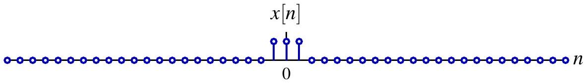{fig-align=center}

定义其周期延拓，周期满足 $N>N_{2}-N_{1}+1$：

$$
x_{N}[n]=\sum_{k=-\infty}^{\infty} x[n+k N]
$$

$$
x_{N}[n]
$$

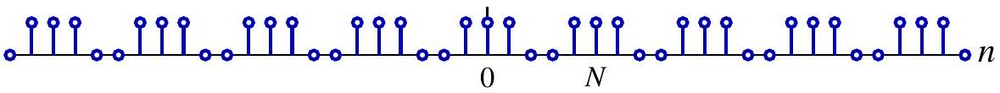{fig-align=center}

$x$ 可以看作“周期为无穷大”的周期信号，即 $x[n]=\lim _{N \rightarrow \infty} x_{N}[n]$

## 离散时间傅里叶变换

将 $x_{N}$ 展开为离散时间傅里叶级数

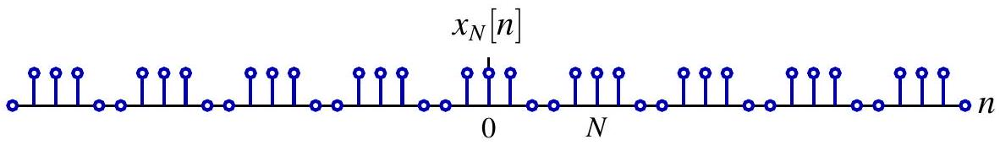{fig-align=center}

$$
\hat{x}_{N}[k]=\left\langle x_{N}, e^{j k \frac{2  \pi}{N} n}\right\rangle=\frac{1}{N} \sum_{n=N_{1}}^{N_{2}} x[n] e^{-j k \frac{2 \pi}{N} n}=\frac{1}{N} X\left(e^{j k \omega_{0}n}\right)
$$

其中

$$
X\left(e^{j \omega}\right)=\sum_{n=N_{1}}^{N_{2}} x[n] e^{-j \omega n}=\sum_{n=-\infty}^{\infty} x[n] e^{-j \omega n}, \quad \omega_{0}=\frac{2 \pi}{N}
$$

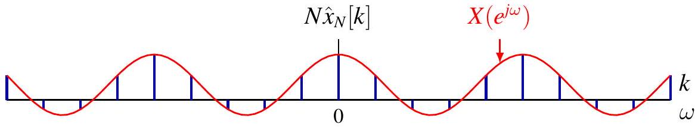{fig-align=center}

## 离散时间傅里叶变换

当 $N$ 增大时，离散频率的采样会变得更加稠密

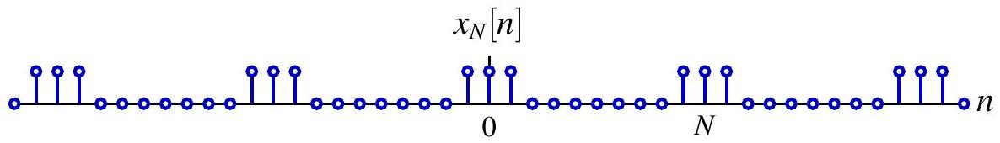{fig-align=center}

$$
\hat{x}_{N}[k]=\left\langle x_{N}, e^{j k \frac{2 \pi}{N} n}\right\rangle=\frac{1}{N} \sum_{n=N_{1}}^{N_{2}} x[n] e^{-j k \frac{2 \pi}{N} n}=\frac{1}{N} X\left(e^{j k \omega_{0} }\right)
$$

其中

$$
X\left(e^{j \omega}\right)=\sum_{n=N_{1}}^{N_{2}} x[n] e^{-j \omega n}=\sum_{n=-\infty}^{\infty} x[n] e^{-j \omega n}, \quad \omega_{0}=\frac{2 \pi}{N}
$$

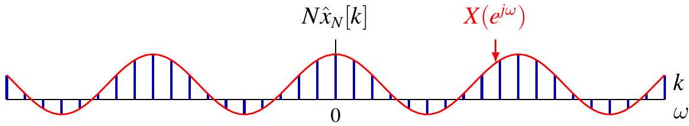{fig-align=center}

## 离散时间傅里叶变换

当 $N \rightarrow \infty$ 时，$N \hat{x}[k]$ 逐渐逼近包络 $X\left(e^{j \omega}\right)$

$$
x_{N}[n]
$$

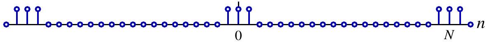{fig-align=center}

$$
\hat{x}_{N}[k]=\left\langle x_{N}, e^{jk \frac{2 \pi}{N} n}\right\rangle=\frac{1}{N} \sum_{n=N_{1}}^{N_{2}} x[n] e^{-jk \frac{2 \pi}{N} n}=\frac{1}{N} X\left(e^{j k \omega_{0} }\right)
$$

其中

$$
X\left(e^{j \omega}\right)=\sum_{n=N_{1}}^{N_{2}} x[n] e^{-j \omega n}=\sum_{n=-\infty}^{\infty} x[n] e^{-j \omega n}, \quad \omega_{0}=\frac{2 \pi}{N}
$$

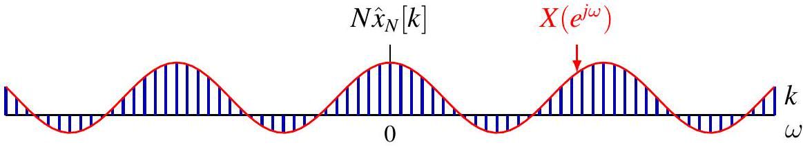{fig-align=center}

## 离散时间傅里叶变换

离散时间傅里叶级数的综合公式为：

$$
x_{N}[n]=\sum_{k \in[N]} \hat{x}[k] e^{j k \omega_{0} n}=\frac{1}{N} \sum_{k=0}^{N-1} X\left(e^{j k \omega_{0}}\right) e^{j k \omega_{0} n}
$$

令 $\omega_{k}=k \omega_{0}, \Delta \omega=\omega_{k}-\omega_{k-1}=\omega_{0}$，

$$
x_{N}[n]=\frac{1}{2 \pi} \sum_{k=0}^{N-1} X\left(e^{j \omega_{k}}\right) e^{j \omega_{k} n} \Delta \omega
$$

当 $N \rightarrow \infty$、$\Delta \omega \rightarrow 0$ 时，上述黎曼和变为积分：

$$
x[n]=\frac{1}{2 \pi} \int_{0}^{2 \pi} X\left(e^{j \omega}\right) e^{j \omega n} d \omega=\frac{1}{2 \pi} \int_{2 \pi} X\left(e^{j \omega}\right) e^{j \omega n} d \omega
$$

可在任意长度为 $2 \pi$ 的周期区间上积分

## 离散时间傅里叶变换变换对

离散时间傅里叶变换（分析公式）

$$
X\left(e^{j \omega}\right)=\mathcal{F}(x)\left(e^{j \omega}\right)=\sum_{n=-\infty}^{\infty} x[n] e^{-j \omega n}
$$

- $X\left(e^{j \omega}\right)$ 称为 $x[n]$ 的频谱，且以 $2 \pi$ 为周期

离散时间逆傅里叶变换（综合公式）

$$
x[n]=\mathcal{F}^{-1}(X)[n]=\frac{1}{2 \pi} \int_{2 \pi} X\left(e^{j \omega}\right) e^{j \omega n} d \omega
$$

- 频率为 $\omega$ 的复指数分量的权重为 $X\left(e^{j \omega}\right) \frac{d \omega}{2 \pi}$
- 只需在一个周期内积分，即只使用彼此不同的 $e^{j \omega n}$


## DTFT 与 CTFS 之间的对偶性

:::: {.columns style="text-align: center;"}

::: {.column width="50%"}

DTFT 变换对

- 离散时间
- 连续频率
  
分析公式

$$
X\left(e^{j \omega}\right)=\sum_{n=-\infty}^{\infty} x[n] e^{-j \omega n}
$$

综合公式

$$
x[n]=\frac{1}{2 \pi} \int_{2 \pi} X\left(e^{j \omega}\right) e^{j \omega n} d \omega
$$
:::
::: {.column width="50%"}
CTFS 变换对

- 连续时间
- 离散频率
  
分析公式

$$
\hat{x}[k]=\frac{1}{T} \int_{T} x(t) e^{-j k \frac{2 \pi}{T} t} d t
$$

综合公式

$$
x(t)=\sum_{k=-\infty}^{\infty} \hat{x}[k] e^{j k \frac{2 \pi}{T} t}
$$
:::
::::
$$
\begin{aligned}
& \text { 连续变量 } \xrightarrow{\text { CTFS }} \text { 双向无限序列 } \\
& \text { 周期函数 }
\end{aligned} \xrightarrow[\text { DTFT }]{\leftarrow} \text { 双向映射 }
$$

<!-- ## 离散时间信号的高频与低频

高频对应于 $(2 k+1) \pi$ 附近，低频对应于 $2 k \pi$ 附近
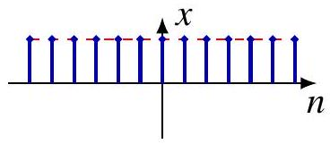
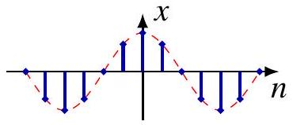
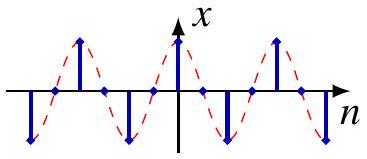
$\phi_{N}^{0}[n]=\cos (0 \cdot n)=1$
$\phi_{N}^{1}[n]=\cos (\pi n / 4)$
$\phi_{N}^{2}[n]=\cos (\pi n / 2)$
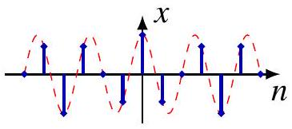
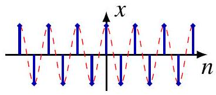
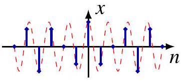
$\phi_{N}^{3}[n]=\cos (3 \pi n / 4)$
$\phi_{N}^{4}[n]=\cos (\pi n)$
$\phi_{N}^{5}[n]=\cos (5 \pi n / 4)$
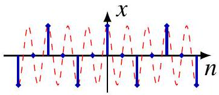
$\phi_{N}^{6}[n]=\cos (3 \pi n / 2)$
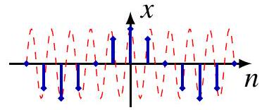
$\phi_{N}^{7}[n]=\cos (7 \pi n / 4)$
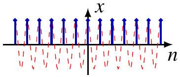
$\phi_{N}^{8}[n]=\cos (2 \pi n)=1$ -->

## 离散时间信号的高频与低频

$N$ 周期信号的离散频率

- 在单位圆上均匀分布的点
- 低频靠近 $1$；高频靠近 $-1$

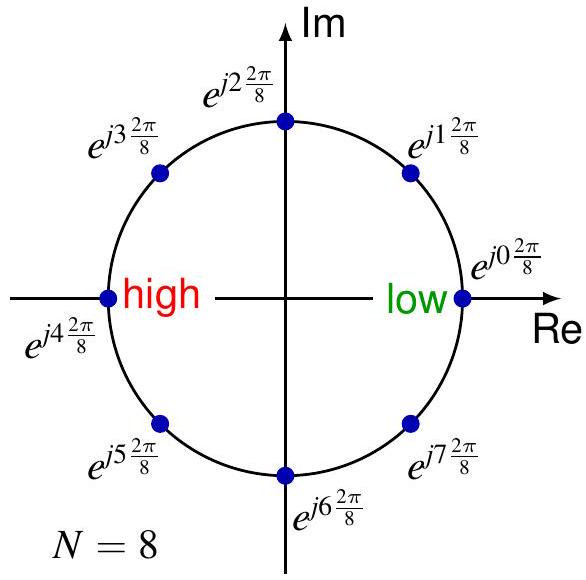{width=40%}
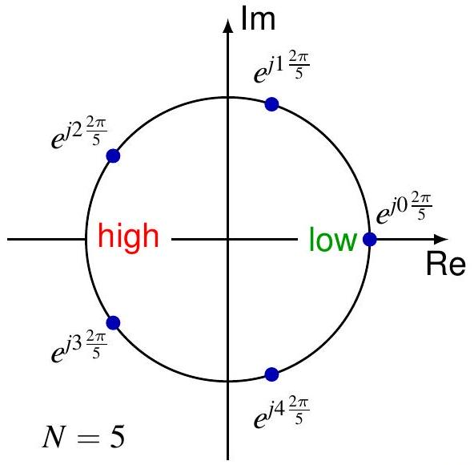{width=40%}


## 离散时间信号的高频与低频

:::: {.columns style="text-align: center;"}

::: {.column width="50%"}
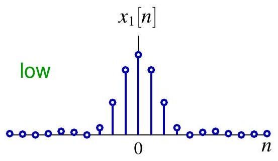

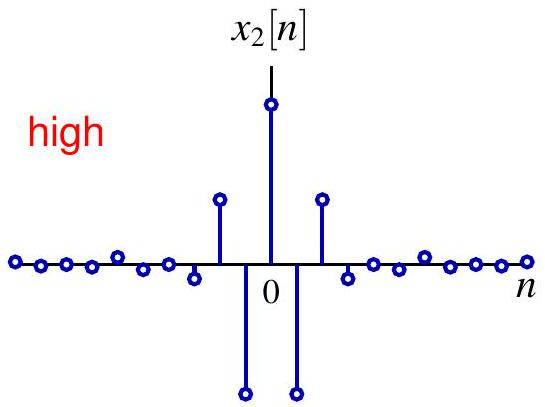
:::

::: {.column width="50%"}
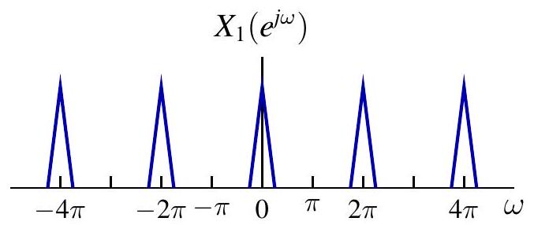{width=90%}

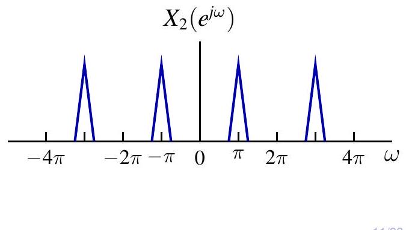{width=90%}

:::

::::


## 例：单边衰减指数序列

$$
x[n]=a^{n} u[n] \stackrel{\mathcal{F}}{\longleftrightarrow} X\left(e^{j \omega}\right)=\frac{1}{1-a e^{-j \omega}}, \quad|a|<1
$$

$\left|X\left(e^{j \omega}\right)\right|=\frac{1}{\sqrt{1-2 a \cos \omega+a^{2}}}, \quad \arg X\left(e^{j \omega}\right)=-\arctan \frac{a \sin \omega}{1-a \cos \omega}$


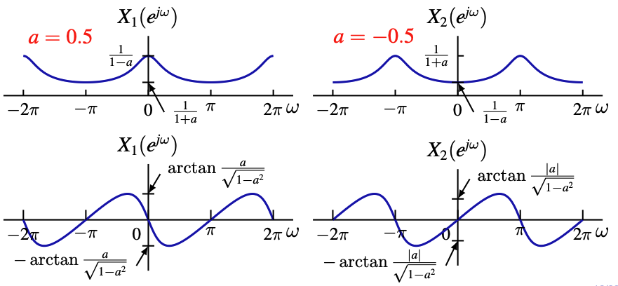


## 例：双边衰减指数序列

$$
x[n]=a^{|n|} \stackrel{\mathcal{F}}{\longleftrightarrow} X\left(e^{j \omega}\right)=\frac{1-a^{2}}{1-2 a \cos \omega+a^{2}}, \quad|a|<1
$$

:::: {.columns style="text-align: center;"}

::: {.column width="50%"}
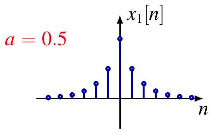

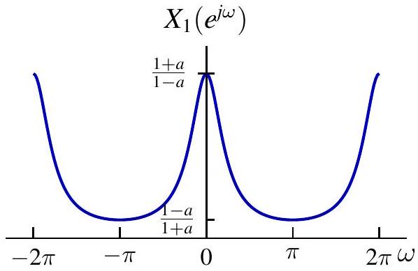

:::

::: {.column width="50%"}
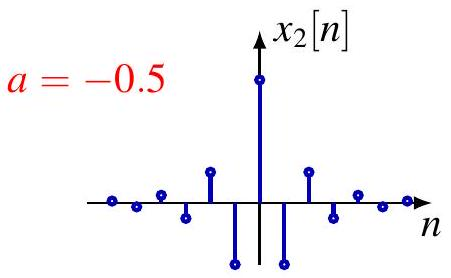


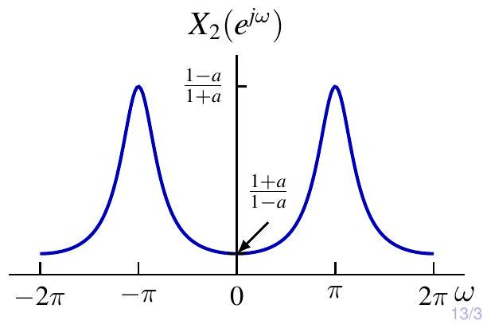

:::

::::

## 交互演示


```{ojs}
//| panel: sidebar
viewof a = Inputs.range([-0.95, 0.95], {value: 0.5, step: 0.05, label: "参数 a:"})
viewof type = Inputs.radio(["单边 (aⁿu[n])", "双边 (a|^n|)"], {value: "单边 (aⁿu[n])", label: "序列类型:"})


//| panel: fill
// 计算数据
data = {
  const n = d3.range(-15, 16);
  const w = d3.range(-2 * Math.PI, 2 * Math.PI, 0.05);
  
  // 时域信号
  const x = n.map(nv => {
    if (type === "单边 (aⁿu[n])") {
        return nv >= 0 ? Math.pow(a, nv) : 0;
    } else {
        return Math.pow(a, Math.abs(nv));
    }
  });

  // 频域幅度谱
  const spectrum = w.map(wv => {
    if (type === "单边 (aⁿu[n])") {
        // |X(e^jw)| = 1 / sqrt(1 - 2acosw + a^2)
        return 1 / Math.sqrt(1 - 2 * a * Math.cos(wv) + a * a);
    } else {
        // X(e^jw) = (1 - a^2) / (1 - 2acosw + a^2)
        return (1 - a * a) / (1 - 2 * a * Math.cos(wv) + a * a);
    }
  });

  return { n, x, w, spectrum };
}

// 绘制时域图
Plot.plot({
  height: 250,
  title: "时域序列 x[n]",
  x: { label: "n" },
  y: { domain: [-1.1, 1.1] },
  marks: [
    Plot.ruleY([0]),
    Plot.dot(data.n.map((d, i) => ({n: d, x: data.x[i]})), {x: "n", y: "x", fill: "steelblue"}),
    Plot.ruleX(data.n.map((d, i) => ({n: d, x: data.x[i]})), {x: "n", y1: 0, y2: "x", stroke: "steelblue"})
  ]
})

// 绘制频域图
Plot.plot({
  height: 250,
  title: "幅度谱 |X(e^jω)|",
  x: { label: "ω (rad)", tickFormat: d => (d / Math.PI).toFixed(1) + "π" },
  y: { label: "Magnitude" },
  marks: [
    Plot.ruleY([0]),
    Plot.line(data.w.map((d, i) => ({w: d, s: data.spectrum[i]})), {x: "w", y: "s", stroke: "red"}),
    Plot.areaY(data.w.map((d, i) => ({w: d, s: data.spectrum[i]})), {x: "w", y: "s", fill: "red", fillOpacity: 0.1})
  ]
})

```


<!-- ## 交互演示：参数 $a$ 对频谱的影响

```{shinylive-python}
#| standalone: true
#| viewerHeight: 600

import numpy as np
import matplotlib.pyplot as plt
from shiny import App, render, ui

# 定义 UI 界面
app_ui = ui.page_fluid(
    ui.layout_sidebar(
        ui.sidebar(
            ui.input_slider("a", "参数 a (衰减系数)", -0.95, 0.95, 0.5, step=0.05),
            ui.markdown("""
            **教学重点：**
            - $a > 0$: 低通 (平滑)
            - $a < 0$: 高通 (震荡)
            - $|a| \to 1$: 能量更集中
            """)
        ),
        ui.output_plot("dtft_plot"),
    )
)

# 定义服务器逻辑
def server(input, output, session):
    @output
    @render.plot
    def dtft_plot():
        a = input.a()
        n = np.arange(-15, 16)
        w = np.linspace(-2 * np.pi, 2 * np.pi, 500)
        
        # 1. 单边序列
        x1 = np.where(n >= 0, a**n, 0)
        X1_abs = 1 / np.sqrt(1 - 2*a*np.cos(w) + a**2)
        
        # 2. 双边序列
        x2 = a**np.abs(n)
        X2 = (1 - a**2) / (1 - 2*a*np.cos(w) + a**2)

        fig, axs = plt.subplots(2, 2, figsize=(10, 8))
        
        # 时域 Stem 图
        axs[0, 0].stem(n, x1)
        axs[0, 0].set_title(r"Single-sided: $a^n u[n]$")
        axs[0, 0].set_ylim(-1.1, 1.1)
        
        axs[0, 1].stem(n, x2)
        axs[0, 1].set_title(r"Double-sided: $a^{|n|}$")
        axs[0, 1].set_ylim(-1.1, 1.1)

        # 频域 幅度谱
        axs[1, 0].plot(w/np.pi, X1_abs, 'r')
        axs[1, 0].set_title(r"Magnitude $|X_1(e^{j\omega})|$")
        axs[1, 0].set_xlabel(r"$\omega$ ($\pi$ rad)")
        
        axs[1, 1].plot(w/np.pi, X2, 'g')
        axs[1, 1].set_title(r"Magnitude $X_2(e^{j\omega})$")
        axs[1, 1].set_xlabel(r"$\omega$ ($\pi$ rad)")
        
        for ax in axs[1]:
            ax.grid(True, alpha=0.3)
            ax.set_xticks([-2, -1, 0, 1, 2])
            
        plt.tight_layout()
        return fig

app = App(app_ui, server)
``` -->


## 例：矩形脉冲

$$
x[n]=u\left[n+N_{1}\right]-u\left[n-N_{1}-1\right] \stackrel{\mathcal{F}}{\longleftrightarrow} X\left(e^{j \omega}\right)=\frac{\sin \left(\frac{2 N_{1}+1}{2} \omega\right)}{\sin \frac{\omega}{2}}
$$

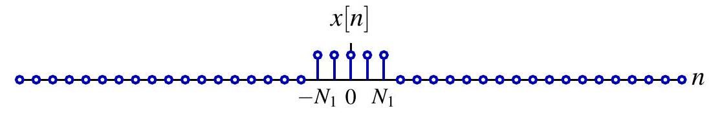{fig-align=center}

$$
X\left(e^{j \omega}\right)
$$

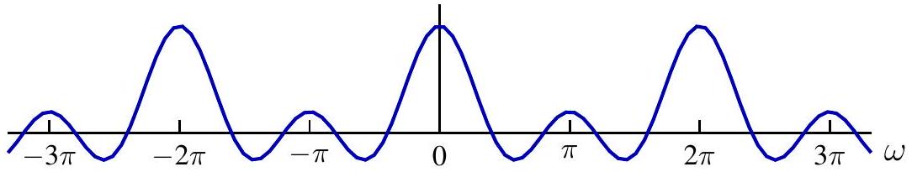{fig-align=center}

Dirichlet 核（周期情形）是 sinc 函数（非周期情形）在离散时间中的对应变换
注意：$N_{1}=0 \Longrightarrow x[n]=\delta[n] \stackrel{\mathcal{F}}{\longleftrightarrow} X\left(e^{j \omega}\right)=1$

## DTFT 的收敛性

令

$$
X_{N}\left(e^{j \omega}\right)=\sum_{n=-N}^{N} x[n] e^{-j \omega n}
$$

定理：若 $x \in \ell_{1}$，则 $X_{N}$ 一致收敛到 $X$，即

$$
\lim _{N \rightarrow \infty}\left\|X-X_{N}\right\|_{\infty}=0
$$

因此，傅里叶变换 $X$ 是一致连续的。
定理：若 $x \in \ell_{2}$，则 $X_{N}$ 在 $L_{2}$ 意义下收敛到 $X$，即

$$
\lim _{N \rightarrow \infty}\left\|X-X_{N}\right\|_{2}=0
$$

<!-- - CTFS：$L_{2}(T) \rightarrow \ell_{2}$ 是 Hilbert 空间之间的同构
- DTFT：$\ell_{2} \rightarrow L_{2}(2 \pi)$ 也是同构 -->


## 例：理想低通滤波器


\begin{aligned}
& x[n]=\frac{\sin (W n)}{\pi n} \stackrel{\mathcal{F}}{\longleftrightarrow} X\left(e^{j \omega}\right)=\sum_{k=-\infty}^{\infty}[u(\omega+W+2 k \pi)-u(\omega-W+2 k \pi)] \\

\end{aligned}

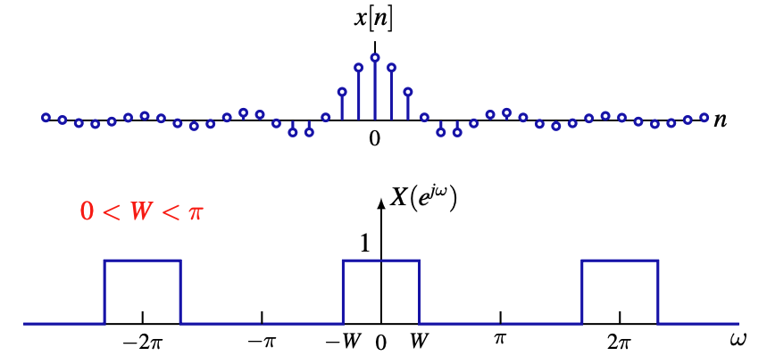{fig-align=center}


注意：$x \notin \ell_{1}$，且 $X$ 不连续

## 作为广义函数的收敛

复指数信号 $x[n]=e^{j \omega_{0} n}$ 不属于 $\ell_{1}$ 也不属于 $\ell_{2}$。

（平移后的）Dirichlet 核

$$
X_{N}\left(e^{j \omega n}\right)=\frac{\sin \left(\frac{2 N_{1}+1}{2}\left(\omega-\omega_{0}\right)\right)}{\sin \frac{\omega-\omega_{0}}{2}} \rightarrow 2 \pi \sum_{\ell=-\infty}^{\infty} \delta\left(\omega-\omega_{0}-2 \ell \pi\right)
$$

在分布（广义函数）意义下，有

$$
x[n]=e^{j \omega_{0} n} \stackrel{\mathcal{F}}{\longleftrightarrow} X\left(e^{j \omega}\right)=2 \pi \sum_{\ell=-\infty}^{\infty} \delta\left(\omega-\omega_{0}-2 \ell \pi\right)
$$

利用综合公式进行形式验证

$$
x[n]=\frac{1}{2 \pi} \int_{-\pi}^{\pi} X\left(e^{j \omega}\right) e^{j \omega n} d \omega=\int_{-\pi}^{\pi} \delta\left(\omega-\omega_{0}\right) e^{j \omega n} d \omega=e^{j \omega_{0} n}
$$

注意：也可通过对 $e^{j \omega_{0} t}$ 以 $T=1, \omega_{s}=2 \pi$ 采样得到
注意：$x[n]$ 不一定是周期信号！直流分量对应 $\omega_{0}=0$。

## 例：正弦信号

$$
\begin{aligned}
x[n] & =\cos \left(\omega_{0} n+\phi\right)=\frac{e^{j \phi}}{2} e^{j \omega_{0} n}+\frac{e^{-j \phi}}{2} e^{-j \omega_{0} n} \\
X\left(e^{j \omega}\right) & =\sum_{\ell=-\infty}^{\infty} \pi e^{j \phi} \delta\left(\omega-\omega_{0}-2 \ell \pi\right)+\pi e^{-j \phi} \delta\left(\omega+\omega_{0}-2 \ell \pi\right)
\end{aligned}
$$

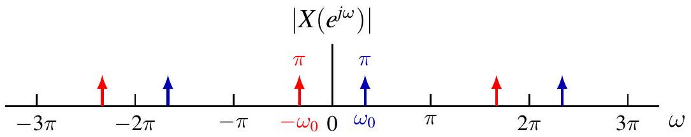{fig-align=center}

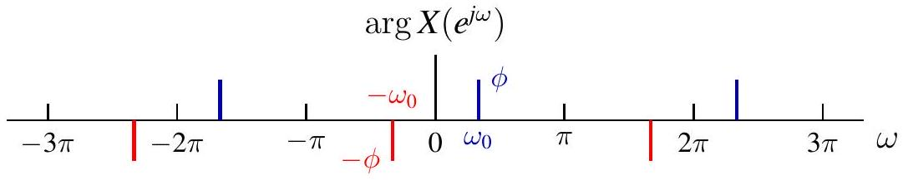{fig-align=center}

## 周期信号的 DTFT

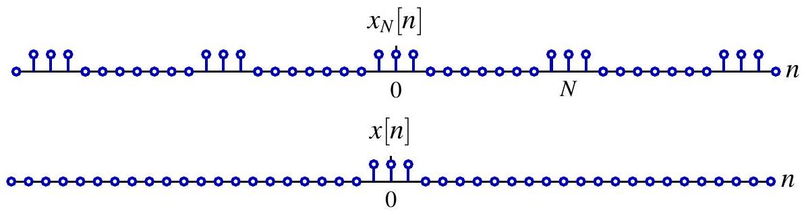{fig-align=center}

回顾：DTFS 系数 $\hat{x}_{N}[k]$ 就是频率 $k \omega_{0}$ 处的幅值

$$
\hat{x}_{N}[k]=\frac{1}{N} X\left(e^{j k \omega_{0}}\right), \quad \text { 其中 } X=\mathcal{F}\{x\}, \quad \omega_{0}=\frac{2 \pi}{N}
$$

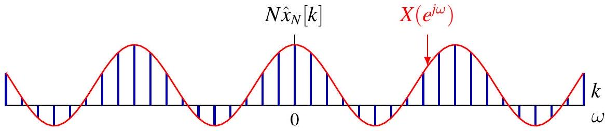{fig-align=center}

## 周期信号的 DTFT

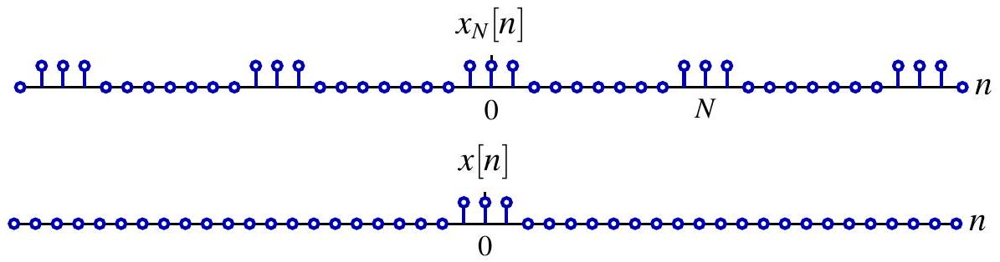{fig-align=center}

DTFT 中 $(2 \pi)^{-1} X\left(e^{j \omega}\right)$ 表示频率 $\omega$ 处的密度

$$
X\left(e^{j \omega}\right)=2 \pi \sum_{k=-\infty}^{\infty} \hat{x}_{N}[k] \delta\left(\omega-k \omega_{0}\right)=\omega_{0} \sum_{k=-\infty}^{\infty} X\left(e^{j k \omega_{0}}\right) \delta\left(\omega-k \omega_{0}\right)
$$

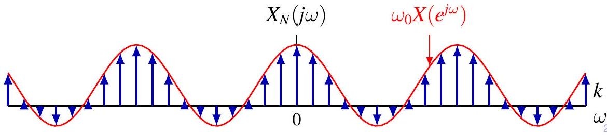{fig-align=center}

## 周期信号的 DTFT

回顾 $x_{N}$ 的 DTFS 表达式

$$
x_{N}[n]=\sum_{k=0}^{N-1} \hat{x}_{N}[k] e^{j \frac{2 k \pi}{N} n}
$$

对两边取 DTFT，并利用线性性质以及复指数信号的 DTFT，得到

$$
\begin{aligned}
X_{N}\left(e^{j \omega}\right) & =\sum_{k=0}^{N-1} \hat{x}_{N}[k] \mathcal{F}\left\{e^{j \frac{2 k \pi}{N} n}\right\}=\sum_{k=0}^{N-1} \hat{x}_{N}[k] \sum_{\ell=-\infty}^{\infty} 2 \pi \delta\left(\omega-\frac{2 k \pi}{N}-2 \ell \pi\right) \\
& =2 \pi \sum_{\ell=-\infty}^{\infty} \sum_{k=0}^{N-1} \hat{x}_{N}[k] \delta\left(\omega-\frac{2(k+\ell N) \pi}{N}\right) \\
& =2 \pi \sum_{k=-\infty}^{\infty} \hat{x}_{N}[k] \delta\left(\omega-\frac{2 k \pi}{N}\right) \quad\left(\text { 根据 } \hat{x}_{N}[k]=\hat{x}_{N}[k+\ell N]\right)
\end{aligned}
$$

## 周期信号的 DTFT

也可以使用综合公式（即逆变换公式）进行正式验证

$$
\frac{1}{2 \pi} \int_{-\frac{\pi}{N}}^{2 \pi-\frac{\pi}{N}} X\left(e^{j \omega}\right) e^{j \omega n} d \omega=\int_{-\frac{\pi}{N}}^{2 \pi-\frac{\pi}{N}} \sum_{k=-\infty}^{\infty} \hat{x}_{N}[k] \delta\left(\omega-\frac{2 k \pi}{N}\right) e^{j \omega n} d \omega
$$

只有 $k=0,1, \ldots, N-1$ 的项落在积分区间内

$$
\int_{-\frac{\pi}{N}}^{2 \pi-\frac{\pi}{N}} \sum_{k=0}^{N-1} \hat{x}_{N}[k] \delta\left(\omega-\frac{2 k \pi}{N}\right) e^{j \omega n} d \omega=\sum_{k=0}^{N-1} \hat{x}_{N}[k] e^{j \frac{2 k \pi}{N} n}=x_{N}[n]
$$

最后一个等号实际上就是离散时间傅里叶级数（DTFS）的综合公式，因此（该推导）得到了验证。

$$
x_{N}[n]=\frac{1}{2 \pi} \int_{2 \pi} X\left(e^{j \omega}\right) e^{j \omega n} d \omega
$$

## 例：离散时间周期冲激串

$$
x[n]=\sum_{k=-\infty}^{\infty} \delta[n-k N] \stackrel{\mathcal{F}}{\longleftrightarrow} X\left(e^{j \omega}\right)=\frac{2 \pi}{N} \sum_{k=-\infty}^{\infty} \delta\left(\omega-\frac{2 \pi k}{N}\right)
$$

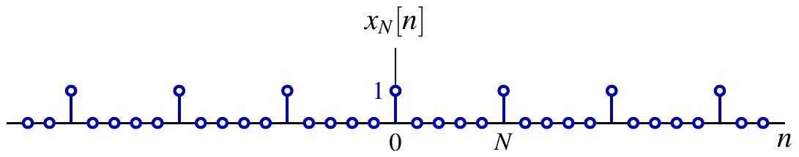{fig-align=center}

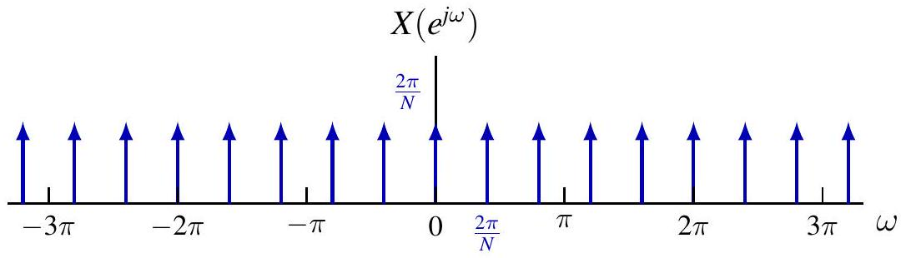{fig-align=center}

## 目录 {#toc1}

- [1. 非周期信号的表示：离散时间傅里叶变换](#sec51)
- [**2. 离散时间傅里叶变换的性质**](#sec52)
- [3. 卷积性质](#sec53)
- [4. 乘积性质](#sec54)
- [5. 变换性质和变换对列表](#sec55)
- [6. 对偶性](#sec56)
- [7. 由线性常系数差分方程表征的系统](#sec57)

## 离散时间傅里叶变换的性质

**周期性**

$$
X\left(e^{j(\omega+2 \pi)}\right)=X\left(e^{j(\omega)}\right)
$$

**线性**

$$
\mathcal{F}\{a x+b y\}=a \mathcal{F}\{x\}+b \mathcal{F}\{y\}
$$

**时移与频移**

若

$$
x[n] \stackrel{\mathcal{F}}{\longleftrightarrow} X\left(e^{j \omega}\right)
$$

则

$$
x\left[n-n_{0}\right] \stackrel{\mathcal{F}}{\longleftrightarrow} e^{-j \omega n_{0}} X\left(e^{j \omega}\right)
$$

并且

$$
e^{j \omega_{0} n} x[n] \stackrel{\mathcal{F}}{\longleftrightarrow} X\left(e^{j\left(\omega-\omega_{0}\right)}\right)
$$

## 例：高通与低通滤波器

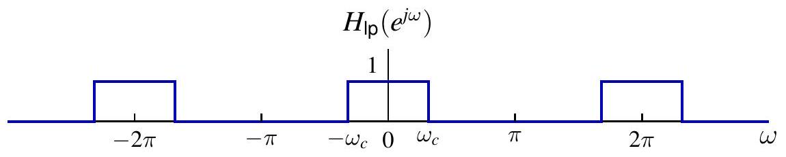{fig-align=center}

$$
H_{\mathrm{hp}}\left(e^{j \omega}\right)=H_{\mathrm{lp}}\left(e^{j(\omega-\pi)}\right)
$$

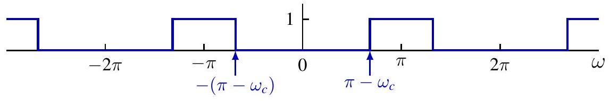{fig-align=center}

$$
H_{\mathrm{hp}}\left(e^{j \omega}\right)=H_{\mathrm{lp}}\left(e^{j(\omega-\pi)}\right) \Longleftrightarrow h_{\mathrm{hp}}[n]=e^{j \pi n} h_{\mathrm{lp}}[n]=(-1)^{n} h_{\mathrm{lp}}[n]
$$

利用低通滤波器实现高通滤波 $y=x * h_{\mathrm{hp}}$
(1) $x_{1}[n]=(-1)^{n} x[n]$；
(2) $y_{1}=x_{1} * h_{\mathrm{lp}}$；
(3) $y[n]=(-1)^{n} y_{1}[n]$

## 离散时间傅里叶变换的性质

设

$$
x[n] \stackrel{\mathcal{F}}{\longleftrightarrow} X\left(e^{j \omega}\right)
$$

时间反转

$$
x[-n] \stackrel{\mathcal{F}}{\longleftrightarrow} X\left(e^{-j \omega}\right)
$$

共轭

$$
x^{*}[n] \stackrel{\mathcal{F}}{\longleftrightarrow} X^{*}\left(e^{-j \omega}\right)
$$

对称性

- $x$ 为偶信号 $\Longleftrightarrow X$ 为偶函数，$\quad x$ 为奇信号 $\Longleftrightarrow X$ 为奇函数
- $x$ 为实信号 $\Longleftrightarrow X\left(e^{-j \omega}\right)=X^{*}\left(e^{j \omega}\right)$
- $x$ 为实信号 并且 是 偶函数 $\Longleftrightarrow X$ 是实信号 并且 是偶函数
- $x$ 为实信号 并且 是奇函数 $\Longleftrightarrow X$ 纯虚信号 并且 是奇函数


## 差分和累加

一阶（后向）差分

$$
x[n]-x[n-1] \stackrel{\mathcal{F}}{\longleftrightarrow}\left(1-e^{-j \omega}\right) X\left(e^{j \omega}\right)
$$

累加（运行和）

$$
y[n]=\sum_{m=-\infty}^{n} x[m] \stackrel{\mathcal{F}}{\longleftrightarrow} \frac{1}{1-e^{-j \omega}} X\left(e^{j \omega}\right)+\pi X\left(e^{j 0}\right) \sum_{k=-\infty}^{\infty} \delta(\omega-2 \pi k)
$$

- 第一项来自差分性质
- 第二项是直流分量 $\mathcal{F}\{\bar{y}\}$ 的 DTFT，其中 $\bar{y}=\frac{1}{2} X\left(e^{j 0}\right)$ 

例：由于 $\delta[n] \stackrel{\mathcal{F}}{\longleftrightarrow} 1$，

$$
u[n]=\sum_{m=-\infty}^{n} \delta[m] \stackrel{\mathcal{F}}{\longleftrightarrow} \frac{1}{1-e^{-j \omega}}+\pi \sum_{k=-\infty}^{\infty} \delta(\omega-2 \pi k)
$$

## 时间扩展

定义 $x_{(m)}$ 为

$$
x_{(m)}[n]= \begin{cases}x[n / m], & \text { 若 } n \text { 是 } m  \text {的倍数} \\ 0, & \text { 其他 }\end{cases}
$$

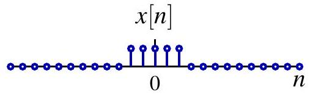{width=25%, fig-align=center}

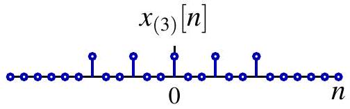{width=25%, fig-align=center}

若:
$x[n] \stackrel{\mathcal{F}}{\longleftrightarrow} X\left(e^{j \omega}\right)$,
则有：
$x_{(m)}[n] \stackrel{\mathcal{F}}{\longleftrightarrow} X\left(e^{j m \omega}\right)
$

证明。

$$
\mathcal{F}\left\{x_{(m)}\right\}\left(e^{j m \omega}\right)=\sum_{n=-\infty}^{\infty} x_{(m)}[n] e^{-j \omega n}=\sum_{\ell=-\infty}^{\infty} x[\ell] e^{-j \omega m \ell}=X\left(e^{j m \omega}\right)
$$

## 例

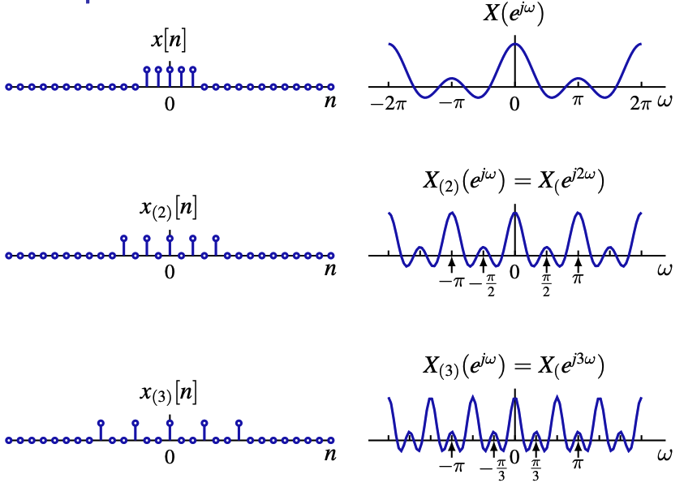{fig-align=center, width=70%}
<!-- 
$$
X\left(e^{j \omega}\right)
$$

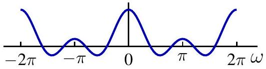{fig-align=center}

$$
\left.X_{(2)}\left(e^{j \omega}\right)=X_{( } e^{j 2 \omega}\right)
$$

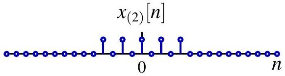{fig-align=center}

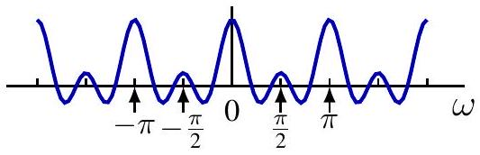{fig-align=center}

$$
x_{(3)}[n]
$$

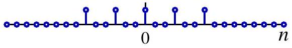

$$
\left.X_{(3)}\left(e^{j \omega}\right)=X_{( } e^{j 3 \omega}\right)
$$

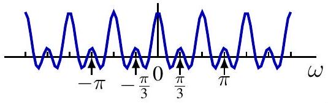{fig-align=center} -->

## 频域微分性质

若

$$
x[n] \stackrel{\mathcal{F}}{\longleftrightarrow} X\left(e^{j \omega}\right)
$$

则

$$
n x[n] \stackrel{\mathcal{F}}{\longleftrightarrow} j \frac{d}{d \omega} X\left(e^{j \omega}\right)
$$

证明。

$$
X\left(e^{j \omega}\right)=\sum_{n=-\infty}^{\infty} x[n] e^{-j \omega n}
$$

在求和号内对 $\omega$ 求导

$$
\frac{d}{d \omega} X\left(e^{j \omega}\right)=\sum_{n=-\infty}^{\infty} x[n](-j n) e^{-j \omega n}
$$

## 帕塞瓦尔恒等式

定理. 
<br>
<br>
若 $x \in \ell_{2}, X=\mathcal{F}\{x\}$, 则

$$
\|x\|_{\ell_{2}}^{2}=\|X\|_{L_{2}(2 \pi)}^{2}, \quad \text { 或 } \quad \sum_{n \in \mathbb{Z}}|x[n]|^{2}=\frac{1}{2 \pi} \int_{2 \pi}\left|X\left(e^{j \omega}\right)\right|^{2} d \omega
$$

注意 $\omega$ 是角频率（单位：rad/s），而 $f = \frac{\omega}{2\pi}$ 是频率（单位：Hz）。

$$
\sum_{n \in \mathbb{Z}}|x[n]|^{2}=\int_{2 \pi}\left|X\left(e^{j \omega}\right)\right|^{2} \frac{d \omega}{2 \pi}
$$

解释：能量守恒

- $\sum_{n \in \mathbb{Z}}|x[n]|^{2}$ 是总能量
- $\left|X\left(e^{j \omega}\right)\right|^{2}$ 是单位频率上的能量
$\left|X\left(e^{j \omega}\right)\right|^{2}$ 称为能量密度谱


## 帕塞瓦尔恒等式

定理. 
<br>
<br>
若 $x, y \in \ell_{2}, X=\mathcal{F}\{x\}, Y=\mathcal{F}\{y\}$, 则

$$
\langle x, y\rangle_{\ell_{2}}=\langle X, Y\rangle_{L_{2}(2 \pi)}, \quad \text { 或 } \quad \sum_{n \in \mathbb{Z}} x[n] y^{*}[n]=\frac{1}{2 \pi} \int_{2 \pi} X\left(e^{j \omega}\right) Y^{*}\left(e^{j \omega}\right) d \omega
$$

证明。

$$
\begin{aligned}
\langle X, Y\rangle_{L_{2}(2 \pi)} & =\left\langle\sum_{n \in \mathbb{Z}} x[n] e^{-j \omega n}, \sum_{m \in \mathbb{Z}} y[m] e^{-j \omega m}\right\rangle_{L_{2}(2 \pi)} \\
& =\sum_{n \in \mathbb{Z}} x[n] \sum_{m \in \mathbb{Z}} y^{*}[m]\left\langle e^{-j \omega n}, e^{-j \omega m}\right\rangle_{L_{2}(2 \pi)} \\
& =\sum_{n \in \mathbb{Z}} x[n] \sum_{m \in \mathbb{Z}} y^{*}[m] \delta[n-m] \\
& =\sum_{n \in \mathbb{Z}} x[n] y^{*}[n]=\langle x, y\rangle_{\ell_{2}}
\end{aligned}
$$


## 目录 {#toc2}

- [1. 非周期信号的表示：离散时间傅里叶变换](#sec51)
- [2. 离散时间傅里叶变换的性质](#sec52)
- [**3. 卷积性质**](#sec53)
- [4. 乘积性质](#sec54)
- [5. 变换性质和变换对列表](#sec55)
- [6. 对偶性](#sec56)
- [7. 由线性常系数差分方程表征的系统](#sec57)

## DTFT 的卷积性质

$$
(x * h)[n] \stackrel{\mathcal{F}}{\longleftrightarrow} X\left(e^{j \omega}\right) H\left(e^{j \omega}\right)
$$

注：这是 CTFS 中乘法性质的对偶形式。

$$
x(t) y(t) \stackrel{\mathcal{F S}}{\longleftrightarrow}(\hat{x} * \hat{y})[k]
$$

注：与 CTFT 的情形类似，该公式在相关表达式定义良好时成立。

$$
\begin{aligned}
\mathcal{F}\{x * h\}\left(e^{j \omega}\right) & =\sum_{n \in \mathbb{Z}}(x * h)[n] e^{-j \omega n}=\sum_{n \in \mathbb{Z}} \sum_{m \in \mathbb{Z}} x[m] h[n-m] e^{-j \omega n} \\
& =\sum_{m \in \mathbb{Z}} x[m] \sum_{n \in \mathbb{Z}} h[n-m] e^{-j \omega n} \\
& =\sum_{m \in \mathbb{Z}} x[m] e^{-j \omega m} H\left(e^{j \omega}\right) \\
& =X\left(e^{j \omega}\right) H\left(e^{j \omega}\right)
\end{aligned}
$$

## LTI 系统的频率响应

LTI 系统 $T$

- 可由冲激响应 $h$ 完全表征

$$
y=T(x)=h * x
$$

- 若 $H=\mathcal{F}\{h\}$ 定义良好，也可由频率响应 $H$ 完全表征
- 对于 BIBO 稳定系统，有 $h \in \ell_{1}$
- 其他系统：例如累加器，其 $h=u$，等等

通常，由卷积性质可得

$$
Y=\mathcal{F}\{y\}=H X=\mathcal{F}\{h\} \mathcal{F}\{x\}
$$

不直接计算 $x * h$，也可以写成

$$
y=\mathcal{F}^{-1}(\mathcal{F}\{h\} \mathcal{F}\{x\})
$$

## 例

求冲激响应为 $h[n]=a^{n} u[n]$ 的 LTI 系统在输入 $x[n]=b^{n} u[n]$ 下的响应，其中 $|a|<1,|b|<1$
<br>
<br>
方法 1：直接卷积 $y=x * h$

方法 2：在初始松弛条件下求解差分方程

$$
y[n]-a y[n-1]=b^{n} u[n]
$$

## 例

求冲激响应为 $h[n]=a^{n} u[n]$ 的 LTI 系统在输入 $x[n]=b^{n} u[n]$ 下的响应，其中 $|a|<1,|b|<1$
<br>
<br>

方法 3：使用傅里叶变换。

$$
H=\frac{1}{1-a e^{-j \omega}}, X=\frac{1}{1-b e^{-j \omega}} \Longrightarrow Y=\frac{1}{\left(1-a e^{-j \omega}\right)\left(1-b e^{-j \omega}\right)}
$$

若 $a \neq b$， $$Y\left(e^{j \omega}\right)=\frac{a /(a-b)}{1-a e^{-j \omega}}-\frac{b /(a-b)}{1-b e^{-j \omega}}, \quad y[n]=\frac{1}{a-b}\left(a^{n+1}-b^{n+1}\right) u[n]$$
若 $a=b$， $$Y\left(e^{j \omega}\right)=\frac{d}{d a}\left(\frac{a}{1-a e^{-j \omega}}\right), y[n]=\frac{d}{d a} a^{n+1} u[n]=(n+1) a^{n} u[n]$$
或者利用 $Y\left(e^{j \omega}\right)=\frac{j}{a} e^{j \omega} \frac{d}{d \omega}\left(\frac{a}{1-a e^{-j \omega}}\right)$ 以及微分性质

## 例

求冲激响应为 $h[n]=a^{n} u[n]$ 的 LTI 系统在输入 $x[n]=\cos \left(\omega_{0} n\right)$、且 $|a|<1$ 时的响应。
频率响应

$$
H\left(e^{j \omega}\right)=\frac{1}{1-a e^{-j \omega}}
$$

方法 1：利用特征函数性质

$$
\begin{gathered}
x[n]=\frac{1}{2} e^{j \omega_{0} n}+\frac{1}{2} e^{-j \omega_{0} n} \\
y[n]=\frac{1}{2} H\left(e^{j \omega_{0}}\right) e^{j \omega_{0} n}+\frac{1}{2} H\left(e^{-j \omega_{0}}\right) e^{-j \omega_{0} n}=\operatorname{Re} \frac{e^{j \omega_{0} n}}{1-a e^{-j \omega_{0}}} \\
=\frac{1}{\sqrt{1-2 a \cos \omega_{0}+a^{2}}} \cos \left(\omega_{0} n-\arctan \frac{a \sin \omega_{0}}{1-a \cos \omega_{0}}\right)
\end{gathered}
$$

## 例

方法 2：利用输入的傅里叶变换 $X$

$$
\begin{aligned}
& X\left(e^{j \omega}\right)=\sum_{k=-\infty}^{\infty}\left[\pi \delta\left(\omega-\omega_{0}+2 k \pi\right)+\pi \delta\left(\omega+\omega_{0}+2 k \pi\right)\right] \\
& Y\left(e^{j \omega}\right)=\sum_{k=-\infty}^{\infty} \pi H\left(e^{j\left(\omega_{0}-2 k \pi\right)}\right) \delta\left(\omega-\omega_{0}+2 k \pi\right) \\
& \quad+\sum_{k=-\infty}^{\infty} \pi H\left(e^{-j\left(\omega_{0}+2 k \pi\right)}\right) \delta\left(\omega+\omega_{0}+2 k \pi\right) \\
& =H\left(e^{j \omega_{0}}\right) \sum_{k=-\infty}^{\infty} \pi \delta\left(\omega-\omega_{0}+2 k \pi\right) \\
& \quad+H\left(e^{-j \omega_{0}}\right) \sum_{k=-\infty}^{\infty} \pi \delta\left(\omega+\omega_{0}+2 k \pi\right) \\
& y[n]=\frac{1}{2} H\left(e^{j \omega_{0}}\right) e^{j \omega_{0} n}+\frac{1}{2} H\left(e^{-j \omega_{0}}\right) e^{-j \omega_{0} n}
\end{aligned}
$$

## 例：理想带阻滤波器

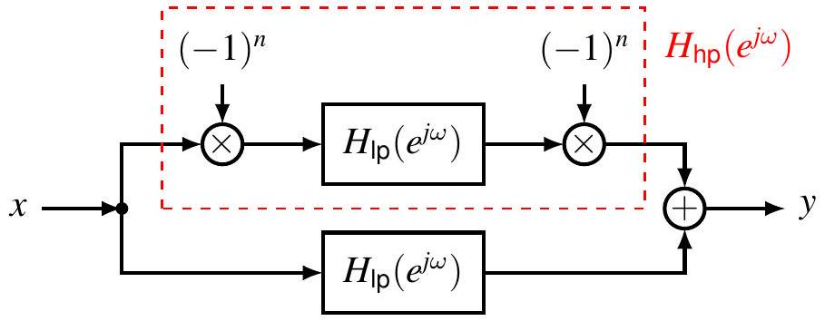{fig-align=center}

{fig-align=center}

{fig-align=center}

## 目录 {#toc3}

- [1. 非周期信号的表示：离散时间傅里叶变换](#sec51)
- [2. 离散时间傅里叶变换的性质](#sec52)
- [3. 卷积性质](#sec53)
- [**4. 乘积性质**](#sec54)
- [5. 变换性质和变换对列表](#sec55)
- [6. 对偶性](#sec56)
- [7. 由线性常系数差分方程表征的系统](#sec57)

## DTFT 的乘积性质

$$
x[n] y[n] \stackrel{\mathcal{F}}{\longleftrightarrow} \frac{1}{2 \pi} X \circledast Y=\frac{1}{2 \pi} \int_{2 \pi} X\left(e^{j \theta}\right) Y\left(e^{j(\omega-\theta)}\right) d \theta
$$

注：这是 CTFS 中周期卷积性质的对偶形式。

$$
x \circledast y \stackrel{\mathcal{F S}}{\longleftrightarrow} T \hat{x} \hat{y}
$$

证明。

$$
\begin{aligned}
\mathcal{F}\{x y\}\left(e^{j \omega}\right) & =\sum_{n \in \mathbb{Z}} x[n] y[n] e^{-j \omega n}=\sum_{n \in \mathbb{Z}}\left(\frac{1}{2 \pi} \int_{2 \pi} X\left(e^{j \theta}\right) e^{j \theta n} d \theta\right) y[n] e^{-j \omega n} \\
& =\frac{1}{2 \pi} \int_{2 \pi} X\left(e^{j \theta}\right)\left(\sum_{n \in \mathbb{Z}} y[n] e^{-j(\omega-\theta) n}\right) d \theta \\
& =\frac{1}{2 \pi} \int_{2 \pi} X\left(e^{j \theta}\right) Y\left(e^{j(\omega-\theta)}\right) d \theta
\end{aligned}
$$

## 例

$x[n]=x_{1}[n] x_{2}[n]$，其中 $x_{1}[n]=\frac{\sin (3 \pi n / 4)}{\pi n}, x_{2}[n]=\frac{\sin (\pi n / 2)}{\pi n}$

$$
X=\frac{1}{2 \pi} X_{1} \underset{\uparrow}{\circledast} X_{2}=\frac{1}{2 \pi} \tilde{X}_{1} * X_{2}
$$

{fig-align=center}

{fig-align=center}

{fig-align=center}

## 例

$x[n]=x_{1}[n] x_{2}[n]$，其中 $x_{1}[n]=\frac{\sin (3 \pi n / 4)}{\pi n}, x_{2}[n]=\frac{\sin (\pi n / 2)}{\pi n}$

$$
X=\frac{1}{2 \pi} X_{1} \underset{\uparrow}{\circledast} X_{2}=\frac{1}{2 \pi} \tilde{X}_{1} * X_{2}=\frac{1}{2 \pi} \sum_{k=-\infty}^{\infty} \underset{\substack{\uparrow \\ \text { 周期延拓 }}}{\tau_{2 k \pi}\left(\tilde{X}_{1} * \tilde{X}_{2}\right)} \text { 非周期卷积 }
$$

{fig-align=center}

{fig-align=center}

{fig-align=center}

## 例

$x[n]=x_{1}[n] x_{2}[n]$，其中 $x_{1}[n]=\frac{\sin (3 \pi n / 4)}{\pi n}, x_{2}[n]=\frac{\sin (\pi n / 2)}{\pi n}$

$$
X=\frac{1}{2 \pi} X_{1} \circledast X_{2}=\frac{1}{2 \pi} \tilde{X}_{1} * X_{2}=\frac{1}{2 \pi} \sum_{k=-\infty}^{\infty} \underset{\substack{\uparrow \\ \text { 周期延拓 }}}{\tau_{2 k \pi}\left(\tilde{X}_{1} * \tilde{X}_{2}\right)} \text { 非周期卷积 }
$$

{fig-align=center}

{fig-align=center}

{fig-align=center}

## 例

$x[n]=x_{1}[n] x_{2}[n]$，其中 $x_{1}[n]=\frac{\sin (3 \pi n / 4)}{\pi n}, x_{2}[n]=\frac{\sin (\pi n / 2)}{\pi n}$

$$
X=\frac{1}{2 \pi} X_{1} \circledast X_{2}=\frac{1}{2 \pi} \tilde{X}_{1} * X_{2}=\frac{1}{2 \pi} \sum_{k=-\infty}^{\infty} \underset{\substack{\uparrow \\ \text { 周期延拓 }}}{\tau_{2 k \pi}\left(\tilde{X}_{1} * \tilde{X}_{2}\right)} \text { 非周期卷积 }
$$

{fig-align=center}

{fig-align=center}

{fig-align=center}

## 例：离散时间调制

$$
y[n]=x[n] c[n]，其中 c[n]=\cos \left(\omega_{c} n\right)
$$

{fig-align=center}

{fig-align=center}

{fig-align=center}

各谱副本之间不重叠：$\left\{\begin{array}{l}\omega_{c}>\omega_{M} \\ \omega_{c}+\omega_{M}<\pi\end{array} \quad \Longrightarrow \omega_{M}<\frac{\pi}{2}\right.$

## 例：离散时间解调

$$
z[n]=y[n] c[n]，其中 $c[n]=\cos \left(\omega_{c} n\right)$
$$

{fig-align=center}

{fig-align=center}

{fig-align=center}

通过截止频率 $W \in\left(\omega_{M}, 2 \omega_{c}-\omega_{M}\right)$ 的低通滤波器对 $Y$ 进行滤波，可恢复 $X$

## 目录 {#toc4}

- [1. 非周期信号的表示：离散时间傅里叶变换](#sec51)
- [2. 离散时间傅里叶变换的性质](#sec52)
- [3. 卷积性质](#sec53)
- [4. 乘积性质](#sec54)
- [**5. 变换性质和变换对列表**](#sec55)
- [6. 对偶性](#sec56)
- [7. 由线性常系数差分方程表征的系统](#sec57)

## (教材)表 5.1 傅里叶变换性质

设 $x[n] \longleftrightarrow X(e^{j\omega})$，$y[n] \longleftrightarrow Y(e^{j\omega})$。且 $X(e^{j\omega})$ 与 $Y(e^{j\omega})$ 均以 $2\pi$ 为周期。

| 章节 | 性质 | 非周期信号 | 傅里叶变换 |
| :--- | :--- | :--- | :--- |
| - | **基本关系** | $x[n], y[n]$ | 周期的，周期为 $2\pi$ |
| 5.3.2 | **线性** | $ax[n] + by[n]$ | $aX(e^{j\omega}) + bY(e^{j\omega})$ |
| 5.3.3 | **时移** | $x[n - n_0]$ | $e^{-j\omega n_0} X(e^{j\omega})$ |
| 5.3.3 | **频移** | $e^{j\omega_0 n} x[n]$ | $X(e^{j(\omega - \omega_0)})$ |
| 5.3.4 | **共轭** | $x^*[n]$ | $X^*(e^{-j\omega})$ |
| 5.3.6 | **时间反转** | $x[-n]$ | $X(e^{-j\omega})$ |
| 5.3.7 | **时域扩展** | $x_{(k)}[n] = \begin{cases} x[n/k], & n \text{ 为 } k \text{ 的倍数} \\ 0, & n \text{ 不为 } k \text{ 的倍数} \end{cases}$ | $X(e^{jk\omega})$ |
| 5.4 | **卷积** | $x[n] * y[n]$ | $X(e^{j\omega}) Y(e^{j\omega})$ |
| 5.5 | **相乘** | $x[n] y[n]$ | $\frac{1}{2\pi} \int_{2\pi} X(e^{j\theta}) Y(e^{j(\omega - \theta)}) d\theta$ |
| 5.3.5 | **时域差分** | $x[n] - x[n - 1]$ | $(1 - e^{-j\omega}) X(e^{j\omega})$ |

## (教材)表 5.1 傅里叶变换性质（续表）

| 章节 | 性质 | 非周期信号 | 傅里叶变换 |
| :--- | :--- | :--- | :--- |
| 5.3.5 | **累加** | $\displaystyle \sum_{k=-\infty}^{n} x[k]$ | $\displaystyle \frac{1}{1 - e^{-j\omega}}X(e^{j\omega}) + \pi X(e^{j0}) \sum_{k=-\infty}^{+\infty} \delta(\omega - 2\pi k)$ |
| 5.3.8 | **频域微分** | $nx[n]$ | $\displaystyle j \frac{dX(e^{j\omega})}{d\omega}$ |
| 5.3.4 | **实信号的共轭对称性** | $x[n]$ 为实信号 | $\begin{cases} X(e^{j\omega}) = X^*(e^{-j\omega}) \\ \text{Re}\{X(e^{j\omega})\} = \text{Re}\{X(e^{-j\omega})\} \\ \text{Im}\{X(e^{j\omega})\} = -\text{Im}\{X(e^{-j\omega})\} \\ |X(e^{j\omega})| = |X(e^{-j\omega})| \\ \sphericalangle X(e^{j\omega}) = -\sphericalangle X(e^{-j\omega}) \end{cases}$ |
| 5.3.4 | **实偶信号的对称性** | $x[n]$ 为实偶信号 | $X(e^{j\omega})$ 为实偶 |
| 5.3.4 | **实奇信号的对称性** | $x[n]$ 为实奇信号 | $X(e^{j\omega})$ 纯虚且为奇 |
| 5.3.4 | **实信号的奇偶分解** | $\begin{aligned} x_e[n] &= \text{Ev}\{x[n]\} \\ x_o[n] &= \text{Od}\{x[n]\} \end{aligned}$ | $\begin{aligned} &\text{Re}\{X(e^{j\omega})\} \\ &j\text{Im}\{X(e^{j\omega})\} \end{aligned}$ |
| 5.3.9 | **帕塞瓦尔定理** | $\displaystyle \sum_{n=-\infty}^{+\infty} |x[n]|^2$ | $\displaystyle \frac{1}{2\pi} \int_{2\pi} |X(e^{j\omega})|^2 d\omega$ |

## (教材)表 5.2 基本傅里叶变换对

本表总结了离散时间常见信号的 **傅里叶变换 (DTFT)** 以及 **傅里叶级数系数 ($a_k$)**。注意 DTFT 频谱具有 $2\pi$ 的周期性。

::: {style="font-size: 0.8em; line-height: 1.2;"}
| 信号 (Signal) | 傅里叶变换 (DTFT) | 傅里叶级数系数 $a_k$ (若为周期的) |
| :--- | :--- | :--- |
| $\displaystyle \sum_{k=\langle N \rangle} a_k e^{jk(2\pi/N)n}$ | $2\pi \displaystyle \sum_{k=-\infty}^{+\infty} a_k \delta\left(\omega - \frac{2\pi k}{N}\right)$ | $a_k$ |
| $e^{j\omega_0 n}$ | $2\pi \displaystyle \sum_{l=-\infty}^{+\infty} \delta(\omega - \omega_0 - 2\pi l)$ | (a) $\omega_0 = \frac{2\pi m}{N}$ 时：<br> $a_k = \begin{cases} 1, & k=m, m\pm N, m\pm 2N, \dots \\ 0, & \text{其他} \end{cases}$ <br> (b) $\frac{\omega_0}{2\pi}$ 无理数表明信号是非周期的 |
| $\cos \omega_0 n$ | $\pi \displaystyle \sum_{l=-\infty}^{+\infty} \left\{ \delta(\omega - \omega_0 - 2\pi l) + \delta(\omega + \omega_0 - 2\pi l) \right\}$ | (a) $\omega_0 = \frac{2\pi m}{N}$ 时：<br> $a_k = \begin{cases} \frac{1}{2}, & k=\pm m, \pm m \pm N, \dots \\ 0, & \text{其他} \end{cases}$ <br> (b) $\frac{\omega_0}{2\pi}$ 无理数表明信号是非周期的 |
| $\sin \omega_0 n$ | $\frac{\pi}{j} \displaystyle \sum_{l=-\infty}^{+\infty} \left\{ \delta(\omega - \omega_0 - 2\pi l) - \delta(\omega + \omega_0 - 2\pi l) \right\}$ | (a) $\omega_0 = \frac{2\pi r}{N}$ 时：<br> $a_k = \begin{cases} \frac{1}{2j}, & k=r, r\pm N, \dots \\ -\frac{1}{2j}, & k=-r, -r\pm N, \dots \\ 0, & \text{其他} \end{cases}$ <br> (b) $\frac{\omega_0}{2\pi}$ 无理数表明信号是非周期的 |
| $x[n] = 1$ | $2\pi \displaystyle \sum_{l=-\infty}^{+\infty} \delta(\omega - 2\pi l)$ | $a_k = \begin{cases} 1, & k=0, \pm N, \pm 2N, \dots \\ 0, & \text{其他} \end{cases}$ |
:::

## (教材)表 5.2 基本傅里叶变换对（续表）

::: {style="font-size: 0.75em; line-height: 1.2;"}

| 信号 (Signal) | 傅里叶变换 (DTFT) | 傅里叶级数系数 $a_k$ (若为周期的) |
| :--- | :--- | :--- |
| **周期方波** <br> $x[n] = \begin{cases} 1, & |n| \leq N_1 \\ 0, & N_1 < |n| \leq N/2 \end{cases}$ <br> 且 $x[n+N] = x[n]$ | $2\pi \displaystyle \sum_{k=-\infty}^{+\infty} a_k \delta\left(\omega - \frac{2\pi k}{N}\right)$ | $a_k = \frac{\sin\left[ (2\pi k/N)(N_1 + \frac{1}{2}) \right]}{N \sin(2\pi k/2N)}, k \neq 0, \pm N, \dots$ <br> $a_k = \frac{2N_1 + 1}{N}, k = 0, \pm N, \dots$ |
| $\displaystyle \sum_{k=-\infty}^{+\infty} \delta[n - kN]$ | $\frac{2\pi}{N} \displaystyle \sum_{k=-\infty}^{+\infty} \delta\left(\omega - \frac{2\pi k}{N}\right)$ | $a_k = \frac{1}{N}$, 对全部 $k$ |
| $a^n u[n], |a| < 1$ | $\displaystyle \frac{1}{1 - ae^{-j\omega}}$ | — |
| $x[n] = \begin{cases} 1, & |n| \leq N_1 \\ 0, & |n| > N_1 \end{cases}$ | $\displaystyle \frac{\sin[\omega(N_1 + \frac{1}{2})]}{\sin(\omega/2)}$ | — |
| $\displaystyle \frac{\sin Wn}{\pi n} = \frac{W}{\pi} \text{sinc}\left(\frac{Wn}{\pi}\right)$ <br> $0 < W < \pi$ | $X(e^{j\omega}) = \begin{cases} 1, & 0 \leq |\omega| \leq W \\ 0, & W < |\omega| \leq \pi \end{cases}$ <br> $X(e^{j\omega})$ 周期为 $2\pi$ | — |
| $\delta[n]$ | $1$ | — |
| $u[n]$ | $\displaystyle \frac{1}{1 - e^{-j\omega}} + \pi \sum_{k=-\infty}^{+\infty} \delta(\omega - 2\pi k)$ | — |
| $\delta[n - n_0]$ | $e^{-j\omega n_0}$ | — |
| $(n+1) a^n u[n], |a| < 1$ | $\displaystyle \frac{1}{(1 - ae^{-j\omega})^2}$ | — |
| $\displaystyle \frac{(n+r-1)!}{n!(r-1)!} a^n u[n], |a| < 1$ | $\displaystyle \frac{1}{(1 - ae^{-j\omega})^r}$ | — |
:::

## 目录 {#toc5}

- [1. 非周期信号的表示：离散时间傅里叶变换](#sec51)
- [2. 离散时间傅里叶变换的性质](#sec52)
- [3. 卷积性质](#sec53)
- [4. 乘积性质](#sec54)
- [5. 变换性质和变换对列表](#sec55)
- [**6. 对偶性**](#sec56)
- [7. 由线性常系数差分方程表征的系统](#sec57)

## DTFS 的对称与对偶

* 周期信号 $x[n]$ 的傅里叶级数系数 $a_k$ 本身也是一个**周期序列**。
  
* 既然 $a_k$ 是周期的，我们就可以反过来将 $a_k$ 看作时域信号，对其再次展开傅里叶级数。

* 这意味着时域中的某种操作（如平移、卷积），在频域中一定存在结构完全对称的操作。

考虑两个周期均为 $N$ 的周期序列 $f[m]$ 和 $g[r]$，通过下式联系：
$$f[m] = \frac{1}{N} \sum_{r=\langle N \rangle} g[r]e^{-j r(2\pi/N)m}$$

:::: {.columns style="text-align: center;"}

::: {.column width="50%"}
### 情况 A：正向变换
若令 $m=k, r=n$，则公式变为标准的 DTFS 分析公式：
$$g[n] \overset{FS}{\longleftrightarrow} f[k]$$
:::
::: {.column width="50%"}
### 情况 B：反向变换
若令 $m=n, r=-k$，经过代换可得：
$$f[n] \overset{FS}{\longleftrightarrow} \frac{1}{N}g[-k]$$
:::
::::
**结论**：序列 $a_k$ 的傅里叶级数系数是 $(1/N)x[-n]$，即原信号时间反转并缩放后的值。

---

## 典型性质的对偶关系汇总

离散时间傅里叶级数的每个性质都存在对应的对偶关系：

### 1. 时移与频移的对偶
* **时移**：$x[n - n_0] \overset{FS}{\longleftrightarrow} a_k e^{-j k(2\pi/N)n_0}$
* **频移**：$e^{j m(2\pi/N)n}x[n] \overset{FS}{\longleftrightarrow} a_{k-m}$

### 2. 卷积与相乘的对偶
* **周期卷积**：$\displaystyle \sum_{r=\langle N \rangle} x[r]y[n-r] \overset{FS}{\longleftrightarrow} N a_k b_k$
* **时域相乘**：$\displaystyle x[n]y[n] \overset{FS}{\longleftrightarrow} \sum_{l=\langle N \rangle} a_l b_{k-l}$

## (教材)表 5.3 傅里叶级数与傅里叶变换综合
::: {style="font-size: 0.8em; line-height: 1.5;"}
该表揭示了时域特性（连续/离散、周期/非周期）与频域特性之间的对应关系。

| | 连续时间 (Continuous-Time) | | 离散时间 (Discrete-Time) | |
| :--- | :--- | :--- | :--- | :--- |
| **类别** | **时域 (Time)** | **频域 (Frequency)** | **时域 (Time)** | **频域 (Frequency)** |
| **傅里叶级数 (FS/DTFS)** | $x(t) = \displaystyle \sum_{k=-\infty}^{+\infty} a_k e^{j k \omega_0 t}$ | $a_k = \displaystyle \frac{1}{T_0} \int_{T_0} x(t) e^{-j k \omega_0 t} dt$ | $x[n] = \displaystyle \sum_{k=\langle N \rangle} a_k e^{j k (2\pi/N) n}$ | $a_k = \displaystyle \frac{1}{N} \sum_{n=\langle N \rangle} x[n] e^{-j k (2\pi/N) n}$ |
| | 连续时间，在时间上是周期的 | 离散频率，在频率上是非周期的 | 离散时间，在时间上是周期的 | 离散频率，在频率上是周期的 |
| | | $\nwarrow$ 对偶 $\searrow$ | | $\leftarrow$ 对偶 $\rightarrow$ |
| **傅里叶变换 (FT/DTFT)** | $x(t) = \displaystyle \frac{1}{2\pi} \int_{-\infty}^{+\infty} X(j\omega) e^{j\omega t} d\omega$ | $X(j\omega) = \displaystyle \int_{-\infty}^{+\infty} x(t) e^{-j\omega t} dt$ | $x[n] = \displaystyle \frac{1}{2\pi} \int_{2\pi} X(e^{j\omega}) e^{j\omega n} d\omega$ | $X(e^{j\omega}) = \displaystyle \sum_{n=-\infty}^{+\infty} x[n] e^{-j\omega n}$ |
| | 连续时间，在时间上是非周期的 | 连续频率，在频率上是非周期的 | 离散时间，在时间上是非周期的 | 连续频率，在频率上是周期的 |
| | $\leftarrow$ 对偶 $\rightarrow$ | | | |
:::
---

<!-- ## 表 5.3 傅里叶级数与傅里叶变换综合对比

该表揭示了**时域特性**（连续/离散、周期/非周期）与**频域特性**之间的对应关系。

:::: {.columns}

::: {.column width="50%"}
### 连续时间 (Continuous-Time)

**傅里叶级数 (FS)** *时域周期 $\leftrightarrow$ 频域离散*
$$x(t) = \sum_{k=-\infty}^{+\infty} a_k e^{j k \omega_0 t} \longleftrightarrow a_k = \frac{1}{T_0} \int_{T_0} x(t) e^{-j k \omega_0 t} dt$$

**傅里叶变换 (FT)** *时域非周期 $\leftrightarrow$ 频域连续*
$$x(t) = \frac{1}{2\pi} \int_{-\infty}^{+\infty} X(j\omega) e^{j\omega t} d\omega \longleftrightarrow X(j\omega) = \int_{-\infty}^{+\infty} x(t) e^{-j\omega t} dt$$
:::

::: {.column width="50%"}
### 离散时间 (Discrete-Time)

**离散傅里叶级数 (DTFS)** *时域周期 $\leftrightarrow$ 频域周期且离散*
$$x[n] = \sum_{k=\langle N \rangle} a_k e^{j k \frac{2\pi}{N} n} \longleftrightarrow a_k = \frac{1}{N} \sum_{n=\langle N \rangle} x[n] e^{-j k \frac{2\pi}{N} n}$$

**离散时间傅里叶变换 (DTFT)** *时域离散 $\leftrightarrow$ 频域周期*
$$x[n] = \frac{1}{2\pi} \int_{2\pi} X(e^{j\omega}) e^{j\omega n} d\omega \longleftrightarrow X(e^{j\omega}) = \sum_{n=-\infty}^{+\infty} x[n] e^{-j\omega n}$$
:::

::::

--- -->

### 对偶性 (Duality) 总结

| 特性 | 时域 (Time) | 频域 (Frequency) | 对应变换 |
|------|------------|-----------------|---------|
| **周期性** | 周期 (Periodic) | **离散 (Discrete)** | FS / DTFS |
| **离散性** | 离散 (Discrete) | **周期 (Periodic)** | DTFT / DTFS |
| **连续性** | 连续 (Continuous) | **非周期 (Aperiodic)** | FT / FS |

> **核心结论**：
> 1. 一个域的**周期性**对应另一个域的**离散性**。
> 2. **DTFT** 与 **FS** 在数学结构上互为对偶（Sum 与 Integral 角色互换）。

### 核心对偶规律总结

通过上表可以归纳出非常有用的“对偶”逻辑，方便学生记忆：

1.  **时域连续 $\longleftrightarrow$ 频域非周期**：如果信号在某个域是连续的，那么它在另一个域就一定不是周期的。
2.  **时域离散 $\longleftrightarrow$ 频域周期**：这是离散信号处理的基础。采样（离散化）会导致频谱的周期延拓。
3.  **时域周期 $\longleftrightarrow$ 频域离散**：周期性导致能量集中在谐波分量上。
4.  **时域非周期 $\longleftrightarrow$ 频域连续**：非周期信号对应连续的光谱。

**特别注意**：
* **离散时间傅里叶级数 (DTFS)** 的独特之处在于：它在时域和频域**都是离散且周期**的。
* **连续时间傅里叶变换 (CTFT)** 则在两域**都是连续且非周期**的。

## 目录 {#toc6}

- [1. 非周期信号的表示：离散时间傅里叶变换](#sec51)
- [2. 离散时间傅里叶变换的性质](#sec52)
- [3. 卷积性质](#sec53)
- [4. 乘积性质](#sec54)
- [5. 变换性质和变换对列表](#sec55)
- [6. 对偶性](#sec56)
- [**7. 由线性常系数差分方程表征的系统**](#sec57)


## 线性常系数差分方程

由下式描述的 LTI 系统，其频率响应为

$$
\sum_{k=0}^{N} a_{k} y[n-k]=\sum_{k=0}^{M} b_{k} x[n-k]
$$

方法 1：利用特征函数性质

$$
x[n]=e^{j \omega n} \Longrightarrow y[n]=H\left(e^{j \omega}\right) e^{j \omega n}
$$

代入差分方程得

$$
\begin{gathered}
\sum_{k=0}^{N} a_{k} H\left(e^{j \omega}\right) e^{j \omega(n-k)}=\sum_{k=0}^{M} b_{k} e^{j \omega(n-k)} \\
H\left(e^{j \omega}\right)=\frac{\sum_{k=0}^{M} b_{k} e^{-j \omega k}}{\sum_{k=0}^{N} a_{k} e^{-j \omega k}}
\end{gathered}
$$

## 线性常系数差分方程

方法 2：对方程两边取傅里叶变换

$$
\mathcal{F}\left\{\sum_{k=0}^{N} a_{k} y[n-k]\right\}=\mathcal{F}\left\{\sum_{k=0}^{M} b_{k} x[n-k]\right\}
$$

由线性性质和时移性质

$$
\sum_{k=0}^{N} a_{k} e^{-j \omega k} Y\left(e^{j \omega}\right)=\sum_{k=0}^{M} b_{k} e^{-j \omega k} X\left(e^{j \omega}\right)
$$

由卷积性质

$$
H\left(e^{j \omega}\right)=\frac{Y\left(e^{j \omega}\right)}{X\left(e^{j \omega}\right)}=\frac{\sum_{k=0}^{M} b_{k} e^{-j \omega k}}{\sum_{k=0}^{N} a_{k} e^{-j \omega k}}
$$

频率响应是关于 $e^{-j \omega}$ 的有理函数

## 例

考虑由下式描述的 LTI 系统

$$
y[n]-\frac{3}{4} y[n-1]+\frac{1}{8} y[n-2]=2 x[n]
$$

频率响应

$$
H\left(e^{j \omega}\right)=\frac{2}{1-\frac{3}{4} e^{-j \omega}+\frac{1}{8} e^{-j 2 \omega}}
$$

利用部分分式展开

$$
H\left(e^{j \omega}\right)=\frac{2}{\left(1-\frac{1}{2} e^{-j \omega}\right)\left(1-\frac{1}{4} e^{-j \omega}\right)}=\frac{4}{1-\frac{1}{2} e^{-j \omega}}-\frac{2}{1-\frac{1}{4} e^{-j \omega}}
$$

取逆傅里叶变换得到冲激响应

$$
h[n]=4\left(\frac{1}{2}\right)^{n} u[n]-2\left(\frac{1}{4}\right)^{n} u[n]
$$

## 例

计算系统对信号 $x[n]=\left(\frac{1}{4}\right)^{n} u[n]$ 的响应。

响应的傅里叶变换为

$$
Y\left(e^{j \omega}\right)=H\left(e^{j \omega}\right) X\left(e^{j \omega}\right)=\frac{2}{\left(1-\frac{1}{2} e^{-j \omega}\right)\left(1-\frac{1}{4} e^{-j \omega}\right)} \cdot \frac{1}{1-\frac{1}{4} e^{-j \omega}}
$$

利用部分分式展开

$$
Y\left(e^{j \omega}\right)=-\frac{4}{1-\frac{1}{4} e^{-j \omega}}-\frac{2}{\left(1-\frac{1}{4} e^{-j \omega}\right)^{2}}+\frac{8}{1-\frac{1}{2} e^{-j \omega}}
$$

取逆傅里叶变换得到响应

$$
y[n]=\left\{-4\left(\frac{1}{4}\right)^{n}-2(n+1)\left(\frac{1}{4}\right)^{n}+8\left(\frac{1}{2}\right)^{n}\right\} u[n]
$$

## 部分分式展开

$$
H\left(e^{j \omega}\right)=\frac{2}{1-\frac{3}{4} e^{-j \omega}+\frac{1}{8} e^{-j 2 \omega}}
$$

令 $e^{-j \omega}$ 用 $z$ 代替，

$$
\begin{gathered}
H\left(z^{-1}\right)=\frac{2}{1-\frac{3}{4} z+\frac{1}{8} z^{2}}=\frac{2}{\left(1-\frac{1}{2} z\right)\left(1-\frac{1}{4} z\right)}=\frac{A}{1-\frac{1}{2} z}+\frac{B}{1-\frac{1}{4} z} \\
A=\left.\left[\left(1-\frac{1}{2} z\right) H\left(z^{-1}\right)\right]\right|_{z=2}=\left.\frac{2}{1-\frac{1}{4} z}\right|_{z=2}=4 \\
B=\left.\left[\left(1-\frac{1}{4} z\right) H\left(z^{-1}\right)\right]\right|_{z=4}=\left.\frac{2}{1-\frac{1}{2} z}\right|_{z=4}=-2
\end{gathered}
$$

注：连续时间中各项写成 $\frac{A}{(s-r)^{m}}$ 的形式，而离散时间中写成 $\frac{A}{(1-r z)^{m}}$ 的形式。

## 部分分式展开

$$
Y\left(e^{j \omega}\right)=\frac{2}{\left(1-\frac{1}{2} e^{-j \omega}\right)\left(1-\frac{1}{4} e^{-j \omega}\right)} \cdot \frac{1}{1-\frac{1}{4} e^{-j \omega}}
$$

令 $e^{-j \omega}$ 用 $z$ 代替，

$$
Y\left(z^{-1}\right)=\frac{2}{\left(1-\frac{1}{2} z\right)\left(1-\frac{1}{4} z\right)^{2}}=\frac{A_{1,1}}{1-\frac{1}{2} z}+\frac{A_{2,1}}{1-\frac{1}{4} z}+\frac{A_{2,2}}{\left(1-\frac{1}{4} z\right)^{2}}
$$

求 $A_{1,1}$

1. 两边同乘 $1-\frac{1}{2} z$，

$$
\left(1-\frac{1}{2} z\right) Y\left(z^{-1}\right)=\frac{2}{\left(1-\frac{1}{4} z\right)^{2}}=A_{1,1}+\frac{A_{2,1}\left(1-\frac{1}{2} z\right)}{1-\frac{1}{4} z}+\frac{A_{2,2}\left(1-\frac{1}{2} z\right)}{\left(1-\frac{1}{4} z\right)^{2}}
$$

2. 在 $z=2$ 处取值，即在 $1-\frac{1}{2} z=0$ 的根处取值

$$
A_{1,1}=\left.\left[\left(1-\frac{1}{2} z\right) Y\left(z^{-1}\right)\right]\right|_{z=2}=\left.\frac{2}{\left(1-\frac{1}{4} z\right)^{2}}\right|_{z=2}=8
$$

## 部分分式展开

$$
Y\left(z^{-1}\right)=\frac{2}{\left(1-\frac{1}{2} z\right)\left(1-\frac{1}{4} z\right)^{2}}=\frac{A_{1,1}}{1-\frac{1}{2} z}+\frac{A_{2,1}}{1-\frac{1}{4} z}+\frac{A_{2,2}}{\left(1-\frac{1}{4} z\right)^{2}}
$$

求 $A_{2,2}$

1. 两边同乘 $\left(1-\frac{1}{4} z\right)^{2}$，

$$
\left(1-\frac{1}{4} z\right)^{2} Y\left(z^{-1}\right)=\frac{2}{1-\frac{1}{2} z}=\frac{A_{1,1}\left(1-\frac{1}{4} z\right)^{2}}{1-\frac{1}{2} z}+A_{2,1}\left(1-\frac{1}{4} z\right)+A_{2,2}
$$

2. 在 $z=4$ 处取值，即在 $1-\frac{1}{4} z=0$ 的根处取值

$$
A_{2,2}=\left.\left[\left(1-\frac{1}{4} z\right)^{2} Y\left(z^{-1}\right)\right]\right|_{z=4}=\left.\frac{2}{1-\frac{1}{2} z}\right|_{z=4}=-2
$$

## 部分分式展开

$$
Y\left(z^{-1}\right)=\frac{2}{\left(1-\frac{1}{2} z\right)\left(1-\frac{1}{4} z\right)^{2}}=\frac{A_{1,1}}{1-\frac{1}{2} z}+\frac{A_{2,1}}{1-\frac{1}{4} z}+\frac{A_{2,2}}{\left(1-\frac{1}{4} z\right)^{2}}
$$

求 $A_{2,1}$

1. 两边同乘 $\left(1-\frac{1}{4} z\right)^{2}$，

$$
\left(1-\frac{1}{4} z\right)^{2} Y\left(z^{-1}\right)=\frac{2}{1-\frac{1}{2} z}=\frac{A_{1,1}\left(1-\frac{1}{4} z\right)^{2}}{1-\frac{1}{2} z}+A_{2,1}\left(1-\frac{1}{4} z\right)+A_{2,2}
$$

2. 对两边求导

$$
\frac{d}{d z}\left(1-\frac{1}{4} z\right)^{2} Y\left(z^{-1}\right)=\frac{1}{\left(1-\frac{1}{2} z\right)^{2}}=\frac{d}{d z} \frac{A_{1,1}\left(1-\frac{1}{4} z\right)^{2}}{1-\frac{1}{2} z}+\left(-\frac{\mathbf{1}}{\mathbf{4}}\right) A_{2,1}
$$

3. 在 $z=4$ 处取值，即在 $1-\frac{1}{4} z=0$ 的根处取值

$$
A_{2,1}=\left.(-4)\left[\frac{d}{d z}\left(1-\frac{1}{4} z\right)^{2} Y\left(z^{-1}\right)\right]\right|_{z=4}=\left.\frac{-4}{\left(1-\frac{1}{2} z\right)^{2}}\right|_{z=4}=-4
$$

## $\frac{1}{\left(1-a e^{-j \omega}\right)^{n}}$ 的逆傅里叶变换

回顾

$$
a^{n} u[n] \stackrel{\mathcal{F}}{\longleftrightarrow} \frac{1}{1-a e^{-j \omega}}, \quad|a|<1
$$

即

$$
\frac{1}{1-a z}=\sum_{n=0}^{\infty} a^{n} z^{n}, \quad z=e^{-j \omega}
$$

关于 $z$ 求 $m-1$ 次导数

$$
\frac{(m-1)!a^{m-1}}{(1-a z)^{m}}=\sum_{n=m-1}^{\infty} a^{n} \frac{n!}{(n-m+1)!} z^{n-(m-1)}
$$

$$
\frac{1}{(1-a z)^{m}}=\sum_{n=m-1}^{\infty} a^{n-m+1}\binom{n}{m-1} z^{n-m+1}=\sum_{n=0}^{\infty} a^{n}\binom{n+m-1}{m-1} z^{n}
$$

因此

$$
\binom{n+m-1}{n} a^{n} u[n] \stackrel{\mathcal{F}}{\longleftrightarrow} \frac{1}{\left(1-a e^{-j \omega}\right)^{m}}
$$


## 作业

 

---

<section style="
  min-height: 100vh;
  display: flex;
  flex-direction: column;
  justify-content: center;
  align-items: center;
  text-align: center;
">
  <div style="transform: translateY(10vh);">
<h1>第五章  <br >离散时间傅里叶变换  <br> 完</h1>
  </div>
</section>