## 目录 {#toc0}

- [**1. 傅里叶变换的模和相位表示**](#sec61)
- [2. 线性时不变系统频率响应的模和相位表示](#sec62)
- [3. 理想频率选择性滤波器的时频特性](#sec63)
- [4. 非理想频率选择性滤波器的时频特性](#sec64)
- [5. 一阶与二阶连续时间系统](#sec65)
- [6. 一阶与二阶离散时间系统](#sec66)
- [7. 系统的时域和频域分析实例](#sec67)

## 引言

∴ 在时域，系统的特性由 $h(t)$ 或 $h(n)$ 描述；

∴ 在频域，系统的特性由 $H(j\omega)$或 $H(e^{j\omega})$ 䅦述；

* 在LTI 系统分析中，时域中的微分（差分）方程和卷积运算在频域都变成了代数运算，利用频域分析往往特别方便。
  
* 系统的时域特性与频域特性是相互制约的。在进行系统的分析与设计时，要权衡考虑系统的时域与频域特性。
  

# 傅里叶变换的模和相位表示 {#sec61}
  
## 傅里叶变换的模–相位表示

$$
X(j \omega)=|X(j \omega)| e^{j \arg X(j \omega)}, \quad X\left(e^{j \omega}\right)=\left|X\left(e^{j \omega}\right)\right| e^{j \arg X\left(e^{j \omega}\right)}
$$

**一个信号所携带的全部信息分别包含在其频谱的模和相位中。**

 
 
 

**相位 $\arg X$ 包含关于信号的重要信息**

- $|X|$ 表示各频率分量的幅值
- $\arg X$ 表示各频率分量的相位

- 决定各分量是相长叠加还是相消叠加
- 即使幅度谱相同，微小的相位变化也会导致信号波形显著不同

## 傅里叶变换的模–相位表示

$$x(t)=1+\frac{1}{2} \cos \left(2 \pi t+\phi_{1}\right)  +\cos \left(4 \pi t+\phi_{2}\right)+\frac{2}{3} \cos \left(6 \pi t+\phi_{3}\right)$$

:::: {.columns style="text-align: center;"}

::: {.column width="40%"}
 
 
$$
\begin{array}{ll}
\phi_{1}=0, \phi_{2}=0, \phi_{3}=0 & \\
& \\
& \\
\phi_{1}=4, \phi_{2}=8, \phi_{3}=12 & \\
& \\
& \\
& \\
\phi_{1}=6, \phi_{2}=-2.7, \phi_{3}=0.93 & \\
& \\
& \\
\phi_{1}=1.2, \phi_{2}=4.1, \phi_{3}=-7.02 &
\end{array}
$$
 
:::

::: {.column width="60%"}

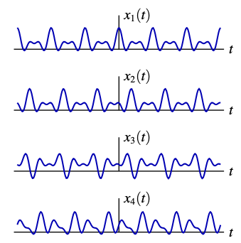{fig-align=left, width=70%}

:::

::::

## 幅度与相位

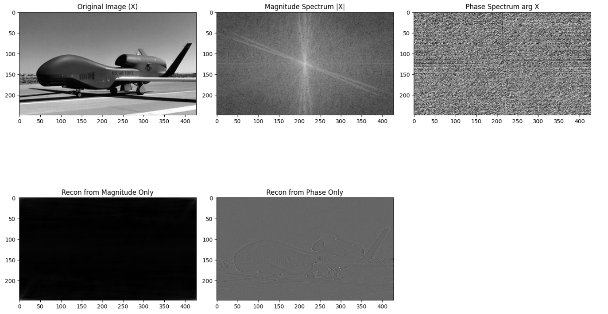{fig-align=center}

上面一行，分别为：$X$、$|X|$和$\arg X$

下面一行，分别为：$\mathcal{F}^{-1}(|X|)$、$\mathcal{F}^{-1}(\arg X)$

## 目录 {#toc1}

- [1. 傅里叶变换的模和相位表示](#sec61)
- [**2. 线性时不变系统频率响应的模和相位表示**](#sec62)
- [3. 理想频率选择性滤波器的时频特性](#sec63)
- [4. 非理想频率选择性滤波器的时频特性](#sec64)
- [5. 一阶与二阶连续时间系统](#sec65)
- [6. 一阶与二阶离散时间系统](#sec66)
- [7. 系统的时域和频域分析实例](#sec67)

# 线性时不变系统频率响应的模和相位表示 {#sec62}

## LTI系统频率响应的模–相位表示

对于线性时不变系统，对输入信号所起的作用包括两个方面：

- 改变输入信号各频率分量的幅度；

- 改变输入信号各频率分量的相对相位。

$$
Y(j \omega)=H(j \omega) X(j \omega), \quad Y\left(e^{j \omega}\right)=H\left(e^{j \omega}\right) X\left(e^{j \omega}\right)
$$
其中，$H（j \omega）=|H(j \omega)| e^{j \arg H(j \omega)}$,$|H(j \omega)|$ 为幅值响应，$e^{j \arg H(j \omega)}$为相位响应。

$$
|Y|=|H| \cdot|X|, \quad |H| \text{系统的幅度响应，也称系统的增益(gain) }
$$

以及

$$
\arg Y=\arg H+\arg X, \quad \arg H \text{表示系统引入的相移(phase shift) }
$$

LTI 系统带来的影响，可能是我们希望得到的，也可能不是。

- 若这种影响不是我们想要的，则称为失真(distortion)。
- 根据组成，失真包含幅度失真和相位失真两种。

## LTI系统频率响应的模–相位表示

1．幅度失真：由于频谱的模改变而引起的失真。各频率分量幅度产生不同程度的衰减。

2．相位失真：由于频谱的相位改变引起的失真。各频率分量产生的相移不与频率成正比，使响应的各频率分量在时间轴上的相对位置产生变化。

在工程实际中，不同的应用场合，对幅度失真和相位失真有不同的敏感程度，也会有不同的技术指标要求。

- 模拟信号一旦发生失真，在以后的处理中，将保持这种失真-（称为失真信号的继承性）。

**无失真传输**

- 理想情况下，$H(j \omega)=1$（或$H(j \omega)=K$），但这对应于非因果系统；
- 当 $H(j \omega)=K e^{-j \omega t_{0}}$ 时，系统保持波形形状不变，只引入幅值缩放和时延。

称为**无失真传输**，这种系统为**全通系统**。

在无失真传输的情况下，相位严格正比于频率：$\phi(\omega) = -t_0 \omega$，这种相位特性称为**线性相位**。

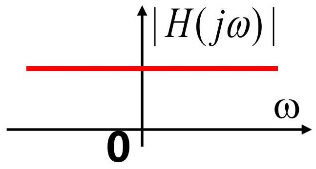{width=30% fig-align=center}
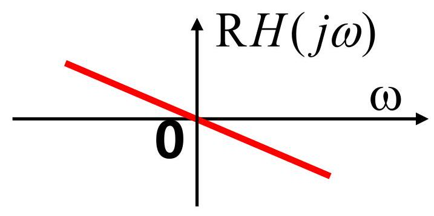{width=30% fig-align=center}

## 线性相位和非线性相位

对于具有单位增益和线性相位的连续时间 LTI 系统

$$
H(j \omega)=e^{-j \omega t_{0}} \Longrightarrow y(t)=x\left(t-t_{0}\right)
$$

输出是输入的延时版本

对于具有单位增益和线性相位的离散时间 LTI 系统

$$
H\left(e^{j \omega}\right)=e^{-j \omega n_{0}},
$$

即LTI仅附加一个线性相移，输出信号则只是在时间上的平移

$$
y[n]=\frac{1}{2 \pi} \int_{-\pi}^{\pi} X\left(e^{j \omega}\right) e^{-j \omega n_{0}} e^{j \omega n} d \omega=\sum_{m=-\infty}^{\infty} x[m] \operatorname{sinc}\left(n-n_{0}-m\right)
$$
此时并未丟失信号所携带的任何信息，只是发生时间上的延迟，因而在工程应用中是允许的。

- 当 $n_{0}$ 为整数时，$y[n]=x\left[n-n_{0}\right]$，即输出是输入的整数点延时版本；
<!-- - 当 $n_{0}$ 为非整数时，$y[n]=y_{c}\left(n-n_{0}\right)$，它是信号包络
  $y_{c}(t)=\sum_{m=-\infty}^{\infty} x[m] \operatorname{sinc}(t-m)$
  延时后的采样值。 -->

## 线性相位和非线性相位

物理本质：**时间延迟的一致性**

设想输入信号由不同频率的分量组成，若要保证信号波形不失真，就必须要求所有频率分量经过系统后，被延迟的时间必须完全相同：

根据傅里叶变换的时移性质：
$$x(t - t_0) \leftrightarrow X(j\omega)e^{-j\omega t_0}$$

- 频率为 $\omega_1$ 的分量，其相位偏移是 $-\omega_1 t_0$
- 频率为 $\omega_2$ 的分量，其相位偏移是 $-\omega_2 t_0$

结论： 只有当相位响应 $\phi(\omega)$ 是频率的线性函数时，不同频率的分量才会有相同的“时间延迟”。

如果相位与频率不是线性关系（例如 $\phi(\omega) = \omega^2$），高频分量和低频分量延迟的时间就不一样，输出信号的波形就会发生“相位失真”。

## 线性相位和非线性相位

$$
H(j \omega)=e^{-j \omega / 2}
$$

对于输入

$x(t)=\sum_{k=0}^{3} \cos (2 k \pi t)=1+\cos (2 \pi t)+\cos (4 \pi t)+\cos (6 \pi t)$

输出为

$y(t)=\sum_{k=0}^{3} \cos (2 k \pi t-k \pi)=x\left(t-\frac{1}{2}\right)$

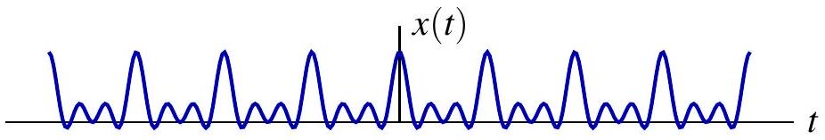{fig-align=center}

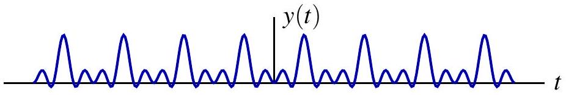{fig-align=center}

<!-- ## 线性相位和非线性相位

半采样延时

$$
H\left(e^{j \omega}\right)=e^{-j \omega / 2}
$$

对于输入

$x[n]=\cos \left(\frac{\pi}{3} n\right)$

输出为

$y[n]=\sum_{m=-\infty}^{\infty} \cos \left(\frac{\pi}{3} m\right) \operatorname{sinc}\left(n-n_{0}-m\right)=\cos \left(\frac{\pi}{3}\left[n-\frac{1}{2}\right)\right]$

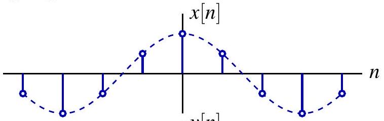{fig-align=center}

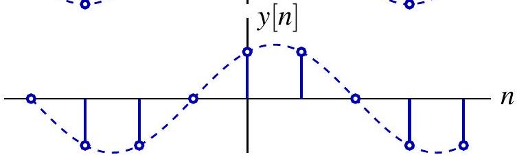{fig-align=center} -->

## 线性相位和非线性相位

$$
H(j \omega)=e^{-j \arctan \omega}
$$

对于输入

$x(t)=\sum_{k=0}^{3} \cos (2 k \pi t)=1+\cos (2 \pi t)+\cos (4 \pi t)+\cos (6 \pi t)$

输出为

$y(t)=\sum_{k=0}^{3} \cos [2 k \pi t-\arctan (2 k \pi)]$

{fig-align=center}

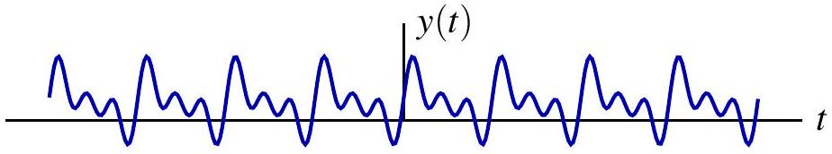{fig-align=center}

## 群时延 （Group Delay）

对于以 $\omega_{0}$ 为中心的窄带输入信号 $x$，即

$$
X(j \omega)=0, \quad \text {当 }\left|\omega-\omega_{0}\right|>\Delta \omega, \text { 其中 } \Delta \omega \ll 1
$$

对相位作线性近似

$$
\arg H(j \omega) \approx \arg H\left(j \omega_{0}\right)-\tau\left(\omega_{0}\right)\left(\omega-\omega_{0}\right)=-\phi_{0}-\tau\left(\omega_{0}\right) \omega
$$

其中，在频率 $\omega$ 处的**群时延**定义为

$$
\tau(\omega)=-\frac{d}{d \omega} \arg H(j \omega)
$$

群时延代表了在以 $\omega_{0}$ 为中心的一个很窄的频带或很少的一组频率上信号所受到的有效公共延时。
 
 
如果当 $\left|\omega-\omega_{0}\right| \leq \Delta \omega$ 时，$|H(j \omega)| \approx\left|H\left(j \omega_{0}\right)\right|$，
$$Y(j \omega) \approx\left|H\left(j \omega_{0}\right)\right| X(j \omega) e^{-j \phi_{0}-j \tau\left(\omega_{0}\right) \omega} \Longrightarrow y(t) \approx\left|H\left(j \omega_{0}\right)\right| e^{-j \phi_{0}} x\left(t-\tau\left(\omega_{0}\right)\right)$$

## 群时延
$$
H(j \omega)=e^{-j \arctan \omega} \Longrightarrow \tau(\omega)=\frac{d}{d \omega} \arctan (\omega)=\frac{1}{1+\omega^{2}}
$$

对于输入信号（它可看作以 $\pm \pi$ 为中心的两个窄带信号 $z, \bar z$ 之和）
$x(t)=\sum_{k=9}^{11} \cos \left(\frac{k \pi}{10} t\right)=\operatorname{Re} z(t)=\frac{1}{2} z(t)+\frac{1}{2} \bar{z}(t)$，其中 $z(t)=\sum_{k=9}^{11} e^{j \frac{k \pi}{10} t}$，输出近似为

$$
y(t) \approx \frac{1}{2} e^{-j \phi_{0}} z\left(t-\tau_{0}\right)+\frac{1}{2} e^{j \phi_{0}} \bar{z}\left(t-\tau_{0}\right)=\operatorname{Re}\left[e^{-j \phi_{0}} z\left(t-\tau_{0}\right)\right]
$$

其中，$\phi_{0}=-\arctan \pi+\frac{\pi}{1+\pi^{2}}$，$\tau_{0}=\frac{1}{1+\pi^{2}}$。

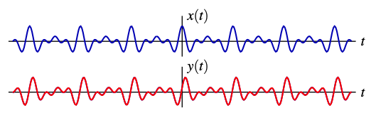{fig-align=center, width=30%}

## 对数模和伯德图（Bode Diagram）

对数模：$|Y(j \omega)|= |H(j \omega)|  |X(j \omega)| \Longrightarrow \log |Y(j \omega)|=\log |H(j \omega)|+\log |X(j \omega)|$

:::: {.columns style="text-align: center;"}

::: {.column width="50%"}

::: {.callout-important}
## 一般采用对数标尺以 $20 \log _{10}$ 为单位，称之为分贝 （dB）
- **0 dB**：模等于 1（无增益/衰减）
- **20 dB**：10 倍单位增益
- **-20 dB**：0.1 倍衰减
:::

- 对于连续时间系统，常采用对数频率坐标
  
  $\mathbf{2 0 l o g}_{\mathbf{1 0}}|\boldsymbol{H}(\mathbf{j} \omega)|$和 $\arg \boldsymbol{H}(\boldsymbol{j} \omega)$ 对 $\boldsymbol{\operatorname { l o g }}_{\mathbf{1 0}}(\omega)$ 作的图称之为伯德图。

- 对数频率坐标，常常可以比线性频率展示宽的多的频率范围。

在离散时间情况下，傅里叶变换和频率响应的模常常也是用dB来表示的。

::: {.callout-important}
## 在离散时间情况下一般不用对数频率坐标
因为这时要考虑的频率范围就只有 $2 \pi$ 宽，$H\left(e^{j \omega}\right)$ 是周期的。

:::
注意：**对实值 $h[n]$ ，仅需画出 $[0, \pi]$ 范围的 $H\left(e^{j \omega}\right)$**
:::
::: {.column width="50%"}
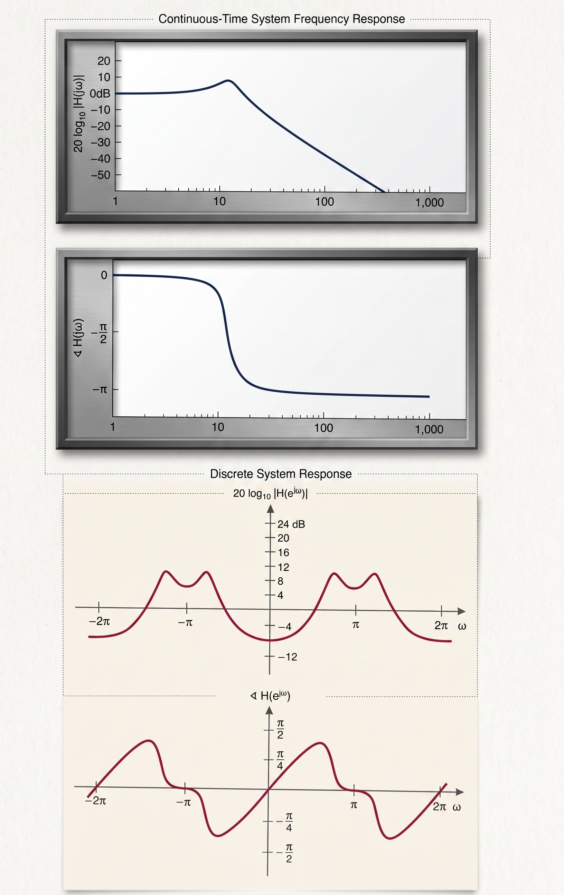{width=60%}

<!-- 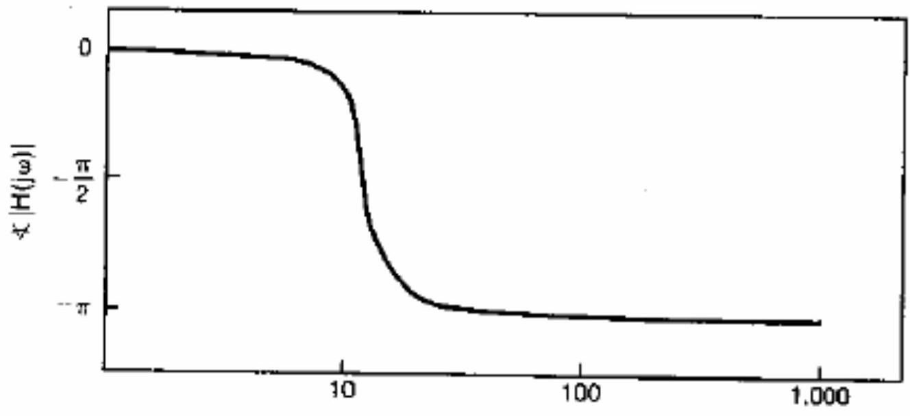{width=45%}

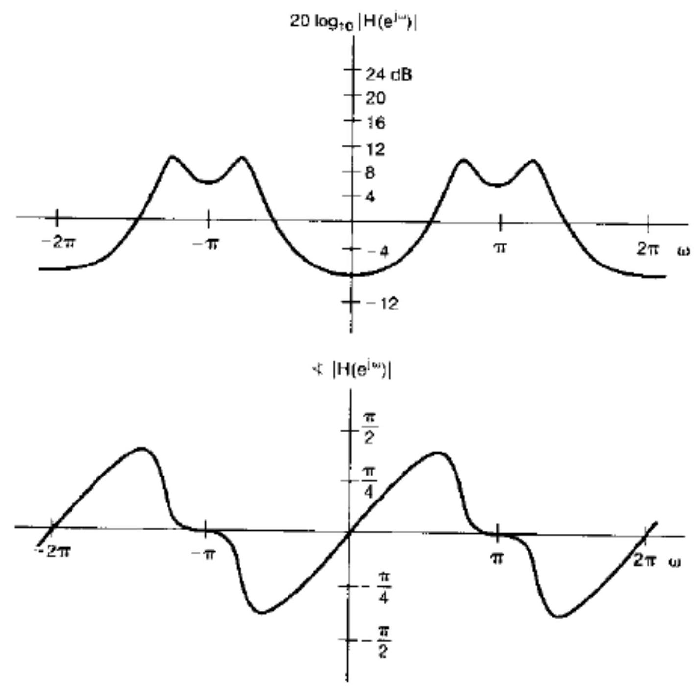{width=45%} -->
:::
::::

<!-- ## 对数模和伯德图（Bode Diagram）
在离散时间情况下，傅里叶变换和频率响应的模常常也是用dB来表示的。

:::: {.columns style="text-align: center;"}

::: {.column width="50%"}

::: {.callout-important}
## 在离散时间情况下对数频率坐标一般是不用的，
因为这时要考虑的频率范围就只有 $2 \pi$ 宽，$H\left(e^{j \omega}\right)$ 是周期的。

:::
注意：**对实值 $h[n]$ ，仅需画出 $[0, \pi]$ 范围的 $H\left(e^{j \omega}\right)$**

:::
::: {.column width="50%"}

:::
:::: -->

## 对数模和伯德图（Bode Diagram）
$$
H(j \omega)=\frac{\sum_{k=0}^{N} b_{k}(j \omega)^{k}}{\sum_{k=0}^{N} a_{k}(j \omega)^{k}}=\frac{N(j \omega)}{D(j \omega)}=H_0 \frac{\prod_{j=1}^m (j\omega - z_j)}{\prod_{i=1}^n (j\omega - p_i)}=H_1 \frac{\prod_{j=1}^m (1-\frac{j\omega} {z_j})}{\prod_{i=1}^n (1-\frac{j\omega}{p_i}  )}
$$

:::: {.columns style="text-align: left;"}

::: {.column width="50%"} 

其中：

* $z_j$ 为系统的**零点**。  
* $p_i$ 为系统的**极点**。  
* $H_0$ 为系统增益常数。

**几何矢量解释**

$(j\omega - z_j)$ 或 $(j\omega - p_i)$ 都可以看作是从零/极点指向虚轴上 $j\omega$ 点的一个**矢量**。  

* **零点矢量**：$j\omega - z_j = N_j e^{j\psi_j}$  
* **极点矢量**：$j\omega - p_i = M_i e^{j\theta_i}$
:::
::: {.column width="50%"} 
 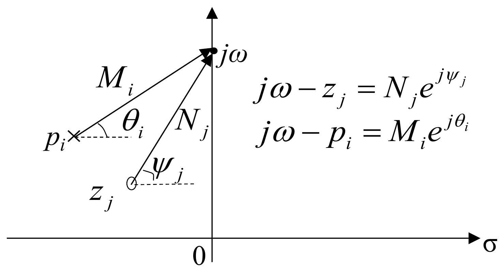

:::
::::

## 对数模和伯德图（Bode Diagram）
**模值的对数化（幅频特性）**

对 $H(j\omega)$ 取模并取对数（单位：dB）：  
$$20 \log_{10} |H(j\omega)| = 20 \log_{10} |H_0| + \sum_{j=1}^m 20 \log_{10} N_j - \sum_{i=1}^n 20 \log_{10} M_i$$  

* **叠加性**：Bode图的幅频特性曲线本质上是所有零点和极点矢量长度（对数化后）的纵向叠加。  
* **转折频率**：当 $\omega$ 靠近某个极点或零点的模值时，该矢量长度的变化最剧烈，对应Bode图上的斜率转折（±20dB/dec）。

**相位的线性叠加（相频特性）**

系统的总相位响应为：  
$$\angle H(j\omega) = \sum_{j=1}^m \psi_j - \sum_{i=1}^n \theta_i$$

## 对数模和伯德图（Bode Diagram）

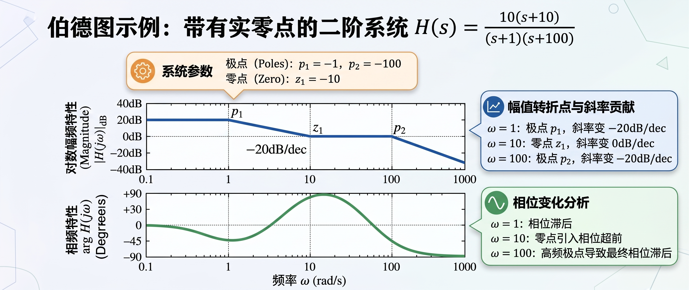

## 目录 {#toc2}

- [1. 傅里叶变换的模和相位表示](#sec61)
- [2. 线性时不变系统频率响应的模和相位表示](#sec62)
- [**3. 理想频率选择性滤波器的时频特性**](#sec63)
- [4. 非理想频率选择性滤波器的时频特性](#sec64)
- [5. 一阶与二阶连续时间系统](#sec65)
- [6. 一阶与二阶离散时间系统](#sec66)
- [7. 系统的时域和频域分析实例](#sec67)

# 理想频率选择性滤波器的时频特性 {#sec63}

## 理想频率选择性滤波器的时频特性

滤波：通过系统改变信号中各频率分量的相对大小和相位，甚至完全去除某些频率分量的过程称为滤波。

理想频率选择性滤波器的频率特性在某一个（或几个）频段内，频率响应为常数，而在其它频段内频率响应等于零。

理想滤波器可分为**低通、高通、带通、带阻**。

:::: {.columns style="text-align: center;"}

::: {.column width="50%"} 
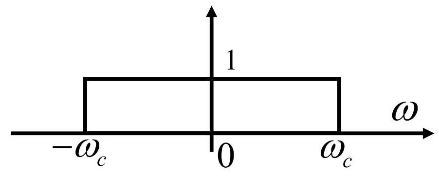{width=60%}

 

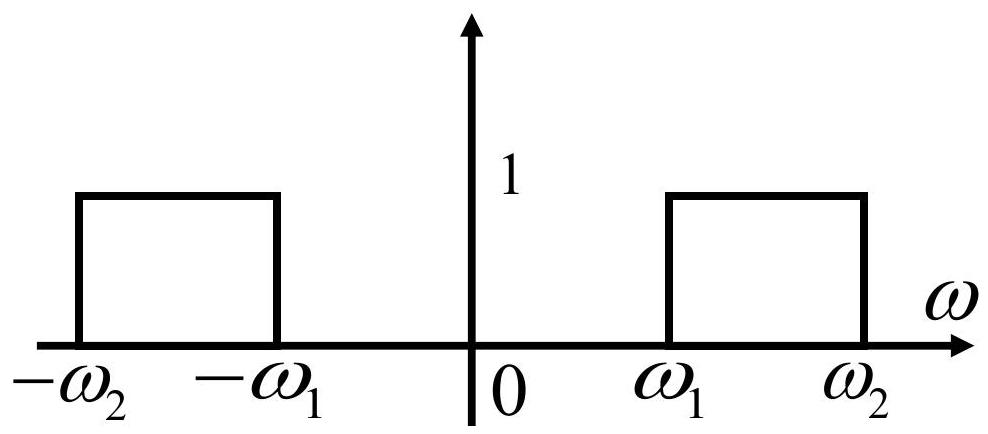{width=60%}

:::

::: {.column width="50%"} 
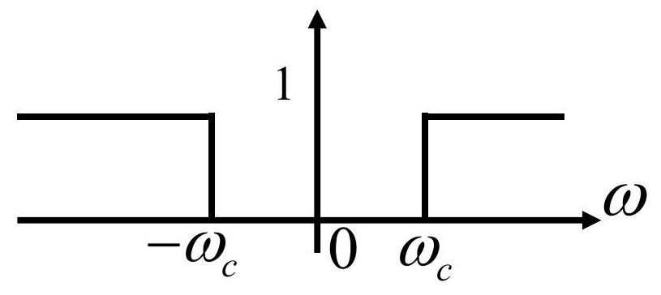{width=60%}

 

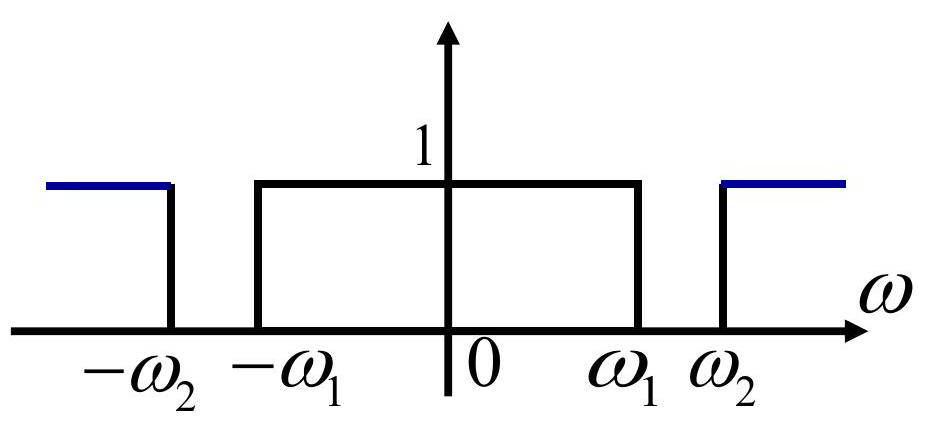{width=60%}

:::
::::

## 离散时间理想频率选择性滤波器的时频特性

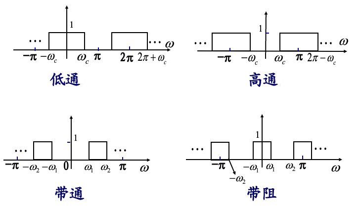{width=70% fig-align=center}

<!-- :::: {.columns style="text-align: center;"}

::: {.column width="50%"} 
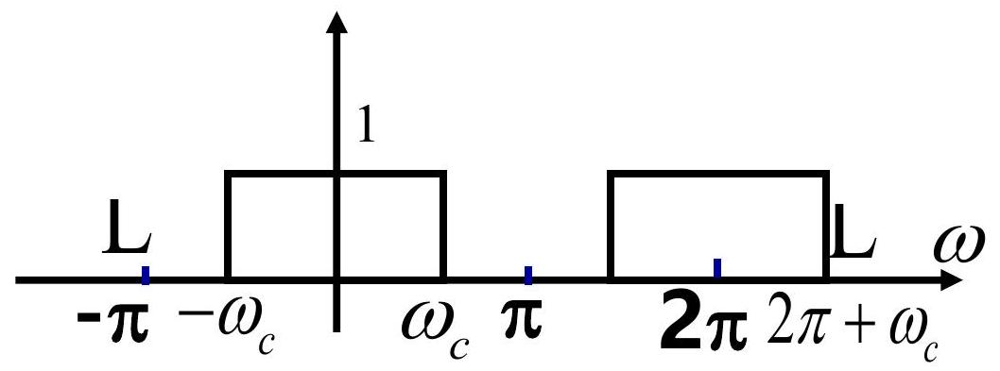{width=60%}

 

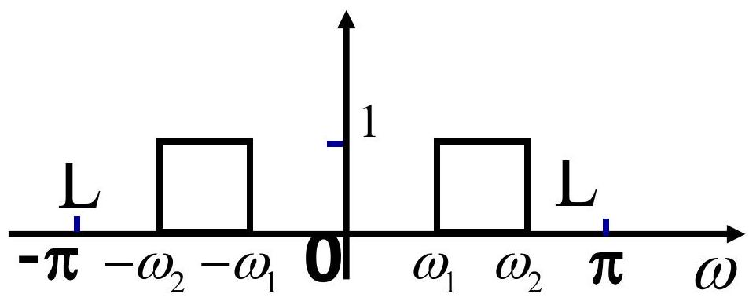{width=60%}

:::

::: {.column width="50%"} 
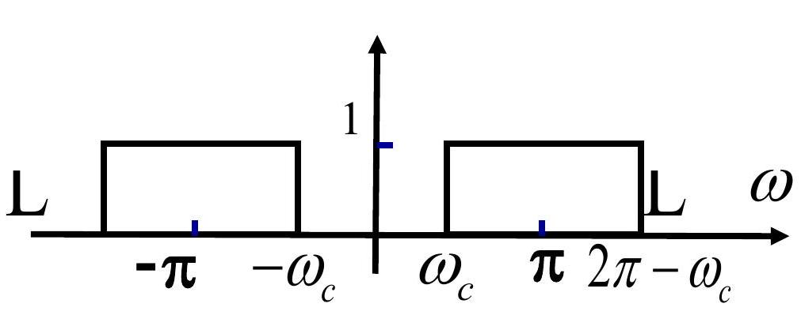{width=60%}

 

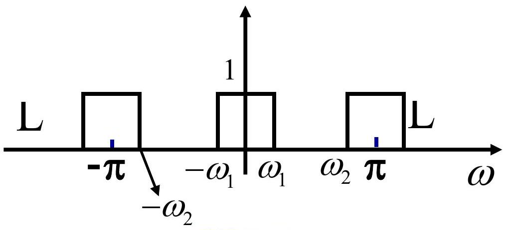{width=60%}

:::
:::: -->

各种滤波器的特性都可以从理想低通特性而来。离散时间理想滤波器的特性在 $-\pi$~ $\pi$区间上，与相应的连续时间滤波器特性完全相似。

## 理想滤波器的时频特性
以理想低通滤波器为例

:::: {.columns style="text-align: center;"}

::: {.column width="50%"} 
$$
H(j \omega)= \begin{cases}1, & |\omega|<\omega_{c} \\ 0, & |\omega|>\omega_{c}\end{cases}
$$

 
 
由傅里叶变换可得：
$$
h(t)=\frac{1}{2 \pi} \int_{-\omega_{c}}^{\omega_{c}} e^{j \omega t} d \omega=\frac{\sin \omega_{c} t}{\pi t}=\frac{\omega_{c}}{\pi} \operatorname{Sinc}\left(\omega_{c} t\right)
$$
:::
::: {.column width="50%"} 
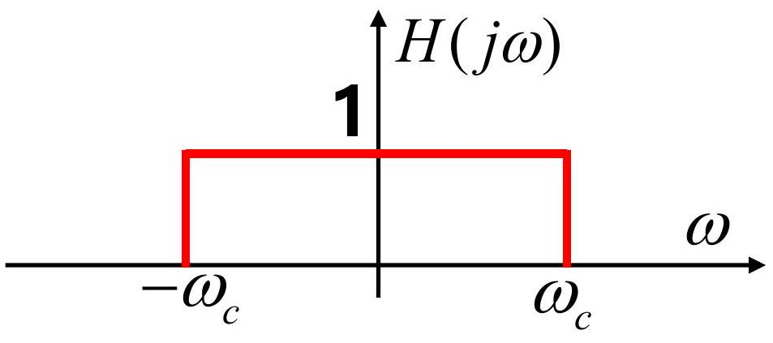{width=60%}

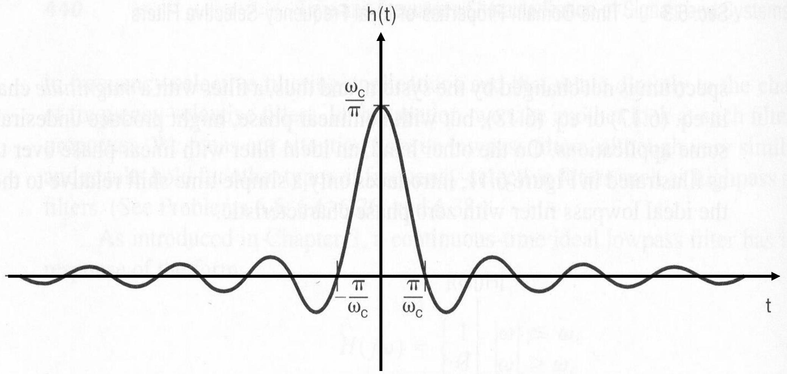
:::
::::

## 理想滤波器的时频特性

对离散时间理想低通滤波器有：

$$
h(n)=\frac{\sin \omega_{c} n}{\pi n}=\frac{\omega_{c}}{\pi} \operatorname{Sinc}\left(\omega_{c} n\right)
$$
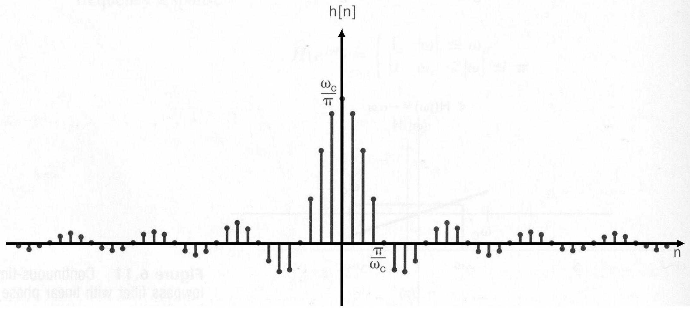

## 理想滤波器的时频特性

如果理想低通滤波器具有线性相位特性

$$
H(j \omega)= \begin{cases}e^{-j \alpha \omega}, & |\omega|<\omega_{c} \\ 0, & |\omega|>\omega_{c}\end{cases}
$$

则 $h(t)=\frac{\omega_{c}}{\pi} \mathrm{Sinc}\left[\omega_{c}(t-\alpha)\right]=\frac{\sin \omega_{c}(t-\alpha)}{\pi(t-\alpha)}$

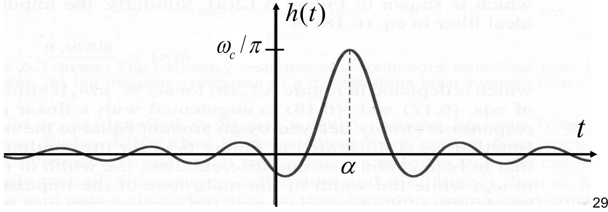

## 理想低通滤波器的单位阶跃响应
$$
\begin{aligned}
s(t) & =h(t)^{*} u(t) \\
& =\int_{-\infty}^{t} \frac{\omega_{c}}{\pi} \frac{\sin \omega_{c} \tau}{\omega_{c} \tau} d \tau=\frac{1}{\pi} \int_{-\infty}^{\omega_{c} t} \frac{\sin x}{x} d x \\
& =\frac{1}{\pi} \int_{-\infty}^{0} \frac{\sin x}{x} d x+\frac{1}{\pi} \int_{0}^{\omega_{c} t} \frac{\sin x}{x} d x \\
& =-\frac{1}{\pi} \int_{0}^{-\infty} \frac{\sin x}{x} d x+\frac{1}{\pi} \int_{0}^{\omega_{c} t} \frac{\sin x}{x} d x
\end{aligned}
$$

:::: {.columns style="text-align: center;"}

::: {.column width="50%"} 

令 $\int_{0}^{x} \frac{\sin \tau}{\tau} d \tau=\operatorname{Si}(x)$ ——正弦积分

由于

$$
\begin{aligned}
& x \rightarrow \infty, \operatorname{Si}(x) \rightarrow \frac{\pi}{2} ; \quad x \rightarrow-\infty, \operatorname{Si}(x) \rightarrow-\frac{\pi}{2} \\
& s(t)=-\frac{1}{\pi} \operatorname{Si}(-\infty)+\frac{1}{\pi} \operatorname{Si}\left(\omega_{c} t\right)=\frac{1}{2}+\frac{1}{\pi} \operatorname{Si}\left(\omega_{c} t\right)
\end{aligned}
$$
:::
::: {.column width="50%"} 
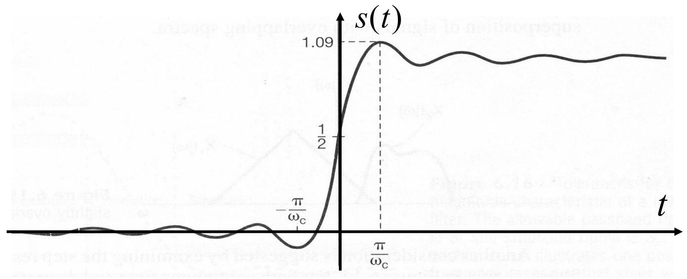
:::
::::

## 理想低通滤波器的单位阶跃响应

:::: {.columns style="text-align: center;"}
::: {.column width="50%"} 

如果理想低通滤波器具有线性相位特性，则:
 
最大值位置：$t_{0}+\frac{\pi}{\omega_{c}}$

最小值位置：$t_{0}-\frac{\pi}{\omega_{c}}$

$t_{0}$ 为系统延迟时间
:::
::: {.column width="50%"} 
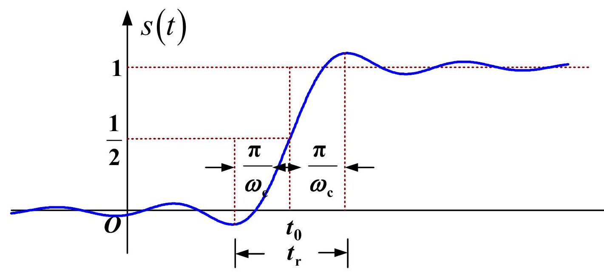{width=55%}
:::
::::

1．上升时间 $t_{r}$ ：输出由最小值到最大值所经历的时间

$$
t_{\mathrm{r}}=2 \cdot \frac{\pi}{\omega_{\mathrm{c}}}=\frac{1}{B} \quad B=\frac{\omega_{\mathrm{c}}}{2 \pi}=f_{\mathrm{c}}
$$
$\boldsymbol{B}$ 是将角频率折合为频率的滤波器带宽（截止频率）。
 
 

2．阶跃响应的上升时间 $t_{r}$ 与滤波器的截止频率 $B$（带宽）
成反比 $B t_{\mathrm{r}}=1$ 。

## 理想低通滤波器的单位阶跃响应
对离散时间理想低通滤波器，相应有：

$$
s(n)=\frac{1}{2}+\frac{1}{\pi} \operatorname{Si}\left(\omega_{c} n\right)
$$

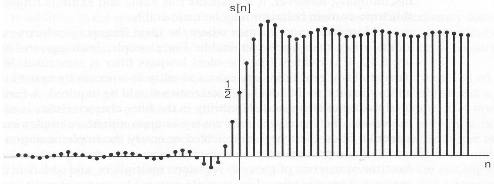

从理想滤波器的时域特性可以看出：

1．理想滤波器是非因果系统。因而是物理不可实现的；

2．尽管从频域滤波的角度看，理想滤波器的频率特性是最佳的。但它们的时域特性并不是最佳的。 $h(t)$或 $h(n)$ 都有起伏、旁瓣、主瓣，这表明理想滤波器的时域特性与频域特性并不兼容。

3．在工程应用中，当要设计一个滤波器时，必须对时域特性和频域特性作出恰当的折中。

## 目录 {#toc3}

- [1. 傅里叶变换的模和相位表示](#sec61)
- [2. 线性时不变系统频率响应的模和相位表示](#sec62)
- [3. 理想频率选择性滤波器的时频特性](#sec63)
- [**4. 非理想频率选择性滤波器的时频特性**](#sec64)
- [5. 一阶与二阶连续时间系统](#sec65)
- [6. 一阶与二阶离散时间系统](#sec66)
- [7. 系统的时域和频域分析实例](#sec67)

# 非理想频率选择性滤波器的时频特性 {#sec64}

## 非理想滤波器（The Nonideal Filters）

由于理想滤波器是物理不可实现的，工程应用中就必须寻找一个物理可实现的频率特性去逼近理想特性，这种物理可实现的系统就称为非理想滤波器。

对理想特性逼近得越精确，实现时付出的代价越大，系统的复杂程度也越高。

非理想滤波器的频率特性以容限方式给出。

:::: {.columns style="text-align: center;"}
::: {.column width="50%"} 

| 理想滤波器特性 | 非理想滤波器特性 |
| :--- | :--- |
| 1．通带绝对平坦，通带 | 通带内允许有起伏， |
| 内衰减为零。 | 有一定衰减范围 $\pm \delta_{1}$ |
| 2．阻带绝对平坦，阻带 | 阻带内允许有起伏， |
| 内衰减为 $\infty$ | 有一定衰减范围 $\delta_{2}$ |
| 3．无过渡带。 | 有一定的过渡带宽度 |

:::

::: {.column width="50%"} 
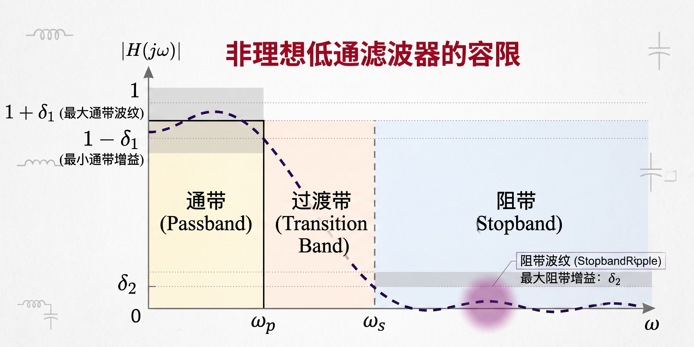
:::
::::

通常将偏离龶位曙益的 称为$\pm \delta_1$通帯起伏（或波纹），$\delta_{2}$称为阻带起伏（或波纹），$\omega_p$称为通带边缘，$\omega_s$为阻带边缘，$\omega_s-\omega_p$为过渡带。

## 工程中常用滤波器

幅频特性出发逼近理想低通的模特性

|   |   | |
| :--- | :--- | :--- |
| 1．Butterworth滤波器 | 通带、阻带均呈单调衰减，也称通带最平伏逼近 |$|H(j\omega)|^2 = \frac{1}{1 + (\frac{\omega}{\omega_c})^{2n}}$|
| 2．Chebyshev滤波器 | 通带等起伏阻带单调，或通带单调阻带等起伏 | $|H(j\omega)|^2 = \frac{1}{1 + \epsilon^2 C_n^2(\frac{\omega}{\omega_c})}$|
| 3．Cauer滤波器：（椭圆函数滤波器） | 通带、阻带均等起伏 | $|H(j\omega)|^2 = \frac{1}{1 + \epsilon^2 R_n^2(\xi, \frac{\omega}{\omega_c})}$|
|   | | |

从相位特性出发，逼近理想的线性相位特性有

|   |   | |
| :--- | :--- |:--- |
| 1．Bassel滤波器| 群时延最平伏逼近 |$H(s) = \frac{B_n(0)}{B_n(s/a)}$, $B_n(s) = \sum_{k=0}^{n} \frac{(2n-k)!}{2^{n-k}k!(n-k)!} s^k$|
| 2．Chebyshev滤波器 | 包络时延等起伏逼近 | |
| 3．Gauss滤波器 | 通带、阻带均等起伏 | $H(j\omega) = e^{-\frac{\sigma^2 \omega^2}{2}}$|
|   |   |

对同一种滤波器，阶数越高，对理想特性逼近得越好，过渡带越窄;系统复杂度也越高，实现系统所付出的代价也越大。

 
对同样阶数的滤波器: 
 
Butterworth $\longrightarrow$
Chebyshev$\longrightarrow$Cauer
 
幅频特性逼近得越来越好$\longleftrightarrow$阶跃响应的起伏、超量和振荡也越严重

## 5阶Butterworth滤波器与5阶Cauer滤波器的比较

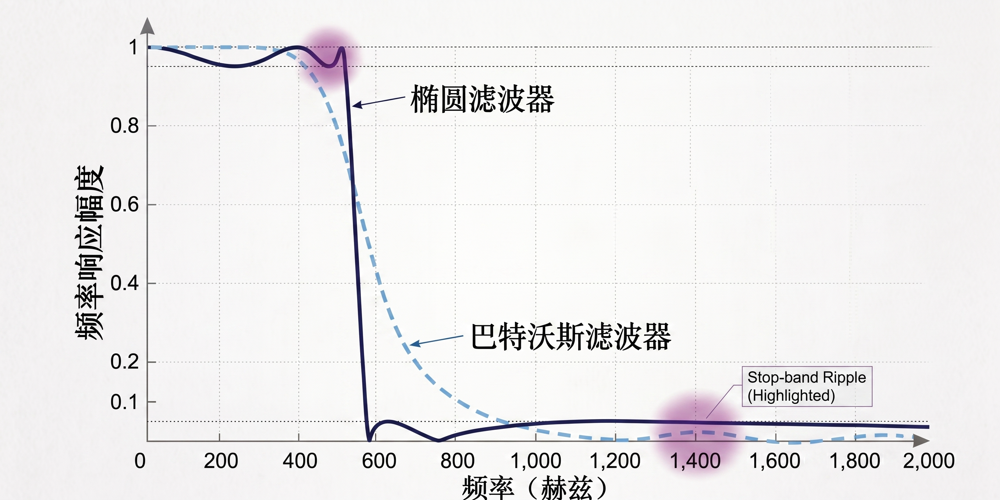

## 单位阶跃响应：

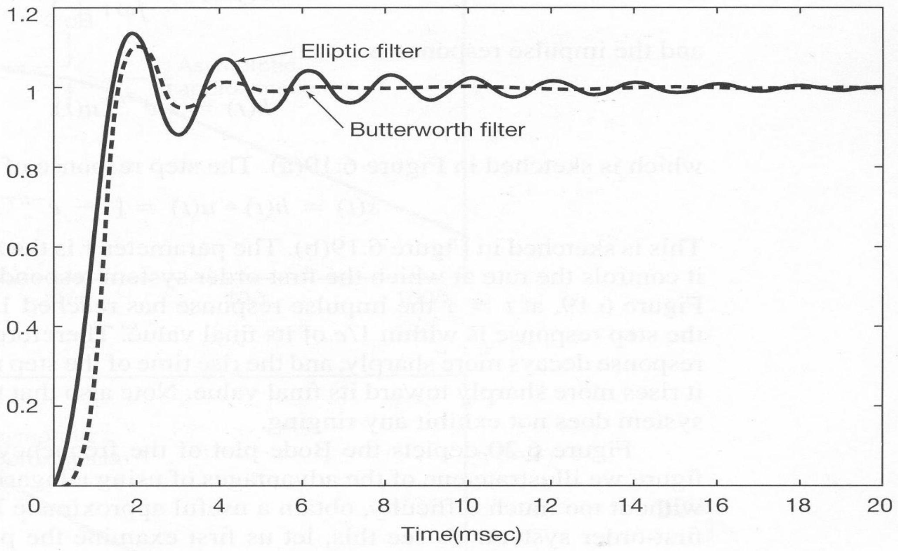

## 目录 {#toc4}

- [1. 傅里叶变换的模和相位表示](#sec61)
- [2. 线性时不变系统频率响应的模和相位表示](#sec62)
- [3. 理想频率选择性滤波器的时频特性](#sec63)
- [4. 非理想频率选择性滤波器的时频特性](#sec64)
- [**5. 一阶与二阶连续时间系统**](#sec65)
- [6. 一阶与二阶离散时间系统](#sec66)
- [7. 系统的时域和频域分析实例](#sec67)

# 一阶与二阶连续时间系统 {#sec65}

## 一阶与二阶连续时间系统

连续时间LTI系统的频率响应为：

$$
H(j \omega)=\frac{\sum_{k=0}^{M} b_{k}(j \omega)^{k}}{\sum_{k=0}^{N} a_{k}(j \omega)^{k}}=\frac{B(j \omega)}{A(j \omega)}=H_0 \frac{\prod_{j=1}^m (j\omega - z_j)}{\prod_{i=1}^n (j\omega - p_i)}
$$

其中：$a_{k} 、 b_{k}$ 均为实常数。

上式可通过对 $B(j \omega)$ 因式分解，将其表示成若干个一阶或二阶有理函数的连乘；或者通过部分分式展开，表示成若干个一阶或二阶有理函数相加。

因此：

LTI系统可以看成由**若干个一阶或二阶系统通过级联或并联构成**$\longrightarrow$ **一阶和二阶系统是构成任何系统的基本单元**。

:::: {.columns style="text-align: left;"}
::: {.column width="65%"} 
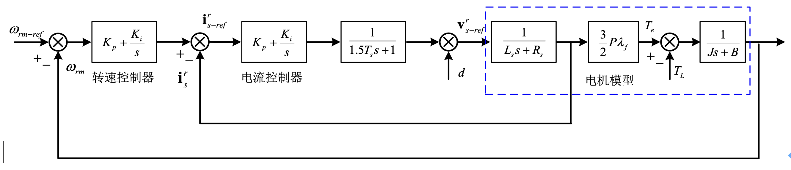{fig-align=center}
:::
::: {.column width="35%"} 
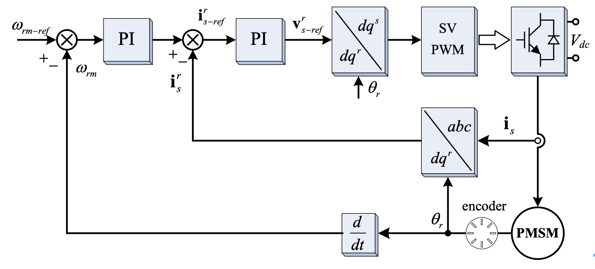{fig-align=center}
:::
::::

## 一阶连续时间系统

模型：$\tau \frac{d y(t)}{d t}+y(t)=x(t) \quad H(j \omega)=\frac{1}{j \omega \tau+1}$

:::: {.columns style="text-align: left;"}
::: {.column width="50%"} 
**时域特性**：

单位冲激响应：
$$h(t)=\frac{1}{\tau} e^{-\frac{t}{\tau}} u(t)$$

其中：$\tau$ ——时间常数
 
单位阶跃响应：
$$
s(t)=h(t) * u(t)=\left(1-e^{-\frac{t}{\tau}}\right) u(t)
$$
:::
::: {.column width="50%"} 
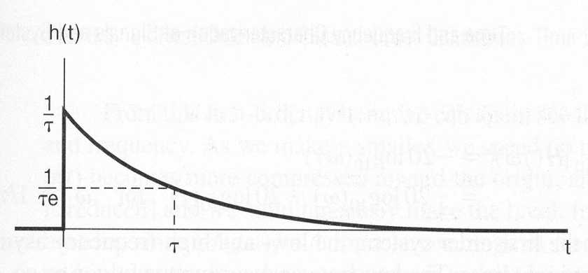{width=60% fig-align=center}

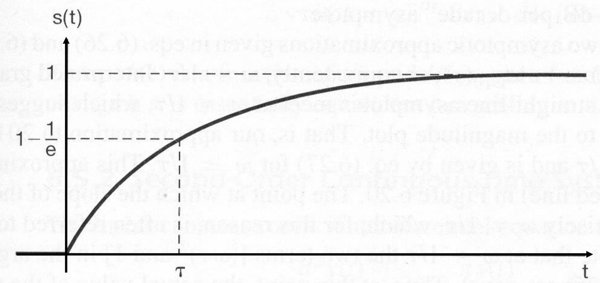{width=60% fig-align=center}
:::
::::

可以看出：

- $\tau$ 越小，$h(t)$ 衰减得越快，系统失真越小。
- $\tau$ 越小，$s(t)$ 上升得越快，系统失真越小。

## 一阶连续时间系统

**频域特性**(通过Bode图分析)

1. 原理：
$$
H(\omega)=\frac{H_{0} \prod_{k=1}^{m} B_{k}}{\prod_{i=1}^{n} A_{i}} e^{j\left(\sum_{k=1}^{m} \beta_{k}-\sum_{i=1}^{n} \alpha_{i}\right)}=|H(\omega)| e^{j \varphi(\omega)}
$$

对上式两边取对数得

$$
\begin{aligned}
& G(\omega)=20 \lg \mid H(\omega)(\mathrm{dB}) \\
& =20 \lg H_{0}+20 \sum_{k=1}^{m} \lg \left|j \omega-z_{k}\right|-20 \sum_{i=1}^{n} \lg \left|j \omega-p_{i}\right|
\end{aligned}
$$

$$
\begin{aligned}
& G(\omega)=20 \lg H_{0}+20 \sum_{k=1}^{m} \lg \left|j \omega-z_{k}\right|-20 \sum_{i=1}^{n} \lg \left|j \omega-p_{i}\right| \\
& \varphi(\omega)=\sum_{k=1}^{m} \beta_{k}-\sum_{i=1}^{n} \alpha_{i}
\end{aligned}
$$

由上式可知，只要先求出每个因式的特性曲线，再用加减组合的方法就可以求得系统总的频率特性。

## 一阶连续时间系统

:::: {.columns style="text-align: left;"}
::: {.column width="60%"} 

2. 画法

－对数幅值

（1）常数（不随频率变化） $201 \mathrm{gH}_{0}$ 相位为零。

（2）位于原点的极点

$$
-20 \lg |j \omega|=-20 \lg \omega
$$

这是一条斜率为 $-\mathbf{2 0}$ 的直线，与 $\omega$ 轴相交于 $\omega=\mathbf{1}$
 
 
当 $\lg \omega$ 移动一个单位时，相当于 $\omega$ 坐标移动一个 10 倍。
 
 
因为 $\lg 10=1$ ，所以对数幅值直线的斜率为 $-\mathbf{2 0 d B} / \mathbf{1 0}$ 倍频。
 
 
相位 $\varphi(\omega)=-90^{\circ}$（对所有的 $\omega$ ）
 
 
同理，位于原点的零点：
$20 \lg \omega$ 是一条通过 $\omega=1$ ，斜率为 $20 \mathrm{~dB} / 10$ 倍频的直线相位 $\varphi(\omega)=90^{\circ}$（对所有的 $\omega$ ）

:::
::: {.column width="40%"} 
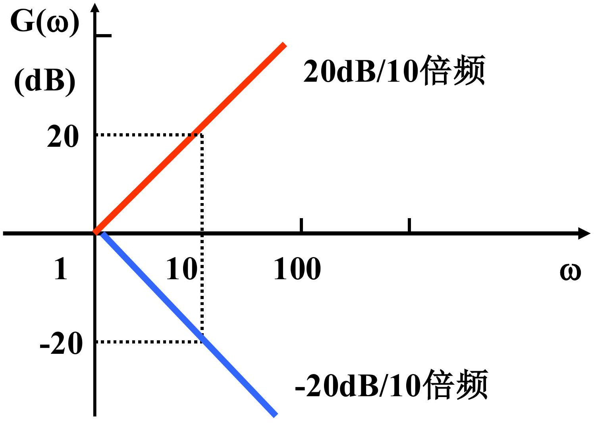{width=50% fig-align=center}
 
 
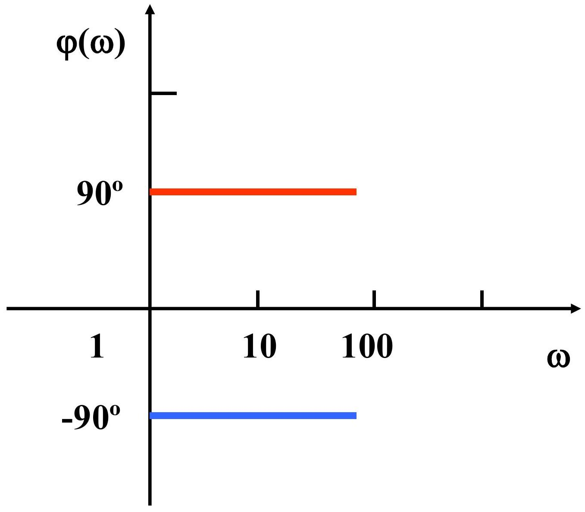{width=50% fig-align=center}
:::
::::

## 一阶连续时间系统

对于$H(j \omega)=\frac{1}{j \omega \tau+1}$一阶系统的Bode图，其幅频特性:

:::: {.columns style="text-align: left;"}
::: {.column width="60%"} 
$$
20 \lg |H(j \omega)|=-10 \lg \left[1+(\omega \tau)^{2}\right]
$$

当 $\omega \tau \ll 1$ 即 $\omega \ll \frac{1}{\tau}$

$$
20 \lg |H(j \omega)| \approx 0 \mathrm{~dB}
$$

称为对数频率特性的低频渐近线方程，与横坐标轴重合

当 $\omega \tau \gg 1$ 即 $\omega \gg \frac{1}{\tau}$ 时

$$
20 \lg |H(j \omega)| \approx-20 \lg \omega \tau=-20 \lg \omega-20 \lg \tau
$$

高频渐近线方程式，它与低频渐近线交于 $\omega=1 / \tau$ 处。

在对数坐标系下，它是一条直线，斜率为每 10 倍频程－20dB。

**一阶系统的Bode图有两条直线型渐近线。 $\quad \omega=1/\tau$ 称为转折频率。**
:::

::: {.column width="40%"} 

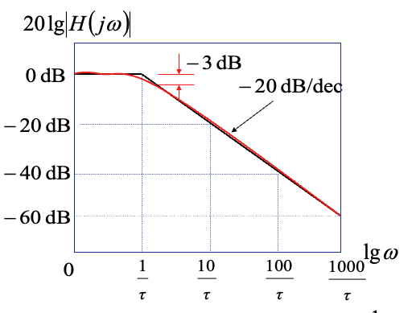

当 $\omega=1/\tau$ 时，准确的对数模为$20 \lg |H(j \omega)|=-10\lg2=-3 \mathrm{~dB}$

:::
::::

## 一阶连续时间系统

:::: {.columns style="text-align: left;"}
::: {.column width="60%"} 

相频特性：

$$
\angle H(j \omega)=\operatorname{tg}^{-1}(\omega \tau)
$$

若 $\quad \omega \ll 1 / \tau, \angle H(j \omega)=0$

$$
\begin{aligned}
& \omega \gg 1 / \tau, \angle H(j \omega) \approx 90^{\circ} \\
& \omega=1 / \tau, \angle H(j \omega) \approx 45^{\circ}
\end{aligned}
$$

将其折线化可得相位特性的直线型渐近线：
$$
\angle H(j \omega)= \begin{cases}0, & \omega \leq 0.1 / \tau \\ -\frac{\pi}{4}[\lg \omega \tau+1], & \frac{0.1}{\tau} \leq \omega \leq \frac{10}{\tau} \\ -\frac{\pi}{2}, & \omega \geq 10 / \tau\end{cases}
$$
:::

::: {.column width="40%"} 
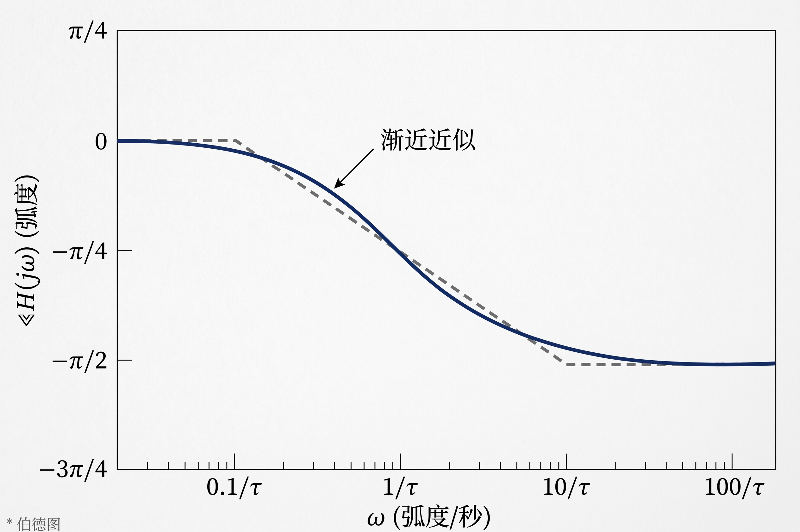

:::
::::

<!-- ## 一阶连续时间系统

**频域特性**(一阶系统的Bode图)

:::: {.columns style="text-align: left;"}
::: {.column width="50%"} 

幅频特性：
$$
20 \lg |H(j \omega)|=-10 \lg \left[1+(\omega \tau)^{2}\right]
$$

$$
H(j \omega)=\frac{1}{j \omega \tau+1}
$$

当 $\omega \tau=1$ 即 $\omega=1 / \tau$ 时 $20 \lg |H(j \omega)| \approx 0 \mathrm{~dB}$
当 $\omega \tau$ ？1即 $\omega$ ？ $1 / \tau$ 时

$$
20 \lg |H(j \omega)| \approx-20 \lg \omega \tau=-20 \lg \omega-20 \lg \tau
$$

在对数坐标系下，它是一条直线，斜率为每 10 倍频程－20dB。可见，一阶系统的Bode图有两条直线型渐近线。 $\quad \omega=1$ 称为折断频率。

当 $\omega=$ 时，准确的对数模为

$$
20 \lg |H(j \omega)|=-10 \lg 2 \mathrm{~B}-3 \mathrm{~dB}
$$
:::
::: {.column width="50%"} 
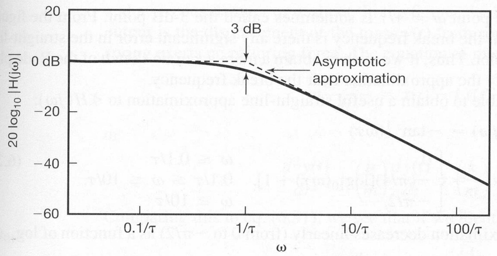

:::
::::

## 一阶系统

:::: {.columns style="text-align: left;"}
::: {.column width="50%"} 

相频特性

$$
\begin{aligned}
& \mathrm{R} H(j \omega)=-\operatorname{tg}^{-1}(\omega \tau) \\
& \omega=\frac{1}{\tau} \text { 时, } \omega \rightarrow 0, \quad \mathrm{R} H(j \omega) \rightarrow 0 \\
& \omega ? \frac{1}{\tau} \text { 时, } \omega \rightarrow \infty, \quad \mathrm{R} H(j \omega) \rightarrow-\frac{\pi}{2} \\
& \omega=\frac{1}{\tau} \text { 时, } \quad \mathrm{R} H(j \omega)=-\frac{\pi}{4}
\end{aligned}
$$

$$
\mathrm{R} H(j \omega)= \begin{cases}0, & \omega \leq 0.1 / \tau \\ -\frac{\pi}{4}[\lg \omega \tau+1], & \frac{0.1}{\tau} \leq \omega \leq \frac{10}{\tau} \\ -\frac{\pi}{2}, & \omega \geq 10 / \tau\end{cases}
$$

:::
::: {.column width="50%"} 
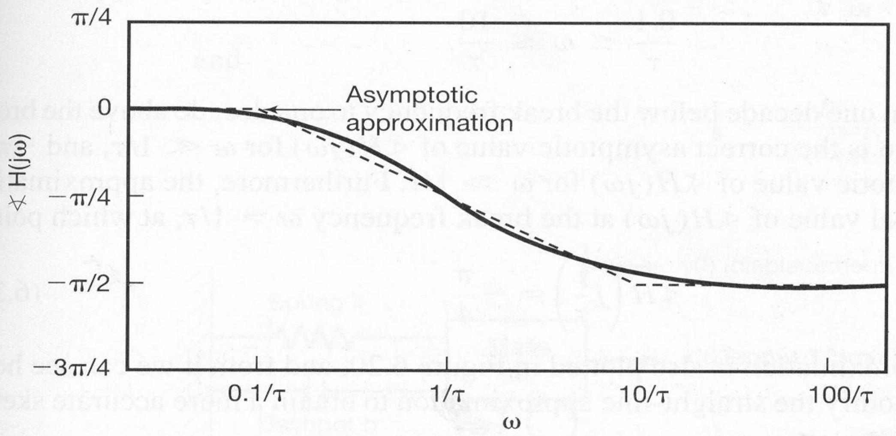
:::
:::: -->

## 二阶连续时间系统

模型：$\frac{d^{2} y(t)}{d t^{2}}+2 \zeta \omega_{n} \frac{d y(t)}{d t}+\omega_{n}{ }^{2} y(t)=\omega_{n}{ }^{2} x(t)$

:::: {.columns style="text-align: left;"}
::: {.column width="60%"} 

1. RLC串联谐振电路

$$
y^{\prime \prime}(t)+\frac{R}{L} y^{\prime}(t)+\frac{1}{L C} y(t)=\frac{1}{L C} x(t)
$$
其中$\zeta=\frac{R}{2} \sqrt{\frac{C}{L}}$，$\omega_n^2=1/LC$

2. 质量-弹簧-阻尼系统

$$
M \frac{d^{2} y(t)}{d t^{2}}=x(t)-k y(t)-b y^{\prime}(t)
$$

即 $$\frac{d^{2} y(t)}{d t^{2}}+\frac{b}{M} \frac{d y(t)}{d t}+\frac{k}{M} y(t)=\frac{k}{M} \hat{x}(t)$$

:::
::: {.column width="40%"} 
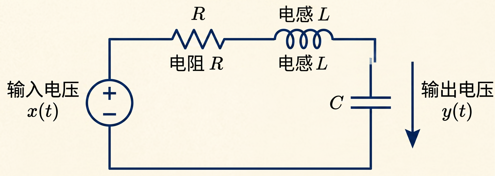{width=60% fig-align=center}
 
 
 
 
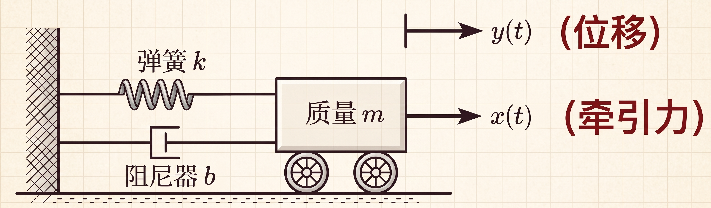{width=60% fig-align=center}

:::
::::
其中 $\hat{x}(t)=\frac{1}{k} x(t) \quad$ 显然，若 $\omega_{n}^{2}=k / M$，$\zeta=\frac{b}{2 \sqrt{k M}}$ 则方程就成为标准形式。

## 二阶连续时间系统
由二阶系统的方程可得系统的频率响应：

$$
H(j \omega)=\frac{\omega_{n}^{2}}{(j \omega)^{2}+2 \zeta \omega_{n}(j \omega)+\omega_{n}^{2}}=\frac{1}{\left(j \frac{\omega}{\omega_{n}}\right)^{2}+2 \zeta\left(j \frac{\omega}{\omega_{n}}\right)+1}
$$

$\zeta$ 称为阻尼系数，$\omega_{n}$ 称为无阻尼自然频率

1．时域特性—冲激响应

$$
H(j \omega)=\frac{\omega_{n}^{2}}{(j \omega)^{2}+2 \zeta \omega_{n}(j \omega)+\omega_{n}^{2}}=\frac{\omega_{n}^{2}}{\left(j \omega-c_{1}\right)\left(j \omega-c_{2}\right)}
$$

（1）$\zeta=0$ 时，$c_{1}=c_{2}^{*}=j \omega_n$ 系统处于无阻尼状态。

$$
H(j \omega)=\frac{\omega_{n}^{2}}{(j \omega)^{2}+\omega_{n}^{2}} \quad h(t)=\omega_{n} \sin \left(\omega_{n} t\right) u(t)
$$

## 二阶连续时间系统

（2）当 $0<\zeta<1$ 时，$c_{1}、c_{2}$ 为共轭复根，系统处于欠阻
尼状态；$c_{1,2}=-\zeta \omega_{n} \pm j \omega_{n} \sqrt{1-\zeta^{2}}$

$$
\begin{aligned}
& H(j \omega)=\frac{M}{j \omega-c_{1}}-\frac{M}{j \omega-c_{2}} \quad M=\frac{\omega_{n}}{2 j \sqrt{1-\zeta^{2}}} \\
& h(t)=\frac{\omega_{n}}{\sqrt{1-\zeta^{2}}} e^{-\zeta \omega_{n} t} \sin \left(\omega_{n} \sqrt{1-\zeta^{2}} t\right) u(t)
\end{aligned}
$$

（3）当 $\zeta=1$ 时，$c_{1}=c_{2}=-\omega_{n}$ 系统处于临界阻尼状态。

:::: {.columns style="text-align: left;"}
::: {.column width="60%"} 
$$
\begin{aligned}
& H(j \omega)=\frac{\omega_{n}^{2}}{\left(j \omega-c_{1}\right)^{2}}=\frac{\omega_{n}^{2}}{\left(j \omega+\omega_{n}\right)^{2}} \\
& h(t)=\omega_{n}^{2} t e^{-\omega_{n} t} u(t)
\end{aligned}
$$
:::
::: {.column width="40%"}
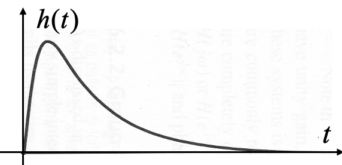{width=40%}
:::
::::
（4）$\zeta>1$ 时，$c_{1}$ 为实数根，系统为过阻尼状态；

$$
\begin{aligned}
& c_{1,2}=-\zeta \omega_{n} \pm \omega_{n} \sqrt{\zeta^{2}-1} \\
& H(j \omega)=\frac{M}{j \omega-c_{1}}-\frac{M}{j \omega-c_{2}} \quad M=\frac{\omega_{n}}{2 \sqrt{\zeta^{2}-1}} \\
& h(t)=M\left[e^{c_{1} t}-e^{c_{2} t}\right] u(t)
\end{aligned}
$$

## 二阶连续时间系统

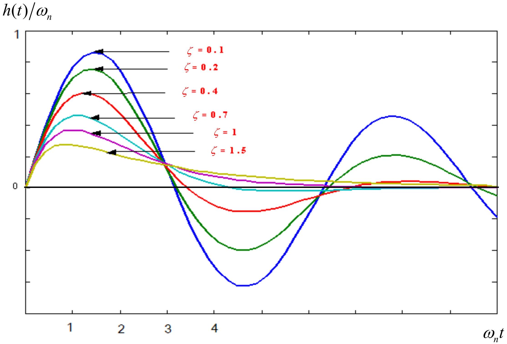

## 二阶连续时间系统

1．时域特性—阶跃响应

当 $\zeta \neq 1$时

$$
s(t)=h(t) * u(t)=\left[1+M\left(\frac{e^{c_{1} t}}{c_{1}}-\frac{e^{c_{2} t}}{c_{2}}\right)\right] u(t)
$$

当 $\zeta=1$ 时，$\quad c_{1}=c_{2}=-\omega_{n}$

$$
s(t)=h(t) * u(t)=\left[1-e^{-\omega_{n} t}-\omega_{n} t e^{-\omega_{n} t}\right] u(t)
$$

当 $0<\zeta<1$ 时 （即欠阻尼状态），阶跃响应既有超量又有震荡；

当 $\zeta=1$时，在没有超调的情况下，响应最快，即最短的上升时间；随着$\zeta$的增加，响应越来越慢；

## 二阶连续时间系统

2．频率特性：

$$
\begin{gathered}
|H(j \omega)|=\frac{1}{\sqrt{\left[1-\left(\frac{\omega}{\omega_{n}}\right)^{2}\right]^{2}+4 \zeta^{2}\left(\frac{\omega}{\omega_{n}}\right)^{2}}} \\
20 \lg |H(j \omega)|=-10 \lg \left\{\left[1-\left(\frac{\omega}{\omega_{n}}\right)^{2}\right]^{2}+4 \zeta^{2}\left(\frac{\omega}{\omega_{n}}\right)^{2}\right\}
\end{gathered}
$$

当 $\omega \ll \omega_n$ 时，$\quad 20 \lg |H(j \omega)| \approx 0 \mathrm{~dB}$

当 $\omega \gg \omega_n$时，

$$
\begin{aligned}
20 \lg |H(j \omega)| & \approx-10 \lg \left(\frac{\omega}{\omega_{n}}\right)^{4}=-40 \lg \frac{\omega}{\omega_{n}} \\
& =-40 \lg \omega+40 \lg \omega_{n}
\end{aligned}
$$

## 二阶连续时间系统

:::: {.columns style="text-align: left;"}
::: {.column width="65%"} 
在对数坐标中可用两条直线表示:

(1) 一条是低频段的0 dB 线
(2) 一条是高频段的斜率为 $-40 \mathrm{~dB} / \mathrm{dec}$ 的直线。
 
 
在 $\omega=\omega_n$ 处，两条渐进线相交，因此 称为二阶系统的转折频率,对数模为：
$$
20 \lg |H(j \omega)|=-20 \lg 2 \zeta
$$
谐振峰值
$$
\begin{aligned}
20 \lg |H(j \omega)| & =-10 \lg \left[1+\left(4 \zeta^{2}-2\right)\left(\frac{\omega}{\omega_{n}}\right)^{2}+\left(\frac{\omega}{\omega_{n}}\right)^{4}\right] \\
& =-10 \lg \left\{\left[\left(\frac{\omega}{\omega_{n}}\right)^{2}-\left(1-2 \zeta^{2}\right)\right]^{2}+1-\left(1-2 \zeta^{2}\right)^{2}\right\}
\end{aligned}
$$
:::
::: {.column width="35%"} 
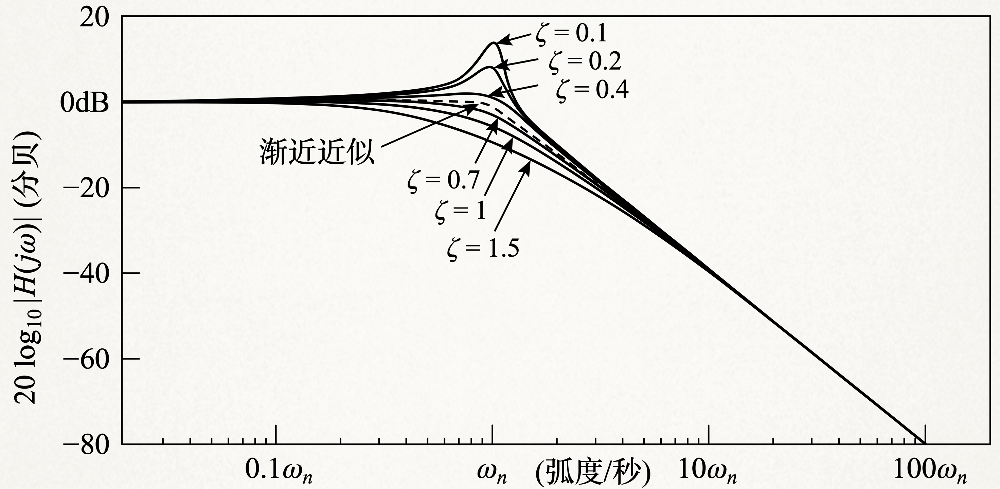{width=80% fig-align=center}

$\zeta<0.707$时，幅频特性在 $\quad \omega_{n} \sqrt{1-2\zeta^2}$ 处出现峰值，峰值为$1/2\zeta \sqrt{1-\zeta^2}$,$\longrightarrow$可以用于设计选频放大器，在某一较窄的频率范围内，对一些正弦信号提供放大。用品质因数Q来衡量峰值的尖锐程度：$Q=\frac{1}{2\zeta}$

:::
::::

$\zeta>0.707$时，系统类似于一阶系统具有低通特性。 

$\zeta<0.707$时，随$\zeta$的减小，逐步过渡为带通特性。 

$\zeta=0.707$时，系统具有最平坦的低通特性。

## 二阶连续时间系统

**相位特性**：

:::: {.columns style="text-align: left;"}
::: {.column width="55%"} 
$$
\begin{array}{ll}
\arg H(j \omega)=-\tan ^{-1} \frac{2 \zeta \frac{\omega}{\omega_{n}}}{1-\left(\frac{\omega}{\omega_{n}}\right)^{2}} & \omega=\omega_{n} \text { 时 } \omega \rightarrow 0, \arg H(j \omega) \rightarrow 0 \\
\omega=\omega_{n} \text { 时 } \arg H(j \omega)=-\frac{\pi}{2} \\
\omega \rightarrow \infty \text { 时 } \arg H(j \omega) \rightarrow-\pi
\end{array}
$$

可将其用折线近似为：

$$
\arg H(j \omega)= \begin{cases}0, & \omega \leq 0.1 \omega_{n} \\ -\frac{\pi}{2}\left[\lg \frac{\omega}{\omega_{n}}+1\right], & 0.1 \omega_{n} \leq \omega \leq 10 \omega_{n} \\ -\pi, & \omega \geq 10 \omega_{n}\end{cases}
$$

:::
::: {.column width="45%"} 
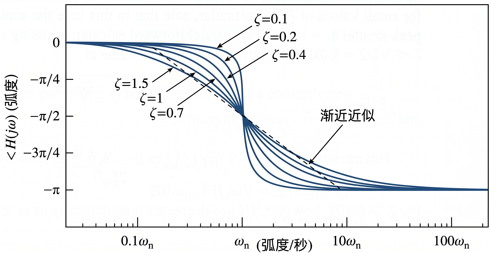

可见$\zeta$越小，相位的非线性越严重

:::
::::

## 有理型频率响应的Bode图：

$$
\begin{aligned}
\text { 对于 } \hat{H}(j \omega) & =j \omega \tau+1 \\
\hat{H}(j \omega) & =\left(\frac{j \omega}{\omega_{n}}\right)^{2}+2 \zeta\left(\frac{j \omega}{\omega_{n}}\right)+1
\end{aligned}
$$

这种频率特性的因子，与一阶、二阶系统的情况相比，其 $H(j \omega)$存在倒量关系。即

$$
\begin{gathered}
20 \lg |\hat{H}(j \omega)|=20 \lg \left|\frac{1}{H(j \omega)}\right|=-20 \lg |H(j \omega)| \\
\arg \hat{H}(j \omega)=-\arg H(j \omega)
\end{gathered}
$$

## 目录 {#toc5}

- [1. 傅里叶变换的模和相位表示](#sec61)
- [2. 线性时不变系统频率响应的模和相位表示](#sec62)
- [3. 理想频率选择性滤波器的时频特性](#sec63)
- [4. 非理想频率选择性滤波器的时频特性](#sec64)
- [5. 一阶与二阶连续时间系统](#sec65)
- [**6. 一阶与二阶离散时间系统**](#sec66)
- [7. 系统的时域和频域分析实例](#sec67)

# 一阶与二阶离散时间系统 {#sec66}

## 一阶与二阶离散时间系统

**一阶离散时间系统的数学模型**：

$$
y(n)-a y(n-1)=x(n) \quad|a|<1
$$

由差分方程可得系统的频率响应：

$$
H\left(e^{j \omega}\right)=\frac{1}{1-a e^{-j \omega}}
$$

**时域特性**：

对频率响应做傅立叶反变换可得：

$$
h(n)=a^{n} u(n)
$$

系统的单位阶跃响应为：

$$
s(n)=\sum_{k=-\infty}^{n} h(k)=\sum_{k=0}^{n} a^{k}=\frac{1-a^{n+1}}{1-a} u(n)
$$

## 一阶离散时间系统

据此可作出不同参数情况下系统的单位脉冲响应和单位阶跃响应：

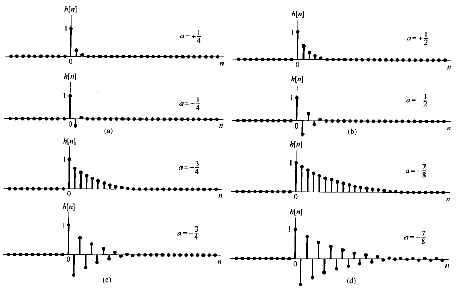{fig-align=center}

－ 当 $a>0$ 时，随着 $a$ 的增大，系统的单位脉冲响应单调衰减得越来越慢。

－ 当 $a<0$ 时，系统的单位脉冲响应存在振荡。 $|a|$ 越大，振荡的持续期越长；单位脉冲响应衰减得越慢。

## 一阶离散时间系统

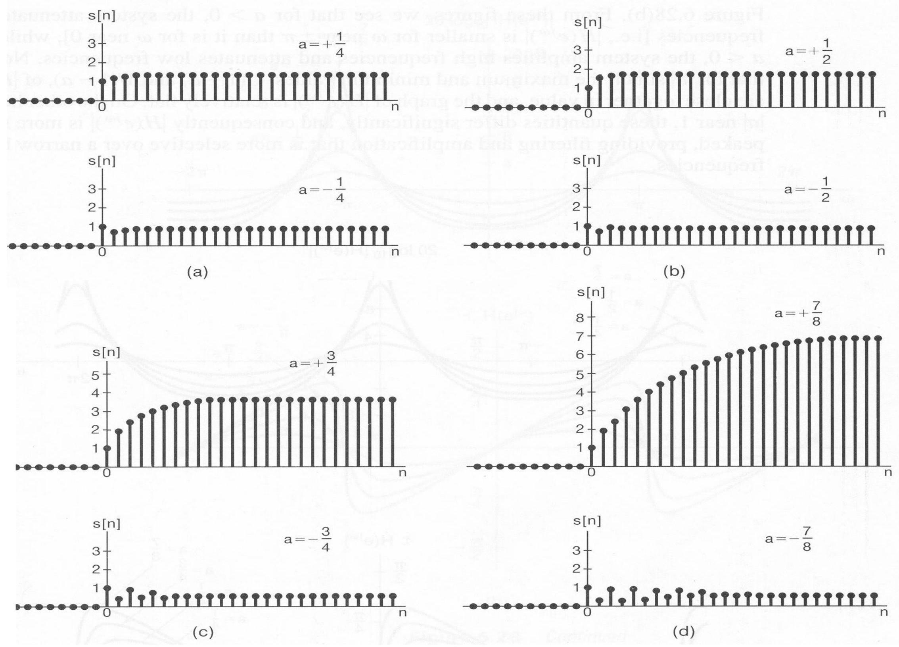{fig-align=center}

－ 当 $a>0$ 时，随着 $a$ 的增大，系统的单位阶跃响应单调上升得越来越慢。

－ 当 $a<0$ 时，系统的单位阶跃响应存在振荡。 $|a|$ 越大，振荡的持续期越长；单位阶跃响应上升得越慢。

## 一阶离散时间系统

**频域特性**：

由系统的频率响应可以得出：

$$
\left|H\left(e^{j \omega}\right)\right|=\frac{1}{\sqrt{1+a^{2}-2 a \cos \omega}} \quad \arg H\left(e^{j \omega}\right)=-\tan ^{-1} \frac{a \sin \omega}{1-a \cos \omega}
$$

:::: {.columns style="text-align: left;"}
::: {.column width="55%"} 
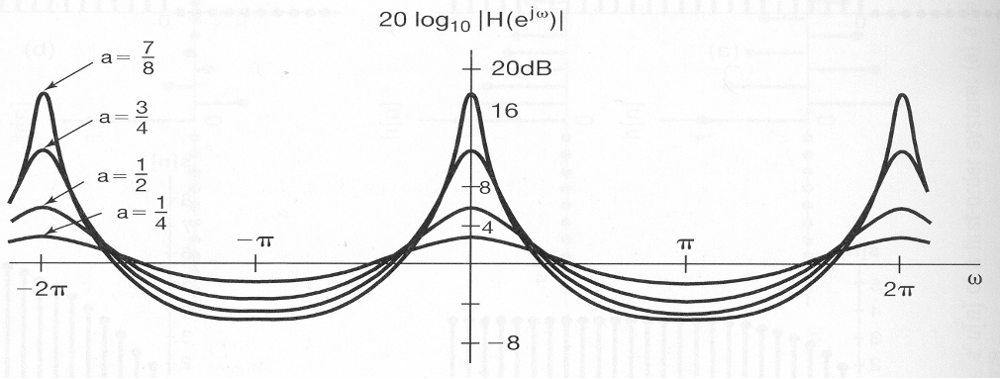

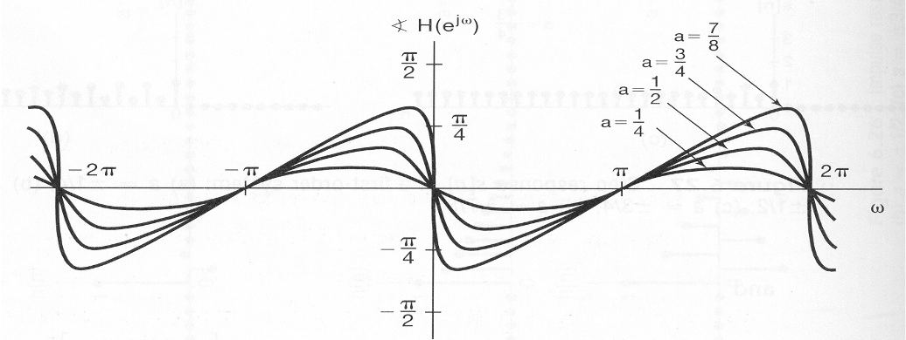
:::
::: {.column width="45%"} 

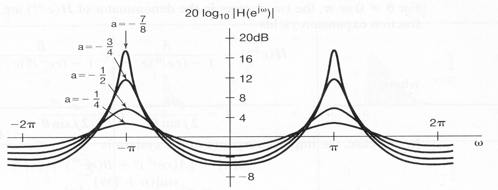

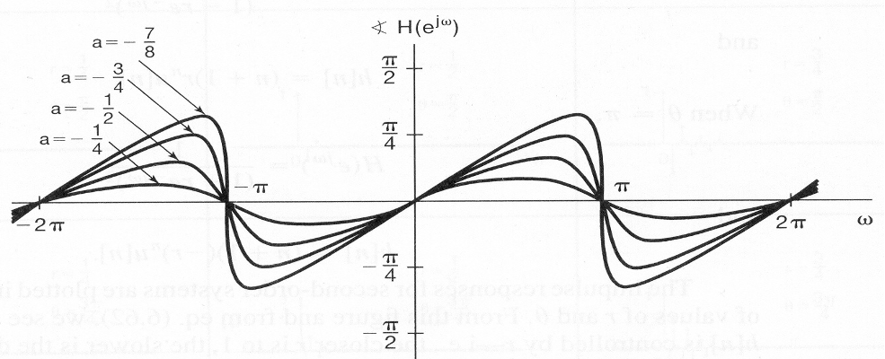

:::
::::

## 二阶离散时间系统

数学模型：$y(n)-2 r \cos \theta y(n-1)+r^{2} y(n-2)=x(n)$
 
其中 $0<r<1, \quad 0 \leq \theta \leq \pi$ ，

$$
H\left(e^{j \omega}\right)=\frac{1}{1-2 r \cos \theta e^{-j \omega}+r^{2} e^{-j 2 \omega}}=\frac{1}{\left[1-r e^{j \theta} e^{-j \omega}\right]\left[1-r e^{-j \theta} e^{-j \omega}\right]}
$$

$\theta \neq 0$ 或 $\pi$ 时，$H\left(e^{j \omega}\right)$ 有两个不同的极点 $r e^{j \theta}、r e^{-j \theta}$

$$
H\left(e^{j \omega}\right)=\frac{A}{1-r e^{j \theta} e^{-j \omega}}+\frac{B}{1-r e^{-j \theta} e^{-j \omega}}\quad \text { 其中 } \quad A=\frac{e^{j \theta}}{2 j \sin \theta} \quad B=\frac{-e^{-j \theta}}{2 j \sin \theta}
$$

$$h(n)=\left[A\left(r e^{j \theta}\right)^{n}+B\left(r e^{-j \theta}\right)^{n}\right] u(n)=r^{n} \frac{\sin (n+1) \theta}{\sin \theta} u(n)$$ 

$r$ 影响衰减速率，$\theta$ 影响振荡频率。 $h(n)$ 为指数衰减的正弦振荡。系统为欠阻尼状态。 

 

$\theta=0$ 时，$H\left(e^{j \omega}\right)=\frac{1}{\left(1-r e^{-j \omega}\right)^{2}} \quad$ 系统为临界阻尼。 $h(n)=(n+1) r^{n} u(n) \quad h(n)$ 单调变化，无振荡。 

 

$\theta=\pi$ 时，$\quad H\left(e^{j \omega}\right)=\frac{1}{\left(1+r e^{-j \omega}\right)^{2}}$ 系统为欠阻尼。
$h(n)=(n+1)(-r)^{n} u(n) \quad h(n)$ 振荡最剧烈。

<!-- ## 二阶离散时间系统

系统的单位脉冲响应：

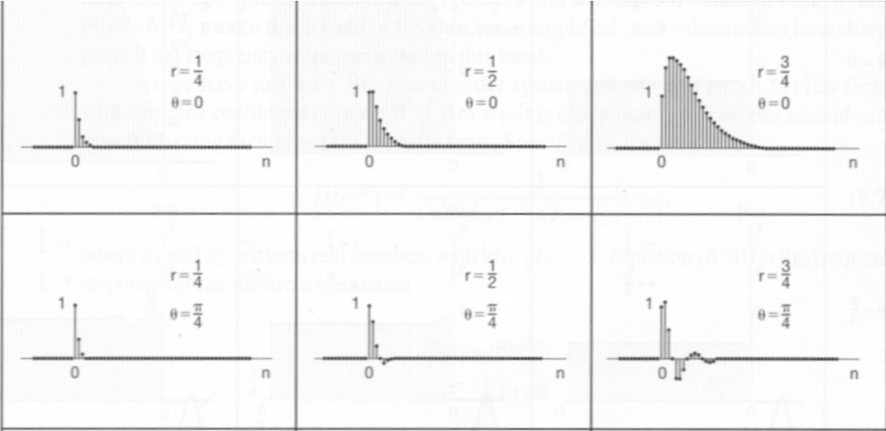

## 二阶离散时间系统

系统的单位脉冲响应：

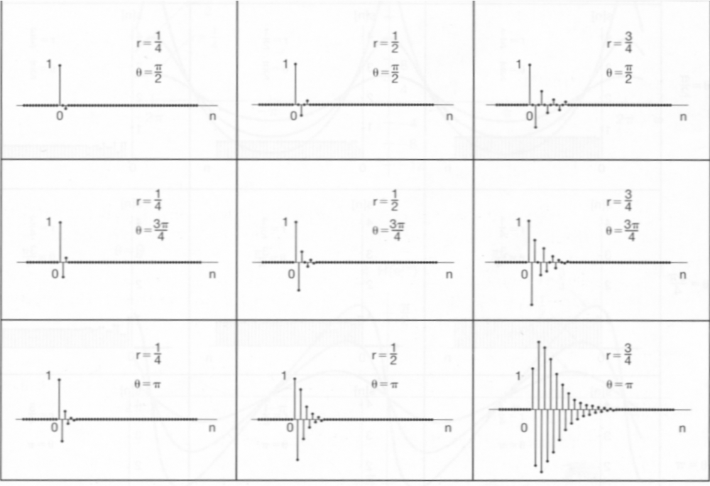

## 二阶离散时间系统

系统的单位阶跃响应：

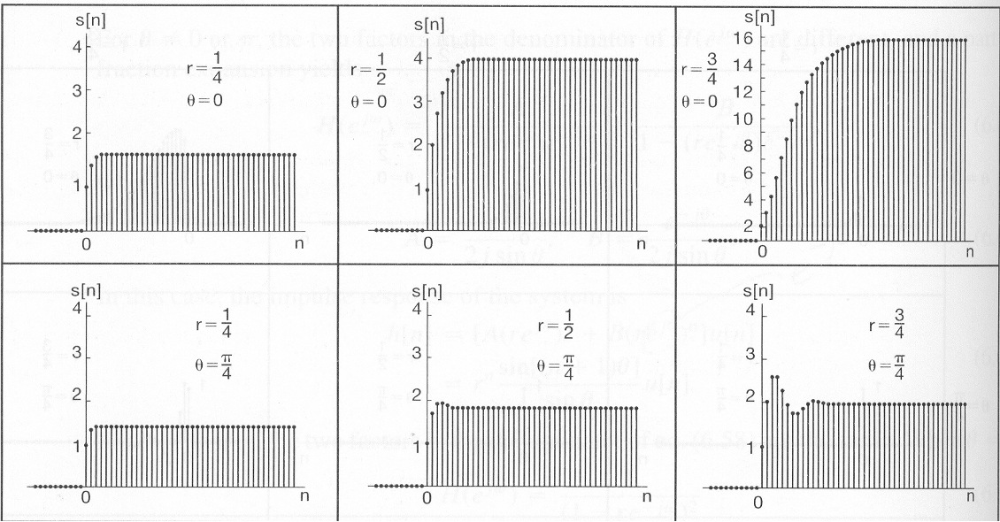

## 二阶离散时间系统

系统的单位阶跃响应：

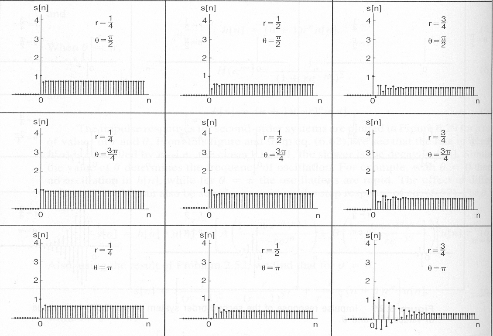{fig-align=center}

1．当系统处于欠阻尼状态时，即 $0<\theta \leq \pi$ 时，系统的单位冲激响应和单位阶跃响应都存在振荡和超量。 $\theta$ 越接近 $\pi$ ，振荡的频率越高。

2．在欠阻尼状态下，$r$ 影响着单位冲激响应和单位阶跃响应的变化速率。 $r$ 越接近1，单位冲激响应衰减得越慢，单位阶跃响应上升得越慢，出现的振荡也越明显。 -->

## 二阶离散时间系统

系统的单位脉冲响应：

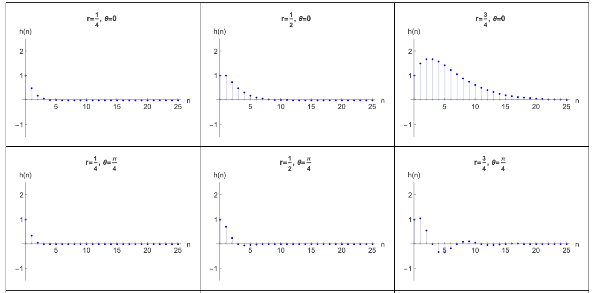

## 二阶离散时间系统

系统的单位脉冲响应：

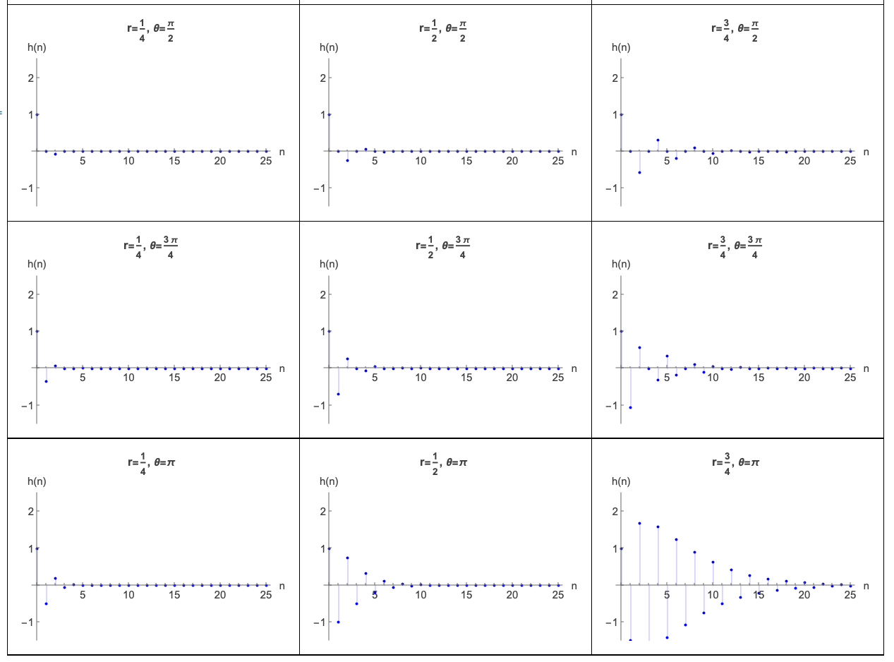

## 二阶离散时间系统

系统的单位阶跃响应：

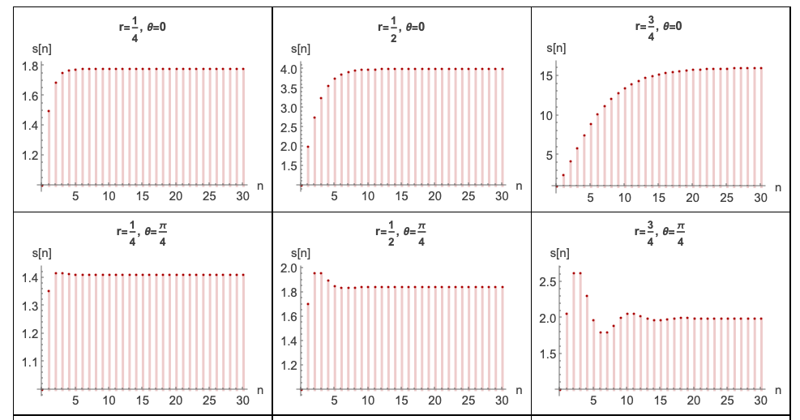

## 二阶离散时间系统

系统的单位阶跃响应：

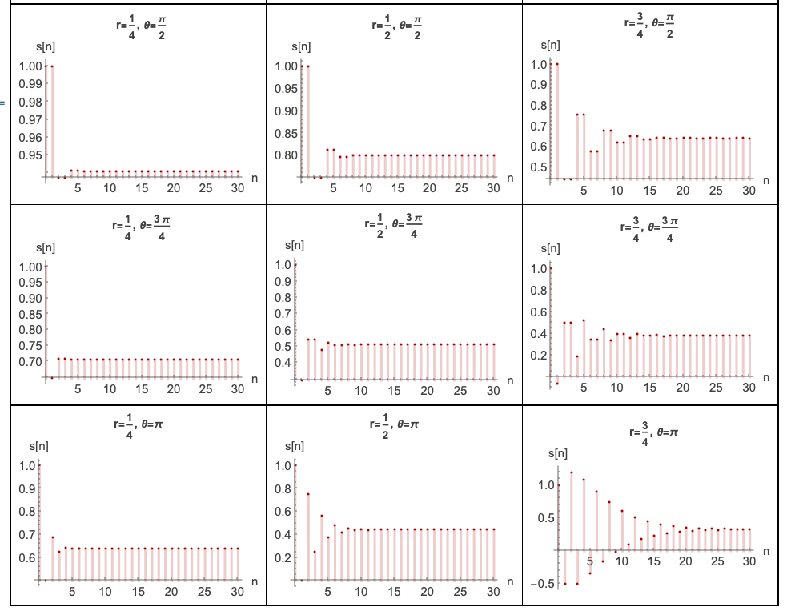{fig-align=center}

1．当系统处于欠阻尼状态时，即 $0<\theta \leq \pi$ 时，系统的单位冲激响应和单位阶跃响应都存在振荡和超量。 $\theta$ 越接近 $\pi$ ，振荡的频率越高。

2．在欠阻尼状态下，$r$ 影响着单位冲激响应和单位阶跃响应的变化速率。 $r$ 越接近1，单位冲激响应衰减得越慢，单位阶跃响应上升得越慢，出现的振荡也越明显。

## 二阶离散时间系统

频率特性

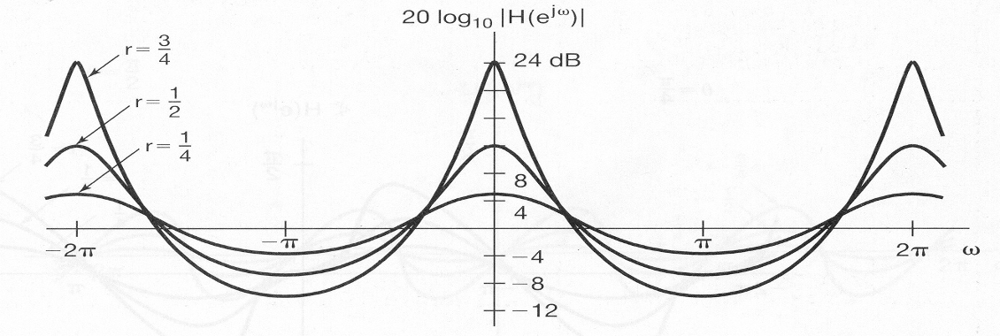{fig-align=center}

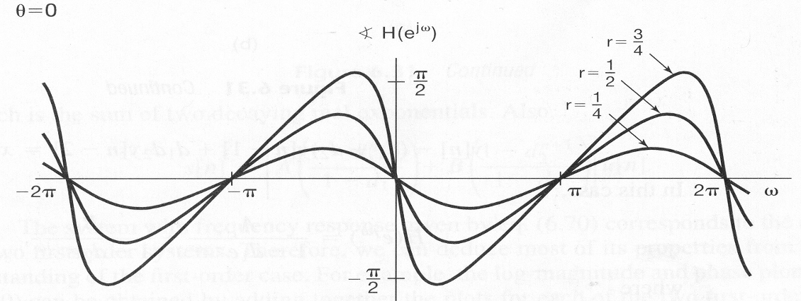{fig-align=center}

## 二阶离散时间系统

频率特性

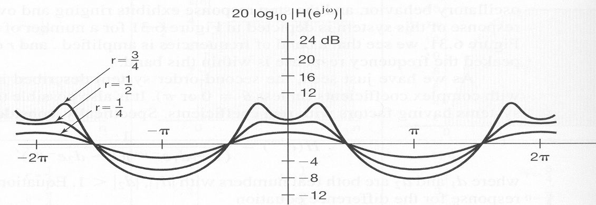{fig-align=center}

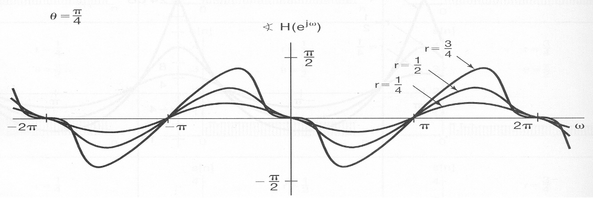{fig-align=center}

## 二阶离散时间系统

频率特性

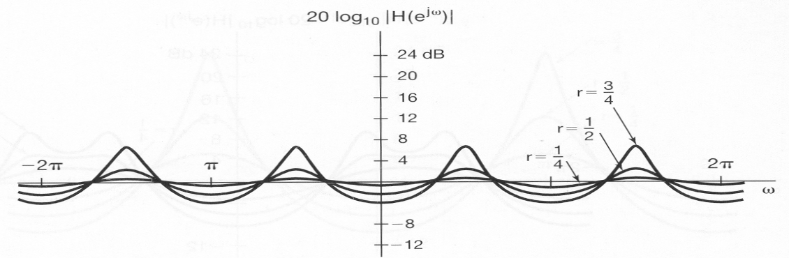{fig-align=center}

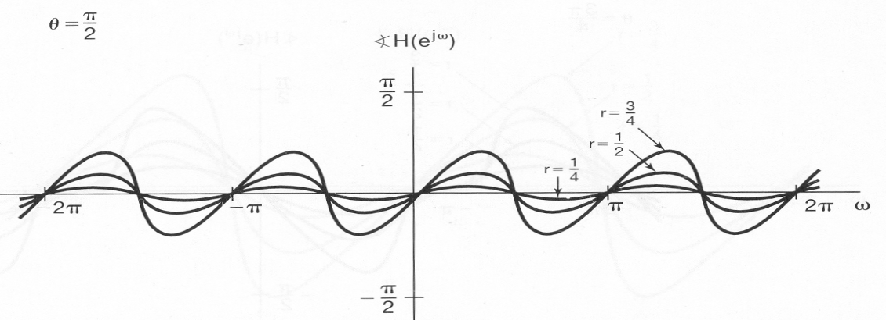{fig-align=center}

## 二阶离散时间系统

频率特性

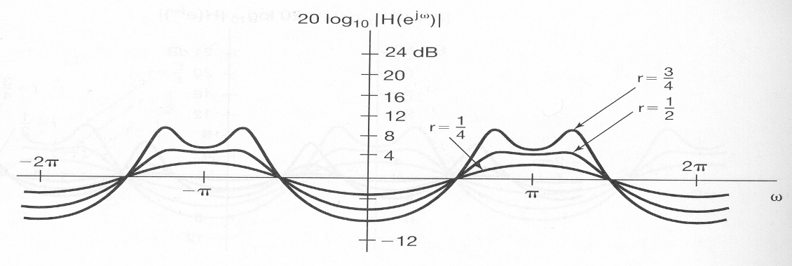{fig-align=center}

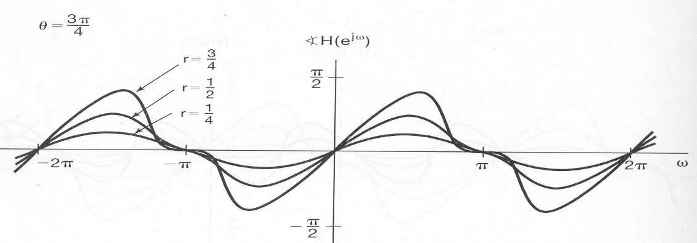{fig-align=center}

## 二阶离散时间系统

频率特性

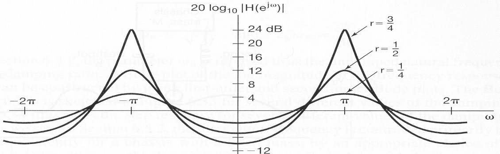{fig-align=center}

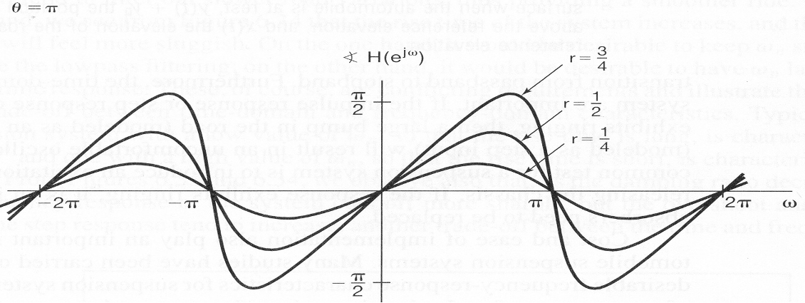{fig-align=center}

## 二阶离散时间系统
由图可以看出：

1．$r$ 越大，幅频特性的峰越尖锐，系统的带宽越窄；$r$ 越小，幅频特性越平坦，系统带宽越宽。

2．系统幅频特性的峰值总是出现在 $\theta$ 值的附近，随着 $\theta$ 从 $0: \pi$ 变化，系统经历了从低通特性 ⟶带通特性—高通特性的变化过程。

3．系统具有非线性相位特性。
 
 
总之：$\theta$ 影响系统频响的峰值位置，$r$ 影响峰值的大小，其作用分别类似于连续系统的 $\omega_{n}$ 和 $\zeta$

二阶系统也可以处在过阻尼状态，此时系统有两个实数极点。将 $H\left(e^{j \omega}\right)$ 展开成部分分式有：

$$
H\left(e^{j \omega}\right)=\frac{1}{\left(1-d_{1} e^{-j \omega}\right)\left(1-d_{2} e^{-j \omega}\right)}=\frac{A}{\left(1-d_{1} e^{-j \omega}\right)}+\frac{B}{\left(1-d_{2} e^{-j \omega}\right)}
$$

其中 $A=\frac{d_{1}}{d_{1}-d_{2}}$, $B=\frac{d_{2}}{d_{2}-d_{1}}$

此时相当于两个一阶系统级联。

当 $d_{1}>0, d_{2}>0$时，系统为过阻尼状态；

当 $d_{1}<0, d_{2}<0$ 时，系统为欠阻尼状态。

其他情况，系统状态 将取决于绝对值大的极点（主时间常数）是正值还是负值。

## 目录 {#toc6}

- [1. 傅里叶变换的模和相位表示](#sec61)
- [2. 线性时不变系统频率响应的模和相位表示](#sec62)
- [3. 理想频率选择性滤波器的时频特性](#sec63)
- [4. 非理想频率选择性滤波器的时频特性](#sec64)
- [5. 一阶与二阶连续时间系统](#sec65)
- [6. 一阶与二阶离散时间系统](#sec66)
- [**7. 系统的时域和频域分析实例**](#sec67)

# 系统的时域和频域分析实例 {#sec67}
## 系统的时域分析与频域分析举例

汽车减震系统,模型为：

$$
M \frac{d^{2} y(t)}{d t^{2}}+b \frac{d y(t)}{d t}+k y(t)=k x(t)+b \frac{d x(t)}{d t}
$$
整理后

$$
H(j\omega) =  \frac{k+b j\omega}{(j\omega)^2M+b(j\omega)+k} \text {或} H(j\omega) = \frac{\omega_n^2 + 2\zeta\omega_n(j\omega)}{(j\omega)^2 + 2\zeta\omega_n(j\omega) + \omega_n^2}
$$
类似于前面讨论过的二阶系统，其中$\omega_{n}=\sqrt{\frac{k}{M}} \quad 2 \zeta \omega_{n}=\frac{b}{M}$

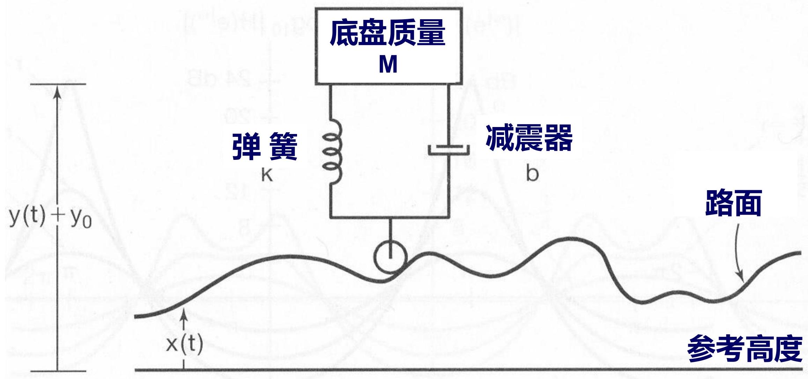{fig-align="center" width=50%}

## 系统的时域分析与频域分析举例

:::: {.columns style="text-align: left;"}
::: {.column width="50%"} 
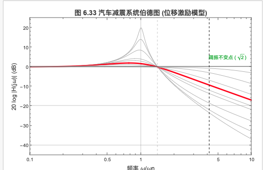{fig-align=center}
:::

::: {.column width="50%"} 
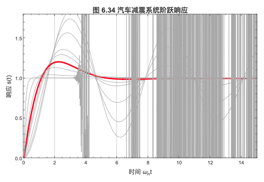{fig-align=center}
:::
::::

从频域看，$\omega_n$越小，越有利于滤除路面不平所造成的影响。但 $\omega_n$越小，时域特性变化越慢。

从时域角度看，希望响应时间尽可能快，并且不要出现震荡和超量，因此应该要求 $\zeta=1$ 

 

但$\zeta=1$时，系统的频率特性并不是最佳。

 

**对系统的时域特性和频域特性综合折中考虑，是工程应用中很重要的问题**。

## 系统的时域分析与频域分析举例
二．FIR滤波器：
离散时间滤波器可以分为IIR和FIR两大类。
考察如下的滑动平均滤波器：

$$
y(n)=\frac{1}{N+M+1} \sum_{k=-N}^{M} x(n-k)
$$

它是一个FIR系统，其频率响应为：

$$
H\left(e^{j \omega}\right)=\frac{1}{N+M+1} \sum_{k=-N}^{M} e^{-j \omega k}=\frac{1}{N+M+1} \frac{\sin \frac{N+M+1}{2} \omega}{\sin \frac{\omega}{2}} e^{j \frac{N-M}{2} \omega}
$$

更一般的情况，可加权的滑动平均滤波器可表示为：

$$
y(n)=\sum_{k=-N}^{M} b_{k} x(n-k)
$$

选择不同的加权序列 $b_{k}$ ，即可改变滤波器的特性。

## 系统的时域分析与频域分析举例

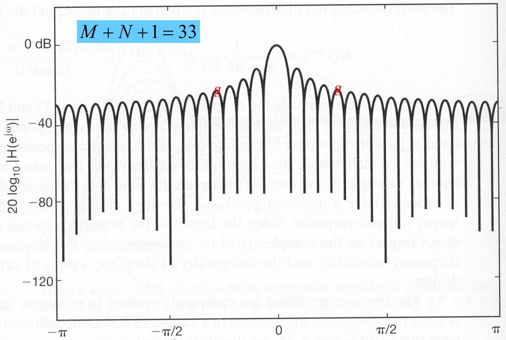

## 系统的时域分析与频域分析举例

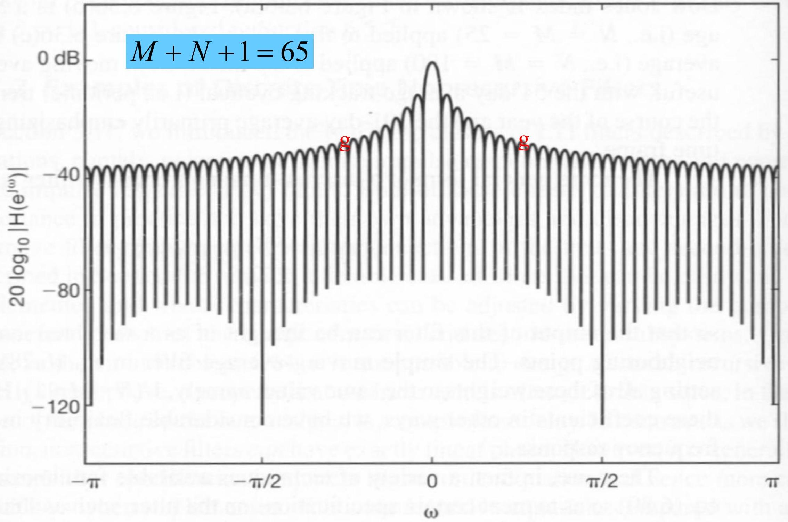

## 系统的时域分析与频域分析举例

加权滑动平均滤波器的窗函数序列：
$$
y(n)=\sum_{k=-N}^{N} h_{k} x(n-k) \quad h(n)= \begin{cases}\frac{\sin (2 \pi n / 33)}{\pi n}, & |n| \leq 32 \\ 0, & |n|>32\end{cases}
$$

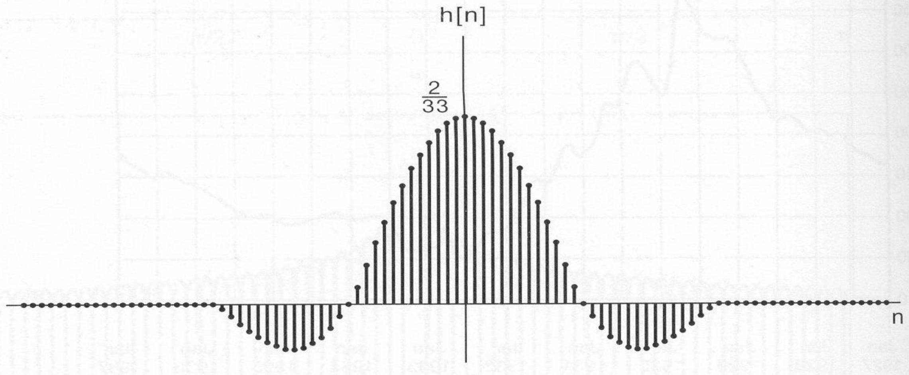

## 系统的时域分析与频域分析举例

该FIR滤波器的幅频特性（对数模）：

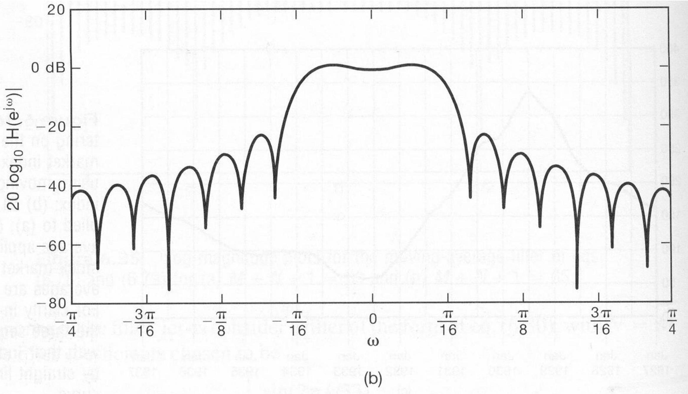

其他窗函数：https://vru.vibrationresearch.com/lesson/tables-of-window-function-details/

## 系统的时域分析与频域分析举例

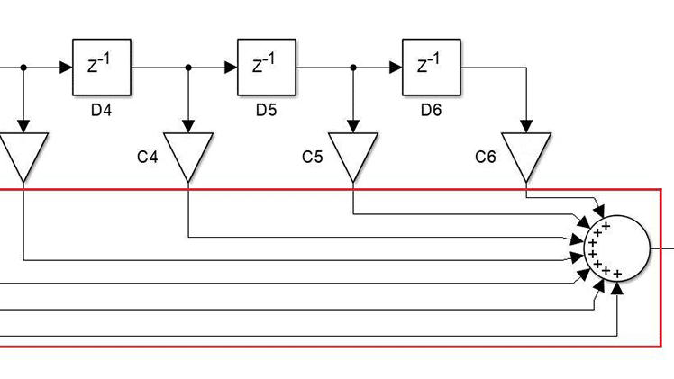

<!-- ## 目录

1. 傅里叶变换的幅度–相位表示
2. 不确定性原理
3. 傅里叶表示之间的关系

## 不确定性原理

设连续时间信号 $x \in L_{2}(\mathbb{R})$，其傅里叶变换为 $X=\mathcal{F}\{x\} \in L_{2}(\mathbb{R})$。定义时域与频域中的归一化功率密度为

$$
p(t)=\frac{|x(t)|^{2}}{\int_{\mathbb{R}}|x(\tau)|^{2} d \tau}, \quad P(\omega)=\frac{|X(j \omega)|^{2}}{\int_{\mathbb{R}}|X(j \theta)|^{2} d \theta}
$$

注：$p$ 与 $P$ 可以像量子力学中那样解释为概率密度。
从如下意义上说，$x$ 与 $X$ 分别以 $t_{0}$ 和 $\omega_{0}$ 为中心：

$$
t_{0}=\int_{\mathbb{R}} t p(t) d t, \quad \omega_{0}=\int_{\mathbb{R}} \omega P(\omega) d \omega
$$

“标准差”用于衡量能量相对于中心位置的分散程度

$$
\Delta t=\left[\int_{\mathbb{R}}\left(t-t_{0}\right)^{2} p(t) d t\right]^{\frac{1}{2}}, \quad \Delta \omega=\left[\int_{\mathbb{R}}\left(\omega-\omega_{0}\right)^{2} P(\omega) d \omega\right]^{\frac{1}{2}}
$$

## 不确定性原理

定理：若 $x(t) \in L_{2}(\mathbb{R})$，其傅里叶变换为 $X(j \omega)$，则有

$$
\Delta t \Delta \omega \geq \frac{1}{2}
$$

当且仅当 $x$ 为高斯函数时取等号。
事实上，还成立如下稍一般的关系：

$$
D_{a}(x) D_{b}(X) \geq \frac{1}{2}\|x\|_{2} \cdot\|X\|_{2}
$$

其中，对任意 $g \in L_{2}(\mathbb{R})$ 以及 $a \in \mathbb{R}$，

$$
D_{a}(g)=\left[\int_{\mathbb{R}}(\xi-a)^{2}|g(\xi)|^{2} d \xi\right]^{\frac{1}{2}}
$$

注：粗略地说，一个信号不可能同时在时域和频域都高度集中；短脉冲往往对应较宽带宽，而窄带信号通常持续时间较长。

## 不确定性原理的证明

先假设 $a=b=0$。

$$
D_{0}(X)=\left[\int_{\mathbb{R}} \omega^{2}|X(j \omega)|^{2} d t\right]^{\frac{1}{2}}=\left[\int_{\mathbb{R}}|j \omega X(j \omega)|^{2} d \omega\right]^{\frac{1}{2}}
$$

由于 $x^{\prime}(t) \stackrel{\mathcal{F}}{\longleftrightarrow} j \omega X(j \omega)$，由 Parseval 恒等式可得

$$
D_{0}(X)=\left[2 \pi \int_{\mathbb{R}}\left|x^{\prime}(t)\right|^{2} d t\right]^{\frac{1}{2}}
$$

由 Cauchy–Schwarz 不等式，

$$
\begin{aligned}
D_{0}(x) D_{0}(X) & =\sqrt{2 \pi}\left[\int_{\mathbb{R}}|t x(t)|^{2} d t\right]^{\frac{1}{2}}\left[\int_{\mathbb{R}}\left|x^{\prime}(t)\right|^{2} d t\right]^{\frac{1}{2}} \\
& \geq \sqrt{2 \pi}\left|\int_{\mathbb{R}} t x^{*}(t) x^{\prime}(t) d t\right| \geq \sqrt{2 \pi}\left|\operatorname{Re} \int_{\mathbb{R}} t x^{*}(t) x^{\prime}(t) d t\right|
\end{aligned}
$$

## 不确定性原理的证明

注意，
$2 \operatorname{Re} \int_{\mathbb{R}} t x^{*}(t) x^{\prime}(t) d t=\int_{\mathbb{R}} t x^{*}(t) x^{\prime}(t) d t+\int_{\mathbb{R}} t x(t) \overline{x^{\prime}(t)} d t=\int_{\mathbb{R}} t d|x(t)|^{2}$
对其分部积分可得

$$
2 \operatorname{Re} \int_{\mathbb{R}} t x^{*}(t) x^{\prime}(t) d t=\left.t|x(t)|^{2}\right|_{-\infty} ^{\infty}-\int_{\mathbb{R}}|x(t)|^{2} d t
$$

若 $D_{0}(x)=\infty$，则不等式显然成立，因此可设 $D_{0}(x)<\infty$。于是当 $t \rightarrow \infty$ 时，$t|x(t)|^{2} \rightarrow 0$。因此

$$
D_{0}(x) D_{0}(X) \geq \frac{\sqrt{2 \pi}}{2}\|x\|_{2}^{2}=\frac{1}{2}\|x\|_{2} \cdot\|X\|_{2}
$$

对于 $a,b \neq 0$ 的情形，注意到若定义
$y(t)=x(t+a) e^{-j b t} \stackrel{\mathcal{F}}{\longleftrightarrow} Y(j \omega)=X(j(\omega+b)) e^{j(\omega+b) a}$，
则有 $D_{a}(x)=D_{0}(y)$ 且 $D_{b}(X)=D_{0}(Y)$。$

目录

1. 傅里叶变换的幅度–相位表示
2. 不确定性原理
3. 傅里叶表示之间的关系 -->

<!-- ## 四种傅里叶表示

连续时间傅里叶级数（CTFS）
$\hat{x}[k]=\frac{1}{T} \int_{T} x(t) e^{-j \frac{2 \pi}{T} k t} d t$
$x(t)=x(t+T)=\sum_{k \in \mathbb{Z}} \hat{x}[k] e^{j \frac{2 \pi}{T} k t}$
离散时间傅里叶级数（DTFS）
$\hat{x}[k]=\frac{1}{N} \sum_{n \in[N]} x[n] e^{-j \frac{2 \pi}{N} k n}$
$x[n]=x[n+N]=\sum_{k \in[N]} \hat{x}[k] e^{j \frac{2 \pi}{N} k n}$

连续时间傅里叶变换（CTFT）
$X(j \omega)=\int_{\mathbb{R}} x(t) e^{-j \omega t} d t$
$x(t)=\frac{1}{2 \pi} \int_{\mathbb{R}} X(j \omega) e^{j \omega t} d \omega$
离散时间傅里叶变换（DTFT）
$X\left(e^{j \omega}\right)=\sum_{n \in \mathbb{Z}} x[n] e^{-j \omega n}$
$x[n]=\frac{1}{2 \pi} \int_{2 \pi} X\left(e^{j \omega}\right) e^{j \omega n} d \omega$

DFT 可以看作 DTFS 的一个周期。

四种傅里叶表示之间的关系

| 表示 | 时间域自变量 | 时间域信号 | 频域自变量 | 频域表示 |
| :--- | :---: | :---: | :---: | :---: |
| CTFS | 连续 | 周期 | 离散 | 非周期 |
| CTFT | 连续 | 非周期 | 连续 | 非周期 |
| DTFS | 离散 | 周期 | 离散 | 周期 |
| DTFT | 离散 | 非周期 | 连续 | 周期 |

观察结论

- 一个域中“周期”，对应另一个域中“离散”；
- 一个域中的采样离散化，对应另一个域中的周期延拓；
- 一个域中的插值连续化，对应另一个域中取出一个周期。

四种傅里叶表示之间的关系
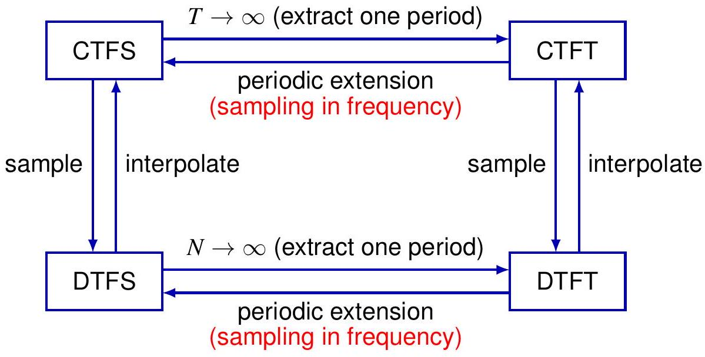

注：上述对应关系在某些情形下需要满足额外条件。 -->

## 作业

一、书面作业
  
  1. 6.2
  2. 6.3
  3. 6.5
  4. 6.11
  5. 6.15 

二、程序作业
  见乐学平台
 

---

<section style="
  min-height: 100vh;
  display: flex;
  flex-direction: column;
  justify-content: center;
  align-items: center;
  text-align: center;
">
  

<h1>第六章   信号与系统的时域和频域特性    完</h1>
  

</section>