## 目录 {#toc0}

- [**1. 非周期信号的表示：离散时间傅里叶变换**](#sec51)
- [2. 离散时间傅里叶变换的性质](#sec52)
- [3. 卷积性质](#sec53)
- [4. 乘积性质](#sec54)
- [5. 变换性质和变换对列表](#sec55)
- [6. 对偶性](#sec56)
- [7. 由线性常系数差分方程表征的系统](#sec57)

# 1. 非周期信号的表示：离散时间傅里叶变换 {#sec51}

## 连续时间信号的采样

采样将连续时间信号转换为离散时间信号。

**连续时间信号**  

**离散时间信号**  

$T=$ 采样周期，均匀采样是最常见的方式。  
采样允许使用数字电子设备对连续时间信号进行处理、记录、传输、存储和检索。

- MP3、数字相机、打印机等应用

## 连续时间信号的采样

采样会丢失信息，不同信号可能产生相同的采样序列。

- $x_1(t)=\cos(\pi t/3)$ 与 $x_2(t)=\cos(7\pi t/3)$ 是不同的信号  
- 但采样后得到完全相同的序列：$x_1[n]=\cos(\pi n/3)=x_2[n]=\cos(7\pi n/3)$  

**关键问题**：在什么条件下可以从采样序列中无失真地恢复原始连续时间信号？

## 冲激列采样（时域）

**连续时间信号** $x(t)$  

**冲激串**  
$$
p(t)=\sum_{n=-\infty}^{\infty} \delta(t-nT)
$$

**采样信号**  
$$
x_p(t)=x(t)p(t)=\sum_{n=-\infty}^{\infty} x(nT)\delta(t-nT)
$$

## 冲激列采样（频域）

**连续时间信号频谱** $X(j\omega)$  

**冲激串频谱**  
$$
P(j\omega)=\omega_s \sum_{k=-\infty}^{\infty} \delta(\omega-k\omega_s)
$$

**采样信号频谱**  
$$
X_p(j\omega)=\frac{1}{2\pi}(X*P)(\omega)=\frac{1}{T}\sum_{k=-\infty}^{\infty} X(j(\omega-k\omega_s))
$$

## 冲激列采样（频域）——带限信号

带限连续时间信号：$X(j\omega)=0$ 当 $|\omega|>\omega_M$ 时  

采样角频率 $\omega_s=2\pi/T$

**情况1**：$\omega_s > 2\omega_M$（频谱无重叠）——可以通过低通滤波恢复原始频谱  

**情况2**：$\omega_s < 2\omega_M$（出现频谱重叠，即混叠）——无法恢复原始信号  

## 采样定理

若连续时间信号 $x(t)$ 是带限的（其频谱 $X(j\omega)=0$ 当 $|\omega|>\omega_M$），且采样满足

$$
\omega_s \triangleq \frac{2\pi}{T} > 2\omega_M
$$

（其中 $2\omega_M$ 称为**奈奎斯特率**），则该信号可由其采样序列 $x(nT),\ n\in\mathbb{Z}$ 唯一确定。

**重建步骤**：
1. 构造冲激采样信号 $x_p(t)=\sum_{n=-\infty}^{\infty} x(nT)\delta(t-nT)$
2. 通过增益为 $T$、截止频率 $\omega_c\in(\omega_M, \omega_s-\omega_M)$ 的理想低通滤波器  
   $$
   H(j\omega)=T[u(\omega+\omega_c)-u(\omega-\omega_c)]
   $$
3. 滤波器输出 $x_r(t)$ 即为原始信号 $x(t)$

## 频域中的重建

- 奈奎斯特频率：$\omega_M$
- 奈奎斯特率：$2\omega_M$
- 低通滤波器：增益 $T$，截止频率满足 $\omega_M < \omega_c < \omega_s - \omega_M$

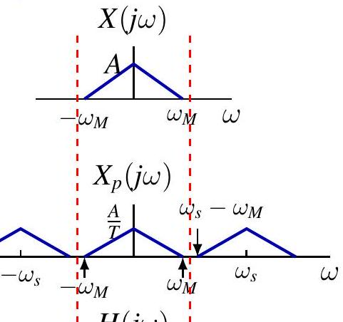
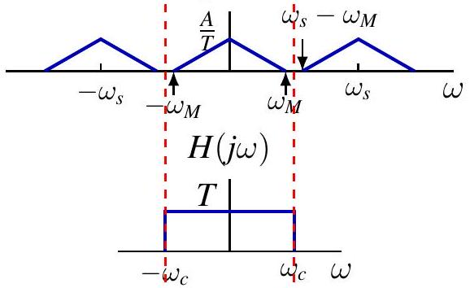

## 时域中的重建

低通滤波器的冲激响应：
$$
h(t)=\frac{T\sin(\omega_c t)}{\pi t}
$$

重建信号：
$$
x_r(t)=\sum_{n=-\infty}^{\infty} x(nT)\frac{T\sin(\omega_c(t-nT))}{\pi(t-nT)}
$$

## 时域中的重建（$\omega_c=\omega_s/2$）

当截止频率取 $\omega_c=\omega_s/2=\pi/T$ 时，得到 **Whittaker-Shannon 插值公式**：

$$
x_r(t)=\sum_{n=-\infty}^{\infty} x(nT)\operatorname{sinc}\left(\frac{t-nT}{T}\right)
$$

其中 $\operatorname{sinc}(t)=\frac{\sin(\pi t)}{\pi t}$

## 时域中的重建（其他截止频率示例）

  
$\omega_c=\omega_s/4=\pi/(2T) > \omega_M$

  
$\omega_c=3\omega_s/5 < \omega_s - \omega_M$

## 其他插值方法

## 零阶保持（Zero-Order Hold）

重建信号：
$$
x_0(t)=\sum_{n=-\infty}^{\infty} x(nT) h_0(t-nT)
$$

零阶保持滤波器频率响应：
$$
H_0(j\omega)=e^{-j\omega T/2} \frac{2\sin(\omega T/2)}{\omega}
$$

## 线性插值（First-Order Hold）

重建信号：
$$
x_1(t)=\sum_{n=-\infty}^{\infty} x(nT) h_1(t-nT)
$$

一阶保持滤波器频率响应：
$$
H_1(j\omega)=\frac{1}{T}\left[\frac{\sin(\omega T/2)}{\omega/2}\right]^2
$$

## 混叠（Aliasing）

混叠会使频率发生“折叠”。

**输出频率 vs 输入频率关系图**  
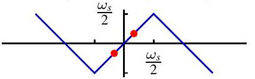

当 $\omega_0 < \omega_s/2$ 时，无混叠，重建信号与原始信号相同。

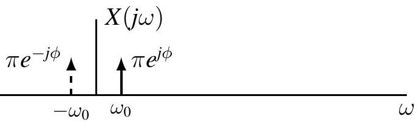
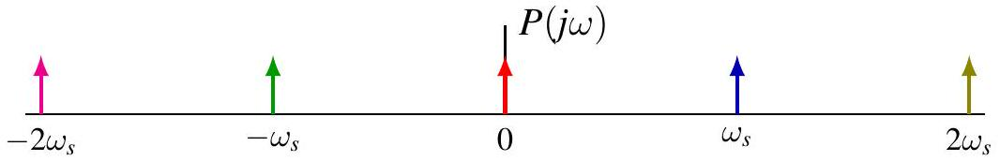

## 混叠（当输入频率高于奈奎斯特频率时）

当 $\omega_0 > \omega_s/2$ 时，发生混叠，重建信号频率变为 $\omega_s - \omega_0$，相位反转。

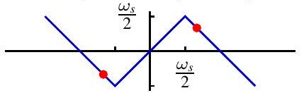
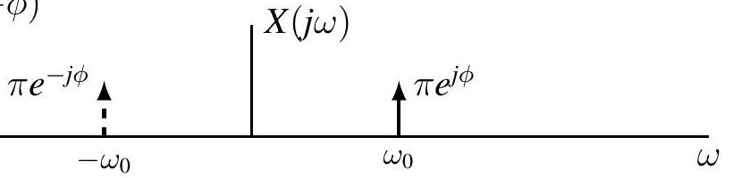

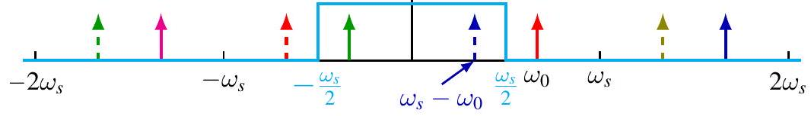

## 混叠示例

$x(t)=\cos(5\pi t/3)$ 采样后变为 $\cos(\pi n/3)$，重建后得到 $\cos(\pi t/3)$。

电影中车轮有时看起来慢速旋转甚至反向，就是混叠现象。

## 混叠边界情况（$\omega_0 = \omega_s/2$）

重建信号幅度减半：$x_r(t)=\cos\phi \cdot \cos(\omega_0 t)$

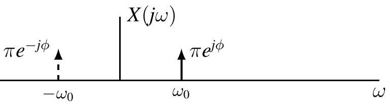
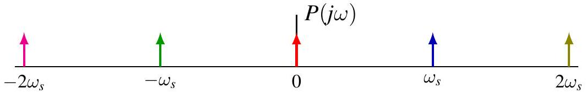
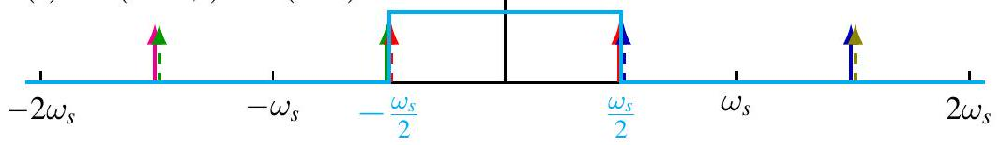

## 混叠对复杂信号的影响

混叠不仅影响单一频率，也会使复杂信号的频谱发生折叠。

## 采样率越低，混叠越严重

## 抗混叠滤波器

在采样前，用低通滤波器滤除高于 $\omega_s/2$ 的频率成分，可有效防止混叠。

## 抗混叠滤波器（实际应用）

## DTFT 的卷积性质

$$
(x * h)[n] \stackrel{\mathcal{F}}{\longleftrightarrow} X(e^{j\omega}) H(e^{j\omega})
$$

**证明**（已完整）：
$$
\mathcal{F}\{x*h\}(e^{j\omega})=\sum_n (x*h)[n]e^{-j\omega n}=X(e^{j\omega})H(e^{j\omega})
$$

## LTI 系统的频率响应

LTI 系统可由冲激响应 $h[n]$ 完全表征，也可由频率响应 $H(e^{j\omega})$ 表征（当其存在时）。

对于 BIBO 稳定系统，$h[n]\in\ell_1$。

利用卷积性质，可在频域中高效计算系统输出：
$$
Y(e^{j\omega})=H(e^{j\omega})X(e^{j\omega})
$$

## 示例1：两个指数信号

$h[n]=a^n u[n]$，$x[n]=b^n u[n]$（$|a|<1,|b|<1$）

使用 DTFT 求解输出 $y[n]$，包括 $a=b$ 时的特殊情况（利用微分性质）。

## 示例2：余弦信号输入

$x[n]=\cos(\omega_0 n)$，系统频率响应 $H(e^{j\omega})=1/(1-a e^{-j\omega})$

输出为幅度和相位调整后的同频率余弦信号。

## 示例：理想带阻滤波器

（原图片及说明完整保留）

## DTFT 的乘积性质

$$
x[n]y[n] \stackrel{\mathcal{F}}{\longleftrightarrow} \frac{1}{2\pi} X \circledast Y = \frac{1}{2\pi}\int_{2\pi} X(e^{j\theta})Y(e^{j(\omega-\theta)})d\theta
$$

**证明**（利用逆 DTFT 积分表达式，已完整给出）。

## 示例：两个sinc函数相乘

$x_1[n]=\sin(3\pi n/4)/(\pi n)$，$x_2[n]=\sin(\pi n/2)/(\pi n)$

通过周期卷积计算乘积信号的 DTFT（多张频谱图完整）。

## 示例：离散时间调制

$y[n]=x[n]\cos(\omega_c n)$

无重叠条件：$\omega_c > \omega_M$ 且 $\omega_c + \omega_M < \pi$

## 示例：离散时间解调

$z[n]=y[n]\cos(\omega_c n)$，再通过合适截止频率的低通滤波恢复原始信号。

## 线性常系数差分方程描述的系统

差分方程：
$$
\sum_{k=0}^N a_k y[n-k] = \sum_{k=0}^M b_k x[n-k]
$$

频率响应：
$$
H(e^{j\omega})=\frac{\sum b_k e^{-j\omega k}}{\sum a_k e^{-j\omega k}}
$$

两种求法：特征函数代入法 或 直接对差分方程两边取 DTFT。

## 示例：具体二阶系统

$y[n] - (3/4)y[n-1] + (1/8)y[n-2] = 2x[n]$

求出 $H(e^{j\omega})$，通过部分分式展开得到 $h[n]$。

## 示例：求零状态响应

输入 $x[n]=(1/4)^n u[n]$，使用部分分式展开求 $y[n]$（含重根情况）。

## 部分分式展开方法（离散时间特有）

用 $z$ 替换 $e^{-j\omega}$，求留数。对于重根，使用导数法求系数。

## 逆 DTFT 常用变换对（含重极点）

$$
\binom{n+m-1}{n} a^n u[n] \stackrel{\mathcal{F}}{\longleftrightarrow} \frac{1}{(1-a e^{-j\omega})^m},\quad |a|<1
$$

## 离散时间信号的冲激列采样

$p[n]=\sum \delta[n-kN]$

采样信号 $x_p[n]=x[n]p[n]$

频谱：
$$
X_p(e^{j\omega})=\frac{1}{N}\sum_{k=0}^{N-1} X(e^{j(\omega - k\cdot 2\pi/N)})
$$

（两种视角：周期延拓与有限复制，均有对应图示）

## 离散时间采样定理

带限 DT 信号（$X(e^{j\omega})=0$ 当 $\omega_M < |\omega|\leq\pi$），若 $\omega_s=2\pi/N > 2\omega_M$，则可由子序列 $x[kN]$ 唯一恢复。

重建使用增益为 $N$ 的低通滤波器 + sinc 插值。

## 抽取（Decimation）

$x_b[n]=x[nN]$

频域关系：$X_b(e^{j\omega})=X_p(e^{j\omega/N})$（频谱拉伸）

## 连续时间信号的离散时间处理

整体流程：C/D（模数转换）→ 离散时间处理 → D/C（数模转换）

优点：数字设备灵活性高、抗噪声能力强。

理想假设：无量化、理想冲激采样、理想重建。

## 模数转换（C/D）

时域与频域关系：
$$
X_p(j\omega)=X_d(e^{j\omega T})
$$

## 数模转换（D/C）

反向过程，低通滤波器截止在 $\omega_s/2$。

## 整体频率响应

$$
H_c(j\omega)=\begin{cases}H_d(e^{j\omega T}) & |\omega|<\omega_s/2 \\ 0 & \text{其他}\end{cases}
$$

## 示例：数字微分器

频率响应相位与幅度特性（原图完整）。

## 作业

（原文件作业部分保留）

---

<section style="min-height: 100vh; display: flex; flex-direction: column; justify-content: center; align-items: center; text-align: center;">
  

    <h1>第五章   离散时间傅里叶变换   完</h1>
  

</section>