## 目录 {#toc0}

- [**1. 引言**](#sec81)
- [2. 用信号样本表示连续时间信号-采样定理](#sec82)
- [3. 利用内插由样本重建信号](#sec83)
- [4. 欠采样](#sec84)
- [5. 连续时间信号的离散时间处理](#sec85)
- [6. 离散时间信号采样](#sec86)

# 引言 {#sec81}

## 连续时间信号的采样

**采样**：在某些离散的时间点上提取连续时间信号值的过程称为采样。

采样将连续时间信号转换为离散时间信号。$T=$ 采样周期，均匀采样是最常见的方式。

:::: {.columns style="text-align: center;"}

::: {.column width="50%"}

**连续时间信号**  ：

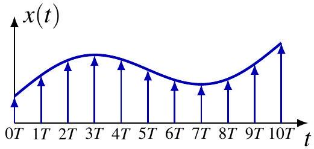{width="40%"}
 
:::

::: {.column width="50%"}

**离散时间信号**  ： 

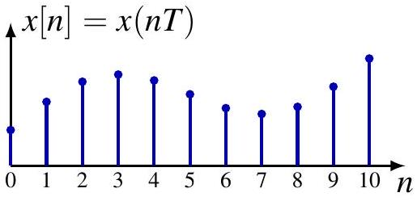{width="40%"}

:::

::::

 
采样允许使用数字电子设备对连续时间信号进行处理、记录、传输、存储和检索。

- 医学成像
- 雷达、通信系统
- 计算机控制系统
- 消费电子：MP3、数字相机、打印机等应用
<!-- $$\text{物理世界} \xleftrightarrow[\text{重建}]{\text{采样}} \text{数字世界}$$ -->

$$\huge \text{物理世界} \xrightleftharpoons[\text{重建 }]{\text{采样 }} \text{数字世界}$$

## 连续时间信号的采样

采样会丢失信息，不同信号可能产生相同的采样序列。

- $x_1(t)=\cos(\pi t/3)$ 与 $x_2(t)=\cos(7\pi t/3)$ 是不同的信号  
- 但采样后得到完全相同的序列：$x_1[n]=\cos(\pi n/3)=x_2[n]=\cos(7\pi n/3)$  

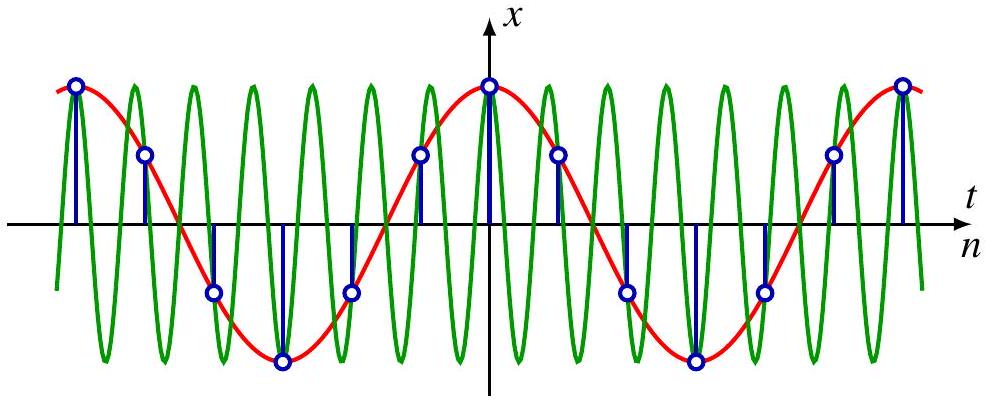

**关键问题**：

- 在什么条件下，一个连续时间信号可以用它的离散时间样本来代替而不致丢失原有的信息。
  
- 如何从连续时间信号的离散时间样本不失真地恢复成原来的连续时间信号。

- 如何对一个连续时间信号进行离散时间处理。

- 对离散时间信号如何进行采样、抽取，及内插。

## 连续时间信号的采样

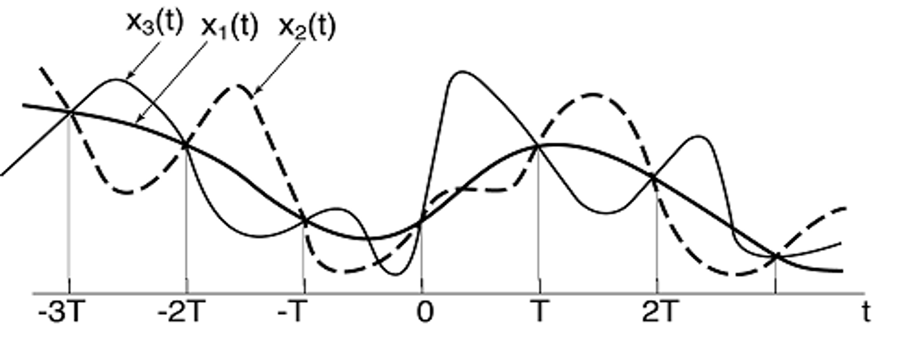

::: {.callout-caution }

需要注意的是：

- 在没有任何条件限制的情况下，从连续时间信号采样所得到的样本序列不能唯一地代表原来的连续时间信号。

- 此外，对同一个连续时间信号，当采样间隔不同时也会 得到不同的样本序列。

:::

## 目录 {#toc1}

- [1. 引言](#sec81)
- [**2. 用信号样本表示连续时间信号-采样定理**](#sec82)
- [3. 利用内插由样本重建信号](#sec83)
- [4. 欠采样](#sec84)
- [5. 连续时间信号的离散时间处理](#sec85)
- [6. 离散时间信号采样](#sec86)

# 用信号样本表示连续时间信号-采样定理 {#sec82}

## 冲激串采样（时域）

:::: {.columns style="text-align: center;"}

::: {.column width="35%"}

 
**连续时间信号** $x(t)$  

 
 

**冲激串**  
$$
p(t)=\sum_{n=-\infty}^{\infty} \delta(t-nT)
$$

 
 
**采样信号**  
$$
x_p(t)=x(t)p(t)=\sum_{n=-\infty}^{\infty} x(nT)\delta(t-nT)
$$

:::

::: {.column width="65%"}
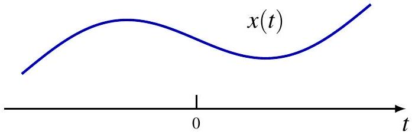

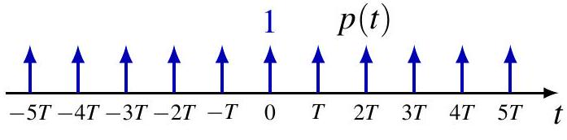

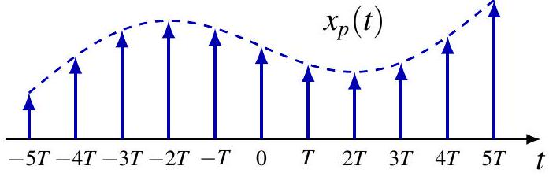
:::
::::

## 冲激串采样（频域）

:::: {.columns style="text-align: center;"}

::: {.column width="35%"}

 
 
 
**连续时间信号频谱** $X(j\omega)$  

 
 
 
**冲激串频谱**  
$$
P(j\omega)=\omega_s \sum_{k=-\infty}^{\infty} \delta(\omega-k\omega_s)
$$

 
 

**采样信号频谱**  
$$
X_p(j\omega)=\frac{1}{2\pi}(X*P)(\omega)=\frac{1}{T}\sum_{k=-\infty}^{\infty} X(j(\omega-k\omega_s))
$$

:::

::: {.column width="65%"}

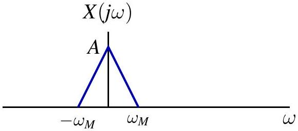

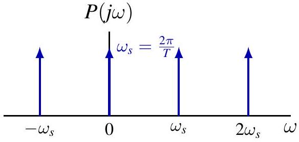

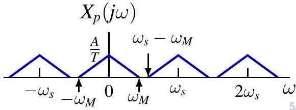
:::
::::

## 冲激列采样（频域）——带限信号

:::: {.columns style="text-align: left;"}

::: {.column width="35%"}

 
 
带限连续时间信号：$X(j\omega)=0$ 
 
当 $|\omega|>\omega_M$ 时  

 
 
 
**情况1**：$\omega_s > 2\omega_M$
 
频谱无重叠
 
——**可以通过低通滤波恢复原始频谱**

 
 
 
**情况2**：$\omega_s < 2\omega_M$
 
出现频谱重叠(即混叠）

 
——**无法恢复原始信号**

:::

::: {.column width="35%"}

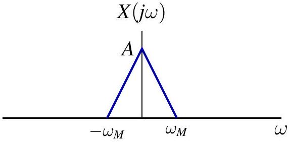

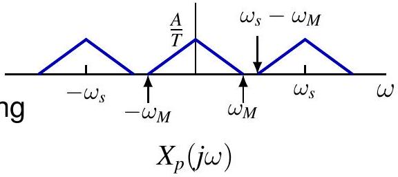

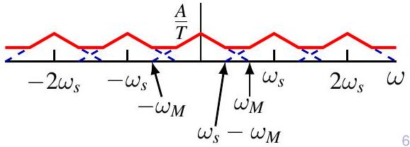

采样角频率 $\omega_s=2\pi/T$

:::

::: {.column width="30%"}
#### 1. 采样信号的频谱结构
采样信号的频谱 $X_s(j\omega)$ 由原信号频谱 $X(j\omega)$ 的**无限次频移**组成：

- **幅值：** 变为原频谱的 $\frac{1}{T_s}$

- **频移量：** 偏移量为采样角频率的整数倍 $n\omega_s$

---

#### 2. 无混叠条件 (Nyquist Criterion)

- 各相邻频谱**不会重叠**。
  
- 可以利用理想低通滤波器从 $X_s(j\omega)$ 中完整恢复原信号频谱 $X(j\omega)$。

---

#### 3. 频谱混叠 (Aliasing)

- 频移后的相邻频谱会**互相重叠**。
  
- 这种重叠导致原信号的频谱信息被破坏，**无法恢复**原信号。
:::
::::

## 采样定理 （Nyquist-Shannon Sampling Theorem）

若连续时间信号 $x(t)$ 是带限的（其频谱 $X(j\omega)=0$ 当 $|\omega|>\omega_M$），且采样满足

$$
\omega_s \triangleq \frac{2\pi}{T} > 2\omega_M
$$

（其中 $2\omega_M$ 称为**奈奎斯特率**），则该信号可由其采样序列 $x(nT),\ n\in\mathbb{Z}$ 唯一确定。

当信号满足采样定理的条件时，可以研究如何从采样信号恢复原信号
 
**重建步骤**：
 
1. 构造冲激采样信号 $$x_p(t)=\sum_{n=-\infty}^{\infty} x(nT)\delta(t-nT)$$  
   
2. 通过增益为 $T$、截止频率 $\omega_c\in(\omega_M, \omega_s-\omega_M)$ 的理想低通滤波器  
   $$
   H(j\omega)=T[u(\omega+\omega_c)-u(\omega-\omega_c)]
   $$
3. 滤波器输出 $x_r(t)$ 即为原始信号 $x(t)$

## 频域中的重建

:::: {.columns style="text-align: left;"}

::: {.column width="45%"}
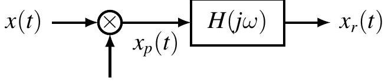
 
 
 
 

**奈奎斯特率(Nyquist Rate)**：

指为了避免信号混叠，**最低允许**的采样频率：
$$\omega_s = 2\omega_M$$

- 奈奎斯特频率：$\omega_M$

 
 
- 低通滤波器：
  
  增益 $T$
  
  截止频率满足 $$\omega_M < \omega_c < \omega_s - \omega_M$$
:::

::: {.column width="55%"}

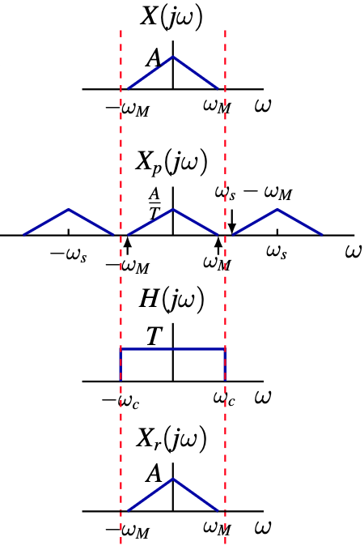

:::
::::

## 时域中的重建

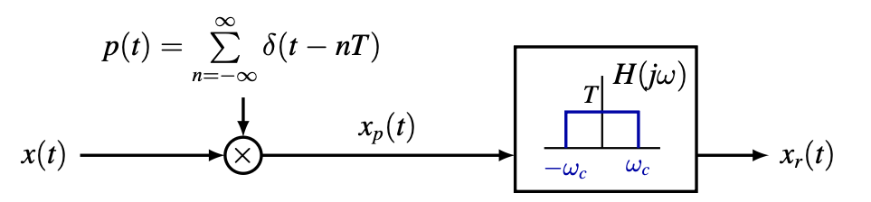

低通滤波器的冲激响应：
$$
h(t)=\frac{T\sin(\omega_c t)}{\pi t}
$$

重建信号：
$$
x_r(t)=\sum_{n=-\infty}^{\infty} x(nT)\frac{T\sin(\omega_c(t-nT))}{\pi(t-nT)}
$$

## 时域中的重建（$\omega_c=\omega_s/2$）

{fig-align="center"}

$\omega_c=\frac{\omega_s}{2}=\frac{\pi}{T}$

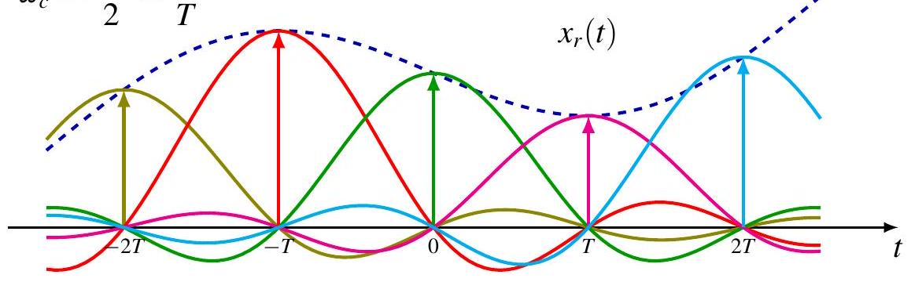{fig-align="center"}

## 时域中的重建（$\omega_c=\omega_s/2$）

当截止频率取 $\omega_c=\omega_s/2=\pi/T$ 时，得到 **Whittaker-Shannon 插值公式**：

$$
x_r(t)=\sum_{n=-\infty}^{\infty} x(nT)\operatorname{sinc}\left(\frac{t-nT}{T}\right)
$$

其中 $\operatorname{sinc}(t)=\frac{\sin(\pi t)}{\pi t}$

由于 $\text{sinc}$ 函数的傅里叶变换关系如下：

$$
\text{sinc} \left( \frac{t - nT}{T} \right) \xleftrightarrow{\mathcal{F}} T e^{-jnT\omega} \left[ u\left( \omega + \frac{\pi}{T} \right) - u\left( \omega - \frac{\pi}{T} \right) \right]
$$

根据 **Parseval 等式**（或乘法性质），我们可以推导出：

$$
\int_{\mathbb{R}} \text{sinc} \left( \frac{t - nT}{T} \right) \text{sinc} \left( \frac{t - mT}{T} \right) dt = \frac{T^2}{2\pi} \int_{-\frac{\pi}{T}}^{\frac{\pi}{T}} e^{j(m-n)T\omega} d\omega = T \delta[n-m]
$$

**结论**

上述推导表明，**Whittaker-Shannon 公式**（采样定理插值公式）实际上是一个**正交展开**。

## 时域中的重建（其他截止频率示例）

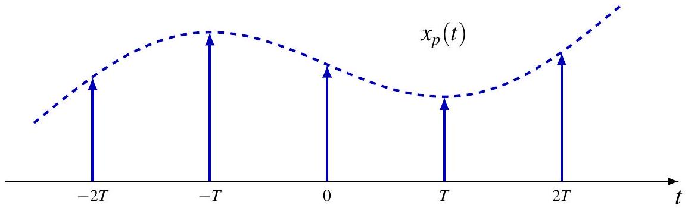  
$\omega_c=\omega_s/4=\pi/(2T) > \omega_M$

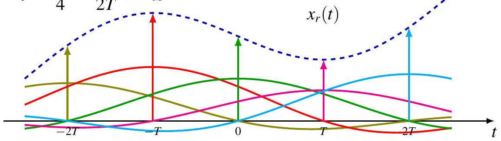

## 时域中的重建（其他截止频率示例）

  
$\omega_c=3\omega_s/5 < \omega_s - \omega_M$

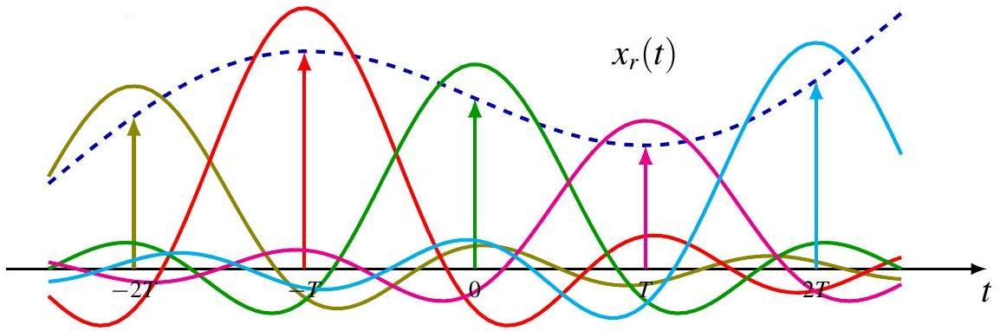

## 零阶保持（Zero-Order Hold）

::: {.callout-important}
### 从理想走向现实
之前采样使用了理想的冲激采样串，但实际 ADC 还需要面对有限采样带宽等问题。
:::
**采样保持电路 (S/H Circuit)**
在物理实现中，采样是通过开关对电容充电完成的：

*   **有限采样带宽：** 采样开关和电容构成低通滤波器，限制了捕捉快速变化信号的能力。
  
*   **保持阶梯：** 采样后的电压必须保持足够稳定，直到量化器完成 A/D 转换。

:::: {.columns style="text-align: left;"}

::: {.column width="50%"}
{width="90%"}

:::
::: {.column width="50%"}
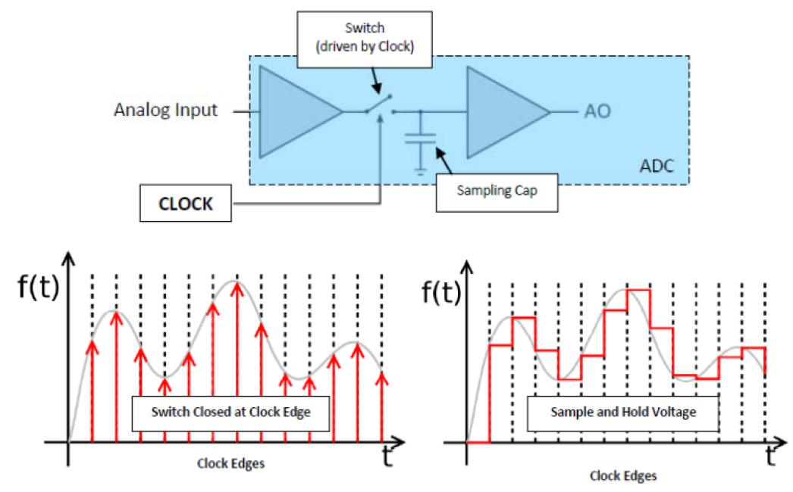{width="90%"}
:::
::::

## 零阶保持（Zero-Order Hold）

在一个给定的瞬时对输入信号采样，并保持这一样本值直到下一个样本被采到为止。

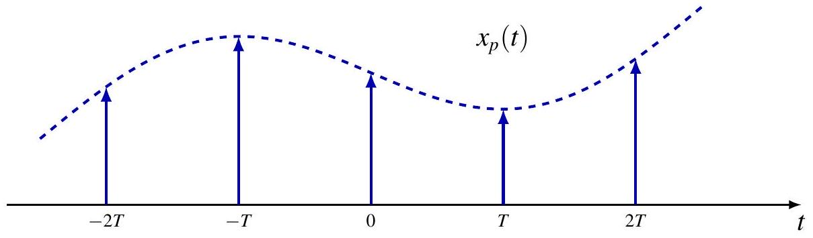

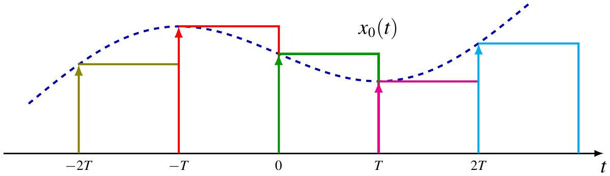

信号的样本经零阶保持后，所得到的信号是一个阶梯形信号。

## 零阶保持（Zero-Order Hold）

零阶保持采样在原理上可以用冲激串采样，再级联一个零阶保持系统来实现。

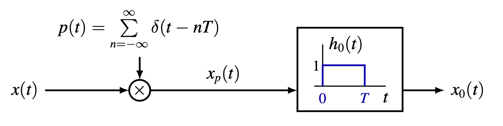{width="60%"}

重建信号：
$$
x_0(t)=\sum_{n=-\infty}^{\infty} x(nT) h_0(t-nT)
$$

:::: {.columns style="text-align: left;"}

::: {.column width="45%"}
零阶保持滤波器频率响应：
$$
H_0(j\omega)=e^{-j\omega T/2} \frac{2\sin(\omega T/2)}{\omega}
$$
为了从$x_0(t)$能恢复$x(t)$，就要求零阶保持后再级联一个系统。

:::
::: {.column width="55%"}
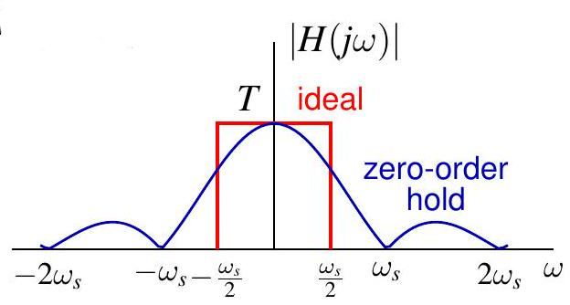
:::
::::

## 零阶保持（Zero-Order Hold）

:::: {.columns style="text-align: left;"}

::: {.column width="55%"}
若要求级联后的总响应满足：
$$H_0(j\omega)H_r(j\omega) = \begin{cases} T, & |\omega| < \omega_c \\ 0, & |\omega| > \omega_c \end{cases}$$
其中截断频率满足：$\omega_M < \omega_c < \omega_s - \omega_M$。
:::

::: {.column width="45%"}
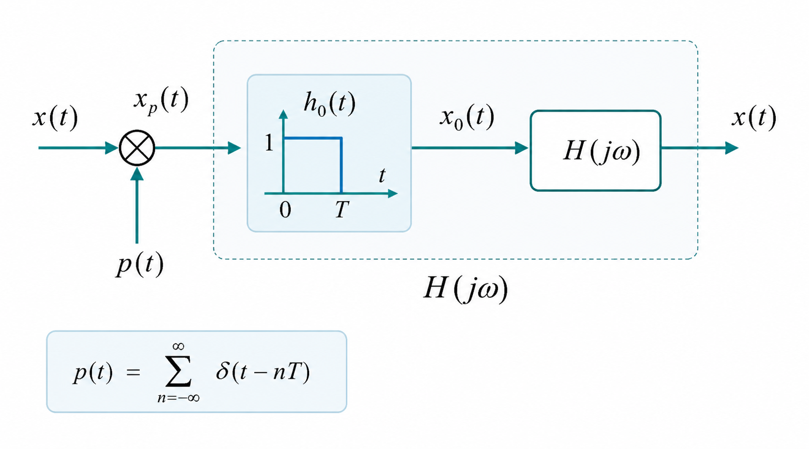{width="85%"}
:::
::::

已知零阶保持器的频率响应（含线性相位滞后）：
$$H_0(j\omega) = \frac{2\sin\frac{\omega T}{2}}{\omega} e^{-j\frac{\omega T}{2}}$$

则所需的**重建滤波器 $H_r(j\omega)$** 为：
$$H_r(j\omega) = \frac{H(j\omega)}{\frac{2\sin(\omega T/2)}{\omega}} \cdot e^{j\frac{\omega T}{2}}$$

## 零阶保持（Zero-Order Hold）

### 2. 频率特性分析图解

以 $H(j\omega)$ 表示增益为 $T$ 的理想低通滤波器特性：

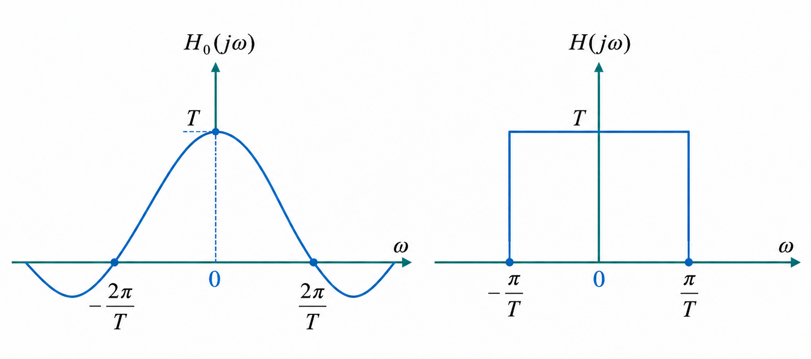{width="35%" fig-align="center"}

当取 $\omega_c = \frac{1}{2}\omega_s$ 时，补偿滤波器的特性如下：

:::: {.columns}

::: {.column width="50%"}
**幅度特性 $|H_r(j\omega)|$**
为了补偿衰减，补偿滤波器的增益在截止频率附近**向上弯曲（翘起）**。
:::

::: {.column width="50%"}
**相位特性 $\angle H_r(j\omega)$**
为了抵消 $H_0(j\omega)$ 带来的 $T/2$ 时间滞后，补偿器需提供一个**超前的线性相位**。
:::

::::
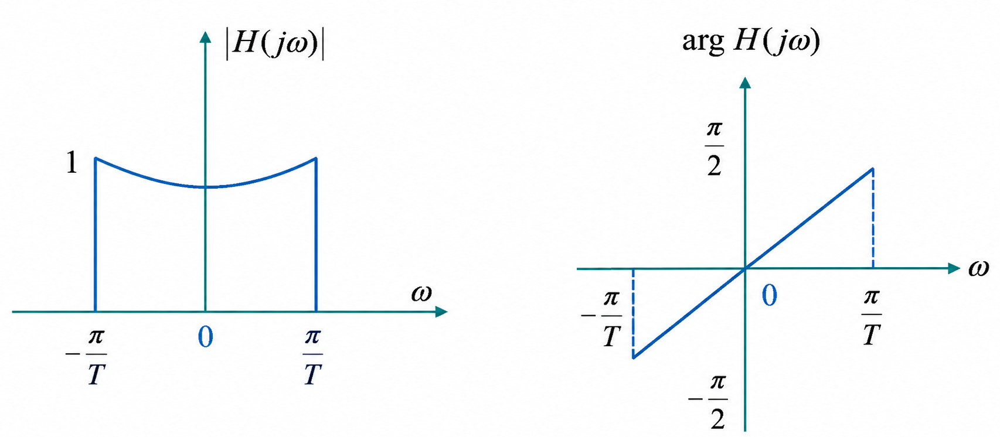{width="35%" fig-align="center"}

## 目录 {#toc2}

- [1. 引言](#sec81)
- [2. 用信号样本表示连续时间信号-采样定理](#sec82)
- [**3. 利用内插由样本重建信号**](#sec83)
- [4. 欠采样](#sec84)
- [5. 连续时间信号的离散时间处理](#sec85)
- [6. 离散时间信号采样](#sec86)

# 利用内插由样本重建信号 {#sec83}

## 典型插值方法

**内插**：由样本值重建某一函数的过程。

:::: {.columns style="text-align: center;"}

::: {.column width="50%"}

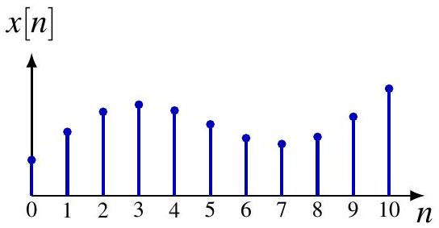
:::

::: {.column width="50%"}

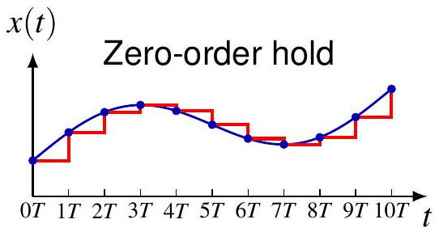

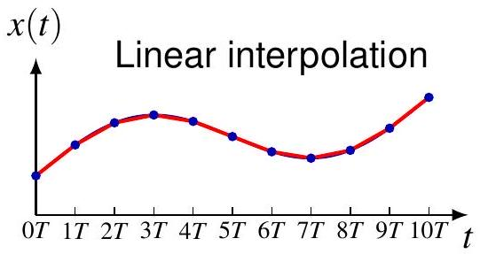

:::
::::

## 线性插值（First-Order Hold）

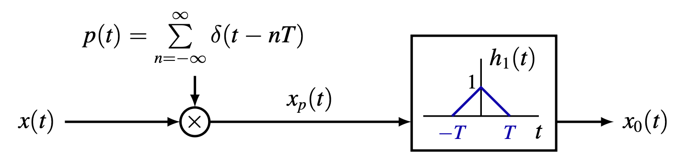

重建信号：
$$
x_1(t)=\sum_{n=-\infty}^{\infty} x(nT) h_1(t-nT)
$$

:::: {.columns style="text-align: left;"}

::: {.column width="45%"}
一阶保持滤波器频率响应：
$$
H_1(j\omega)=\frac{1}{T}\left[\frac{\sin(\omega T/2)}{\omega/2}\right]^2
$$

:::
::: {.column width="55%"}
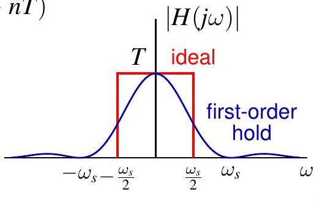
:::
::::

## 线性插值（First-Order Hold）

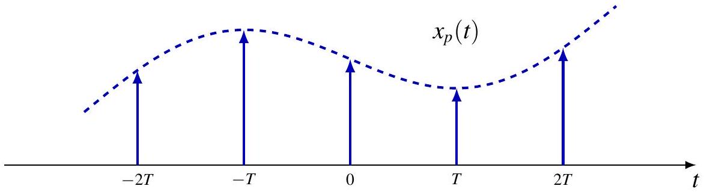

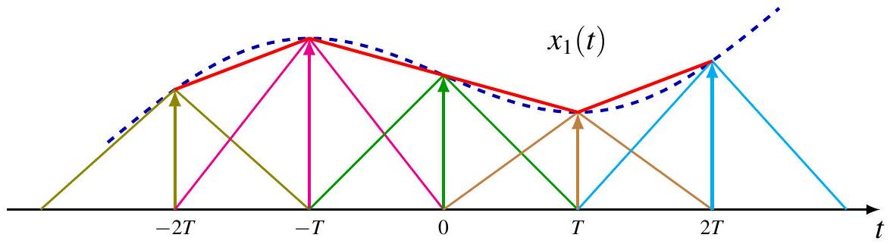

## 目录 {#toc3}

- [1. 引言](#sec81)
- [2. 用信号样本表示连续时间信号-采样定理](#sec82)
- [3. 利用内插由样本重建信号](#sec83)
- [**4. 欠采样**](#sec84)
- [5. 连续时间信号的离散时间处理](#sec85)
- [6. 离散时间信号采样](#sec86)

# 欠采样:混叠的现象 {#sec84} 

## 混叠（Aliasing）

:::: {.columns style="text-align: left;"}

::: {.column width="33%"}
混叠会使频率发生“折叠”。

:::
::: {.column width="34%"}

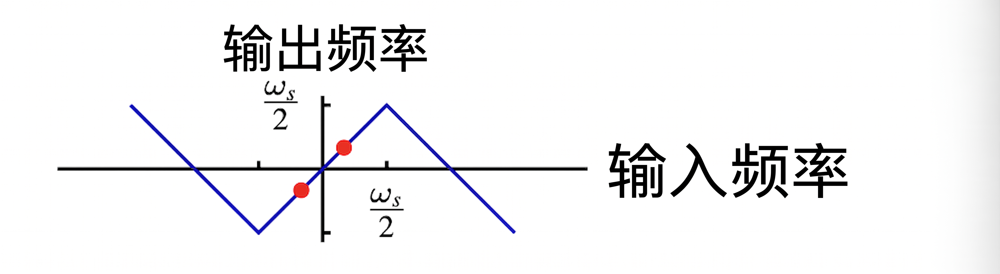

:::
::: {.column width="33%"}

:::
::::

$x(t)=\cos(\omega_0 t + \phi)$

当 $\omega_0 < \omega_s/2$ 时，无混叠，重建信号与原始信号相同。

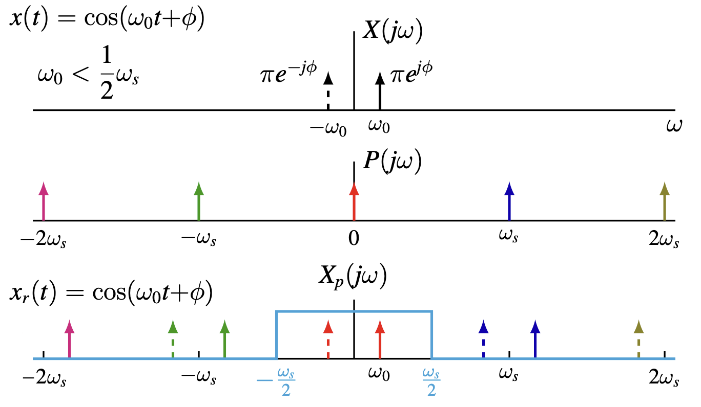{fig-align="center" width="55%"}

<!-- $x_r(t)=\cos{\omega_0 t + \phi}$

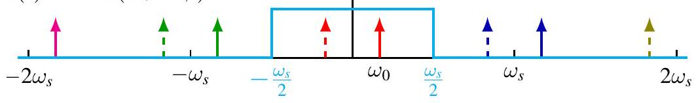{fig-align="center"} -->

## 混叠

:::: {.columns style="text-align: left;"}

::: {.column width="33%"}
混叠会使频率发生“折叠”。

:::
::: {.column width="34%"}

:::
::: {.column width="33%"}

:::
::::

<!-- 当 $\omega_0 > \omega_s/2$ 时，发生混叠，重建信号频率变为 $\omega_s - \omega_0$，相位反转。 -->

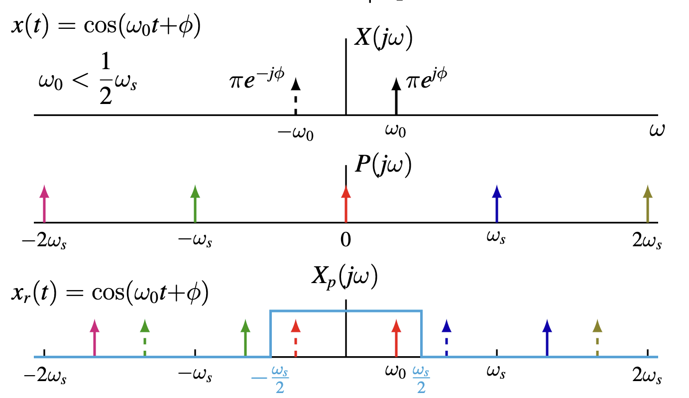{fig-align="center" width="60%"}

## 混叠

:::: {.columns style="text-align: left;"}

::: {.column width="33%"}
混叠会使频率发生“折叠”。

:::
::: {.column width="34%"}

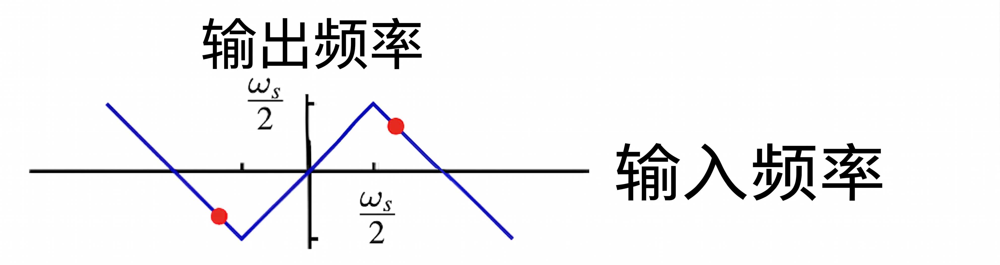

:::
::: {.column width="33%"}

:::
::::

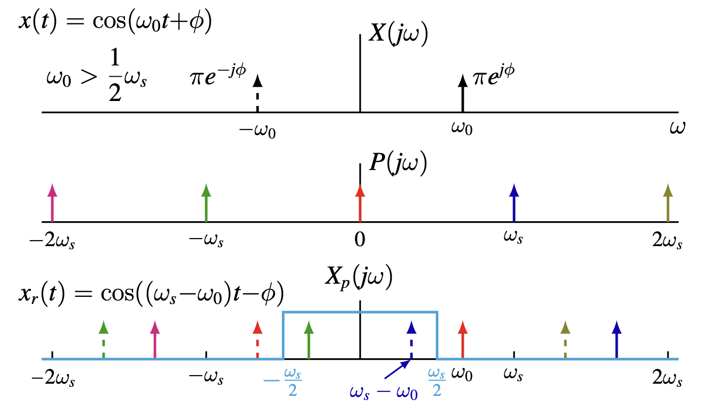{fig-align="center" width="60%"}

## 混叠

:::: {.columns style="text-align: left;"}

::: {.column width="33%"}
混叠会使频率发生“折叠”。

:::
::: {.column width="34%"}

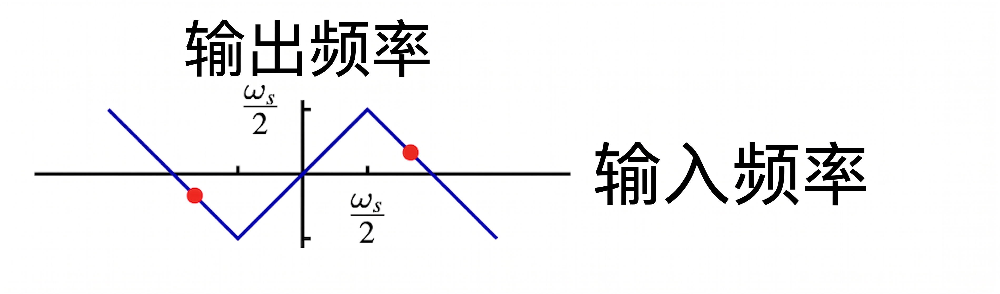

:::
::: {.column width="33%"}

:::
::::

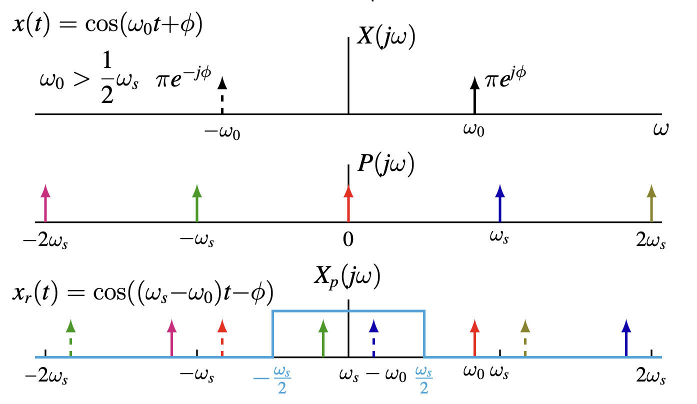{fig-align="center" width="60%"}

## 混叠示例

信号 $x(t) = \cos\left(\frac{5\pi}{3}t\right)$，采样(以$T=1$为周期)后变为$x[n] = \cos\left(\frac{5\pi}{3}n\right)=\cos\left(\frac{\pi}{3}n\right)$

重建后（取$\omega_c=\pi$）得到 $x_r(t)=\cos(\pi t/3)$

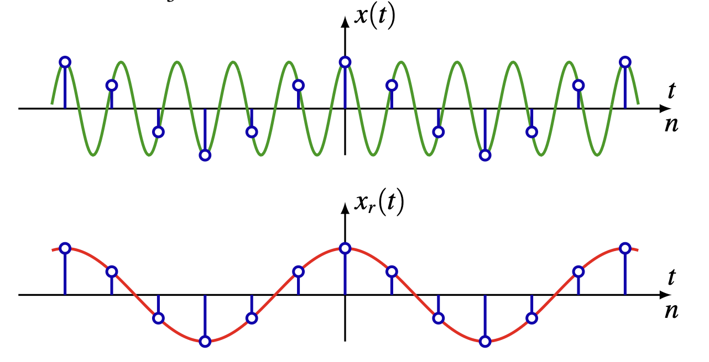{fig-align="center"}

电影中车轮有时看起来慢速旋转甚至反向，就是混叠现象。

## 混叠示例
{fig-align="center"}

## 混叠

混叠边界情况（$\omega_0 = \omega_s/2$）

:::: {.columns style="text-align: left;"}

::: {.column width="33%"}
混叠会使频率发生“折叠”。

:::
::: {.column width="34%"}

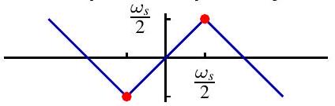

:::
::: {.column width="33%"}

:::
::::

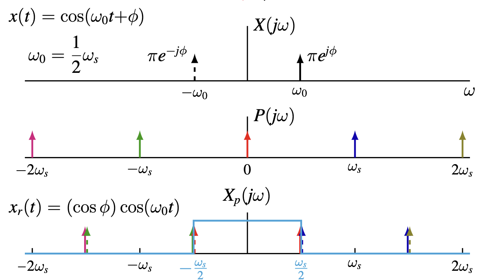{fig-align="center" width="55%"}

重建信号幅度减半：$x_r(t)=\cos\phi \cdot \cos(\omega_0 t)$

## 混叠

对复杂信号的影响：混叠不仅影响单一频率，也会使复杂信号的频谱发生折叠。

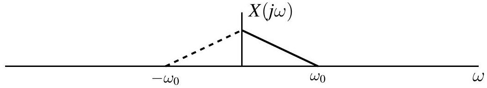

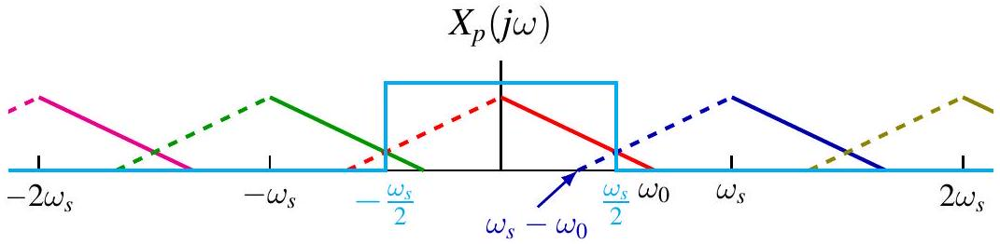

## 混叠

采样率越低，混叠越严重

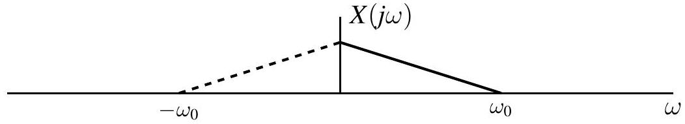
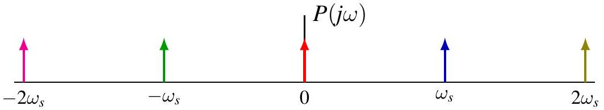
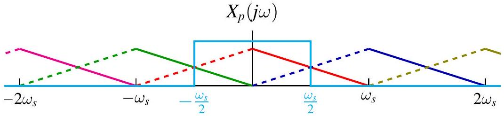

## 抗混叠滤波器

在采样前，用低通滤波器滤除高于 $\omega_s/2$ 的频率成分，可有效防止混叠。

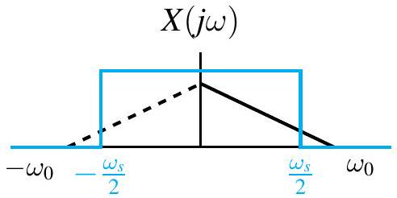
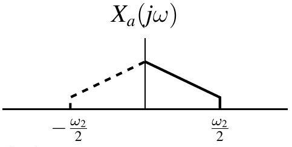
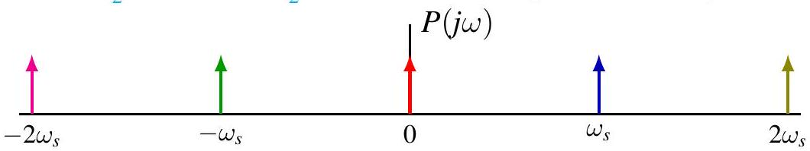
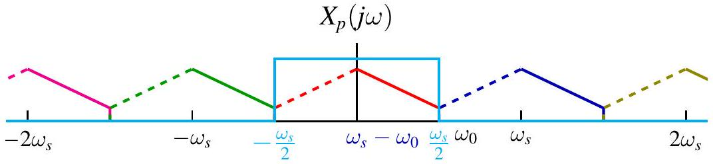

## 抗混叠滤波器（实际应用）

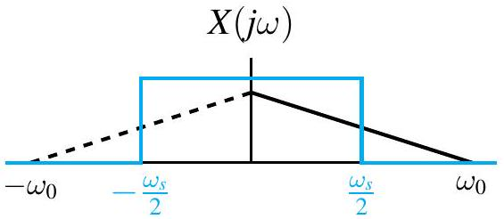
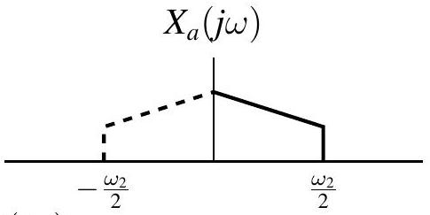
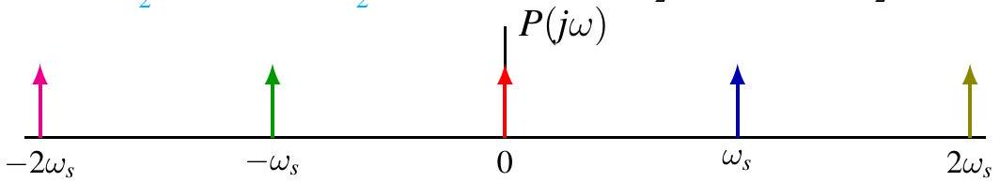
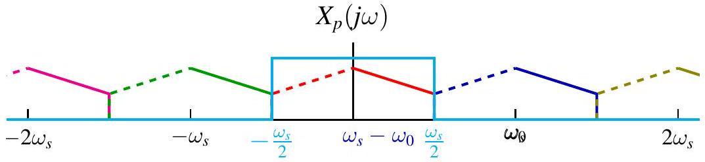

<!-- ## DTFT 的卷积性质

$$
(x * h)[n] \stackrel{\mathcal{F}}{\longleftrightarrow} X(e^{j\omega}) H(e^{j\omega})
$$

**证明**（已完整）：
$$
\mathcal{F}\{x*h\}(e^{j\omega})=\sum_n (x*h)[n]e^{-j\omega n}=X(e^{j\omega})H(e^{j\omega})
$$

## LTI 系统的频率响应

LTI 系统可由冲激响应 $h[n]$ 完全表征，也可由频率响应 $H(e^{j\omega})$ 表征（当其存在时）。

对于 BIBO 稳定系统，$h[n]\in\ell_1$。

利用卷积性质，可在频域中高效计算系统输出：
$$
Y(e^{j\omega})=H(e^{j\omega})X(e^{j\omega})
$$

## 示例1：两个指数信号

$h[n]=a^n u[n]$，$x[n]=b^n u[n]$（$|a|<1,|b|<1$）

使用 DTFT 求解输出 $y[n]$，包括 $a=b$ 时的特殊情况（利用微分性质）。

## 示例2：余弦信号输入

$x[n]=\cos(\omega_0 n)$，系统频率响应 $H(e^{j\omega})=1/(1-a e^{-j\omega})$

输出为幅度和相位调整后的同频率余弦信号。

## 示例：理想带阻滤波器

（原图片及说明完整保留）

## DTFT 的乘积性质

$$
x[n]y[n] \stackrel{\mathcal{F}}{\longleftrightarrow} \frac{1}{2\pi} X \circledast Y = \frac{1}{2\pi}\int_{2\pi} X(e^{j\theta})Y(e^{j(\omega-\theta)})d\theta
$$

**证明**（利用逆 DTFT 积分表达式，已完整给出）。

## 示例：两个sinc函数相乘

$x_1[n]=\sin(3\pi n/4)/(\pi n)$，$x_2[n]=\sin(\pi n/2)/(\pi n)$

通过周期卷积计算乘积信号的 DTFT（多张频谱图完整）。

## 示例：离散时间调制

$y[n]=x[n]\cos(\omega_c n)$

无重叠条件：$\omega_c > \omega_M$ 且 $\omega_c + \omega_M < \pi$

## 示例：离散时间解调

$z[n]=y[n]\cos(\omega_c n)$，再通过合适截止频率的低通滤波恢复原始信号。

## 线性常系数差分方程描述的系统

差分方程：
$$
\sum_{k=0}^N a_k y[n-k] = \sum_{k=0}^M b_k x[n-k]
$$

频率响应：
$$
H(e^{j\omega})=\frac{\sum b_k e^{-j\omega k}}{\sum a_k e^{-j\omega k}}
$$

两种求法：特征函数代入法 或 直接对差分方程两边取 DTFT。

## 示例：具体二阶系统

$y[n] - (3/4)y[n-1] + (1/8)y[n-2] = 2x[n]$

求出 $H(e^{j\omega})$，通过部分分式展开得到 $h[n]$。

## 示例：求零状态响应

输入 $x[n]=(1/4)^n u[n]$，使用部分分式展开求 $y[n]$（含重根情况）。

## 部分分式展开方法（离散时间特有）

用 $z$ 替换 $e^{-j\omega}$，求留数。对于重根，使用导数法求系数。

## 逆 DTFT 常用变换对（含重极点）

$$
\binom{n+m-1}{n} a^n u[n] \stackrel{\mathcal{F}}{\longleftrightarrow} \frac{1}{(1-a e^{-j\omega})^m},\quad |a|<1
$$ -->

## 目录 {#toc4}

- [**1. 引言**](#sec81)
- [2. 用信号样本表示连续时间信号-采样定理](#sec82)
- [3. 利用内插由样本重建信号](#sec83)
- [4. 欠采样](#sec84)
- [**5. 连续时间信号的离散时间处理**](#sec85)
- [6. 离散时间信号采样](#sec86)

# 连续时间信号的离散时间处理 {#sec85}

## 连续时间信号的离散时间处理

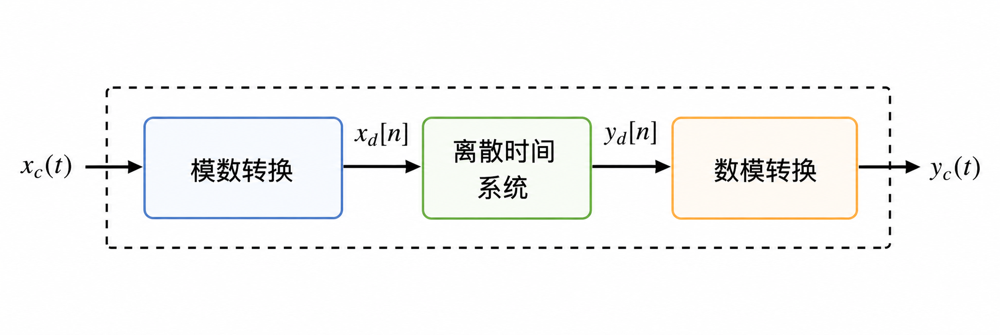{align="center"}

### 离散时间处理的优势

* **数字电子设备的通用性**：可以通过软件算法轻松实现各种复杂的处理逻辑，而无需更改硬件。
* **抗噪性强**：数字信号在传输和存储过程中对环境噪声具有更高的容减能力。

### 实际实现
* **连续/离散（C/D） 转换**：通常由**模数转换器 (ADC)** 实现。
* **离散/连续（D/C） 转换**：通常由**数模转换器 (DAC)** 实现。

## 连续时间信号的离散时间处理

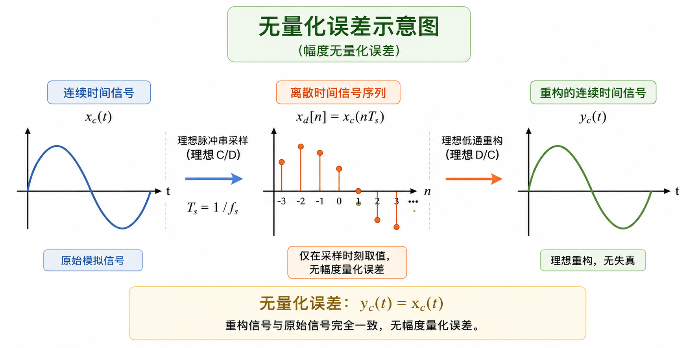{align="center" width="60%"}

:::: {.columns style="text-align: left;"}

::: {.column width="60%"}

### 理论理想化 (Idealization)
为了简化数学分析，我们通常假设：

* **无量化误差**：忽略幅度量化带来的精度损失。
  
* **脉冲串采样**：假设 C/D 过程是通过理想脉冲串采样完成的。
  
* **理想重构**：假设 D/C 过程是通过理想低通滤波器进行的完美还原。
:::

::: {.column width="40%"}
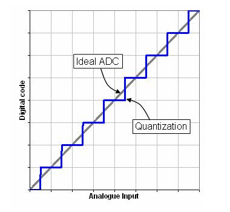{align="center"}
:::
::::

## 模数转换（C/D）

:::: {.columns style="text-align: left;"}

::: {.column width="50%"}

采样假设，在讨论 CT 与 DT 频谱关系前，必须满足：

* **带限信号**：$x_c(t)$ 的频谱 $X_c(j\omega)$ 在 $|\omega| > \omega_M$ 时为零。
* **奈奎斯特准则**：采样频率 $\omega_s = \frac{2\pi}{T} > 2\omega_M$。
* **无混叠**：确保基带频谱在周期延拓时不发生重叠。
:::
::: {.column width="50%"}
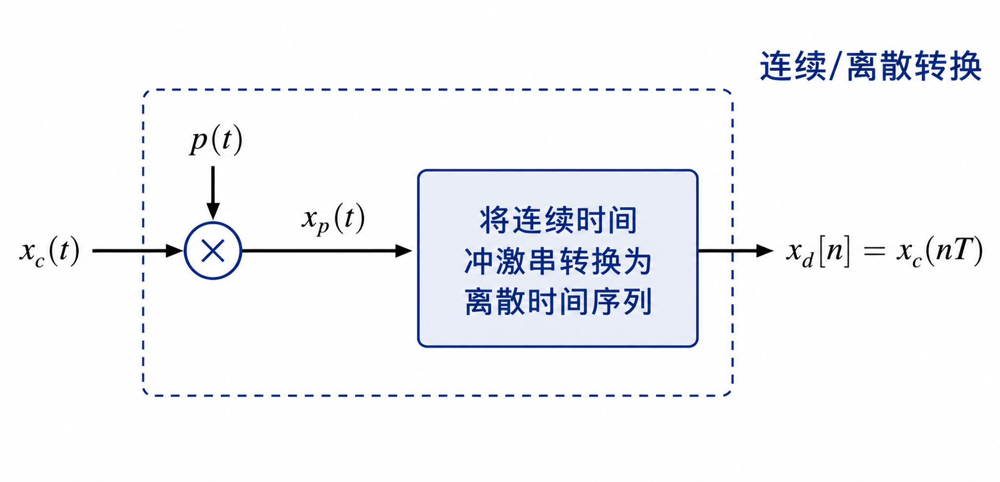{width="75%"}

:::
::::

从冲激串采样信号 $x_p(t)$ 的 CTFT 出发：

$$
\begin{aligned}
X_p(j\omega) &= \mathcal{F} \left\{ \sum_{n=-\infty}^{\infty} x_c(nT)\delta(t-nT) \right\} \\
&= \sum_{n=-\infty}^{\infty} x_c(nT) \mathcal{F} \{ \delta(t-nT) \} \\
&= \sum_{n=-\infty}^{\infty} x_c(nT) e^{-j\omega Tn}= \sum_{n=-\infty}^{\infty} x_d[n] e^{-j\omega T n}=X_d(e^{j\omega T}) 
\end{aligned}
$$

<!-- 引入离散序列 $x_d[n] = x_c(nT)$，对比 **DTFT** 定义：

$$
X_d(e^{j\Omega}) = \sum_{n=-\infty}^{\infty} x_d[n] e^{-j\Omega n}
$$ -->

<!-- ## 模数转换（连续/离散）

由此可见，两者存在恒等关系：
$$\mathbf{X_p(j\omega) = X_d(e^{j\omega T})}$$

时域与频域关系：
$$
X_p(j\omega)=X_d(e^{j\omega T})
$$ -->

## 模数转换（连续/离散）

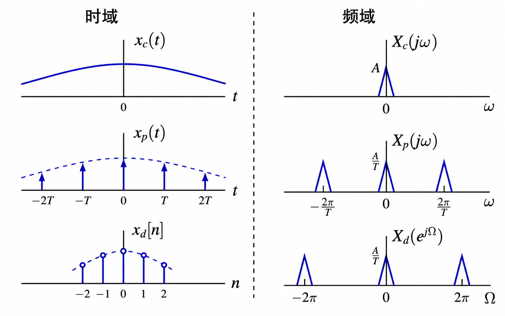{fig-align="center" width="125%"}

## 数模转换（离散/连续）

反向过程，低通滤波器截止在 $\omega_s/2$。

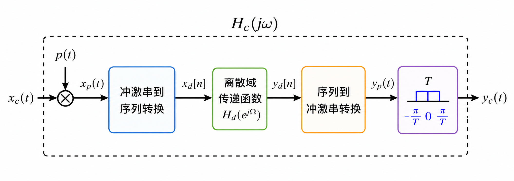{fig-align="center" width="125%"}

1. 
   $$Y_d(e^{j\Omega}) = H_d(e^{j\Omega})X_d(e^{j\Omega})$$

2. 
   $$Y_p(j\omega) = Y_d(e^{j\omega T}) = H_d(e^{j\omega T})X_d(e^{j\omega T}) = H_d(e^{j\omega T})X_p(j\omega)$$

3. 
   $$Y_c(j\omega) = Y_p(j\omega)H_{lp}(j\omega) = H_d(e^{j\omega T})X_p(j\omega)H_{lp}(j\omega) = H_d(e^{j\omega T})X_c(j\omega)$$
4. 
   $$H_c(j\omega) = \begin{cases} H_d(e^{j\omega T}) & |\omega| < \frac{\omega_s}{2} = \frac{\pi}{T} \\ 0, & \text{其他} \end{cases}$$

## 数模转换（离散/连续）

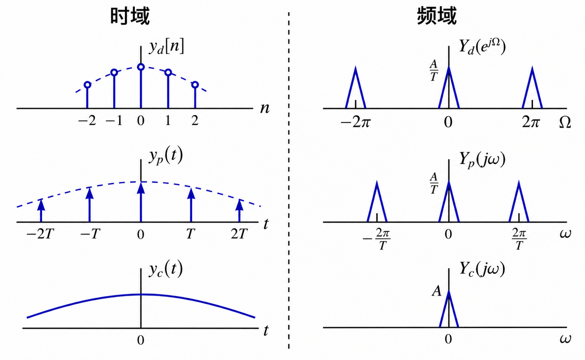

## 整体频率响应

$$
H_c(j\omega)=\begin{cases}H_d(e^{j\omega T}) & |\omega|<\omega_s/2 \\ 0 & \text{其他}\end{cases}
$$

$$\Longrightarrow H_d(e^{j\Omega}) = H_c\left( j\frac{\Omega}{T} \right), \quad |\Omega| < \pi$$

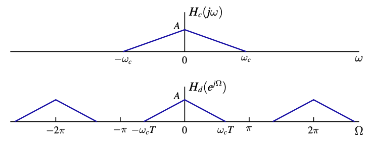

## 示例：数字微分器

频率响应相位与幅度特性。

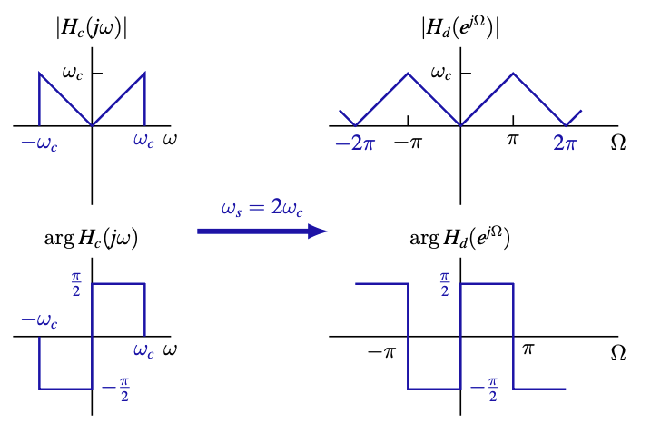

## 目录 {#toc5}

- [**1. 引言**](#sec81)
- [2. 用信号样本表示连续时间信号-采样定理](#sec82)
- [3. 利用内插由样本重建信号](#sec83)
- [4. 欠采样](#sec84)
- [5. 连续时间信号的离散时间处理](#sec85)
- [**6. 离散时间信号采样**](#sec86)

# 离散时间信号采样 {#sec86}

## 离散时间信号的脉冲串采样

:::: {.columns style="text-align: left;"}

::: {.column width="50%"}

 
 
 
 

离散时间信号$x[n]$

 
 
 
 

离散时间脉冲串：$p[n]=\sum \delta[n-kN]$

 
 
 
 

采样信号 $x_p[n]=x[n]p[n]$

:::
::: {.column width="50%"}
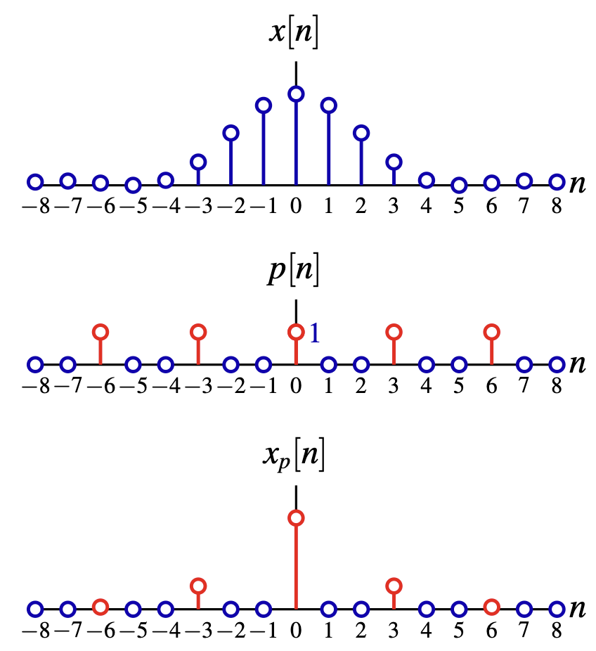
:::
::::

## 离散时间信号的脉冲采样

**脉冲序列的频谱**

离散时间脉冲序列的频谱 $P(e^{j\omega})$ 可以表示为一系列周期性的 $\delta$ 函数：

$$
P(e^{j\omega}) = \omega_s \sum_{k=-\infty}^{\infty} \delta(\omega - k\omega_s), \quad \omega_s = \frac{2\pi}{N}
$$

这里 $\omega_s$ 是采样频率（或频谱间隔），$N$ 是离散脉冲序列的周期。

**采样信号的频谱**

采样信号的频谱 $X_p$ 是原始信号频谱 $X$ 与脉冲序列频谱 $P$ 的**周期卷积**：

$$
X_p = \frac{1}{2\pi} X \circledast P = \frac{1}{2\pi} \tilde{X} * P = \frac{1}{2\pi} X * \tilde{P}
$$

其中：
* $\circledast$ 表示周期卷积。
* $*$ 表示线性卷积。
* $\tilde{X}$ 和 $\tilde{P}$ 分别是 $X$ 和 $P$ 在一个 $2\pi$ 周期内的部分。

**频谱展开形式**

根据上述性质，采样信号的频谱 $X_p(e^{j\omega})$ 可以进一步展开为：

$$
X_p(e^{j\omega}) = \frac{1}{N} \sum_{k=-\infty}^{\infty} \tilde{X}(e^{j(\omega-k\omega_s)}) = \frac{1}{N} \sum_{k=0}^{N-1} X(e^{j(\omega-k\omega_s)})
$$

## 离散时间信号的脉冲串采样

**第一种视角**：在 $k\omega_s$ 处复制 $\tilde{X}$  
 
从数学角度看，采样信号的频谱 $X_p(e^{j\omega})$ 可以视为原始频谱分量 $\tilde{X}$ 在频域内以 $\omega_s$ 为间隔进行的周期性平移与叠加：

$$
X_p(e^{j\omega}) = \frac{1}{N} \sum_{k=-\infty}^{\infty} \tilde{X}(e^{j(\omega-k\omega_s)})
$$

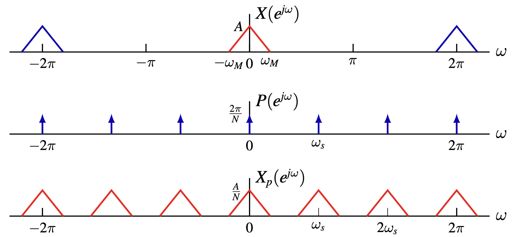{fig-align="center"}

### 物理意义解析

1. **频谱搬移**：公式中的 $(\omega - k\omega_s)$ 项表示将原始频谱 $\tilde{X}$ 的中心从原点搬移到 $k\omega_s$ 处。
2. **周期叠加**：通过对所有整数 $k$ 进行求和，形成了在整个频率轴上周期性变化的频谱。
3. **幅度缩放**：叠加后的频谱整体乘上了系数 $\frac{1}{N}$。

## 离散时间信号的脉冲串采样

**第二种视角**：在 $k\omega_s$ 处复制 $X$，$k = 0, 1, \dots, N-1$  

与第一种视角（无限项求和）不同，第二种视角指出，由于离散时间信号频谱 $X(e^{j\omega})$ 本身就是以 $2\pi$ 为周期的，因此采样后的频谱 $X_p(e^{j\omega})$ 可以通过仅在**一个周期内**进行有限次平移叠加来获得：

$$
X_p(e^{j\omega}) = \frac{1}{N} \sum_{k=0}^{N-1} X(e^{j(\omega-k\omega_s)})
$$

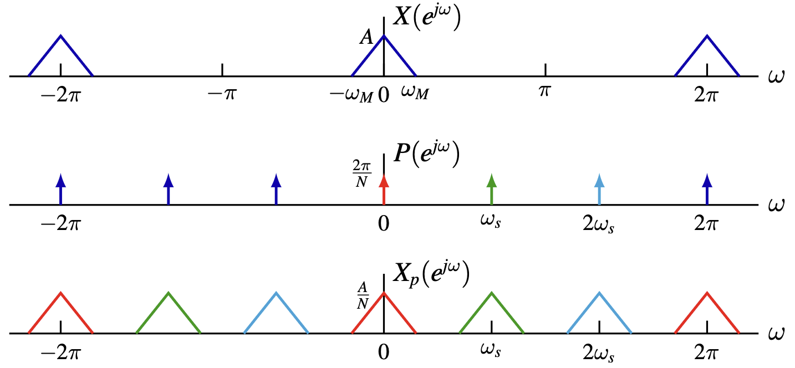{fig-align="center"}

## 离散时间信号的脉冲串采样

### 核心差异与理解

1. **求和范围**：从无限项 $\sum_{k=-\infty}^{\infty}$ 简化为了有限项 $\sum_{k=0}^{N-1}$。
2. **信号定义**：此处使用的是完整的离散频谱 $X$，而不是之前视角的切片分量 $\tilde{X}$。
3. **周期性体现**：该视角充分利用了离散频率域的周期性。因为 $\omega_s = \frac{2\pi}{N}$，所以当 $k$ 超过 $N-1$ 后的项实际上是前 $N$ 项的周期重复。

### 数学背景
这种视角直接对应了离散傅里叶变换（DFT）中频域采样的物理过程，即在 $[0, 2\pi)$ 范围内取 $N$ 个等间距采样点。

> **对比提示**：

> * **视角一**：强调如何通过“切片”原始连续频谱并周期搬移来构造新频谱。

> * **视角二**：强调在已有周期频谱的基础上，通过有限次的平移叠加来描述采样后的效果。

## 离散时间信号的脉冲串采样
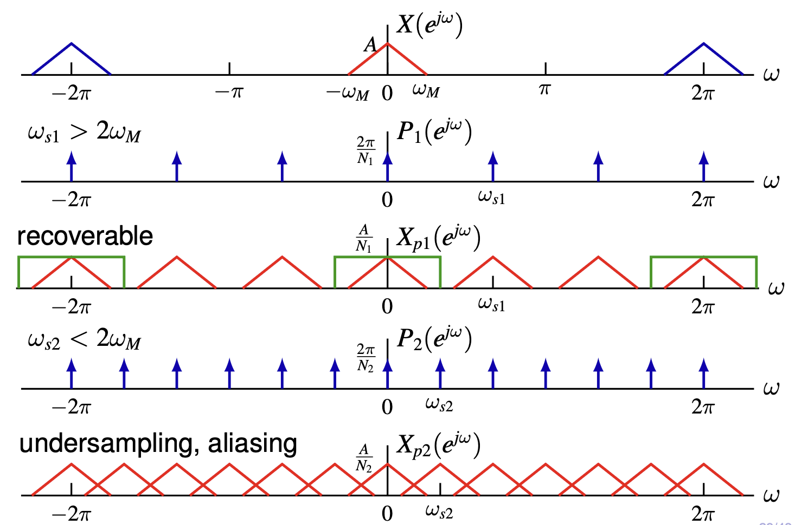{fig-align="center"}

## 离散时间采样定理

对于一个**带限（Band-limited）离散时间信号** $x[n]$，其频谱 $X(e^{j\omega})$ 在 $\omega_M < |\omega| \leq \pi$ 范围内为 0。

如果满足以下条件，则该信号可以由其样本 $x[kN], k \in \mathbb{Z}$ 唯一确定：

$$
\omega_s \triangleq \frac{2\pi}{N} > 2\omega_M
$$

这本质上是离散信号域的奈奎斯特准则，确保了在频域周期搬移时不会发生混叠。

给定样本序列 $\{x[kN] : k \in \mathbb{Z}\}$，原始信号 $x[n]$ 可以通过以下步骤重构：

### 1. 构造脉冲序列 $x_p[n]$
首先构造一个包含样本值的脉冲串：
$$
x_p[n] = \sum_{k=-\infty}^{\infty} x[kN]\delta[n - kN]
$$

## 离散时间采样定理

### 2. 通过低通滤波器
将 $x_p[n]$ 输入一个增益为 $N$、截止频率为 $\omega_c \in (\omega_M, \omega_s - \omega_M)$ 的理想低通滤波器。其频率响应为：
$$
H(e^{j\omega}) = N[u(\omega + \omega_c) - u(\omega - \omega_c)]
$$

### 3. 输出重构信号 $x_r[n]$
输出信号的频谱为 $X_r(e^{j\omega}) = X_p(e^{j\omega})H(e^{j\omega})$。在满足采样定理的条件下，该输出 $x_r[n]$ 与原始信号 $x[n]$ 完全一致。

## 时域重建

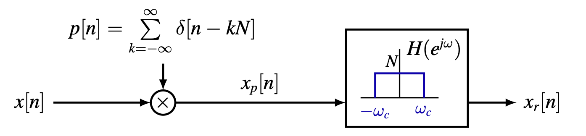{fig-align="center"}

### 1. 低通滤波器的单位脉冲响应 (Impulse response of lowpass filter)

理想低通滤波器 $H(e^{j\omega})$ 在时域对应的单位脉冲响应 $h[n]$ 是一个 $\text{sinc}$ 函数：

$$
h[n] = \frac{N \sin(\omega_c n)}{\pi n}
$$

这里 $N$ 是增益系数，$\omega_c$ 是滤波器的截止频率。在时域中，这个响应表现为以 $n=0$ 为中心的无限长振荡序列。

### 2. 使用 sinc 函数进行带限插值 (Band-limited interpolation)

重构信号 $x[n]$（即 $x_r[n]$）可以通过将采样序列 $x_p[n]$ 与滤波器的单位脉冲响应 $h[n]$ 进行卷积得到。这一过程被称为**带限插值**：

$$
x[n] = x_r[n] = (x_p * h)[n] = \sum_{k=-\infty}^{\infty} x[kN] \frac{N \sin(\omega_c (n - kN))}{\pi (n - kN)}
$$

## 时域重建

### 物理意义解析

* **卷积过程**：该公式表明，重构信号在任意时刻 $n$ 的值，都是由所有采样点 $x[kN]$ 经过 $\text{sinc}$ 函数加权叠加而成的。
* **内插本质**：在采样点 $n=kN$ 处，由于 $\text{sinc}$ 函数的特性，该项贡献为原始样本值，而其他项贡献为零。在非采样点处，$\text{sinc}$ 函数起到了平滑内插的作用。
* **理想还原**：只要满足采样定理，这种基于 $\text{sinc}$ 函数的内插可以完美还原带限信号，不产生任何失真。

> **公式提示**：

> * $\omega_c$ 通常取在 $(\omega_M, \omega_s - \omega_M)$ 之间。

> * 当 $\omega_c = \pi/N$ 且增益为 $N$ 时，这是最常用的标准重构形式。

## 抽取（Decimation）

:::: {.columns style="text-align: left;"}

::: {.column width="35%"}
 
 
 
 
时域信号$x[n]$

 
 
 
 
采样信号:$x_p[n] = \sum_{k=-\infty}^{\infty} x[kN]\delta[n - kN]$
 
 
 
 
抽取后信号：

$x_b[n]=x[nN]$

减少了采样样本量

:::
::: {.column width="65%"}
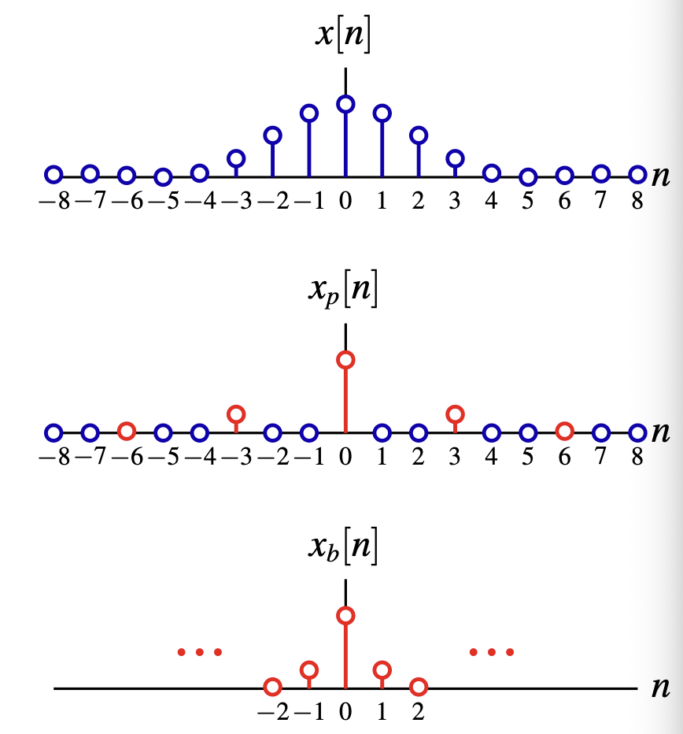{fig-align="center"}
:::
::::

## 抽取

设 $x_b[n]$ 是对原始信号 $x[n]$ 进行因子为 $N$ 的下采样（抽取）后得到的信号，即 $x_b[n] = x[nN]$。

其离散时间傅里叶变换（DTFT） $X_b(e^{j\omega})$ 推导如下：

$$
\begin{aligned}
X_b(e^{j\omega}) &= \sum_{n \in \mathbb{Z}} x_b[n]e^{-j\omega n} \\
&= \sum_{n \in \mathbb{Z}} x[nN]e^{-j\omega n} \\
&= \sum_{k \in N\mathbb{Z}} x[k]e^{-j\omega k/N} \quad (k = nN) \\
&= \sum_{k \in \mathbb{Z}} x_p[k]e^{-j\frac{\omega}{N}k} \quad (x_p[n] = 0 \text{ for } n \in \mathbb{Z} \setminus N\mathbb{Z}) \\
&= X_p(e^{j\omega/N})
\end{aligned}
$$

这里 $x_p[k]$ 是采样序列（在非 $N$ 的倍数处补零的序列）。

 
已知 $X_p(e^{j\omega})$ 的周期为 $2\pi/N$，根据上述关系式 $X_b(e^{j\omega}) = X_p(e^{j\omega/N})$ 可以得出：
* $X_b(e^{j\omega})$ 的周期为 **$2\pi$**。

## 抽取

**无混叠情况下的特性**

如果在采样过程中没有发生混叠（满足采样定理），则具有以下特性：

* **频谱展宽**：$X_b$ 是原始信号频谱 $X$ 在每个周期内的**展宽版本**（Stretched version）。
* **关系区别**：虽然数学形式上 $X_b(e^{j\omega}) = X_p(e^{j\omega/N})$，但需要注意在物理意义和幅度对应上，$X_b(e^{j\omega}) \neq X(e^{j\omega/N})$。

## 抽取

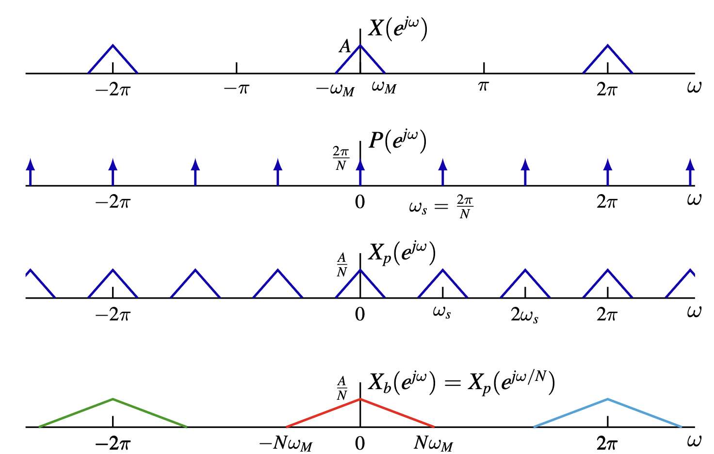{fig-align="center"}

## 作业

一、 书面作业

1. 7.2                                    
2. 7.4                               
3. 7.5                                 
4. 7.6
5. 7.7
6. 7.10

二、 编程作业
 详细见乐学平台

---

<section style="
  min-height: 100vh;
  display: flex;
  flex-direction: column;
  justify-content: center;
  align-items: center;
  text-align: center;
">
  

<h1>第七章   采样   完</h1>
  

</section>

