## 目录 {#toc0}

- [**1. 引言**](#sec71)
- [2. 用信号样本表示连续时间信号-采样定理](#sec72)
- [3. 利用内插由样本重建信号](#sec73)
- [4. 欠采样](#sec74)
- [5. 连续时间信号的离散时间处理](#sec75)
- [6. 离散时间信号采样](#sec76)

# 引言 {#sec71}

    theme: simple
    slide-number: true
    toc: true
    number-sections: true
    transition: fade
    center: true
    math: mathjax
---

## 目录

1. 拉普拉斯变换

## 2. 收敛域

## 3. Properties of 拉普拉斯变换

## 拉普拉斯变换

已知：连续时间 LTI 系统在输入 $x(t)=e^{s t}$ 时，其输出为

$$
y(t)=(x * h)(t)=H(s) e^{s t}
$$

其中 $h$ 为系统的冲激响应，且

$$
H(s)=\int_{-\infty}^{\infty} h(t) e^{-s t} d t
$$

系统函数 $H(s)$ 称为 $h$ 的拉普拉斯变换。
一般地，连续时间信号 $x(t)$ 的拉普拉斯变换定义为

$$
X(s)=\int_{-\infty}^{\infty} x(t) e^{-s t} d t=\lim _{\substack{T_{1} \rightarrow \infty \\ T_{2} \rightarrow \infty}} \int_{-T_{1}}^{T_{2}} x(t) e^{-s t} d t
$$

也可记为

$$
X=\mathcal{L}\{x\}, \quad \text { or } \quad x(t) \stackrel{\mathcal{L}}{\longleftrightarrow} X(s)
$$

## 拉普拉斯变换

使得拉普拉斯变换积分

$$
X(s)=\int_{-\infty}^{\infty} x(t) e^{-s t} d t=\lim _{\substack{T_{1} \rightarrow \infty \\ T_{2} \rightarrow \infty}} \int_{-T_{1}}^{T_{2}} x(t) e^{-s t} d t
$$

收敛的复数 $s$ 的集合称为收敛域（ROC）

## 与连续时间傅里叶变换的关系

当 $s=\sigma+j \omega$ 时，

$$
X(\sigma+j \omega)=\int_{-\infty}^{\infty}\left\{x(t) e^{-\sigma t}\right\} e^{-j \omega t} d t=\mathcal{F}\left\{x(t) e^{-\sigma t}\right\}
$$

若收敛域包含虚轴，令 $\sigma=0$，则有

$$
\left.X(s)\right|_{s=j \omega}=X(j \omega)=\mathcal{F}\{x\}(j \omega)
$$

## 例

例：当 $x(t)=e^{-a t} u(t)$ 时，

$$
X(s)=\int_{0}^{\infty} e^{-a t} e^{-s t} d t=\lim _{T \rightarrow \infty} \frac{1-e^{-(s+a) T}}{s+a}=\frac{1}{s+a},
$$

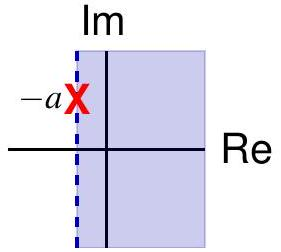
其收敛域为 $\operatorname{Re} s>-\operatorname{Re} a$.
若 $\operatorname{Re} a>0$, the ROC contains the imaginary axis,

$$
\mathcal{F}\{x\}(j \omega)=\left.X(s)\right|_{z=e^{j \omega}}=\frac{1}{j \omega+a}
$$

If $\operatorname{Re} a<0$, the CTFT does not exist.
If $\operatorname{Re} a=0$, the CTFT exists only as a distribution,
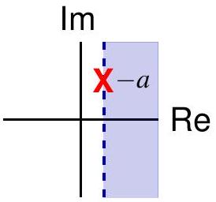

$$
a=j \omega_{0} \Longrightarrow \mathcal{F}\{x\}\left(e^{j \omega}\right)=\frac{1}{j\left(\omega+\omega_{0}\right)}+\pi \delta\left(\omega+\omega_{0}\right) \neq\left. X(s)\right|_{s=j \omega}
$$

## 例

For $x(t)=-e^{-a t} u(-t)$,

$$
X(s)=-\int_{-\infty}^{0} e^{-a t} e^{-s t} d t=\lim _{T \rightarrow \infty} \frac{1-e^{(s+a) T}}{s+a}=\frac{1}{s+a},
$$

其收敛域为 $\operatorname{Re} s<-\operatorname{Re} a$.
If $\operatorname{Re} a<0$, the ROC contains the imaginary axis,

$$
\mathcal{F}\{x\}(j \omega)=\left.X(s)\right|_{z=e^{j \omega}}=\frac{1}{j \omega+a}
$$

若 $\operatorname{Re} a>0$, the CTFT does not exist.
If $\operatorname{Re} a=0$, the CTFT exists only as a distribution,

$$
a=j \omega_{0} \Longrightarrow \mathcal{F}\{x\}\left(e^{j \omega}\right)=\frac{1}{j\left(\omega+\omega_{0}\right)}+\pi \delta\left(\omega+\omega_{0}\right) \neq\left. X(s)\right|_{s=j \omega}
$$

收敛域的重要性
$x_{1}(t)=e^{-a t} u(t) \stackrel{\mathcal{L}}{\longleftrightarrow} X_{1}(s)=\frac{1}{s+a}$,
ROC $\operatorname{Re} s>-\operatorname{Re} a$
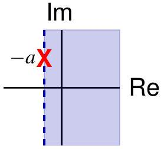
$x_{2}(t)=-e^{-a t} u(-t) \stackrel{\mathcal{L}}{\longleftrightarrow} X_{2}(s)=\frac{1}{s+a}$,
ROC $\operatorname{Re} s<-\operatorname{Re} a$
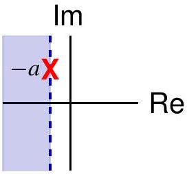

Different signals can have the same $X(s)$ but different ROCs
Always specify ROC for Laplace transforms!

## 例

For $x(t)=3 e^{-2 t} u(t)-2 e^{-t} u(t)$,

$$
\begin{aligned}
X(s) & =\int_{0}^{\infty}\left[3 e^{-2 t} u(t)-2 e^{-t} u(t)\right] e^{-s t} d t \\
& =\frac{3}{s+2}-\frac{2}{s+1} \\
& =\frac{s-1}{(s+2)(s+1)}
\end{aligned}
$$

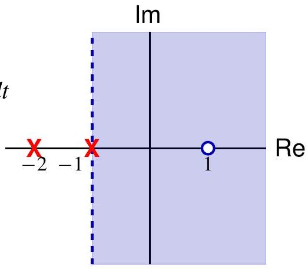
with $\operatorname{ROC} \operatorname{Re} s>-1$.

Two simple poles at $s=-2$ and $s=-1$
A simple zero at $s=1$
Also a simple zero at $\infty$.

## 例

For $x(t)=e^{-2 t} u(t)+e^{-t} \cos (3 t) u(t)=e^{-2 t}+\frac{1}{2} e^{-(1-3 j) t}+\frac{1}{2} e^{-(1+3 j) t}$,

$$
\begin{aligned}
X(s) & =\frac{1}{s+2}+\frac{1}{2} \frac{1}{s+(1-3 j)}+\frac{1}{2} \frac{1}{s+(1+3 j)} \\
& =\frac{2 s^{2}+5 s+12}{\left(s^{2}+2 s+10\right)(s+1)} \\
& =\frac{\left(s+\frac{5+j \sqrt{71}}{4}\right)\left(s+\frac{5-j \sqrt{71}}{4}\right)}{(s+2)(s+1-3 j)(s+1+3 j)}
\end{aligned}
$$

with $\mathrm{ROC} \operatorname{Re} s>-1$.
Simple poles at $s=-2$ and $s=-1 \pm 3 j$
Simple zeros at $s=\frac{-5 \pm j \sqrt{71}}{4}$
Also a simple zero at $\infty$.

## 有理拉普拉斯变换

A rational transform $X$ has the following form

$$
X(s)=\frac{N(s)}{D(s)}
$$

where $N, D$ are polynomials that are coprime, i.e. they have no common factors of degree $\geq 1$.
By the Fundamental 定理 of Algebra,

$$
X(s)=A \frac{\prod_{k=1}^{n}\left(s-z_{k}\right)}{\prod_{k=1}^{m}\left(s-p_{k}\right)}
$$

with the convention $\prod_{k=1}^{0} \cdot=1$.

- $z_{1}, \ldots, z_{n}$ are the finite zeros of $X$
- $p_{1}, \ldots, p_{m}$ are the finite poles of $X$
- If $n>m, X$ has a pole of order $n-m$ at $\infty$
- If $n<m, X$ has a zero of order $m-n$ at $\infty$

## 有理拉普拉斯变换

A rational function $X$ is determined by its zeros and poles in $\mathbb{C}$, including their orders, up to a multiplicative constant factor.

A rational Laplace transform is determined by its pole-zero plot and ROC, up to a multiplicative constant factor.

例.

$$
X(s)=A \frac{(s-1)^{2}}{(s+1)(s-2)}
$$

We will see there are three possibilities for the ROC

- $\operatorname{Re} s<-1$
- $-1<\operatorname{Re} s<2$
- $\operatorname{Re} s>2$

## 目录

1. 拉普拉斯变换
2. 收敛域
3. Properties of 拉普拉斯变换

## Convergence of 拉普拉斯变换

Assume $x(t)$ is integrable on any finite interval $\left[T_{1}, T_{2}\right]$. The convergence of the Laplace transform

$$
X(s)=\int_{-\infty}^{\infty} x(t) e^{-s t} d t=\lim _{\substack{T_{1} \rightarrow \infty \\ T_{2} \rightarrow \infty}} \int_{-T_{1}}^{T_{2}} x(t) e^{-s t} d t
$$

is equivalent to the convergence of the following two integrals

$$
\begin{align*}
& \int_{0}^{\infty} x(t) e^{-s t} d t=\lim _{T_{2} \rightarrow \infty} \int_{0}^{T_{2}} x(t) e^{-s t} d t  \tag{$\star$}\\
& \int_{-\infty}^{0} x(t) e^{-s t} d t=\lim _{T_{1} \rightarrow \infty} \int_{-T_{1}}^{0} x(t) e^{-s t} d t
\end{align*}
$$

The ROC for the Laplace transform is the intersection of the ROCs for the above two one-sided integrals.

NB. The integral in ( $\star$ ) is the unilateral Laplace transform of $x$.

## Convergence of Unilateral 拉普拉斯变换

定理. If the integral in ( $\star$ ) converges for $s=s_{0}=\sigma_{0}+j \omega_{0}$, then it converges for any $s=\sigma+j \omega$ with $\sigma>\sigma_{0}$.

证明. Let

$$
y(t)=\int_{0}^{t} x(\tau) e^{-s_{0} \tau} d \tau
$$

By assumption, $\lim _{t \rightarrow \infty} y(t)$ exists and hence $M \triangleq \sup _{t \geq 0}|y(t)|<\infty$.
Integration by parts yields

$$
\begin{aligned}
\int_{0}^{T} x(t) e^{-s t} d t & =\int_{0}^{T} y^{\prime}(t) e^{-\left(s-s_{0}\right) t} d t \\
& =e^{-\left(s-s_{0}\right) T} y(T)+\left(s-s_{0}\right) \int_{0}^{T} y(t) e^{-\left(s-s_{0}\right) t} d t
\end{aligned}
$$

As $T \rightarrow \infty, e^{-\left(s-s_{0}\right) T} y(T) \rightarrow 0$.

## Convergence of Unilateral 拉普拉斯变换

定理. If the integral in ( $\star$ ) converges for $s=s_{0}=\sigma_{0}+j \omega_{0}$, then it converges for any $s$ with $\operatorname{Re} s>\sigma_{0}$.

证明 (cont'd). Let $s=\sigma+j \omega$.

$$
\begin{aligned}
\int_{0}^{T}\left|y(t) e^{-\left(s-s_{0}\right) t}\right| d t & =\int_{0}^{T}|y(t)| e^{-\left(\sigma-\sigma_{0}\right) t} d t \\
& \leq \int_{0}^{T} M e^{-\left(\sigma-\sigma_{0}\right) t} d t \leq \frac{M}{\sigma-\sigma_{0}}
\end{aligned}
$$

so the integral $\int_{0}^{\infty} y(t) e^{-\left(s-s_{0}\right) t} d t$ converges absolutely.
Therefore, ( *) converges and

$$
\int_{0}^{\infty} x(t) e^{-s t} d t=\left(s-s_{0}\right) \int_{0}^{\infty} y(t) e^{-\left(s-s_{0}\right) t} d t
$$

## ROC of Unilateral 拉普拉斯变换

Three possibilities for the convergence of the integral ( $\star$ ),
(a). it converges for every $s \in \mathbb{C}$
(b). it diverges for every $s \in \mathbb{C}$
(c). it converges for $\operatorname{Re} s>\sigma_{c} \in \mathbb{R}$ and diverges for $\operatorname{Re} s<\sigma_{c}$

In case (c), $\sigma_{c} \in \mathbb{R}$ is called the abscissa of convergence, and the line $\operatorname{Re} s=\sigma_{c}$ is called the axis of convergence

The $\mathrm{ROC}^{1}$ is always a right half-plane

$$
\operatorname{ROC}=\left\{s \in \mathbb{C}: \operatorname{Re} s>\sigma_{c}\right\}
$$

We also write $\sigma_{c}=-\infty$ in case (a), and $\sigma_{c}=+\infty$ in case (b).

[^0]
## ROC of Unilateral 拉普拉斯变换

例. $\int_{0}^{\infty} e^{t^{2}} e^{-s t} d t$ diverges for every $s \in \mathbb{C}$, i.e. $\sigma_{c}=+\infty$
证明. Let $s=\sigma \in \mathbb{R}$. Note

$$
\int_{0}^{\infty} e^{t^{2}} e^{-\sigma t} d t=+\infty
$$

Since $\sigma$ is arbitrary, the previous theorem implies the integral diverges for any $s \in \mathbb{C}$.

例. $\int_{0}^{\infty} e^{-t^{2}} e^{-s t} d t$ converges for every $s \in \mathbb{C}$, i.e. $\sigma_{c}=-\infty$
证明. Let $s=\sigma \in \mathbb{R}$. Note

$$
\int_{0}^{\infty} e^{-t^{2}} e^{-\sigma t} d t=e^{\sigma^{2} / 4} \int_{0}^{\infty} e^{-(t+\sigma / 2)^{2}} d t \leq e^{\sigma^{2} / 4} \int_{-\infty}^{\infty} e^{-t^{2}} d t=\sqrt{\pi} e^{\sigma^{2} / 4}
$$

The integral converges absolutely for every $s \in \mathbb{C}$.
例. $\int_{0}^{\infty} e^{-s t} d t$ has $\sigma_{c}=0$

## 绝对收敛 of Unilateral 拉普拉斯变换

定理. If the integral in ( $\star$ ) converges absolutely for $s=s_{0}=\sigma_{0}+j \omega_{0}$, then it converges absolutely and uniformly for $s=\sigma+j \omega$ with $\sigma \geq \sigma_{0}$.
证明.

$$
\int_{0}^{\infty}\left|x(t) e^{-s t}\right| d t=\int_{0}^{\infty}|x(t)| e^{-\sigma t} d t \leq \int_{0}^{\infty}|x(t)| e^{-\sigma_{0} t} d t<\infty
$$

As in the case of convergence, the region of absolute convergence (ROAC) is always a right half-plane

$$
\operatorname{ROAC}=\left\{s \in \mathbb{C}: \operatorname{Re} s>\sigma_{a}\right\}
$$

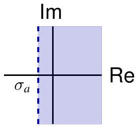
where $\sigma_{a} \in \overline{\mathbb{R}}$ is the abscissa of absolute convergence, and the line $\operatorname{Re} s=\sigma_{a}$ is the axis of absolute convergence.

## ROAC of Unilateral 拉普拉斯变换

The axis of convergence and the axis of absolute convergence need not coincide!

例. Let $k>0$. To see $\sigma_{a}=k$, note $\int_{0}^{\infty} e^{k t} \sin \left(e^{k t}\right) e^{-s t} d t$ converges absolutely for $\operatorname{Re} s>k$, since for $s=\sigma+j \omega$,

$$
\left|e^{k t} \sin \left(e^{k t}\right) e^{-s t}\right| \leq e^{-(\sigma-k) t} \in L_{1}[0, \infty)
$$

It is not absolutely convergent for $s=k$, since

$$
\int_{0}^{\infty}\left|\sin \left(e^{k t}\right)\right| d t=\frac{1}{k} \int_{1}^{\infty} \frac{|\sin u|}{u} d u=\infty .
$$

Let $s=\sigma \in \mathbb{R}$.

$$
\int_{0}^{\infty} e^{k t} \sin \left(e^{k t}\right) e^{-\sigma t} d t=\frac{1}{k} \int_{1}^{\infty} \frac{\sin u}{u^{\sigma / k}} d u
$$

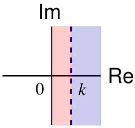

Dirichlet's test implies $\sigma_{c}=0$.
NB. We will use ROC, although in most cases ROC = ROAC.

## ROC of (Bilateral) 拉普拉斯变换

The ROC of

$$
\int_{0}^{\infty} x(t) e^{-s t} d t
$$

is a right half-plane $\operatorname{Re} s>\sigma_{1}$.
The ROC of

$$
\int_{-\infty}^{0} x(t) e^{-s t} d t=\int_{0}^{\infty} x(-t) e^{-(-s) t} d t
$$

is a left half-plane, $\operatorname{Re} s<\sigma_{2}$.
The ROC of

$$
X(s)=\int_{-\infty}^{\infty} x(t) e^{-s t} d t=\int_{0}^{\infty} x(t) e^{-s t} d t+\int_{-\infty}^{0} x(t) e^{-s t} d t
$$

is a strip $\sigma_{1}<\operatorname{Re} s<\sigma_{2}$, which is nonempty iff $\sigma_{1}<\sigma_{2}$

## Properties of ROC

- $X(s)$ is analytic in the ROC and

$$
f^{(k)}(s)=\int(-t)^{k} x(t) e^{-s t} d t
$$

- If $x$ is of finite duration and in $L_{1}$, then the ROC is $\mathbb{C}$.
- If $x$ is left-sided, its ROC is a left half-plane
- If $x$ is right-sided, its ROC is a right half-plane
- If $x$ is two-sided, its ROC is a strip

left-sided

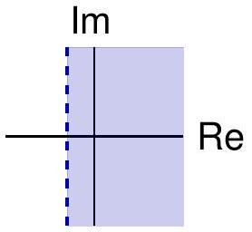
right-sided

two-sided

## 例

Consider $x(t)=e^{-b|t|}=e^{-b t} u(t)+e^{b t} u(-t)$ Recall

$$
\begin{aligned}
& e^{-b t} u(t) \stackrel{\mathcal{L}}{\longleftrightarrow} \frac{1}{s+b}, \quad \operatorname{Re} s>-b \\
& e^{b t} u(-t) \stackrel{\mathcal{L}}{\longleftrightarrow} \frac{-1}{s-b}, \quad \operatorname{Re} s<b
\end{aligned}
$$

Thus
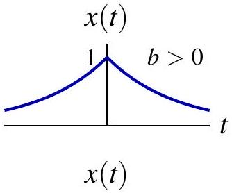
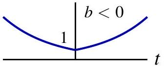

$$
x(t)=e^{-b|t|} \stackrel{\mathcal{L}}{\longleftrightarrow} \frac{1}{s+b}-\frac{1}{s-b}=\frac{-2 b}{s^{2}-b^{2}}, \quad-b<\operatorname{Re} s<b
$$

The ROC is nonempty iff $b>0$.
NB. For Laplace transform to exist, $x(t)$ has to decay fast enough either as $t \rightarrow+\infty$ or $t \rightarrow-\infty$. The exponential weighting in $e^{-s t}$ cannot kill both.
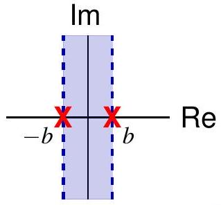

## Properties of ROC

- If $X(s)$ is rational, the ROC is bounded by poles or extends to infinity.
- If $x$ is also right-sided, then its ROC is the right half-plane bounded by the rightmost pole in $\mathbb{C}$, e.g. region III
- If $x$ is also left-sided, then its ROC is the left half-plane bounded by the leftmost pole in $\mathbb{C}$, e.g. region I

## 目录

## 1. 拉普拉斯变换

## 2. 收敛域

## 3. Properties of 拉普拉斯变换

## 线性性质

If

$$
\begin{array}{ll}
x(t) \stackrel{\mathcal{L}}{\longleftrightarrow} X(s) & \text { with } \mathrm{ROC}=R_{1} \\
y(t) \stackrel{\mathcal{L}}{\longleftrightarrow} Y(s) & \text { with } \mathrm{ROC}=R_{2}
\end{array}
$$

then

$$
a x(t)+b y(t) \stackrel{\mathcal{L}}{\longleftrightarrow} a X(s)+b Y(s) \quad \text { with } \mathrm{ROC} \supset R_{1} \cap R_{2}
$$

NB. The ROC may be larger than $R_{1} \cap R_{2}$.
例. $\quad x(t)=\cos \left(\omega_{0} t\right) u(t)=\frac{1}{2} e^{j \omega_{0} t} u(t)+\frac{1}{2} e^{-j \omega_{0} t} u(t)$

$$
\begin{gathered}
X(s)=\frac{1}{2} \frac{1}{s-j \omega_{0}}+\frac{1}{2} \frac{1}{s+j \omega_{0}}=\frac{s}{s^{2}+\omega_{0}^{2}}, \quad \operatorname{Re} s>0 \\
\sin \left(\omega_{0} t\right) u(t) \stackrel{\mathcal{L}}{\longleftrightarrow} \frac{\omega_{0}}{s^{2}+\omega_{0}^{2}}, \quad \operatorname{Re} s>0
\end{gathered}
$$

## 线性性质

## 例.

$X_{1}(s)=\frac{1}{s+1}, \quad \operatorname{Re} s>-1 ; \quad X_{2}(s)=\frac{1}{(s+1)(s+2)}, \quad \operatorname{Re} s>-1$

$$
X(s)=X_{1}(s)-X_{2}(s)=\frac{s+1}{(s+1)(s+2)}=\frac{1}{s+2}, \quad \operatorname{Re} s>-2
$$

ROC enlarges due to pole-zero cancellation at $s=-1$.
In time domain,

$$
\begin{gathered}
x_{1}(t)=e^{-t} u(t), \quad x_{2}(t)=e^{-t} u(t)-e^{-2 t} u(t) \\
x(t)=x_{1}(t)-x_{2}(t)=e^{-2 t} u(t)
\end{gathered}
$$

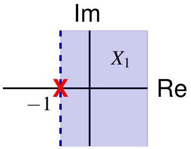
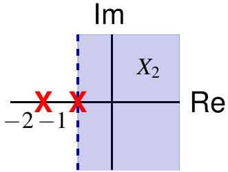

## 时移性质

If

$$
x(t) \stackrel{\mathcal{L}}{\longleftrightarrow} X(s), \quad \sigma_{1}<\operatorname{Re} s<\sigma_{2}
$$

then

$$
x\left(t-t_{0}\right) \stackrel{\mathcal{L}}{\longleftrightarrow} e^{-s t_{0}} X(s), \quad \sigma_{1}<\operatorname{Re} s<\sigma_{2}
$$

例.

$$
\begin{gathered}
? \stackrel{\mathcal{L}}{\longleftrightarrow} \frac{e^{3 s}}{s+2}, \operatorname{Re} s>-2 \\
x(t)=e^{-2 t} u(t) \stackrel{\mathcal{L}}{\longleftrightarrow} \frac{1}{s+2}, \operatorname{Re} s>-2 \\
x(t+3)=e^{-2(t+3)} u(t+3) \stackrel{\mathcal{L}}{\longleftrightarrow} \frac{e^{3 s}}{s+2}, \operatorname{Re} s>-2
\end{gathered}
$$

## Shifting in $s$-domain

If

$$
x(t) \stackrel{\mathcal{L}}{\longleftrightarrow} X(s), \quad \sigma_{1}<\operatorname{Re} s<\sigma_{2}
$$

then

$$
e^{s_{0} t} x(t) \stackrel{\mathcal{L}}{\longleftrightarrow} X\left(s-s_{0}\right), \quad \sigma_{1}+\operatorname{Re} s_{0}<\operatorname{Re} s<\sigma_{2}+\operatorname{Re} s_{0}
$$

## 例.

For $\alpha \in \mathbb{R}$,

$$
\begin{array}{ll}
e^{-\alpha t} \cos \left(\omega_{0} t\right) u(t) \stackrel{\mathcal{L}}{\longleftrightarrow} \frac{s+\alpha}{(s+\alpha)^{2}+\omega_{0}^{2}}, & \operatorname{Re} s>-\alpha \\
e^{-\alpha t} \sin \left(\omega_{0} t\right) u(t) \stackrel{\mathcal{L}}{\longleftrightarrow} \frac{\omega_{0}}{(s+\alpha)^{2}+\omega_{0}^{2}}, & \operatorname{Re} s>-\alpha
\end{array}
$$

## 时间尺度变换

If

$$
x(t) \stackrel{\mathcal{L}}{\longleftrightarrow} X(s), \quad \sigma_{1}<\operatorname{Re} s<\sigma_{2}
$$

then for $a \in \mathbb{R} \backslash\{0\}$,

$$
x(a t) \stackrel{\mathcal{L}}{\longleftrightarrow} \frac{1}{|a|} X\left(\frac{s}{a}\right), \quad \sigma_{1}<\frac{1}{a} \operatorname{Re} s<\sigma_{2}
$$

For time reversal,

$$
x(-t) \stackrel{\mathcal{L}}{\longleftrightarrow} X(-s), \quad-\sigma_{2}<\operatorname{Re} s<-\sigma_{1}
$$

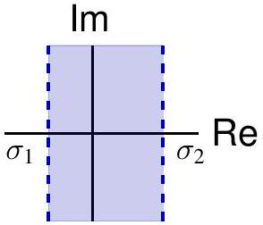
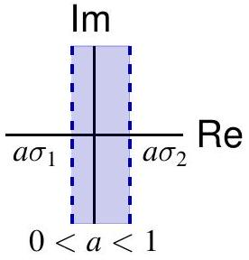
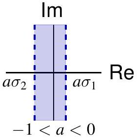

## 共轭

If

$$
x(t) \stackrel{\mathcal{L}}{\longleftrightarrow} X(s), \quad \sigma_{1}<\operatorname{Re} s<\sigma_{2}
$$

then

$$
x^{*}(t) \stackrel{\mathcal{L}}{\longleftrightarrow} X^{*}\left(s^{*}\right), \quad \sigma_{1}<\operatorname{Re} s<\sigma_{2}
$$

If $x$ is real-valued, then $X(s)=X^{*}\left(s^{*}\right)$, so the zeros and poles of $X(s)$ appear in conjugate pairs.

## 例.

For $x(t)=e^{-2 t} u(t)+e^{-t} \cos (3 t) u(t)$,

$$
X(s)=\frac{\left(s+\frac{5+j \sqrt{71}}{4}\right)\left(s+\frac{5-j \sqrt{71}}{4}\right)}{(s+2)(s+1-3 j)(s+1+3 j)}
$$

with $\operatorname{ROC} \operatorname{Re} s>-1$.
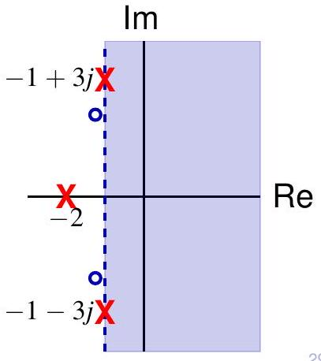

## 卷积性质

If

$$
\begin{array}{ll}
x(t) \stackrel{\mathcal{L}}{\longleftrightarrow} X(s) & \text { with } \mathrm{ROAC}=R_{1} \\
y(t) \stackrel{\mathcal{L}}{\longleftrightarrow} Y(s) & \text { with } \mathrm{ROAC}=R_{2}
\end{array}
$$

then

$$
(x * y)(t) \stackrel{\mathcal{L}}{\longleftrightarrow} X(s) Y(s) \quad \text { with ROAC } \supset R_{1} \cap R_{2}
$$

A more precise statement is the following.
定理. If both $X(s)=\int_{-\infty}^{\infty} x(t) e^{-s t} d t$ and $Y(s)=\int_{-\infty}^{\infty} y(t) e^{-s t} d t$ converges absolutely at some $s=s_{0}$, then the Laplace transform of $z=x * y$ converges absolutely at $s=s_{0}$, and

$$
X\left(s_{0}\right) Y\left(s_{0}\right)=Z\left(s_{0}\right)=\int_{-\infty}^{\infty} z(t) e^{-s_{0} t} d t
$$

## 卷积性质

证明.

$$
\begin{aligned}
X(s) Y(s) & =\int_{-\infty}^{\infty} x(v)\left[\int_{-\infty}^{\infty} y(\tau) e^{-s(v+\tau)} d v\right] d \tau \\
& =\int_{-\infty}^{\infty} x(v)\left[\int_{-\infty}^{\infty} y(t-v) e^{-s v} d v\right] d t \quad(t=v+\tau) \\
& =\int_{-\infty}^{\infty}\left[\int_{-\infty}^{\infty} x(v) y(t-v) d t\right] e^{-s v} d v \quad \text { (Fubini's 定理) }
\end{aligned}
$$

NB. The ROAC of $\mathcal{L}\{x * y\}$ may be larger than the common ROAC of $\mathcal{L}\{x\}$ and $\mathcal{L}\{y\}$.

例. $X_{1}(s)=\frac{s+1}{(s+2)^{2}}$ has ROAC $\operatorname{Re} s>-2, X_{2}(s)=\frac{1}{s+1}$ has ROAC Re $s>-1$, but $X(s)=X_{1}(s) X_{2}(s)=\frac{1}{(s+2)^{2}}$ with ROAC $\operatorname{Re} s>-2$, due to pole-zero cancellation at $s=-1$.

## 时域微分性质

If

$$
x(t) \stackrel{\mathcal{L}}{\longleftrightarrow} X(s), \quad \text { with } \text { ROC }=R
$$

and $\lim _{t \rightarrow \pm \infty} x(t) e^{-s t}=0$ for $s \in R \in R_{0}$, then

$$
\frac{d}{d t} x(t) \stackrel{\mathcal{L}}{\longleftrightarrow} s X(s), \quad \text { with } \mathrm{ROC} \supset R \cap R_{0}
$$

证明. Integration by parts yields

$$
\int_{-\infty}^{\infty} x^{\prime}(t) e^{-s t} d t=\left.x(t) e^{-s t}\right|_{-\infty} ^{\infty}+s \int_{-\infty}^{\infty} x(t) e^{-s t} d t=s \int_{-\infty}^{\infty} x(t) e^{-s t} d t
$$

NB. ROC may enlarge or shrink
例. $x(t)=\left(1-e^{-t}\right) u(t) \stackrel{\mathcal{L}}{\longleftrightarrow} \frac{1}{s(s+1)}$ with ROC = ROAC
$\operatorname{Re} s>0$, and $x^{\prime}(t)=e^{-t} u(t) \stackrel{\mathcal{L}}{\longleftrightarrow} \frac{1}{s+1}$ with ROC = ROAC
$\operatorname{Re} s>-1$. The ROC of $\mathcal{L}\left\{x^{\prime}\right\}$ is larger that that of $\mathcal{L}\{x\}$.

## 时域微分性质

例. Consider $x(t)=e^{k t} \sin \left(e^{k t}\right)$ with $k>0$.

- For $s=\sigma \in \mathbb{R}, u=e^{k t}$ yields (cf. slide 18)

$$
\int_{-\infty}^{\infty} x(t) e^{-s t} d t=\frac{1}{k} \int_{0}^{\infty} \frac{\sin u}{u^{\sigma / k}} d u=\frac{1}{k} \int_{0}^{1} \frac{\sin u}{u^{\sigma / k}} d u+\frac{1}{k} \int_{1}^{\infty} \frac{\sin u}{u^{\sigma / k}} d u
$$

- $\int_{1}^{\infty} \frac{\sin u}{u^{\sigma / k}} d u$ has ROAC $\operatorname{Re} s>k$ and ROC $\operatorname{Re} s>0$
- As $u \downarrow 0, \frac{\sin u}{u^{\sigma / k}} \sim u^{1-\sigma / k}$, so $\int_{0}^{1} \frac{\sin u}{u^{\sigma / k}} d u$ has ROAC $\operatorname{Re} s<2 k$
- Thus $\mathcal{L}\{x\}$ has $\operatorname{ROC} k<\operatorname{Re} s<2 k$ and $\operatorname{ROC} 0<\operatorname{Re} s<2 k$.
- $x^{\prime}(t)=k e^{k t} \sin \left(e^{k t}\right)+k e^{2 k t} \cos \left(e^{k t}\right)$. For $s=\sigma \in \mathbb{R}$,

$$
\int_{-\infty}^{\infty} x^{\prime}(t) e^{-s t} d t=\int_{0}^{\infty} \frac{\sin u+u \cos u}{u^{\sigma / k}} d u
$$

$\mathcal{L}\left\{x^{\prime}\right\}$ has empty ROAC, and ROC $k<\operatorname{Re} s<2 k$

- Note $\lim _{t \rightarrow \pm \infty} x(t) e^{-s t}=0$ fails for $s$ with $0<\operatorname{Re} s<k$

## 时域微分性质

If $x(t)=O\left(e^{a t}\right)$ as $t \rightarrow+\infty$ and $x(t)=O\left(e^{b t}\right)$ as $t \rightarrow-\infty$, then

$$
x(t) \stackrel{\mathcal{L}}{\longleftrightarrow} X(s), \quad \text { with ROAC containing } a<\operatorname{Re} s<b
$$

and

$$
\frac{d}{d t} x(t) \stackrel{\mathcal{L}}{\longleftrightarrow} s X(s), \quad \text { with ROC containing } a<\operatorname{Re} s<b
$$

NB. In general, from the absolute convergence of $\mathcal{L}\{x\}$ at $s=s_{0}$ we can only conclude the convergence of $\mathcal{L}\left\{x^{\prime}\right\}$ at $s=s_{0}$.

NB. We mostly deal with $x(t)$ of the form $\sum_{k=0}^{m} p_{k}(t) e^{\alpha_{k} t} u\left( \pm t+\beta_{k}\right)$, where $p_{k}$ are polynomials. After introducing Laplace transform for singularity functions, we have for such functions,

$$
\frac{d^{n}}{d t^{n}} x(t) \stackrel{\mathcal{L}}{\longleftrightarrow} s^{n} X(s), \quad \text { with ROC containing } a<\operatorname{Re} s<b
$$

## $s$ 域微分性质

If

$$
x(t) \stackrel{\mathcal{L}}{\longleftrightarrow} X(s), \quad \sigma_{1}<\operatorname{Re} s<\sigma_{2}
$$

then

$$
-t x(t) \stackrel{\mathcal{L}}{\longleftrightarrow} \frac{d}{d s} X(s), \quad \sigma_{1}<\operatorname{Re} s<\sigma_{2}
$$

证明. Differentiation under integral sign (can be justified) yields

$$
\frac{d}{d s} \int_{-\infty}^{\infty} x(t) e^{-s t} d t=\int_{-\infty}^{\infty} x(t) \frac{d}{d s} e^{-s t} d t=\int_{-\infty}^{\infty}-t x(t) e^{-s t} d t
$$

例.

$$
e^{-a t} u(t) \stackrel{\mathcal{L}}{\longleftrightarrow} \frac{1}{s+a}, \quad \operatorname{Re} s>-a
$$

$$
t^{n} e^{-a t} u(t) \stackrel{\mathcal{L}}{\longleftrightarrow}\left(-\frac{d}{d s}\right)^{n} \frac{1}{s+a}=\frac{n!}{(s+a)^{n+1}}, \quad \operatorname{Re} s>-a
$$

Similarly, $\quad-t^{n} e^{-a t} u(-t) \stackrel{\mathcal{L}}{\longleftrightarrow} \frac{n!}{(s+a)^{n+1}}, \quad \operatorname{Re} s<-a$

[^0]:    ¹More precisely, the interior of the ROC.

## 拉普拉斯逆变换

Recall Laplace transform 为 related to CTFT by

$$
X(\sigma+j \omega)=\int_{-\infty}^{\infty}\left\{x(t) e^{-\sigma t}\right\} e^{-j \omega t} d t=\mathcal{F}\left\{x(t) e^{-\sigma t}\right\}
$$

Take the inverse Fourier transform for $s=\sigma+j \omega \in \mathrm{ROC}$,

$$
x(t) e^{-\sigma t}=\frac{1}{2 \pi} \int_{-\infty}^{\infty} X(\sigma+j \omega) e^{j \omega t} d \omega
$$

so

$$
x(t)=\frac{1}{2 \pi} \int_{-\infty}^{\infty} X(\sigma+j \omega) e^{(\sigma+j \omega) t} d \omega
$$

or

$$
x(t)=\frac{1}{j 2 \pi} \int_{\sigma-j \infty}^{\sigma+j \infty} X(s) e^{s t} d s=\lim _{A \rightarrow \infty} \frac{1}{j 2 \pi} \int_{\sigma-j A}^{\sigma+j A} X(s) e^{s t} d s
$$

## Inverse Transform by Partial Fraction Expansion

对于rational Laplace transform, the inverse transform can be found by partial fraction expansion.

Recall a proper rational function has the following partial fraction expansion

$$
R(s)=\sum_{i=1}^{r} \sum_{k_{i}=1}^{N_{i}} \frac{A_{i, k_{i}}}{\left(s+a_{i}\right)^{k_{i}}}
$$

Also recall

$$
\begin{aligned}
\frac{t^{n-1}}{(n-1)!} e^{-a t} u(t) \stackrel{\mathcal{L}}{\longleftrightarrow} \frac{1}{(s+a)^{n}}, & \operatorname{Re} s>-a \\
-\frac{t^{n-1}}{(n-1)!} e^{-a t} u(-t) \stackrel{\mathcal{L}}{\longleftrightarrow} \frac{1}{(s+a)^{n}}, & \operatorname{Re} s<-a
\end{aligned}
$$

By linearity, $\mathcal{L}^{-1}\{R\}$ 为 a linear combination of terms of the above form, 其中 signs are chosen according to the ROC.

## 例

Consider a rational Laplace transform $X(s)=\frac{1}{(s+1)(s+2)^{2}}$

$$
X(s)=\frac{1}{s+1}+\frac{-1}{s+2}+\frac{-1}{(s+2)^{2}}
$$

Two poles at $s=-1$ and $s=-2$.

1. 如果ROC 为 $\operatorname{Re} s>-1$

$$
x(t)=e^{-t} u(t)-(1+t) e^{-2 t} u(t)
$$

2. 如果ROC 为 $\operatorname{Re} s<-2$

$$
x(t)=-e^{-t} u(-t)+(1+t) e^{-2 t} u(-t)
$$

3. 如果ROC 为 $-2<\operatorname{Re} s<-1$

$$
x(t)=-e^{-t} u(-t)-(1+t) e^{-2 t} u(t)
$$

## Inverse Transform by Contour Integration

Suppose $X(s)$ has finitely many finite 为olated singularities $s_{1}, \ldots, s_{n}$, and ROC 为 $-\infty \leq \sigma_{1}<\operatorname{Re} s<\sigma_{2} \leq+\infty$.

The inverse transform 为

$$
x(t)=\lim _{r \rightarrow \infty} \frac{1}{j 2 \pi} \int_{\sigma-j r}^{\sigma+j r} X(s) e^{s t} d s
$$

其中 $\sigma_{1}<\sigma<\sigma_{2}$.
对于$t>0$, choose a large semicircle $C_{r}$ that encloses all $s_{k}$ with $\operatorname{Re} s \leq \sigma_{1}$.

如果$X(s)$ sat为fies ${ }^{1}$ (a shifted and rotated version of) Jordan's Lemma (slide 6, Lecture 27), Residue Theorem implies

$$
x(t)=\sum_{k: s_{k} \leq \sigma_{1}} \operatorname{Res}\left[X(s) e^{s t}, s_{k}\right], \quad t>0
$$

${ }^{1}$ sat为fied by proper rational functions

## Inverse Transform by Contour Integration

Suppose $X(s)$ has finitely many finite 为olated singularities $s_{1}, \ldots, s_{n}$, and ROC 为 $-\infty \leq \sigma_{1}<\operatorname{Re} s<\sigma_{2} \leq+\infty$.

The inverse transform 为

$$
x(t)=\lim _{r \rightarrow \infty} \frac{1}{j 2 \pi} \int_{\sigma-j r}^{\sigma+j r} X(s) e^{s t} d s
$$

其中 $\sigma_{1}<\sigma<\sigma_{2}$.
对于$t<0$, choose a large semicircle $C_{r}$ that encloses all $s_{k}$ with $\operatorname{Re} s \geq \sigma_{2}$.

如果$X(s)$ sat为fies (a shifted and rotated version of) Jordan's Lemma, Residue Theorem implies

$$
x(t)=-\sum_{k: s_{k} \geq \sigma_{2}} \operatorname{Res}\left[X(s) e^{s t}, s_{k}\right], \quad t<0
$$

Caution. Negative sign due to negative orientation of contour.

## 例

Consider a rational Laplace transform $X(s)=\frac{1}{(s+1)(s+2)^{2}}$

$$
\begin{gathered}
\operatorname{Res}\left[X(s) e^{s t},-1\right]=\left.\frac{e^{s t}}{(s+2)^{2}}\right|_{s=-1}=e^{-t} \\
\operatorname{Res}\left[X(s) e^{s t},-2\right]=\left[\frac{d}{d s} \frac{e^{s t}}{s+1}\right]_{s=-2}=-(1+t) e^{-2 t}
\end{gathered}
$$

1. 如果ROC 为 $\operatorname{Re} s>-1$, 则 $\sigma_{1}=-1, \sigma_{2}=+\infty$.

对于$t>0$,

$$
x(t)=\sum_{k: \operatorname{Re} s_{k} \leq-1} \operatorname{Res}\left[X(s) e^{s t}, s_{k}\right]=e^{-t}-(1+t) e^{-2 t}
$$

对于$t<0$,

$$
x(t)=-\sum_{k: \operatorname{Re} s_{k} \geq+\infty} \operatorname{Res}\left[X(s) e^{s t}, s_{k}\right]=0
$$

## 例 (cont'd)

Consider a rational Laplace transform $X(s)=\frac{1}{(s+1)(s+2)^{2}}$

$$
\begin{gathered}
\operatorname{Res}\left[X(s) e^{s t},-1\right]=\left.\frac{e^{s t}}{(s+2)^{2}}\right|_{s=-1}=e^{-t} \\
\operatorname{Res}\left[X(s) e^{s t},-2\right]=\left[\frac{d}{d s} \frac{e^{s t}}{s+1}\right]_{s=-2}=-(1+t) e^{-2 t}
\end{gathered}
$$

2. 如果ROC 为 $\operatorname{Re} s<-2$, 则 $\sigma_{1}=-\infty, \sigma_{2}=-2$.

对于$t>0$,

$$
x(t)=\sum_{k: \operatorname{Re} s_{k} \leq-\infty} \operatorname{Res}\left[X(s) e^{s t}, s_{k}\right]=0
$$

对于$t<0$,

$$
x(t)=-\sum_{k: \operatorname{Re} s_{k} \geq-2} \operatorname{Res}\left[X(s) e^{s t}, s_{k}\right]=-e^{-t}+(1+t) e^{-2 t}
$$

## 例 (cont'd)

Consider a rational Laplace transform $X(s)=\frac{1}{(s+1)(s+2)^{2}}$

$$
\begin{gathered}
\operatorname{Res}\left[X(s) e^{s t},-1\right]=\left.\frac{e^{s t}}{(s+2)^{2}}\right|_{s=-1}=e^{-t} \\
\operatorname{Res}\left[X(s) e^{s t},-2\right]=\left[\frac{d}{d s} \frac{e^{s t}}{s+1}\right]_{s=-2}=-(1+t) e^{-2 t}
\end{gathered}
$$

3. 如果ROC 为 $-2<\operatorname{Re} s<-1$, 则 $\sigma_{1}=-2, \sigma_{2}=-1$.

对于$t>0$,

$$
x(t)=\sum_{k: \operatorname{Re} s_{k} \leq-2} \operatorname{Res}\left[X(s) e^{s t}, s_{k}\right]=-(1+t) e^{-2 t}
$$

对于$t<0$,

$$
x(t)=-\sum_{k: \operatorname{Re} s_{k} \geq-1} \operatorname{Res}\left[X(s) e^{s t}, s_{k}\right]=-e^{-t}
$$

## 目录

1. 拉普拉斯变换的性质
2. 拉普拉斯逆变换
3. 奇异函数的拉普拉斯变换
4. 利用拉普拉斯变换分析连续时间 LTI 系统
5. 框图表示

## 奇异函数的拉普拉斯变换

We can also define Laplace transform for generalized functions. In th为 course, we only consider the Laplace transforms of $\delta(t)$ and its derivatives. Formally,

$$
\begin{aligned}
\mathcal{L}\{\delta\} & =\int_{-\infty}^{\infty} \delta(t) e^{-s t} d t=1 \\
\mathcal{L}\left\{\delta^{\prime}\right\} & =\int_{-\infty}^{\infty} \delta^{\prime}(t) e^{-s t} d t=-\left.\frac{d}{d t} e^{-s t}\right|_{t=0}=s \\
\mathcal{L}\left\{\delta^{(k)}\right\} & =\int_{-\infty}^{\infty} \delta^{(k)}(t) e^{-s t} d t=\left.(-1)^{k} \frac{d^{k}}{d t^{k}} e^{-s t}\right|_{t=0}=s^{k}
\end{aligned}
$$

The Laplace transforms are defined for all $s \in \mathbb{C}$, and we say "ROC" $=\mathbb{C}$, though there 为 no convergence 为sue involved.

## 奇异函数的拉普拉斯变换

The properties of Laplace transforms d为cussed previously still holds for th为 generalization.

例. The property of time differentiation 为 equivalent to the convolution property involving $\delta^{\prime}$.

$$
\mathcal{L}\left\{x^{\prime}\right\}=\mathcal{L}\left\{x * \delta^{\prime}\right\}=\mathcal{L}\{x\} \mathcal{L}\left\{\delta^{\prime}\right\}=s \mathcal{L}\{x\}
$$

例.
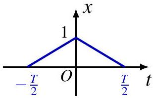

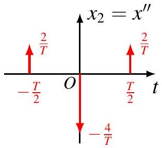
$X_{2}(s)=-\frac{4}{T}+\frac{2}{T} e^{-s \frac{T}{2}}+\frac{2}{T} e^{s \frac{T}{2}}=\frac{8}{T} \sinh ^{2}\left(\frac{s T}{4}\right) \Longrightarrow X(s)=\frac{X_{2}(s)}{s^{2}}$

## 拉普拉斯逆变换

Recall a rational function can be written as the sum of a polynomial and a proper rational function

$$
R(s)=\sum_{k=1}^{n} a_{k} s^{k}+R_{1}(s)
$$

Thus

$$
\mathcal{L}^{-1}\{R\}=\sum_{k=1}^{n} a_{k} \delta^{(k)}(t)+\mathcal{L}^{-1}\left\{R_{1}\right\}
$$

其中 $\mathcal{L}^{-1}\left\{R_{1}\right\}$ can be found by partial fraction expansion or contour integration.

例. $X(s)=\frac{s(s+2)}{s+3}=s-1+\frac{3}{s+3}$ with $\operatorname{ROC} \operatorname{Re} s>-3$, so

$$
x(t)=\delta^{\prime}(t)-\delta(t)+3 e^{-3 t} u(t)
$$

## 目录

1. 拉普拉斯变换的性质
2. 拉普拉斯逆变换
3. 奇异函数的拉普拉斯变换
4. 利用拉普拉斯变换分析连续时间 LTI 系统
5. 框图表示

## CT System Function

回顾：连续时间LTI系统对输入 $x(t)$ 为

$$
y(t)=(x * h)(t)
$$

其中 $h$ 为 the impulse response of the system.
如果$x$ and $h$ have Laplace transforms, the convolution property implies

$$
Y(s)=X(s) H(s)
$$

in their common $\mathrm{ROC}^{2}$.
如果the ROC has a nonempty interior point, the system function (aka transfer function) $H(s)$ uniquely determines $h$ and hence system properties through the inverse Laplace transform (th为 can be proved, but we will not do so).

[^0]
## 因果性

Recall $h$ 为 right-sided iff the ROC of $H(s)$ 为 a right half-plane,
causal $\Longrightarrow \mathrm{ROC}$ 为 a right half-plane

Caution. The converse 为 not true.
例. Consider $H(s)=\frac{e^{s}}{s+1}$ with $\operatorname{ROC} \operatorname{Re} s>-1$. By the time-shift property,

$$
h(t)=e^{-(t+1)} u(t+1)
$$

which 为 not causal.

## 因果性

An LTI system with rational system function $H(s)$ 为 causal iff the ROC 为 the right half-plane to the rightmost pole.

证明. Recall for a rational system function,

$$
H(s)=\sum_{k=1}^{n} a_{k} s^{k}+\sum_{i=1}^{r} \sum_{k_{i}=1}^{N_{i}} \frac{A_{i, k_{i}}}{\left(s+a_{i}\right)^{k_{i}}}, \quad \operatorname{Re} s>\max _{i} \operatorname{Re}\left(-a_{i}\right)
$$

SO

$$
h(t)=\sum_{k=1}^{n} a_{k} \delta^{(k)}(t)+\sum_{i=1}^{r} \sum_{k_{i}=1}^{N_{i}} \frac{A_{i, k_{i}}}{\left(k_{i}-1\right)!} t^{k_{i}-1} e^{-a_{i} t} u(t)
$$

which 为 causal. (Can also prove by contour integration.)
例. $h(t)=e^{-t} u(t) \stackrel{\mathcal{L}}{\longleftrightarrow} H(s)=\frac{1}{s+1}$ with $\operatorname{Re} s>-1$, causal.
例. $h(t)=e^{-|t|} \stackrel{\mathcal{L}}{\longleftrightarrow} H(s)=\frac{-2}{s^{2}-1}$ with $-1<\operatorname{Re} s<1$, noncausal.

## 稳定性

Recall an LTI system 为 stable iff its impulse response $h \in L_{1}$, i.e.

$$
\int_{-\infty}^{\infty}|h(t)| d t<\infty
$$

i.e. $H(s)$ converges absolutely on the imaginary ax为 $\operatorname{Re} s=0$, so its $\operatorname{ROC}-\infty \leq \sigma_{1}<\operatorname{Re} s<\sigma_{2} \leq \infty$ must sat为fy $\sigma_{1}<0<\sigma_{2}$.

stable $\Longleftrightarrow$ ROC includes the imaginary ax为

A causal LTI system with rational system function $H(s)$ 为 stable iff all its poles have negative real parts.

例. A causal system with $H(s)=\frac{1}{s+a}$ 为 stable iff $\operatorname{Re} a>0$
例. A system with $H(s)=\frac{1}{s+a}$ 其中 $\operatorname{Re} a<0$ and ROC $\operatorname{Re} s<-\operatorname{Re} a$ 为 also stable, but it 为 noncausal.

## 例

Consider the system function

$$
H(s)=\frac{1}{s-2}-\frac{1}{s+1}
$$

There are two poles $p_{1}=-1$ and $p_{2}=2$.

1. Re $s<-1$, noncausal, unstable

$$
h_{1}(t)=-e^{2 t} u(-t)+e^{-t} u(-t)
$$

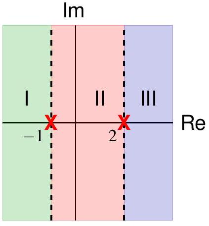
2. $-1<\operatorname{Re} s<2$, noncausal, stable

$$
h_{2}(t)=-e^{2 t} u(-t)-e^{-t} u(t)
$$

3. $\operatorname{Re} s>2$, causal, unstable

$$
h_{3}(t)=e^{2 t} u(t)-e^{-t} u(t)
$$

## 线性常系数微分方程

LTI system with input and output related by

$$
\sum_{k=0}^{N} a_{k} \frac{d^{k} y}{d t^{k}}=\sum_{k=0}^{M} b_{k} \frac{d^{k} x}{d t^{k}}
$$

Take Laplace transform of both sides

$$
\sum_{k=0}^{N} a_{k} s^{k} Y(s)=\sum_{k=0}^{M} b_{k} s^{k} X(s)
$$

so

$$
H(s)=\frac{Y(s)}{X(s)}=\frac{\sum_{k=0}^{M} b_{k} s^{k}}{\sum_{k=0}^{N} a_{k} s^{k}}
$$

System function 为 always rational
ODE does not specify ROC! Need additional conditions (e.g. stability, causality) to determine $h(t)$.

## 例

Consider LTI system with input and output related by

$$
y^{\prime}(t)+3 y(t)=x^{\prime}(t)+x(t)
$$

System function

$$
H(s)=\frac{s+1}{s+3}=1-\frac{2}{s+3}
$$

Two possibilities for ROC: $\operatorname{Re} s>-3$ and $\operatorname{Re} s<-3$

1. 如果$\operatorname{Re} s>-3$, causal and stable,

$$
h(t)=\delta(t)-2 e^{-3 t} u(t)
$$

2. 如果$\operatorname{Re} s<-3$, anticausal and unstable,

$$
h(t)=\delta(t)+2 e^{-3 t} u(-t)
$$

## 例 (cont'd)

Consider LTI system with input and output related by

$$
y^{\prime}(t)+3 y(t)=x^{\prime}(t)+x(t)
$$

如果we use Fourier transform, 则 frequency response 为

$$
H(j \omega)=\frac{j \omega+1}{j \omega+3}=1-\frac{2}{j \omega+3}
$$

and

$$
h(t)=\delta(t)-2 e^{-3 t} u(t)
$$

Why only one possibility?

- Fourier transform method assumes stability, requiring that ROC of $H(s)$ contain the imaginary ax为, so $\operatorname{Re} s>-3$
- 一般而言， not applicable to unstable systems

## 例 (cont'd)

Find response to $x(t)=e^{-4 t} u(t)$.

$$
X(s)=\frac{1}{s+4}, \quad \operatorname{Re} s>-4
$$

Laplace transform for response

$$
Y(s)=H(s) X(s)=\frac{s+1}{s+3} \cdot \frac{1}{s+4}=\frac{-2}{s+3}+\frac{3}{s+4}
$$

## Two possible ROCs

1 . 如果$\operatorname{Re} s>-3$,

$$
y(t)=-2 e^{-3 t} u(t)+3 e^{-4 t} u(t)
$$

2. 如果$-4<\operatorname{Re} s<-3$,

$$
y(t)=2 e^{-3 t} u(-5)+3 e^{-4 t} u(t)
$$

## 例 (cont'd)

Find response to $x(t)=e^{-3 t} u(t)$.

$$
X(s)=\frac{1}{s+3}, \quad \operatorname{Re} s>-3
$$

Laplace transform for response

$$
Y(s)=H(s) X(s)=\frac{s+1}{s+3} \cdot \frac{1}{s+3}=\frac{1}{s+3}+\frac{-2}{(s+3)^{2}}
$$

Only one possible ROC $\operatorname{Re} s>-3$

$$
y(t)=(1-2 t) e^{-3 t} u(t)
$$

对于the anticausal and unstable system,

$$
h(t)=\delta(t)+2 e^{-3 t} u(-t)
$$

Can verify directly $x * h$ 为 not well-defined.

## 例

The response of an LTI system to the input $x(t)=e^{-3 t} u(t)$ 为

$$
y(t)=\left(e^{-t}-e^{-2 t}\right) u(t)
$$

System function

$$
H(s)=\frac{Y(s)}{X(s)}=\frac{\frac{1}{s+1}-\frac{1}{s+2}}{\frac{1}{s+3}}=\frac{s+3}{s^{2}+3 s+2}, \quad \operatorname{Re} s>-1
$$

By partial fraction expansion

$$
H(s)=\frac{2}{s+1}-\frac{1}{s+2}, \operatorname{Re} s>-1 \Longrightarrow h(t)=\left(2 e^{-t}-e^{-2 t}\right) u(t)
$$

Can be described by the following ODE

$$
\frac{d^{2} y}{d t^{2}}+3 \frac{d y}{d t}+2 y=\frac{d x}{d t}+3 x
$$

## 目录

1. 拉普拉斯变换的性质
2. 拉普拉斯逆变换
3. 奇异函数的拉普拉斯变换
4. 利用拉普拉斯变换分析连续时间 LTI 系统
5. 框图表示

## 系统互连

LTI systems in 串联系统

$$
Y=\left(X H_{1}\right) H_{2}=X\left(H_{1} H_{2}\right)=\left(X H_{2}\right) H_{1}
$$

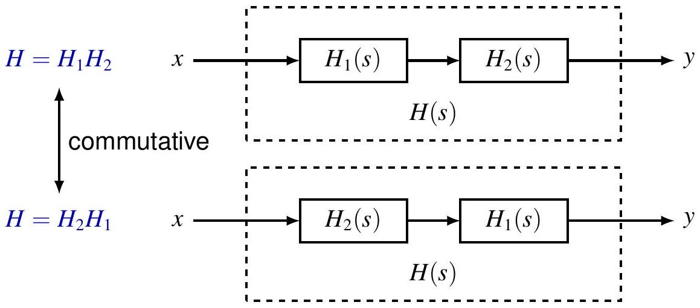

## 系统互连

LTI systems in systems in 并联系统

$$
h=h_{1}+h_{2}
$$

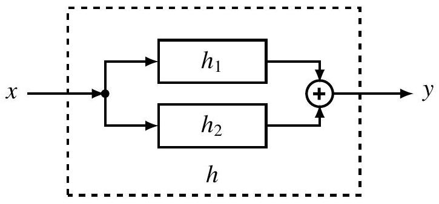

$$
H=H_{1}+H_{2}
$$

## 系统互连

LTI systems in systems in 反馈系统

$$
\begin{gathered}
y=h_{1} *\left(x-h_{2} * y\right) \\
h=?
\end{gathered}
$$

$Y=H_{1} X-H_{1} H_{2} Y$
$H=\frac{Y}{X}=\frac{H_{1}}{1+H_{1} H_{2}}$

## 例

Causal LTI systems with system function

$$
H(s)=\frac{1}{s+a}, \quad \operatorname{Re} s>-\operatorname{Re} a
$$

Equivalent description by ODE

$$
y^{\prime}(t)+a y(t)=x(t)
$$

with initial rest condition.

## 例

Causal LTI systems with system function

$$
H(s)=\frac{s+b}{s+a}=\left(\frac{1}{s+a}\right)(s+b), \quad \operatorname{Re} s>-\operatorname{Re} a
$$

## 例

Causal LTI systems with system function

$$
H(s)=\frac{1}{(s+1)(s+2)}=\frac{1}{s^{2}+3 s+2}
$$

Equivalent description by different equation

$$
y^{\prime \prime}(t)+3 y^{\prime}(t)+2 y(t)=x(t)
$$

Direct form

例 (cont'd)
Causal LTI systems with system function

$$
H(s)=\frac{1}{(s+1)(s+2)}=\frac{1}{s+1} \cdot \frac{1}{s+2}
$$

Cascade form

例 (cont'd)
Causal LTI systems with system function

$$
H(s)=\frac{1}{(s+1)(s+2)}=\frac{1}{s+1}-\frac{1}{s+2}
$$

Parallel form
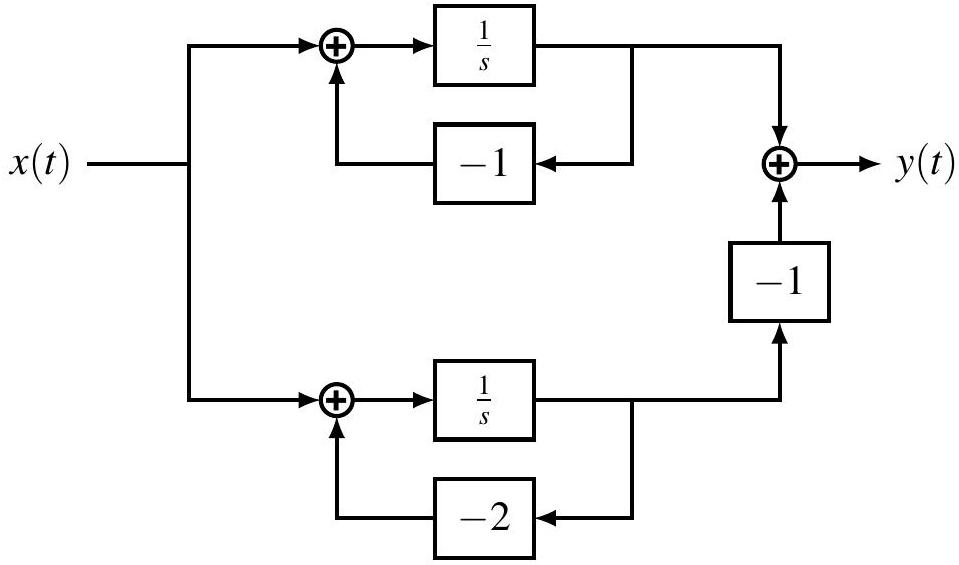

[^0]:    ${ }^{2}$ Actually ROAC for ordinary functions. 对于most signals in th为 course, ROC and ROAC coincide, so we will be sloppy.

## 单边拉普拉斯变换

Recall the (双边) Laplace transform of a CT signal $x$

$$
X(s)=\int_{-\infty}^{\infty} x(t) e^{-s t} d t
$$

The 单边 Laplace transform of $x$ 为

$$
X(s)=\int_{0_{-}}^{\infty} x(t) e^{-s t} d t
$$

also denoted

$$
\mathcal{X}=\mathcal{U} \mathcal{L}\{x\}, \quad x(t) \stackrel{\mathcal{U L}}{\longleftrightarrow} \mathcal{X}(s)
$$

ROC of $X$ 为 always a right half-plane
注意： Information about $x(t)$ at $t<0$ 为 lost in $x$.
注意： $\mathcal{L}\{x\}=\mathcal{U} \mathcal{L}\{x\}$ iff $x(t)$ 为 causal, i.e. $x(t)=0$ for $t<0$

## 例子

The calculation of 单边 Laplace transforms 为 almost the same as for 双边 Laplace transforms.

例. $x_{1}(t)=e^{-a t} u(t)$,

$$
X_{1}(s)=X_{1}(s)=\frac{1}{s+a}, \quad \operatorname{Re} s>-\operatorname{Re} a
$$

例. $x_{2}(t)=e^{-a(t+1)} u(t+1)=x_{1}(t+1)$,

$$
\begin{array}{cl}
\text { 双边 } & X_{2}(s)=e^{s} X_{1}(s)=\frac{e^{s}}{s+a}, \quad \operatorname{Re} s>-\operatorname{Re} a \\
\text { 单边 } & X_{2}(s)=\int_{0}^{\infty} e^{-a(t+1)} e^{-s t} d t=\frac{e^{-a}}{s+a}, \operatorname{Re} s>-\operatorname{Re} a
\end{array}
$$

注意： $X_{2} \neq X_{2}$, since $x_{2}$ 为 noncausal.
注意： $X_{2} \neq e^{s} X_{1}$, time-shift property fails for 单边 transform.

## 例子

The calculation of 单边 Laplace transforms 为 almost the same as for 双边 Laplace transforms.

例. $x_{3}(t)=e^{-a|t|}$ with $\operatorname{Re} a>0$

$$
\begin{aligned}
\text { 双边 } & X_{3}(t)=\frac{-2 a}{s^{2}-a^{2}}, \quad-\operatorname{Re} a<\operatorname{Re} s<\operatorname{Re} a \\
\text { 单边 } & X_{3}(s)=\frac{1}{s+a}, \quad \operatorname{Re} s>-\operatorname{Re} a
\end{aligned}
$$

注意： $X_{3} \neq X_{1}$, since $x_{3} \neq x_{1}$
注意： $X_{3}=X_{1}$, since $x_{3}$ and $x_{1}$ differ only for $t<0$
例. $x(t)=\delta(t)+2 \delta^{\prime}(t)+e^{t} u(t)$

$$
X(s)=X(s)=1+2 s+\frac{1}{s-1}, \quad \operatorname{Re} s>1
$$

注意： The lower limit of integration 为 $0_{-}$so $\delta$ and $\delta^{\prime}$ contribute to $\mathcal{X}$

## 例子

The calculation of inverse 单边 Laplace transforms 为 the same as for 双边 Laplace transforms, but we can only recover $x(t)$ for $t \geq 0$ !

例. Given 单边 Laplace transform

$$
X(s)=\frac{1}{(s+1)(s+2)}=\frac{1}{s+1}-\frac{1}{s+2}
$$

the only possibility for ROC 为 $\operatorname{Re} s>-1$. Thus

$$
x(t)=e^{-t}-e^{-2 t}, \quad t \geq 0
$$

X provides no information about $x(t)$ for $t<0$
例. $\mathfrak{X}(s)=\frac{s^{2}-3}{s+2}=-2+s+\frac{1}{s+2}$. The ROC must be $\operatorname{Re} s>-2$, and

$$
x(t)=-2 \delta(t)+\delta^{\prime}(t)+e^{-2 t}, \quad t \geq 0
$$

## Properties of 单边拉普拉斯变换

Many properties are the same as for 双边 Laplace transform

| Property | Signal | ULT |
| :---: | :---: | :---: |
| - | $x(t)$ | $X(s)$ |
| - | $y(t)$ | $Y(s)$ |
| Linearity | $a x(t)+b y(t)$ | $a X(s)+b y(s)$ |
| Shifting in $s$-domain | $e^{s_{0} t} x(t)$ | $X\left(s-s_{0}\right)$ |
| Time scaling | $x(a t), a>0$ | $\frac{1}{a} X\left(\frac{s}{a}\right)$ |
| Conjugation | $x^{*}(t)$ | $X^{*}\left(s^{*}\right)$ |
| Differentiation in $s$ domain | $-t x(t)$ | $\frac{d}{d s} X(s)$ |

## Convolution Property of 单边拉普拉斯变换

如果$x(t)=y(t)=0$ for $t<0$, 则

$$
(x * y)(t) \stackrel{u \mathcal{L}}{\longleftrightarrow} X(s) y(s), \quad \text { ROAC } \supset \operatorname{ROAC}_{x} \cap \operatorname{ROAC}_{y}
$$

证明. Note $(x * y)(t)=0$ for $t<0$.

$$
\mathcal{U} \mathcal{L}\{x * y\}=\mathcal{L}\{x * y\}=\mathcal{L}\{x\} \mathcal{L}\{y\}=\mathcal{U} \mathcal{L}\{x\} \mathcal{U} \mathcal{L}\{y\}
$$

Caution. The assumption $x(t)=y(t)=0$ for $t<0$ 为 important!
例. $x(t)=\delta(t)-\delta(t-1), y(t)=\delta(t+1)$,

$$
X(s)=1-e^{-s}, \quad Y(s)=0,
$$

Note $(x * y)(t)=\delta(t+1)-\delta(t)$, and

$$
\mathcal{U} \mathcal{L}\{x * y\}=-1 \neq \mathcal{X}(s) \mathcal{Y}(s)
$$

## 时域积分性质

If

$$
x(t) \stackrel{\varkappa L}{\longleftrightarrow} X(s), \quad \text { with } \text { ROAC }=R
$$

则

$$
\int_{0_{-}}^{t} x(\tau) d \tau \stackrel{u \mathcal{L}}{\longleftrightarrow} \frac{1}{s} \mathcal{X}(s), \quad \text { with ROAC } \supset R \cap\{\operatorname{Re} s>0\}
$$

证明. Apply the convolution property to $\tilde{x} * u$, 其中

$$
\tilde{x}(t)= \begin{cases}x(t), & t \geq 0 \\ 0, & t<0\end{cases}
$$

例. $x(t)=\delta(t), X(s)=1$.

$$
\int_{0_{-}}^{t} x(\tau) d \tau=u(t) \stackrel{u \mathcal{L}}{\longleftrightarrow} \frac{1}{s}, \quad \operatorname{Re} s>0
$$

## 时域微分性质

If

$$
x(t) \stackrel{u \Sigma}{\longleftrightarrow} X(s), \quad \text { with } \mathrm{ROC}=R
$$

and $\lim _{t \rightarrow+\infty} x(t) e^{-s t}=0$ for $s \in R_{0}$, 则

$$
\frac{d}{d t} x(t) \stackrel{u \mathcal{L}}{\longleftrightarrow} s \mathcal{X}(s)-x\left(0_{-}\right), \quad \text { with } \mathrm{ROC} \supset R \cap R_{0}
$$

注意： $R_{0} \supset$ ROAC of $X(s)$ (also true for 双边 Laplace transform)
证明. Use integration by parts

$$
\int_{0_{-}}^{\infty} x^{\prime}(t) e^{-s t} d t=\left.x(t) e^{-s t}\right|_{t=0_{-}} ^{\infty}+s \int_{0_{-}}^{\infty} x(t) e^{-s t} d t=-x\left(0_{-}\right)+s \mathfrak{X}(s)
$$

注意： Had we used the definition $X(s)=\int_{0_{+}}^{\infty} x(t) e^{-s t} d t$, we would have $\frac{d}{d t} x(t) \stackrel{\mathcal{L} \mathcal{L}}{\longleftrightarrow} s \mathcal{X}(s)-x\left(0_{+}\right)$

## 时域微分性质

例. $x(t)=e^{-t}, \mathcal{X}(s)=\frac{1}{s+1}$ with ROAC Re $s>-1$. By the differentiation property,

$$
x^{\prime}(t) \stackrel{u \mathcal{L}}{\longleftrightarrow} \frac{s}{s+1}-1=-\frac{1}{s+1}, \quad \operatorname{ROC} \supset\{\operatorname{Re} s>-1\}
$$

By direct calculation,

$$
x^{\prime}(t)=-e^{-t} \stackrel{u \mathcal{L}}{\longleftrightarrow}=-\frac{1}{s+1}, \quad \operatorname{ROC}=\operatorname{ROAC}=\{\operatorname{Re} s>-1\}
$$

例. $x(t)=e^{-t} u(t), X(s)=\frac{1}{s+1}$ with ROAC $\operatorname{Re} s>-1$. By the differentiation property,

$$
x^{\prime}(t) \longleftrightarrow \frac{\mathcal{L}}{\longleftrightarrow} \frac{s}{s+1}, \quad \operatorname{ROC} \supset\{\operatorname{Re} s>-1\}
$$

By direct calculation, $x^{\prime}(t)=\delta(t)-e^{-t} u(t)$, and

$$
\mathcal{U} \mathcal{L}\left\{x^{\prime}\right\}=-\frac{1}{s+1}+1=\frac{s}{s+1}, \quad \mathrm{ROC}=\mathrm{ROAC}=\{\operatorname{Re} s>-1\}
$$

## 时域微分性质

Under appropriate conditions, e.g. $x^{(k)}(t)=O\left(e^{\gamma t}\right)$, we can extend the differentiation property to higher derivatives,

$$
x^{(n)}(t) \stackrel{\mathcal{U}}{\longleftrightarrow} s^{n} \mathfrak{X}(s)-\sum_{k=0}^{n-1} s^{n-1-k} x^{(k)}\left(0_{-}\right)
$$

Since solutions to constant coefficient ODEs 为 of the form

$$
x(t)=\sum_{k=1}^{n} p_{i}(t) e^{a_{i} t}
$$

其中 $p_{i}$ are polynomials, the above condition 为 sat为fied.
Unilateral Laplace transform 为 useful for solving ODEs with nonzero initial condtions.

## 初值定理

定理： 如果the 单边 Laplace transform $\mathcal{X}(s)$ of $x(t)$ 为 a proper rational function, 则

$$
x\left(0_{+}\right)=\lim _{s \rightarrow \infty} s \mathfrak{X}(s)
$$

证明. $X(s)$ has partial fraction expansion,

$$
\begin{gathered}
X(s)=\sum_{i=1}^{r} \sum_{k_{i}=1}^{N_{i}} \frac{A_{i, k_{i}}}{\left(s+a_{i}\right)^{k_{i}}} \\
x(t)=\sum_{i=1}^{r} \sum_{k_{i}=1}^{N_{i}} \frac{A_{i, k_{i}} t^{k_{i}-1}}{\left(k_{i}-1\right)!} e^{-a_{i} t}, \quad t \geq 0 \\
x\left(0_{+}\right)=\sum_{i=1}^{r} A_{i, 1}=\lim _{s \rightarrow \infty} \sum_{i=1}^{r} \sum_{k_{i}=1}^{N_{i}} \frac{A_{i, k_{i}} s}{\left(s+a_{i}\right)^{k_{i}}}=\lim _{s \rightarrow \infty} s \mathcal{X}(s)
\end{gathered}
$$

例. $x(t)=2 e^{-t}+e^{-2 t}, \mathcal{X}(s)=\frac{3 s+5}{s^{2}+3 s+2}, x\left(0_{+}\right)=\lim _{s \rightarrow \infty} s \mathfrak{X}(s)=3$.

## 初值定理

如果$\mathcal{X}(s)$ 为 rational but not proper, 则

$$
\mathfrak{X}(s)=\sum_{k=0}^{n} a_{k} s^{k}+\mathfrak{X}_{1}(s)
$$

其中 $X_{1}(s)$ 为 a proper rational function.
Taking inverse transform,

$$
x(t)=\sum_{k=0}^{n} a_{k} \delta^{(k)}(t)+x_{1}(t)
$$

So

$$
x\left(0_{+}\right)=x_{1}\left(0_{+}\right)=\lim _{s \rightarrow \infty} s \mathcal{X}_{1}(s)
$$

例. $x(t)=\delta(t)+2 e^{-t}, X(s)=1+\frac{2}{s+1}=\frac{s+3}{s+1}$,

$$
x\left(0_{+}\right)=2=\lim _{s \rightarrow \infty} \frac{2 s}{s+1} \neq \lim _{s \rightarrow \infty} s \mathfrak{X}(s)
$$

## 例

Suppose a CT LTI system has the following properties.

1. The system 为 causal
2. The system function $H(s)$ 为 a proper rational function and has only two poles, at $s=-2$ and $s=-4$.
3. 对于input $x(t)=1$, the output 为 $y(t)=0$
4. The impulse response sat为fies $h\left(0_{+}\right)=4$

Determine the system function $H(s)$.
解. By 1 and 2

$$
H(s)=\frac{a s+b}{(s+2)(s+4)}, \quad \operatorname{Re} s>-2
$$

By 3, $H(0)=0$, so $b=0$.
By 4, $\lim _{s \rightarrow \infty} s H(s)=4$, so $a=4$, and

$$
H(s)=\frac{4 s}{(s+2)(s+4)}, \quad \operatorname{Re} s>-2
$$

## 终值定理

定理： Suppose $x(t)$ does not contain $\delta$ or its derivatives for $t \geq 0$. 如果$X(s)$ converges for real $s>0$ and the $x(t)$ has a finite limit as $t \rightarrow+\infty$, 则

$$
\lim _{t \rightarrow+\infty} x(t)=\lim _{s \rightarrow 0_{+}} s X(s)
$$

证明. Since $A \triangleq \lim _{t \rightarrow+\infty} x(t)$ ex为ts, $x(t)$ 为 bounded on $(0,+\infty)$, i.e. $|x(t)| \leq M$. 对于any $\epsilon>0, \ex为ts T$ s.t. $|x(t)-A|<\epsilon$ for $t \geq T$.
对于$s>0$,

$$
s \mathfrak{X}(s)-A=s \int_{0}^{\infty}[x(t)-A] e^{-s t} d t
$$

$$
|s \mathcal{X}(s)-A| \leq s\left(\int_{0}^{T}+\int_{T}^{\infty}\right)|x(t)-A| e^{-s t} d t=I_{1}+I_{2}
$$

其中 $I_{1} \leq s T(M+A)$ and $I_{2} \leq \epsilon s \int_{T}^{\infty} e^{-s t} d t \leq \epsilon s \int_{0}^{\infty} e^{-s t} d t=\epsilon$.

$$
\lim _{s \rightarrow 0_{+}}|s \mathcal{X}(s)-A| \leq \epsilon \Longrightarrow \lim _{s \rightarrow 0_{+}}|s \mathcal{X}(s)-A|=0 \Longrightarrow \lim _{s \rightarrow 0_{+}} s \mathcal{X}(s)=A
$$

## 终值定理

例. $x(t)=2+3 e^{-t}+e^{-2 t}$,

$$
\mathcal{X}(s)=\frac{2}{s}+\frac{3}{s+1}+\frac{1}{s+2}, \quad \operatorname{Re} s>0
$$

Check

$$
\lim _{s \rightarrow 0_{+}} s \mathfrak{X}(s)=2=\lim _{t \rightarrow+\infty} x(t)
$$

The Final Values Theorem can be extended to allow finitely many $\delta$ and its derivatives in $x(t)$ on the positive real ax为. We can rewrite $x(t)$ as

$$
\begin{gathered}
x(t)=x_{1}(t)+\sum_{i=1}^{n} a_{i} \delta^{\left(k_{i}\right)}\left(t-t_{i}\right) \stackrel{\mathcal{U L}}{\longleftrightarrow} \mathcal{X}(s)=\mathcal{X}_{1}(s)+\sum_{i=1}^{n} a_{i} s^{k_{i}} e^{-s t_{i}} \\
\lim _{t \rightarrow+\infty} x(t)=\lim _{t \rightarrow+\infty} x_{1}(t)=\lim _{s \rightarrow 0_{+}} s \mathcal{X}_{1}(s)=\lim _{s \rightarrow 0_{+}} s \mathcal{X}(s)
\end{gathered}
$$

例. $x(t)=\delta(t)+2, \mathcal{X}(s)=\frac{1}{s}+1, x(+\infty)=2=\lim _{s \rightarrow 0_{+}} s \mathcal{X}(s)$.

## 线性常系数微分方程

Consider ODE

$$
\sum_{k=0}^{N} a_{k} \frac{d^{k} y}{d t^{k}}=\sum_{k=0}^{M} b_{k} \frac{d^{k} x}{d t^{k}}
$$

with initial condition $y^{(k)}\left(0_{-}\right), k=0,1, \ldots, N-1$, and causal input, i.e. $x(t)=0$ for $t<0$.

Take 单边 Laplace transform of both sides

$$
\sum_{k=0}^{N} a_{k}\left[s^{k} \mathcal{Y}(s)-\sum_{\ell=0}^{k-1} s^{k-1-\ell} y^{(\ell)}\left(0_{-}\right)\right]=\sum_{k=0}^{M} b_{k} s^{k} \mathcal{X}(s)
$$

so

$$
y(s)=\underbrace{\frac{\sum_{k=0}^{M} b_{k} s^{k}}{\sum_{k=0}^{N} a_{k} s^{k}} \mathfrak{X}(s)}_{\text {zero-state response }}+\underbrace{\frac{\sum_{k=0}^{N} a_{k} \sum_{\ell=0}^{k-1} s^{k-1-\ell} y^{(\ell)}\left(0_{-}\right)}{\sum_{k=0}^{N} a_{k} s^{k}}}_{\text {zero-input response }}
$$

## 例

## Consider ODE

$$
y^{\prime \prime}(t)+3 y^{\prime}(t)+2 y(t)=2 x^{\prime}(t)+6 x(t)
$$

with initial condition $y\left(0_{-}\right)=c_{0}, y^{\prime}\left(0_{-}\right)=c_{1}$ and $x(t)=e^{-t} u(t)$.
Take 单边 Laplace transform of both sides

$$
\left[s^{2} y(s)-s c_{0}-c_{1}\right]+3\left[s y(s)-c_{0}\right]+2 y(s)=2 s \mathcal{X}(s)+6 \mathcal{X}(s)=\frac{2 s+6}{s+1}
$$

SO

$$
\begin{aligned}
y(s) & =\frac{2 s+6}{\left(s^{2}+3 s+2\right)(s+1)}+\frac{c_{0} s+\left(3 c_{0}+c_{1}\right)}{s^{2}+3 s+2} \\
& =\underbrace{\frac{2 s+6}{(s+1)^{2}(s+2)}}_{\text {zero-state response }}+\underbrace{\frac{c_{0} s+\left(3 c_{0}+c_{1}\right)}{(s+1)(s+2)}}_{\text {zero-input response }}
\end{aligned}
$$

## 例 (cont'd)

Zero-state response

$$
y_{z s}(s)=\frac{2 s+6}{(s+1)^{2}(s+2)}, \quad \operatorname{Re} s>-1
$$

对于$t \geq 0$,

$$
\begin{aligned}
y_{z s}(t) & =\operatorname{Res}\left[y_{z i} e^{s t},-2\right]+\operatorname{Res}\left[y_{z i} e^{s t},-1\right] \\
& =\left.\frac{(2 s+6) e^{s t}}{(s+1)^{2}}\right|_{s=-2}+\left[\frac{d}{d s} \frac{(2 s+6) e^{s t}}{s+2}\right]_{s=-1}=2 e^{-2 t}+(4 t-2) e^{-t}
\end{aligned}
$$

Zero-input response

$$
\begin{aligned}
& y_{z i}(s)=\frac{c_{0} s+\left(3 c_{0}+c_{1}\right)}{(s+1)(s+2)}, \quad \operatorname{Re} s>-1 \\
& \begin{aligned}
y_{z i}(t) & =\operatorname{Res}\left[y_{z s} s t,-2\right]+\operatorname{Res}\left[y_{z s} e^{s t},-1\right] \\
& =\left(2 c_{0}+c_{1}\right) e^{-t}-\left(c_{0}+c_{1}\right) e^{-2 t}, \quad t \geq 0
\end{aligned}
\end{aligned}
$$

目录

1. 单边拉普拉斯变换
2. 回顾

- Complex numbers and complex functions
- arithmetic and representations
- argument 为 multivalued, principal value ( $-\pi, \pi$ ]
- simply and multiply connected domains
- continuity of functions
- Analytic functions
- analytic at $z_{0}$ iff differentiable on some open d为k $B\left(z_{0}, r\right)$
- $f(z)=u(x, y)+j v(x, y)$ 为 analytic iff $u, v$ are continuously differentiable and sat为fy Cauchy-Riemann equation

$$
u_{x}=v_{y}, \quad u_{y}=-v_{x}
$$

- rational function $R(z)=\frac{N(z)}{D(z)}$ 为 analytic on $\mathbb{C}$ except for zeros of $D(z)$ (aka poles of $R(z)$ )
- elementary analytic functions
- Complex Integration
- Cauchy's Theorem

$$
\int_{C} f(z) d z=0
$$

- Cauchy's Integral Formula

$$
f^{(k)}(z)=\frac{n!}{j 2 \pi} \int_{C} \frac{f(\zeta)}{(\zeta-z)^{n+1}} d \zeta
$$

- Series
- power series and d为k of convergence
- Laurent series and annulus of convergence (cf. $z$-transform)
- Residue

$$
\operatorname{Res}\left[f, z_{0}\right]= \begin{cases}\frac{1}{j 2 \pi} \int_{C} f(z) d z=c_{-1}, & z_{0} \in \mathbb{C} \\ -\frac{1}{j 2 \pi} \int_{C} f(z) d z=-c_{-1}, & z_{0}=\infty\end{cases}
$$

- Residue Theorem
- Signal Representations
- time domain: linear combination of $\delta$, convolution
- frequency domain: linear combination of sinusoids (CT/DT Fourier series/transforms), spectrum
- $s$-domain: 双边/单边 Laplace transforms
- $z$-domain: 双边/单边 $z$-transforms
- Sampling
- Nyqu为t rate
- spectra of sampled signals
- Systems
- properties of systems (causality, stability, linearity, time-invariance...)
- representations of LTI systems (differential/difference equations, block diagrams, impulse response, frequency response, system function)
- eigenfunction property of LTI systems
- filtering
- Transforms (Fourier, Laplace, Z)
- forward and inverse transforms
- properties
- analys为 of LTI systems
- given system, find response to input
- given input output pairs, identify system
- ODE
- classical method in time domain
- transform method
- initial rest/LTI: Fourier, 双边 Laplace
- nonzero initial condition: 单边 Laplace
- Difference equations
- classical method in time domain
- transform method
- initial rest/LTI: Fourier, 双边 $z$-transform
- nonzero initial condition: 单边 $z$-transform

## 作业

（原文件作业部分保留）

---

<section style="min-height: 100vh; display: flex; flex-direction: column; justify-content: center; align-items: center; text-align: center;">
  

    <h1>第八章   拉普拉斯变换   完</h1>
  

</section>