## 目录 {#toc0}

- [**1. 引言**](#sec81)
- [2. 拉普拉斯变换及其收敛域](#sec82)
- [3. 拉普拉斯逆变换](#sec83)
- [4. 拉普拉斯变换的性质](#sec84)
- [5. 常用拉普拉斯变换对](#sec85)
- [6. 由零极点图对傅里叶变换几何求值](#sec86)
- [7. 用拉普拉斯变换分析和表征线性时不变系统](#sec87)
- [8. 单边拉普拉斯变换](#sec88)

# 引言 {#sec81}

## 从傅里叶变换到拉普拉斯变换

1. 变换的本质与起源傅里叶分析的局限：
   
  - 傅里叶变换将信号表示为复指数信号 $e^{st}$ 的线性组合，但其变量 $s$ 被限制在 $s = j\omega$（即复平面的虚轴）上。
  
  - 从推广到演变：利用 LTI（线性时不变）系统特征函数的性质，将 $s$ 的取值范围从纯虚数推广到任意复数，从而推导出：
- 
    * 拉普拉斯变换（连续时间信号的推广）
  
    * $z$ 变换（离散时间信号的推广）

1. 主要优势与功能分析范围更广：
   
   - 能够处理傅里叶变换无法覆盖的信号，尤其是对于不稳定系统的分析至关重要。
 - 
   - 系统分析工具：结合了傅里叶分析的代数性质，成为研究系统稳定性和反馈系统的核心数学支柱。

## 目录 {#toc1}

- [1. 引言](#sec81)
- [**2. 拉普拉斯变换及其收敛域**](#sec82)
- [3. 拉普拉斯逆变换](#sec83)
- [4. 拉普拉斯变换的性质](#sec84)
- [5. 常用拉普拉斯变换对](#sec85)
- [6. 由零极点图对傅里叶变换几何求值](#sec86)
- [7. 用拉普拉斯变换分析和表征线性时不变系统](#sec87)
- [8. 单边拉普拉斯变换](#sec88)

## 拉普拉斯变换及其收敛域 {#sec82}

回忆连续时间 LTI 系统对输入 $x(t)=e^{s t}$ 的响应为

$$
y(t)=(x * h)(t)=H(s) e^{s t}
$$

其中 $h$ 是系统的冲激响应，且

$$
H(s)=\int_{-\infty}^{\infty} h(t) e^{-s t} \, dt
$$

系统函数 $H(s)$ 称为 $h$ 的拉普拉斯变换。

一般地，连续时间信号 $x(t)$ 的拉普拉斯变换为

$$
X(s)=\int_{-\infty}^{\infty} x(t) e^{-s t} \, dt=\lim _{\substack{T_{1} \rightarrow \infty \\ T_{2} \rightarrow \infty}} \int_{-T_{1}}^{T_{2}} x(t) e^{-s t} \, dt
$$

也可记作

$$
X=\mathcal{L}\{x\}, \quad \text { 或 } \quad x(t) \stackrel{\mathcal{L}}{\longleftrightarrow} X(s)
$$
复变量$s$一般可写成$s=\sigma+j\omega$

<!-- ## 拉普拉斯变换及其收敛域

$$
X (s) = \int_ {- \infty} ^ {\infty} x (t) e ^ {- s t} d t
$$

称为 x t( )的双边拉氏变换，其中 s =σ+j@

若  则有：

$$
X (j \omega) = \int_ {- \infty} ^ {\infty} x (t) e ^ {- j \omega t} d t
$$

这就是 x t( )的傅里叶变换。

即：CTFT是双边拉普拉斯变换在 或是在

ω复平面上的jω轴上的特例。

由于 $= \int _ { - \infty } ^ { \infty } x ( t ) e ^ { - \sigma t } e ^ { - j \omega t } d t = \int _ { - \infty } ^ { \infty } [ x ( t$ )e-or]e-ior dt

$$
= \mathbb {F} [ x (t) e ^ {- \sigma t} ]
$$

所以拉氏变换是对傅里叶变换的推广，x t( )的拉氏变换就是 的傅里叶变换。只要有( ) tx t e−合适的 存在，就可以使某些本来不满足狄里赫利条件的信号在引入 后满足该条件。即te−有些信号的傅氏变换不收敛而它的拉氏变换存在。

拉氏变换比傅里叶变换有更广泛的适用性。 -->

## 拉普拉斯变换及其收敛域

定义拉普拉斯变换的积分

$$
X(s)=\int_{-\infty}^{\infty} x(t) e^{-s t} \, dt=\lim _{\substack{T_{1} \rightarrow \infty \\ T_{2} \rightarrow \infty}} \int_{-T_{1}}^{T_{2}} x(t) e^{-s t} \, dt
$$

**收敛的 $s$ 的集合称为其收敛域（Region of Convergence, ROC）**。

 

### 与连续时间傅里叶变换的关系

对于 $s=\sigma+j \omega$，

$$
X(\sigma+j \omega)=\int_{-\infty}^{\infty}\left\{x(t) e^{-\sigma t}\right\} e^{-j \omega t} \, dt=\mathcal{F}\left\{x(t) e^{-\sigma t}\right\}
$$

若收敛域包含虚轴，令 $\sigma=0$ 可得

$$
\left.X(s)\right|_{s=j \omega}=X(j \omega)=\mathcal{F}\{x\}(j \omega)
$$

## 拉普拉斯变换的收敛性

根据前一页的定义，假设 $x(t)$ 在任意有限区间 $[T_1,T_2]$ 上可积。拉普拉斯变换

$$
X(s)=\int_{-\infty}^{\infty} x(t) e^{-s t} \, dt=\lim _{\substack{T_{1} \rightarrow \infty \\ T_{2} \rightarrow \infty}} \int_{-T_{1}}^{T_{2}} x(t) e^{-s t} \, dt
$$

的收敛性等价于以下两个积分的收敛：

$$
\begin{align*}
& \int_{0}^{\infty} x(t) e^{-s t} \, dt=\lim _{T_{2} \rightarrow \infty} \int_{0}^{T_{2}} x(t) e^{-s t} \, dt  \tag{$\star$}\\
& \int_{-\infty}^{0} x(t) e^{-s t} \, dt=\lim _{T_{1} \rightarrow \infty} \int_{-T_{1}}^{0} x(t) e^{-s t} \, dt
\end{align*}
$$

拉普拉斯变换的收敛域是上述两个单边积分收敛域的交集。

**注**：积分 $(\star)$ 是 $x(t)$ 的单边拉普拉斯变换。

## 单边拉普拉斯变换的收敛性

**定理** 若积分 $(\star)$ 在 $s=s_{0}=\sigma_{0}+j \omega_{0}$ 处收敛，则对任意满足 $\operatorname{Re} s>\sigma_{0}$ 的 $s=\sigma+j \omega$ 也收敛。

**证明** 令

$$
y(t)=\int_{0}^{t} x(\tau) e^{-s_{0} \tau} \, d \tau
$$

由假设，$\lim _{t \rightarrow \infty} y(t)$ 存在，故 $M \triangleq \sup _{t \geq 0}|y(t)|<\infty$。

分部积分得

$$
\begin{aligned}
\int_{0}^{T} x(t) e^{-s t} \, dt & =\int_{0}^{T} y'(t) e^{-\left(s-s_{0}\right) t} \, dt \\
& =e^{-\left(s-s_{0}\right) T} y(T)+\left(s-s_{0}\right) \int_{0}^{T} y(t) e^{-\left(s-s_{0}\right) t} \, dt
\end{aligned}
$$

当 $T \rightarrow \infty$ 时，$e^{-\left(s-s_{0}\right) T} y(T) \rightarrow 0$。

## 单边拉普拉斯变换的收敛性

**定理**（续）若积分 $(\star)$ 在 $s=s_{0}$ 处收敛，则对任意 $\operatorname{Re} s>\sigma_{0}$ 的 $s$ 也收敛。

令 $s=\sigma+j \omega$，

$$
\begin{aligned}
\int_{0}^{T}\left|y(t) e^{-\left(s-s_{0}\right) t}\right| \, dt & =\int_{0}^{T}|y(t)| e^{-\left(\sigma-\sigma_{0}\right) t} \, dt \\
& \leq \int_{0}^{T} M e^{-\left(\sigma-\sigma_{0}\right) t} \, dt \leq \frac{M}{\sigma-\sigma_{0}}
\end{aligned}
$$

因此积分 $\int_{0}^{\infty} y(t) e^{-\left(s-s_{0}\right) t} \, dt$ 绝对收敛，从而 $(\star)$ 收敛，且

$$
\int_{0}^{\infty} x(t) e^{-s t} \, dt=\left(s-s_{0}\right) \int_{0}^{\infty} y(t) e^{-\left(s-s_{0}\right) t} \, dt
$$

## 单边拉普拉斯变换的收敛域

积分 $(\star)$ 的收敛有三种可能：

(a) 对所有 $s \in \mathbb{C}$ 都收敛；  
(b) 对所有 $s \in \mathbb{C}$ 都发散；  
(c) 对 $\operatorname{Re} s>\sigma_{c}$（$\sigma_{c} \in \mathbb{R}$）收敛，对 $\operatorname{Re} s<\sigma_{c}$ 发散。

在情形 (c) 中，$\sigma_{c}$ 称为收敛横坐标，$\operatorname{Re} s=\sigma_{c}$ 称为收敛轴。

单边拉普拉斯变换的收敛域始终是右半平面：

$$
\operatorname{ROC}=\left\{s \in \mathbb{C}: \operatorname{Re} s>\sigma_{c}\right\}
$$

情形 (a) 时记 $\sigma_{c}=-\infty$，情形 (b) 时记 $\sigma_{c}=+\infty$。

:::: {.columns style="text-align: left;"}

::: {.column width="50%"}

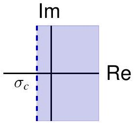

:::

::: {.column width="50%"}

 
 

例如： $\int_{0}^{\infty} e^{t^{2}} e^{-s t} \, dt$ 对所有 $s \in \mathbb{C}$ 发散，即 $\sigma_{c}=+\infty$

例如： $\int_{0}^{\infty} e^{-t^{2}} e^{-s t} \, dt$ 对所有 $s \in \mathbb{C}$ 收敛，即 $\sigma_{c}=-\infty$

例如： $\int_{0}^{\infty} e^{-s t} \, dt$ 的 $\sigma_{c}=0$
:::
::::

<!-- ## 单边拉普拉斯变换的绝对收敛

**定理** 若积分 $(\star)$ 在 $s=s_{0}$ 处绝对收敛，则对所有 $\operatorname{Re} s \geq \sigma_{0}$ 的 $s$ 也绝对且一致收敛。

**证明**

$$
\int_{0}^{\infty}|x(t) e^{-s t}| \, dt=\int_{0}^{\infty}|x(t)| e^{-\sigma t} \, dt \leq \int_{0}^{\infty}|x(t)| e^{-\sigma_{0} t} \, dt < \infty
$$

绝对收敛域（ROAC）同样是右半平面：

$$
\operatorname{ROAC}=\left\{s \in \mathbb{C}: \operatorname{Re} s>\sigma_{a}\right\}
$$

其中 $\sigma_{a}$ 是绝对收敛横坐标。

 -->

## 单边拉普拉斯变换的绝对收敛

**定理：** 若积分 $(\star)$ 在 $s = s_0 = \sigma_0 + j\omega_0$ 处绝对收敛，则对于所有满足 $\sigma \ge \sigma_0$ 的 $s = \sigma + j\omega$，该积分均绝对收敛且一致收敛。

**证明：**

$$\int_0^{\infty} |x(t)e^{-st}|dt = \int_0^{\infty} |x(t)|e^{-\sigma t}dt \le \int_0^{\infty} |x(t)|e^{-\sigma_0 t}dt < \infty$$

### 绝对收敛域 (ROAC)

与普通收敛的情况类似，**绝对收敛域 (Region of Absolute Convergence, ROAC)** 始终是一个右半平面：

:::: {.columns style="text-align: left;"}

::: {.column width="50%"}
$$\text{ROAC} = \{s \in \mathbb{C} : \text{Re } s > \sigma_a\}$$

其中：

*   **$\sigma_a \in \bar{\mathbb{R}}$** 称为**绝对收敛坐标**。
*   直线 **$\text{Re } s = \sigma_a$** 称为**绝对收敛轴**。

:::
::: {.column width="50%"}

:::
::::

::: {.notes}
注：在大多数物理可实现的工程系统中，收敛域 (ROC) 与绝对收敛域 (ROAC) 是重合的。
:::

<!-- ## 单边拉普拉斯变换的绝对收敛域（例子）

收敛轴与绝对收敛轴不必重合！

**例** 令 $k>0$，考虑 $x(t)=e^{k t} \sin(e^{k t})$。  
绝对收敛域为 $\operatorname{Re} s>k$，而普通收敛域为 $\operatorname{Re} s>0$（由 Dirichlet 判别法）。

**注**：在大多数情况下，我们直接使用 ROC（通常 ROC = ROAC）。 -->

## 单边拉普拉斯变换的绝对收敛域

**收敛轴** 与 **绝对收敛轴** **并不一定重合**！

**示例：** 
令 $k > 0$。为了观察到 $\sigma_a = k$，考虑以下积分：
$$\int_0^\infty e^{kt} \sin(e^{kt}) e^{-st} dt$$

当 $\text{Re } s > k$ 时，该积分绝对收敛。因为对于 $s = \sigma + j\omega$：
$$\left| e^{kt} \sin(e^{kt}) e^{-st} \right| \le e^{-(\sigma-k)t} \in L_1[0, \infty)$$

:::: {.columns style="text-align: left;"}

::: {.column width="75%"}

当 $s = k$ 时，积分**并非绝对收敛**，因为：$\int_0^\infty |\sin(e^{kt})| dt = \frac{1}{k} \int_1^\infty \frac{|\sin u|}{u} du = \infty$

设 $s = \sigma \in \mathbb{R}$，则有：$\int_0^\infty e^{kt} \sin(e^{kt}) e^{-\sigma t} dt = \frac{1}{k} \int_1^\infty \frac{\sin u}{u^{\sigma/k}} du$

根据 **Dirichlet 判别法**，可以得出其收敛轴为：
$\sigma_c = 0$

### 结论

*   **绝对收敛轴**：$\sigma_a = k$
*   **收敛轴**：$\sigma_c = 0$

:::
::: {.column width="25%"}  

:::
::::

**注意：** 尽管在大多数情况下 $\text{ROC} = \text{ROAC}$，但在后续讨论中，我们将统一使用 **ROC**  这一术语。

## 双边拉普拉斯变换的收敛域

积分 $$\int_{0}^{\infty} x(t) e^{-s t} \, dt$$ 的收敛域是右半平面 $\operatorname{Re} s>\sigma_{1}$。

积分 $$\int_{-\infty}^{0} x(t) e^{-s t} \, dt = \int_{0}^{\infty} x(-t) e^{-(-s) t} \, dt$$ 的收敛域是左半平面 $$\operatorname{Re} s<\sigma_{2}$$

因此双边拉普拉斯变换

$$
X(s)=\int_{-\infty}^{\infty} x(t) e^{-s t} \, dt
$$

的收敛域是一个带状区域 $\sigma_{1} < \operatorname{Re} s < \sigma_{2}$，当且仅当 $\sigma_{1} < \sigma_{2}$ 时非空。

## 有理拉普拉斯变换

有理变换 $X(s)$ 具有以下形式

$$
X(s)=\frac{N(s)}{D(s)}
$$

其中 $N(s)$ 和 $D(s)$ 是互质的多项式（即没有次数 $\geq 1$ 的公因子）。

由代数基本定理，

$$
X(s)=A \frac{\prod_{k=1}^{n}\left(s-z_{k}\right)}{\prod_{k=1}^{m}\left(s-p_{k}\right)}
$$

约定 $\prod_{k=1}^{0} \cdot =1$。

- $z_{1}, \ldots, z_{n}$ 是 $X(s)$ 的有限零点；
- $p_{1}, \ldots, p_{m}$ 是 $X(s)$ 的有限极点；
- 若 $n>m$，则 $X(s)$ 在 $\infty$ 处有 $n-m$ 阶极点；
- 若 $n<m$，则 $X(s)$ 在 $\infty$ 处有 $m-n$ 阶零点。

## 拉普拉斯变换及其收敛域

收敛域 (ROC) 的基本性质

在分析有理拉普拉斯变换时，收敛域具有以下核心几何特性：

::: {.callout-note icon=false}
### 性质 1
$X(s)$ 的收敛域在 $s$ 平面内由**平行于 $j\omega$ 轴的带状区域**所组成。
:::

::: {.callout-note icon=false}
### 性质 2
对于有理拉普拉斯变换来说，**收敛域内不包括任何极点**。
:::

*   **关于性质 1**：由于收敛性仅取决于信号的指数衰减/增长速率（即 $s = \sigma + j\omega$ 中的实部 $\sigma$），而与频率 $\omega$ 无关，因此 ROC 表现为垂直的带状、左半平面或右半平面。
*   **关于性质 2**：极点是使 $X(s)$ 趋于无穷大的点，代表了积分发散的临界位置。因此，ROC 的边界必然由极点确定，但其内部绝不会包含极点。

## 拉普拉斯变换及其收敛域

收敛域 (ROC) 的性质 3

对于时域表现特殊的信号，其收敛域具有如下结论：

::: {.callout-important icon=false}
### 性质 3
如果 $x(t)$ 是**有限持续期**的，并且是**绝对可积**的，那么其收敛域就是**整个 $s$ 平面**。
:::

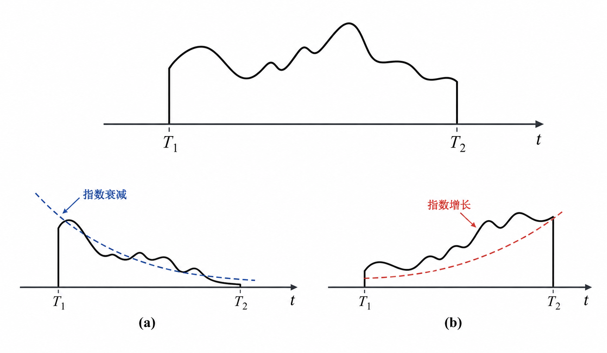

*   **有限持续期信号定义**：指信号只在有限的时间区间 $[T_1, T_2]$ 内有值，而在该区间外恒为零。 
*   **物理直观理解**：
    *   因为信号在时间上是有限的，它不会像 $e^{at}$ 那样在 $t \to \infty$ 时无限增长。
    *   在计算积分 $\int_{t_1}^{t_2} x(t)e^{-st}dt$ 时，由于积分区间是有限的，只要 $x(t)$ 本身不发散，无论 $s$ 取什么复数值，乘上 $e^{-st}$ 后的积分结果始终是一个有限值。

## 拉普拉斯变换及其收敛域

收敛域 (ROC) 的性质 4

对于工程中最常见的信号类型，其收敛域具有如下关键特性：

::: {.callout-tip icon=false}
### 性质 4
如果 $x(t)$ 是**右边信号**，并且 $\text{Re}\{s\} = \sigma_0$ 这条线位于收敛域内，那么 $\text{Re}\{s\} > \sigma_0$ 的全部 $s$ 值都一定在收敛域内。
:::

:::: {.columns style="text-align: left;"}

::: {.column width="50%"}

*   **右边信号 (Right-sided Signal)**：指信号在某个有限时间 $T_1$ 之前恒为零（即当 $t < T_1$ 时，$x(t) = 0$）。常见的因果信号（从 $t=0$ 开始）就是典型的右边信号。
*   **几何表现**：性质 4 表明右边信号的 ROC 总是表现为 $s$ 平面上的一条垂直线及其右侧的全部区域。
*   **与极点的关系**：结合性质 2，我们可以推论出：右边信号的 ROC 必然是位于**最右侧极点**右边的右半平面。

:::
::: {.column width="50%"}

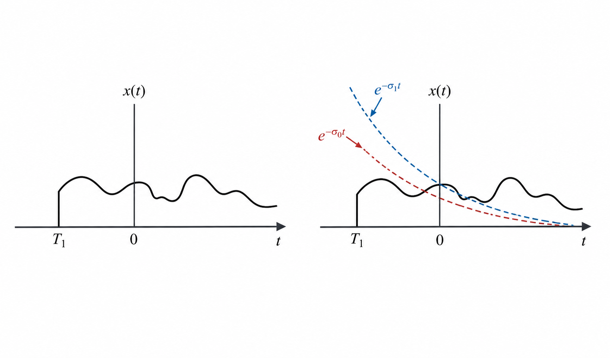

:::
::::

## 拉普拉斯变换及其收敛域

与右边信号相对，左边信号的收敛域具有如下特性：

::: {.callout-tip icon=false}
### 性质 5
如果 $x(t)$ 是**左边信号**，并且 $\text{Re}\{s\} = \sigma_0$ 这条线位于收敛域内，那么 $\text{Re}\{s\} < \sigma_0$ 的全部 $s$ 值也一定在收敛域内。
:::

:::: {.columns style="text-align: left;"}

::: {.column width="75%"}

*   **左边信号 (Left-sided Signal)**：指信号在某个有限时间 $T_2$ 之后恒为零（即当 $t > T_2$ 时，$x(t) = 0$）。
*   **几何形状**：左边信号的 ROC 表现为 $s$ 平面上某条垂直线及其**左侧**的全部区域。
*   **物理意义**：
    *   对于左边信号，为了保证积分 $\int_{-\infty}^{T_2} x(t)e^{-st}dt$ 收敛，需要 $e^{-st}$ 在 $t \to -\infty$ 时衰减得足够快。
    *   这意味着 $s$ 的实部必须足够小（即足够负），从而抵消信号在负无穷方向可能的增长。

:::
::: {.column width="25%"}

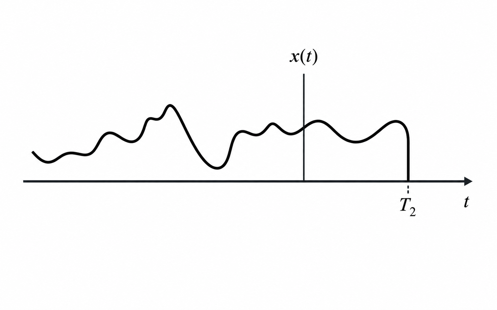

:::
::::

### 总结与对比

| 信号类型 | 时域特征 | ROC 形状 | 边界判定 |
| :--- | :--- | :--- | :--- |
| **右边信号** | $t > T_1$ 有值 | 右半平面 | 最右极点之右 |
| **左边信号** | $t < T_2$ 有值 | 左半平面 | 最左极点之左 |

## 拉普拉斯变换及其收敛域

对于向时间两端无限延伸的信号，其收敛域具有如下特性：

::: {.callout-tip icon=false}
### 性质 6
如果 $x(t)$ 是**双边信号**，并且 $\text{Re}\{s\} = \sigma_0$ 这条线位于收敛域内，那么收敛域就一定由 $s$ 平面的**一条带状区域**组成，直线 $\text{Re}\{s\} = \sigma_0$ 位于带中。
:::

:::: {.columns style="text-align: left;"}

::: {.column width="75%"}

*   **双边信号 (Two-sided Signal)**：指在 $t \to \infty$ 和 $t \to -\infty$ 时均有值的信号。
*   **形成原理**：
    *   双边信号可以拆分为一个**右边信号**和一个**左边信号**之和。
    *   总的收敛域是这两部分收敛域的**交集**。
    *   右边部分贡献了一个向右延伸的半平面，左边部分贡献了一个向左延伸的半平面，两者相交即形成“带状”区域。
*   **与极点的关系**：双边信号的 ROC 位于其两组极点之间，且内部不包含任何极点。

:::
::: {.column width="25%"}

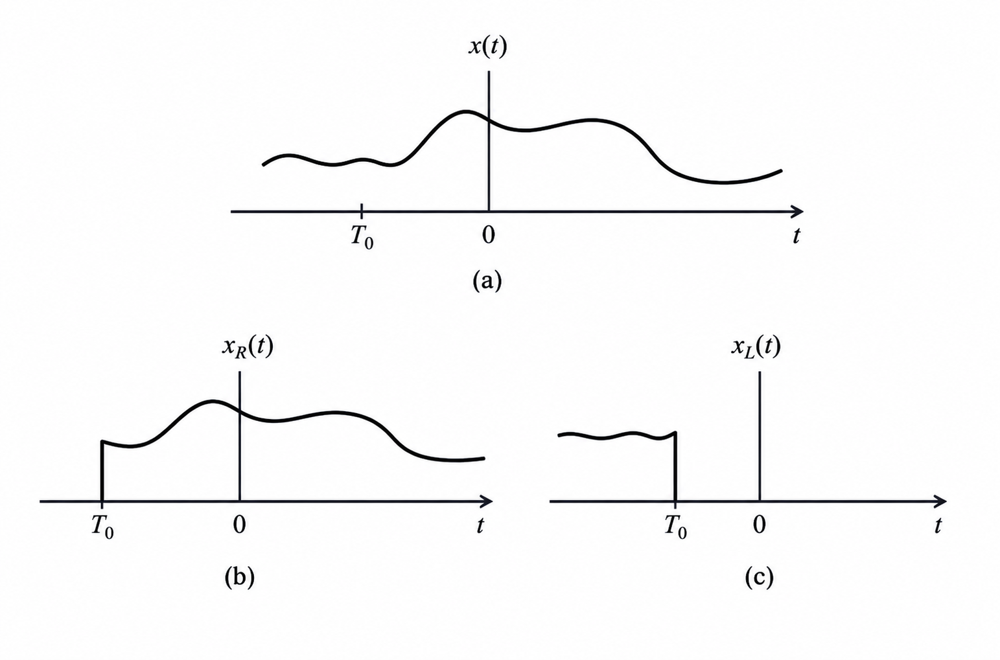
:::
::::

### 常见信号 ROC 总结对照

| 信号类型 | 时域范围 | ROC 几何特征 |
| :--- | :--- | :--- |
| **有限持续期** | $T_1 < t < T_2$ | 整个 $s$ 平面 |
| **右边信号** | $t > T_1$ | 右半平面 |
| **左边信号** | $t < T_2$ | 左半平面 |
| **双边信号** | $-\infty < t < \infty$ | 带状区域 |

## 例

:::: {.columns style="text-align: left;"}

::: {.column width="80%"}

对于 $x(t)=e^{-a t} u(t)$，

$$
X(s)=\int_{-\infty}^{\infty} e^{-a t} u(t) e^{-s t} \, dt=\int_{0}^{\infty} e^{-a t} e^{-s t} \, dt=\lim _{T \rightarrow \infty} \frac{1-e^{-(s+a) T}}{s+a}=\frac{1}{s+a},
$$

收敛域为 $\operatorname{Re} s>-\operatorname{Re} a$。

若 $\operatorname{Re} a>0$，收敛域包含虚轴，

$$
\mathcal{F}\{x\}(j \omega)=\left.X(s)\right|_{s=j \omega}=\frac{1}{j \omega+a}
$$

若 $\operatorname{Re} a<0$，连续时间傅里叶变换不存在。

若 $\operatorname{Re} a=0$，连续时间傅里叶变换仅以分布形式存在，

$$
a=j \omega_{0} \Longrightarrow \mathcal{F}\{x\}\left(e^{j \omega}\right)=\frac{1}{j\left(\omega+\omega_{0}\right)}+\pi \delta\left(\omega+\omega_{0}\right) \neq\left. X(s)\right|_{s=j \omega}
$$

:::
::: {.column width="20%"}

 
 
 

:::
::::

## 例

:::: {.columns style="text-align: left;"}

::: {.column width="80%"}

对于 $x(t)=-e^{-a t} u(-t)$，

$$
X(s)=-\int_{-\infty}^{0} e^{-a t} e^{-s t} \, dt=\lim _{T \rightarrow \infty} \frac{1-e^{(s+a) T}}{s+a}=\frac{1}{s+a},
$$

收敛域为 $\operatorname{Re} s<-\operatorname{Re} a$。

若 $\operatorname{Re} a<0$，收敛域包含虚轴，

$$
\mathcal{F}\{x\}(j \omega)=\left.X(s)\right|_{s=j \omega}=\frac{1}{j \omega+a}
$$

若 $\operatorname{Re} a>0$，连续时间傅里叶变换不存在。

若 $\operatorname{Re} a=0$，连续时间傅里叶变换仅以分布形式存在，

$$
a=j \omega_{0} \Longrightarrow \mathcal{F}\{x\}\left(e^{j \omega}\right)=\frac{1}{j\left(\omega+\omega_{0}\right)}+\pi \delta\left(\omega+\omega_{0}\right) \neq\left. X(s)\right|_{s=j \omega}
$$
:::
::: {.column width="20%"}
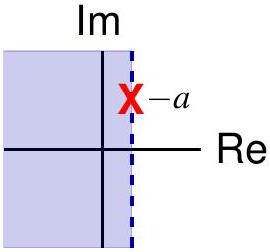

 
 
 

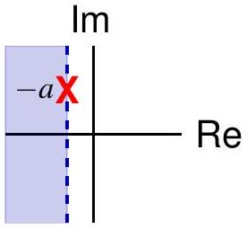
:::
::::

## 收敛域的重要性

:::: {.columns style="text-align: left;"}

::: {.column width="80%"}

$x_{1}(t)=e^{-a t} u(t) \stackrel{\mathcal{L}}{\longleftrightarrow} X_{1}(s)=\frac{1}{s+a}$，  
ROC $\operatorname{Re} s>-\operatorname{Re} a$

$x_{2}(t)=-e^{-a t} u(-t) \stackrel{\mathcal{L}}{\longleftrightarrow} X_{2}(s)=\frac{1}{s+a}$，  
ROC $\operatorname{Re} s<-\operatorname{Re} a$

 
 
 

**不同的信号可以有相同的 $X(s)$ 但不同的收敛域。**

:::
::: {.column width="20%"}

 
 
 

:::
::::

**拉普拉斯变换必须始终指明收敛域！**

## 例

:::: {.columns style="text-align: left;"}

::: {.column width="70%"}

对于 $x(t)=3 e^{-2 t} u(t)-2 e^{-t} u(t)$，

$$
\begin{aligned}
X(s) & =\int_{0}^{\infty}\left[3 e^{-2 t} u(t)-2 e^{-t} u(t)\right] e^{-s t} \, dt \\
& =\frac{3}{s+2}-\frac{2}{s+1} \\
& =\frac{s-1}{(s+2)(s+1)}
\end{aligned}
$$

收敛域 $\operatorname{Re} s>-1$。

有两个简单极点：$s=-2$ 和 $s=-1$；  
一个简单零点：$s=1$；  
在 $\infty$ 处还有一个简单零点。

:::
::: {.column width="30%"}

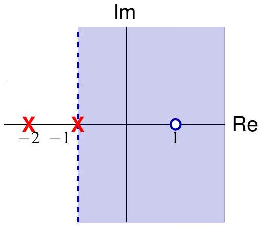

:::
::::

## 例

:::: {.columns style="text-align: left;"}

::: {.column width="70%"}

对于 $x(t)=e^{-2 t} u(t)+e^{-t} \cos (3 t) u(t)=e^{-2 t}+\frac{1}{2} e^{-(1-3 j) t}+\frac{1}{2} e^{-(1+3 j) t}$，

$$
\begin{aligned}
X(s) & =\frac{1}{s+2}+\frac{1}{2} \frac{1}{s+(1-3 j)}+\frac{1}{2} \frac{1}{s+(1+3 j)} \\
& =\frac{2 s^{2}+5 s+12}{\left(s^{2}+2 s+10\right)(s+1)} \\
& =\frac{\left(s+\frac{5+j \sqrt{71}}{4}\right)\left(s+\frac{5-j \sqrt{71}}{4}\right)}{(s+2)(s+1-3 j)(s+1+3 j)}
\end{aligned}
$$

收敛域 $\operatorname{Re} s>-1$。

简单极点位于 $s=-2$ 和 $s=-1 \pm 3 j$；  
简单零点位于 $s=\frac{-5 \pm j \sqrt{71}}{4}$；  
在 $\infty$ 处还有一个简单零点。

:::
::: {.column width="30%"}

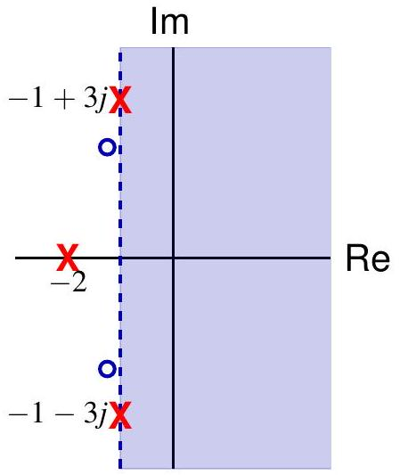

:::
::::

<!-- ## 有理拉普拉斯变换

有理函数 $X(s)$ 由其在 $\mathbb{C}$ 中的零点和极点（包括阶数）唯一确定（相差一个常数倍数）。

有理拉普拉斯变换由其极零点图和收敛域唯一确定（相差一个常数倍数）。

**例**

$$
X(s)=A \frac{(s-1)^{2}}{(s+1)(s-2)}
$$

存在三种可能的收敛域：

:::: {.columns style="text-align: left;"}

::: {.column width="70%"}

- $\operatorname{Re} s<-1$
- $-1<\operatorname{Re} s<2$
- $\operatorname{Re} s>2$

:::

::: {.column width="30%"}

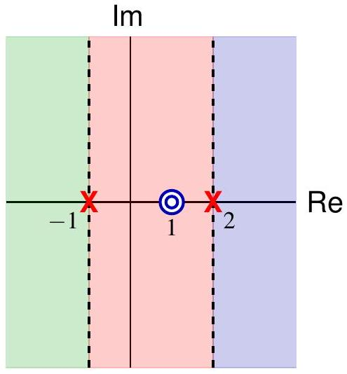
:::
::::

 -->

<!-- ## 收敛域的性质

- $X(s)$ 在其收敛域内解析，且

$$
f^{(k)}(s)=\int_{-\infty}^{\infty} (-t)^{k} x(t) e^{-s t} \, dt
$$

- 若 $x(t)$ 是有限时长的且属于 $L_1$，则收敛域为整个 $\mathbb{C}$；
- 若 $x(t)$ 是左边信号，其收敛域是左半平面；
- 若 $x(t)$ 是右边信号，其收敛域是右半平面；
- 若 $x(t)$ 是双边信号，其收敛域是一个带状区域。

 

:::: {.columns style="text-align: center;"}

::: {.column width="33%"}

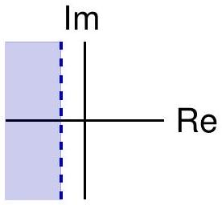
:::

::: {.column width="34%"}

:::

::: {.column width="33%"}

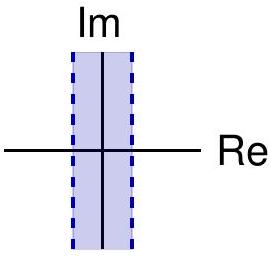

:::

:::: -->

## 例

:::: {.columns style="text-align: left;"}

::: {.column width="75%"}

考虑 $x(t)=e^{-b|t|}=e^{-b t} u(t)+e^{b t} u(-t)$。已知

$$
\begin{aligned}
& e^{-b t} u(t) \stackrel{\mathcal{L}}{\longleftrightarrow} \frac{1}{s+b}, \quad \operatorname{Re} s>-b \\
& e^{b t} u(-t) \stackrel{\mathcal{L}}{\longleftrightarrow} \frac{-1}{s-b}, \quad \operatorname{Re} s<b
\end{aligned}
$$

因此

$$
x(t)=e^{-b|t|} \stackrel{\mathcal{L}}{\longleftrightarrow} \frac{1}{s+b}-\frac{1}{s-b}=\frac{-2b}{s^{2}-b^{2}}, \quad -b < \operatorname{Re} s < b
$$

收敛域非空的条件是 $b>0$。

**注**：拉普拉斯变换存在要求 $x(t)$ 在 $t\to +\infty$ 或 $t\to -\infty$ 时必须足够快地衰减。$e^{-s t}$ 的指数加权无法同时抑制两端。

:::
::: {.column width="25%"}

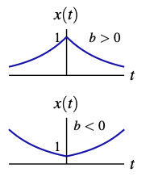{width="80%"}

:::
::::

<!-- ## 收敛域的性质（有理情况）

- 若 $X(s)$ 是有理函数，收敛域由极点界定或延伸至无穷远；

:::: {.columns style="text-align: left;"}

::: {.column width="75%"}
- 若 $x(t)$ 同时是右边信号，则收敛域为由最右侧极点为界的右半平面（例如区域 III）；
- 若 $x(t)$ 同时是左边信号，则收敛域为由最左侧极点为界的左半平面（例如区域 I）。

:::
::: {.column width="25%"}

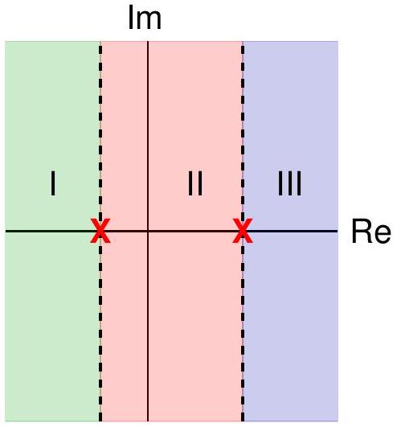

:::
:::: -->

## 目录 {#toc2}

- [1. 引言](#sec81)
- [2. 拉普拉斯变换及其收敛域](#sec82)
- [**3. 拉普拉斯逆变换**](#sec83)
- [4. 拉普拉斯变换的性质](#sec84)
- [5. 常用拉普拉斯变换对](#sec85)
- [6. 由零极点图对傅里叶变换几何求值](#sec86)
- [7. 用拉普拉斯变换分析和表征线性时不变系统](#sec87)
- [8. 单边拉普拉斯变换](#sec88)

# 拉普拉斯逆变换 {#sec83}

## 拉普拉斯逆变换

回忆拉普拉斯变换与连续时间傅里叶变换的关系：

$$
X(\sigma + j\omega) = \int_{-\infty}^{\infty} \{x(t) e^{-\sigma t}\} e^{-j\omega t} \, dt = \mathcal{F}\{x(t) e^{-\sigma t}\}
$$

对 $s=\sigma + j\omega \in \mathrm{ROC}$ 取傅里叶逆变换：

$$
x(t) e^{-\sigma t} = \frac{1}{2\pi} \int_{-\infty}^{\infty} X(\sigma + j\omega) e^{j\omega t} \, d\omega
$$

因此

$$
x(t) = \frac{1}{2\pi} \int_{-\infty}^{\infty} X(\sigma + j\omega) e^{(\sigma + j\omega) t} \, d\omega
$$

或

$$
x(t) = \frac{1}{j 2\pi} \int_{\sigma - j\infty}^{\sigma + j\infty} X(s) e^{s t} \, ds = \lim_{A\to\infty} \frac{1}{j 2\pi} \int_{\sigma - j A}^{\sigma + j A} X(s) e^{s t} \, ds
$$

## 部分分式展开求逆变换

对于有理拉普拉斯变换，可通过部分分式展开求逆变换。

一个严格真有理函数的部分分式展开形式为

$$
R(s) = \sum_{i=1}^{r} \sum_{k_{i}=1}^{N_{i}} \frac{A_{i,k_{i}}}{(s + a_{i})^{k_{i}}}
$$

同时

$$
\begin{aligned}
\frac{t^{n-1}}{(n-1)!} e^{-a t} u(t) &\stackrel{\mathcal{L}}{\longleftrightarrow} \frac{1}{(s+a)^{n}}, && \operatorname{Re} s > -a \\
-\frac{t^{n-1}}{(n-1)!} e^{-a t} u(-t) &\stackrel{\mathcal{L}}{\longleftrightarrow} \frac{1}{(s+a)^{n}}, && \operatorname{Re} s < -a
\end{aligned}
$$

由线性性质，$\mathcal{L}^{-1}\{R\}$ 是上述形式各项的线性组合，符号根据 ROC 选取。

## 例

考虑有理拉普拉斯变换 $X(s)=\frac{1}{(s+1)(s+2)^{2}}$

$$
X(s) = \frac{1}{s+1} + \frac{-1}{s+2} + \frac{-1}{(s+2)^{2}}
$$

极点位于 $s=-1$ 和 $s=-2$。

1. 若 ROC 为 $\operatorname{Re} s > -1$

$$
x(t) = e^{-t} u(t) - (1+t) e^{-2t} u(t)
$$

2. 若 ROC 为 $\operatorname{Re} s < -2$

$$
x(t) = -e^{-t} u(-t) + (1+t) e^{-2t} u(-t)
$$

3. 若 ROC 为 $-2 < \operatorname{Re} s < -1$

$$
x(t) = -e^{-t} u(-t) - (1+t) e^{-2t} u(t)
$$

## 围线积分求逆变换

假设 $X(s)$ 有有限个有限孤立奇点 $s_{1},\dots,s_{n}$，且 ROC 为 $-\infty \leq \sigma_{1} < \operatorname{Re} s < \sigma_{2} \leq +\infty$。

逆变换为

$$
x(t) = \lim_{r\to\infty} \frac{1}{j 2\pi} \int_{\sigma - j r}^{\sigma + j r} X(s) e^{s t} \, ds
$$

:::: {.columns style="text-align: left;"}
::: {.column width="80%}

其中 $\sigma_{1} < \sigma < \sigma_{2}$。

对于 $t>0$，选取一个包含所有 $\operatorname{Re} s \leq \sigma_{1}$ 的奇点 $s_{k}$ 的大半圆 $C_{r}$。

若 $X(s)$ 满足 Jordan 引理，由留数定理得

$$
x(t) = \sum_{k: \operatorname{Re} s_{k} \leq \sigma_{1}} \operatorname{Res}[X(s) e^{s t}, s_{k}], \quad t>0
$$

（对严格真有理函数成立）

:::

::: {.column width="20%}

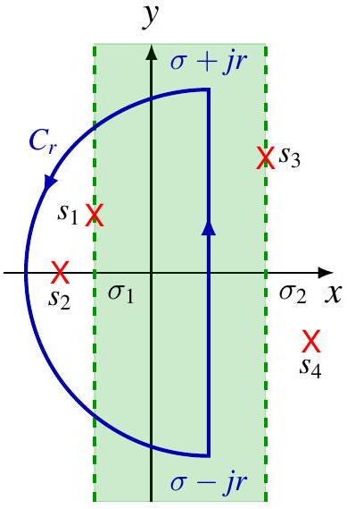
:::
::::

## 围线积分求逆变换

对于 $t<0$，选取包含所有 $\operatorname{Re} s \geq \sigma_{2}$ 的奇点的大半圆。

:::: {.columns style="text-align: left;"}
::: {.column width="80%}

由留数定理得

$$
x(t) = -\sum_{k: \operatorname{Re} s_{k} \geq \sigma_{2}} \operatorname{Res}[X(s) e^{s t}, s_{k}], \quad t<0
$$
**注意**：负号源于围线的负方向。

:::

::: {.column width="20%}

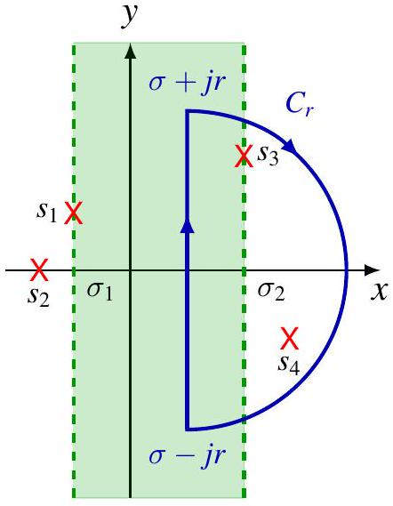

:::
::::

## 例

考虑 $X(s)=\frac{1}{(s+1)(s+2)^{2}}$

$$
\begin{gathered}
\operatorname{Res}[X(s) e^{s t}, -1] = \left.\frac{e^{s t}}{(s+2)^{2}}\right|_{s=-1} = e^{-t} \\
\operatorname{Res}[X(s) e^{s t}, -2] = \left[\frac{d}{ds} \frac{e^{s t}}{s+1}\right]_{s=-2} = -(1+t) e^{-2t}
\end{gathered}
$$

1. 若 ROC 为 $\operatorname{Re} s > -1$，则 $\sigma_{1}=-1$，$\sigma_{2}=+\infty$。

$t>0$ 时：

$$
x(t) = e^{-t} - (1+t) e^{-2t}
$$

$t<0$ 时：

$$
x(t) = 0
$$

## 例（续）

考虑 $X(s)=\frac{1}{(s+1)(s+2)^{2}}$

$$
\begin{gathered}
\operatorname{Res}[X(s) e^{s t}, -1] = \left.\frac{e^{s t}}{(s+2)^{2}}\right|_{s=-1} = e^{-t} \\
\operatorname{Res}[X(s) e^{s t}, -2] = \left[\frac{d}{ds} \frac{e^{s t}}{s+1}\right]_{s=-2} = -(1+t) e^{-2t}
\end{gathered}
$$

2. 若 ROC 为 $\operatorname{Re} s < -2$，则 $\sigma_{1}=-\infty$，$\sigma_{2}=-2$。

$t>0$ 时：$x(t)=0$

$t<0$ 时：

$$
x(t) = -e^{-t} + (1+t) e^{-2t}
$$

## 例（续）

考虑 $X(s)=\frac{1}{(s+1)(s+2)^{2}}$

$$
\begin{gathered}
\operatorname{Res}[X(s) e^{s t}, -1] = \left.\frac{e^{s t}}{(s+2)^{2}}\right|_{s=-1} = e^{-t} \\
\operatorname{Res}[X(s) e^{s t}, -2] = \left[\frac{d}{ds} \frac{e^{s t}}{s+1}\right]_{s=-2} = -(1+t) e^{-2t}
\end{gathered}
$$

3. 若 ROC 为 $-2 < \operatorname{Re} s < -1$，则 $\sigma_{1}=-2$，$\sigma_{2}=-1$。

$t>0$ 时：

$$
x(t) = -(1+t) e^{-2t}
$$

$t<0$ 时：

$$
x(t) = -e^{-t}
$$

## 目录 {#toc3}

- [1. 引言](#sec81)
- [2. 拉普拉斯变换及其收敛域](#sec82)
- [3. 拉普拉斯逆变换](#sec83)
- [**4. 拉普拉斯变换的性质**](#sec84)
- [5. 常用拉普拉斯变换对](#sec85)
- [6. 由零极点图对傅里叶变换几何求值](#sec86)
- [7. 用拉普拉斯变换分析和表征线性时不变系统](#sec87)
- [8. 单边拉普拉斯变换](#sec88)

# 拉普拉斯变换的性质 {#sec84}

## 线性性质

若

$$
\begin{array}{ll}
x(t) \stackrel{\mathcal{L}}{\longleftrightarrow} X(s) & \text{收敛域}=R_{1} \\
y(t) \stackrel{\mathcal{L}}{\longleftrightarrow} Y(s) & \text{收敛域}=R_{2}
\end{array}
$$

则

$$
a x(t)+b y(t) \stackrel{\mathcal{L}}{\longleftrightarrow} a X(s)+b Y(s) \quad \text{收敛域} \supset R_{1} \cap R_{2}
$$

**注**：实际收敛域可能比 $R_1 \cap R_2$ 大。

 

**例** 
 
 
$x(t)=\cos(\omega_0 t) u(t)$ 的拉普拉斯变换为 $\frac{s}{s^2+\omega_0^2}$，收敛域 $\operatorname{Re} s>0$；  

 
 
$\sin(\omega_0 t) u(t)$ 的拉普拉斯变换为 $\frac{\omega_0}{s^2+\omega_0^2}$，收敛域 $\operatorname{Re} s>0$。

## 线性性质（例子）

$X_1(s)=\frac{1}{s+1}$，$\operatorname{Re} s>-1$；  
$X_2(s)=\frac{1}{(s+1)(s+2)}$，$\operatorname{Re} s>-1$；

$$
X(s)=X_1(s)-X_2(s)=\frac{1}{s+2}, \quad \operatorname{Re} s>-2
$$

由于 $s=-1$ 处的极零点抵消，收敛域扩大了。

时域中：

$x_1(t)=e^{-t} u(t)$，$x_2(t)=e^{-t} u(t)-e^{-2t} u(t)$，  
$x(t)=e^{-2t} u(t)$。

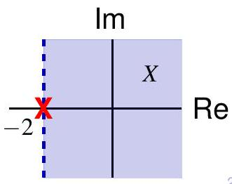

## 时移性质

若

$$
x(t) \stackrel{\mathcal{L}}{\longleftrightarrow} X(s), \quad \sigma_{1}<\operatorname{Re} s<\sigma_{2}
$$

则

$$
x(t-t_0) \stackrel{\mathcal{L}}{\longleftrightarrow} e^{-s t_0} X(s), \quad \sigma_{1}<\operatorname{Re} s<\sigma_{2}
$$

**例**

$$
? \stackrel{\mathcal{L}}{\longleftrightarrow} \frac{e^{3s}}{s+2}, \quad \operatorname{Re} s>-2
$$

已知 $x(t)=e^{-2t} u(t) \stackrel{\mathcal{L}}{\longleftrightarrow} \frac{1}{s+2}$，则 $x(t+3)=e^{-2(t+3)} u(t+3)$ 对应上述变换。

## $s$ 域平移性质

若

$$
x(t) \stackrel{\mathcal{L}}{\longleftrightarrow} X(s), \quad \sigma_{1}<\operatorname{Re} s<\sigma_{2}
$$

则

$$
e^{s_0 t} x(t) \stackrel{\mathcal{L}}{\longleftrightarrow} X(s-s_0), \quad \sigma_{1}+\operatorname{Re} s_0 < \operatorname{Re} s < \sigma_{2}+\operatorname{Re} s_0
$$

**例** 对于实数 $\alpha$，

$$
\begin{aligned}
e^{-\alpha t} \cos(\omega_0 t) u(t) &\stackrel{\mathcal{L}}{\longleftrightarrow} \frac{s+\alpha}{(s+\alpha)^2+\omega_0^2}, && \operatorname{Re} s>-\alpha \\
e^{-\alpha t} \sin(\omega_0 t) u(t) &\stackrel{\mathcal{L}}{\longleftrightarrow} \frac{\omega_0}{(s+\alpha)^2+\omega_0^2}, && \operatorname{Re} s>-\alpha
\end{aligned}
$$

## 时间尺度变换

若

$$
x(t) \stackrel{\mathcal{L}}{\longleftrightarrow} X(s), \quad \sigma_{1}<\operatorname{Re} s<\sigma_{2}
$$

则对 $a \in \mathbb{R} \setminus \{0\}$，

$$
x(a t) \stackrel{\mathcal{L}}{\longleftrightarrow} \frac{1}{|a|} X\left(\frac{s}{a}\right), \quad \sigma_{1} < \frac{1}{a} \operatorname{Re} s < \sigma_{2}
$$

时间反转时：

$$
x(-t) \stackrel{\mathcal{L}}{\longleftrightarrow} X(-s), \quad -\sigma_{2} < \operatorname{Re} s < -\sigma_{1}
$$

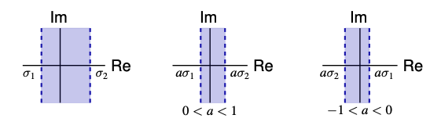{fig-align="center"}

## 共轭性质

若

$$
x(t) \stackrel{\mathcal{L}}{\longleftrightarrow} X(s), \quad \sigma_{1}<\operatorname{Re} s<\sigma_{2}
$$

则

$$
x^*(t) \stackrel{\mathcal{L}}{\longleftrightarrow} X^*(s^*), \quad \sigma_{1}<\operatorname{Re} s<\sigma_{2}
$$

若 $x(t)$ 为实信号，则 $X(s)=X^*(s^*)$，零点和极点以共轭对形式出现。

:::: {.columns style="text-align: left;"}

::: {.column width="65%"}

**例**

$$
x(t)=e^{-2t} u(t)+e^{-t} \cos(3t) u(t)
$$

$$
X(s)=\frac{\left(s+\frac{5+j\sqrt{71}}{4}\right)\left(s+\frac{5-j\sqrt{71}}{4}\right)}{(s+2)(s+1-3j)(s+1+3j)}
$$

收敛域 $\operatorname{Re} s>-1$。

:::
::: {.column width="35%"}

:::
::::
## 卷积性质

若

$$
\begin{array}{ll}
x(t) \stackrel{\mathcal{L}}{\longleftrightarrow} X(s) & \text{ROAC}=R_1 \\
y(t) \stackrel{\mathcal{L}}{\longleftrightarrow} Y(s) & \text{ROAC}=R_2
\end{array}
$$

则

$$
(x*y)(t) \stackrel{\mathcal{L}}{\longleftrightarrow} X(s)Y(s) \quad \text{ROAC} \supset R_1 \cap R_2
$$

更精确的定理：若两者在 $s_0$ 处绝对收敛，则卷积的变换在 $s_0$ 处也绝对收敛，且 $X(s_0)Y(s_0)=Z(s_0)$。

**定理：** 若 $X(s) = \int_{-\infty}^{\infty} x(t)e^{-st}dt$ 和 $Y(s) = \int_{-\infty}^{\infty} y(t)e^{-st}dt$ 在某个 $s = s_0$ 处均**绝对收敛**，则 $z = x * y$ 的拉普拉斯变换在 $s = s_0$ 处也绝对收敛，且满足：

$$X(s_0)Y(s_0) = Z(s_0) = \int_{-\infty}^{\infty} z(t)e^{-s_0t}dt$$

## 卷积性质（证明与例子）

**证明**（利用 Fubini 定理交换积分顺序）。

$$
\begin{aligned}
X(s)Y(s) &= \int_{-\infty}^{\infty} x(v) \left[ \int_{-\infty}^{\infty} y(\tau)e^{-s(v+\tau)} d\tau \right] dv \\
&= \int_{-\infty}^{\infty} x(v) \left[ \int_{-\infty}^{\infty} y(t-v)e^{-st} dt \right] dv \quad (令 \, t = v + \tau) \\
&= \int_{-\infty}^{\infty} \left[ \int_{-\infty}^{\infty} x(v)y(t-v) dv \right] e^{-st} dt \quad (\text{根据 Fubini 定理})
\end{aligned}
$$

由此可见，上式右端即为卷积信号 $z(t) = (x * y)(t)$ 的拉普拉斯变换 $Z(s)$。

### 补充说明

**注意：** 卷积信号 $\mathcal{L}\{x * y\}$ 的 **绝对收敛域 (ROAC)** 可能会比 $\mathcal{L}\{x\}$ 和 $\mathcal{L}\{y\}$ 的公共绝对收敛域更宽。

::: {.notes}
这种情况通常发生在卷积过程中信号的某些发散分量被相互抵消（Pole-Zero Cancellation）时。
:::

**例** $X_1(s)=\frac{s+1}{(s+2)^2}$（ROAC $\operatorname{Re} s>-2$）与 $X_2(s)=\frac{1}{s+1}$（ROAC $\operatorname{Re} s>-1$）相乘后得到 $\frac{1}{(s+2)^2}$，ROAC 扩大到 $\operatorname{Re} s>-2$（因 $s=-1$ 处极零点抵消）。

## 时域微分性质

若

$$
x(t) \stackrel{\mathcal{L}}{\longleftrightarrow} X(s), \quad \text{收敛域}=R
$$

且 $\lim_{t\to\pm\infty} x(t)e^{-s t}=0$ 对 $s\in R$ 成立，则

$$
\frac{d}{dt}x(t) \stackrel{\mathcal{L}}{\longleftrightarrow} s X(s), \quad \text{收敛域} \supset R \cap R_0
$$

**证明：**

 
 
利用**分部积分法**可得：

$$
\int_{-\infty}^{\infty} x'(t)e^{-st} dt = \left. x(t)e^{-st} \right|_{-\infty}^{\infty} + s \int_{-\infty}^{\infty} x(t)e^{-st} dt = s \int_{-\infty}^{\infty} x(t)e^{-st} dt
$$

**注意 (NB)：** 微分运算可能导致收敛域 (ROC) **扩大**或**缩小**。

## 时域微分性质（例子）

**示例：**
考虑信号 $x(t) = (1 - e^{-t})u(t)$，其拉普拉斯变换为：
$$x(t) \stackrel{\mathcal{L}}{\longleftrightarrow} \frac{1}{s(s+1)}$$
此时其 $\text{ROC} = \text{ROAC}$ 为 $\text{Re } s > 0$。

对其求导得 $x'(t) = e^{-t}u(t)$，其变换为：
$$x'(t) \stackrel{\mathcal{L}}{\longleftrightarrow} \frac{1}{s+1}$$
此时其 $\text{ROC} = \text{ROAC}$ 为 $\text{Re } s > -1$。

**结论：** 在本例中，$\mathcal{L}\{x'\}$ 的收敛域比 $\mathcal{L}\{x\}$ 的收敛域更**大**。

## 时域微分性质（例子）

考虑信号 $x(t) = e^{kt} \sin(e^{kt})$，其中 $k > 0$。

*   对于 $s = \sigma \in \mathbb{R}$，令 $u = e^{kt}$ 进行变量代换可得：
    $$\int_{-\infty}^{\infty} x(t)e^{-st} dt = \frac{1}{k} \int_{0}^{\infty} \frac{\sin u}{u^{\sigma/k}} du = \frac{1}{k} \int_{0}^{1} \frac{\sin u}{u^{\sigma/k}} du + \frac{1}{k} \int_{1}^{\infty} \frac{\sin u}{u^{\sigma/k}} du$$

    *   $\int_{1}^{\infty} \frac{\sin u}{u^{\sigma/k}} du$ 的 **ROAC** 为 $\text{Re } s > k$，而 **ROC** 为 $\text{Re } s > 0$。
    *   当 $u \downarrow 0$ 时，$\frac{\sin u}{u^{\sigma/k}} \sim u^{1-\sigma/k}$，因此 $\int_{0}^{1} \frac{\sin u}{u^{\sigma/k}} du$ 的 **ROAC** 为 $\text{Re } s < 2k$。
    *   **综上所述**：$\mathcal{L}\{x\}$ 的 **ROAC** 为 $k < \text{Re } s < 2k$，其 **ROC** 为 $0 < \text{Re } s < 2k$。

计算导数 $x'(t) = ke^{kt} \sin(e^{kt}) + ke^{2kt} \cos(e^{kt})$。对于 $s = \sigma \in \mathbb{R}$：

$$\int_{-\infty}^{\infty} x'(t)e^{-st} dt = \int_{0}^{\infty} \frac{\sin u + u \cos u}{u^{\sigma/k}} du$$

*   $\mathcal{L}\{x'\}$ 的 **ROAC 为空集 (Empty)**。
*   其 **ROC** 为 $k < \text{Re } s < 2k$。

*   **注意**：在 $0 < \text{Re } s < k$ 的范围内，条件 $\lim_{t \to \pm\infty} x(t)e^{-st} = 0$ **无法满足**。
*   这个例子有力地证明了：虽然微分性质通常成立，但必须严格检查边界项以及 ROC 的重合情况。

## $s$ 域微分性质

<!-- 若

$$
x(t) \stackrel{\mathcal{L}}{\longleftrightarrow} X(s), \quad \sigma_1 < \operatorname{Re} s < \sigma_2
$$

则

$$
-t x(t) \stackrel{\mathcal{L}}{\longleftrightarrow} \frac{d}{ds} X(s), \quad \sigma_1 < \operatorname{Re} s < \sigma_2
$$

**例**

$$
e^{-a t} u(t) \stackrel{\mathcal{L}}{\longleftrightarrow} \frac{1}{s+a}, \quad \operatorname{Re} s > -a
$$

$$
t^n e^{-a t} u(t) \stackrel{\mathcal{L}}{\longleftrightarrow} \frac{n!}{(s+a)^{n+1}}, \quad \operatorname{Re} s > -a
$$

类似地，左边信号也有对应形式。 -->

若信号满足当 $t \to +\infty$ 时 $x(t) = O(e^{at})$，且当 $t \to -\infty$ 时 $x(t) = O(e^{bt})$，则：

$$x(t) \stackrel{\mathcal{L}}{\longleftrightarrow} X(s), \quad \text{其 ROAC 包含 } a < \text{Re } s < b$$

并且：

$$\frac{d}{dt}x(t) \stackrel{\mathcal{L}}{\longleftrightarrow} sX(s), \quad \text{其 ROC 包含 } a < \text{Re } s < b$$

*   **一般结论**：通常情况下，从 $\mathcal{L}\{x\}$ 在 $s = s_0$ 处的**绝对收敛**，我们只能推导出 $\mathcal{L}\{x'\}$ 在 $s = s_0$ 处的**普通收敛**。

*   **常见信号形式**：在工程实践中，我们主要处理形式为 $\sum_{k=0}^{m} p_k(t)e^{\alpha_k t}u(\pm t + \beta_k)$ 的信号，其中 $p_k$ 是多项式。在引入奇异函数（Singularity Functions）的拉普拉斯变换后，对于此类函数有：

$$\frac{d^n}{dt^n}x(t) \stackrel{\mathcal{L}}{\longleftrightarrow} s^n X(s), \quad \text{其 ROC 包含 } a < \text{Re } s < b$$

**理解导数项对 ROC 的影响至关重要**

*   **ROAC (绝对收敛域)**：通常对应于物理系统的能量有限性或稳定性边界。
*   **奇异函数**：如单位脉冲 $\delta(t)$ 及其导数的引入，使得我们能够统一处理包含初始状态跳变的高阶微分方程模型。

## $s$ 域微分性质

若
$$x(t) \stackrel{\mathcal{L}}{\longleftrightarrow} X(s), \quad \sigma_1 < \text{Re } s < \sigma_2$$
则
$$-tx(t) \stackrel{\mathcal{L}}{\longleftrightarrow} \frac{d}{ds}X(s), \quad \sigma_1 < \text{Re } s < \sigma_2$$

**证明**： （利用**积分号内求导**）

$$
\frac{d}{ds} \int_{-\infty}^{\infty} x(t)e^{-st} dt = \int_{-\infty}^{\infty} x(t) \frac{d}{ds} e^{-st} dt = \int_{-\infty}^{\infty} -tx(t)e^{-st} dt
$$

例如，已知：
$e^{-at}u(t) \stackrel{\mathcal{L}}{\longleftrightarrow} \frac{1}{s+a}, \quad \text{Re } s > -a$

利用上述性质，可推得：
$t^n e^{-at}u(t) \stackrel{\mathcal{L}}{\longleftrightarrow} \left( -\frac{d}{ds} \right)^n \frac{1}{s+a} = \frac{n!}{(s+a)^{n+1}}, \quad \text{Re } s > -a$

同理：
$$-t^n e^{-at}u(-t) \stackrel{\mathcal{L}}{\longleftrightarrow} \frac{n!}{(s+a)^{n+1}}, \quad \text{Re } s < -a$$

<!-- ## 卷积性质

若

$$
\begin{array}{ll}
x(t) \stackrel{\mathcal{L}}{\longleftrightarrow} X(s) & \text{ROAC}=R_{1} \\
y(t) \stackrel{\mathcal{L}}{\longleftrightarrow} Y(s) & \text{ROAC}=R_{2}
\end{array}
$$

则

$$
(x * y)(t) \stackrel{\mathcal{L}}{\longleftrightarrow} X(s) Y(s) \quad \text{ROAC} \supset R_{1} \cap R_{2}
$$

更精确的表述如下：

**定理** 若 $X(s)=\int_{-\infty}^{\infty} x(t) e^{-s t} \, dt$ 和 $Y(s)=\int_{-\infty}^{\infty} y(t) e^{-s t} \, dt$ 都在某点 $s=s_{0}$ 处绝对收敛，则 $z=x*y$ 的拉普拉斯变换在 $s_{0}$ 处也绝对收敛，且

$$
X(s_{0}) Y(s_{0})=Z(s_{0})=\int_{-\infty}^{\infty} z(t) e^{-s_{0} t} \, dt
$$

## 卷积性质

**证明**

$$
\begin{aligned}
X(s) Y(s) & =\int_{-\infty}^{\infty} x(v)\left[\int_{-\infty}^{\infty} y(\tau) e^{-s(v+\tau)} \, dv\right] d \tau \\
& =\int_{-\infty}^{\infty} x(v)\left[\int_{-\infty}^{\infty} y(t-v) e^{-s v} \, dv\right] d t \quad(t=v+\tau) \\
& =\int_{-\infty}^{\infty}\left[\int_{-\infty}^{\infty} x(v) y(t-v) \, dt\right] e^{-s v} \, dv \quad \text{(Fubini 定理)}
\end{aligned}
$$

**注**：$\mathcal{L}\{x*y\}$ 的 ROAC 可能大于 $\mathcal{L}\{x\}$ 和 $\mathcal{L}\{y\}$ 的公共 ROAC。

**例** $X_{1}(s)=\frac{s+1}{(s+2)^{2}}$ 的 ROAC 为 $\operatorname{Re} s>-2$，$X_{2}(s)=\frac{1}{s+1}$ 的 ROAC 为 $\operatorname{Re} s>-1$，但 $X(s)=X_{1}(s)X_{2}(s)=\frac{1}{(s+2)^{2}}$ 的 ROAC 为 $\operatorname{Re} s>-2$，这是因为 $s=-1$ 处发生了极零点抵消。

## 时域微分性质

若

$$
x(t) \stackrel{\mathcal{L}}{\longleftrightarrow} X(s), \quad \text{ROC}=R
$$

且对 $s \in R_{0}$ 有 $\lim_{t\to\pm\infty} x(t) e^{-s t}=0$，则

$$
\frac{d}{dt} x(t) \stackrel{\mathcal{L}}{\longleftrightarrow} s X(s), \quad \text{ROC} \supset R \cap R_{0}
$$

**证明** 分部积分可得

$$
\int_{-\infty}^{\infty} x'(t) e^{-s t} \, dt = \left. x(t) e^{-s t} \right|_{-\infty}^{\infty} + s \int_{-\infty}^{\infty} x(t) e^{-s t} \, dt = s \int_{-\infty}^{\infty} x(t) e^{-s t} \, dt
$$

**注**：ROC 可能扩大或缩小。

**例** $x(t)=(1-e^{-t})u(t) \stackrel{\mathcal{L}}{\longleftrightarrow} \frac{1}{s(s+1)}$，ROC=ROAC 为 $\operatorname{Re} s>0$；其导数 $x'(t)=e^{-t}u(t) \stackrel{\mathcal{L}}{\longleftrightarrow} \frac{1}{s+1}$，ROC=ROAC 为 $\operatorname{Re} s>-1$。$\mathcal{L}\{x'\}$ 的 ROC 比 $\mathcal{L}\{x\}$ 的更大。

## 时域微分性质

**例** 考虑 $x(t)=e^{k t} \sin(e^{k t})$，$k>0$。

- 对 $s=\sigma \in \mathbb{R}$，令 $u=e^{k t}$ 可得（参见第18页）

$$
\int_{-\infty}^{\infty} x(t) e^{-s t} \, dt = \frac{1}{k} \int_{0}^{\infty} \frac{\sin u}{u^{\sigma/k}} \, du = \frac{1}{k} \int_{0}^{1} \frac{\sin u}{u^{\sigma/k}} \, du + \frac{1}{k} \int_{1}^{\infty} \frac{\sin u}{u^{\sigma/k}} \, du
$$

- $\int_{1}^{\infty} \frac{\sin u}{u^{\sigma/k}} \, du$ 的 ROAC 为 $\operatorname{Re} s>k$，ROC 为 $\operatorname{Re} s>0$；
- 当 $u\downarrow 0$ 时，$\frac{\sin u}{u^{\sigma/k}} \sim u^{1-\sigma/k}$，故 $\int_{0}^{1} \cdots$ 的 ROAC 为 $\operatorname{Re} s<2k$；
- 因此 $\mathcal{L}\{x\}$ 的 ROC 为 $k < \operatorname{Re} s < 2k$（以及 $0 < \operatorname{Re} s < 2k$）；
- $x'(t)=k e^{k t} \sin(e^{k t}) + k e^{2k t} \cos(e^{k t})$，其积分对应 $\int_{0}^{\infty} \frac{\sin u + u \cos u}{u^{\sigma/k}} \, du$，$\mathcal{L}\{x'\}$ 的 ROAC 为空集，ROC 为 $k < \operatorname{Re} s < 2k$；
- 注意当 $0 < \operatorname{Re} s < k$ 时，$\lim_{t\to\pm\infty} x(t)e^{-s t}=0$ 不成立。

## 时域微分性质

若 $x(t)$ 在 $t\to +\infty$ 时满足 $x(t)=O(e^{a t})$，在 $t\to -\infty$ 时满足 $x(t)=O(e^{b t})$，则

$$
x(t) \stackrel{\mathcal{L}}{\longleftrightarrow} X(s), \quad \text{ROAC 包含 } a < \operatorname{Re} s < b
$$

且

$$
\frac{d}{dt} x(t) \stackrel{\mathcal{L}}{\longleftrightarrow} s X(s), \quad \text{ROC 包含 } a < \operatorname{Re} s < b
$$

**注**：一般而言，由 $\mathcal{L}\{x\}$ 在 $s_{0}$ 处的绝对收敛只能推出 $\mathcal{L}\{x'\}$ 在 $s_{0}$ 处的普通收敛。

**注**：我们主要处理的信号形式为 $\sum_{k=0}^{m} p_{k}(t) e^{\alpha_{k} t} u(\pm t + \beta_{k})$（其中 $p_{k}$ 为多项式）。引入奇异函数的拉普拉斯变换后，对此类信号有

$$
\frac{d^{n}}{dt^{n}} x(t) \stackrel{\mathcal{L}}{\longleftrightarrow} s^{n} X(s), \quad \text{ROC 包含 } a < \operatorname{Re} s < b
$$

## $s$ 域微分性质

若

$$
x(t) \stackrel{\mathcal{L}}{\longleftrightarrow} X(s), \quad \operatorname{ROAC}: \sigma_{1} < \operatorname{Re} s < \sigma_{2}
$$

则

$$
-t x(t) \stackrel{\mathcal{L}}{\longleftrightarrow} \frac{d}{ds} X(s), \quad \operatorname{ROAC}: \sigma_{1} < \operatorname{Re} s < \sigma_{2}
$$

**证明** 在积分号下求导（可严格证明）：

$$
\frac{d}{ds} \int_{-\infty}^{\infty} x(t) e^{-s t} \, dt = \int_{-\infty}^{\infty} x(t) \frac{d}{ds} e^{-s t} \, dt = \int_{-\infty}^{\infty} (-t) x(t) e^{-s t} \, dt
$$

**例**

$$
e^{-a t} u(t) \stackrel{\mathcal{L}}{\longleftrightarrow} \frac{1}{s+a}, \quad \operatorname{Re} s > -a
$$

$$
t^{n} e^{-a t} u(t) \stackrel{\mathcal{L}}{\longleftrightarrow} \left(-\frac{d}{ds}\right)^{n} \frac{1}{s+a} = \frac{n!}{(s+a)^{n+1}}, \quad \operatorname{Re} s > -a
$$

类似地，

$$
-t^{n} e^{-a t} u(-t) \stackrel{\mathcal{L}}{\longleftrightarrow} \frac{n!}{(s+a)^{n+1}}, \quad \operatorname{Re} s < -a
$$

## 时域积分性质

若

$$
x(t) \stackrel{\mathcal{L}}{\longleftrightarrow} X(s), \quad \text{ROAC}=R
$$

则

$$
\int_{-\infty}^{t} x(\tau) \, d\tau \stackrel{\mathcal{L}}{\longleftrightarrow} \frac{1}{s} X(s), \quad \text{ROAC} \supset R \cap \{\operatorname{Re} s > 0\}
$$

**证明** 由卷积性质及以下关系得出：

$$
\int_{-\infty}^{t} x(\tau) \, d\tau = (x * u)(t)
$$

且

$$
u(t) \stackrel{\mathcal{L}}{\longleftrightarrow} \frac{1}{s}, \quad \text{ROAC}=\{\operatorname{Re} s > 0\}
$$

**注**：该性质对奇异函数的拉普拉斯变换也成立，在计算某些变换时非常有用。 -->

## 拉普拉斯变换性质汇总（1/2）

| 节次 | 性质 | 信号 | 拉普拉斯变换 | 收敛域 (ROC) |
|:---:|:---:|:---:|:---:|:---|
| | | $x(t)$   $x_1(t)$   $x_2(t)$ | $X(s)$   $X_1(s)$   $X_2(s)$ | $R$   $R_1$   $R_2$ |
| 9.5.1 | **线性** | $ax_1(t) + bx_2(t)$ | $aX_1(s) + bX_2(s)$ | 至少 $R_1 \cap R_2$ |
| 9.5.2 | **时移** | $x(t - t_0)$ | $e^{-st_0}X(s)$ | $R$ |
| 9.5.3 | **$s$ 域平移** | $e^{s_0 t}x(t)$ | $X(s - s_0)$ | $R$ 的平移 (即若 $(s-s_0) \in R$) |
| 9.5.4 | **时域尺度变换** | $x(at)$ | $\frac{1}{\|a\|}X(\frac{s}{a})$ | $R/a$ (即若 $s/a \in R$) |
| 9.5.5 | **共轭** | $x^*(t)$ | $X^*(s^*)$ | $R$ |
| 9.5.6 | **卷积** | $x_1(t) * x_2(t)$ | $X_1(s)X_2(s)$ | 至少 $R_1 \cap R_2$ |
| 9.5.7 | **时域微分** | $\frac{d}{dt}x(t)$ | $sX(s)$ | 至少 $R$ |
| 9.5.8 | **$s$ 域微分** | $-tx(t)$ | $\frac{d}{ds}X(s)$ | $R$ |
| 9.5.9 | **时域积分** | $\int_{-\infty}^{t} x(\tau)d\tau$ | $\frac{1}{s}X(s)$ | 至少 $R \cap \{\text{Re}\{s\} > 0\}$ |

## 拉普拉斯变换性质汇总（2/2）

**初值定理与终值定理 (9.5.10)**：若 $t < 0$ 时 $x(t) = 0$，且在 $t = 0$ 处不包括任何冲激或高阶奇异函数，则：

### 初值定理 (Initial-Value Theorem)
$$x(0^+) = \lim_{s \to \infty} sX(s)$$

### 终值定理 (Final-Value Theorem)
$$\lim_{t \to \infty} x(t) = \lim_{s \to 0} sX(s)$$

::: {.notes}
注意：终值定理仅在 $sX(s)$ 的所有极点都位于 $s$ 平面的左半平面（包括原点，但原点极点只能有一个且为一阶）时才成立。
:::

## 奇异函数的拉普拉斯变换

我们也可以对广义函数定义拉普拉斯变换。本课程仅考虑 $\delta(t)$ 及其导数的变换。形式上：

$$
\begin{aligned}
\mathcal{L}\{\delta\} &= \int_{-\infty}^{\infty} \delta(t) e^{-s t} \, dt = 1 \\
\mathcal{L}\{\delta'\} &= \int_{-\infty}^{\infty} \delta'(t) e^{-s t} \, dt = -\left.\frac{d}{dt} e^{-s t}\right|_{t=0} = s \\
\mathcal{L}\{\delta^{(k)}\} &= \int_{-\infty}^{\infty} \delta^{(k)}(t) e^{-s t} \, dt = \left.(-1)^{k} \frac{d^{k}}{dt^{k}} e^{-s t}\right|_{t=0} = s^{k}
\end{aligned}
$$

这些变换对所有 $s \in \mathbb{C}$ 都有定义，我们称“ROC”为 $\mathbb{C}$（尽管不存在收敛性问题）。

## 奇异函数的拉普拉斯变换

之前讨论的拉普拉斯变换性质对这一推广仍然成立。

**例** 时域微分性质等价于包含 $\delta'$ 的卷积性质：

$$
\mathcal{L}\{x'\} = \mathcal{L}\{x * \delta'\} = \mathcal{L}\{x\} \mathcal{L}\{\delta'\} = s \mathcal{L}\{x\}
$$

**例**

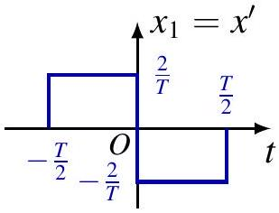

$X_{2}(s) = -\frac{4}{T} + \frac{2}{T} e^{-s \frac{T}{2}} + \frac{2}{T} e^{s \frac{T}{2}} = \frac{8}{T} \sinh^{2}\left(\frac{s T}{4}\right) \Longrightarrow X(s) = \frac{X_{2}(s)}{s^{2}}$

## 拉普拉斯逆变换（含多项式部分）

有理函数可写成一个多项式与严格真有理函数之和：

$$
R(s) = \sum_{k=1}^{n} a_{k} s^{k} + R_{1}(s)
$$

因此

$$
\mathcal{L}^{-1}\{R\} = \sum_{k=1}^{n} a_{k} \delta^{(k)}(t) + \mathcal{L}^{-1}\{R_{1}\}
$$

其中 $\mathcal{L}^{-1}\{R_{1}\}$ 可通过部分分式展开或围线积分求得。

**例** $X(s)=\frac{s(s+2)}{s+3} = s - 1 + \frac{3}{s+3}$，ROC $\operatorname{Re} s > -3$，故

$$
x(t) = \delta'(t) - \delta(t) + 3 e^{-3t} u(t)
$$

## 目录 {#toc4}

- [1. 引言](#sec81)
- [2. 拉普拉斯变换及其收敛域](#sec82)
- [3. 拉普拉斯逆变换](#sec83)
- [4. 拉普拉斯变换的性质](#sec84)
- [**5. 常用拉普拉斯变换对**](#sec85)
- [6. 由零极点图对傅里叶变换几何求值](#sec86)
- [7. 用拉普拉斯变换分析和表征线性时不变系统](#sec87)
- [8. 单边拉普拉斯变换](#sec88)

# 常用拉普拉斯变换对 {#sec85}

## 常用拉普拉斯变换对（1/2）

| 变换对 | 信号 $x(t)$ | 变换 $X(s)$ | 收敛域 (ROC) |
|:---:|:---|:---:|:---|
| 1 | $\delta(t)$ | $1$ | 全部 $s$ |
| 2 | $u(t)$ | $\frac{1}{s}$ | $\text{Re}\{s\} > 0$ |
| 3 | $-u(-t)$ | $\frac{1}{s}$ | $\text{Re}\{s\} < 0$ |
| 4 | $\frac{t^{n-1}}{(n-1)!}u(t)$ | $\frac{1}{s^n}$ | $\text{Re}\{s\} > 0$ |
| 5 | $-\frac{t^{n-1}}{(n-1)!}u(-t)$ | $\frac{1}{s^n}$ | $\text{Re}\{s\} < 0$ |
| 6 | $e^{-at}u(t)$ | $\frac{1}{s+a}$ | $\text{Re}\{s\} > -a$ |
| 7 | $-e^{-at}u(-t)$ | $\frac{1}{s+a}$ | $\text{Re}\{s\} < -a$ |
| 8 | $\frac{t^{n-1}}{(n-1)!}e^{-at}u(t)$ | $\frac{1}{(s+a)^n}$ | $\text{Re}\{s\} > -a$ |
| 9 | $-\frac{t^{n-1}}{(n-1)!}e^{-at}u(-t)$ | $\frac{1}{(s+a)^n}$ | $\text{Re}\{s\} < -a$ |
| 10 | $\delta(t-T)$ | $e^{-sT}$ | 全部 $s$ |

## 常用拉普拉斯变换对 （2/2）

| 变换对 | 信号 $x(t)$ | 变换 $X(s)$ | 收敛域 (ROC) |
|:---:|:---|:---:|:---|
| 11 | $[\cos \omega_0 t]u(t)$ | $\frac{s}{s^2 + \omega_0^2}$ | $\text{Re}\{s\} > 0$ |
| 12 | $[\sin \omega_0 t]u(t)$ | $\frac{\omega_0}{s^2 + \omega_0^2}$ | $\text{Re}\{s\} > 0$ |
| 13 | $[e^{-at} \cos \omega_0 t]u(t)$ | $\frac{s+a}{(s+a)^2 + \omega_0^2}$ | $\text{Re}\{s\} > -a$ |
| 14 | $[e^{-at} \sin \omega_0 t]u(t)$ | $\frac{\omega_0}{(s+a)^2 + \omega_0^2}$ | $\text{Re}\{s\} > -a$ |
| 15 | $u_n(t) = \frac{d^n \delta(t)}{dt^n}$ | $s^n$ | 全部 $s$ |
| 16 | $u_{-n}(t) = \underbrace{u(t) * \dots * u(t)}_{n \text{ 次}}$ | $\frac{1}{s^n}$ | $\text{Re}\{s\} > 0$ |

* **因果性判定**：右边信号（含 $u(t)$）的 ROC 总是向右延伸的半平面。
* **收敛域的重要性**：变换对 2 与 3、6 与 7 的代数式相同，必须依靠 ROC 才能区分时域信号的性质。

## 目录 {#toc5}

- [1. 引言](#sec81)
- [2. 拉普拉斯变换及其收敛域](#sec82)
- [3. 拉普拉斯逆变换](#sec83)
- [4. 拉普拉斯变换的性质](#sec84)
- [5. 常用拉普拉斯变换对](#sec85)
- [**6. 由零极点图对傅里叶变换几何求值**](#sec86)
- [7. 用拉普拉斯变换分析和表征线性时不变系统](#sec87)
- [8. 单边拉普拉斯变换](#sec88)

# 由零极点图对傅里叶变换几何求值 {#sec86}

## 由零极点图对傅里叶变换几何求值

可以用零极点图表示$X(s)$的特征。当ROC包括$j\omega$轴时，以$s=j\omega$代入$X(s)$就可以得到$X(j\omega)$，进一步可用几何求值的方法从零极点图求得的特性：可用于**定性分析系统频率特性**。

$$
H (s) = k \frac {\prod_ {i = 1} ^ {m} \left(s - z _ {i}\right)}{\prod_ {j = 1} ^ {n} \left(s - p _ {j}\right)}
$$

:::: {.columns style="text-align: left;"}

::: {.column width="75%"}

$s=j\omega$即在S平面中$s$沿虚轴移动， 可得：

$$
H (j \omega) = k \frac {\prod_ {i = 1} ^ {m} (j \omega - z _ {i})}{\prod_ {j = 1} ^ {n} (j \omega - p _ {j})}
$$

用极坐标表示， 有

$$
\left\{ \begin{array}{l} j \omega - z _ {i} = N _ {i} e ^ {j \phi_ {i}} \\ j \omega - p _ {j} = M _ {j} e ^ {j \theta_ {j}} \end{array} \right.
$$

:::
::: {.column width="25%"}

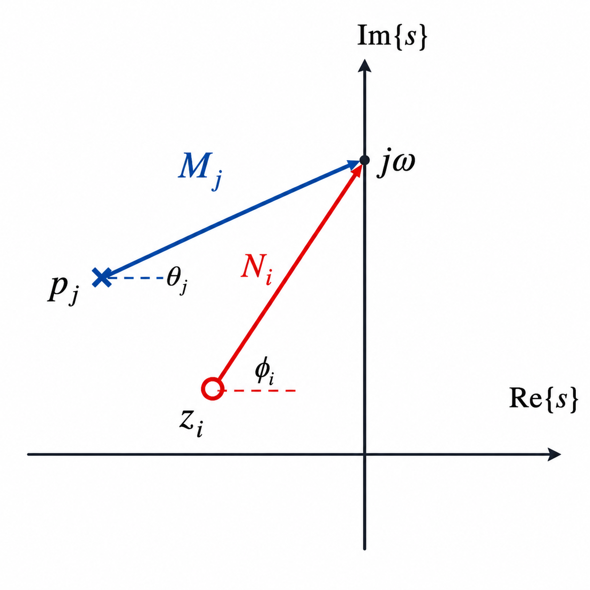

:::
::::

## 由零极点图对傅里叶变换几何求值
所以：

$$
\begin{array}{l} H (j \omega) = k \frac {N _ {1} e ^ {j \phi_ {1}} N _ {2} e ^ {j \phi_ {2}} \cdots N _ {m} e ^ {j \phi_ {m}}}{M _ {1} e ^ {j \theta_ {1}} M _ {2} e ^ {j \theta_ {2}} \cdots M _ {n} e ^ {j \theta_ {n}}} \\ = k \frac {N _ {1} N _ {2} \cdots N _ {m}}{M _ {1} M _ {2} \cdots M _ {n}} e ^ {j [ (\phi_ {1} + \phi_ {2} + \dots + \phi_ {m}) - (\theta_ {1} + \theta_ {2} + \dots + \theta_ {n}) ]} \\ = | H (j \omega) | e ^ {j \arg H (j \omega)} \\ \end{array}
$$

$$
\left| H (j \omega) \right| = k \frac {N _ {1} N _ {2} \cdots N _ {m}}{M _ {1} M _ {2} \cdots M _ {n}}
$$

$$
\arg H (j \omega) = \left(\phi_ {1} + \phi_ {2} + \dots + \phi_ {m}\right) - \left(\theta_ {1} + \theta_ {2} + \dots + \theta_ {n}\right)
$$

## 由零极点图对傅里叶变换几何求值

例：已知 $X(s)=\frac{1}{s+1/2}, Re[s]> -\frac{1}{2}$，用几何法确定傅立叶变换的幅频和相频特性。

::::{.columns style="text-align: left;"}

::: {.column width="50%"}

分析：

- **极点 (Pole)**： $-1/2$， **零点 (Zero)**：无有限零点。
- **收敛域 (ROC)**：包含虚轴 ($s=j\omega$)，因此傅里叶变换存在且等于 $X(j\omega)$。

**1. 幅频特性的几何推导**：其几何意义是**极点到虚轴观测点距离的倒数**。

- **当 $\omega = 0$ 时**：
  距离最短，$|\vec{V}| = 0.5$。幅值最大：$|X(j0)| = 1/0.5 = 2$。
- **当 $\omega$ 增大时**：
  观测点远离实轴，矢量 $\vec{V}$ 的长度逐渐增加。
- **结论**：距离越长，幅值越小。展示了**低通滤波器**的特性。

:::
::: {.column width="50%"}

**2. 构造几何矢量**： 从极点 $s_p = -1/2$ 指向观测点 $j\omega$ 的矢量 $\vec{V}$。$\vec{V} = j\omega - (-1/2) = \frac{1}{2} + j\omega$

**3. 相频特性的几何推导**： 由于极点在分母上，其相位贡献为负。

- **夹角**：$\angle X(j\omega) = -\theta = -\arctan(2\omega)$。
- **趋势分析**：
  - $\omega = 0 \Rightarrow \theta = 0^\circ \Rightarrow \angle X = 0^\circ$
  - $\omega \to +\infty \Rightarrow \theta \to 90^\circ \Rightarrow \angle X \to -90^\circ$
  - $\omega \to -\infty \Rightarrow \theta \to -90^\circ \Rightarrow \angle X \to +90^\circ$

:::
::::

1. **距离决定幅值**：极点越靠近虚轴，该频率附近的增益越高。
2. **角度决定相位**：极点在分母，贡献相位滞后；零点在分子，贡献相位超前。
3. **因此**：无需复杂运算即可快速判断系统是低通、高通还是带通等特性。

## 由零极点图对傅里叶变换几何求值

:::: {.columns style="text-align: left;"}

::: {.column width="75%"}

例1. 一阶系统： 
$$\tau \frac{d y(t)}{dt}+y(t)= x(t)$$

$$
H (s) = \frac {1 / \tau}{s + (1 / \tau)}, \quad \mathrm {R e} [ s ] > - \frac {1}{\tau}
$$

$$
h (t) = \frac {1}{\tau} e ^ {- \frac {t}{\tau}} u (t),
$$

随着$\omega$上升，  $|H(j \omega)|$单调下降，当$\omega=\frac{1}{\tau}$时,下降到最大值的$\frac { 1 } { \sqrt { 2 } }$, 最大值在$\omega=0$时取得。

相位特性， 当 $\omega=0$ 时，$\arg H(j \omega) = 0$。随着$\omega$上升，$\arg H(j \omega)$趋向$-\frac{\pi}{2}$,随着$\omega$下降，$\arg H(j \omega)$趋向$\frac{\pi}{2}$

:::
::: {.column width="25%"}

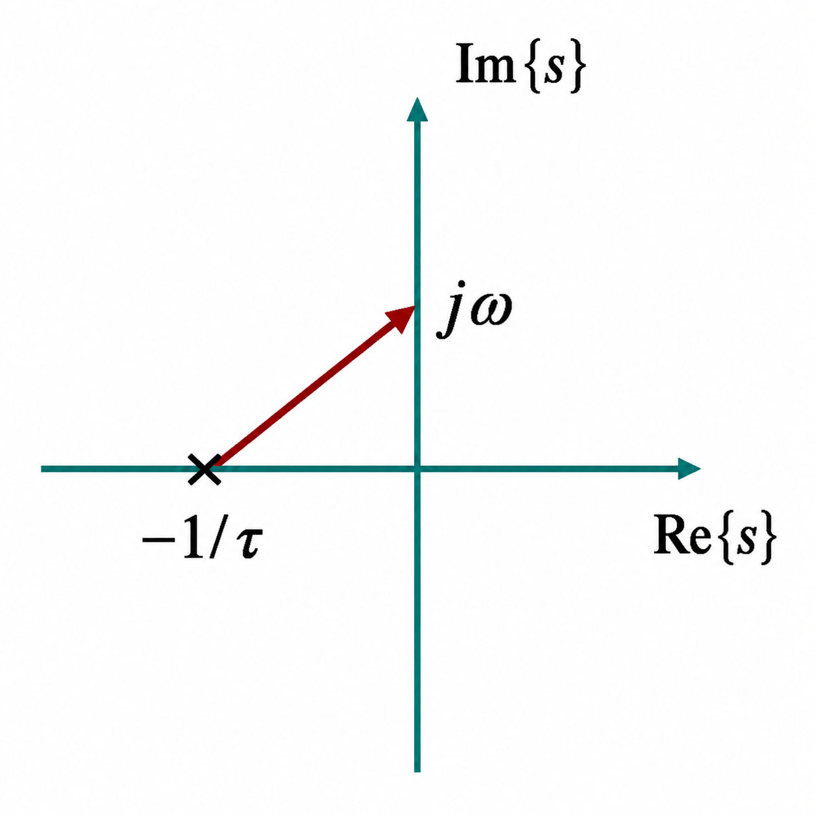{width="55%"}

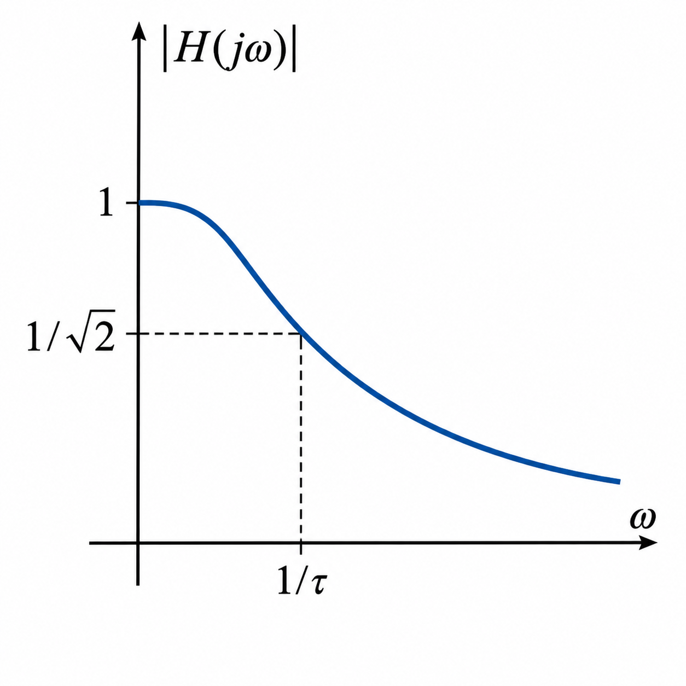{width="55%"}

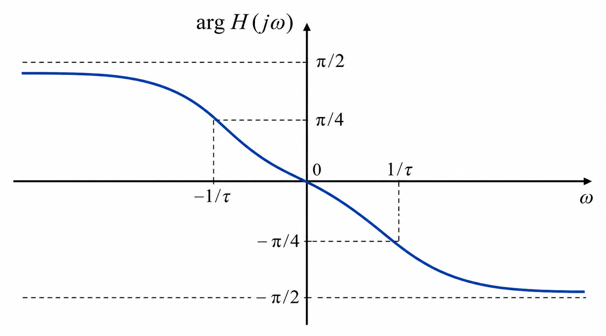{width="85%"}
:::
::::

## 例2. 因果二阶系统

$$
\frac {d ^ {2} y (t)}{d t ^ {2}} + 2 \zeta \omega_ {n} \frac {d y (t)}{d t} + \omega_ {n} ^ {2} y (t) = \omega_ {n} ^ {2} x (t)
$$

$$
H (s) = \frac {\omega_ {n} ^ {2}}{s ^ {2} + 2 \zeta \omega_ {n} s + \omega_ {n} ^ {2}} = \frac {\omega_ {n} ^ {2}}{(s - c _ {1}) (s - c _ {2})}, c _ {1, 2} = - \zeta \omega_ {n} \pm \omega_ {n} \sqrt {\zeta^ {2} - 1}
$$

:::: {.columns style="text-align: left;"}

::: {.column width="75%"}
$$
h (t) = M \left(e ^ {c _ {1} t} - e ^ {c _ {2} t}\right) u (t), \quad M = \frac {\omega_ {n}}{2 \sqrt {\zeta^ {2} - 1}}
$$

1. 当 $\zeta > 1$， 有两个实数极点，$\left| H (j \omega) \right|$随着$|\omega|$的增加而单调下降，而$\arg H(j\omega)$则由$\omega = 0$时由$0$变为$\omega$趋向于$\infty$的$-\pi$

:::
::: {.column width="25%"}

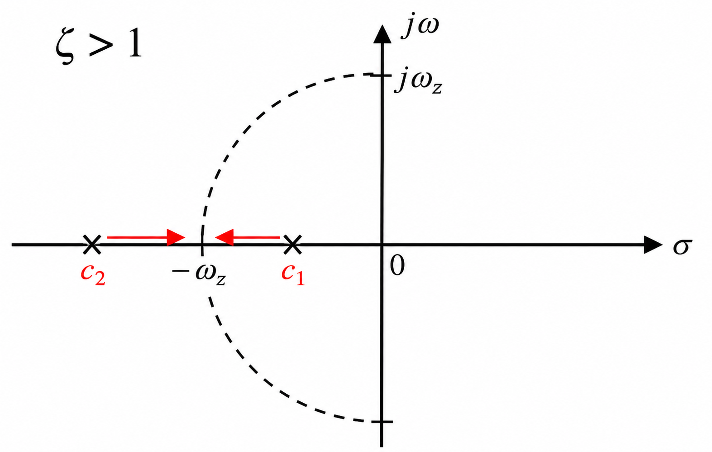

::: 
::::

:::: {.columns style="text-align: left;"}

::: {.column width="75%"}
2. 当$0<\zeta<1$时，则二阶极点分裂为共轭复数极点，且随$\zeta$的减小而逐步靠近$j\omega$轴。极点运动的轨迹-根轨迹是一个半径为$\omega_n$的圆周

由于第2象限的极点矢量变得很短， 因而会使$|H(j\omega)|$出现峰值。其峰点位于$\omega_ {n} \sqrt {1 - \zeta^ {2}}$

随着$\omega$，位于第2象限的极点矢量比第3象限的极点矢量更短，因此它对系统特性的影响较大。
:::
::: {.column width="25%"}

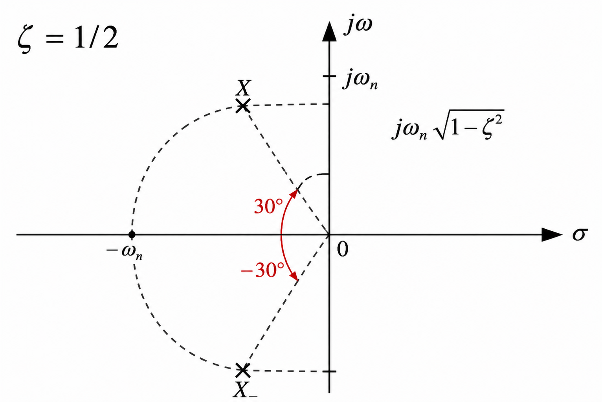

::: 
::::

## 例3. 全通系统

:::: {.columns style="text-align: left;"}

::: {.column width="75%"}

考察零极点对称分布的系统
$$
H (s) = \frac {s - a}{s + a} \quad \text{一阶全通}
$$

该系统的$H(j\omega)$在任何时候都等于1，所以称为全通系统。

其相位特性

$$
\arg H (j \omega) = \theta_ {1} - (\pi - \theta_ {1}) = 2 \theta_ {1} - \pi
$$
:::
::: {.column width="25%"}
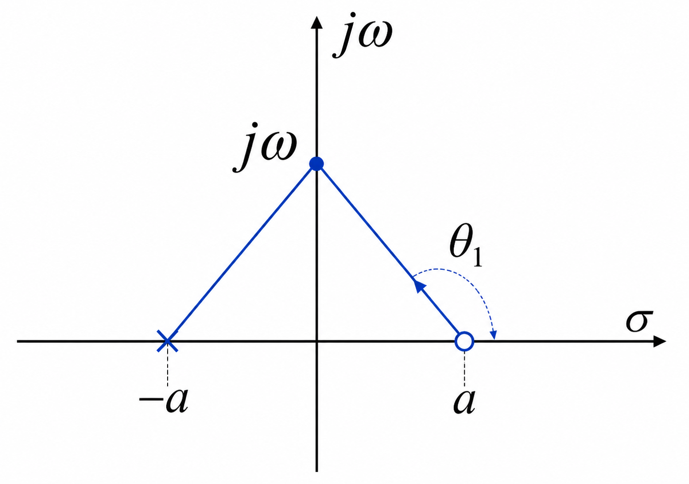

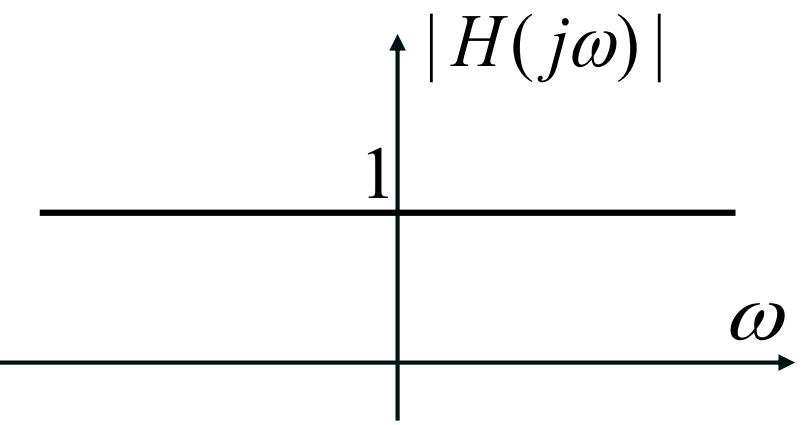

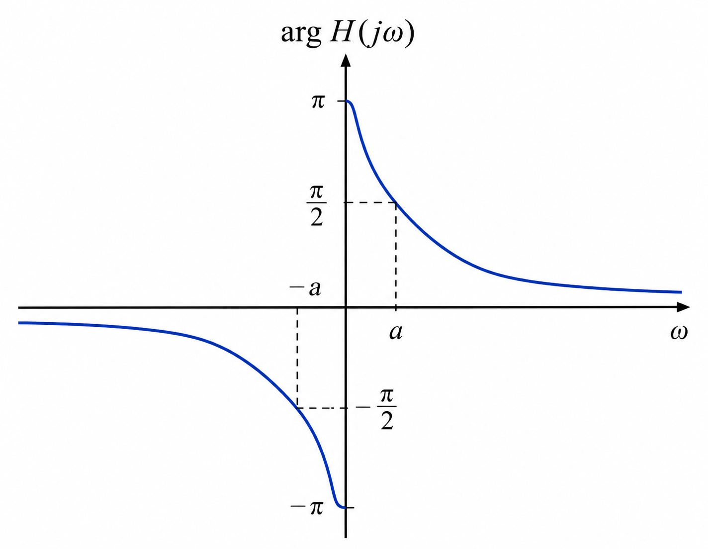

::: 
::::

## 例4. 最小相位系统

考察两个系统，它们的极点相同，零点分布关于$j\omega$轴对称。其中一个系统的零点均在左半平面，另一个系统的零点均在右半平面。

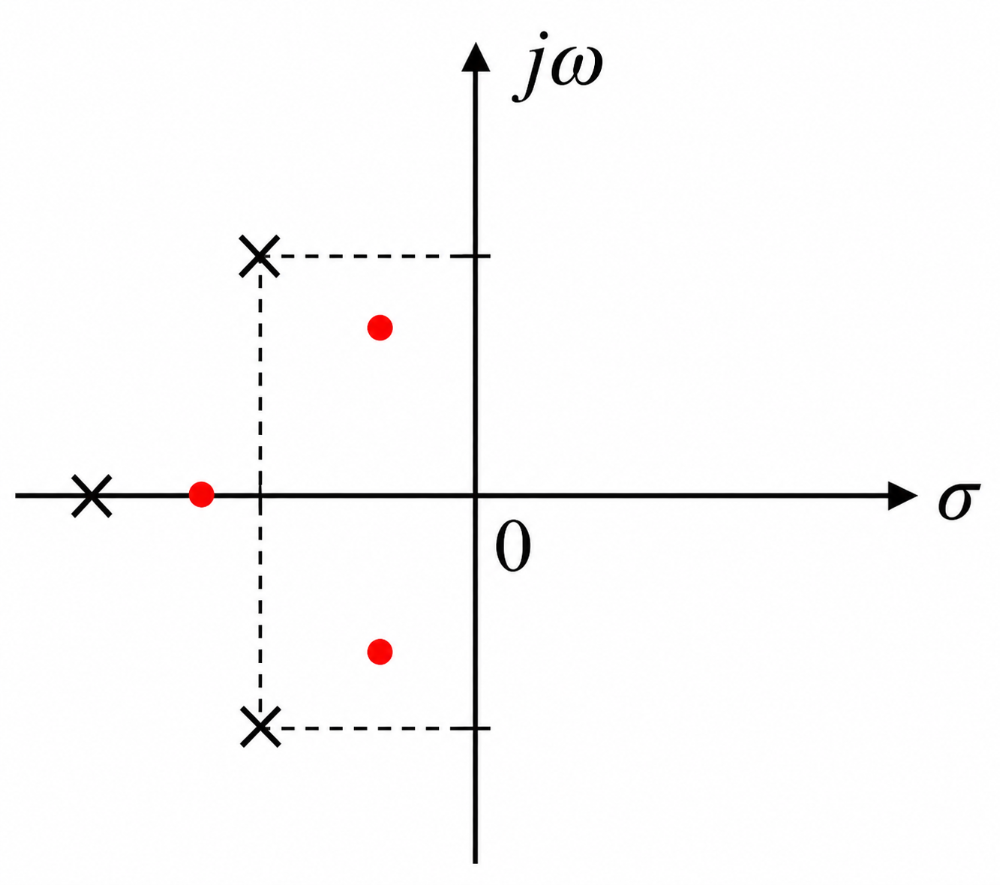{width="40%"}
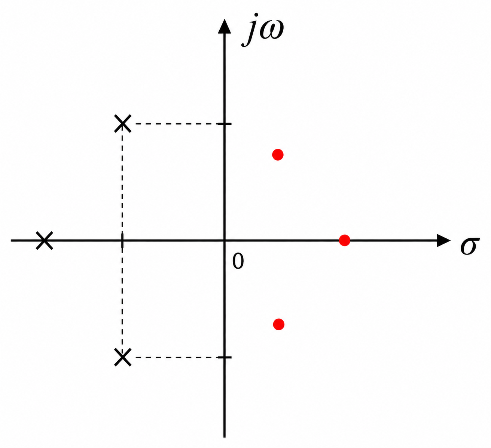{width="40%"}

显然这两个系统的幅频特性是相同的。但零点在左半平面的系统其相位总小于零点在右半平面的系统。 因此将零极点均位于左半平面的系统称为最小相位系统。

## 例4. 最小相位系统

工程应用中设计的各种频率选择性滤波器，如：Butterworth 、Chebyshev、 Cauer滤波器都是最小相位系统。

从本质上讲系统的特性是由系统的零、极点分布决定的。对系统进行优化设计，实质上就是优化其零、极点的位置。

当工程应用中要求实现一个非最小相位系统时，通常采用将一个最小相位系统和一个全通系统级联来实现。

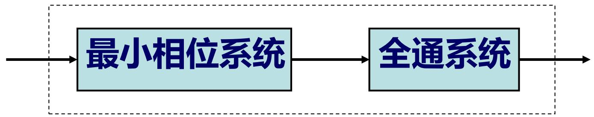{width="36%"}

:::: {.columns style="text-align: center;"}

::: {.column width="34%"}
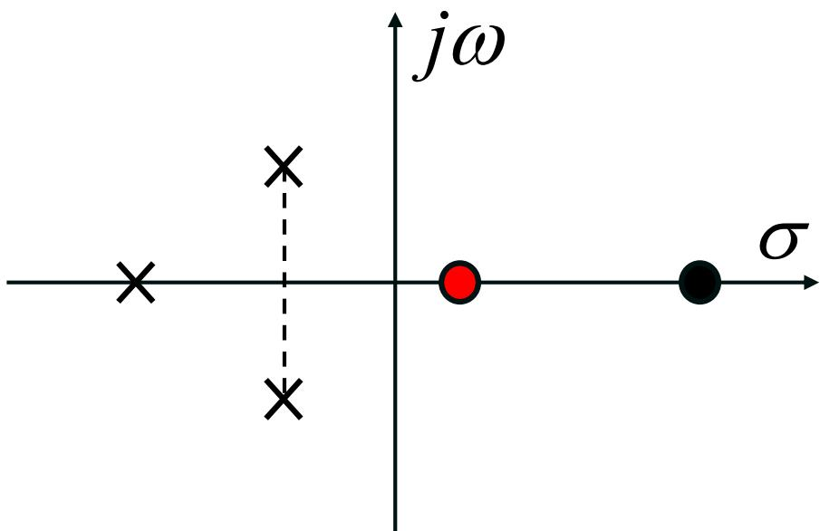{width="100%"}
:::
::: {.column width="33%"}

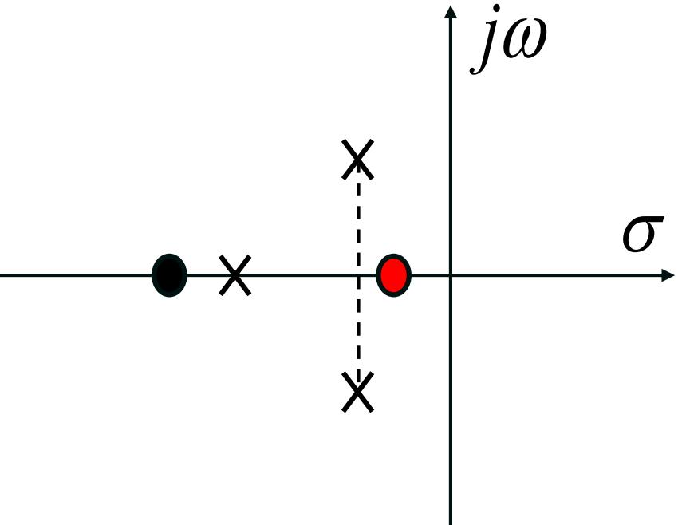

:::
::: {.column width="33%"}

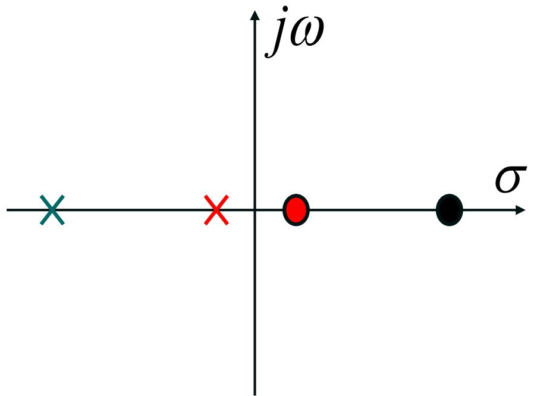

:::
::::

## 目录 {#toc6}

- [1. 引言](#sec81)
- [2. 拉普拉斯变换及其收敛域](#sec82)
- [3. 拉普拉斯逆变换](#sec83)
- [4. 拉普拉斯变换的性质](#sec84)
- [5. 常用拉普拉斯变换对](#sec85)
- [6. 由零极点图对傅里叶变换几何求值](#sec86)
- [**7. 用拉普拉斯变换分析和表征线性时不变系统**](#sec87)
- [8. 单边拉普拉斯变换](#sec88)

# 用拉普拉斯变换分析和表征线性时不变系统 {#sec87}

## 连续时间系统函数

回忆连续时间 LTI 系统对输入 $x(t)$ 的响应为

$$
y(t) = (x * h)(t)
$$

其中 $h$ 是冲激响应。

若 $x$ 和 $h$ 存在拉普拉斯变换，由卷积性质得

$$
Y(s) = X(s) H(s)
$$

在其公共 ROC 内（实际为 ROAC）。

若 ROC 有非空内点，系统函数（也称传递函数）$H(s)$ 通过拉普拉斯逆变换唯一确定 $h(t)$，进而确定系统性质。

## 因果性

回忆 $h$ 是右边信号当且仅当 $H(s)$ 的 ROC 是右半平面。

**因果 $\Longrightarrow$ ROC 是右半平面**

**注意**：逆命题不成立。

**例** 考虑 $H(s)=\frac{e^{s}}{s+1}$，ROC $\operatorname{Re} s > -1$。由时移性质，

$$
h(t) = e^{-(t+1)} u(t+1)
$$

该系统不是因果的。

## 因果性

**对于有理系统函数 $H(s)$ 的 LTI 系统，因果的充要条件是：ROC 是最右侧极点右侧的右半平面。**

**证明** 对有理系统函数，

$$
H(s) = \sum_{k=1}^{n} a_{k} s^{k} + \sum_{i=1}^{r} \sum_{k_{i}=1}^{N_{i}} \frac{A_{i,k_{i}}}{(s+a_{i})^{k_{i}}}, \quad \operatorname{Re} s > \max_{i} \operatorname{Re}(-a_{i})
$$

于是

$$
h(t) = \sum_{k=1}^{n} a_{k} \delta^{(k)}(t) + \sum_{i=1}^{r} \sum_{k_{i}=1}^{N_{i}} \frac{A_{i,k_{i}}}{(k_{i}-1)!} t^{k_{i}-1} e^{-a_{i} t} u(t)
$$

这是因果的。（也可由围线积分证明）

**例如** $h(t)=e^{-t} u(t) \stackrel{\mathcal{L}}{\longleftrightarrow} \frac{1}{s+1}$，ROC $\operatorname{Re} s > -1$，因果。

**例如** $h(t)=e^{-|t|} \stackrel{\mathcal{L}}{\longleftrightarrow} \frac{-2}{s^{2}-1}$，ROC $-1 < \operatorname{Re} s < 1$，非因果。

## 稳定性

LTI 系统稳定当且仅当其冲激响应 $h \in L_{1}$，即

$$
\int_{-\infty}^{\infty} |h(t)| \, dt < \infty
$$

这等价于 $H(s)$ 在虚轴 $\operatorname{Re} s=0$ 上绝对收敛，因此其 ROC 必须满足 $\sigma_{1} < 0 < \sigma_{2}$。

**稳定 $\Longleftrightarrow$ ROC 包含虚轴**

对于有理系统函数的**因果** LTI 系统，稳定的充要条件是所有极点的实部均为负。

**例如** 因果系统 $H(s)=\frac{1}{s+a}$ 在 $\operatorname{Re} a > 0$ 时稳定。

**例如** 若 $\operatorname{Re} a < 0$ 且 ROC 为 $\operatorname{Re} s < -\operatorname{Re} a$，系统也稳定，但非因果。

## 例

:::: {.columns style="text-align: left;"}
::: {.column width="75%"}

考虑系统函数

$$
H(s) = \frac{1}{s-2} - \frac{1}{s+1}
$$

有两个极点 $p_{1}=-1$ 和 $p_{2}=2$。

1. $\operatorname{Re} s < -1$：非因果，不稳定

$$
h_{1}(t) = -e^{2t} u(-t) + e^{-t} u(-t)
$$

2. $-1 < \operatorname{Re} s < 2$：非因果，稳定

$$
h_{2}(t) = -e^{2t} u(-t) - e^{-t} u(t)
$$

3. $\operatorname{Re} s > 2$：因果，不稳定

$$
h_{3}(t) = e^{2t} u(t) - e^{-t} u(t)
$$

:::
::: {.column width="25%"}

:::
::::

## 线性常系数微分方程

输入输出满足

$$
\sum_{k=0}^{N} a_{k} \frac{d^{k} y}{dt^{k}} = \sum_{k=0}^{M} b_{k} \frac{d^{k} x}{dt^{k}}
$$

两边取拉普拉斯变换：

$$
\sum_{k=0}^{N} a_{k} s^{k} Y(s) = \sum_{k=0}^{M} b_{k} s^{k} X(s)
$$

故系统函数

$$
H(s) = \frac{Y(s)}{X(s)} = \frac{\sum_{k=0}^{M} b_{k} s^{k}}{\sum_{k=0}^{N} a_{k} s^{k}}
$$

系统函数总是有理的。微分方程本身不指定 ROC！需要附加条件（如稳定性、因果性）来确定 $h(t)$。

## 例

考虑 LTI 系统满足

$$
y'(t) + 3 y(t) = x'(t) + x(t)
$$

系统函数

$$
H(s) = \frac{s+1}{s+3} = 1 - \frac{2}{s+3}
$$

ROC 有两种可能：$\operatorname{Re} s > -3$ 和 $\operatorname{Re} s < -3$

1. 若 $\operatorname{Re} s > -3$（因果且稳定）：

$$
h(t) = \delta(t) - 2 e^{-3t} u(t)
$$

2. 若 $\operatorname{Re} s < -3$（非因果且不稳定）：

$$
h(t) = \delta(t) + 2 e^{-3t} u(-t)
$$

## 例（续）

若使用傅里叶变换，频率响应为

$$
H(j\omega) = \frac{j\omega + 1}{j\omega + 3} = 1 - \frac{2}{j\omega + 3}
$$

对应

$$
h(t) = \delta(t) - 2 e^{-3t} u(t)
$$

为什么只有一种可能？

- 傅里叶变换方法隐含假设系统稳定，要求 $H(s)$ 的 ROC 包含虚轴，因此 $\operatorname{Re} s > -3$；
- 一般情况下不适用于不稳定系统。

## 例（续）

对输入 $x(t)=e^{-4t} u(t)$ 求响应。

$$
X(s) = \frac{1}{s+4}, \quad \operatorname{Re} s > -4
$$

响应变换

$$
Y(s) = H(s) X(s) = \frac{s+1}{s+3} \cdot \frac{1}{s+4} = \frac{-2}{s+3} + \frac{3}{s+4}
$$

**两种可能 ROC**：

1. $\operatorname{Re} s > -3$：

$$
y(t) = -2 e^{-3t} u(t) + 3 e^{-4t} u(t)
$$

2. $-4 < \operatorname{Re} s < -3$：

$$
y(t) = 2 e^{-3t} u(-t) + 3 e^{-4t} u(t)  
$$

## 例（续）

对输入 $x(t)=e^{-3t} u(t)$ 求响应。

$$
X(s) = \frac{1}{s+3}, \quad \operatorname{Re} s > -3
$$

$$
Y(s) = \frac{s+1}{s+3} \cdot \frac{1}{s+3} = \frac{1}{s+3} - \frac{2}{(s+3)^{2}}
$$

只有一种可能的 ROC $\operatorname{Re} s > -3$：

$$
y(t) = (1-2t) e^{-3t} u(t)
$$

对非因果不稳定系统，$x*h$ 不可定义。

## 例

某 LTI 系统对输入 $x(t)=e^{-3t} u(t)$ 的响应为

$$
y(t) = (e^{-t} - e^{-2t}) u(t)
$$

系统函数

$$
H(s) = \frac{Y(s)}{X(s)} = \frac{\frac{1}{s+1} - \frac{1}{s+2}}{\frac{1}{s+3}} = \frac{s+3}{s^{2} + 3s + 2}, \quad \operatorname{Re} s > -1
$$

部分分式展开得

$$
H(s) = \frac{2}{s+1} - \frac{1}{s+2}, \quad \operatorname{Re} s > -1 \Longrightarrow h(t) = (2e^{-t} - e^{-2t}) u(t)
$$

该系统可由以下微分方程描述：

$$
\frac{d^{2} y}{dt^{2}} + 3 \frac{dy}{dt} + 2 y = \frac{dx}{dt} + 3 x
$$

## 系统互连

**串联（级联）系统**

$$
Y = (X H_{1}) H_{2} = X (H_{1} H_{2}) = (X H_{2}) H_{1}
$$

## 系统互连

**并联系统**

$$
h = h_{1} + h_{2}
$$

$$
H = H_{1} + H_{2}
$$

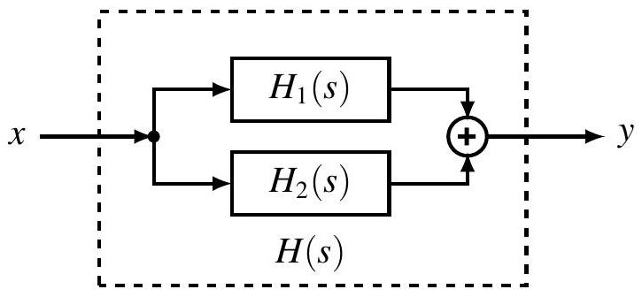

## 系统互连

**反馈系统**

$$
y = h_{1} * (x - h_{2} * y)
$$

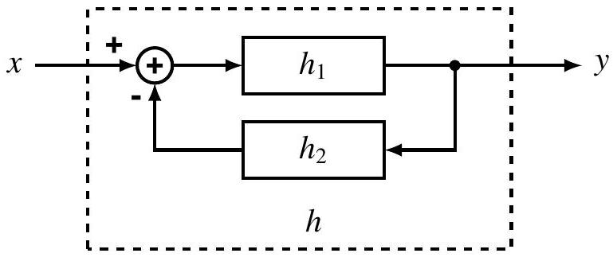

$$
Y = H_{1} X - H_{1} H_{2} Y \Longrightarrow H = \frac{H_{1}}{1 + H_{1} H_{2}}
$$

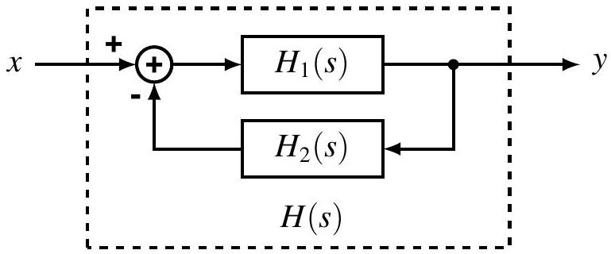

## 例

因果 LTI 系统，系统函数

$$
H(s) = \frac{1}{s+a}, \quad \operatorname{Re} s > -\operatorname{Re} a
$$

等价的微分方程描述：

$$
y'(t) + a y(t) = x(t)
$$

（初始松弛条件）

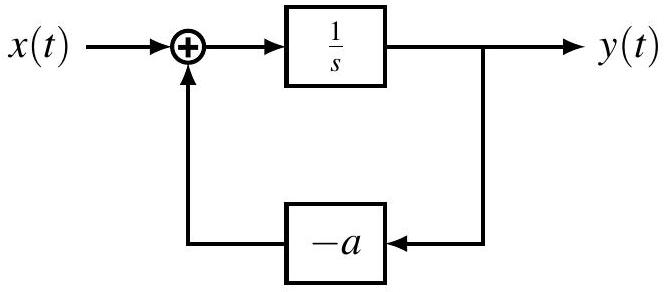

## 例

因果 LTI 系统，系统函数

$$
H(s) = \frac{s+b}{s+a} = \left( \frac{1}{s+a} \right) (s+b), \quad \operatorname{Re} s > -\operatorname{Re} a
$$

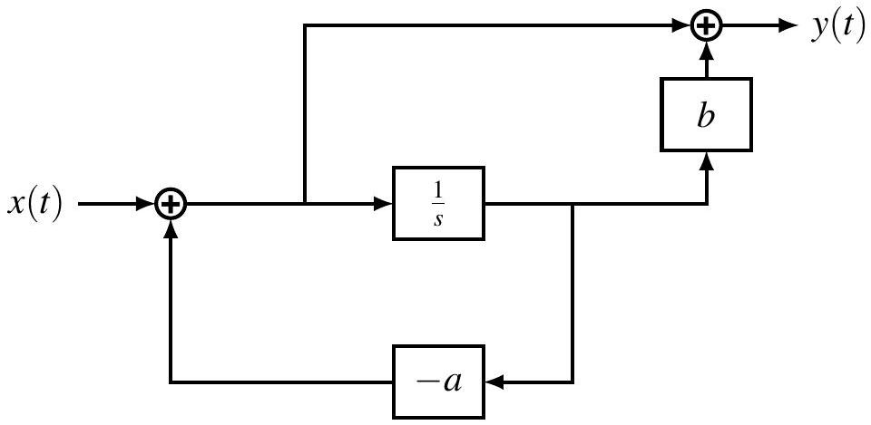

## 例

因果 LTI 系统，系统函数

$$
H(s) = \frac{1}{(s+1)(s+2)} = \frac{1}{s^{2} + 3s + 2}
$$

等价微分方程：

$$
y''(t) + 3 y'(t) + 2 y(t) = x(t)
$$

**直接形式**

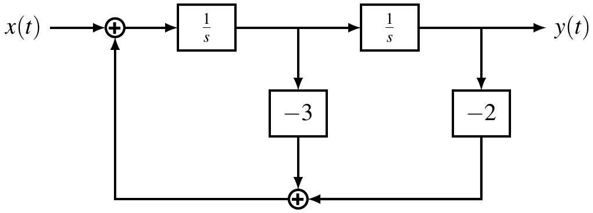

## 例

因果 LTI 系统，系统函数

$$
H(s) = \frac{1}{(s+1)(s+2)} = \frac{1}{s+1}\frac{1}{ s+2}
$$

**级联形式**

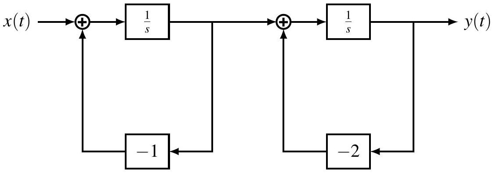

## 例

因果 LTI 系统，系统函数

$$
H(s) = \frac{1}{(s+1)(s+2)} = = \frac{1}{s+1}-\frac{1}{ s+2}
$$

**并联形式**

## 目录 {#toc7}

- [1. 引言](#sec81)
- [2. 拉普拉斯变换及其收敛域](#sec82)
- [3. 拉普拉斯逆变换](#sec83)
- [4. 拉普拉斯变换的性质](#sec84)
- [5. 常用拉普拉斯变换对](#sec85)
- [6. 由零极点图对傅里叶变换几何求值](#sec86)
- [7. 用拉普拉斯变换分析和表征线性时不变系统](#sec87)
- [**8. 单边拉普拉斯变换**](#sec88)

# 单边拉普拉斯变换 {#sec88}

## 单边拉普拉斯变换

回忆连续时间信号 $x(t)$ 的（双边）拉普拉斯变换

$$
X(s)=\int_{-\infty}^{\infty} x(t) e^{-s t} \, dt
$$

$x(t)$ 的**单边拉普拉斯变换**为

$$
\mathcal{X}(s)=\int_{0_{-}}^{\infty} x(t) e^{-s t} \, dt
$$

也记作

$$
\mathcal{X}=\mathcal{U}\mathcal{L}\{x\}, \quad x(t) \stackrel{\mathcal{UL}}{\longleftrightarrow} \mathcal{X}(s)
$$

$\mathcal{X}(s)$ 的收敛域始终是右半平面。

**注**：$t<0$ 时 $x(t)$ 的信息在单边变换中丢失。

**注**：$\mathcal{L}\{x\}=\mathcal{U}\mathcal{L}\{x\}$ 当且仅当 $x(t)$ 是因果的，即 $x(t)=0$ 对 $t<0$ 成立。

## 例子

单边拉普拉斯变换的计算与双边拉普拉斯变换几乎相同。

**例** $x_{1}(t)=e^{-a t} u(t)$，

$$
X_{1}(s)=\frac{1}{s+a}, \quad \operatorname{Re} s>-\operatorname{Re} a
$$

**例** $x_{2}(t)=e^{-a(t+1)} u(t+1)=x_{1}(t+1)$，

$$
\begin{array}{cl}
\text{双边} & X_{2}(s)=e^{s} X_{1}(s)=\frac{e^{s}}{s+a}, \quad \operatorname{Re} s>-\operatorname{Re} a \\
\text{单边} & X_{2}(s)=\int_{0}^{\infty} e^{-a(t+1)} e^{-s t} \, dt=\frac{e^{-a}}{s+a}, \quad \operatorname{Re} s>-\operatorname{Re} a
\end{array}
$$

**注**：单边 $X_{2}(s) \neq$ 双边 $X_{2}(s)$，因为 $x_{2}(t)$ 是非因果的。

**注**：单边变换不满足时移性质，即 $X_{2}(s) \neq e^{s} X_{1}(s)$。

## 例子

单边拉普拉斯变换的计算与双边几乎相同。

**例** $x_{3}(t)=e^{-a|t|}$，$\operatorname{Re} a>0$，

$$
\begin{aligned}
\text{双边} & X_{3}(s)=\frac{-2a}{s^{2}-a^{2}}, \quad -\operatorname{Re} a < \operatorname{Re} s < \operatorname{Re} a \\
\text{单边} & X_{3}(s)=\frac{1}{s+a}, \quad \operatorname{Re} s>-\operatorname{Re} a
\end{aligned}
$$

**注**：$X_{3}(s) \neq X_{1}(s)$，因为 $x_{3}(t) \neq x_{1}(t)$。

**注**：单边 $X_{3}(s) = X_{1}(s)$，因为 $x_{3}(t)$ 与 $x_{1}(t)$ 仅在 $t<0$ 处不同。

**例** $x(t)=\delta(t)+2\delta'(t)+e^{t} u(t)$，

$$
X(s)=\mathcal{X}(s)=1+2s+\frac{1}{s-1}, \quad \operatorname{Re} s>1
$$

**注**：积分下限为 $0_{-}$，因此 $\delta(t)$ 和 $\delta'(t)$ 对单边变换有贡献。

## 例子

单边拉普拉斯逆变换的计算与双边相同，但只能恢复 $t \geq 0$ 的信号！

**例** 已知单边拉普拉斯变换

$$
X(s)=\frac{1}{(s+1)(s+2)}=\frac{1}{s+1}-\frac{1}{s+2}
$$

唯一可能的 ROC 是 $\operatorname{Re} s>-1$，因此

$$
x(t)=e^{-t}-e^{-2t}, \quad t \geq 0
$$

$X(s)$ 对 $t<0$ 的 $x(t)$ 无任何信息。

**例** $\mathcal{X}(s)=\frac{s^{2}-3}{s+2}=-2+s+\frac{1}{s+2}$，ROC 必为 $\operatorname{Re} s>-2$，故

$$
x(t)=-2\delta(t)+\delta'(t)+e^{-2t}, \quad t \geq 0
$$

## 单边拉普拉斯变换的性质

许多性质与双边拉普拉斯变换相同

| 性质               | 信号                  | 单边拉普拉斯变换          |
|--------------------|-----------------------|---------------------------|
| -                  | $x(t)$                | $X(s)$                    |
| -                  | $y(t)$                | $Y(s)$                    |
| 线性               | $a x(t)+b y(t)$       | $a X(s)+b Y(s)$           |
| $s$ 域平移         | $e^{s_{0} t} x(t)$    | $X(s-s_{0})$              |
| 时间尺度变换       | $x(a t), a>0$         | $\frac{1}{a} X\left(\frac{s}{a}\right)$ |
| 共轭               | $x^{*}(t)$            | $X^{*}(s^{*})$            |
| $s$ 域微分         | $-t x(t)$             | $\frac{d}{ds} X(s)$       |

## 单边拉普拉斯变换的卷积性质

若 $x(t)=y(t)=0$ 对 $t<0$ 成立，则

$$
(x * y)(t) \stackrel{\mathcal{UL}}{\longleftrightarrow} X(s) Y(s), \quad \text{ROAC} \supset \operatorname{ROAC}_{x} \cap \operatorname{ROAC}_{y}
$$

**证明** 因为 $(x*y)(t)=0$ 对 $t<0$ 成立，

$$
\mathcal{U}\mathcal{L}\{x*y\}=\mathcal{L}\{x*y\}=\mathcal{L}\{x\}\mathcal{L}\{y\}=\mathcal{U}\mathcal{L}\{x\}\mathcal{U}\mathcal{L}\{y\}
$$

**注意**：$x(t)=y(t)=0$ 对 $t<0$ 的假设非常重要！

**例** $x(t)=\delta(t)-\delta(t-1)$，$y(t)=\delta(t+1)$，

$$
X(s)=1-e^{-s}, \quad Y(s)=0
$$

但 $(x*y)(t)=\delta(t+1)-\delta(t)$，

$$
\mathcal{U}\mathcal{L}\{x*y\}=-1 \neq X(s)Y(s)
$$

## 时域积分性质

若

$$
x(t) \stackrel{\mathcal{UL}}{\longleftrightarrow} X(s), \quad \text{ROAC}=R
$$

则

$$
\int_{0_{-}}^{t} x(\tau) \, d\tau \stackrel{\mathcal{UL}}{\longleftrightarrow} \frac{1}{s} X(s), \quad \text{ROAC} \supset R \cap \{\operatorname{Re} s>0\}
$$

**证明** 对 $\tilde{x} * u$ 应用卷积性质，其中

$$
\tilde{x}(t) = \begin{cases}
x(t), & t \geq 0 \\
0, & t<0
\end{cases}
$$

**例** $x(t)=\delta(t)$，$X(s)=1$，则

$$
\int_{0_{-}}^{t} x(\tau) \, d\tau = u(t) \stackrel{\mathcal{UL}}{\longleftrightarrow} \frac{1}{s}, \quad \operatorname{Re} s>0
$$

## 时域微分性质

若

$$
x(t) \stackrel{\mathcal{UL}}{\longleftrightarrow} X(s), \quad \text{ROC}=R
$$

且对 $s \in R_{0}$ 有 $\lim_{t\to+\infty} x(t) e^{-s t}=0$，则

$$
\frac{d}{dt} x(t) \stackrel{\mathcal{UL}}{\longleftrightarrow} s X(s) - x(0_{-}), \quad \text{ROC} \supset R \cap R_{0}
$$

**注**：$R_{0} \supset$ $X(s)$ 的 ROAC（双边拉普拉斯变换也成立）。

**证明** 分部积分：

$$
\int_{0_{-}}^{\infty} x'(t) e^{-s t} \, dt = \left. x(t) e^{-s t} \right|_{0_{-}}^{\infty} + s \int_{0_{-}}^{\infty} x(t) e^{-s t} \, dt = -x(0_{-}) + s X(s)
$$

**注**：若采用积分下限 $0_{+}$ 的定义，则有 $\frac{d}{dt}x(t) \stackrel{\mathcal{UL}}{\longleftrightarrow} s X(s) - x(0_{+})$。

## 时域微分性质

**例** $x(t)=e^{-t}$，$\mathcal{X}(s)=\frac{1}{s+1}$，ROAC $\operatorname{Re} s>-1$。由微分性质：

$$
x'(t) \stackrel{\mathcal{UL}}{\longleftrightarrow} \frac{s}{s+1} - 1 = -\frac{1}{s+1}, \quad \operatorname{ROC} \supset \{\operatorname{Re} s>-1\}
$$

直接计算验证一致。

**例** $x(t)=e^{-t} u(t)$，$X(s)=\frac{1}{s+1}$，ROAC $\operatorname{Re} s>-1$。由微分性质得

$$
x'(t) \stackrel{\mathcal{UL}}{\longleftrightarrow} \frac{s}{s+1}
$$

直接计算：$x'(t)=\delta(t)-e^{-t}u(t)$，

$$
\mathcal{U}\mathcal{L}\{x'\}=\frac{s}{s+1}
$$

## 时域微分性质

在适当条件下（如 $x^{(k)}(t)=O(e^{\gamma t})$），微分性质可推广到高阶导数：

$$
x^{(n)}(t) \stackrel{\mathcal{UL}}{\longleftrightarrow} s^{n} X(s) - \sum_{k=0}^{n-1} s^{n-1-k} x^{(k)}(0_{-})
$$

常系数微分方程的解形式为 $\sum p_{i}(t) e^{a_{i} t}$（$p_{i}$ 为多项式），满足上述条件。

单边拉普拉斯变换特别适用于求解具有非零初始条件的常系数微分方程。

## 初值定理

**定理** 若 $x(t)$ 的单边拉普拉斯变换 $\mathcal{X}(s)$ 是有理严格真函数，则

$$
x(0_{+}) = \lim_{s \to \infty} s \mathcal{X}(s)
$$

**证明** $\mathcal{X}(s)$ 的部分分式展开为

$$
\mathcal{X}(s)=\sum_{i=1}^{r} \sum_{k_{i}=1}^{N_{i}} \frac{A_{i,k_{i}}}{(s+a_{i})^{k_{i}}}
$$

$$
x(t)=\sum_{i=1}^{r} \sum_{k_{i}=1}^{N_{i}} \frac{A_{i,k_{i}} t^{k_{i}-1}}{(k_{i}-1)!} e^{-a_{i} t}, \quad t \geq 0
$$

于是

$$
x(0_{+})=\sum_{i=1}^{r} A_{i,1} = \lim_{s\to\infty} s \mathcal{X}(s)
$$

**例** $x(t)=2e^{-t}+e^{-2t}$，$\mathcal{X}(s)=\frac{3s+5}{s^{2}+3s+2}$，$x(0_{+})=\lim_{s\to\infty} s\mathcal{X}(s)=3$。

## 初值定理（非严格真情况）

若 $\mathcal{X}(s)$ 是有理但非严格真函数，

$$
\mathcal{X}(s)=\sum_{k=0}^{n} a_{k} s^{k} + \mathcal{X}_{1}(s)
$$

其中 $\mathcal{X}_{1}(s)$ 是严格真有理函数。逆变换为

$$
x(t)=\sum_{k=0}^{n} a_{k} \delta^{(k)}(t) + x_{1}(t)
$$

因此

$$
x(0_{+})=x_{1}(0_{+})=\lim_{s\to\infty} s \mathcal{X}_{1}(s)
$$

**例** $x(t)=\delta(t)+2e^{-t}$，$X(s)=1+\frac{2}{s+1}=\frac{s+3}{s+1}$，

$$
x(0_{+})=2=\lim_{s\to\infty} \frac{2s}{s+1} \neq \lim_{s\to\infty} s X(s)
$$

## 例

某连续时间 LTI 系统具有以下性质：

1. 系统是因果的；
2. 系统函数 $H(s)$ 是有理严格真函数，仅有两个极点 $s=-2$ 和 $s=-4$；
3. 输入 $x(t)=1$ 时，输出 $y(t)=0$；
4. 冲激响应满足 $h(0_{+})=4$。

求系统函数 $H(s)$。

**解** 由 1 和 2：

$$
H(s)=\frac{a s + b}{(s+2)(s+4)}, \quad \operatorname{Re} s > -2
$$

由 3：$H(0)=0$，故 $b=0$。

由 4：$\lim_{s\to\infty} s H(s)=4$，故 $a=4$，

$$
H(s)=\frac{4s}{(s+2)(s+4)}, \quad \operatorname{Re} s > -2
$$

## 终值定理

**定理** 假设 $x(t)$ 在 $t \geq 0$ 时不含 $\delta(t)$ 及其导数。若 $X(s)$ 对实数 $s>0$ 收敛，且 $\lim_{t\to+\infty} x(t)$ 存在有限，则

$$
\lim_{t\to+\infty} x(t) = \lim_{s\to 0_{+}} s X(s)
$$

**证明**

根据拉普拉斯变换的微分性质：
$$\mathcal{L}\{x'(t)\} = \int_{0^-}^{\infty} x'(t)e^{-st} dt = sX(s) - x(0^-)$$

由于 $x(t)$ 为因果信号且不含 $t=0$ 处的冲激，故 $x(0^-) = 0$。上式简化为：
$$sX(s) = \int_{0^-}^{\infty} x'(t)e^{-st} dt = \int_{0^-}^{\epsilon} x'(t)e^{-st} dt + \int_{\epsilon}^{\infty} x'(t)e^{-st} dt$$

令 $s \to \infty$：

1. 对于第一部分积分，由于区间极小且 $x'(t)$ 连续，该项趋于 $x(0^+) - x(0^-) = x(0^+)$。

## 终值定理

2. 对于第二部分积分：
   $$\left| \int_{\epsilon}^{\infty} x'(t)e^{-st} dt \right| \le \int_{\epsilon}^{\infty} |x'(t)| e^{-st} dt$$
   当 $s \to \infty$ 且 $t \ge \epsilon > 0$ 时，$e^{-st} \to 0$ 速度极快，导致该积分项趋于 $0$。

**结论：**
$$\lim_{s \to \infty} sX(s) = x(0^+)$$

## 终值定理（扩展）

终值定理可扩展至允许 $t>0$ 上有有限个 $\delta$ 及其导数的情况。此时

$$
x(t)=x_{1}(t)+\sum a_{i} \delta^{(k_{i})}(t-t_{i}) \stackrel{\mathcal{UL}}{\longleftrightarrow} X(s)=X_{1}(s)+\sum a_{i} s^{k_{i}} e^{-s t_{i}}
$$

$$
\lim_{t\to+\infty} x(t)=\lim_{t\to+\infty} x_{1}(t)=\lim_{s\to 0_{+}} s X_{1}(s)=\lim_{s\to 0_{+}} s X(s)
$$

**例** $x(t)=\delta(t)+2$，$\mathcal{X}(s)=\frac{1}{s}+1$，$x(+\infty)=2=\lim_{s\to 0_{+}} s \mathcal{X}(s)$。

## 线性常系数微分方程

考虑常系数微分方程

$$
\sum_{k=0}^{N} a_{k} \frac{d^{k} y}{dt^{k}} = \sum_{k=0}^{M} b_{k} \frac{d^{k} x}{dt^{k}}
$$

初始条件 $y^{(k)}(0_{-})$ 已知，输入因果（$x(t)=0$ 对 $t<0$）。

两边取单边拉普拉斯变换：

$$
\sum_{k=0}^{N} a_{k} \left[ s^{k} Y(s) - \sum_{\ell=0}^{k-1} s^{k-1-\ell} y^{(\ell)}(0_{-}) \right] = \sum_{k=0}^{M} b_{k} s^{k} X(s)
$$

整理得

$$
Y(s) = \underbrace{\frac{\sum b_{k} s^{k}}{\sum a_{k} s^{k}} X(s)}_{\text{零状态响应}} + \underbrace{\frac{\sum_{k=0}^{N} a_{k} \sum_{\ell=0}^{k-1} s^{k-1-\ell} y^{(\ell)}(0_{-}) }{\sum a_{k} s^{k}} }_{\text{零输入响应}}
$$

## 例

考虑微分方程

$$
y''(t) + 3 y'(t) + 2 y(t) = 2 x'(t) + 6 x(t)
$$

初始条件 $y(0_{-})=c_{0}$，$y'(0_{-})=c_{1}$，输入 $x(t)=e^{-t} u(t)$。

取单边拉普拉斯变换：

$$
[s^{2} Y(s)-s c_{0}-c_{1}] + 3[s Y(s)-c_{0}] + 2 Y(s) = \frac{2s+6}{s+1}
$$

解得

$$
Y(s) = \frac{2s+6}{(s^{2}+3s+2)(s+1)} + \frac{c_{0} s + (3c_{0}+c_{1})}{s^{2}+3s+2}
$$

$$
= \underbrace{\frac{2s+6}{(s+1)^{2}(s+2)}}_{\text{零状态响应}} + \underbrace{\frac{c_{0} s + (3c_{0}+c_{1})}{(s+1)(s+2)}}_{\text{零输入响应}}
$$

## 例（续）

**零状态响应**

$$
Y_{zs}(s)=\frac{2s+6}{(s+1)^{2}(s+2)}, \quad \operatorname{Re} s > -1
$$

对 $t \geq 0$，

$$
y_{zs}(t) = 2 e^{-2t} + (4t-2) e^{-t}
$$

**零输入响应**

$$
y_{zi}(t) = (2c_{0}+c_{1}) e^{-t} - (c_{0}+c_{1}) e^{-2t}, \quad t \geq 0
$$

## 作业

1. 9.1
2. 9.5
3. 9.8
4. 9.14
5. 9.20

---

<section style="
  min-height: 100vh;
  display: flex;
  flex-direction: column;
  justify-content: center;
  align-items: center;
  text-align: center;
">
  

<h1>第八章   拉普拉斯变换   完</h1>
  

</section>