__The    Laplace    Transform__

 __1\.  __    __双边拉普拉斯变换；__ 

 __2\.  __    __双边拉普拉斯变换的收敛域；__ 

 __3\.  __    __零极点图；__ 

 __4\.  __    __双边拉普拉斯变换的性质；__ 

 __ 系统函数；__ 
****
 __  单边拉普拉斯变换；__ 

 __9\.0   __    __引言  __    __Introduction__   __ __

__  __   __傅里叶分析方法之所以在信号与__    __LTI__    __系统分析中如此有用，很大程度上是因为相当广泛的信号都可以表示成复指数信号的线性组合，而__    __复指数函数是一切 __    __LTI __    __系统的特征函数。__ 

 __    傅里叶变换是以复指数函数中的特例，即以 　  和        为基底分解信号的。对于更一般的复指数函数       和       ，也理应能以此为基底对信号进行分解。__ 

__  __   __将傅里叶变换推广到更一般的情况就是本章及下一章要讨论的中心问题。__ 

__  __   __通过本章及下一章，会看到拉氏变换和__    __Ｚ__    __变换不仅具有很多与傅里叶变换相同的重要性质，不仅能适用于用傅里叶变换的方法可以解决的信号与系统分析问题，而且还能解决傅里叶分析方法不适用的许多方面。__    __拉氏变换与__    __Ｚ__    __变换的分析方法是傅里叶分析法的推广，傅里叶分析是它们的特例。__ 

 __The  Laplace  Transform__ 

__  __   __复指数信号      是一切连续时间__    __LTI__    __系统的特征函数。如果__    __LTI__    __系统的单位冲激响应为         ，则系统对         产生的响应是__    __:  __ 

 __显然当      时，就是傅里叶变换__    __。__ 

 __称为    的__    __双边拉氏变换__    __，其中  __    __         __ 

 __若      ，     则有__    __:__ 

 __即：__    __CTFT__    __是双边拉普拉斯变换在      或是在__    __σ__    __，__    __ω__    __复平面上的__    __j__    __ω__    __轴上的特例__    __。__ 

__  __   __所以__    __拉氏变换是对傅里叶变换的推广__    __， 　 的拉氏变换就是        的傅里叶变换。只要有合适的  存在，就可以使某些本来不满足狄里赫利条件的信号在引入    后满足该条件。即有些信号的傅氏变换不收敛而它的拉氏变换存在。__ 

 __ __    __拉氏变换比傅里叶变换有更广泛的适用性。__ 

 __说明：一个连续信号如果存在傅立叶变换，__ 

 __这个信号必须绝对可积，即__ 

 __在此例中，要求    ，   才有傅里叶变换：__ 

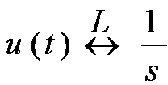

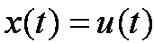

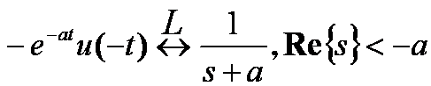

 __要求         ，信号       才有傅立叶变换存在__ 

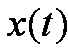

 __1__    __、比较例__    __1__    __和例__    __2__    __的两个信号，它们的拉氏变换的代数表示式是一样的，但使这个代数表示式成立的__    __S__    __域__    __却不相同。__ 

 __结论：__    __给出一个信号的拉氏变换时，__    _代数表示式_    __和使该表示式成立的__    _变量_    _s_    _的范围_    __都应给出。__ 

 __2__    __、 拉氏变换与傅里叶变换一样存在收敛问题。__    __并非任何信号的拉氏变换都存在，也不是 __    __S __    __平面上的任何复数都能使拉氏变换收敛。__ 

 __3__    __、使拉氏变换积分收敛的复数 __    __S__    __的范围，称为拉氏变换的__    __收敛域__    __ ，简记为__    __ROC__    __ __    __。（__    __Region of Convergence__    __）__ 

 __4__    __、__    __不同的信号可能会有完全相同的拉氏变换表达式，只是它们的收敛域不同。__ 

 __5__    __、__    __只有拉氏变换表达式连同相应的收敛域，才能和信号建立一一对应的关系__    __。__ 

 __6__    __、__    __如果拉氏变换的__    __ROC__    __包含      轴__    __，则有__ 

 __二__    __\. __    __ROC__    __的表示方法：（复平面__    __\)__ 

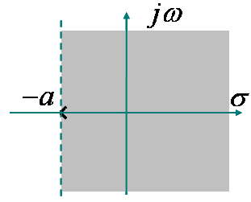

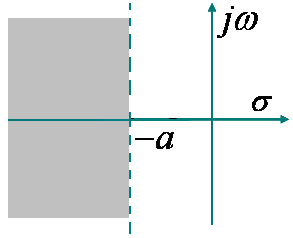

 __有理函数__    __X\(S\)__    __的__    __ROC__    __的性质：__    __1__    __）__    __X\(s\)__    __的__    __ROC__    __在__    __s__    __平面内由平行于     轴的带状区域组成；__ 

 __2__    __）右边信号的__    __ROC__    __在__    __s__    __平面的右半部；__ 

 __3__    __）左边信号的__    __ROC__    __在__    __s__    __平面的左半部；__ 

 __若   是右边信号__    __\,       \,   __    __在__    __ROC__    __内__    __，则有         绝对可积，即：__ 

 __表明   也在收敛域内，右边信号的__    __ROC__    __在极点的右边。__ 

__  __   __若      是左边信号，定义于            __    __\,      __    __在 __    __ROC __    __内，            ，则__ 

 __表明   也在收敛域内__    __。__    __左边信号的__    __ROC__    __在最左极点的的左边__ 

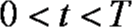

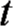

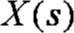

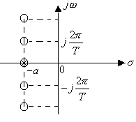

__  __   __显然    在       也有一阶零点，由于零极点相抵消，致使在整个__    __S__    __平面上无极点。__ 

 __当         时，上述__    __ROC__    __有公共部分，__ 

 __当         时，上述 __    __ROC __    __无公共部分，表明       	不存在。__ 

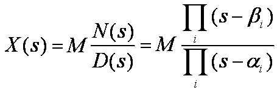

__    __   __前面的例子给出的拉氏变换式都是关于__    __s__    __的两个多项式之比，这种形式的拉氏变换称为有理拉氏变换。__ 

 __令分子多项式       的根称为    的__    __零点__    __，用  表示__ 

 __令分母多项式       的根称为    的__    __极点__    __，用  表示__ 

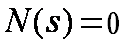

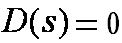

 __    __    __的零极点图：__    __在__    __s__    __平面标出    的零点和极点。__ 

 __例：画出                             的零极点图__ 

__    __   __在有限__    __S__    __平面内，    的零点和极点可以完全表征    的代数表示式。（__    __常数因子除外__    __）__ 

 __例：已知    的零、极点分布如图，且                                                        	   写出     的表示式。__ 

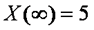

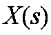

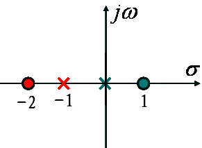

 __    __    __零极点图及其收敛域可以表示一个 	  最多与真实的    相差一个常数因子   。__ 

 __  因此，__    __零极点图是拉氏变换的图示方法__    __。__ 

 __例：画出                          __ 

 __的零极点图__ 

 __可以形成三种 __    __ROC__    __：__ 

 __   __    __ROC__    __：             此时       是右边信号。__ 

 __   __    __ROC__    __：                   此时       是左边信号。__ 

 __   __    __ROC__    __：                      此时       是双边信号__ 

 __Properties  of  the  Laplace  Transform__ 

 __ __    __拉氏变换与傅氏变换一样具有很多重要的性质。这里只着重于__    __ROC__    __的讨论。__ 

 __1\. __    __线性__    __（__    __Linearity __    __）：__ 

 __ __    __当  与  无交集时，表明    不存在。__ 

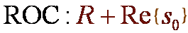

  *  __2\. __    __时移性质__    __（__    __Time Shifting__    __）__    __:__ 
  *  __3\. S__    __域平移__    __（__    __Shifting in the s\-Domain__    __）__    __:__ 

 __    __    __表明             的__    __ROC__    __是将        的__    __ROC__    __平移了一个__    __            。__ 

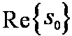

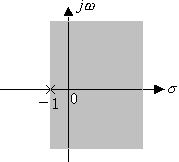

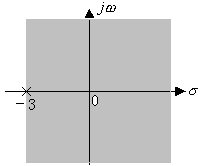

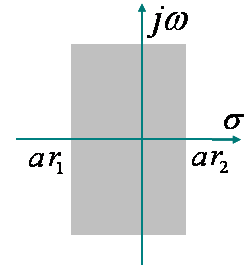

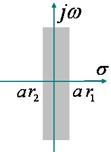

__ __   __4\.  __    __时域尺度变换__    __（__    __Time Scaling__    __）__    __:__ 

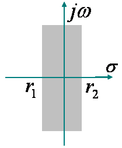

 __求                           的拉氏变换及__    __ROC__ 

 __  __    __可见：__    __若信号在时域尺度变换，其拉氏变换的__    __ROC__    __在__    __S__    __平面上作相反的尺度变换。__ 

 __5\.  __    __共轭对称（__    __Conjugation__    __）性__    __：__ 

 __如果    是实信号，且    在  有极点（或零点），则    一定在    也有极点或零点。这表明：__    __实信号的拉氏变换其复数零、极点必共轭成对出现。__ 

__ __   __6\.  __    __卷积性质__    __:__    __（__    __Convolution Property__    __）__ 

__    __   __原因是       与       相乘时，发生了零极点相抵消的现象。当被抵消的极点恰好在__    __ROC__    __的边界上时，就会使收敛域扩大__    __。__ 

 __7\. __    __时域微分__    __:__    __（__    __Differentiation in theTime Domain__    __）__ 

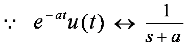

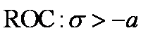

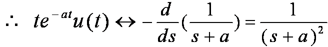

 __8\.  S__    __域微分__    __:__    __（__    __Differentiation in the s\-Domain__    __）__ 

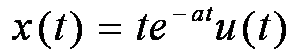

 __例__    __\.__    __求                的拉氏变换__ 

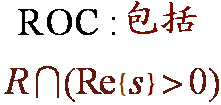

__ __   __9\.  __    __时域积分__    __:__    __（__    __Integration in the Time Domain __    __）__ 

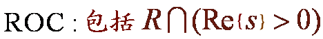

__ 10__   __\. __    __初值与终值定理__    __:__ 

 __（__    __The Initial\- and  Final\- Value Theorems\)__ 

 __例：已知因果信号    的拉氏变换__ 

 __    				求     和__ 

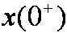

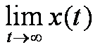

 __时     ，且在    不包含奇异函数。__ 

 __将       在        展开为__    __Taylor__    __级数有：__ 

 __是因果信号，且在    无奇异函数__    __\,__ 

 __除了    在    可以有一阶极点外，其它极点均在__    __S__    __平面__    __的左半平面（即__    __保证    有终值__    __）。__    __故          的__    __ROC__    __中必包含     轴。表明__ 

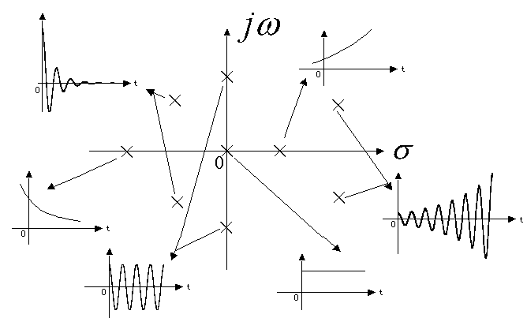

 __若                 在__    __ROC__    __内，则有__    __:__ 

 __The Inverse Laplace Transform__ 

 __当  从         时__    __\,  __    __从__ 

 __拉氏反变换表明__    __:__ 

 __        __    __可以被分解成复振幅为__ 

 __  的复指数信号   的线性组合。__ 

 __对有理函数形式的    求反变换一般有两种方法__    __\,__    __即__    __部分分式展开法__    __和__    __留数法__    __。__ 

__  __   __1\. __    __将         展开为部分分式。                                __    __2\. __    __根据       的__    __ROC__    __，确定每一项的__    __ROC __    __。         __    __3\. __    __利用常用信号的变换对与拉氏变换的性质__    __\,__    __对每一项进行反变换。__ 

 __确定其可能的收敛域及所对应信号的属性。__ 

 __9\.4  __    __由零极点图对傅里叶变换几何求值__ 

 __Geometric Evaluation of the Fourier Transform __    __from the Pole\-Zero Plot__ 

 __可以用零极点图表示         的特征__    __。当__    __ROC__    __包括　　轴时，以            代入__ 

 __就可以得到          。以此为基础可以用几何求值的方法从零极点图求得		            的特性。这在定性分析系统频率特性时有很大用处。__ 

 __令             即在__    __S__    __平面中__    __s__    __沿虚轴移动，可得：__ 

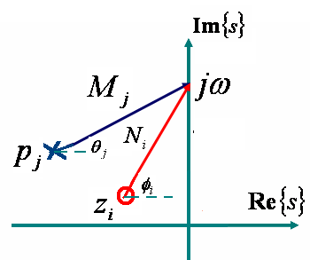

 __例：已知                                     ，用几何法确定傅立叶变换的幅频和相频特性。__ 

 __注：__    __用几何法确定傅立叶变换的意义：__ 

 __      由零极点图来近似观察傅立叶变换的整体特性。__ 

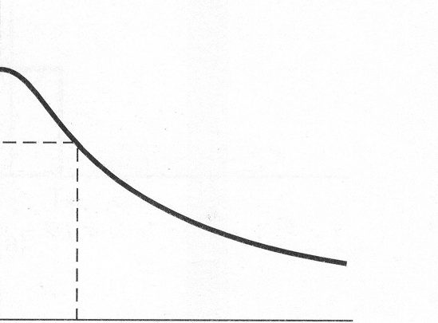

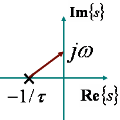

__  __   __随着    ，      单调下降__    __，__ 

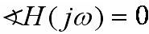

__ __   __随着    ，       趋向     。__ 

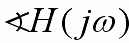

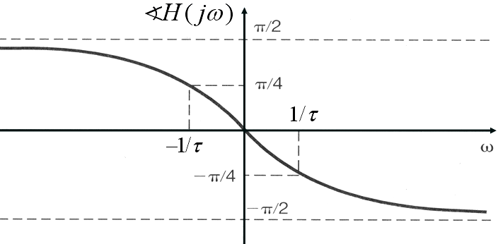

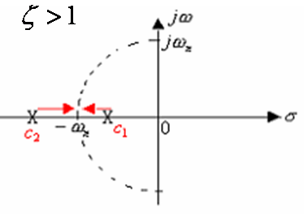

__  __   __1\. __    __当     时，    有两个实数极点，      随着   的增加而单调下降，而        则由__ 

 __     时为__    __0__    __变到        的     。__ 

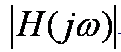

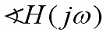

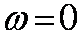

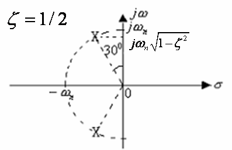

__ __   __2\.__    __　当            时，则二阶 极点分裂为__    __共轭复数极点，__    __且随    的减小而逐步靠近     轴。极点运动的轨迹__    __——__    __根轨迹是一个半径为      的圆周__    __。__ 

__  __   __由于第__    __2__    __象限的极点矢量变得很短，因而会使      出现峰值。其峰点位于         __ 

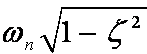

 __随着   ，位于第__    __2__    __象限的极点矢量比第__    __3 __    __象限的极点矢量更短，因此它对系统特性的影响较大。__ 

__ __   __该系统的      在任何时候都等于__    __1__    __，所以称为__    __全通系统__    __。__ 

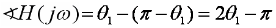

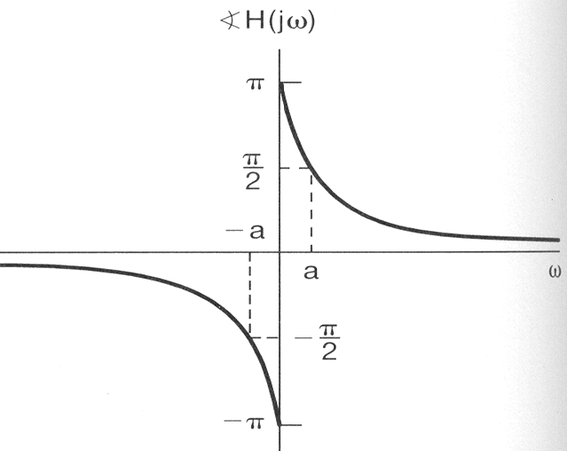

__  __   __考查两个系统，它们的极点相同，零点分布关于    轴对称。其中一个系统的零点均在左半平面，另一个系统的零点均在右半平面。__ 

__  __   __显然这两个系统的幅频特性是相同的。但零点在左半平面的系统其相位总小于零点在右半平面的系统。因此将__    __零极点均位于左半平面的系统称为最小相位系统。__ 

__  __   __工程应用中设计的各种频率选择性滤波器，如：__    __Butterworth __    __、__    __Chebyshev__    __、 __    __Cauer__    __滤波器都是最小相位系统。__ 

 __从本质上讲__    __系统的特性是由系统的零、极点分布决定的__    __。对系统进行优化设计，实质上就是优化其零、极点的位置。__ 

 __当工程应用中要求实现一个非最小相位系统时，通常采用将一个最小相位系统和一个全通系统级联来实现。__ 

 __Some Laplace Transform Pairs__ 

 __9\.7__    __用拉氏变换分析与表征__    __LTI__    __系统__ 

 __Analysis and Characterized of LTI Systems Using  the Laplace Transform__ 

__  __   __以卷积特性为基础，可以建立__    __LTI__    __系统的拉氏变换分析方法，即__ 

__  __   __其中    是    的拉氏变换，称为__    __系统函数__    __或__    __转移函数__    __。__ 

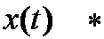

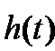

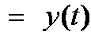

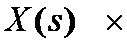

 __如果     时      ，则__    __系统是因果的__    __。__ 

 __             __    __连同相应的__    __ROC__    __也能完全描述一个__    __LTI__    __系统。系统的许多重要特性在        及其__    __ROC__    __中一定有具体的体现。__ 

 __二__    __\.  __    __用系统函数表征__    __LTI__    __系统：__ 

__   __   __因此，__    __因果系统__    __的       是右边信号，结论 ：其        的__    __ROC__    __必位于最右极点右边__    __。__ 

__  __   __应该强调指出，由__    __ROC__    __的特征，反过来并不能判定系统是否因果。__    __ROC__    __是最右边极点的右边并不一定系统因果。__ 

 __因果性判定：__ 

 __If__ 

 __Then    __    __系统是因果的。__ 

__  __   __如果系统稳定，则有                            。因此            必存在。意味着        的__    __ROC__    __必然包括      轴。__ 

 __系统稳定性判定：__ 

 __if__    __系统函数        的__    __ROC__    __包括      轴，__    __then__    __系统稳定。__ 

 __因果系统稳定性判定：    __ 

 __if    __    __的__    __全部极点必须位于__    __S__    __平面的左半边，__    __Then__    __具有有理        的因果系统稳定。__ 

 __例__    __1__    __：某系统的                               __ 

 __显然该系统是因果的，确定系统的稳定性__    __。__ 

 __显然，__    __ROC__    __是最右边极点的右边。__ 

__       __   __的__    __ROC__    __是最右边极点的右边，但       是非有理函数，__    __                ，系统是非因果的。__ 

__  __   __由于__    __ROC__    __包括     轴，该系统仍是稳定的。__ 

__     __   __仍是非有理函数，__    __ROC__    __是最右边极点的右边，__    __但由于              ，是因果的。__    __  __ 

 __如果__    __LTI__    __系统的系统函数是有理函数，且全部极点位于__    __S__    __平面的左半边，则__    __因果__    __系统是稳定的。 __ 

 __2\. __    __如果__    __LTI__    __系统的系统函数是有理函数，且系统因果，则系统函数的__    __ROC__    __位于最右边极点的右边。__ 

 __ 3\.__    __如果__    __LTI__    __系统是稳定的，则系统函数的__    __ROC__    __必然包括      轴。__ 

 __三__    __\. __    __由__    __LCCDE__    __描述的__    __LTI__    __系统的系统函数：__ 

 __的__    __ROC__    __需要由系统的相关特性来确定。__ 

 __1__    __）__    __如果已知__    __LCCDE__    __描述的系统是因果的，则              的__    __ROC__    __必是最右边极点的右边。__ 

 __2__    __）如果已知__    __LCCDE__    __描述的系统是稳定的，则           的__    __ROC __    __必包括      轴__    __。__ 

 __例__    __1:__    __已知__    __LTI__    __系统的输入            ，输出                  ，试确定系统函数及系统的其它性质，以及表征系统的微分方程。__    __   __ 

 __例__    __2__    __：一因果__    __LTI__    __系统，其输入和输出满足：__ 

 __微分方程：__ 

 __求系统函数及收敛域；画出零极点图；判定系统稳定性？__ 

 __自学。请关注例__    __9\.25__    __、__    __9\.26__    __、__    __9\.27__ 

__ __   __五__    __\.  Butterworth__    __滤波器__    __:__ 

__  __   __通常__    __Butterworth__    __滤波器的特性由频率响应的模平方函数给出。对__    __N__    __阶 __    __Butterworth__    __低通滤波器有：__ 

 __Butterworth__    __滤波器的冲激响应是实信号__    __，__ 

 __将      函数拓展到整个__    __S__    __平面有：__ 

 __表明__    __N__    __阶__    __Butterworth__    __低通滤波器模平方函数__    __全部__    __2N__    __个极点均匀分布在半径为     的圆周上__ 

 __极点分布的特征：__ 

 __2N__    __个极点等间隔均匀分布在半径为    的圆周上__    __。__ 

__   __   __轴上不会有极点。当__    __N__    __为奇数时在实轴上有极点，__    __N__    __为偶数时实轴上无极点。__ 

 __相邻两极点之间的角度差为     。__ 

 __极点分布总是关于原点对称的。__ 

__  __   __要实现的滤波器应该是因果稳定系统，因此位于左半平面的__    __N__    __个极点一定是属于       的。__ 

 __    __    __据此，确定出         后，也就可以综合出一个__    __Butterworth __    __滤波器。__ 

 __9\.8 __    __系统函数的代数属性与系统的级联并联型结构__ 

 __System  Function  Algebra  and  Block  Diagram  Representations__ 

 __二__    __\. __    __LTI__    __系统的级联和并联型结构__    __：__ 

 __LTI__    __系统可以由一个__    __LCCDE__    __来描述。__ 

 __将     的分子和分母多项式因式分解__ 

__  __   __这表明：__    __一个__    __N__    __阶的__    __LTI__    __系统可以分解为若干个二阶系统和一阶系统的级联。在__    __N__    __为偶数时，可全部组合成二阶系统的级联形式。__ 

 __如果__    __N__    __为奇数，则有一个一阶系统出现。__ 

__  __   __将    展开为部分分式 __    __\(__    __假定    的分子阶数不高于分母阶数，所有极点都是单阶的），则有：__ 

 __将共轭成对的复数极点所对应的两项合并__    __:__ 

__   __   __N__    __为偶数时又可将任意两个一阶项合并为二阶项，由此可得出系统的并联结构：__ 

 __The  Unilateral  Laplace  Transform__ 

__  __   __单边拉氏变换是双边拉氏变换的特例。也就是因果信号的双边拉氏变换。单边拉氏变换对分析__    __LCCDE __    __描述的增量线性系统具有重要的意义。__ 

__  __   __如果    是因果信号，对其做双边拉氏变换和做单边拉氏变换是完全相同的。__ 

__  __   __单边拉氏变换也同样存在__    __ROC __    __。其__    __ROC__    __必然遵从因果信号双边拉氏变换时的要求，即：__    __一定位于最右边极点的右边。__ 

__  __   __正因为这一原因，在讨论单边拉氏变换时，一般不再强调其__    __ROC__    __。__ 

 __    __    __单边拉氏变换的反变换一定与双边拉氏变换的反变换相同。__ 

__      __   __与    不同，是因为    在     的部分对    有作用而对   没有任何作用所致。__ 

__　__   __单边拉氏变换的大部分性质与双边拉氏变换相同，但也有几个不同的性质。__ 

 __1\. __    __时域微分__    __（__    __Differentiation in the Time Domain__    __）__ 

 __2\. __    __时域积分__    __（__    __Integration in the Time Domain__    __）__ 

 __3\.__    __时延性质__    __（__    __Time Shifting__    __）__ 

__       __   __是因果信号时，单边拉氏变换的时延特性与双边变换时一致__    __。__ 

 __三__    __\.__    __利用单边拉氏变换求解增量线性系统__    __:__ 

__  __   __单边拉氏变换特别适合于求解由__    __LCCDE__    __描述的增量线性系统。__ 

 __其中，第一项为__    __强迫响应__    __，其它为__    __自然响应。__ 

 __9\.10 __    __小结    __    __Summary__ 

 __拉氏变换是傅氏变换的推广，在__    __LTI__    __系统分析中特别有用。它可以将微分方程变为代数方程，这对分析系统互联、系统结构、用系统函数表征系统、分析系统特性等都具有重要意义。__ 

 __ROC__    __是双边拉氏变换的重要概念。离开了__    __ROC__    __，信号与双边拉氏变换的表达式将不再有一一对应的关系。__ 

 __ __    __作为拉氏变换的几何表示，零极点图对分析系统的频率特性、零极点分布与系统特性的关系具有重要意义。从本质上讲，系统的特性完全是由系统函数的零极点分布决定的__ 

 __ 拉氏变换的许多性质对于在变换域分析__    __LTI__    __系统，具有重要作用。__ 

 __ 作为双边拉氏变换的特例，单边拉氏变换特别适用于分析增量线性系统。__ 

 __作业：__ 

 __9\.1__    __、__    __9\.5__    __、__    __9\.8__    __、__    __9\.14__    __、__    __9\.21__    __、__    __9\.22__    __、__    __9\.23__    __、__    __9\.33__    __、__    __9\.47__    __、__    __9\.48__ 

