## 目录 {#toc0}

- [**1. 引言**](#sec91)
- [2. Z变换](#sec92)
- [3. Z变换性质](#sec93)
- [4. 常用Z变换对](#sec94)
- [5. 用Z变换分析与表征线性时不变系统](#sec95)
- [6. 单边Z变换](#sec96)

# 引言 {#sec91}

##  Z变换简介

- 离散系统也可用类似于分析连续系统所采用的变换法进行分析。
  
- 在分析连续系统时，经过拉普拉斯变换将微分方程变换为代数方程，从而使分析简化。
  
- 在分析离散系统中，Z变换的地位的作用类似于连续系统中的拉普拉斯变换，利用Z变换把差分方程变换为代数方程，从而使离散系统的分析大为简化。

 

<!-- ## 利用留数计算定积分

$$
\int_{-\infty}^{\infty} R(x) \, dx
$$
其中 $R(x)=\frac{N(x)}{D(x)}$ 是 $x$ 的有理函数，$N,D$ 为多项式，且 $\deg D \geq \deg N + 2$，$R$ 在实轴上无奇点。

1. 选取足够大的 $r$，使得以 0 为圆心、上半圆盘包含 $R(z)$ 在上半平面内的所有奇点 $z_1,\ldots,z_K$（下半平面的奇点我们不关心）

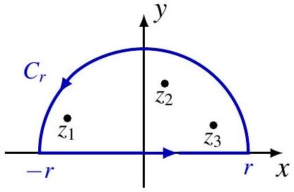

2. $\int_{-r}^{r} R(x) \, dx + \int_{C_r} R(z) \, dz = j 2 \pi \sum_{k=1}^{K} \operatorname{Res}(R, z_k)$

3. $\lim_{r\to\infty} \int_{C_r} R(z) \, dz = 0$（由条件 $\deg D \geq \deg N + 2$ 保证）

4. $\int_{-\infty}^{\infty} R(x) \, dx = j 2 \pi \sum_{k=1}^{K} \operatorname{Res}(R, z_k)$

**引理**：设 $f(z)$ 在区域 $D=\left\{z: R<|z|<\infty, \theta_1 \leq \arg z \leq \theta_2\right\}$（$0\leq\theta_1<\theta_2\leq 2\pi$）上连续。令 $\gamma_r$ 为圆弧 $z(t)=r e^{j\theta}$，$r>R$，$\theta\in[\theta_1,\theta_2]$。若 $\limsup_{D\ni z\to\infty} z f(z)=0$，则
$$
\lim_{r\to\infty} \int_{\gamma_r} f(z) \, dz = 0
$$

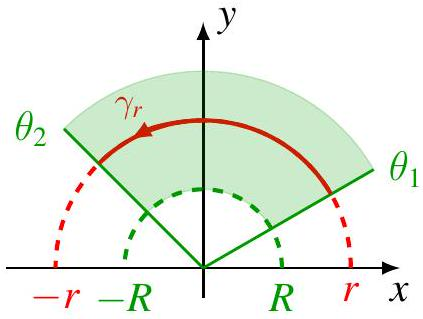

**证明**：由于 $\limsup_{D\ni z\to\infty} z f(z)=0$，对任意 $\epsilon>0$，存在 $R_\epsilon$ 使得当 $z\in D$ 且 $|z|>R_0$ 时，$|z f(z)| < \frac{\epsilon}{\theta_2-\theta_1}$。对于 $r>R_0$，
$$
\left|\int_{\gamma_r} f(z)\,dz\right| \leq \int_{\gamma_r} |f(z)|\,ds \leq \int_{\gamma_r} \frac{\epsilon}{(\theta_2-\theta_1)r} \,ds = \epsilon
$$

**注**：上一张幻灯片中的第 3 条由该引理在 $\theta_1=0$、$\theta_2=\pi$ 时得出。

## 例题

计算 $I=\int_{-\infty}^{\infty} \frac{x^2 \, dx}{(x^2+a^2)(x^2+b^2)}$，其中 $a,b>0$。

**解**：$R(z)=\frac{z^2}{(z^2+a^2)(z^2+b^2)}$ 有四个单极点 $z=\pm ja,\pm jb$。其中 $ja,jb$ 在上半平面。留数为
$$
\begin{aligned}
\operatorname{Res}(R, ja) &= \lim_{z\to ja}(z-ja)R(z) = \frac{a}{2j(a^2-b^2)}, \\
\operatorname{Res}(R, jb) &= \lim_{z\to jb}(z-jb)R(z) = \frac{-b}{2j(a^2-b^2)}.
\end{aligned}
$$
因此
$$
I = j2\pi[\operatorname{Res}(R,ja)+\operatorname{Res}(R,jb)] = \frac{\pi}{a+b}
$$

## 含指数因子的积分（$a>0$）

$$
\int_{-\infty}^{\infty} R(x) e^{j a x} \, dx
$$
其中 $R(x)=\frac{N(x)}{D(x)}$ 为有理函数，$\deg D \geq \deg N +1$，且 $R$ 在实轴上无奇点。

1. 选取足够大的 $r$，使上半圆盘包含上半平面内的所有奇点

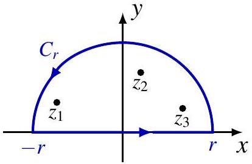

2. $\int_{-r}^{r} R(x)e^{j a x}\,dx + \int_{C_r} R(z)e^{j a z}\,dz = j2\pi \sum_{k=1}^K \operatorname{Res}[R(z)e^{j a z}, z_k]$

3. $\lim_{r\to\infty}\int_{C_r} R(z)e^{j a z}\,dz=0$（由 $\deg D\geq\deg N+1$ 及 Jordan 引理保证）

4. $\int_{-\infty}^{\infty} R(x)e^{j a x}\,dx = j2\pi \sum_{k=1}^K \operatorname{Res}[R(z)e^{j a z}, z_k]$

**注**：若 $a<0$，则使用下半圆盘。

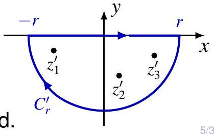

## Jordan 引理

**引理**：设 $f(z)$ 在 $D=\{z: R<|z|<\infty, \operatorname{Im} z \geq 0\}$ 上连续。若 $\lim_{D\ni z\to\infty} f(z)=0$ 且 $a>0$，则
$$
\lim_{r\to\infty} \int_{C_r} f(z) e^{j a z} \, dz = 0
$$
其中 $C_r$ 为 $z(t)=r e^{j\theta}$，$r>R$，$\theta\in[0,\pi]$。

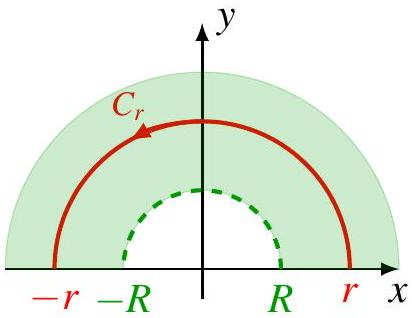

**证明**：令 $I_r=\int_{C_r} f(z)e^{j a z}\,dz$，$M_r=\max_{z\in C_r}|f(z)|$。则
$$
|I_r| \leq M_r \int_0^\pi e^{-a r \sin\theta} r \,d\theta = 2M_r \int_0^{\pi/2} e^{-a r \sin\theta} r \,d\theta
$$
利用 $\sin\theta \geq \frac{2}{\pi}\theta$（$\theta\in[0,\pi/2]$）及 $\lim_{r\to\infty}M_r=0$，可证 $|I_r|\to 0$。

**注**：若 $a<0$，引理对下半平面仍成立。

## 例题

计算 $I=\int_0^\infty \frac{x \sin x}{x^2 + a^2} \, dx$，$a>0$。

**解**：$R(z)=\frac{z}{z^2+a^2}$ 有单极点 $\pm ja$，$ja$ 在上半平面。
$$
\operatorname{Res}[R(z)e^{jz}, ja] = \frac{e^{-a}}{2}
$$
因此
$$
\int_{-\infty}^{\infty} \frac{x e^{jx}}{x^2+a^2}\,dx = j\pi e^{-a}
$$
由于 $\frac{x\sin x}{x^2+a^2}$ 是偶函数，
$$
I = \frac12 \operatorname{Im}(j\pi e^{-a}) = \frac{\pi}{2} e^{-a}
$$

## 例题（逆 CTFT）

求 $X(j\omega)=\frac{1}{a+j\omega}$（$a>0$）的逆连续时间傅里叶变换。

**解**：
$$
x(t) = \frac{1}{2\pi} \int_{-\infty}^{\infty} \frac{1}{a+j\omega} e^{j\omega t} \, d\omega
$$
$R(z)=\frac{1}{a+jz}$ 在 $z=ja$ 有单极点（上半平面）。

当 $t>0$ 时，
$$
x(t) = j \operatorname{Res}[R(z)e^{jzt}, ja] = e^{-at}
$$

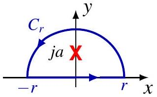

当 $t<0$ 时，$R(z)$ 在下半平面解析，故 $x(t)=0$。

因此 $x(t)=e^{-at}u(t)$。

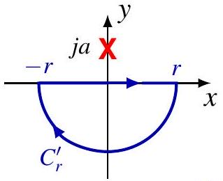

## 目录

1. 利用留数计算定积分
2. Z 变换
3. Z 变换的性质
4. 用 Z 变换分析离散时间 LTI 系统 -->

## 目录 {#toc1}

- [1. 引言](#sec91)
- [**2. Z变换**](#sec92)
- [3. Z变换性质](#sec93)
- [4. 常用Z变换对](#sec94)
- [5. 用Z变换分析与表征线性时不变系统](#sec95)
- [6. 单边Z变换](#sec96)

#  Z变换 {#sec92}

## Z 变换

离散时间 LTI 系统对输入 $x[n]=z^n$ 的响应为
$$
y[n]=(x*h)[n]=H(z)z^n
$$
其中 $h$ 是系统的冲激响应，
$$
H(z)=\sum_{k=-\infty}^{\infty} h[k]z^{-k}
$$
系统函数 $H(z)$ 称为 $h$ 的 **Z 变换**。

一般地，离散时间信号 $x[n]$ 的 Z 变换定义为
$$
X(z)=\sum_{n=-\infty}^{\infty} x[n]z^{-n}
$$
也记作 $X=\mathcal{Z}\{x\}$ 或 $x[n]\stackrel{\mathcal{Z}}{\longleftrightarrow} X(z)$。

## Z 变换（续）

$$
X(z)=\sum_{n=-\infty}^{\infty} x[n]z^{-n}=\sum_{n=-\infty}^{\infty} c_n z^n
$$
是以 $z=0$ 为中心的 Laurent 级数，其 $z^n$ 项的系数为 $c_n=x[-n]$。

作为 Laurent 级数，Z 变换在以 0 为中心的某个环形区域（称为收敛域 ROC）上收敛。

## 与 DTFT 的关系

令 $z=re^{j\omega}$，则
$$
X(re^{j\omega})=\sum_{n=-\infty}^{\infty} \{x[n]r^{-n}\}e^{-j\omega n}=\mathcal{F}\{x[n]r^{-n}\}
$$
若 ROC 包含单位圆，令 $r=1$ 可得
$$
X(e^{j\omega})=\mathcal{F}\{x\}
$$

## 例题

:::: {.columns style="text-align: left;"}

::: {.column width="70%"}

对于 $x[n]=a^n u[n]$，
$$
X(z)=\sum_{n=0}^{\infty}a^n z^{-n}=\frac{1}{1-a z^{-1}}=\frac{z}{z-a}, \quad \mathrm{ROC}: |z|>|a|
$$

若 $|a| < 1$，收敛域 (ROC) 包含单位圆，此时：

$$\mathcal{F}\{x\}(e^{j\omega}) = X(e^{j\omega}) = \frac{1}{1 - ae^{-j\omega}}$$

若 $|a| > 1$，**DTFT 不存在**。

若 $|a| = 1$，**DTFT 以广义函数（分布）的形式存在**，且：

$$\mathcal{F}\{x\}(e^{j\omega}) \neq X(z)\Big|_{z=e^{j\omega}}$$

:::

::: {.column width="30%"}

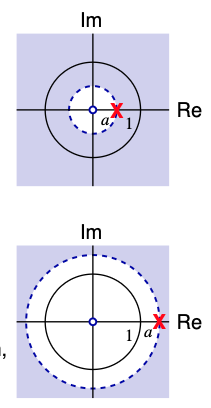{width="80%"}

:::
::::

## 例题

:::: {.columns style="text-align: left;"}

::: {.column width="70%"}

对于序列 $x[n] = -a^n u[-n-1]$，其 Z 变换为：

$$X(z) = - \sum_{n=-\infty}^{-1} a^n z^{-n} = \frac{1}{1 - az^{-1}} = \frac{z}{z - a}$$

其**收敛域 (ROC)** 为 $|z| < |a|$。

1.  若 **$|a| > 1$**，收敛域包含单位圆，此时：
    $$\mathcal{F}\{x\}(e^{j\omega}) = X(e^{j\omega}) = \frac{1}{1 - ae^{-j\omega}}$$

2.  若 **$|a| < 1$**，**DTFT 不存在**。

3.  若 **$|a| = 1$**，**DTFT 以广义函数（分布）的形式存在**，且：
    $$\mathcal{F}\{x\}(e^{j\omega}) \neq X(z)\Big|_{z=e^{j\omega}}$$

:::

::: {.column width="30%"}

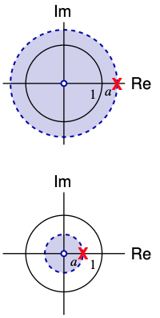{width="80%"}

:::
::::

## 收敛域（ROC）的重要性

:::: {.columns style="text-align: left;"}

::: {.column width="70%"}
对于右边序列（因果序列） $x_1[n] = a^n u[n]$，其 Z 变换对关系如下：

$$x_1[n] = a^n u[n] \longleftrightarrow X_1(z) = \frac{z}{z - a}$$

**收敛域 (ROC)**：
$$|z| > |a|$$

对于左边序列（非因果序列） $x_2[n] = -a^n u[-n-1]$，其 Z 变换对关系如下：

$$x_2[n] = -a^n u[-n-1] \longleftrightarrow X_2(z) = \frac{z}{z - a}$$

**收敛域 (ROC)**：
$$|z| < |a|$$

不同的信号可以具有相同的 $X(z)$ 但不同的 **收敛域 (ROC)**。

这与以下数学事实是一致的：一个函数在不同的**解析圆环** 中具有不同的**洛朗级数** 展开式。

:::

::: {.column width="30%"}

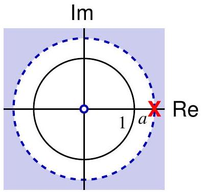{width="80%"}

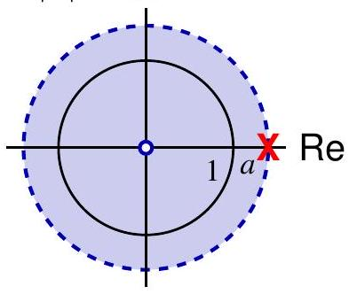{width="80%"}

:::
::::
**必须指明 ROC**！

## 例题

$x[n]=7\left(\frac13\right)^n u[n]-6\left(\frac12\right)^n u[n]$，

:::: {.columns style="text-align: left;"}

::: {.column width="70%"}

$$
\begin{aligned}
X(z) &= \sum_{n=0}^{\infty} \left[ 7 \left(\frac{1}{3}\right)^n - 6 \left(\frac{1}{2}\right)^n \right] z^{-n} \\
&= \frac{7}{1 - \frac{1}{3}z^{-1}} - \frac{6}{1 - \frac{1}{2}z^{-1}} \\
&= \frac{1 - \frac{3}{2}z^{-1}}{\left(1 - \frac{1}{3}z^{-1}\right)\left(1 - \frac{1}{2}z^{-1}\right)} \\
&= \frac{z(z - \frac{3}{2})}{(z - \frac{1}{3})(z - \frac{1}{2})}
\end{aligned}
$$

其**收敛域 (ROC)** 为：
$|z| > \frac{1}{2}$

<!-- **收敛半径 $R$：**
$R = \limsup_{n \to \infty} \sqrt[n]{|x[n]|} = \frac{1}{2}$ -->

:::

::: {.column width="30%"}

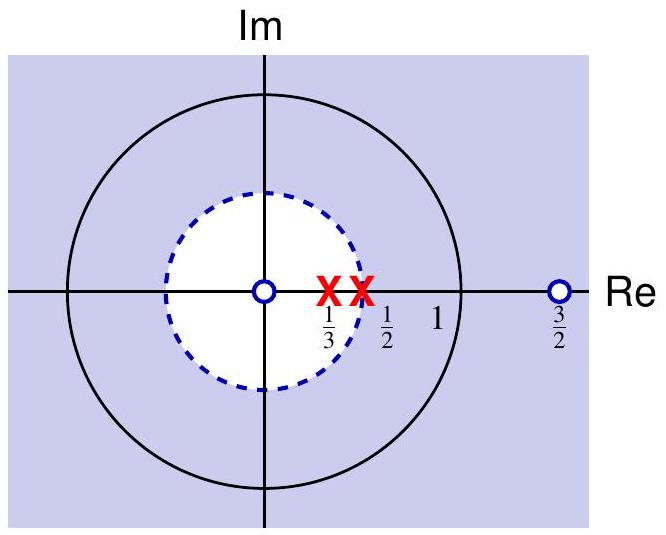
:::
::::

## 例题（正弦调制）
对于
$x[n]=\left(\frac13\right)^n \sin\left(\frac{\pi}{4}n\right)u[n]$，

:::: {.columns style="text-align: left;"}

::: {.column width="70%"}
$$
\begin{aligned}
X(z) &= \frac{1}{2j} \frac{1}{1 - \frac{1}{3}e^{j\frac{\pi}{4}}z^{-1}} - \frac{1}{2j} \frac{1}{1 - \frac{1}{3}e^{-j\frac{\pi}{4}}z^{-1}} \\
&= \frac{\frac{1}{3\sqrt{2}}z}{(z - \frac{1}{3}e^{j\frac{\pi}{4}})(z - \frac{1}{3}e^{-j\frac{\pi}{4}})}
\end{aligned}
$$

其**收敛域 (ROC)** 为：$|z| > \frac{1}{3}$

* **单极点** 分别位于：
    $z = \frac{1}{3}e^{j\frac{\pi}{4}} \quad \text{和} \quad z = \frac{1}{3}e^{-j\frac{\pi}{4}}$

* **单零点** 位于：$z = 0$

:::

::: {.column width="30%"}

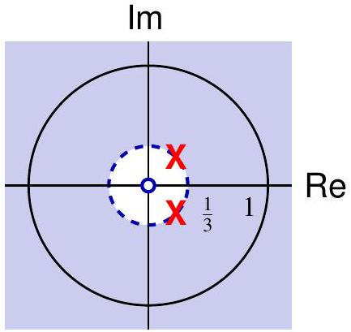

:::
::::

通过令 $\zeta = \frac{1}{z}$，得到：

$$X(\zeta) = \frac{\frac{1}{3\sqrt{2}}\zeta}{(1 - \frac{1}{3}e^{j\frac{\pi}{4}}\zeta)(1 - \frac{1}{3}e^{-j\frac{\pi}{4}}\zeta)}$$

因此，$X(z)$ 在 **无穷远点 ($\infty$)** 处也具有一个**一阶零点**。

## 有理 Z 变换

有理 Z 变换形式为
$$
X(z)=\frac{N(z)}{D(z)}
$$
其中 $N,D$ 是互质多项式。

$$
X(z)=A\frac{\prod_{k=1}^n (z-z_k)}{\prod_{k=1}^m (z-p_k)}
$$

根据约定 $\prod_{k=1}^{0} \cdot = 1$：

* $z_1, \dots, z_n$ 是 $X$ 的**有限零点**
* $p_1, \dots, p_m$ 是 $X$ 的**有限极点**
* 若 $n > m$，则 $X$ 在无穷远点 ($\infty$) 处具有 $n - m$ 阶的**极点**
* 若 $n < m$，则 $X$ 在无穷远点 ($\infty$) 处具有 $m - n$ 阶的**零点**
  
有理 Z 变换由其极零点图和 ROC（差一个常数因子）唯一确定。

## 有理 Z 变换

一个有理函数 $X$ 由其在复数域 $\mathbb{C}$ 中的零点和极点（包括它们的阶数）唯一确定，仅相差一个常数因子。
 
一个有理 Z 变换由其**零极点图 (pole-zero plot)** 和**收敛域 (ROC)** 唯一确定，仅相差一个常数因子。

**示例**

$$X(z) = A \frac{(z + 2)(z - e^{j\frac{\pi}{6}})}{(z - \frac{3}{2})(z - \frac{1}{2}e^{j\frac{5\pi}{4}})(z - 2e^{-j\frac{\pi}{4}})}$$

:::: {.columns style="text-align: left;"}

::: {.column width="70%"}

收敛域 (ROC) 的四种可能性：

* $|z| < 1/2$
* $1/2 < |z| < 3/2$
* $3/2 < |z| < 2$
* $2 < |z| < \infty$
:::

::: {.column width="30%"} 

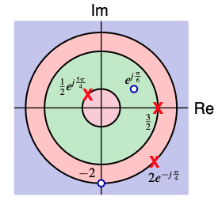{width="80%"}

:::
::::
根据 z 变换的性质，对于任意序列 $x[n]$，其 z 变换 $X(z)$ 的收敛域在几何上具有非常明确的特征：

> **$X(z)$ 的收敛域是在 $z$ 平面内以原点为中心的圆环。**

## ROC 的性质

- ROC 是环形区域 $R_1<|z|<R_2$；
- $X(z)$ 在 ROC 内解析；
- 有限时长信号（序列）：$R_1=0$，$R_2=\infty$；

$$X(z) = \sum_{n=N_1}^{N_2} x[n]z^{-n}, \quad \text{其中 } x[N_1] \neq 0, x[N_2] \neq 0$$

* 若 $x$ 是**因果序列**，即 $N_1 \geq 0$，则收敛域 $\text{ROC} = \bar{\mathbb{C}} \setminus \{0\}$
* 若 $x$ 是**反因果序列**，即 $N_2 \leq 0$，则收敛域 $\text{ROC} = \mathbb{C}$
* 若 $x$ **既非因果也非反因果**，则收敛域 $\text{ROC} = \mathbb{C} \setminus \{0\}$

注: $X$ 也可能在边界上的某些点处收敛，但为了简便起见，除了 $0$ 和 $\infty$ 之外，我们不将这些点包含在 ROC 中。

## ROC 的性质

:::: {.columns style="text-align: centert;"}

::: {.column width="70%"}

对于一个**右边序列** $x[n]$，它从 $n=N_1$ 开始有值（$N_1$ 为有限值），其 z 变换定义为：

$$
X(z) = \sum_{n=N_1}^{\infty} x[n]z^{-n}
$$

:::
::: {.column width="30%"}

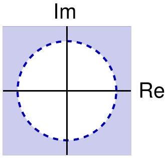

:::
::::

根据 $N_1$ 的取值不同，序列的收敛域表现出以下特性：

:::: {.columns style="text-align: left;"}

::: {.column width="50%"}

**$N_1 < 0$**

* **现象**：如果 $N_1$ 是负值，和式中将包含 $z$ 的**正幂次项**（例如 $z^1, z^2$ 等）。
* **收敛性**：当 $|z| \to \infty$ 时，这些正幂次项将趋于无穷大（变得无界）。
* **结论**：一般来说，右边序列的收敛域**不包括**无限远点 ($z = \infty$)。

:::
::: {.column width="50%"}

**$N_1 \ge 0$**

* **定义**： 当 $n < 0$ 时，$x[n] = 0$。因此 $N_1$ 一定为非负值。
* **收敛性**：和式中只包含 $z$ 的**负幂次项**（$z^{-1}, z^{-2}$ 等）。当 $|z| \to \infty$ 时，这些项趋于 0 或常数。
* **结论**：收敛域**一定包括**无限远点 ($z = \infty$)。
:::
::::

 > **注意**：右边序列的 ROC 总是位于 z 平面内某个圆的外部（即 $|z| > r$）。

## ROC 的性质

:::: {.columns style="text-align: center;"}

::: {.column width="70%"}

对于一个**左边序列** $x[n]$，它在 $n=N_2$ 之后为零（即当 $n > N_2$ 时，$x[n] = 0$），其 z 变换形式如下：

$$
X(z) = \sum_{n=-\infty}^{N_2} x[n]z^{-n} \tag{10.27}
$$

该性质与拉普拉斯变换中关于左半平面收敛域的性质是并行的。
:::
::: {.column width="30%"}
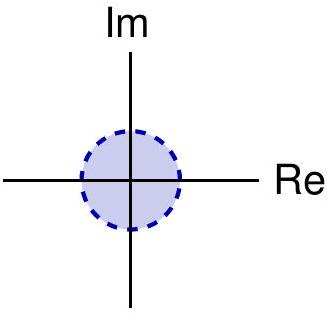
:::
::::

$N_2$ 的取值决定了收敛域是否包含原点 $z=0$：

:::: {.columns style="text-align: left;"}

::: {.column width="50%"}

**包含正指数项的情况 ($N_2 > 0$)**

* **现象**：如果 $N_2$ 为正值，级数展开式中将包括 $z$ 的**负幂次项**（例如 $z^{-1}, z^{-2}$ 等）。
* **收敛性**：当 $|z| \to 0$ 时，这些负幂次项将趋于无穷大（变得无界）。
* **结论**：一般左边序列的收敛域**不包括**原点 ($z = 0$)。

:::
::: {.column width="50%"}

**反因果序列 ($N_2 \le 0$)**

* **定义**：如果 $N_2 \le 0$，即当 $n > 0$ 时 $x[n] = 0$。
* **现象**：级数中仅包含 $z$ 的**零幂次或正幂次项**（$z^0, z^1, z^2$ 等）。
* **结论**：此时收敛域**一定包括**原点 ($z = 0$)。

:::
::::

> **注意**： 收敛域的几何本质依然是**以原点为中心的圆环**。对于左边序列，这个圆环向内延伸。若序列在正时间轴上完全为零（反因果），则圆环中心被填满，包含 $z=0$。

## ROC 的性质

:::: {.columns style="text-align: center;"}

::: {.column width="70%"}
**双边序列** $x[n]$ 是指在 $n \to +\infty$ 和 $n \to -\infty$ 方向上都有值的序列。它可以分解为一个右边序列 $x_R[n]$ 和一个左边序列 $x_L[n]$ 的和：

$$
x[n] = x_R[n] + x_L[n]
$$

其 z 变换定义为：

$$
X(z) = \sum_{n=-\infty}^{\infty} x[n]z^{-n} = \sum_{n=0}^{\infty} x[n]z^{-n} + \sum_{n=-\infty}^{-1} x[n]z^{-n}
$$
:::
::: {.column width="30%"}
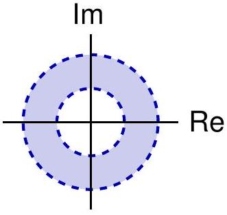
:::
::::
双边序列的收敛域取决于其右边部分和左边部分的共同收敛范围：

:::: {.columns style="text-align: left;"}

::: {.column width="50%"}

* **右边部分**：其收敛域通常为某个圆的外部 $|z| > r_R$。
* **左边部分**：其收敛域通常为某个圆的内部 $|z| < r_L$。
* **结论**：只有当 $r_R < r_L$ 时，两者才有交集。此时双边序列的收敛域是一个**圆环区域**：
  $$r_R < |z| < r_L$$

:::
::: {.column width="50%"}
**收敛域的边界与端点**

* **不包含端点**：由于双边序列在正负无穷两个方向都可能发散，其收敛域一般**不包括** $z=0$ 和 $z=\infty$。
  * 若 $z=0$ 处有负幂次项（来自左边部分），则不收敛。
  * 若 $z=\infty$ 处有正幂次项（来自右边部分），则不收敛。
:::
::::

> **注意**： 双边序列的 ROC 呈现为以原点为中心的有限宽度的**圆环**。

## ROC 的性质

:::: {.columns style="text-align: left;"}

::: {.column width="70%"}

* 对于有理 $X(z)$，ROC 被极点界定（向内至 0 或向外至 $\infty$）。

* 若 $x[n]$ 也是**右边序列**，则：
    $R_2 = \infty$ 且 $R_1 = \max_k |p_k|$，
    其中 $p_k$ 是复平面 $\mathbb{C}$ 中的极点（例如：区域 IV）。

* 若 $x[n]$ 也是**左边序列**，则：
    $R_1 = 0$ 且 $R_2 = \min_k |p_k|$，
    其中 $p_k$ 是复平面 $\mathbb{C} \setminus \{0\}$ 中的极点（例如：区域 I）。

:::
::: {.column width="30%"}
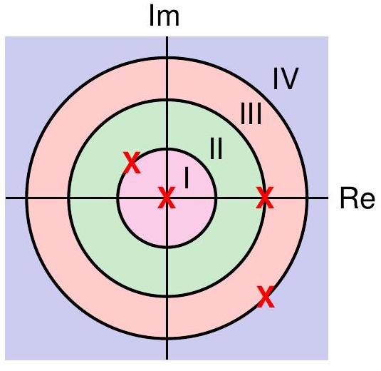{width="80%"}

:::
::::

<!-- ## ROC 的性质

**左边序列**：$R_1=0$；

**右边序列**：$R_2=\infty$；

**双边序列**：$R_1>0$ 且 $R_2<\infty$。

:::: {.columns style="text-align: center;"}

::: {.column width="33%"}

:::
::: {.column width="34%"}

:::
::: {.column width="33%"}

:::
:::: -->

## 逆 Z 变换

$x[n]$ 是 $X(z)$ 的洛朗级数 (Laurent series) 中 $z^{-n}$ 的系数：

$$X(z) = \sum_{n=-\infty}^{\infty} x[n]z^{-n} = \sum_{n=-\infty}^{\infty} c_n z^n$$

对于收敛域 (ROC) 内任何以 $0$ 为中心的正向圆周 $C$：

$$x[n] = c_{-n} = \frac{1}{j2\pi} \oint_{C} \frac{X(z)}{z^{-n+1}} dz = \frac{1}{j2\pi} \oint_{C} X(z) z^{n-1} dz$$

该积分可以直接计算，也可以利用**留数定理** 进行计算。

此外，我们还可以使用任何其他方法来寻找 $X(z)$ 的洛朗级数展开，例如：**部分分式展开**，以及某些已知函数的**幂级数展开**。

**注意：$x[n]$ 是 $z^{-n}$ 的系数，而不是 $z^n$ 的系数！**

## 目录 {#toc2}

- [1. 引言](#sec91)
- [2. Z变换](#sec92)
- [**3. Z变换性质**](#sec93)
- [4. 常用Z变换对](#sec94)
- [5. 用Z变换分析与表征线性时不变系统](#sec95)
- [6. 单边Z变换](#sec96)

# Z变换性质 {#sec93}

## Z 变换的性质

**线性性质**：
$$
ax[n]+by[n] \stackrel{z}{\longleftrightarrow} aX(z)+bY(z)，\quad \mathrm{ROC} \supset \mathrm{ROC}_1 \cap \mathrm{ROC}_2
$$

**时移性质**：
$$
x[n-n_0] \stackrel{z}{\longleftrightarrow} z^{-n_0} X(z)
$$

**Z 域尺度变换**：
$$
z_0^n x[n] \stackrel{z}{\longleftrightarrow} X\left(\frac{z}{z_0}\right)
$$

**时间反转**：
$$
x[-n] \stackrel{z}{\longleftrightarrow} X(z^{-1})
$$

**时间扩展**：
$$
x_{(k)}[n] \stackrel{z}{\longleftrightarrow} X(z^k)
$$

## Z 变换的性质

**共轭**：
$$
x^*[n] \stackrel{z}{\longleftrightarrow} X^*(z^*)
$$

**Z 域微分**：
$$
n x[n] \stackrel{z}{\longleftrightarrow} -z \frac{d}{dz} X(z)
$$

示例：

$$\frac{1}{1 - az^{-1}} = \sum_{n=0}^{\infty} a^n z^{-n}, \quad |z| > |a|$$

$$\frac{d}{dz} \frac{1}{1 - az^{-1}} = \sum_{n=0}^{\infty} (-n) a^n z^{-n-1}, \quad |z| > |a|$$

$$\frac{az^{-1}}{(1 - az^{-1})^2} = -z \frac{d}{dz} \frac{1}{1 - az^{-1}} = \sum_{n=0}^{\infty} n a^n z^{-n}, \quad |z| > |a|$$

## Z 变换的性质
### 初值定理

若 $x$ 是**因果序列**，即当 $n < 0$ 时 $x[n] = 0$，则：
$$x[0] = \lim_{z \to \infty} X(z)$$

#### 证明
$$\lim_{z \to \infty} X(z) = \lim_{z \to \infty} \sum_{n=0}^{\infty} x[n]z^{-n} = \lim_{\zeta \to 0} \sum_{n=0}^{\infty} x[n]\zeta^n \stackrel{(*)}{=} X_1(0) = x[0]$$
其中 $(*)$ 是根据 $X_1(\zeta) = \sum_{n=0}^{\infty} x[n]\zeta^n$ 的连续性得出的。

#### 示例 
对于序列 $x[n] = 7 \left(\frac{1}{3}\right)^n u[n] - 6 \left(\frac{1}{2}\right)^n u[n]$，其 Z 变换为：
$$X(z) = \frac{z(z - \frac{3}{2})}{(z - \frac{1}{3})(z - \frac{1}{2})}, \quad |z| > \frac{1}{2}$$

我们可以验证：
$$x[0] = 1 = \lim_{z \to \infty} X(z)$$

## Z 变换的性质
### 终值定理
若 $x$ 是**因果序列**，且其 Z 变换的 **ROC 包含单位圆**，则：
$$\lim_{n \to \infty} x[n] = \lim_{z \to 1} (z - 1)X(z)$$

#### 证明：
$$(z - 1)X(z) = (z - 1) \sum_{n=0}^{\infty} x[n]z^{-n} = zx[0] + \sum_{n=0}^{\infty} (x[n+1] - x[n])z^{-n}$$
令 $z \to 1$：
$$\begin{aligned} \lim_{z \to 1} (z - 1)X(z) &\stackrel{(*)}{=} x[0] + \sum_{n=0}^{\infty} (x[n+1] - x[n]) \\ &= x[0] + \lim_{N \to \infty} \sum_{n=0}^{N-1} (x[n+1] - x[n]) \\ &= \lim_{N \to \infty} x[N] \end{aligned}$$
其中 $(*)$ 是根据级数的一致收敛性得出的。根据阿贝尔定理 (Abel's Theorem)，该条件可以进一步放宽。

## 卷积性质

若已知以下变换对：

$x[n] \xrightarrow{\mathcal{Z}} X(z)$，收敛域为 $ROC_1$， $y[n] \xrightarrow{\mathcal{Z}} Y(z)$，收敛域为 $ROC_2$

则它们的卷积序列的 z-变换为：

$$(x * y)[n] \xrightarrow{\mathcal{Z}} X(z)Y(z),\text{收敛域} ROC \supseteq ROC_1 \cap ROC_2$$

### 证明
$$X(z)Y(z) = \sum_{n=-\infty}^{\infty} \sum_{m=-\infty}^{\infty} x[n]y[m]z^{-(n+m)}$$

令 $k = n + m$，则 $m = k - n$。我们将上式改写为关于 $k$ 的求和形式：

$$X(z)Y(z) = \sum_{k=-\infty}^{\infty} c[k]z^{-k}$$

通过观察，系数 $c[k]$ 满足：$c[k] = \sum_{n+m=k} x[n]y[m] = \sum_{n=-\infty}^{\infty} x[n]y[k-n] = (x * y)[k]$

**结论：**
由于 $c[k]$ 正好是 $x[n]$ 和 $y[n]$ 的卷积定义，证明完毕。

## 目录 {#toc3}

- [1. 引言](#sec91)
- [2. Z变换](#sec92)
- [3. Z变换性质](#sec93)
- [**4. 常用Z变换对**](#sec94)
- [5. 用Z变换分析与表征线性时不变系统](#sec95)
- [6. 单边Z变换](#sec96)

# 常用Z变换对 {#sec94}

## 常用 Z 变换对照表 (1/2)

| 序号 | 信号 $x[n]$ | 变换 $X(z)$ | 收敛域 (ROC) |
|:---:|:---|:---|:---|
| 1 | $\delta[n]$ | $1$ | 全部 $z$ |
| 2 | $u[n]$ | $\frac{1}{1 - z^{-1}}$ | $|z| > 1$ |
| 3 | $-u[-n-1]$ | $\frac{1}{1 - z^{-1}}$ | $|z| < 1$ |
| 4 | $\delta[n-m]$ | $z^{-m}$ | 全部 $z$ (除 $0$ 或 $\infty$) |
| 5 | $a^n u[n]$ | $\frac{1}{1 - az^{-1}}$ | $|z| > |a|$ |
| 6 | $-a^n u[-n-1]$ | $\frac{1}{1 - az^{-1}}$ | $|z| < |a|$ |
| 7 | $n a^n u[n]$ | $\frac{az^{-1}}{(1 - az^{-1})^2}$ | $|z| > |a|$ |
| 8 | $-n a^n u[-n-1]$ | $\frac{az^{-1}}{(1 - az^{-1})^2}$ | $|z| < |a|$ |
| 9 | $[\cos \omega_0 n] u[n]$ | $\frac{1 - [\cos \omega_0] z^{-1}}{1 - [2\cos \omega_0] z^{-1} + z^{-2}}$ | $|z| > 1$ |

## 常用 Z 变换对照表 (2/2)

| 序号 | 信号 $x[n]$ | 变换 $X(z)$ | 收敛域 (ROC) |
|:---:|:---|:---|:---|
| 10 | $[\sin \omega_0 n] u[n]$ | $\frac{[\sin \omega_0] z^{-1}}{1 - [2\cos \omega_0] z^{-1} + z^{-2}}$ | $|z| > 1$ |
| 11 | $[r^n \cos \omega_0 n] u[n]$ | $\frac{1 - [r \cos \omega_0] z^{-1}}{1 - [2r \cos \omega_0] z^{-1} + r^2 z^{-2}}$ | $|z| > r$ |
| 12 | $[r^n \sin \omega_0 n] u[n]$ | $\frac{[r \sin \omega_0] z^{-1}}{1 - [2r \cos \omega_0] z^{-1} + r^2 z^{-2}}$ | $|z| > r$ |

## 目录 {#toc4}

- [1. 引言](#sec91)
- [2. Z变换](#sec92)
- [3. Z变换性质](#sec93)
- [4. 常用Z变换对](#sec94)
- [**5. 用Z变换分析与表征线性时不变系统**](#sec95)
- [6. 单边Z变换](#sec96)

# 用Z变换分析与表征线性时不变系统 {#sec95}

<!-- ## DT 系统函数

$$
Y(z)=X(z)H(z)
$$
$H(z)$ 称为系统函数（传递函数）。

## 因果性

LTI 系统为因果的充要条件是：

- ROC 为圆外区域（包含 $\infty$）；
- $\lim_{z\to\infty} H(z)$ 存在且有限。

对有理 $H(z)$：ROC 为 $|z| >$ 最外层极点，且 $\deg D \geq \deg N$。

## 稳定性

LTI 系统稳定 $\iff$ ROC 包含单位圆 $|z|=1$。

**因果有理系统**稳定 $\iff$ 所有极点位于单位圆内部。 -->

## 离散时间系统函数

离散时间 LTI 系统对输入 $x[n]$ 的响应为
$$
y[n]=(x*h)[n]
$$
其中 $h$ 是系统的冲激响应。

若 $x$ 和 $h$ 存在 Z 变换，根据卷积性质可得
$$
Y(z)=X(z)H(z)
$$
在它们公共的 ROC 内成立。

若 ROC 具有非空内点，则系统函数（又称传递函数）$H(z)$ 通过 Laurent 级数展开
$$
H(z)=\sum_{n=-\infty}^{\infty} h[n]z^{-n}
$$
唯一确定 $h$，进而确定系统性质。

## 因果性

$h$ 是右边序列当且仅当其 ROC 为圆外区域，即 $R_1<|z|<\infty$
$$
H(z)=\sum_{n=N_1}^{\infty} h[n]z^{-n}
$$

以下条件等价：

1. $N_1 \geq 0$
2. $H(z^{-1})=\sum_{n=N_1}^{\infty} h[n]z^n$ 在 $|z|<\frac{1}{R_1}$ 上是收敛的幂级数
3. $H(z^{-1})$ 在 $z=0$ 处为可去奇点
4. $H(z)$ 在 $z=\infty$ 处为可去奇点
5. $\lim_{z\to 0} H(z^{-1})$ 存在且有限
6. $\lim_{z\to \infty} H(z)$ 存在且有限

## 因果性

具有系统函数 $H(z)$ 的 LTI 系统是因果的，当且仅当

1. ROC 是圆外区域
2. $\lim_{z\to \infty} H(z)$ 存在且有限

$$
\text{因果} \Longleftrightarrow \text{ROC 是包含 }\infty\text{ 的圆外区域}
$$

对于有理系统函数 $H(z)=\frac{N(z)}{D(z)}$，系统因果当且仅当

1. ROC 为 $|z|>|p|$，其中 $p$ 是最外层的极点
2. $\deg D \geq \deg N$

**例**：$H(z)=\frac{z^3-2z^2-z}{z^2+\frac14 z+\frac18}$ 不能作为因果系统的系统函数。

## 稳定性

LTI 系统稳定当且仅当其冲激响应 $h\in \ell_1$，即
$$
\sum_{n=-\infty}^{\infty}|h[n]|<\infty
$$
这等价于 $H(z)$ 在单位圆 $|z|=1$ 上绝对收敛，因此其 ROC 必须满足 $R_1<1<R_2$。

$$
\text{稳定} \Longleftrightarrow \text{ROC 包含单位圆 }|z|=1
$$

因果的有理 LTI 系统稳定当且仅当其所有极点都在单位圆内。

**例**：因果系统 $H(z)=\frac{1}{1-a z^{-1}}$ 在 $|a|<1$ 时稳定。  
**例**：$H(z)=\frac{1}{1-a z^{-1}}$ 当 $|a|>1$ 且 ROC 为 $|z|<|a|$ 时也稳定，但系统是非因果的。

## 例

$$
H(z)=\frac12\left[\frac{z}{z-\frac32}-\frac{z}{z+\frac12}\right]
$$
存在两个极点 $p_1=-\frac12$ 和 $p_2=\frac32$。

:::: {.columns style="text-align: left;"}

::: {.column width="70%"}

1. $|z|>\frac32$：因果，不稳定  
   $h_1[n]=\frac12\left(\frac32\right)^n u[n]-\frac12\left(-\frac12\right)^n u[n]$

2. $\frac12<|z|<\frac32$：非因果，稳定  
   $h_2[n]=-\frac12\left(\frac32\right)^n u[-n-1]-\frac12\left(-\frac12\right)^n u[n]$

3. $|z|<\frac12$：非因果，不稳定  
   $h_3[n]=-\frac12\left(\frac32\right)^n u[-n-1]+\frac12\left(-\frac12\right)^n u[-n-1]$

:::
::: {.column width="30%"}
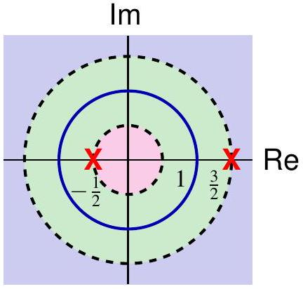
:::
::::

## 线性常系数差分方程

LTI 系统的输入输出满足
$$
\sum_{k=0}^N a_k y[n-k] = \sum_{k=0}^M b_k x[n-k]
$$
对两边取 Z 变换
$$
\sum_{k=0}^N a_k z^{-k} Y(z) = \sum_{k=0}^M b_k z^{-k} X(z)
$$
故系统函数
$$
H(z)=\frac{Y(z)}{X(z)}=\frac{\sum_{k=0}^M b_k z^{-k}}{\sum_{k=0}^N a_k z^{-k}}
$$
系统函数总是有理的。**差分方程本身不指定 ROC**，需要额外条件（如稳定性、因果性）来确定 $h[n]$。

## 例

考虑 LTI 系统：
$$
y[n]-\frac12 y[n-1]=x[n]+\frac13 x[n-1]
$$
系统函数
$$
H(z)=\frac{1+\frac13 z^{-1}}{1-\frac12 z^{-1}}
$$
ROC 有两种可能：$|z|>\frac12$ 和 $|z|<\frac12$。

1. 若 $|z|>\frac12$
$$
\frac{1}{1-\frac12 z^{-1}}=\sum_{n=0}^\infty \left(\frac12\right)^n z^{-n} \stackrel{z^{-1}}{\longleftrightarrow} \left(\frac12\right)^n u[n]
$$
由线性性和时移性质得
$$
h[n]=\left(\frac12\right)^n u[n] + \frac13\left(\frac12\right)^{n-1} u[n-1]
$$

## 例（续）

2. 若 $|z|<\frac12$
$$
\frac{1}{1-\frac12 z^{-1}}=\frac{-2z}{1-2z}=-\sum_{n=1}^\infty 2^n z^n \stackrel{z^{-1}}{\longleftrightarrow} -\left(\frac12\right)^n u[-n-1]
$$
故
$$
h[n]=-\left(\frac12\right)^n u[-n-1] - \frac13\left(\frac12\right)^{n-1} u[-n]
$$

若使用傅里叶变换，则频率响应为
$$
H(e^{j\omega})=\frac{1+\frac13 e^{-j\omega}}{1-\frac12 e^{-j\omega}}
$$
对应的 $h[n]$ 为因果形式。

**原因**：傅里叶变换方法隐含假设系统稳定（ROC 包含单位圆，即 $|z|>\frac12$），一般不适用于不稳定系统。

## 例

考虑差分方程
$$
y[n]-\frac34 y[n-1]+\frac18 y[n-2]=2x[n]
$$
系统函数
$$
H(z)=\frac{2}{1-\frac34 z^{-1}+\frac18 z^{-2}}
$$
部分分式展开得
$$
H(z)=\frac{4}{1-\frac12 z^{-1}} - \frac{2}{1-\frac14 z^{-1}}
$$
对应的冲激响应（三种 ROC）：
$$
\begin{cases}
h_1[n]=4\left(\frac12\right)^n u[n]-2\left(\frac14\right)^n u[n], & |z|>\frac12 \\
h_2[n]=-4\left(\frac12\right)^n u[-n-1]-2\left(\frac14\right)^n u[n], & \frac14<|z|<\frac12 \\
h_3[n]=-4\left(\frac12\right)^n u[-n-1]+2\left(\frac14\right)^n u[-n-1], & |z|<\frac14
\end{cases}
$$

## 例（续）

输入 $x[n]=\left(\frac14\right)^n u[n]$，$X(z)=\frac{1}{1-\frac14 z^{-1}}$，$|z|>\frac14$。

输出 Z 变换
$$
Y(z)=H(z)X(z)=\frac{2}{\left(1-\frac12 z^{-1}\right)\left(1-\frac14 z^{-1}\right)^2}
$$
仅在 $|z|>\frac12$ 和 $\frac14<|z|<\frac12$ 时有定义（$h_3*x$ 无定义）。

部分分式展开后:

$$Y(z) = - \frac{4}{1 - \frac{1}{4}z^{-1}} - \frac{2}{(1 - \frac{1}{4}z^{-1})^2} + \frac{8}{1 - \frac{1}{2}z^{-1}}$$

为了求得时域序列 $y[n]$，我们需要对照常用的 z-变换对。假设系统是**因果**的（即 $ROC$ 向外延伸）：

### 1. 基础变换项
对于第一项和第三项，我们使用标准形式 $a^n u[n] \longleftrightarrow \frac{1}{1-az^{-1}}$：

* **第一项：** $-4 \cdot \left( \frac{1}{4} \right)^n u[n]$
* **第三项：** $8 \cdot \left( \frac{1}{2} \right)^n u[n]$

## 例（续）

### 2. 高阶极点项
对于第二项，我们使用含重根的变换对 $(n+1)a^n u[n] \longleftrightarrow \frac{1}{(1-az^{-1})^2}$：

* **第二项：** $-2 \cdot (n+1) \left( \frac{1}{4} \right)^n u[n]$

### 时域结果

将上述各项合并，得到最终的时域序列 $y[n]$：

$$y[n] = \left[ -4\left( \frac{1}{4} \right)^n - 2(n+1)\left( \frac{1}{4} \right)^n + 8\left( \frac{1}{2} \right)^n \right] u[n]$$

进一步化简 $y[n]$：

$$y[n] = \left[ -(2n+6)\left( \frac{1}{4} \right)^n + 8\left( \frac{1}{2} \right)^n \right] u[n]$$

### 极点分布说明

该系统在 $z$-平面上有两个极点：
* $z = \frac{1}{4}$ （二阶极点）
* $z = \frac{1}{2}$ （一阶极点）

由于所有极点都在单位圆内 ($|z| < 1$)，如果系统是因果的，那么它也是**稳定**的。

## $\frac{1}{(1-az^{-1})^n}$逆 z-变换推导(多重极点情况)

首先回顾等比级数的求和公式：

:::: {.columns style="text-align: left;"}

::: {.column width="50%"}

   $$\frac{1}{1 - a\zeta} = \sum_{n=0}^{\infty} a^n \zeta^n, \quad |a\zeta| < 1$$

:::
::: {.column width="50%}

   $$\frac{1}{1 - a\zeta} = -\sum_{n=-\infty}^{-1} a^n \zeta^n, \quad |a\zeta| > 1$$

:::
::::

令 $\zeta = z^{-1}$。通过对上述基础形式进行多次求导，可以得到 $m$ 阶极点的变换对：

对于右边序列（因果系统），其逆 z-变换为：

$$\binom{n + m - 1}{m - 1} a^n u[n] \xleftrightarrow{\mathcal{Z}} \frac{1}{(1 - az^{-1})^m}, \quad |z| > |a|$$

对于左边序列（非因果系统），其逆 z-变换为：

$$(-1)^m \binom{-n - 1}{m - 1} a^n u[-n - m] \xleftrightarrow{\mathcal{Z}} \frac{1}{(1 - az^{-1})^m}, \quad |z| < |a|$$

* **组合数符号**：$\binom{n}{k}$ 表示从 $n$ 个元素中取 $k$ 个的组合数。
* **阶数 $m$**：当 $m=1$ 时，公式退化为最基本的指数序列变换对。
* **收敛域 (ROC)**：相同的代数表达式 $\frac{1}{(1 - az^{-1})^m}$ 根据收敛域选择的不同，对应完全不同的时域序列。

## 例

:::: {.columns style="text-align: left;"}

::: {.column width="80%"}
因果 LTI 系统
$$
y[n]-\frac12 y[n-1]=x[n]+\frac23 x[n-1]
$$
输入 $x[n]=\left(-\frac23\right)^n u[n]$。

$$
H(z)=\frac{1+\frac23 z^{-1}}{1-\frac12 z^{-1}}, \quad |z|>\frac12
$$
$$
X(z)=\frac{1}{1+\frac23 z^{-1}}, \quad |z|>\frac23
$$
$$
Y(z)=\frac{1}{1-\frac12 z^{-1}}, \quad |z|>\frac12 \Longrightarrow y[n]=\left(\frac12\right)^n u[n]
$$

由于 $z=-\frac23$ 处零极点抵消，$Y(z)$ 的 ROC 大于 $X(z)$ 和 $H(z)$ ROC 的交集。

:::
::: {.column width="20%"}

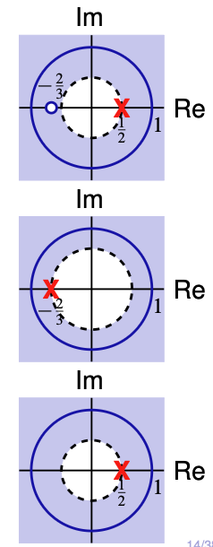{width="80%"}
:::
::::

## 例

已知：
1. 输入 $x_1[n]=\left(\frac16\right)^n u[n]$ 时，输出 $y_1[n]=\left[a\left(\frac12\right)^n + 10\left(\frac13\right)^n\right] u[n]$
2. 输入 $x_2[n]=(-1)^n$ 时，输出 $y_2[n]=\frac74 (-1)^n$

求 $H(z)$。

由条件1得
$$
H(z)=\frac{Y_1(z)}{X_1(z)}=\frac{[(a+10)-(5+\frac{a}{3})z^{-1}](1-\frac16 z^{-1})}{(1-\frac12 z^{-1})(1-\frac13 z^{-1})}
$$
由条件2：$H(-1)=\frac74$，解得 $a=-9$，从而
$$
H(z)=\frac{(1-2z^{-1})(1-\frac16 z^{-1})}{(1-\frac12 z^{-1})(1-\frac13 z^{-1})}
$$

## 例（续）

$H(z)$ 有三种可能的 ROC：
- $|z|<\frac13$
- $\frac13<|z|<\frac12$
- $|z|>\frac12$

由 $Y_1(z)$ 的 ROC 包含 $X_1$ 和 $H$ 的 ROC 交集，可知 ROC 为 $|z|>\frac12$（稳定）。又 $H(\infty)=1$ 有限，故系统因果。

对应的差分方程为
$$
y[n]-\frac56 y[n-1]+\frac16 y[n-2]=x[n]-\frac{13}6 x[n-1]+\frac13 x[n-2]
$$

## 系统互连

**串联（级联）系统**：
$$
Y=(X H_1)H_2 = X(H_1 H_2) = (X H_2)H_1
$$

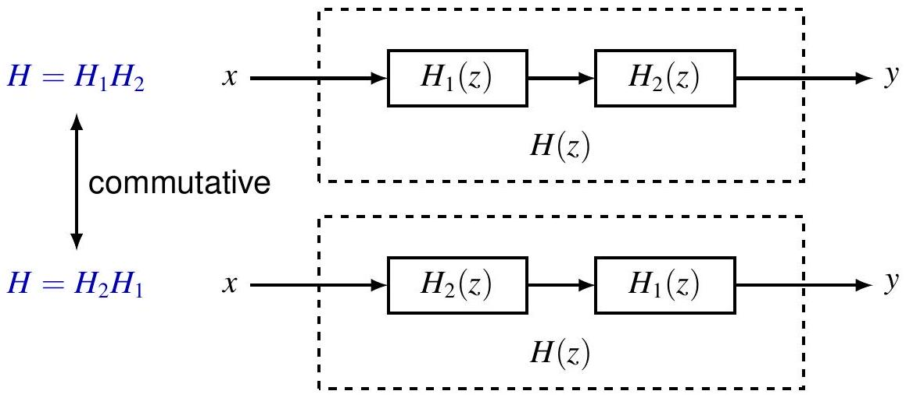

## 系统互连

**并联系统**：
$$
h=h_1+h_2, \quad H=H_1+H_2
$$

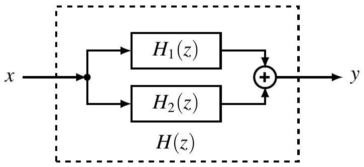

## 系统互连

**反馈系统**：
$$
H=\frac{H_1}{1+H_1 H_2}
$$

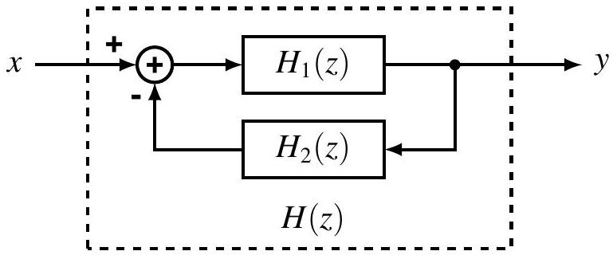

## 例（直接形式）

因果系统 $H(z)=\frac{1}{1-a z^{-1}}$，$|z|>|a|$ 对应差分方程
$$
y[n]-a y[n-1]=x[n]
$$
（初始松弛条件）。

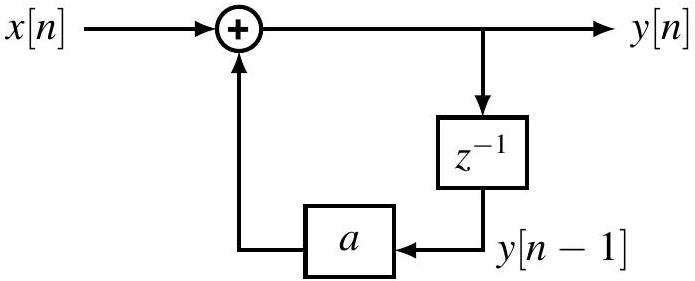

## 例（直接形式 II）

$$
H(z)=\frac{1-b z^{-1}}{1-a z^{-1}}
$$

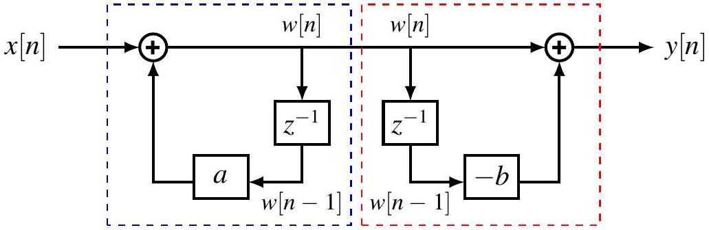

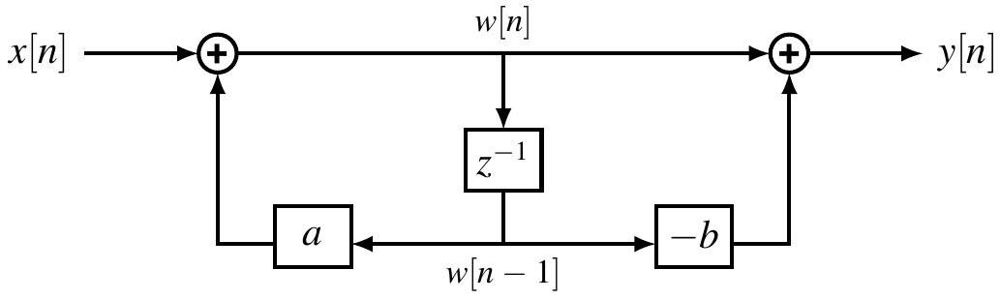

## 例（直接形式）

$$
H(z)=\frac{1}{(1+\frac12 z^{-1})(1-\frac14 z^{-1})}=\frac{1}{1+\frac14 z^{-1}-\frac18 z^{-2}}
$$
对应差分方程
$$
y[n]+\frac14 y[n-1]-\frac18 y[n-2]=x[n]
$$

**直接形式**

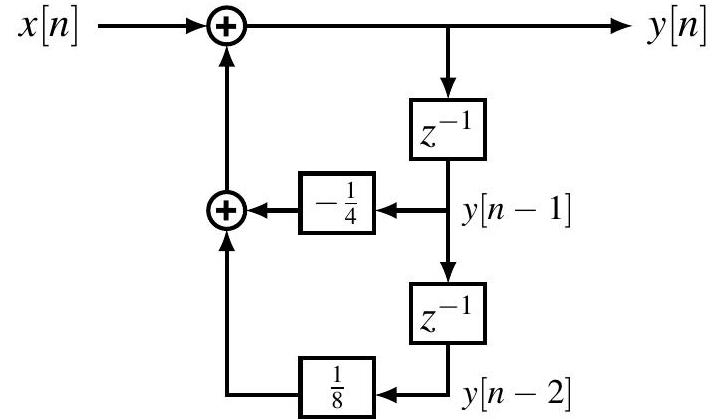

## 例（级联（串联）形式）

**级联（串联）形式**

$$H(z)=\frac{1}{(1+\frac12 z^{-1})(1-\frac14 z^{-1})} = \frac{1}{1 + \frac{1}{2}z^{-1}} \cdot \frac{1}{1 - \frac{1}{4}z^{-1}}$$
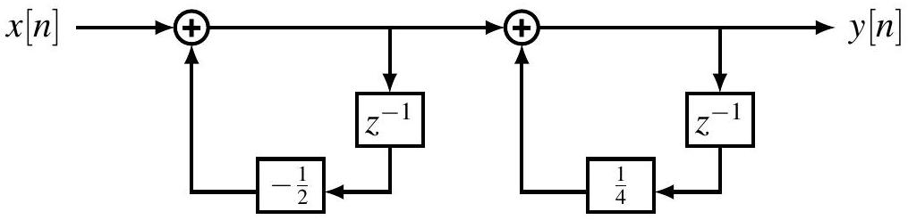

## 例（并联形式）

**并联形式**

$$H(z)=\frac{1}{(1+\frac12 z^{-1})(1-\frac14 z^{-1})}=\frac{2/3}{1 + \frac{1}{2}z^{-1}} + \frac{1/3}{1 - \frac{1}{4}z^{-1}}$$

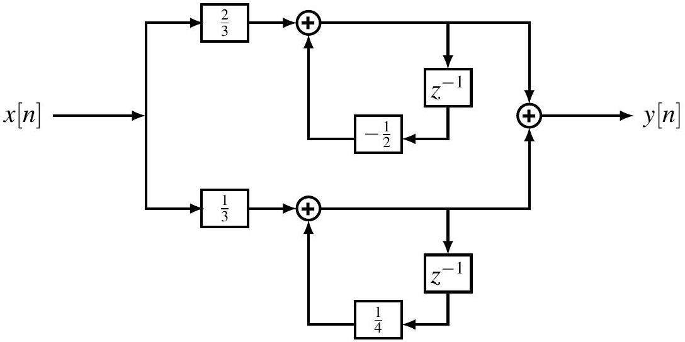

## 目录 {#toc5}

- [1. 引言](#sec91)
- [2. Z变换](#sec92)
- [3. Z变换性质](#sec93)
- [4. 常用Z变换对](#sec94)
- [5. 用Z变换分析与表征线性时不变系统](#sec95)
- [**6. 单边Z变换**](#sec96)

# 单边Z变换 {#sec96}

## 单边 Z 变换

双边 Z 变换：
$$
X(z)=\sum_{n=-\infty}^{\infty} x[n]z^{-n}
$$
单边 Z 变换（单侧 Z 变换）：
$$
X(z)=\sum_{n=0}^{\infty} x[n]z^{-n}
$$
也记作 $\mathcal{UZ}\{x\}$ 或 $x[n]\stackrel{uz}{\longleftrightarrow} X(z)$。

注意：$\mathcal{UZ}\{x\}=\mathcal{Z}\{x u[n]\}$。

- 单边 Z 变换的 ROC 总是圆外区域（包含 $\infty$）
- 有理情况下 $\deg N \leq \deg D$
- $\mathcal{Z}\{x\}=\mathcal{UZ}\{x\}$ 当且仅当 $x[n]=0$（$n<0$）

## 例

单边 Z 变换的计算与双边几乎相同，只需对 $n\geq 0$ 求和。

**例**：$x_1[n]=a^n u[n]$，
$$
X_1(z)=\frac{1}{1-a z^{-1}}, \quad |z|>|a|
$$

**例**：$x_2[n]=a^{n+1} u[n+1]=x_1[n+1]$，
理论上 $z X_1(z)$，但实际计算得 $\frac{a}{1-a z^{-1}}$。

## 单边逆 Z 变换

单边逆 Z 变换计算方法与双边相同，但只能恢复 $n\geq 0$ 的值。

**例**：
$$
X(z)=\frac{3-\frac56 z^{-1}}{(1-\frac14 z^{-1})(1-\frac13 z^{-1})}=\frac{1}{1-\frac14 z^{-1}}+\frac{2}{1-\frac13 z^{-1}}
$$
ROC 只能是 $|z|\geq \frac13$，故
$$
x[n]=\left(\frac14\right)^n + 2\left(\frac23\right)^n, \quad n\geq 0
$$
$X(z)$ 对 $n<0$ 无信息。

## 单边逆 Z 变换

判断 $\frac{z^2}{z - a}$ 是否是一个有效的单边 z-变换？

**结论：**
该函数 **不是 (NOT)** 一个有效的单边 z-变换。

**原因分析：**
对于单边 z-变换，其有理函数形式 $H(z) = \frac{N(z)}{D(z)}$ 必须满足分母多项式的阶数不小于分子多项式的阶数。

在该示例中：
* 分母阶数 $\text{deg } D = 1$
* 分子阶数 $\text{deg } N = 2$

由于 **$\text{deg } D < \text{deg } N$**，该表达式不符合单边 z-变换的定义要求。

### 深入理解

1. **物理意义**：
   在单边 z-变换的定义中，$X(z) = \sum_{n=0}^{\infty} x[n]z^{-n}$。这意味着变换结果应该是关于 $z^{-1}$ 的幂级数。
   
2. **长除法验证**：
   如果对 $\frac{z^2}{z-a}$ 进行长除法，结果会包含 $z^1$ 项：
   $$\frac{z^2}{z-a} = z + a + \frac{a^2}{z-a}$$
   项 $z$（即 $z^1$）对应于时域中的 $x[-1]$。由于单边 z-变换只考虑 $n \ge 0$ 的信号，因此包含正幂次 $z$ 的函数在单边变换中是无效的。

## 判定准则总结

一个有理函数 $H(z)$ 是有效单边 z-变换的必要条件是：
* 它必须是**真有理分式**或**弱真有理分式**。
* 即：分子最高阶数 $\le$ 分母最高阶数。

| 阶数关系 | 是否有效 (单边) | 包含的时域分量 |
| :--- | :--- | :--- |
| $\text{deg } N \le \text{deg } D$ | **是** | 仅包含 $n \ge 0$ 的项 |
| $\text{deg } N > \text{deg } D$ | **否** | 包含 $n < 0$ 的项 (如 $\delta[n+1]$) |

## 单边 Z 变换的性质

多数性质与双边相同。

| 性质               | 信号               | 单边 Z 变换                  |
|--------------------|--------------------|------------------------------|
| -                  | $x[n]$             | $X(z)$                       |
| 线性               | $a x[n]+b y[n]$    | $a X(z)+b Y(z)$              |
| z 域尺度变换       | $z_0^n x[n]$       | $X(z/z_0)$                   |
| 时间扩展           | $x_{(k)}[n]$       | $X(z^k)$                     |
| 共轭               | $x^*[n]$           | $X^*(z^*)$                   |
| z 域微分           | $n x[n]$           | $-z \frac{d}{dz} X(z)$       |
| 初值定理           | $x[0]=\lim_{z\to\infty} X(z)$ | - |

## 单边 Z 变换的卷积性质

单边 z-变换的卷积性质相比双边变换有着更严格的前提条件。

若序列 $x[n]$ 和 $y[n]$ 满足**因果性**条件，即：
对于 $n < 0$，有 $x[n] = y[n] = 0$

则它们的单边 z-变换满足：
$$(x * y)[n] \xleftrightarrow{\mathcal{UZ}} \mathcal{X}(z)\mathcal{Y}(z)$$

### 证明

1. **观察时域**：由于 $x[n]$ 和 $y[n]$ 均为因果序列，它们的卷积 $(x * y)[n]$ 同样在 $n < 0$ 时为 $0$。
2. **等价性**：当 $x[n] = x[n]u[n]$ 时，单边 z-变换 $\mathcal{UZ}\{x\}$ 等于双边 z-变换 $\mathcal{Z}\{x\}$。
3. 因此
   $$\mathcal{UZ}\{x * y\} = \mathcal{Z}\{x * y\} = \mathcal{Z}\{x\}\mathcal{Z}\{y\} = \mathcal{UZ}\{x\}\mathcal{UZ}\{y\}$$

### 注意

**$x[n] = y[n] = 0$ ($n < 0$) 这个假设至关重要！** 如果序列在负半轴有值，单边 z-变换的卷积性质将不再成立。

## 单边 Z 变换的卷积性质 （反例演示）

考虑以下非因果序列的情况：

**已知：**
* $x[n] = \delta[n] - \delta[n - 1] \implies \mathcal{X}(z) = 1 - z^{-1}$
* $y[n] = \delta[n + 1]$

**计算单边变换：**
由于单边变换忽略 $n < 0$ 的部分，对于 $y[n]$：
$$\mathcal{Y}(z) = \mathcal{UZ}\{\delta[n + 1]\} = 0$$
（注意：此处 $\delta[n+1]$ 在 $n=-1$ 处的值被丢弃了）

**计算卷积：**
在时域进行卷积：
$$(x * y)[n] = (\delta[n] - \delta[n - 1]) * \delta[n + 1] = \delta[n + 1] - \delta[n]$$

**验证不等式：**
对卷积结果取单边变换：
$$\mathcal{UZ}\{x * y\} = \mathcal{UZ}\{\delta[n + 1] - \delta[n]\} = -1$$
而直接乘积为：
$$\mathcal{X}(z)\mathcal{Y}(z) = (1 - z^{-1}) \cdot 0 = 0$$

**结论：**
$$\mathcal{UZ}\{x * y\} = -1 \neq \mathcal{X}(z)\mathcal{Y}(z)$$
证明了对于非因果序列，单边 z-变换的卷积性质失效。

## 单边 Z 变换的时延性质

$$
x[n-m] \stackrel{uz}{\longleftrightarrow} z^{-m}\left(X(z)+\sum_{k=1}^m x[-k]z^k\right)
$$

### 证明

**1. 根据单边 z-变换定义展开：**

$$\mathcal{UZ}\{x[n - m]\} = \sum_{n=0}^{\infty} x[n - m]z^{-n}$$

**2. 变量替换 (Variable Substitution)：**

令 $k = n - m$，则 $n = k + m$。当 $n=0$ 时，$k=-m$；当 $n \to \infty$ 时，$k \to \infty$。
代入求和式，并将与 $k$ 无关的项 $z^{-m}$ 提取到求和号外：

$$= z^{-m} \sum_{k=-m}^{\infty} x[k]z^{-k}$$

**3. 分解求和区间：**

为了得到标准的单边 z-变换项 $\mathcal{X}(z)$，我们将求和区间拆分为负时间部分（$k = -m$ 到 $-1$）和正时间部分（$k = 0$ 到 $\infty$）：

$$= z^{-m} \left( \sum_{k=0}^{\infty} x[k]z^{-k} + \sum_{k=-m}^{-1} x[k]z^{-k} \right)$$

## 单边 Z 变换的时延性质

由于第一项即为 $\mathcal{X}(z)$，最终表达式为：

$$= z^{-m} \left( \mathcal{X}(z) + \sum_{k=-m}^{-1} x[k]z^{-k} \right)$$

### 常用公式参考

对于 $m=1$ 的特殊情况（单位延迟）：
$$\mathcal{UZ}\{x[n-1]\} = z^{-1}\mathcal{X}(z) + x[-1]$$

对于 $m=2$ 的情况：
$$\mathcal{UZ}\{x[n-2]\} = z^{-2}\mathcal{X}(z) + x[-1]z^{-1} + x[-2]$$

## 单边 Z 变换的时间超前性质

$$
x[n+m] \stackrel{uz}{\longleftrightarrow} z^m \left(X(z)-\sum_{k=0}^{m-1} x[k]z^{-k}\right)
$$

### 证明

$$\mathcal{UZ}\{x[n + m]\} = \sum_{n=0}^{\infty} x[n + m]z^{-n}$$

**变量替换：**， 令 $k = n + m$，则 $n = k - m$。当 $n=0$ 时，$k=m$。

$= z^{m} \sum_{k=m}^{\infty} x[k]z^{-k}$

**补项与提取：**为了凑出完整的 $\mathcal{X}(z)$，我们需要补上 $k=0$ 到 $m-1$ 的项，并同步减去：
$$= z^{m} \left( \sum_{k=0}^{\infty} x[k]z^{-k} - \sum_{k=0}^{m-1} x[k]z^{-k} \right)$$
$$= z^{m} \left( \mathcal{X}(z) - \sum_{k=0}^{m-1} x[k]z^{-k} \right)$$

## 单边 Z 变换的时间超前性质

### 核心结论

对于超前性质，单边 z-变换会**剔除**掉序列在左移过程中进入负时间轴的起始项。

**常用特例 ($m=1$)：**
$$\mathcal{UZ}\{x[n+1]\} = z\mathcal{X}(z) - zx[0]$$

## 用单边 Z 变换解线性常系数差分方程

差分方程
$$
\sum_{k=0}^N a_k y[n-k]=\sum_{k=0}^M b_k x[n-k]
$$
已知初始条件 $y[-1],\dots,y[-N]$ 及因果输入 $x[n]=0$（$n<0$）。

单边 Z 变换后可分离出**零状态响应**和**零输入响应**。

对等式两边进行单边 z-变换  
$$\sum_{k=0}^{N} a_k z^{-k} \left[ \mathcal{Y}(z) + \sum_{\ell=-k}^{-1} y[\ell] z^{-\ell} \right] = \sum_{k=0}^{M} b_k z^{-k} \mathcal{X}(z)$$

### 求解结果

$$\mathcal{Y}(z) = \underbrace{\frac{\sum_{k=0}^{M} b_k z^{-k}}{\sum_{k=0}^{N} a_k z^{-k}} \mathcal{X}(z)}_{\text{零状态响应  }} - \underbrace{\frac{\sum_{k=0}^{N} a_k z^{-k} \sum_{\ell=-k}^{-1} y[\ell] z^{-\ell}}{\sum_{k=0}^{N} a_k z^{-k}}}_{\text{零输入响应  }}$$

## 例

差分方程
$$
y[n]+2 y[n-1]=x[n]
$$
初始条件 $y[-1]=\beta$，输入 $x[n]=\alpha u[n]$。

对等式两边进行单边 z-变换  
$$\mathcal{Y}(z) + 2z^{-1}(\mathcal{Y}(z) + y[-1]z) = \mathcal{X}(z) = \frac{\alpha}{1 - z^{-1}}$$

### 求解结果 

假设 $y[-1] = \beta$，整理上式可得：

$$\mathcal{Y}(z) = \underbrace{\frac{1}{1 + 2z^{-1}} \cdot \frac{\alpha}{1 - z^{-1}}}_{\text{零状态响应  }} + \underbrace{\frac{-2\beta}{1 + 2z^{-1}}}_{\text{零输入响应 }}$$

## 例（续）

$$\mathcal{Y}(z) = \underbrace{\frac{1}{1 + 2z^{-1}} \cdot \frac{\alpha}{1 - z^{-1}}}_{\text{零状态响应  }} + \underbrace{\frac{-2\beta}{1 + 2z^{-1}}}_{\text{零输入响应  }}$$

### 零输入响应

当输入为零，即 $\alpha = 0$ 时：

$$y_{zi}[n] = -2\beta(-2)^n, \quad n \ge 0$$

### 零状态响应

当初始状态为零，即 $\beta = 0$ 时（**系统处于初始松弛状态**）：

$$\mathcal{Y}_{zs}(z) = \frac{1}{1 + 2z^{-1}} \cdot \frac{\alpha}{1 - z^{-1}} = \frac{2\alpha/3}{1 + 2z^{-1}} + \frac{\alpha/3}{1 - z^{-1}}$$

此时对应的时域序列为：

$$y_{zs}[n] = \frac{2\alpha}{3}(-2)^n + \frac{\alpha}{3}, \quad n \ge 0$$

## 例

考虑如下差分方程：
$$y[n] - y[n - 1] - 2y[n - 2] = x[n] + 2x[n - 2]$$
**初始条件**：$y[-1] = 2, y[-2] = -\frac{1}{2}$；**输入**：$x[n] = u[n]$。

### 单边 z-变换求解
对等式两边取单边 z-变换：
$$\mathcal{Y}(z) - z^{-1}(\mathcal{Y}(z) + y[-1]z) - 2z^{-2}(\mathcal{Y}(z) + y[-1]z + y[-2]z^2) = (1 + 2z^{-2})\mathcal{X}(z)$$

代入初始条件并整理得：
$$\mathcal{Y}(z) = \underbrace{\frac{1 + 2z^{-2}}{1 - z^{-1} - 2z^{-2}} \cdot \frac{1}{1 - z^{-1}}}_{\text{零状态响应  }} + \underbrace{\frac{2z^{-1}y[-1] + y[-1] + 2y[-2]}{1 - z^{-1} - 2z^{-2}}}_{\text{零输入响应  }}$$

### 最终分解形式
$$\mathcal{Y}(z) = \underbrace{\frac{1 + 2z^{-2}}{(1 + z^{-1})(1 - 2z^{-1})(1 - z^{-1})}}_{\text{零状态响应}} + \underbrace{\frac{4z^{-1} + 1}{(1 + z^{-1})(1 - 2z^{-1})}}_{\text{零输入响应}}$$

## 例 （续）

1. 零输入响应

对于零输入响应部分，其 z-域表达式为：

$$\mathcal{Y}_{zi}(z) = \frac{4z^{-1} + 1}{(1 + z^{-1})(1 - 2z^{-1})} = \frac{-1}{1 + z^{-1}} + \frac{2}{1 - 2z^{-1}}$$

**求解时域序列：**

$$y_{zi}[n] = 2^{n+1} + (-1)^{n+1}, \quad n \ge 0$$

2. 零状态响应
   
对于零状态响应部分，结合输入信号后的 z-域表达式为：

$$\mathcal{Y}_{zs}(z) = \frac{1 + 2z^{-2}}{(1 + z^{-1})(1 - 2z^{-1})(1 - z^{-1})}$$

**进行部分分式展开：**

$$= \frac{1/2}{1 + z^{-1}} + \frac{2}{1 - 2z^{-1}} + \frac{-3/2}{1 - z^{-1}}$$

**求解时域序列：**

$$y_{zs}[n] = \frac{1}{2}(-1)^n + 2^{n+1} - \frac{3}{2}, \quad n \ge 0$$

## 作业

1. 10.4
2. 10.5 
3. 10.8
4. 10.10
5. 10.15  

---

<section style="
  min-height: 100vh;
  display: flex;
  flex-direction: column;
  justify-content: center;
  align-items: center;
  text-align: center;
">
  

<h1>第九章   Z变换   完</h1>
  

</section>