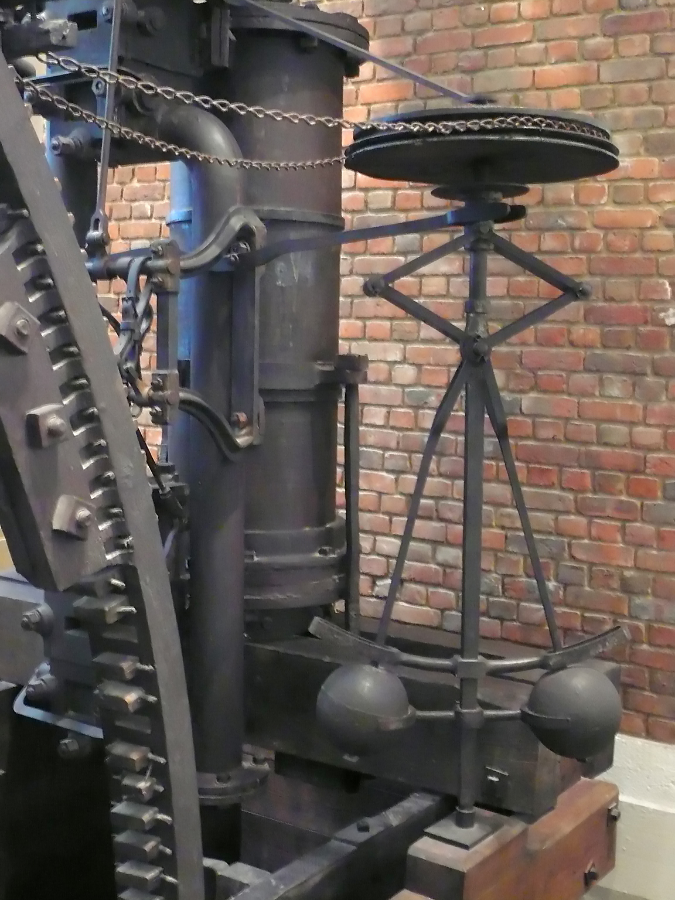
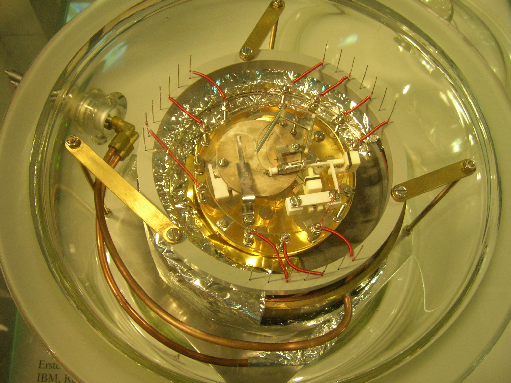
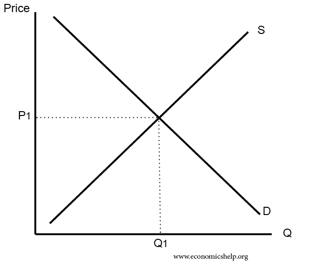

---
title: "郭雷院士讲座：反馈原理的十个实际应用实例"
subtitle: "基于UCAS网文整理（2016年国科大讲座）"
author: "整理自 https://news.ucas.ac.cn/xshd/3372e5c765654b1484ab443d311ccb62.htm"
date: "`r Sys.Date()`"
format:
  html:
    toc: true
    toc-depth: 3
    number-sections: true
    theme: cosmo
  pdf:
    documentclass: article
    toc: true
---

## 引言

郭雷院士在2016年国科大讲座中，介绍了系统科学基本概念后，一口气列举了**十个反馈原理在实际中的应用实例**，涵盖工程、生物、医学、军事、航天和经济等领域，生动说明反馈在自然科学、工程技术、社会经济中无处不在。

以下按原文顺序整理，每个例子包含简要说明和相关图片。

---

## 1. 瓦特蒸汽机背后的离心调速器（Centrifugal Governor）

瓦特蒸汽机通过离心调速器实现负反馈，自动调节蒸汽阀门，维持转速稳定。这是经典的机械反馈控制实例。

---

## 2. 使越洋电话电缆成为可能的反馈放大器（Feedback Amplifier）

反馈放大器（由Harold Black等发明）解决了长距离信号衰减问题，通过负反馈稳定放大，使跨洋电话电缆实用化，是通信工程里程碑。

---

## 3. 1986年诺贝尔物理学奖表彰的扫描隧道显微镜（Scanning Tunneling Microscope）

STM利用反馈控制针尖与样品表面距离，实现原子级成像，1986年诺贝尔物理学奖授予其发明者。

---

## 4. 血糖平衡调节（Blood Glucose Regulation）

人体通过胰岛素和胰高血糖素的负反馈循环维持血糖稳定，是生物反馈的典型例子。

---

## 5. 生态系统的平衡（Ecosystem Balance）

生态系统中存在正负反馈循环（如捕食者-猎物关系），维持种群和环境平衡。

---

## 6. 帕金森疾病与丘脑输出及反馈治疗

帕金森病与丘脑输出失衡相关，现代治疗常用闭环深脑刺激（DBS）等反馈控制技术。

---

## 7. 汽车巡航控制系统（Cruise Control System）

汽车巡航控制通过速度传感器和反馈调节油门，维持设定车速，是日常工程反馈应用。

---

## 8. 高机动性战斗机与飞控反馈技术

现代战机（如F-16）依赖飞控系统的反馈控制，实现高机动性飞行，弥补气动不稳定性。

---

## 9. 阿波罗登月计划中的反馈控制

阿波罗计划中，登月舱着陆、姿态控制等大量使用反馈控制系统，确保精确操作，是航天反馈控制的典范。

---

## 10. 市场经济调节原理（“看不见的手”）

价格机制通过供求反馈自动调节生产和消费，实现经济平衡，是社会经济中的反馈实例。

---

## 总结

这些例子充分展示了反馈（尤其是负反馈）在维持系统稳定、实现目标中的核心作用。理解这些实例后，可进一步学习反馈控制的设计方法（如自适应控制等），系统科学正是研究复杂系统调控的前沿学科。

:::{.callout-note}
**参考来源**：中国科学院大学新闻 https://news.ucas.ac.cn/xshd/3372e5c765654b1484ab443d311ccb62.htm
:::